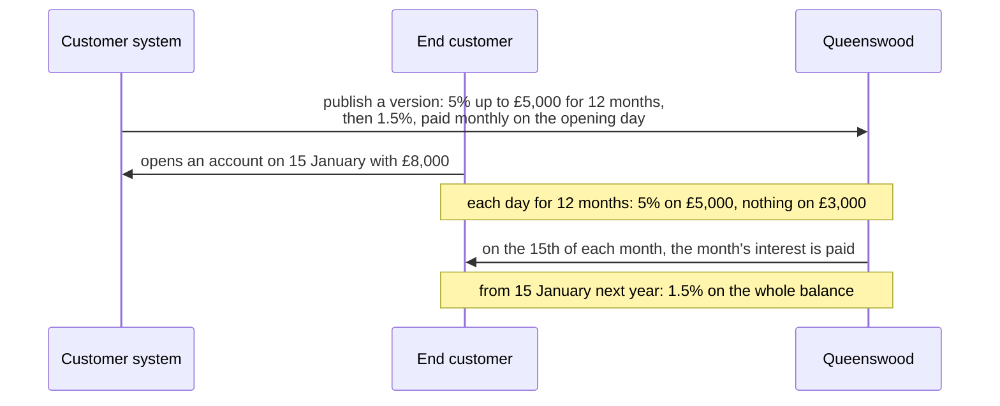
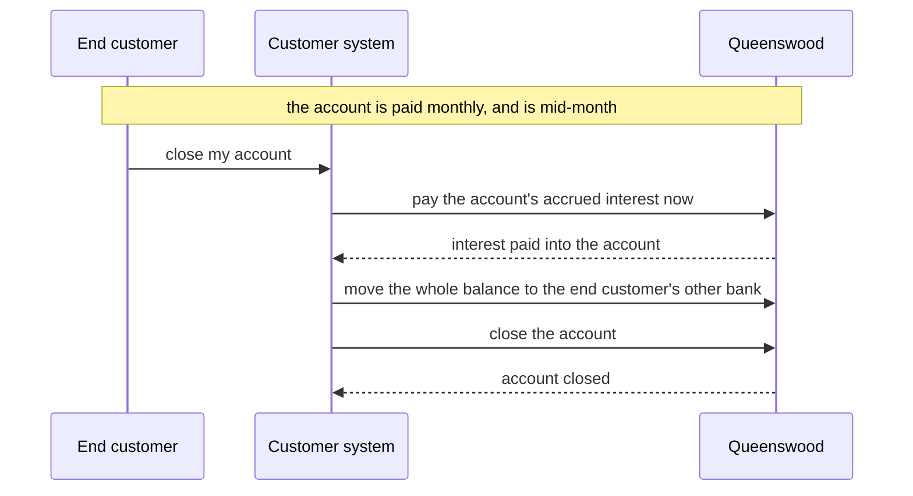
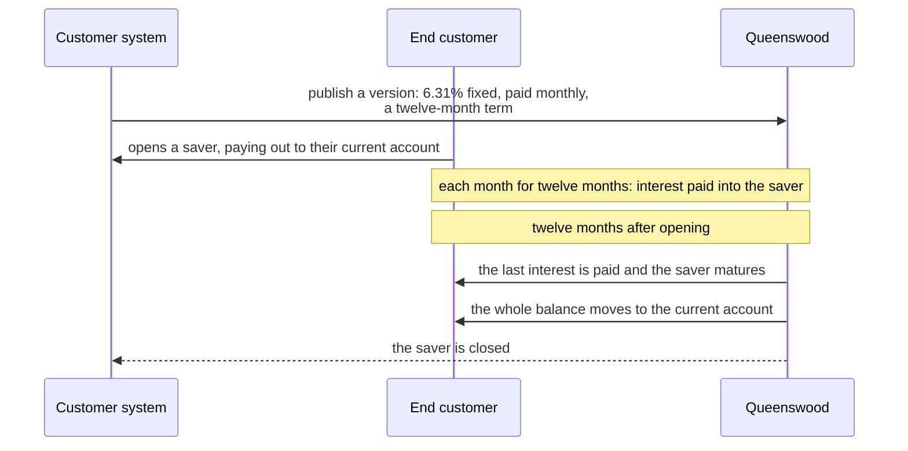

# Plan: a version's terms — interest rates and rewards

A brief for the session that designs how a cash account product
version expresses its interest rate and its rewards. It says what
exists, what has been asked, what binds the answer, and what to settle
first.

The rate is settled: a schedule of steps, each a set of balance bands,
with a day count and a payment schedule, in
[cash-account-products](../tdd/cash-account-products.md#interest-terms)
and [interest](../tdd/interest.md#a-versions-interest-terms). Questions
1 and 5 below are answered for the rate; the rest are the rewards'.

## What exists

- **The rate.** `CashAccountProduct.interest_rate_bps`, one required
  `int32` per version, in
  [cash-account-product.proto](/components/schema/resources/schemas/cash-account-products/cash-account-product.proto).
  Accrual reads it once per account per day in `interest/accrue.clj`
  and `interest/domain/accrual.clj`, actual/365, at sub-unit precision
  carried between days.
- **The reward promised.** `CashAccountProduct.reward_terms`, a list of
  `RewardTerms { kind, amount }` in minor units of the version's one
  `currency`, `REWARD_KIND_OPENING` the one kind.
- **The reward paid.** The `Reward` record in
  [reward.proto](/components/schema/resources/schemas/rewards/reward.proto),
  one per account and `RewardKind`, `DUE` or `PAID`, written by the
  reward processor as an account opens.
- **The interest runs.** `InterestRun` and `InterestAccountRun` in
  [interest-run.proto](/components/schema/resources/schemas/interest/interest-run.proto),
  one accrual or capitalisation per bank per day and per account.
- **The version.** One currency, terms fixed once published, an
  effective window, and accounts pinned to the version they opened on
  until a migration moves them.

## What has been asked

From the open questions in the [interest PRD](../prd/interest.md) and
the known limitations of the [rewards TDD](../tdd/rewards.md):

- **Tiered or stepped rates:** 5% on the first £10,000, 3% above.
- **A rate that changes within a version,** for a promotional period,
  rather than by publishing a new version.
- **A reward with a condition:** paid once a balance is reached, or
  after a period, or after a first deposit.
- **A second kind of reward,** and whether a version lists its rewards
  or carries a field per kind.
- **A bound on what a version may promise,** as a policy limit on the
  reward amount.

Per-currency rates within one version no longer arise: a version holds
one `currency`.

## What binds the answer

- The clean slate: nothing stored has to stay readable, so the shape
  can change freely until the next release.
- [record-protos](../recipes/code/record-protos.md): one record per
  file, the field bands, `required` meaning required, `_by` on every
  act.
- A published version's terms never change. Anything that varies over
  a version's life has to be stated in the terms when they are
  published, or the version is superseded.
- A migration moves accounts between versions, so terms are compared
  across versions when a migration is previewed.
- Interest stays integer arithmetic and non-negative, at actual/365 or
  actual/actual.

## What to settle first

1. Is a rate one number, or a schedule — tiers by balance, steps by
   date — and does accrual read it as a function of balance and day?
2. Does a version carry a field per reward kind, or a list of reward
   terms each with a kind and conditions?
3. What does a reward condition wait on: a balance, a date, an event on
   the account? Which of those does the processor already hear?
4. Do rates and rewards share a shape, as a version's terms, or stay
   separate?
5. What does the API take and return for each, and what does the
   console's product drawer show?

## Rules a version may need

A regular saver offered to existing customers — 6.31% fixed for twelve
months, paid monthly, up to £300 a month, one per customer, for
current-account holders only, withdrawals to the customer's own
accounts, and the balance paid out at the end of the term — fits the
rate, the payment and the term. Its other rules have no home, and
neither has a rate that depends on what the customer does:

- **A cap on money in, per account per month.** Policy limits have a
  monthly window, but a policy binds to an account or an account type,
  never to a product, an inbound payment checks only a daily count,
  and an internal payment, which is how a customer funds a saver from
  their current account, checks nothing.
- **One account per customer on a product.** The account-count limit
  filters by product type, not by product, and counts per bank, not
  per party.
- **Opening only for holders of another product.** Nothing makes
  opening an account conditional on what else the party holds.
- **Withdrawals only to the customer's own accounts.** Nothing limits
  where a product's debits may go.
- **A rate that depends on what the customer does.** A rate that drops
  in a month with more than so many withdrawals, or holds only while
  so much is paid in each month.

The question for each is whether it is a term of the version, checked
by the brick that owns the act, or a policy that a version can bind,
and whether it shares a shape with a reward's condition.

## Interest journeys to add

Each joins the [interest PRD](../prd/interest.md)'s user journeys with
its scenario under `journeys/interest/`, in the slice that builds it,
since the corpus test holds every journey there to a scenario.

#### 5. End customer earns a bonus rate, then the standard rate

The customer states a twelve-month bonus capped at £5,000
once, when it publishes the version. Every account opened on
it gets its own twelve months from the day it opened, and is
paid on its own day of the month.

#### 6. End customer closes an account with interest owed

The end customer leaves with every penny accrued up to the
day they closed, not just up to the last payment day.

#### 7. A regular saver matures

The end customer saves for a fixed term and finds the money in their
current account when it ends, with nothing to do. Had they closed
that current account in the meantime, the saver would wait, matured,
until they named another.

Read before starting: the [interest TDD](../tdd/interest.md), the
[rewards TDD](../tdd/rewards.md),
[cash-account-products](../tdd/cash-account-products.md),
[statementing](statementing.md) for how interest paid is reported, and
the [cash-account-products PRD](../prd/cash-account-products.md).
