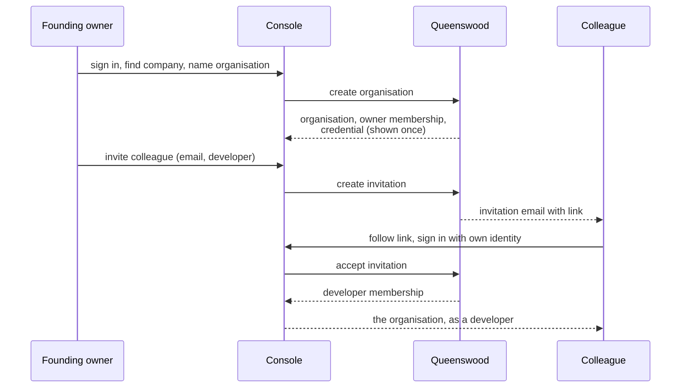
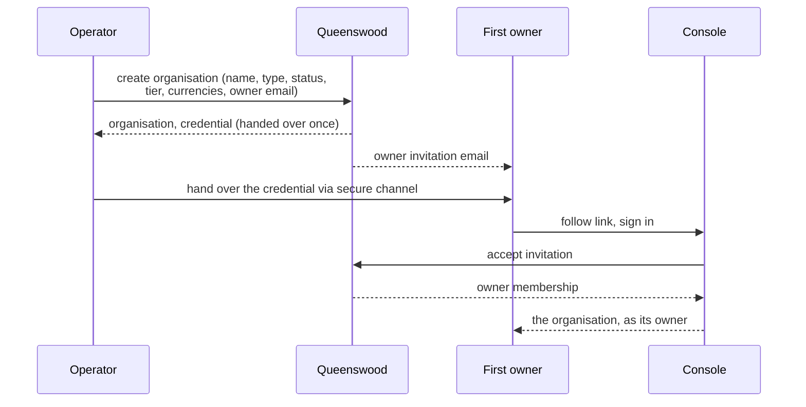
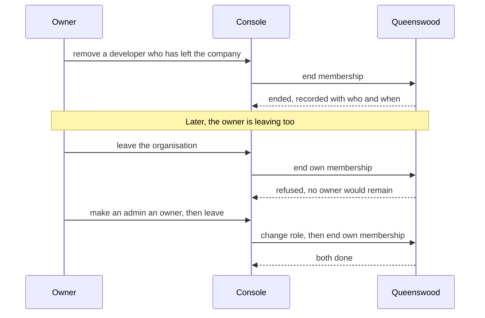
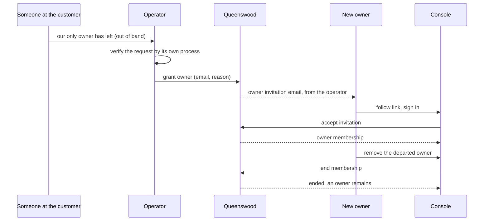
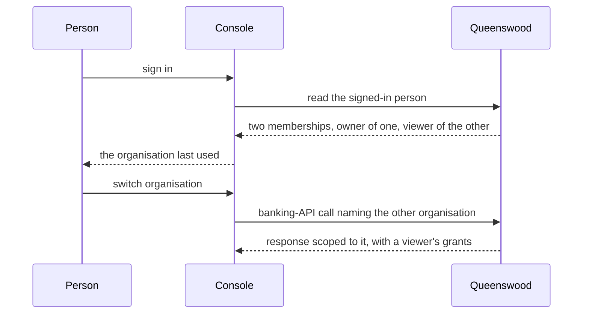

# Access

## Objective

An organisation on the Queenswood platform is operated by people, and
no path today puts a team in front of a live one. A person who signs in
to the console gets a test organisation that only they can reach. A
platform operator who creates an organisation for a customer gets a
credential and nobody who can sign in. Neither can gain a second person,
and nothing turns one into the other.

Access is the journey that joins them: how a person signs in, how an
organisation comes to have its first owner, how that owner brings
colleagues in with a role that decides what each may do, how people
change role and leave, how one person works across several
organisations, and how an operator returns a locked-out organisation to
its owners. It ends in the same place whichever way the organisation was
created — live, and operated by a team.

This PRD is the organisation as a workplace. [onboarding](onboarding.md)
is the organisation as a banking entity: what it is created with, the
credential its systems hold, and its move from test to live. The line
between them is the moment a person presses create. Everything up to it
is here, and what the press produces is onboarding's.

Invitations, and so most of what follows, wait on the platform being
able to send email, which it cannot. The outbound-communication issue
tracks that.

## Users and stakeholders

**Customer team.** The people at the customer who run its relationship
with the platform — a founder, an operations lead, finance and support
staff, and engineers acting as themselves. Each signs in with their own
identity and holds a role in every organisation they belong to. The
first of them wants colleagues alongside them, a way to go live, and not
to be the one person whose absence locks everyone out. The rest want an
invitation that is plainly from their organisation, and to see only what
their role allows.

**Customer.** The company the people act for. Cares about who can act on
its behalf, being able to change that set itself, and a record of every
change.

**Platform operator.** Creates organisations for customers the platform
signs up itself and hands each to a named person, moves an organisation
to live, and puts a locked-out organisation back in its owners' hands.
Cares about every act of theirs being recorded as theirs, and about
never having to bypass a rule to do the job.

**Compliance and risk.** Reviews who has access to what. Cares about
joiners, movers and leavers being visible after the fact, and about no
organisation being operable by nobody, or by somebody who should have
left.

The customer engineering team is not a reader here. Its systems act with
the organisation's credential and never sign in, and what that
credential is and reaches is [onboarding](onboarding.md)'s. End
customers are parties and never sign in either — [parties](parties.md).

## Goals

- **One identity per person.** A person signs in with an identity the
  platform federates — Google today — and the platform stores no
  password. The same identity resolves to the same person on every
  sign-in, and name, email and avatar refresh from the provider each
  time.
- **One door.** Every person enters by signing in with their own
  identity. An organisation is created by the person who will own it or
  by an operator on a customer's behalf, and either way it ends in the
  same state: at least one owner who can sign in, a credential its
  systems hold, and the starting state [onboarding](onboarding.md)
  describes.
- **Invitations.** An owner or admin invites a colleague by email with a
  role. The colleague signs in with their own identity and accepts, and
  the accepted invitation becomes their membership. An invitation
  expires, can be sent again, and can be withdrawn.
- **Roles that decide.** Owner, admin, developer and viewer each grant a
  fixed set of things a person may do. The console and the banking API
  refuse what the role does not grant. A role is not a label on a
  record.
- **Movers and leavers.** An owner or admin changes a colleague's role
  or removes them. A removed person is refused from their next action
  onward, keeps their identity and their other organisations, and leaves
  a record of when they were there and who removed them.
- **Never ownerless.** The platform refuses any change that would leave
  an organisation with no owner — removing or demoting the last owner,
  or the last owner leaving. The rule binds operators too, and they
  never need to bypass it.
- **One person, many organisations.** A person may belong to several
  organisations with a different role in each, chooses which one they
  are acting in, and is never scoped to whichever the platform happened
  to find first.
- **Operator handover and recovery.** An operator names the first owner
  of an organisation they created, and grants an owner to any
  organisation that has lost its last one. Each grant carries a reason
  and is recorded as the operator's act, visible to the organisation.
- **Test to live keeps the team.** An organisation moves from test to
  live as the same organisation: its people, roles and pending
  invitations carry across, and nobody is invited again.
- **Every change recorded.** Who invited whom with what role, who
  accepted and as which identity, every role change and removal, and
  every operator act — each with who did it and when.
- **Multi-tenant isolation.** People, invitations and their history are
  visible only inside the organisation they belong to, and to the
  operator.

## Non-goals

- **Sending the email.** Delivering an invitation is the
  outbound-communication capability, and this PRD says only what the
  email carries. Until it exists an inviter passes the invitation on
  themselves, as Invitations describes.
- **Identity providers beyond Google.** Others are reserved and not
  wired. A second provider needs configuration at the federation broker
  and a sign-in screen that offers the choice.
- **Passwords, multi-factor enrolment, lockout.** The platform runs no
  credential store of its own. The identity provider owns all of that.
- **A profile screen.** Name and avatar are the identity provider's, and
  the platform claims no other profile fields.
- **The organisation's starting state.** What an organisation is created
  with, the credential and its one-time handover, the tier and the move
  to live are [onboarding](onboarding.md).
- **Custom roles or per-person permissions.** Four fixed roles. No
  editing what a role grants, no permissions on an individual, no teams
  or groups within an organisation.
- **Scoping the credential by role.** An organisation's own systems act
  with the credential and its full authority. See Open questions.
- **Suspending or deleting a person.** A person's identity outlives
  every membership. Stopping them signing in anywhere is the identity
  provider's disable flow; stopping them acting in one organisation is
  removal, below.
- **Closing an organisation.** Off-boarding a customer is
  [onboarding](onboarding.md)'s open question.
- **End customers.** The people whose money moves are parties, never
  people who sign in — [parties](parties.md).
- **Approval workflows.** No second person has to approve an invitation,
  a role change or a removal. See Open questions.

## Functional scope

A person uses the console to sign in, to create or enter an
organisation, and to manage the people in it. An operator uses the
banking API and the console to create organisations, hand them over,
and recover them. Everything the console does is available through the
banking API.

### Signing in

The console sends the person to the identity provider, they sign in
there, and they come back signed in. The first time an identity signs
in, the platform records the person — name, email and avatar as the
provider reports them — and every later sign-in finds the same person
and refreshes those three. Email is how an invitation finds someone,
never how the platform tells people apart, so a change of email at the
provider does not make a second person. Every action the console takes
on the person's behalf is attributable to them by name.

What the person sees next depends on what is waiting for them:

- **Invitations pending** for the email they signed in with — each
  naming the organisation, the role and who sent it, to accept or
  decline, before anything else.
- **Organisations they belong to** — the one they last worked in, or a
  choice when there is more than one.
- **Neither** — the offer to create an organisation.

A colleague invited before they ever signed in is never steered into
creating an organisation of their own by mistake.

### Creating an organisation

**By the person who will own it.** From the console, with nothing
waiting for them or from the organisation switcher, a person finds the
company they act for on the official register, confirms it, and names
the organisation. The platform creates it as [onboarding](onboarding.md)
describes — test, the entry tier, sterling, bound to the confirmed
company — with the person as its only owner, and shows them the
credential once. A person who already belongs to an organisation may
create another, each bound to its own company.

**By an operator, for a customer.** The operator's creation call names
the email address of the person who will own the organisation. The call
still returns the credential once, for the operator to hand over, and
the organisation starts with a pending owner invitation in that person's
name and no member. The operator may add the first owner afterwards
instead, through the same grant that recovers a locked-out
organisation.

Until the invitation is accepted the organisation has no owner and the
operator is its only recourse. The operator's view lists every
organisation in that state.

### Roles

A membership carries one of four roles. Each includes everything below
it.

- **Viewer** sees everything the organisation can see — its accounts,
  parties, payments, products, the policies in force, its people and
  their history — and changes nothing.
- **Developer** does what the organisation's own systems do through the
  banking API: registers parties, opens and manages accounts, submits
  payments, drafts and publishes products, registers webhook endpoints,
  runs jobs.
- **Admin** manages people: invites, changes the role of, and removes
  admins, developers and viewers. An admin cannot invite an owner or
  change what an owner is.
- **Owner** manages owners as well — invites them, promotes to and
  demotes from owner, removes them — and speaks for the organisation to
  the platform: asks for the move to live and, once rotation exists,
  rotates the credential. The founding owner is shown the credential
  once at creation.

A role bounds the person. The organisation's policies bound the
organisation. A person may do something only when both allow it: a
developer in an organisation whose tier denies outbound payments cannot
submit one, and a viewer cannot submit one however permissive the tier.
The refusal says which of the two refused.

The operator is not a role within an organisation. An operator acts on
any organisation as the platform, and every such act is recorded as the
operator's, not as a member's.

### Invitations

An owner or admin invites a colleague by email address, choosing the
role the colleague will hold. An admin may not choose owner. One
invitation may be pending per address per organisation, and an address
that already belongs to a member is refused.

The platform sends the invitation by email: the organisation's name, who
sent it, the role, and a link to accept it that stops working when the
invitation expires or is withdrawn. Until the platform can send email,
the console shows the inviter the same link to pass on by a channel of
their own. The invitation is the link. Email is its delivery.

An invitation is pending until one of four things happens:

- **Accepted.** The invitee follows the link, signs in — or is already
  signed in — and sees the organisation, the role and who invited them.
  Accepting creates their membership with that role. The platform
  records the identity that accepted, the address that was invited, who
  invited and when. The people list shows both addresses, so an
  invitation accepted by someone other than the person it was sent to
  is visible to whoever sent it.
- **Declined.** The invitee says no, and the inviter sees that they
  did.
- **Withdrawn.** An owner or admin withdraws it, and the link stops
  working.
- **Expired.** Nothing happened within its lifetime of seven days. An
  owner or admin sends it again, which starts a fresh lifetime with a
  fresh link.

A signed-in person also sees any pending invitation addressed to the
email they signed in with, so an invitee who arrives at the console
without the link still finds it. Accepting adds the organisation to
those the person belongs to and leaves the others as they were.

### Managing people

The console lists the organisation's people — name, email, role, when
they joined and who invited them — and its pending invitations.

- **Changing a role.** An owner sets any member's role. An admin sets
  the role of an admin, developer or viewer to one of those three. The
  new role applies from the person's next action.
- **Removing a member.** An owner removes anyone. An admin removes an
  admin, developer or viewer. The removed person's next action in this
  organisation is refused; their identity and their other organisations
  are untouched. The membership is kept, ended, with who removed it and
  when — a person removed and later invited again holds a new
  membership, not the old one revived.
- **Leaving.** A member leaves an organisation themselves, on the same
  terms as a removal.

### Never ownerless

The platform refuses any change that would leave an organisation with no
owner: removing the last owner, demoting the last owner, the last owner
leaving. The refusal says why and what to do first — make someone else
an owner. The rule binds operators as well as members: an operator
replacing a departed founder grants the new owner first and removes the
old one second, and never needs a bypass.

An organisation an operator created has no owner until its first
invitation is accepted. That is not a removal, so the rule does not
apply. The operator's view shows every organisation with no owner, and
an expired first invitation is sent again from there.

### Working across organisations

A person belongs to as many organisations as have invited them or as
they have created, with a role in each. The console shows which
organisation the person is acting in, offers the others in a switcher,
and returns to the one they last used on their next sign-in. Every
action the console takes names the organisation it is for. The platform
refuses one the person does not belong to and applies the role they hold
there — an owner of one organisation is a viewer in another if that is
what they were invited as.

The banking API scopes a signed-in person's call to the organisation the
call names, never to the first one the platform finds.

### Operator handover and recovery

An operator sees every organisation's people and invitations, and on any
organisation can:

- **Grant an owner.** Name a person by email, with a reason. The grant
  is an owner invitation the platform issues in the operator's name, and
  the person accepts it as they would any other. This is both the
  handover of an organisation the operator created and the way back for
  one that has lost its last owner.
- **Withdraw an invitation, change a role, remove a member** — on the
  same terms as an owner, under the same never-ownerless rule.

How the operator satisfies itself that a request for recovery comes from
the company — a call, a signed letter, a check against the register — is
the operator's own process, outside the platform. What the platform
guarantees is that the act is recorded as the operator's, with the
reason given, and that the organisation's owners see it in their people
history alongside every change of their own.

### Going live

An organisation created through the console starts in test, and the
move to live is the operator's, as [onboarding](onboarding.md)
describes. The organisation that goes live is the one that was created:
same identifier, same people, same roles, same pending invitations, and
nobody is asked to sign up or accept again. An owner asks for the move.
How the ask reaches the operator is out of band today, and Open
questions has it.

### What is recorded

For every organisation, in the order it happened, visible to every
member whatever their role, and to the operator:

- Its creation — by which person, or by which operator.
- Each invitation — who sent it, to which address, with which role,
  when, and how it ended: accepted, by which identity and when;
  declined; withdrawn, by whom; expired.
- Each role change — whose, from what to what, by whom, when.
- Each removal or departure — whose, by whom, when.
- Each operator act — which operator, or the platform's own automation,
  and the reason given.

### Console screens

The journey is a handful of screens, each the surface for one of the
sections above:

- **Sign-in** — log in, for a person who has an organisation or an
  invitation waiting, and sign up, for a person who will create one.
  Both sign in with Google.
- **Invitations waiting** — what a signed-in person sees first when any
  are pending: organisation, role, who sent it, accept or decline.
- **Choose an organisation** — when a person belongs to more than one
  and has no last-used one, and the switcher in the console's header
  thereafter, with "create another" at its foot.
- **Create an organisation** — the register lookup, confirmation and
  naming as today, followed by the credential shown once.
- **People** — members with role, joined and invited-by, pending
  invitations with expiry, the history of changes, and the invite,
  change-role, remove and withdraw actions the viewer's own role
  allows.
- **Invite** — an address, a role, and the link to copy while the
  platform cannot send it.
- **Accept an invitation** — what the link lands on: the organisation,
  the role, who invited, accept or decline, with sign-in in front of it
  when the person is not signed in.
- **Organisations, for the operator** — every organisation with its
  owners, those with none called out, and the grant-an-owner action
  with its reason.

### Multi-tenant isolation

People, invitations and history belong to one organisation and are
visible only inside it, and to the operator. An invitation reveals to
its recipient the organisation's name, the role and who sent it, and
nothing else until it is accepted. Which organisations a person belongs
to is visible to that person and to the operator, never to another
organisation.

## User journeys

### 1. A founding owner brings in a colleague

The founder signs up as today, then invites a colleague with a role. The
colleague signs in with their own identity, accepts, and is inside the
same organisation with what a developer may do. Until the platform can
send email, the founder copies the link from the console and sends it
themselves.

### 2. An operator creates an organisation and hands it over

The operator's creation call names the first owner. The credential
still goes to the operator once, as [onboarding](onboarding.md)
describes, and the person named accepts the owner invitation on their
first sign-in. The organisation now has an owner who can invite the rest
of the team.

### 3. A colleague leaves, and the last owner cannot

Removal takes effect from the removed person's next action and leaves a
record. The owner's own departure is refused while nobody else owns the
organisation, and goes through once somebody does.

### 4. The only owner is gone

The customer reaches the operator by whatever channel exists between
them. The operator grants a new owner with a reason, the new owner
accepts and removes the old one, and the organisation's history shows
the operator's grant beside the removal.

### 5. Working in two organisations

A consultant who acts for two companies owns one organisation and views
another. The console lands them where they last were, the switcher
moves them, and every call carries the organisation it is for and the
role held there.

## Open questions

- **Matching the invited address.** Accepting is by link, and the
  identity that accepts is recorded and shown. Whether the platform
  should instead refuse an acceptance whose signed-in email differs from
  the invited one — stricter against a forwarded link, worse for a
  person whose sign-in address is an alias — is open.
- **Invitation lifetime.** Seven days is the working assumption.
- **Asking to go live.** An owner asks out of band today. A request
  raised from the console and shown in the operator's view is the
  obvious surface, and is not designed.
- **Roles in live.** Whether a developer's grants should narrow once an
  organisation is live — submitting a payment in a sandbox is not
  submitting one for real — or whether that is the tier's job through
  policies rather than the role's.
- **Who may create an organisation.** Anyone who can sign in, today.
  Whether an installation may close self-service and admit organisations
  only through the operator is open.
- **Telling people about access changes.** An owner is not told when a
  colleague accepts, declines or is removed, nor when an operator acts
  on their organisation. Each is an email, and waits on the same
  capability as invitations.
- **Joining by domain.** Letting anyone who signs in with the company's
  email domain join as a viewer without an invitation.
- **Two-person rule.** Whether a change to who owns an organisation
  should need a second owner's approval.
- **Access reviews.** A periodic prompt to an owner to confirm each
  member should still be there, with the confirmation recorded.
- **Session end on removal.** A removed person is refused from their
  next action. Whether an open console session is ended at once depends
  on how quickly the console learns of the removal.
- **The credential and the people.** The organisation's systems act
  with full authority through the credential, and the founding owner
  alone sees it. Three things follow and none is designed: a credential
  an owner can mint or rotate from the console, which is
  [onboarding](onboarding.md)'s open question; a credential scoped like
  a role; and whether the credential is one day a kind of membership,
  so that a person and a system are told apart by the same record.
- **End customers who sign in.** The people who sign in today are the
  customer's team, not the customer's customers. Whether an end customer
  — a party — one day also gets an identity for self-service banking is
  open. The separation between the two stays either way, and the bridge
  is not designed.

## References

- **Creation**: [onboarding](onboarding.md) — the organisation's
  starting state, the credential, and the move to live. This PRD adds
  the first owner to the operator's door.
- **Bounds**: [policies](policies.md) — what the organisation may do,
  within which a role decides what a person may do.
- **Not people**: [parties](parties.md) — end customers, who never sign
  in.
- **Platform context**: [platform](platform.md) — the persona set this
  PRD's readers come from.
- **Engineering view**: [tdd/access](../tdd/access.md) for the design
  that serves this PRD; [tdd/onboarding](../tdd/onboarding.md) for the
  records and the console flow as built;
  [tdd/authentication](../tdd/authentication.md) for how a signed-in
  person is told apart from an organisation's systems and from an
  operator, and the gates the banking API applies today.
