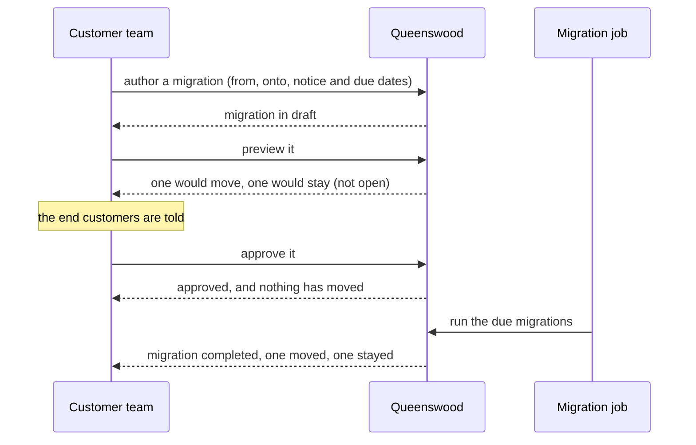
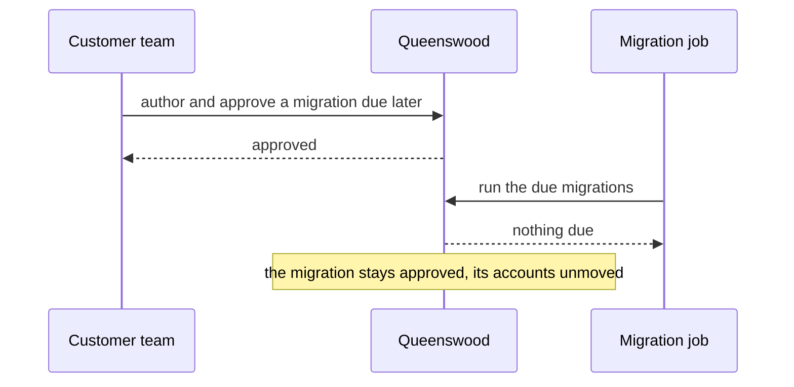
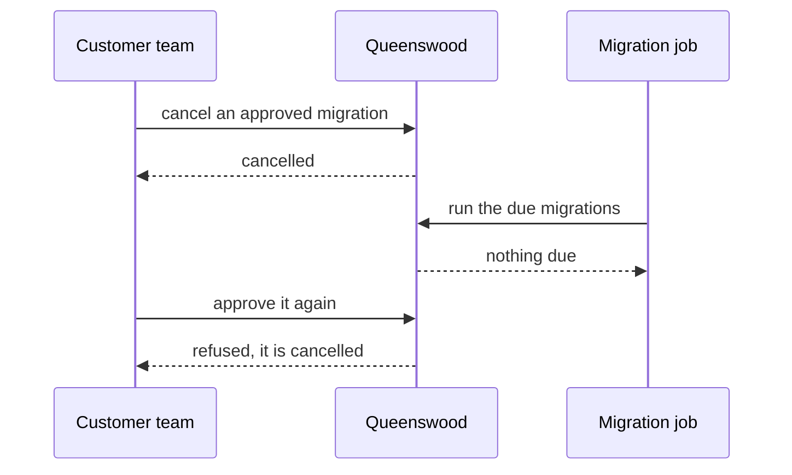

# Cash account migrations

## Objective

An account keeps the terms of the product version it opened under, so a
customer who changes its terms changes them for new accounts only. A
migration is how a customer moves its existing accounts onto other
terms: it names who moves and onto what, is previewed for what it would
do, is approved once the end customers have been told, and is carried
out by the bank's migration job on the date it falls due.

The terms themselves, drafting and publishing versions, are
[cash-account-products](cash-account-products.md)'s. The account is
[cash-accounts](cash-accounts.md)'s, and what it earns on its terms is
[interest](interest.md)'s. This PRD is the move between them.

## Users and stakeholders

**Customer team.** Decides that a group of end customers moves onto new
terms, previews what would happen, and approves it once they have been
told. Cares about: seeing who would not move and why before anything
happens, and nothing moving until it has been approved and falls due.

**Customer engineering team.** Authors and previews migrations through
the API on the customer team's behalf. Cares about: a preview that
decides exactly as the move will, and a record of what the move did.

**End customer.** Holds an account that moves. Cares about: being told
before their terms change, and their account carrying on as it was,
with the same number, addresses and balance.

**Compliance and risk.** Reviews a migration after the fact. Cares
about: when the end customers were told, who approved the move, and
what happened to every account.

## Goals

- **A move is a decision, not an edit.** A migration names the product
  it moves accounts from, the version it moves them onto, and the dates
  the end customers are told and their accounts move.
- **Preview before anything moves.** A preview decides about every
  account as the move would, and records why any would stay, without
  moving one. It can be repeated until the move happens.
- **Nothing moves without approval and notice.** A migration is approved
  only with a notice date and a due date, the notice first.
- **Only the migration job moves accounts.** No request moves an
  account. The job moves every approved migration that is due, on its
  due date or once the new terms are in force, whichever is later.
- **An account that cannot move stays.** A closed or suspended account,
  or one in a currency the new terms do not offer, keeps its terms, and
  every other account still moves.
- **A record of what happened.** The move keeps its own record beside
  the previews, account by account, so what was expected and what
  happened can be compared.

## Non-goals

- **Changing the terms of a published version.** A published version
  never changes; new terms are a new version, which
  [cash-account-products](cash-account-products.md) covers.
- **Moving between kinds of account.** A migration moves accounts
  between products of the same kind, a savings product to a savings
  product.
- **Telling end customers.** The customer tells its end customers; the
  migration records when it did.
- **Moving a single account on request.** A migration moves a group,
  through the job.

## Functional scope

**Authoring a migration.** A customer uses the API to name the source
product, optionally narrowed to some of its versions, the target
version, and the notice and due dates. A target of another kind of
product, or one not yet published, is refused.

**Previewing.** A preview returns how many accounts it saw, how many
would move and how many would not, and a verdict for each account with
the reason where it would stay.

**Approving and cancelling.** Approval needs both dates. A draft or an
approved migration can be cancelled; one that has moved accounts
cannot.

**Running.** Every organisation's migration job runs daily, at a time
of day the customer may change. It moves every approved migration whose
due date has passed and whose target version is in force, marks it
completed, and records each account's outcome. A migration that is not
yet due waits, and is moved by the first run once it is.

## User journeys

### 1. Moving customers onto new terms

The customer team publishes new terms and moves its savers onto them.
The preview shows which accounts would move and which would stay and
why, approving changes nothing on its own, and the migration job moves
the accounts that can. The record of the move sits beside the preview,
so the two can be compared.

### 2. A migration waits for its date

A migration approved well ahead of its due date waits. The job passes
it by until the date arrives, and the accounts keep their terms until
then.

### 3. Calling off a migration

A customer that changes its mind cancels the migration, even once it is
approved and due. The job moves nothing for it, and it cannot be
approved again.

## Open questions

- **Choosing the accounts.** A migration moves the accounts of a
  product, or of some of its versions. Choosing them by currency,
  balance or customer segment, or naming them one by one, is not
  offered; meanwhile a customer narrows a migration by version.
- **A minimum notice period.** The notice must come before the move,
  but no gap is required between them; meanwhile the customer decides
  how much notice to give.
- **Seeing migrations from a product.** A product version cannot list
  the migrations that target it; meanwhile the migrations are listed on
  their own.
- **Moving accounts when publishing.** Publishing a version could offer
  to bring the existing accounts along; meanwhile that is a migration
  authored separately.
- **Migrations started by the platform.** A move across every bank,
  such as retiring a product the platform offers, is not modelled;
  meanwhile each bank moves its own accounts.

## References

- [cash-account-products](cash-account-products.md) — the products and
  versions a migration moves accounts between.
- [cash-accounts](cash-accounts.md) — the accounts that move, and the
  terms they keep until they do.
- [interest](interest.md) — what an account earns on the terms it is
  on.
- [platform](platform.md) — the personas and the platform this
  capability belongs to.
- [tdd/cash-account-migration](../tdd/cash-account-migration.md) — the
  design that serves this PRD.
