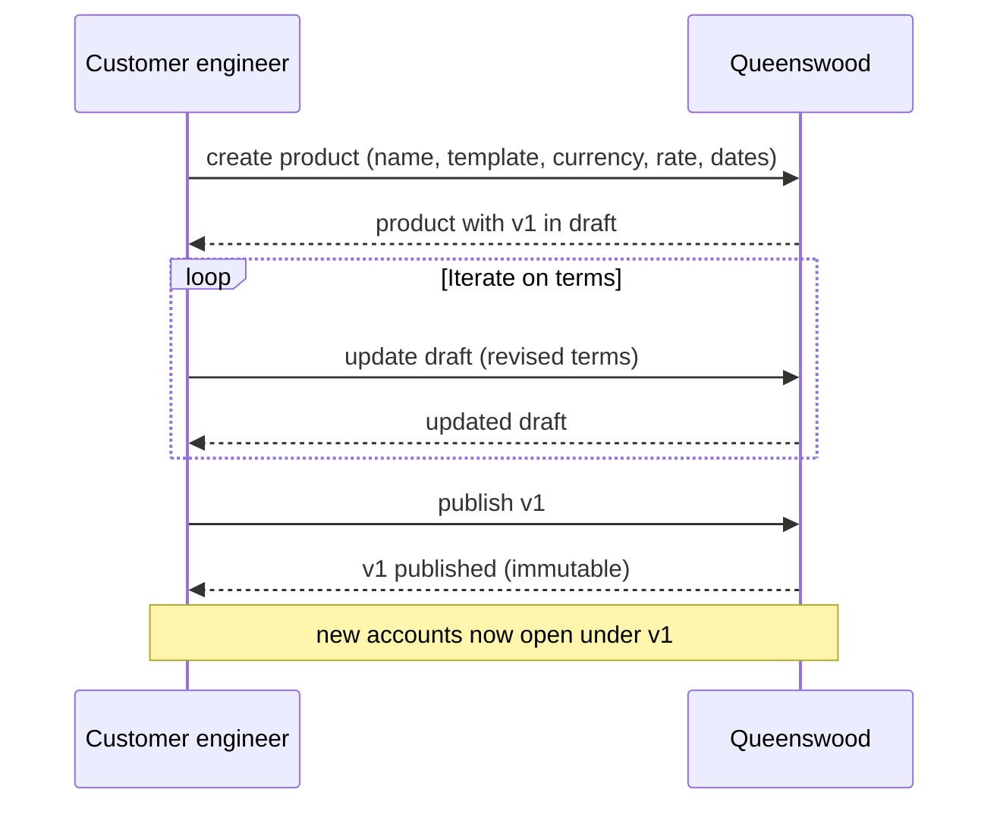
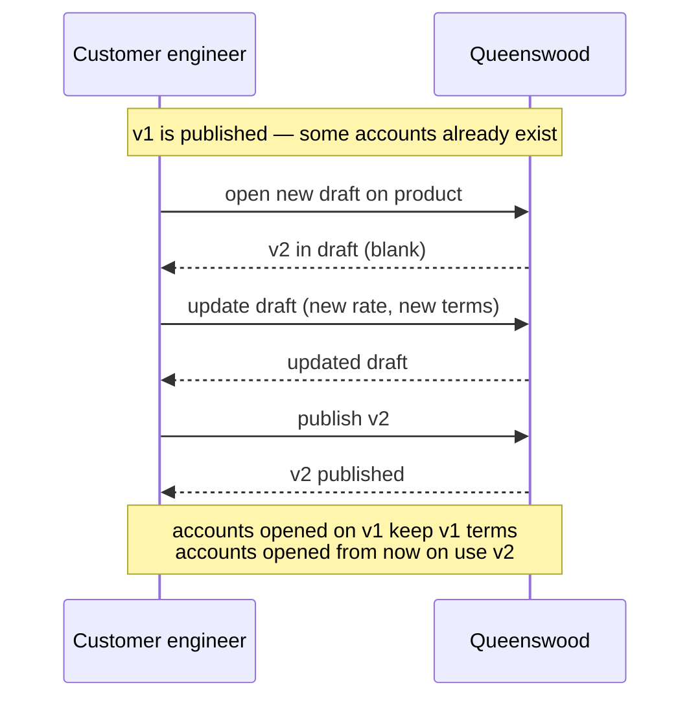
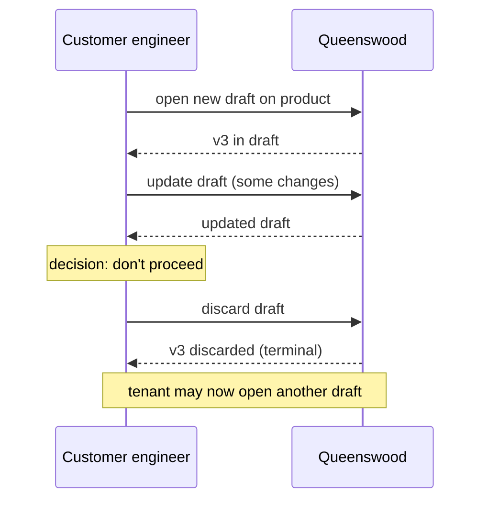
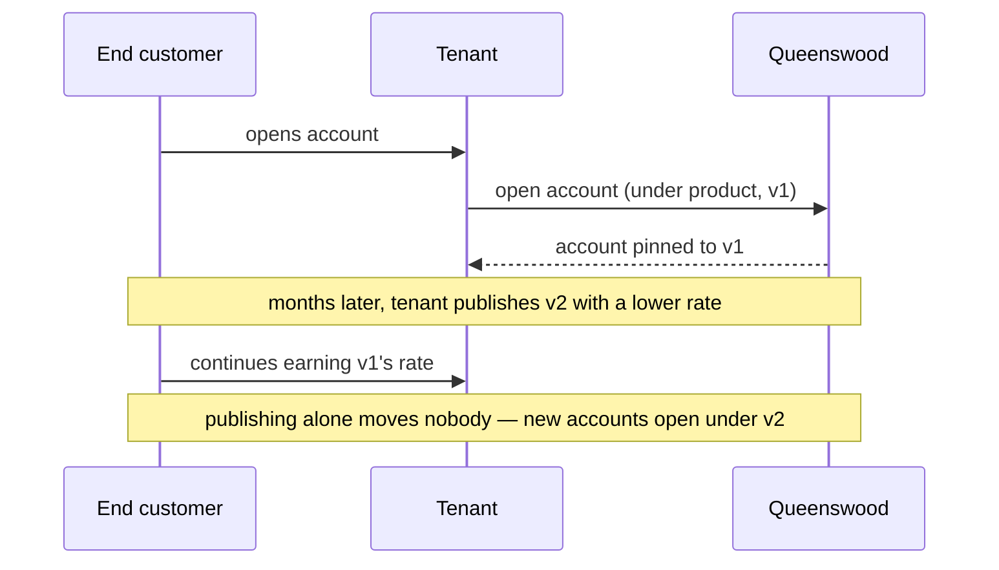

# Cash account products

## Objective

A **cash account product** is the set of terms under which a
tenant's customer accounts are opened — it settles the
currency, the interest rate, the balance buckets the
account will carry, and the payment-address schemes the
account will accept. Tenants design their own products and
**version** them: when terms change, a new version is
published, but accounts opened under previous versions keep
their original terms. This is the model that lets banking
products evolve over time without changing the terms under
the customers who signed up to the old ones.

## Users and stakeholders

**Customer engineering team.** The author of products. Drafts new products,
iterates on the terms, publishes them, and (when terms change) opens new
versions. Cares about: the freedom to design products that match the tenant's
commercial offering, the certainty that publishing is final, the ability to
evolve terms over time without disturbing existing customers.

**End customer.** Doesn't see the product directly, but
holds an account opened under a particular version of one.
Cares (implicitly) about: the terms they signed up to
remaining the terms they continue to receive.

**Compliance and risk, at the customer.** Reviews product terms before
publication. Cares about: the draft → published gate being explicit and
observable, the audit history of version changes being intact.

**Platform operator.** Sets policies that bound what products a tenant can offer
(e.g. capping the number of products, restricting product types).

## Goals

- **Tenant-defined products.** Each tenant designs its own
  products. The platform provides the shape; the tenant
  fills in the terms.
- **Versioned terms.** Every product carries a sequence of
  versions. New accounts open under the latest published
  version; existing accounts stay, by default, on the
  version they were opened under.
- **Immutable once published.** A published version's terms
  cannot be edited. To change terms, the tenant publishes a
  new version.
- **Draft / publish gate.** Drafts are mutable; publishing
  is the explicit step that locks the version. A draft can
  also be discarded if abandoned.
- **One draft at a time, per product.** Only one draft can
  be open against a product at any moment. This keeps the
  authoring workflow linear.
- **Multiple product types.** The platform supports current
  accounts, savings accounts, term deposits, and the
  internal product types used for the tenant's own
  bookkeeping (settlement, internal).
- **Built from a published template.** The platform
  publishes a menu of templates — one per product type — and
  every product is built from one of them. The template
  settles the mechanics; the tenant settles the commercial
  terms.
- **Dated versions.** A version states the date it takes
  effect and, optionally, the date it stops. A tenant can
  therefore publish a rate change ahead of time and let it
  start on the day it was announced for.
- **One currency per version.** A version pins a single
  currency, and every account opened under it holds that
  currency. A multi-currency offering is several products,
  one per currency.
- **Policy-bounded.** Platform-level policies cap the
  number of products a tenant can have and can restrict
  which product types a given tenant may draft.
- **Multi-tenant isolation.** Products belong to one
  tenant. Tenants don't see each other's products.

## Non-goals

- **Comparing versions.** The platform doesn't provide a
  diff between two versions. If a tenant wants to know
  "what changed between v2 and v3", they read both and
  compare.
- **Tenant-authored templates.** The menu is the platform's.
  A tenant chooses from it and cannot add to it or change
  what a template settles.
- **Parallel drafts.** Compliance and product teams cannot
  prepare independent draft versions of the same product
  in parallel. One draft at a time.
- **Cleanup of discarded drafts.** Discarded drafts are
  retained as history. There's no archival or pruning
  flow.
- **Tenant-specified balance buckets.** The shape of an
  account's balances (which balance buckets it carries) is
  settled by the template the product is built from.
  Tenants don't choose the bucket layout themselves.
  Letting them specify it directly would be too easy a way
  to break the bank's bookkeeping.

## Functional scope

A tenant uses the banking API to design, version, and
publish cash account products. Each product is a template;
each version of a product is a specific set of terms at a
point in time.

### Creating a product

The tenant reads the template menu from the banking API and
uses it to create a new product, supplying:

- A display name (e.g. "Premier Savings").
- The template it is built from. The template settles the
  product type, the balance buckets the account will carry,
  the payment-address schemes it will accept (e.g. UK Faster
  Payments), and which side of the bank's books the product
  sits on — the liability side for customer deposits, the
  typical case, or the asset side.
- The currency (an ISO 4217 string — e.g. `"GBP"`), which
  has to be one the template allows. It is a single
  currency, not a list.
- The interest rate, expressed in basis points (e.g. `550`
  for 5.5% APR). Optional.
- The date the version takes effect, and optionally the date
  it stops.

Creation produces the first version of the product, in
draft. The product itself has a stable identifier; versions
are numbered (v1, v2, v3, ...) within the product.

### Working with a draft

While a version is in draft, the tenant uses the banking
API to update its terms. Any field can change. The draft
remains open until the tenant publishes it or discards it.

Only one draft can exist for a given product at any time.
Attempting to open a second draft is rejected.

### Publishing

Publishing locks the version: from that moment on, its
terms are fixed. Any later change requires a new draft on
the same product.

### Opening a new version

Once a product has a published version, the tenant can
open a new draft to start the next version. The new draft
starts blank — it does not inherit fields from the previous
version. The tenant supplies the new terms in full.

### Discarding a draft

A draft can be discarded if the tenant decides not to
proceed with it. Discarded drafts are kept as history; the
slot is freed so the tenant can open a new draft on the
same product.

### Reading products

The tenant can read a product to see all its versions, and
can read the menu of templates products are built from.
There is also a way to get a product's active version — the
published one whose effective window covers today — which is
the version new accounts will open under.

### How accounts use products

When an account is opened, the platform reads the published
version of the product that is in effect that day and pins
both the product and that version to the account. Every
operation on the account that needs the terms — interest
accrual reading the rate, payment validation reading the
allowed schemes, currency checks reading the version's
currency — goes back to that specific version.

When the tenant later publishes a new version, only newly
opened accounts see the new terms. Existing accounts stay on
the version they were opened under unless the tenant authors
a migration and has it approved, which moves a cohort of
accounts onto a newer published version of the same product
type. Staying put is what happens by default, and that is
the cohort property the versioning model exists to deliver.

### Policy bounds

The platform enforces two kinds of bounds when a tenant
drafts products:

- **Capability** — whether the tenant is allowed to draft
  products at all, and whether they're allowed to draft
  products of a particular type. A tenant might be denied,
  say, the term-deposit product type by their tier.
- **Count limit** — a cap on the total number of products
  a tenant can have.

Both bounds come from the platform's policy machinery —
see [policies](policies.md).

## User journeys

### 1. Tenant designs and publishes a new product

The tenant designs the product as a draft, iterates on the
terms, and publishes when ready. From publication onwards,
new accounts open under v1 and inherit those terms.

### 2. Tenant changes terms (new version)

When market conditions or commercial decisions change the
terms, the tenant publishes a new version. The previous
cohort of accounts stays on the old terms; new customers
sign up to the new terms.

### 3. Tenant abandons a draft

The tenant can discard an in-flight draft. Once discarded,
the draft is closed for good; the tenant can open a fresh
draft on the same product if they want to start again.

### 4. End customer continues on their original terms

The cohort property in action: an existing customer's
account stays on the terms it was opened under, even after
the tenant publishes a new version with different terms.
Only an approved migration moves it.

## Open questions

- **Version comparison.** "What changed between v2 and v3?"
  is left to callers. A diff helper would make audit and
  compliance review easier.
- **Parallel drafts.** Compliance and product can't prepare
  independent drafts in parallel. The argument for the
  one-at-a-time invariant is simplicity; the cost is that
  two streams of changes have to be sequenced.
- **Discarded draft cleanup.** Discarded drafts accumulate.
  An archival or pruning pass would prevent the version
  list from growing without bound for tenants that
  rapid-iterate.
- **Supersession history.** When a new version publishes,
  the previous version isn't marked superseded — it just
  stops being the latest. "Which versions are still in use
  by accounts" requires walking accounts; the platform
  doesn't surface it directly.
- **Currencies the templates allow.** The customer-facing
  templates allow one currency today, so a tenant banking in
  another cannot yet offer a customer product in it. Which
  currencies each template should allow is a product
  decision nobody has taken.

## References

- **Engineering view**:
  [tdd/cash-account-products](../tdd/cash-account-products.md)
  for the data model, lifecycle invariants, and the cohort
  pinning mechanism.
- **Platform context**: [platform](platform.md);
  [onboarding](onboarding.md) — the tenant's default
  product is created and published as part of the bootstrap.
- **Adjacent capabilities**: [cash-accounts](cash-accounts.md)
  — accounts open against a published version and pin to
  it; [interest](interest.md) — daily accrual reads the
  rate from the version; [policies](policies.md) — the
  capability and count-limit bounds on products.
