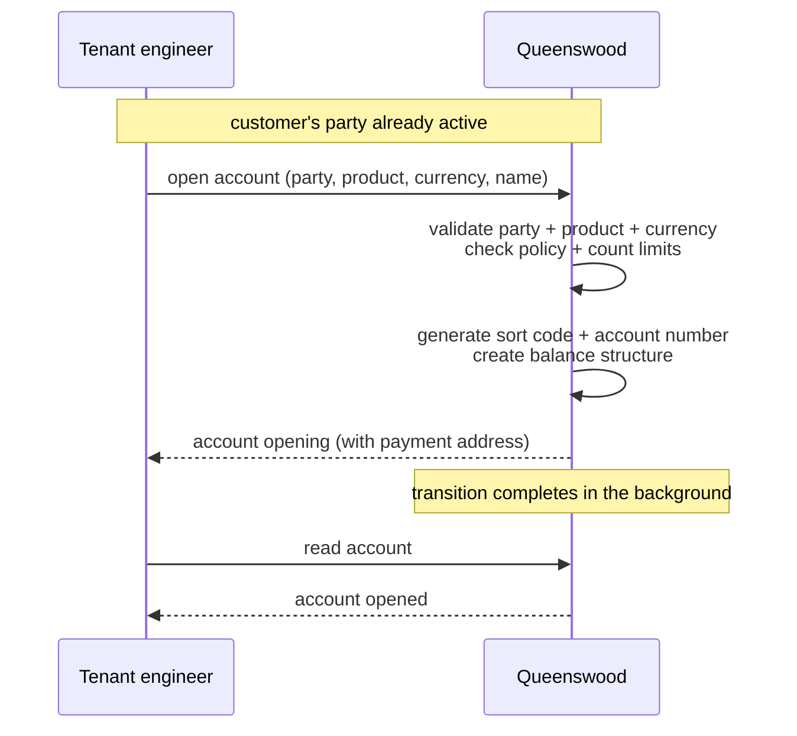
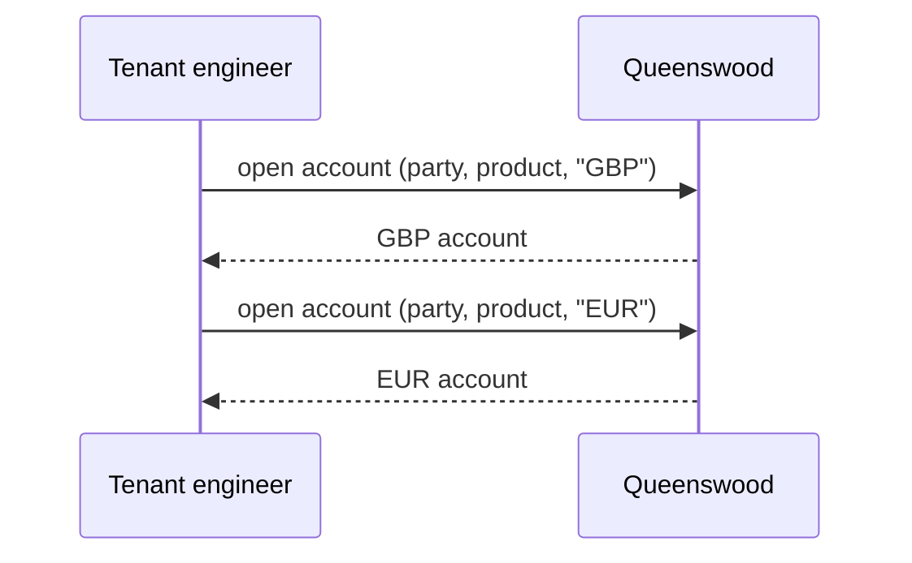
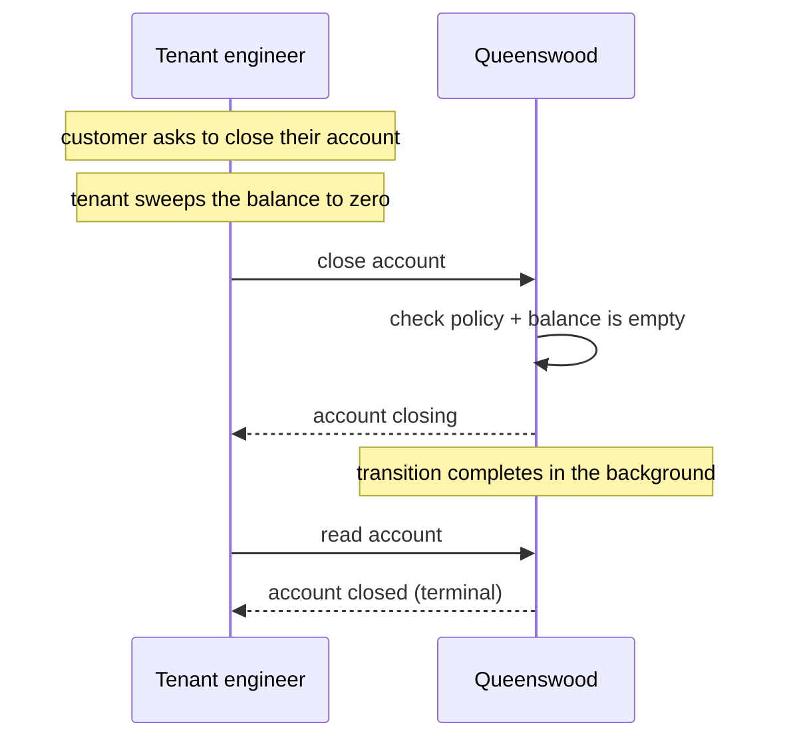

# Cash accounts

## Objective

A **cash account** is what an end customer holds and
transacts through. Each account belongs to one tenant, is
held by one party (person or organisation), is opened under
one published version of a cash account product, and is
denominated in one currency. At open time the account is
assigned a UK payment address — a sort code and account
number — that lets it receive money from any UK bank via
Faster Payments. From that point on, the account is the
identity that every movement of money references.

## Users and stakeholders

**Tenant engineer.** Opens and closes accounts on behalf
of their end customers, looks accounts up, and reads them.
Cares about: open succeeding only when the customer is
properly set up, the assigned payment address being usable
immediately, the eventual close being final.

**End customer.** The party who holds the account. Doesn't
interact with the platform directly; the account is the
thing the tenant exposes through their own customer-facing
surface. Cares (implicitly) about: the account being open
when expected, balances and statements being correct, the
sort code and account number staying stable.

**Platform admin / Queenswood operator.** Sets the
policies that cap how many accounts a tenant can open, of
which type, in which currency. Issues each bank its own
clearing identity — the sort code its accounts' payment
addresses are built from.

## Goals

- **One account, one currency.** Each account is in exactly
  one currency. Multi-currency means multiple accounts —
  one per currency the customer holds.
- **Pinned to a product version.** At open time the account
  is pinned to a specific published version of the chosen
  product. Every subsequent operation that needs terms
  (interest rate, allowed payment schemes, currency
  validation) reads them from that version. This is the
  cohort property described in
  [cash-account-products](cash-account-products.md).
- **A UK payment address at open time.** Every account
  receives a unique sort code and account number when it
  opens. The address is usable for inbound and outbound
  Faster Payments from that point.
- **Owned by an active party.** An account can only be
  opened against a party that has been verified — see
  [parties](parties.md). Person parties must have passed
  identity verification; organisation and internal
  parties are active on creation.
- **Two type dimensions.** A *product type* (current,
  savings, term deposit) describes the kind of account it
  is; an *account type* (personal or business) describes
  who holds it. Both dimensions are visible to the
  platform's policies.
- **Lifecycle: open, freeze, unfreeze, close.** An account
  opens, can be frozen and unfrozen while it is live, and
  at the end of its life closes. Opening and closing each
  complete in two steps — the first step records the
  intent; the platform finishes the transition shortly
  after. Freezing and unfreezing take effect at once.
- **A frozen account holds still.** While an account is
  frozen no money leaves it and no money lands in it, but
  it keeps earning interest, because the balance is still
  owed. It can be closed without being unfrozen first.
- **An account closes empty.** The platform refuses to
  close an account whose balance is not zero, and tells the
  tenant which part of the balance is in the way.
- **Multi-tenant isolation.** Every account belongs to one
  tenant. Tenants don't see each other's accounts.
- **Policy-bounded.** Platform-level policies cap the
  number of accounts a tenant can have, and can cap the
  number per (product type, account type, currency)
  combination. The cap counts every account the tenant has
  ever had: a closed account still occupies its place, and
  so do the bank's own bookkeeping accounts.

## Non-goals

- **Tenant choice of sort code.** Each bank is issued its
  own sort code when it is created, and every payment
  address on that bank is built from it. Tenants don't
  select or vary it.
- **Multi-currency on a single account.** A customer who
  holds GBP and EUR holds two accounts.
- **Dormancy.** An account left unused indefinitely is not
  flagged, closed or escheated by the platform. Freezing is
  an operator's decision, not something inactivity triggers.
- **Re-opening a closed account.** Closing is terminal. A
  customer who closes an account and wants it back opens
  a fresh one — with a new identifier and a new payment
  address.
- **Overriding the account-type derivation.** A person
  party always opens personal accounts; an organisation
  party always opens business accounts. There's no way to
  open a "business" account on behalf of a person party.
- **International payment addresses.** No IBAN, no BIC, no
  cross-border addresses. UK SCAN only.
- **Product-derived account behaviour beyond the version
  pin.** The account itself doesn't change behaviour based
  on product type beyond what the version says.

## Functional scope

A tenant uses the banking API to open and close accounts on
behalf of its end customers, and to read accounts back.

### Opening an account

The tenant supplies:

- The party that will hold the account (must be active).
- The product the account is being opened under (must
  have a published version).
- The currency, in ISO 4217 string form (e.g. `"GBP"`).
- A user-friendly name.

Before the account is created, the platform checks:

- The party is active.
- The product has a published version.
- The chosen currency is one of the product's allowed
  currencies.
- The tenant is allowed (by policy) to open this kind of
  account.
- The tenant hasn't hit the platform's count limits — both
  the per-tenant total and the per-(product type, account
  type, currency) combination.

If all checks pass, the platform:

- Generates a unique UK payment address (sort code +
  account number).
- Records the account, pinned to the product version.
- Sets the account's status to **opening**.
- Creates the balance structure the account will use.

A moment later the platform finishes the transition and
the account becomes **opened** — the state in which it can
hold balances and appear on transactions.

### Account types

Two dimensions sit alongside each account:

- **Product type** — current, savings, or term deposit
  for customer-facing accounts; settlement or internal for
  the bank's own bookkeeping accounts. This comes from the
  product the account is opened under.
- **Account type** — personal or business. This is
  derived from the party: a person party gets a personal
  account; a non-person party gets a business account.
  The tenant doesn't supply the account type.

Both dimensions are visible to the platform's policies, so
rules can be expressed along either axis: "this tenant can
have at most three personal current accounts in GBP per
party", "business customers cannot open term deposits".

### Payment addresses

Every account is given a UK SCAN address (sort code +
account number) at open time. The sort code is the bank's
own clearing identity, issued to it when the bank is
created; the account number is unique within that sort
code, and is never issued twice.

The address is the route money travels along: a UK Faster
Payment to that sort code and account number lands in this
account.

A tenant can rotate an open account's address — after a
suspected compromise, for example — trading the sort code
and account number for a fresh pair. The old address is
retired permanently and kept on the account's history; there
is no window in which a payment can still reach it.

### Closing an account

The tenant uses the banking API to close an account. An
account that is open, and an account that is frozen, can
both be closed — a frozen account does not have to be
unfrozen first. Before closing, the platform checks:

- The tenant is allowed (by policy) to close this kind
  of account.
- The balance is empty. Every part of the balance counts,
  including money set aside for a payment that has not
  settled yet, so an account with a pending outgoing hold
  is not empty even when the settled figure reads zero.

If the balance is not empty the close is refused, and the
refusal names the parts that are not empty so the tenant
knows what to sweep. An operator who has to close a
non-empty account can be granted that permission
explicitly; no tier carries it by default.

If allowed, the platform sets the status to **closing**.
A moment later the transition completes and the account
becomes **closed** — its terminal state.

### Freezing and unfreezing an account

A tenant can freeze a live account — pending a review, or
after a suspected compromise — and unfreeze it again. A
frozen account is not a closed one: it keeps its payment
address, its balance and its history, and it goes on
earning interest. What it cannot do is move money. A
payment from a frozen account is refused, and a payment
arriving for one is held by the platform for
reconciliation rather than credited, exactly as a payment
to an address the platform does not recognise is.

The same is true of a closed account, whose payment
address is never reissued to anyone else: money sent to it
is held for reconciliation rather than landing on an
account nobody is watching.

### Moving an account to another product

A tenant can move a live account onto another product, or
onto a later version of the one it is already on — a
customer changing to a different account, or a group of
customers moved off terms that are being withdrawn. The
account keeps its identifier, its payment address, its
balance and its history; only the terms it is held on
change, and from that point the interest it earns and the
payment schemes it supports are the new product's.

Moving a group of accounts at once is a reviewed exercise:
the tenant asks for the move, sees how many accounts it
would touch before anything changes, and approves it. See
[cash-account-products](cash-account-products.md).

### Reading accounts

The tenant can:

- Read an account by its identifier.
- List the accounts the bank holds, a page at a time, with
  balances included on request.
- Read an account's transactions.

### Multi-tenant isolation

Every account belongs to one tenant organisation.
Cross-tenant reads are not possible through the banking
API.

## User journeys

### 1. Tenant opens a customer's first account

The tenant opens the account in a single call. The platform
validates the inputs, generates a payment address, and
returns the account immediately in the opening state. A
moment later the account is opened and ready to use.

### 2. Multi-currency: same customer, two accounts

A customer who needs both GBP and EUR holds two accounts —
one per currency. Each gets its own payment address; each
is independent of the other.

### 3. Inbound payment lands

The platform looks accounts up by their UK payment address
when an inbound Faster Payment arrives — see
[payments](payments.md). The tenant doesn't have to do
anything; the account simply credits.

### 4. Closing an account

The tenant closes the account when the customer ends the
relationship. Closing is terminal; if the customer comes
back, they open a fresh account with a new identifier and
a new payment address.

A closed account's payment address is retired for good —
the platform never hands it to another customer, so there's
no risk of a payment meant for the old customer reaching
someone else.

## Open questions

- **Re-opening a closed account.** Closed is terminal. If
  a customer comes back after closing, they get a fresh
  account with a new payment address. Some operators
  prefer to retain the original identifier or address.
- **Closing a non-empty account.** The permission that
  waives the empty-balance check is not carried by any
  tier, so an operator who needs it has to be granted it
  one account at a time. Whether a tier should carry it is
  open.
- **Dormancy and inactivity.** Real banks have regulatory
  regimes for accounts unused for long periods (flagged,
  then closed, sometimes escheated to the state). None
  of that is modelled.
- **A second sort code for one bank.** A bank is issued one
  sort code and keeps it. A bank that outgrows the account
  numbers under a single code, or wants to route some
  customers separately, has no way to hold a second.
- **International payment addresses.** No IBAN or BIC
  today. Cross-border payments are out of scope at the
  platform level.
- **Sole-trader accounts.** A sole trader is a person who
  also operates a business. Today they'd open a personal
  account (because their party is a person); a "business
  account on behalf of a person" isn't expressible.
- **Re-validating party status on long-lived accounts.**
  The party's active status is checked at open time only.
  If the party is later suspended (once that lifecycle
  exists), the account doesn't automatically reflect it.

## References

- **Engineering view**: [tdd/cash-accounts](../tdd/cash-accounts.md)
  for the data model, lifecycle transitions, payment-
  address generation, and the lookup indices.
- **Platform context**: [platform](platform.md);
  [onboarding](onboarding.md) — the tenant's own
  bookkeeping accounts are opened as part of the bootstrap.
- **Adjacent capabilities**: [parties](parties.md) — an
  account is owned by an active party;
  [cash-account-products](cash-account-products.md) — an
  account is pinned to a published version;
  [payments](payments.md) — money flows in and out via
  the account's payment address;
  [interest](interest.md) — daily accrual reads the
  account's pinned version for the rate;
  [policies](policies.md) — open and close capabilities,
  and the count limits.
