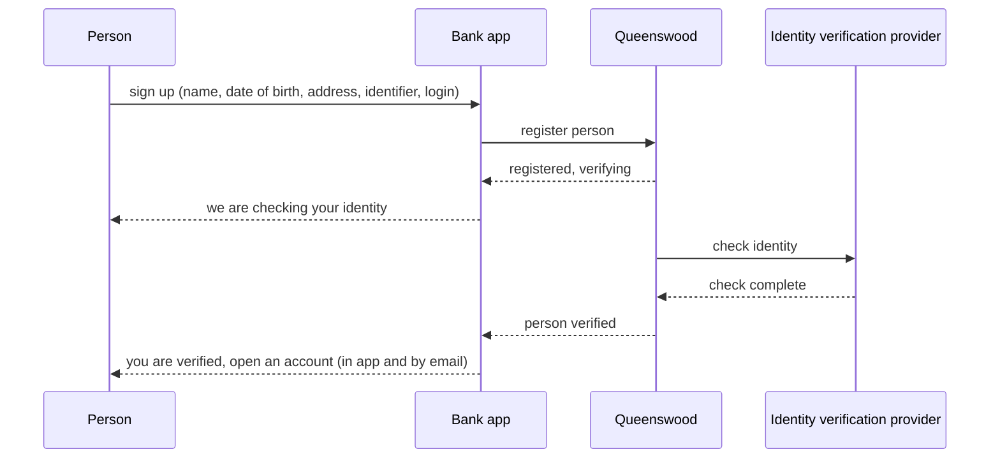
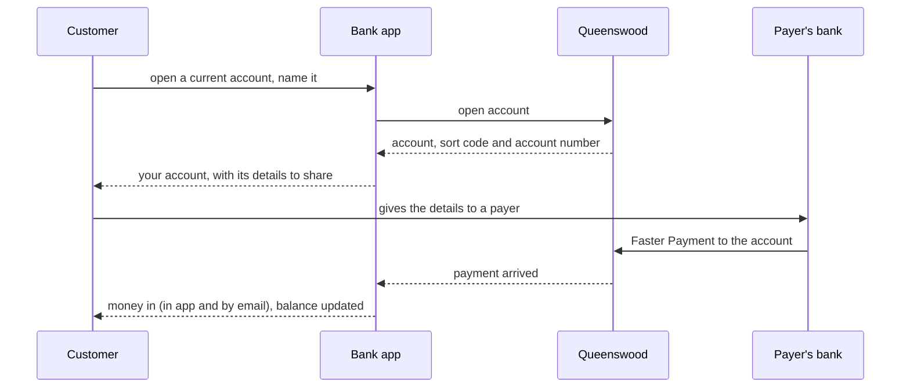
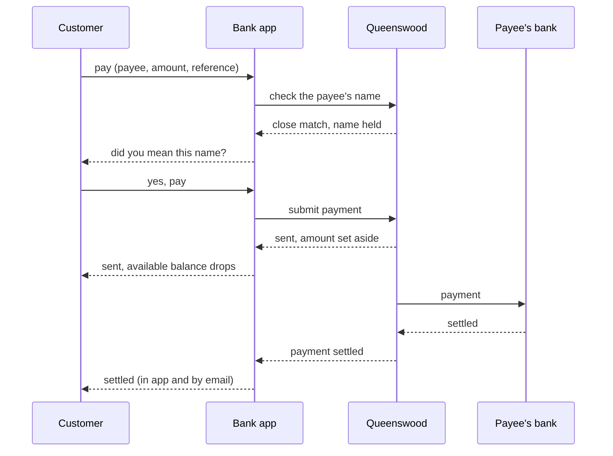
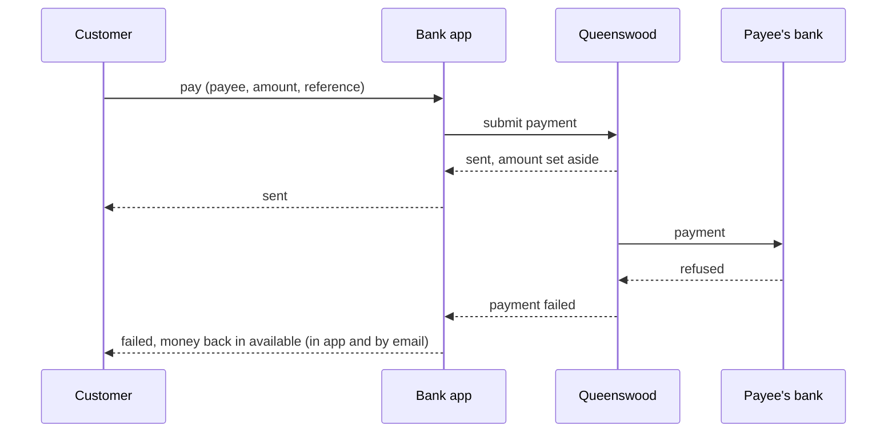
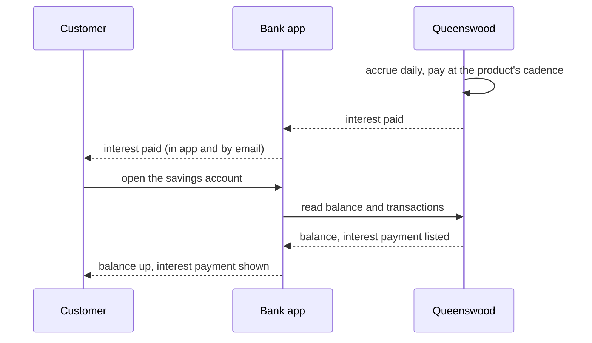

# Demo digital bank

## Objective

Queenswood is the engine room of a bank, and nothing in it is what a
person opens on their phone. The demo digital bank is that missing
half: a fictitious retail bank built entirely on the platform, whose
customers
sign up, get verified, open accounts, see their money, pay people and
are paid, the way they would at any bank they already use. It exists
to show what a product built on Queenswood is made of, and to be the
worked example every other such product can read. It is the first of a
family of demos named by use case, so that the brand can change and
other use cases can sit beside it.

This PRD covers the bank's app — the screens a customer signs in to —
and the systems behind it that talk to the platform on the customer's
behalf. Everything the platform does for the bank is another PRD's:
[parties](parties.md) verifies its customers,
[cash-accounts](cash-accounts.md) holds their accounts, and
[payments](payments.md) moves their money. This PRD is what the bank
adds on top, and the line is drawn by one fact: the platform knows the
bank, and never the customer. A customer signs in to the bank, never
to Queenswood.

The bank's own staff are not this PRD's either. The people who run the
bank's relationship with the platform use the platform's console, which
[access](access.md) describes, and the bank builds no surface for them.

## Users and stakeholders

The personas are the platform's, from [platform](platform.md). Here the
demo bank is the customer, and its account holders are the end
customers.

**End customer.** The person who banks with the bank. Signs in to the
bank's app with a login the bank gave them, holds one or more accounts,
and never sees the platform. Cares about: getting in quickly, seeing
what they have and what they can spend, paying the right person once,
knowing when money arrives, and never seeing anyone else's money.

**Customer engineering team.** The engineers building the bank. This
PRD is their build list: the app, the systems behind it, and the line
between what the bank keeps and what it reads from the platform. Cares
about: doing nothing twice, every screen answering from the platform
rather than from a copy, and the same code running in test and live.

**Customer team.** The people who run the bank — its founder, its
operations and support staff. They operate the bank's organisation
through the platform's console: who is on the team, what the bank may
do, whether the platform is reaching the bank. Stakeholders here, since
the bank builds them nothing.

**Platform operator.** Creates the bank's organisation, moves it to
live, and sets the tier that bounds what the bank may do. A stakeholder
at the start, and never a user of the app.

**Compliance and risk.** Asks, after the fact, whether a customer could
reach an account that was not theirs, whether a payment was made once,
and what the customer was told. Reaches the answer through the
platform's records and the bank's own.

The identity verification provider and the clearing partner are
counterparties. The customer meets the first at sign-up and the second
whenever money crosses the bank's edge, and neither is a persona.

## Goals

- **A bank a person can use.** Sign up, be verified, open an account,
  see a balance, be paid, pay someone, move money between accounts,
  earn interest, close an account — each a screen in the app, each
  reading the way it reads at a bank the customer already uses.
- **Everything through the platform.** Every account, balance, payment
  and identity check is the platform's. The bank holds no money and no
  copy of a balance, and every figure on a screen is read from the
  platform at the moment it is shown.
- **One login, own accounts only.** Each customer signs in to the bank
  with their own login and sees exactly the accounts that are theirs.
  The platform keeps the bank apart from every other organisation. The
  bank keeps each customer apart from every other customer, on every
  screen and every request.
- **Told, not asked.** When a payment settles, verification completes
  or interest is paid, the platform tells the bank and the bank tells
  the customer — in the app, and by email — without the customer
  refreshing anything.
- **Paid once.** A payment the customer confirms is made exactly once,
  however many times a flaky connection resubmits it, and every
  outcome the payment can reach is shown to the customer.
- **Test is live.** The bank runs unchanged against a test organisation
  with simulated counterparties and against a live one with real ones.
  Moving between them changes configuration and nothing the customer
  can see.
- **A worked example.** The bank is the reference for a product built
  on Queenswood: which calls a screen makes, what the bank keeps for
  itself, and how it is told. Somebody building their own product reads
  the bank first.

## Non-goals

- **A surface for the bank's staff.** Team, roles, policies and
  delivery health are the platform console's, in [access](access.md)
  and [webhooks](webhooks.md). A support lookup from a customer to
  their accounts is an open question below, not a goal.
- **Anything the platform does not offer.** Cards, overdrafts and
  lending, joint accounts, business customers, payments outside the
  UK, and fraud monitoring are the platform's non-goals, in
  [platform](platform.md), and the bank cannot demonstrate what the
  engine room does not do.
- **A native mobile app.** The app is a web app. It works on a phone,
  but is not installed from a store.
- **Statements, budgeting and categories.** A transaction list is in
  scope. A monthly statement, a spending breakdown, a savings goal or a
  category on a transaction is not, for now.
- **Capturing identity documents.** The bank collects what the person
  types. Photographing a document or a face is the identity
  verification provider's own capture, and the demonstration runs
  against a simulator that needs neither.
- **Being a bank.** The bank holds no licence, serves no real customer
  and moves no real money. It demonstrates a product built on the
  platform, and nothing in it is a claim about production use.
- **Disputes and recalls.** Asking for a payment back, and contesting
  one received, are not offered.

## Functional scope

The bank is one organisation on the platform. Its app is what a
customer signs in to, and its systems make every call to the platform
on that customer's behalf, with the credential the organisation was
given at creation. The customer's browser never holds that credential
and can reach nothing on the platform directly.

### The bank on the platform

Before the bank has a customer, it has:

- An organisation, created by a platform operator or by the bank's
  founder from the console, with a credential its systems hold.
- Products published under it — a current account and a savings
  account, each with its currency, interest rate and terms, as
  [cash-account-products](cash-account-products.md) describes. What a
  customer can open is whatever the bank has published.
- An address registered with the platform, where the platform tells
  the bank that a record changed, and the secret to check that a
  message came from the platform, as [webhooks](webhooks.md)
  describes.
- A tier, set by the operator, which bounds how many accounts the bank
  may open and what it may do, as [policies](policies.md) describes.

None of this is a screen in the app. It is done once, from the console
and by the platform operator, and the app assumes it.

### Signing in

A customer signs in to the bank with a login the bank issued at
sign-up. The bank's sign-in is its own, separate from the platform's,
and the platform never sees it: a customer is not a person the
platform knows, and holds no role in the bank's organisation.

One login is one customer, and one customer is one party on the
platform. The bank keeps that link, together with the accounts the
party holds, and it is the only record the bank has to keep to put
the right accounts in front of the right person.

### Signing up

A person who is not yet a customer gives the bank their name, date of
birth, address and a national identifier, and chooses their login.

The bank registers them with the platform as a person, and the
platform begins identity verification in the background, as
[parties](parties.md) describes. The registration returns straight
away, so the person sees at once that they are being verified, and can
sign in and out while they wait. They cannot open an account yet.

Verification takes seconds against the simulator and anywhere from
seconds to days against the real provider. The bank does not make the
person wait on a screen: once the platform tells the bank the check is
complete, the bank tells the person — in the app, and by email — that
they are verified and may open an account, or that the bank cannot
take them on. A rejected person can sign in, sees why they cannot
continue, and is pointed at support. The bank does not run the check
again.

### Seeing only your own accounts

The platform's isolation is between organisations: the bank's
credential reaches every party and every account the bank holds. Which
of them a signed-in customer may see is the bank's decision, made on
every screen and every request, from the login to the customer to the
party to its accounts. A request naming an account that is not the
customer's is refused as if the account did not exist.

### Opening an account

A verified customer chooses from the products the bank has published,
gives the account a name, and opens it. The platform assigns a sort
code and account number, and a moment later the account is open. The
customer sees it in their overview at once, with its details, and can
be paid into it immediately.

The bank's tier bounds how many accounts a customer may hold. A
refusal — too many accounts, a product the customer may not open — is
shown with its reason, in the app's words rather than the platform's.

### Accounts and balances

The overview lists the customer's accounts with a name, a type, and
what is available to spend in each. An account's own screen shows
three figures the customer learns to tell apart:

- The **balance** — what has settled.
- What is **available** — the balance less anything set aside.
- What is **pending** — money set aside for a payment the customer
  has made that has not yet settled, and money on its way in that the
  clearing partner is still holding.

Below them, the account's transactions, newest first — every payment
in and out, every transfer, every interest payment — each with a date,
a description, the other side's name or reference, and the amount.
Every figure is read from the platform when the screen is shown. The
bank keeps no copy of a balance.

### Receiving money

The account's screen shows its sort code and account number, and a
way to copy or share them. Anyone in the UK can pay into the account
with them, and the customer does nothing to receive the money.

When a payment arrives, the platform tells the bank and the bank tells
the customer, in the app and by email, and the transaction list shows
it. A payment the clearing partner holds for screening is shown as on
its way, with nothing yet available to spend, until it settles or is
returned to the sender. A returned payment is shown as returned, and
was never available.

### Paying someone

The customer chooses a payee — someone they have paid before, kept by
the bank, or a new sort code, account number and name — an account to
pay from, an amount, and a reference the payee will see.

Before the customer confirms, the bank asks the platform to check the
name against the name the payee's bank holds, and shows the outcome
in the customer's words:

- A **match** — the customer confirms.
- A **close match** — the name the payee's bank holds is shown, and
  the customer chooses to pay that person or to go back.
- **No match** — the customer is warned plainly, and may still pay,
  since the money may well be going where they meant, or go back.

On confirming, the amount is set aside at once: the available figure
drops, the payment is shown as **sent**, and the customer cannot spend
the same money twice. The payment then reads as **held** if the
clearing partner screens it, and **settled** once it arrives, or
**failed** if the partner refuses it, in which case the money returns
to what is available and the customer is told why. Every change is
told to the customer without their refreshing anything.

A payment the customer confirmed is made once. Whatever a slow
connection or a repeated tap does, the bank submits it with the same
identity each time, and the platform recognises a repeat.

### Moving money between accounts

A customer with more than one account moves money between them by
choosing the two accounts, an amount and a reference. The transfer
settles at once and both balances change while the customer watches.
There is no status to wait for.

### Interest

A savings account earns interest at the rate its product carries,
shown on the account's screen. Interest accrues daily in the
background and is paid into the account at the cadence the product
sets, as [interest](interest.md) describes. When it is paid, the
customer is told, and the transaction list shows an interest payment
with its amount.

### Notifications

The customer is told, in the app and by email, when:

- Their identity check completes, either way.
- Money arrives, is held on its way in, or is returned.
- A payment they made is held, settles or fails.
- Interest is paid.

The app shows what it has been told the next time it is opened, and
straight away if it is open. Each message points at the account or
payment it is about. The bank keeps which messages each customer has
been shown, and nothing else about them.

### Closing an account

A customer closes an account they have emptied. The bank refuses to
close one with money in it, or with a payment set aside that has not
settled, and says so. A closed account stays in the overview, marked
closed, with its history readable.

A customer who suspects their account details have been shared can ask
for a new sort code and account number. The old ones stop working at
once and the new ones appear on the account's screen.

### What the bank keeps

The bank keeps only what the platform does not hold:

- Each customer's login, and the party and accounts it maps to.
- Each customer's payees.
- Which messages each customer has been told.
- The identity of every payment the bank has submitted, so a
  resubmission is recognised as the same payment.

It keeps no balance, no payment status and no transaction. Those are
read from the platform whenever a screen needs them, and the bank's
messages say only that something changed and where to look.

### Test and live

The bank runs the same against a test organisation, whose identity
checks and payments go to simulators, and a live one, whose go to the
real provider and the real clearing partner. The credential and the
addresses differ, and nothing else. A demonstration runs in test, with
a way to put money into an account on demand so a customer's first
payment in does not wait for a real payer.

## User journeys

### 1. A person signs up and is verified

The person types their details once and is in, waiting. Nothing on
the screen spins. When the check completes, the app and an email tell
them, and the next thing they see is the offer of an account.

### 2. A first account, and money arrives

The customer opens an account and immediately has something to give
a payer. When the payer's money lands the customer is told, and the
account screen already shows it.

### 3. Paying someone, with the name checked

The name check is a beat of its own, and the customer decides. Once
they confirm, the money is set aside before they leave the screen, and
the payment's status follows them, changing without a refresh.

### 4. A payment fails and the money comes back

The customer sees the payment fail and the available figure return to
what it was, with the reason the clearing partner gave, in the bank's
words.

### 5. Interest is paid

The customer did nothing. They are told interest was paid, and the
savings account shows the payment as a line of its own.

## Open questions

- **The bank's name.** The design work calls the bank Xepha, and the
  app carries that as its brand, in one file. Whether Xepha is the name
  the demo keeps is open, and nothing in this PRD depends on it: the
  code is named for the use case, and the brand is configuration.
- **How a customer signs in.** The bank's sign-in is assumed to run on
  the identity server the platform already runs, in a space of its own
  with no path to the platform's, so the demonstration adds no
  infrastructure. Whether a customer signs in with a password, a
  federated identity or a passkey, and how they recover a lost one, is
  open.
- **Where the bank lives.** The app is a base in this repository,
  beside the platform's own console, and its backend will be another.
  Whether the demos move to a repository of their own, consuming only
  the platform's published API description to prove the API stands
  alone, is open.
- **Identity documents.** The demonstration collects typed details and
  the simulator decides the outcome. A real provider expects a
  photographed document and a face, captured in the provider's own
  way, and where that sits in the sign-up screens is not designed.
- **Support.** The bank's staff have the console for the organisation
  and nothing for a customer: finding a person from their name, seeing
  their accounts, or suspending them. A support screen in the bank is
  the likely answer and is not designed. Meanwhile support acts through
  the platform's API directly.
- **History depth and statements.** How far back the transaction list
  reaches, and whether a monthly statement is produced, follow the
  platform's own answer, which [statementing](../plan/statementing.md)
  is working out.
- **Push.** In-app and email are assumed. A push notification to a
  phone is the obvious third, and needs the native app the non-goals
  exclude.
- **More than one party.** A customer is assumed to be one person on
  the platform. A person who also wants a business account is a second
  party, and whether one login may hold two is open — and the
  platform's business onboarding is itself a gap, in
  [parties](parties.md).
- **Retention.** How long the bank keeps a closed customer's login,
  payees and messages, and what a customer may ask to have deleted.

## References

- [platform](platform.md) — the platform as a whole, and the persona
  set this PRD's readers come from.
- [onboarding](onboarding.md) — how the bank's organisation comes to
  exist, its credential, and its move from test to live.
- [access](access.md) — the bank's staff: the console they use, and
  why a customer is never one of them.
- [parties](parties.md) — a customer as the platform sees them, and
  identity verification.
- [cash-account-products](cash-account-products.md) — the products the
  bank publishes and a customer chooses from.
- [cash-accounts](cash-accounts.md) — accounts, balances, addresses,
  and closing.
- [payments](payments.md) — paying, being paid, moving money, and the
  name check.
- [interest](interest.md) — accrual and what a savings account earns.
- [webhooks](webhooks.md) — how the platform tells the bank.
- [policies](policies.md) — the bounds the bank's tier sets.

No TDD serves this PRD yet. The design of the app's screens comes
first, and the TDD follows it.
