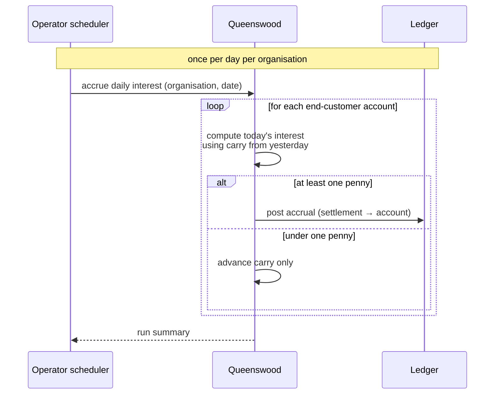
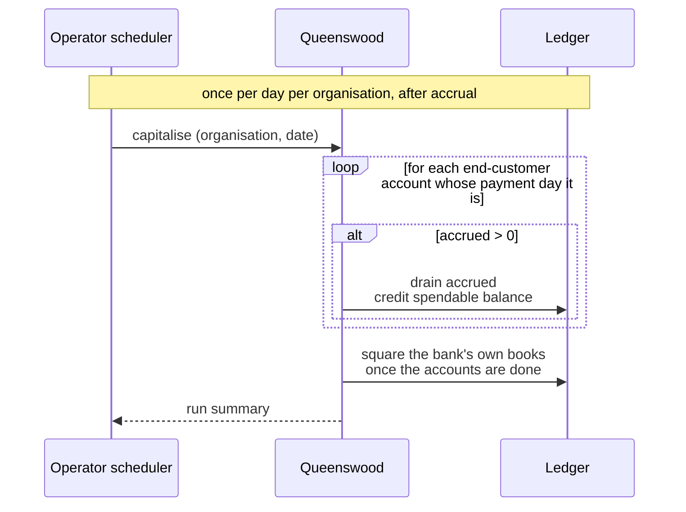
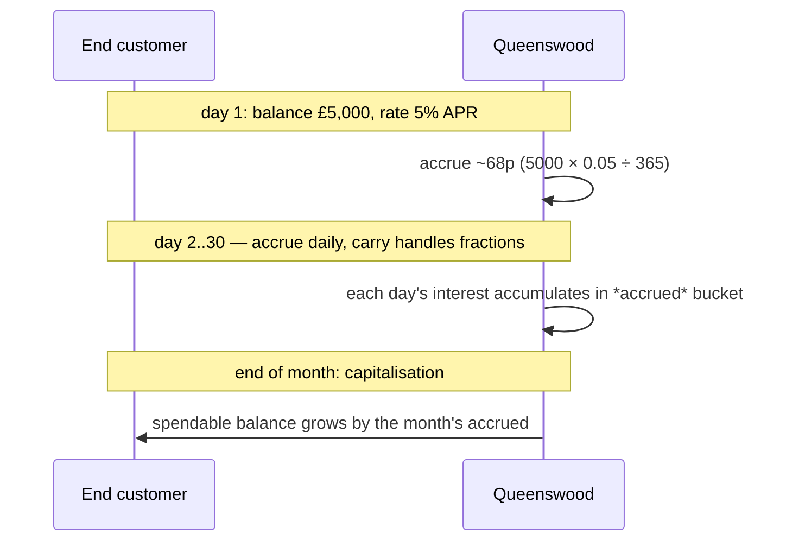
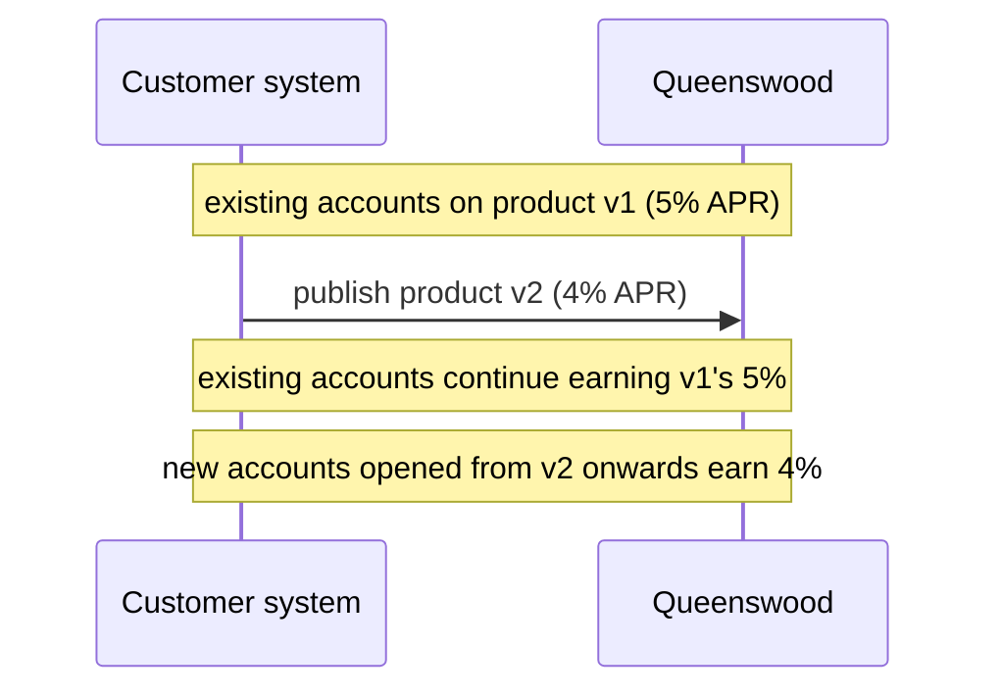
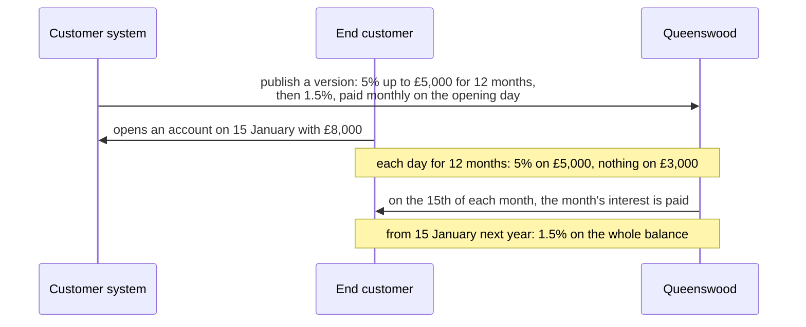
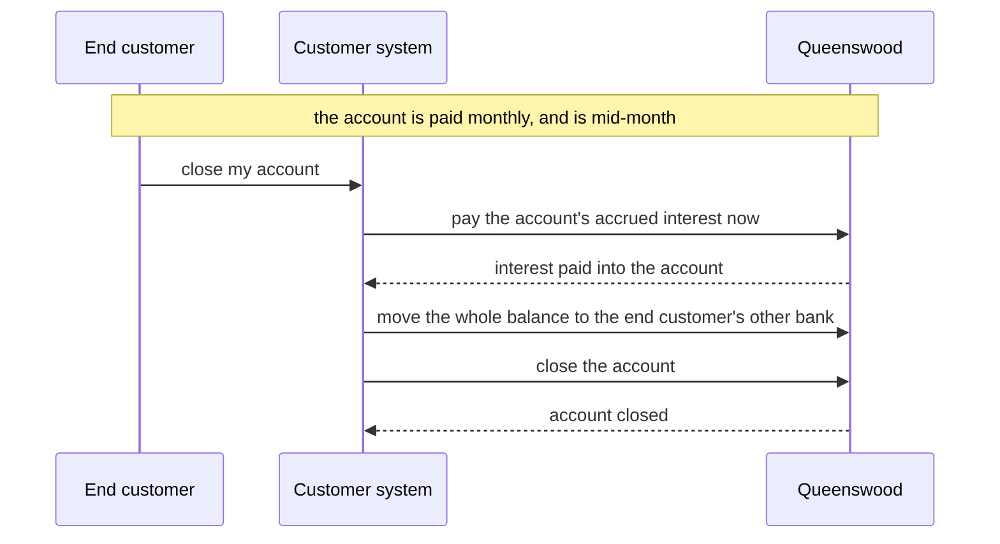
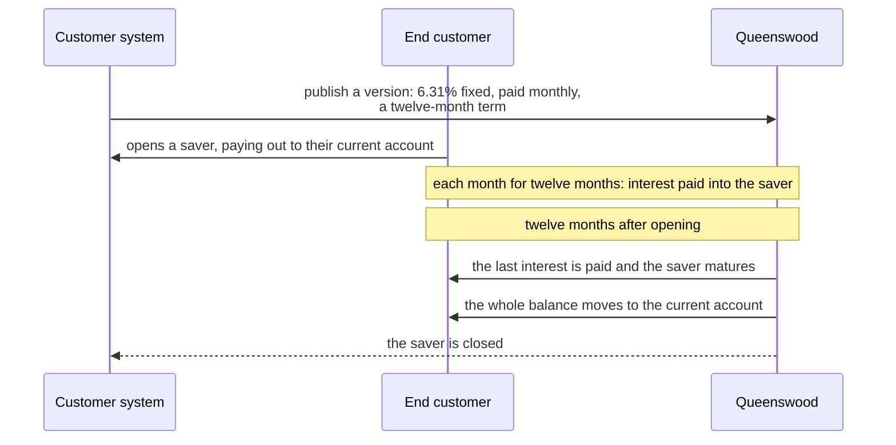

# Interest

## Objective

End-customer accounts earn interest. The platform computes
interest daily on each account's settled balance, records
it as accrued, and capitalises it — moving it into the
account's spendable balance — on the days the account's
product version says. The rate itself can vary with the
balance and over time. The arithmetic conserves every fraction of a
penny across millions of accounts and 365 days; nothing is
lost or quietly rounded away. Re-running a day is safe.

## Users and stakeholders

**End customer.** Earns interest on their settled balance.
Doesn't interact with the platform directly. Cares
(implicitly) about: interest accruing every day they hold
funds, capitalisation appearing on their account at the
expected cadence, the rate matching what they signed up
for.

**Customer engineering team.** Defines the rate, how it varies with the balance
and over time, and when interest is paid, as part of the cash account product.
Cares about: being able to state the offers it advertises, rate fidelity (the
account earns what the product says), no surprises around rounding or lost
pennies, the audit trail being intact.

**Platform operator.** Owns the operational side: making sure the daily
interest job fires every day, and operating the bank's settlement account.

## Goals

- **Daily accrual on settled balance.** Every day, every
  end-customer account earns interest based on its settled
  balance and the rate from the product version it was
  opened under.
- **Penny conservation.** Sub-penny daily interest is
  tracked with a carry field that accumulates between
  days; once the carry rolls over a whole penny, the
  penny posts. No money is rounded away on long-tail
  balances.
- **Rate from the product version.** The interest rate is
  a property of the product version the account is pinned
  to. End customers earn the rate they signed up for,
  even after the product publishes a new version with a
  different rate — see
  [cash-account-products](cash-account-products.md).
- **Rates that band and step.** A product version can pay
  different rates on different parts of the balance ("5% up
  to £5,000, nothing above") or on the whole balance by the
  band it reaches, and change its rate on set dates or a
  number of months after an account opens ("a bonus rate for
  twelve months"). Every balance on every day has exactly one
  rate.
- **Paid when the product says.** Capitalisation — the
  moment accrued interest becomes part of the spendable
  balance — happens daily, monthly, quarterly, annually or
  only when the account closes, on the day the product
  version names: the account's own day, a fixed day of the
  month, or the month's last.
- **Compounding falls out of cadence.** Daily
  capitalisation produces daily-compounded interest;
  monthly produces monthly-compounded. The platform
  doesn't have a separate "compounding mode" — the
  cadence is the choice.
- **Idempotent re-runs.** Running a day's accrual or a
  capitalisation twice for the same date doesn't
  double-credit. The platform recognises the repeat and
  treats it as a no-op.
- **Per-account independence.** Each account's accrual
  and capitalisation is independent. A failure on one
  account doesn't block the rest of the run.
- **Audit trail.** Every accrual and capitalisation is
  recorded on the ledger. The bank's matching liability
  on the settlement account is recorded too — money
  moves from somewhere identifiable to the end customer's
  account.
- **Multi-tenant isolation.** Each customer's accruals run
  against its own organisation. Customers don't share
  accrual state.

## Non-goals

- **Floating-point arithmetic.** All interest math is
  integer arithmetic at sub-penny precision.
- **Other day-count conventions.** Actual/365, and
  actual/actual dividing by 366 in a leap year, are
  supported. No actual/360, no 30/360.
- **Per-currency rates inside one product.** A product
  version carries one rate. Products that earn different
  rates in different currencies aren't expressible as a
  single product version.
- **Rates that follow a reference rate.** A rate tracking
  the Bank of England base rate changes by publishing a
  new product version and migrating accounts onto it.
- **Rates that depend on what the end customer does.** No
  rate that drops after a number of withdrawals in a month,
  or holds only while a set amount is paid in.
- **Paying interest elsewhere.** Interest is paid into the
  account that earned it, never to a nominated account.
- **Working days.** Payment days are calendar days; no
  "first working day of the month".
- **Interest on pending balances.** Pending-incoming and
  pending-outgoing amounts don't earn interest. Only
  settled balance does.
- **Negative interest.** Rates are non-negative; the
  platform doesn't model accounts charged interest on
  positive balances.
- **Borrowing / overdraft interest.** No lending products
  on the platform; no borrowing rate.
- **Reversing an accrual or capitalisation.** No
  packaged flow for unwinding a wrongly-accrued day.
  Reversal is possible by hand via the underlying ledger
  but isn't a first-class capability.

## Functional scope

The platform provides two operations: daily accrual and
capitalisation. Both are run per organisation.

### Daily accrual

Once per day, the platform runs the daily accrual for each
organisation. It:

- Walks every end-customer account on that organisation.
- For each account, reads the settled balance and the
  rates from the account's pinned product version that
  apply that day.
- Computes the day's interest using integer arithmetic
  at sub-penny precision; uses the account's carry to
  remember sub-penny remainders between days.
- If the day's interest reaches at least one whole
  penny, posts the accrual: a credit to the account's
  *interest-accrued* bucket, balanced by a debit on the
  bank's settlement account (recording the bank's
  liability to pay it out).
- Updates the account's carry with whatever sub-penny
  remainder is left.

When the day's interest is less than a penny, no posting
is made — only the carry advances. This keeps the ledger
free of zero-value entries.

### Capitalisation

On each account's payment day, the platform sweeps
accrued interest into the account's spendable balance.
For each account due:

- Reads the account's accrued bucket.
- If the accrued amount is non-zero, posts a transaction
  that:
  - Drains the accrued bucket.
  - Increases the spendable balance by the same amount.
  - Clears the matching liability on the bank's
    settlement account.
- Records the audit trail of the bank paying out and the
  end customer receiving.

After capitalisation, the account's spendable balance is
larger by the accrued amount; the next day's accrual
computes against the new, larger balance — which is what
makes compounding emerge from the cadence.

### Rates that change with the balance and over time

A product version's rate is a schedule. Its steps start on
calendar dates, or a number of months after each account
opened, and the first applies from the start. Each step
splits the balance into bands from zero up, the last with no
upper limit, and either pays each band's rate on the part of
the balance within it or pays the rate of the band the
balance reaches on all of it. A flat rate is one step of one
band. A balance at or below zero earns nothing.

### When interest is paid

The product version says how often interest is paid, and on
which day, and the choice has real end-customer-facing
consequences:

- **Daily.** The end customer sees interest credited every
  day. Compounding is daily.
- **Monthly or quarterly.** Paid on the day of the month the
  account opened, on a fixed day from the 1st to the 28th,
  or on the month's last day. Compounding is at the same
  cadence.
- **Annually.** Paid on the anniversary, or on a fixed date
  such as 31 March. Compounding only once a year.
- **At close.** Interest accrues for the life of the account
  and is paid when it closes.

Less frequent payment means the end customer earns less in
absolute terms (since accrued interest doesn't itself earn
interest until it has been paid). The trade-off is a product
decision.

### Fixed-term accounts

A product version can give its accounts a term, such as twelve
months. The end customer names, when opening the account, another of
their accounts at the bank to receive the money. On the day the term
ends the account matures: its accrued interest is paid, it stops
earning and stops accepting money in, and its whole balance moves to
the named account, after which it closes.

If the money cannot move that day, because a payment is still on its
way or the named account has since closed, the account stays matured
and the platform tries again each day. The money is never sent
anywhere the end customer did not name: the customer uses the API to
name another account, or the end customer moves the money out
themselves and the account is closed.

### Closing an account with interest owed

An account can only close with nothing in it, and between
payment days accrued interest is still in it. The customer
uses the API to pay the account's accrued interest at once,
moves the balance out, and closes the account. A fraction of
a penny not yet credited is not paid.

### Rate stability over time

Each account is pinned to the product version it was
opened under. The interest rate comes from that version.
When the customer publishes a new product version with a
different rate, existing accounts continue to earn the
rate from their original version. Only newly opened
accounts pick up the new rate. This is the cohort
property described in
[cash-account-products](cash-account-products.md).

### Penny conservation

Daily interest on small balances is well under a penny.
A naive system that rounded each day would credit zero
forever to small accounts. The platform avoids this by
tracking sub-penny remainders on each account: each day's
remainder is added to the next day's calculation, so a
balance that earns half a penny per day posts a penny
every other day.

Across millions of accounts and many years, the
arithmetic conserves every micro-fraction of a penny.

### Safe to re-run

Accrual and capitalisation runs are safe to repeat for
the same date. If a daily run is interrupted or has to
be re-fired, the platform recognises the work already
done on each account and skips it. The customer and the
operator can re-run safely.

### Per-account independence

The platform processes each account independently. If
one account fails for any reason — a policy denial, an
unexpected state — the run skips it (recording the
failure) and continues. The rest of the day's work isn't
held up by one bad account.

### The bank's settlement account

Every customer has a settlement account that holds the
bank's liability to pay out accrued interest to its end
customers. Accrual posts to it; capitalisation drains it.
This is part of the customer's bookkeeping, set up at
[onboarding](onboarding.md).

## User journeys

### 1. Daily accrual run

The operator's scheduler triggers the run once per day
per customer. The platform walks every end-customer account,
computes the day's interest, posts where it's at least a
penny, and advances the carry on every account.

### 2. Capitalisation run

Each day, after accrual, capitalisation pays the accounts
whose product version names that day. Accrued interest
moves into the end
customer's spendable balance, and each end customer sees a
statement line for what they were paid. The bank's own matching liability
clears once at the end of the run rather than account by
account, which is what keeps a run over millions of accounts
from queueing behind itself.

### 3. End customer earns and is paid

From the end customer's point of view: every day, interest
accrues silently in the background; on the cadence the
customer offers, the accrued amount becomes part of the
spendable balance and is now available to spend.

### 4. Customer publishes a new rate

The cohort property in action. Existing end customers don't
see a rate cut overnight when the customer publishes a new
version with a different rate.

### 5. End customer earns a bonus rate, then the standard rate

The customer states a twelve-month bonus capped at £5,000
once, when it publishes the version. Every account opened on
it gets its own twelve months from the day it opened, and is
paid on its own day of the month.

### 6. End customer closes an account with interest owed

The end customer leaves with every penny accrued up to the
day they closed, not just up to the last payment day.

### 7. A regular saver matures

The end customer saves for a fixed term and finds the money in their
current account when it ends, with nothing to do. Had they closed
that current account in the meantime, the saver would wait, matured,
until they named another.

## Open questions

- **Reversing a wrongly-accrued day.** No packaged flow
  for unwinding an accrual or capitalisation. Reversal
  is possible by hand via the underlying ledger but
  isn't a first-class capability.
- **Per-currency rates within one product.** A product
  version carries one rate. Products that earn different
  rates in different currencies need a model change.
- **Conditional rates.** Limited-access savers drop
  their rate in a month with withdrawals, and some current
  accounts pay only while money is paid in each month.
  Whether a rate's condition shares a shape with a
  reward's is open; until then a version's rates apply
  whatever the end customer does.
- **Paying out elsewhere or renewing.** A matured
  balance goes to another account at the same bank. Paying
  it to an account at another bank, or rolling it into a
  new term, is not offered.
- **Interest on pending balances.** Pending-incoming and
  pending-outgoing amounts don't earn interest. A "earn
  interest on cleared funds same day" feature would need
  explicit treatment.
- **Account-skip and run summary.** When an account
  fails its checks during a run, the run records the
  failure and continues. A more developed run summary
  (counts of processed, skipped, failed; reasons; date
  range) would help operations.
- **Negative rates.** The platform models non-negative
  rates only.
- **Borrowing interest.** No lending products on the
  platform, so no borrow-side interest.

## References

- **Engineering view**: [tdd/interest](../tdd/interest.md)
  for the integer-arithmetic carry mechanism, how each side of
  the bookkeeping is recorded, and the run pattern.
- **Platform context**: [platform](platform.md);
  [onboarding](onboarding.md) — the customer's settlement
  account is set up here;
  [cash-account-products](cash-account-products.md) — the
  rate lives on the product version;
  [cash-accounts](cash-accounts.md) — every account is
  pinned to a product version, which is where its rate
  comes from.
- **Adjacent capabilities**: [payments](payments.md) —
  payments and interest both move money on the ledger but
  don't otherwise interact;
  [policies](policies.md) — capabilities and limits can
  bound which accounts earn interest, and at what
  rates.
- **Engineering depth**:
  [tdd/transactions-and-balances](../tdd/transactions-and-balances.md)
  for the double-entry posting model that sits under
  every accrual and capitalisation.
