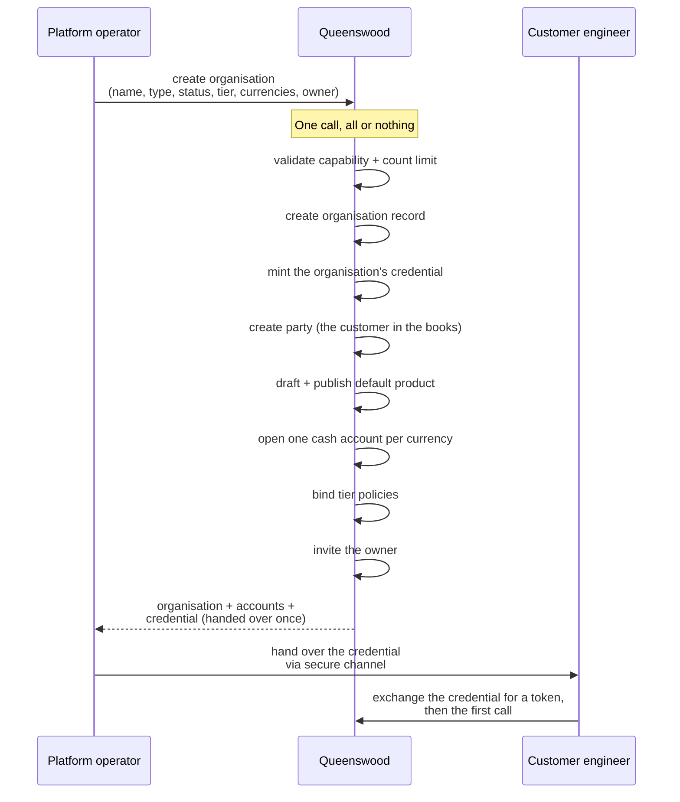

# Onboarding

## Objective

A new customer comes onto the Queenswood platform via a single creation
operation. One call by a platform operator produces the customer's
organisation, a credential for the customer's own systems, a party
representing the customer in the bank's books, a default product, a
cash account per requested currency, the appropriate policy bindings,
and an invitation to the person who will own it — all or nothing. The
credential is handed over once. The customer immediately has a working
starting state: their systems can begin operating without further
bootstrap.

This PRD is the organisation as a banking entity: what it is created
with, what its credential reaches, and how its tier and status move.
Who signs in to it, and what each of them may do, is
[access](access.md).

## Users and stakeholders

**Platform operator.** Drives the onboarding operation. Decides the
organisation's type (customer or internal), status (live or test), tier
(which bundle of policies binds), supported currencies, and who will
own it. Receives the credential, delivered once, to forward to the
customer.

**Customer engineering team.** The downstream recipient of the
credential. Their experience starts when they receive it and exchange
it for a short-lived token, which their systems do again before each
session of calls. Cares about: the credential being usable immediately,
the organisation having a settled starting state (settlement account
exists, default product is published), the tier being correct for their
use case.

**Customer.** The entity created — the boundary that scopes everything
else, and the company its people act for.

## Goals

- **Single-call creation.** One operation creates the entire
  organisation. No follow-up calls to bootstrap a working state.
- **All or nothing.** Either the organisation comes up complete or
  doesn't come up at all. No half-created organisations.
- **One-time credential delivery.** The credential is handed over
  exactly once, at creation. The customer must store it; the platform
  doesn't.
- **Status decides what the credential reaches.** A test organisation's
  credential reaches the sandbox; a live one's reaches the live service.
  Moving between the two moves what the credential reaches, without the
  customer being issued a new one.
- **Tier-based policy binding.** A `tier` label at creation time binds
  the organisation to the corresponding bundle of policies. Different
  tiers can ship with different rule sets, and a platform operator uses
  the banking API to move an organisation to another tier afterwards,
  which rebinds it to that tier's bundle.
- **An owner from the start.** An organisation an operator creates
  names the person who will own it, and one a person creates from the
  console is owned by that person. Either way, from the moment it
  exists the organisation has someone who can sign in or an invitation
  waiting for them.
- **Default product and accounts.** A settlement product (for customer
  organisations) or internal product (for internal ones) is drafted and
  published, and accounts are opened in each requested currency. The
  organisation has bookkeeping capacity from the moment of creation.
- **Multi-tenant isolation.** Every record created carries the
  organisation's identifier. One customer cannot see another's data;
  isolation is enforced at the data layer.

## Non-goals

- **Billing or pricing.** No subscription, metering, or invoicing.
- **Deactivation, closure, or off-boarding.** Organisations once
  created are permanent. No flow to close one.
- **More than one credential per organisation.** Only the default
  credential is issued. Issuing further ones is a separate concern, with
  limited tooling today and no polished self-service flow.
- **End-customer accounts at create time.** The accounts opened by this
  flow are the organisation's bookkeeping accounts (settlement or
  internal). Customer-facing accounts are opened separately by the
  customer for its end customers.
- **People.** A customer's own systems act as the organisation when they
  call. Who signs in to it, with what role, and how they are invited and
  removed is [access](access.md), which also records who created the
  organisation.

## Functional scope

A platform operator uses the banking API to create a new organisation in
a single call.

**The call accepts:**

- Organisation name.
- Type — customer (an external fintech) or internal (Queenswood's own
  bookkeeping organisation).
- Status — live (production-grade) or test (sandbox).
- Tier — a string label identifying the policy bundle that should bind
  to this organisation.
- Currencies — list of ISO 4217 codes (e.g. `"GBP"` or `"GBP" "EUR"`).
- The email address of the person who will own it, invited as
  [access](access.md) describes.

**The call returns:**

- The created organisation (with metadata).
- The organisation's party.
- The organisation's accounts (one per currency, with embedded balance
  buckets).
- The organisation's credential — handed over once, at creation.

**All or nothing.** If any step fails — a capability denied, a count
limit exceeded, a currency rejected, the credential not minted — the
whole organisation rolls back. There is no partial state to clean up.

**Created from the console.** When a person creates an organisation from
the console — the journey is [access](access.md)'s — the banking API
looks the company they named up in the registry of record, refuses one
that is not active, and creates the organisation in the same single
call: test status, the entry tier, sterling, bound to the confirmed
company, with the signed-in person as its owner. The call returns the
same starting state the operator's route returns.

**Moving an organisation afterwards.** A platform operator uses the
banking API to move an organisation to another tier, which rebinds it to
that tier's policies, and between test and live, which moves what the
existing credential reaches. Its people carry across both moves.

## User journeys

### 1. Platform operator creates a customer organisation

A new fintech wants to integrate with Queenswood. The platform operator
decides the organisation's tier, uses the banking API to create it,
receives the bootstrap output, and forwards the credential to the
fintech via a secure channel. The fintech now has a working starting
state, and the person named as owner has an invitation waiting.

### 2. Customer engineer's first API call

The customer engineer receives the credential and:

1. Exchanges it for a short-lived token.
2. Configures that token for their HTTP client.
3. Calls a low-stakes endpoint (e.g. list cash accounts) to verify the
   credential works.
4. Sees their settlement (or internal) account ready to use.
5. Begins building their integration: creating their customers
   (parties), opening accounts for those customers, processing
   payments.

### 3. An organisation changes status

An operator moves an organisation between test and live. The credential
is unchanged — the customer keeps the one it was given at creation, and
is not asked to store a new one. Tokens the customer already holds keep
their old reach until they expire, and the next token it obtains has the
new one.

## Open questions

- **Off-boarding / closure.** No flow exists to close an organisation.
  Operationally needed if a customer relationship ends.
- **Credential rotation and revocation.** Neither is offered. A
  compromised credential is replaced by an operator by hand today, which
  is the sharpest gap in this list.
- **Service-account credential self-service.** An organisation gets one
  credential at creation; there's no self-service flow to provision or
  scope additional ones.
- **Billing.** No metering or invoicing for customers.
- **End-customer identity federation.** Authentication is
  Keycloak-issued JWTs today — service-account credentials for a
  customer's backend and OIDC sign-in for operators and the customer's
  people. What's still future is federating a customer's *end customers*
  to the customer's own identity provider. See
  [tdd/authentication](../tdd/authentication.md).

## References

- **Engineering view**: [tdd/banks](../tdd/banks.md) for the
  all-or-nothing bootstrap; [tdd/authentication](../tdd/authentication.md)
  for the credential mechanism.
- **Platform context**: [platform](platform.md).
- **Access**: [access](access.md) — the first owner an operator names at
  creation, and the people who carry across the move to live.
- **Bootstrap side-effects** (each has its own PRD):
  [parties](parties.md) — the organisation's party is created here;
  [cash-account-products](cash-account-products.md) — the default
  product is published here; [cash-accounts](cash-accounts.md) — the
  bootstrap accounts; [policies](policies.md) — tier bindings.
