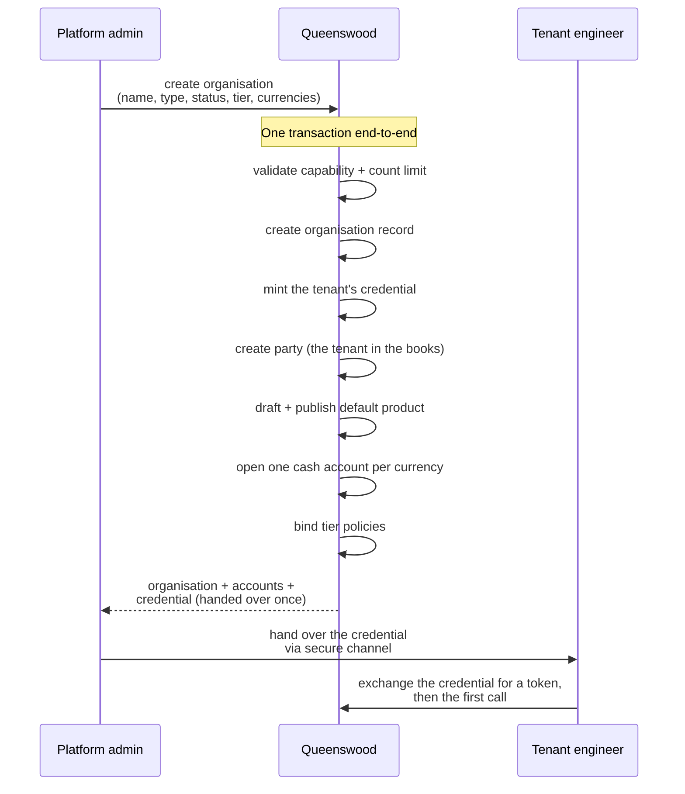

# Onboarding

## Objective

A new fintech tenant comes onto the Queenswood platform via a
single creation operation. One call by a platform admin
produces the tenant's organisation, a credential for the
tenant's own systems, a party representing the tenant in the
bank's books, a default product, a cash account per requested
currency, and the appropriate policy bindings — all atomic.
The credential is handed over once. The tenant immediately has
a working starting state: their systems can begin operating
without further bootstrap.

## Users and stakeholders

**Platform admin / Queenswood operator.** Drives the
onboarding operation. Decides the tenant's type
(customer vs internal), status (live vs test), tier (which
bundle of policies binds), and supported currencies. Receives
the credential, delivered once, to forward to the tenant.

**Tenant engineer.** The downstream recipient of the
credential. Their experience starts when they receive it and
exchange it for a short-lived token, which their systems do
again before each session of calls. Cares about: the
credential being usable immediately, the tenant having a
settled starting state (settlement account exists, default
product is published), the tier being correct for their use
case.

**Tenant organisation.** The entity created — the
multi-tenant boundary that scopes everything else.

## Goals

- **Single-call creation.** One operation creates the entire
  tenant. No follow-up calls to bootstrap a working state.
- **Atomic.** Either the tenant comes up complete or doesn't
  come up at all. No half-created tenants.
- **One-time credential delivery.** The credential is handed
  over exactly once, at creation. The tenant must store it;
  the platform doesn't.
- **Status decides what the credential reaches.** A test
  tenant's credential reaches the sandbox; a live tenant's
  reaches the live service. Moving a tenant between the two
  moves what its credential reaches, without the tenant being
  issued a new one.
- **Tier-based policy binding.** A `tier` label at creation
  time binds the tenant to the corresponding bundle of
  policies. Different tiers can ship with different rule
  sets, and a platform operator uses the banking API to move
  a tenant to another tier afterwards, which rebinds it to
  that tier's bundle.
- **Self-service signup.** A person signs in to the
  management console with their own identity, names the
  company they act for, and the banking API creates their
  tenant bound to that company and makes them its owner. No
  operator is in the loop.
- **Default product and accounts.** A settlement product
  (for customer tenants) or internal product (for internal
  tenants) is drafted and published, and accounts are opened
  in each requested currency. The tenant has bookkeeping
  capacity from the moment of creation.
- **Multi-tenant isolation.** Every record created carries
  the tenant's organisation identifier. Other tenants cannot
  see this data; isolation is enforced at the data layer.

## Non-goals

- **Billing or pricing.** No subscription, metering, or
  invoicing.
- **Tenant deactivation, closure, or off-boarding.** Tenants
  once created are permanent. No flow to close one.
- **More than one credential per tenant.** Only the default
  credential is issued. Issuing further ones is a separate
  concern, with limited tooling today and no polished
  self-service flow.
- **End-customer accounts at create time.** The accounts
  opened by this flow are the tenant's bookkeeping accounts
  (settlement or internal). Customer-facing accounts are
  opened separately by the tenant for their customers.
- **User management.** A tenant's own systems act as the
  tenant when they call. Who else may sign in to a tenant,
  and what each of them may do, is [users](users.md) and
  [memberships](memberships.md).
- **Per-credential audit attribution.** Which platform admin
  created the tenant isn't recorded.

## Functional scope

A platform admin uses the banking API to create a new tenant
in a single call.

**The call accepts:**

- Organisation name.
- Type — customer (an external fintech) or internal
  (Queenswood's own bookkeeping tenant).
- Status — live (production-grade) or test (sandbox).
- Tier — a string label identifying the policy bundle that
  should bind to this tenant.
- Currencies — list of ISO 4217 codes (e.g. `"GBP"` or
  `"GBP" "EUR"`).

**The call returns:**

- The created organisation (with metadata).
- The tenant's party.
- The tenant's accounts (one per currency, with embedded
  balance buckets).
- The tenant's credential — handed over once, at creation.

**Atomicity.** The operation runs as a single transaction
end-to-end. If any step fails — a capability denied, a count
limit exceeded, a currency rejected, the credential not
minted — the whole tenant rolls back. There is no partial
state to clean up.

**Signing up without an operator.** A person signing in to
the management console for the first time names the company
they act for. The banking API looks that company up in the
registry of record, refuses one that is not active, and
creates the tenant in the same single call — test status,
the entry tier, sterling, bound to the confirmed company,
with the signed-in person as its owner. The call returns the
same starting state the admin route returns.

**Moving a tenant afterwards.** A platform operator uses the
banking API to move a tenant to another tier, which rebinds
it to that tier's policies, and between test and live, which
moves what the tenant's existing credential reaches.

## User journeys

### 1. Platform admin creates a customer tenant

A new fintech wants to integrate with Queenswood. The
platform admin decides the tenant's tier, uses the banking
API to create the organisation, receives the bootstrap
output, and forwards the credential to the fintech via a
secure channel. The fintech now has a working starting
state.

### 2. Tenant engineer's first API call

The tenant engineer receives the credential and:

1. Exchanges it for a short-lived token.
2. Configures that token for their HTTP client.
3. Calls a low-stakes endpoint (e.g. list cash accounts) to
   verify the credential works.
4. Sees their settlement (or internal) account ready to use.
5. Begins building their integration: creating their
   customers (parties), opening accounts for those customers,
   processing payments.

### 3. Tenant changes status

An operator moves a tenant between test and live. The
credential is unchanged — the tenant keeps the one it was
given at creation, and is not asked to store a new one. Tokens
the tenant already holds keep their old reach until they
expire, and the next token the tenant obtains has the new one.

## Open questions

- **Off-boarding / closure.** No flow exists to close a
  tenant. Operationally needed if a customer relationship
  ends.
- **Credential rotation and revocation.** Neither is
  offered. A compromised credential is replaced by an
  operator by hand today, which is the sharpest gap in this
  list.
- **Service-account credential self-service.** A tenant gets
  one credential at creation; there's no self-service flow to
  provision or scope additional ones.
- **Per-tenant audit.** Who created the tenant, when, on
  what authority — none of this is recorded today.
- **Billing.** No metering or invoicing for tenants.
- **End-customer identity federation.** Authentication is
  Keycloak-issued JWTs today — service-account credentials
  for a tenant's backend and OIDC sign-in for operators and
  org users (a `User` model already exists). What's still
  future is federating a tenant's *end customers* to the
  tenant's own identity provider. See
  [tdd/authentication](../tdd/authentication.md).

## References

- **Engineering view**: [tdd/banks](../tdd/banks.md)
  for the all-or-nothing bootstrap;
  [tdd/authentication](../tdd/authentication.md) for the
  credential mechanism.
- **Platform context**: [platform](platform.md).
- **Bootstrap side-effects** (each has its own PRD):
  [parties](parties.md) — the tenant's party is created
  here; [cash-account-products](cash-account-products.md) —
  the default product is published here;
  [cash-accounts](cash-accounts.md) — the bootstrap accounts;
  [policies](policies.md) — tier bindings.
