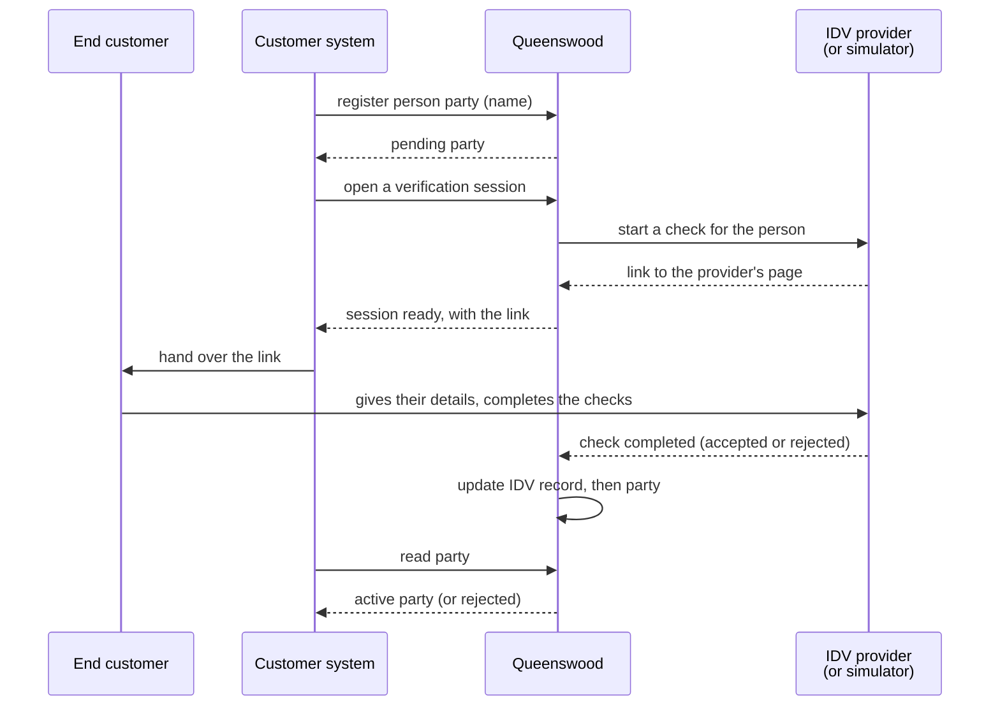
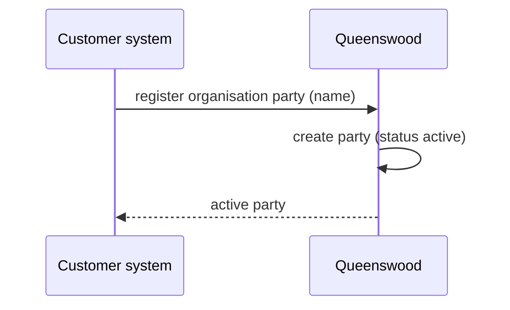

# Parties and identity

## Objective

Every account on the Queenswood platform belongs to a
**party** — a person, a non-person organisation, or an
internal bookkeeping identity. Customers register parties
through the banking API; person parties pass identity
verification (IDV) before they can transact, while
organisation and internal parties become active immediately.
The party model is the *who* on both sides of every
movement of money.

The platform keeps a person's name and the outcome of their
identity checks. What proves who they are — their date of
birth, address, nationality, identity numbers and documents —
they give to the identity verification provider the customer
uses, and it stays there.

## Users and stakeholders

**Customer engineering team.** Calls the banking API to register parties on
behalf of their end customers. Cares about: the flow from creation to active
being predictable, KYC failure modes being legible, the active state being
something they can react to or poll for.

**End customer.** The natural human (or the business) on
whose behalf a party is registered. Doesn't interact with
Queenswood directly — they go through the customer's
end-customer-facing surface. Their name ends up in the party
record, and everything else they give to the identity
verification provider directly.

**Platform operator.** Indirectly involved. Operates the platform that runs
IDV, and chooses which IDV providers an installation offers; needs the platform
to hold no identity evidence it would have to protect, answer for, or erase.

## Goals

- **Three party types in one model.** Person, organisation
  (non-person legal entity), and internal (the bank's own
  bookkeeping identities — settlement, fee P&L, suspense).
  One uniform party concept across all three; type
  discriminates lifecycle and KYC obligations.
- **KYC for persons.** Person parties carry identity
  verification before they can transact. Status starts
  pending; flips to active when IDV accepts. This is the
  KYC gate the platform enforces.
- **No KYC for non-persons.** Organisation and internal
  parties become active on creation. The platform doesn't
  carry per-organisation KYB or extra checks for internal
  bookkeeping identities.
- **Hands-off activation.** When a person party's identity
  verification completes, activation happens automatically.
  The customer doesn't have to make a follow-up call to flip
  the status.
- **Names, not evidence.** A person party carries the
  person's given, middle and family names and, optionally,
  the customer's own reference for the person. The platform
  keeps whether each identity check passed, never what the
  provider read.
- **Soft name matching.** The platform offers a way to
  compare two name strings — match, close match, or no
  match. Used in Confirmation of Payee and other places
  where names need to line up without being identical.
- **Multi-tenant isolation.** Every party belongs to one
  organisation. Organisations don't see each other's
  parties.

## Non-goals

- **Production identity-verification provider.** The
  platform integrates with Zyphe via a pluggable adapter. A
  simulator standing in for the provider covers development
  and tests; pointing the adapter at production Zyphe (real
  credentials, a real webhook URL) isn't a deployment the
  platform ships today. See Open questions.
- **Periodic re-verification.** Once active, a person party
  stays active. No periodic KYC refresh, no sanctions
  re-screening, no address-change-triggered re-verification.
- **Party suspension or closure.** Active is essentially
  terminal in the lifecycle today. A party flagged for fraud
  or sanctions has no status path away from active.
- **Party merging.** Two records for the same physical
  person — created in error, or arising from a duplicate —
  can't be merged.
- **Holding identity evidence.** The platform keeps no date
  of birth, address, nationality, identity number or
  anything read off a document. These live with the identity
  verification provider, given there by the person. See
  [ADR-0045](../adr/0045-a-persons-identity-evidence-stays-with-the-customers-provider.md).
- **Vendor-grade name matching.** The platform's name
  comparison is deliberately simple. It isn't a
  fuzzy-matching library and isn't a Confirmation of Payee
  scoring engine.
- **Party–user link.** Parties are not users. A `User` (the
  authenticated human) now exists and is separate from
  parties; what's missing is a *link* between them — see Open
  questions and [tdd/authentication](../tdd/authentication.md).
- **Know-your-business (KYB) for organisation parties.**
  Non-person parties activate on creation without
  beneficial-owner checks, sanctions screening, or
  registration-document capture.

## Functional scope

A customer uses the banking API to register parties that hold
accounts and appear on transactions.

### Creating a party

The customer uses the banking API to register a party,
supplying:

- The party type (person, organisation, internal).
- A display name.
- For person parties, the person's given name, family name
  and any middle names.
- Optionally, the customer's own reference for the person.

A registration that also supplies a date of birth, an address,
a nationality or an identity number is refused, so none of
them reaches the platform by accident.

The call returns the created party with its identifier and
status. For organisation and internal parties, status is
active immediately. For person parties, status starts as
pending; activation follows once identity verification
completes.

Internal parties hold the bank's own books — settlement,
fee P&L, suspense and so on. A customer does not usually
register one: they are seeded when the organisation is
created, as [onboarding](onboarding.md) describes.

### Identity verification (person parties)

A person party is registered pending, and the customer's
system then uses the banking API to open a verification
session for the person. The platform asks the
organisation's IDV provider — the one chosen when the
organisation was created, from those the installation
offers, Zyphe for example, or a simulator standing in for
it — for a page the person completes, and hands its link
back on the session. The platform tells the provider the
person's name and nothing else. The person gives the
provider their details and documents and completes its
checks there; the provider notifies the platform when it's
done, and the platform flips the party to active (or
rejected). Whether the name on the document matches the
registered name is one of those checks. The customer sees
the new status the next time they read the party, and is
told by webhook where they have an endpoint.

A check can take anywhere from seconds to minutes for an
automated outcome, or hours to days for a human-review
case. The platform doesn't impose a timeout — the IDV
record stays pending until the provider's notification
arrives.

### Party lifecycle

Once a party is active, the customer uses the banking API to
move it through the rest of its lifecycle.

- **Suspension** pauses an active party — one under
  investigation, or temporarily out of use. It is
  reversible.
- **Resumption** returns a suspended party to active.
- **Closure** winds up an active or suspended party. It is
  final: a closed party cannot be reopened.

Closing is refused while the party still holds a cash
account that is not itself closed, so the customer closes the
accounts first and the party after.

These changes sit on a separate track from identity
verification. A party still awaiting verification, or one
verification rejected, cannot be suspended or closed. Each
call returns the party with its new status, and a request
against a party in the wrong state is refused, naming the
statuses the change accepts.

### What the platform keeps about a person

A person party carries the person's names and the customer's
reference where one was given. Each identity check is kept as
an outcome — passed, in review or failed — and the customer
reads those outcomes, never what the provider read. The
customer finds the evidence behind them in its account with
the provider.

### Name matching

The platform offers a way to compare two name strings and
return one of three outcomes:

- **Match** — the names are equivalent.
- **Close match** — the names look like they refer to the
  same person, allowing for middle names or abbreviations
  on either side.
- **No match** — they don't.

Used by Confirmation of Payee before an outbound payment, as
[payments](payments.md) journey 6 shows, and anywhere else a
name needs to be compared with some tolerance.

### Multi-tenant isolation

Every party record carries the organisation's identifier.
Cross-organisation reads are not possible through the
banking API.

## User journeys

### 1. Registering a person party

The customer registers a person party for one of their end
customers and gets a pending party straight away. It opens a
verification session, and hands the link the session carries
to the end customer, who gives the provider their details
and completes its checks.
When the provider notifies the platform that the check is
complete, the party becomes active (or rejected). The
customer sees the new status the next time they read the
party.

### 2. Registering an organisation party

Non-person legal entities don't carry KYC. The party is
created active and is immediately usable — accounts can be
opened against it, payments can name it.

## Open questions

- **Production IDV provider deployment.** The IDV adapter
  speaks Zyphe's HTTP API and runs against a simulator in
  development and tests. Pointing it at production Zyphe
  needs real credentials, a production webhook URL, a
  webhook secret, and operator runbooks —
  none of which are deployed today. Until that's in place,
  the platform isn't enforcing real KYC, even though the
  shape of the integration is real.
- **Simulator outcomes are scripted, not realistic.**
  The simulator's page takes the person through the steps a
  provider's would — their details, a document, a selfie,
  proof of address — and settles each step from sandbox
  values the person enters. It doesn't model document
  quality, a reviewer's queue, or rate limits. Assumed
  meanwhile: a demonstration shows the person's side of
  verification faithfully, and its outcomes are chosen.
- **IDV outcomes beyond accept and reject.** Today the
  platform models *accepted* and *rejected* only. Real IDV
  produces manual-review, expired, and partially-completed
  outcomes too. Each needs product semantics: what does
  the customer see, what's the retry path, who's notified.
- **Periodic re-verification.** Compliance regimes
  increasingly require periodic re-KYC, sanctions
  re-screening, and re-verification on material change
  (address, name). No flow exists.
- **A merged record is pointed at, not folded in.** A
  duplicate can be wound down and pointed at the record it
  duplicates, but nothing moves across: verification
  results and names stay on the duplicate. A customer
  reading the duplicate is directed to the surviving
  record, and one reading the survivor sees only what was
  recorded there. There is no way to undo a merge.
- **Name-matching sophistication.** Token-set matching
  after lower-casing covers the bulk of cases but misses
  accent folding, transliteration, edit-distance fuzziness,
  and honorific stripping. Real CoP scoring tends to need
  vendor-grade libraries.
- **Know-your-business (KYB) for organisation parties.**
  Non-person parties activate on creation without
  beneficial-owner checks, sanctions screening, or
  registration-document capture. A real platform offering
  business banking needs KYB.
- **Party–user relationship.** A `User` model now exists —
  see [tdd/authentication](../tdd/authentication.md) — but the
  relationship between parties and users still needs
  modelling. A user might
  act on behalf of a party, or be a party in self-service
  flows. Neither link exists today.
- **The customer's own provider account.** The provider
  account a person's evidence sits in should be the
  customer's, configured by them, so the evidence is theirs
  to keep and answer for. Assumed meanwhile: one provider
  account per installation serves every customer, and the
  evidence sits in the platform's account.

## References

- **Engineering view**: [tdd/parties](../tdd/parties.md)
  for the full data model, the verification flow, and how
  the code is organised.
- **Personal data**:
  [ADR-0045](../adr/0045-a-persons-identity-evidence-stays-with-the-customers-provider.md)
  — what the platform keeps about a person.
- **Platform context**: [platform](platform.md);
  [onboarding](onboarding.md) — the customer's own party is
  seeded here.
- **Adjacent capabilities**: [cash-accounts](cash-accounts.md)
  — accounts are owned by parties;
  [payments](payments.md) — payments name parties on both
  sides and use the name comparison.
- **Authentication**: [tdd/authentication](../tdd/authentication.md)
  — the `User` identity and the party–user link gap that sits
  alongside parties.
