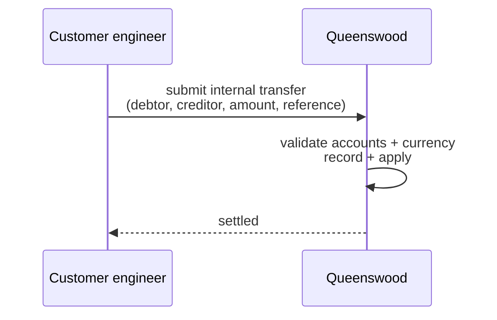
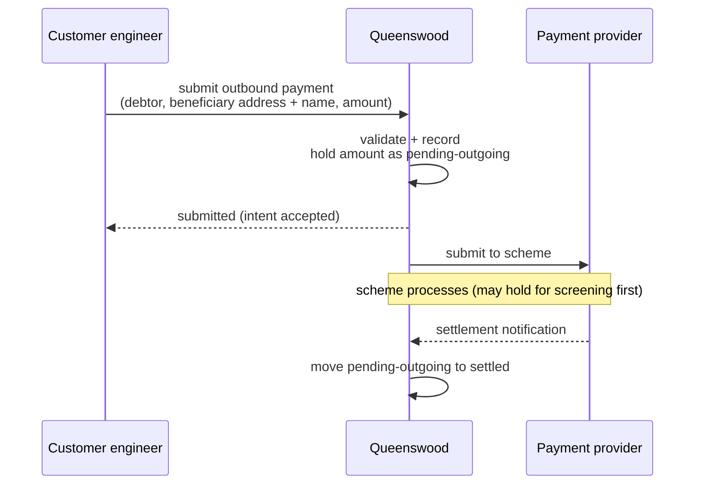
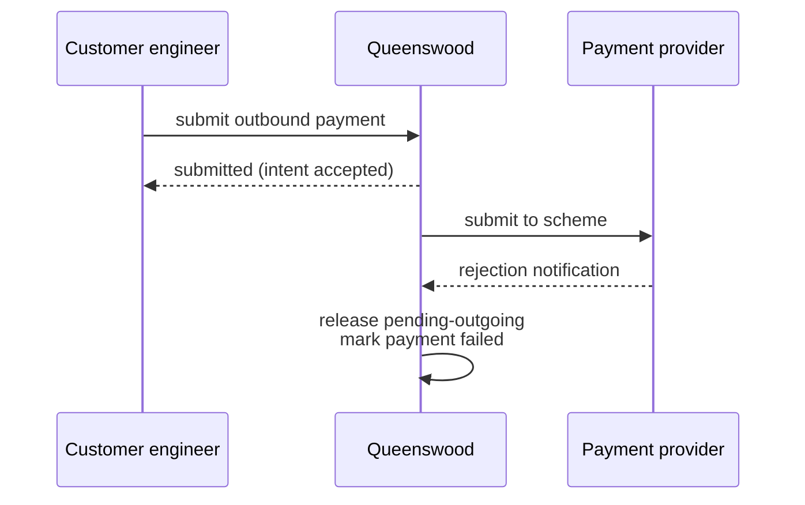
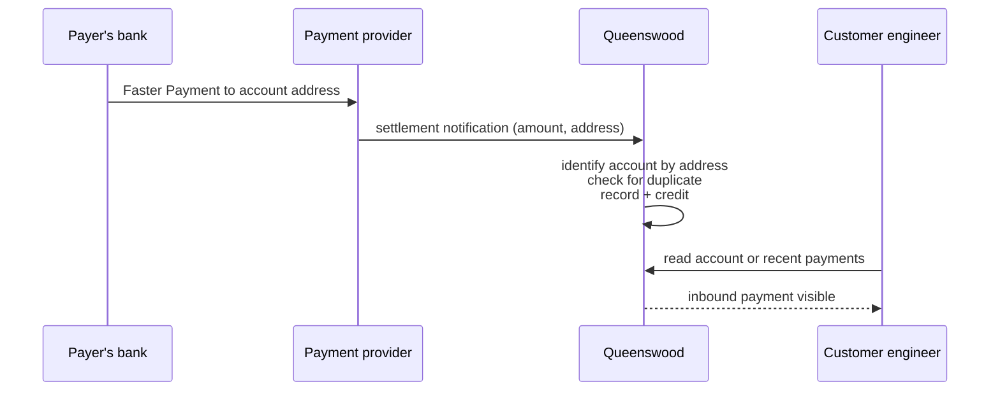
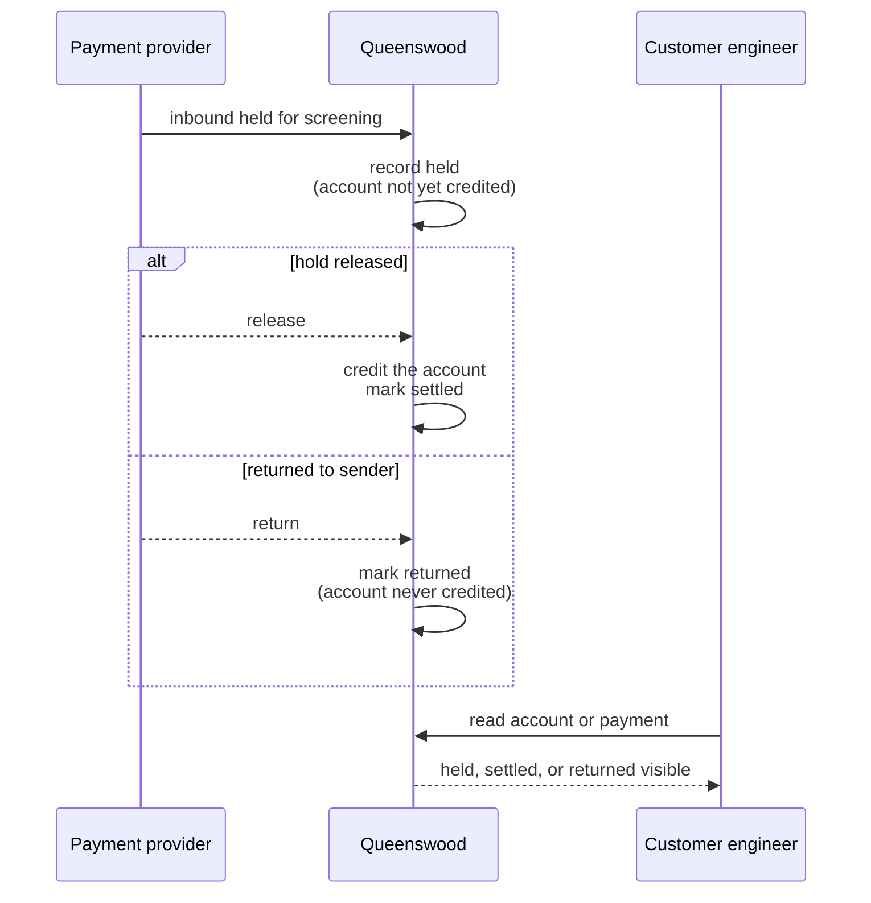
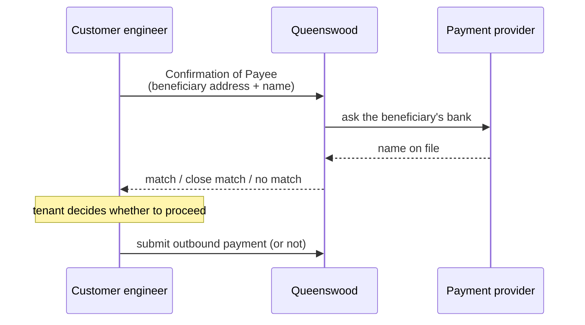
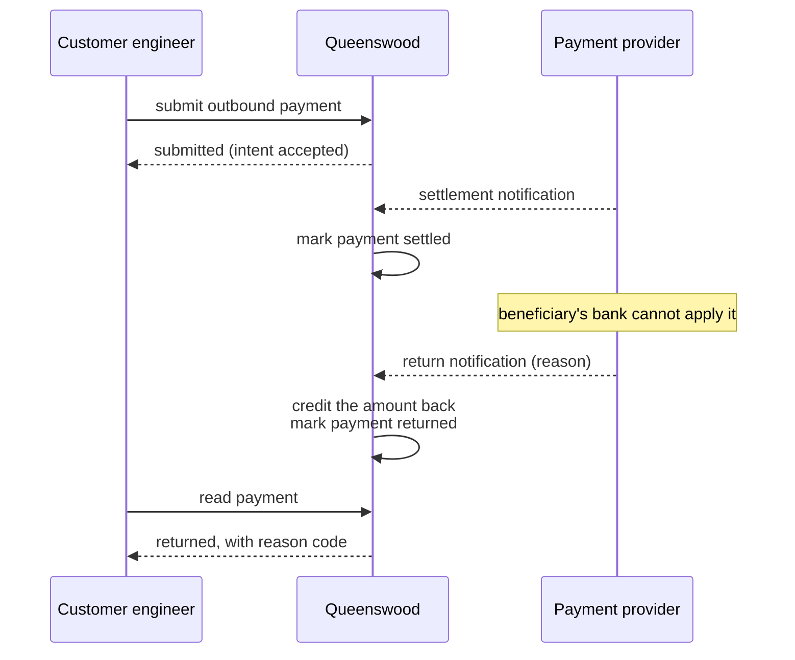
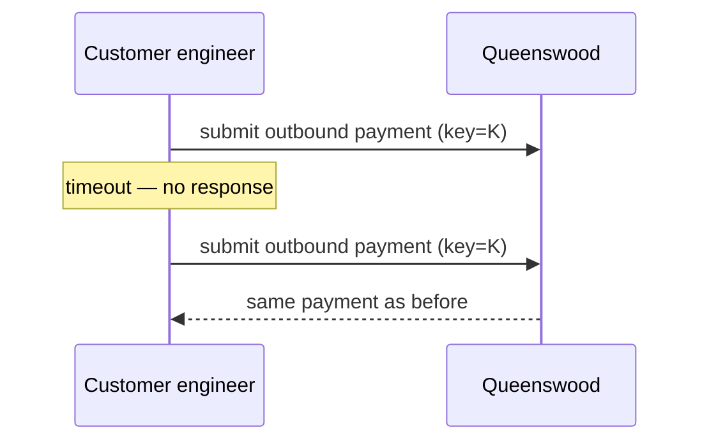

# Payments

## Objective

Queenswood moves money between accounts in three ways:
**internal** transfers between two accounts on the platform,
**outbound** payments leaving via UK Faster Payments, and
**inbound** payments arriving via the same scheme. Internal
transfers settle immediately. Outbound and inbound payments
are two-stage — the platform records the intent (or
receipt) first, then completes settlement once the scheme
confirms. Every payment is recorded against a transaction
on the account ledger, and is safe to re-submit without
double-processing.

The platform reaches the scheme through a payment provider,
which also issues each account's UK payment address. Which
provider an installation uses is the operator's choice, and
nothing a tenant does changes with it. Opening, rotating and
closing an account are in [cash-accounts](cash-accounts.md);
this PRD covers what the provider's part in them means for
payments.

## Users and stakeholders

**Customer engineering team.** Submits internal and outbound payments on behalf
of end customers, observes inbound payments landing on customer accounts, and
reconciles. Cares about: the outbound flow being predictable (intent accepted
now, settlement confirmed shortly after), Confirmation of Payee being available
for outbound, idempotency being safe to rely on for retries.

**End customer.** The party whose account is debited or
credited. Doesn't interact with the platform directly but
sees payments and balances through the tenant's surface.
Cares (implicitly) about: payments landing when expected,
the available balance reflecting in-flight outbound
payments, no double-debits or double-credits.

**Platform operator.** Chooses the payment provider an installation uses, and
runs its integration and the simulator that stands in for it during
development. Reconciles the provider's records with the platform's when they
disagree.

**Payment provider.** The third party that fronts UK
Faster Payments for the platform. Issues each account's
sort code and account number, receives outbound payment
submissions, sends settlement notifications, forwards
inbound payments, and answers Confirmation of Payee. Some
providers hold each account's money separately, others
hold every account's money together. Today the platform
integrates with simulators standing in for real providers.

## Goals

- **Three payment kinds in one surface.** Internal,
  outbound (UK FPS), and inbound (UK FPS). The tenant
  works with one consistent surface across all three.
- **Internal transfers settle now.** A transfer between
  two accounts on the platform is recorded and applied
  to both balances in one go. No pending state.
- **Outbound is two-stage.** When the tenant submits an
  outbound payment, the amount is immediately held in a
  *pending-outgoing* state on the debtor's account
  (visible in the available balance, unavailable for
  further spending). The scheme may hold the payment for
  screening first — the platform records it as *held*,
  the amount still reserved — and settlement is recorded
  once the scheme confirms.
- **Inbound is two-stage too.** When an inbound payment
  arrives, the platform identifies the account by its UK
  payment address, records the receipt, and credits the
  balance. The scheme may hold an inbound for screening
  first; the platform records it as *held* — nothing
  reaches the account yet — and then either releases it
  (the credit lands) or returns it to the sender (the
  account is never credited). The tenant doesn't have to
  do anything to receive it.
- **Inbound payments that cannot land are parked, not
  lost.** When an inbound payment is for an account that
  cannot take it — frozen, not yet open, or over one of
  the bank's limits — the platform parks it in a suspense
  holding state rather than rejecting it, so the receipt
  stays recoverable and can be reconciled later. One for
  an address the platform never issued is set aside for
  the platform operator to investigate.
- **A returned payment comes back.** When the
  beneficiary's bank returns an outbound payment after it
  settled, the platform marks it *returned* and credits
  the amount back to the account it left.
- **Failures in standard terms.** A failed or returned
  payment says what kind of failure it was — declined by
  the scheme, refused by the provider, or never delivered
  — and carries the standard ISO 20022 reason code the
  industry uses, so it reads the same whichever provider
  an installation uses.
- **Missed notifications are recovered.** When the
  provider's settlement notification for an outbound
  payment does not arrive, the platform asks the provider
  what happened to it, so the payment settles or fails
  rather than staying open.
- **Balances agree with the provider.** Where the provider
  holds each account's money separately, every movement
  the platform makes between accounts — transfers,
  interest, rewards, fees — is made at the provider too,
  so the money held there matches what the tenant sees.
- **Confirmation of Payee.** Outbound payments can be
  checked against the beneficiary's bank for name
  agreement before going out. The platform compares the
  submitted name to the name on file at the beneficiary's
  bank and reports match, close match, or no match, using
  the name comparison from [parties](parties.md).
- **Idempotent submission.** Submitting the same payment
  twice with the same idempotency key returns the same
  result without doing the work twice.
- **Idempotent inbound.** If the scheme retries a settlement
  notification (network blip, missed acknowledgement), the
  platform notices the duplicate and treats it as a no-op.
- **Audit trail.** Every payment links to a transaction on
  the ledger; the transaction is the source of truth for
  what moved between which accounts and when.
- **Multi-tenant isolation.** Every payment belongs to one
  tenant. Tenants don't see each other's payments.

## Non-goals

- **Cross-border payments.** No SEPA, no SWIFT, no
  international wires. UK Faster Payments is the only
  scheme today.
- **Cross-currency (FX) payments.** Both legs of every
  payment are in the same currency. No FX conversion at
  the platform level.
- **Payment cancellation after submission.** Once an
  outbound payment is submitted, the tenant can't recall
  it through the platform.
- **Schemes other than UK FPS.** No BACS, no CHAPS, no
  card rails. Faster Payments only.
- **Direct debits.** Only push payments. Pull payments
  (DDI / mandates) aren't supported.
- **Bulk payments / batch files.** Each payment is its
  own submission.
- **Scheduled or future-dated payments.** Submissions
  process now.
- **Recurring payments.** No standing orders.
- **Sweeps and auto-transfers.** No platform-managed rule
  that moves money between two accounts on a schedule.
- **Payments without a Queenswood account on the
  platform side.** At least one side of every payment is
  always an account on the platform.

## Functional scope

A tenant uses the banking API to submit internal and
outbound payments, and to read inbound payments that have
landed on its accounts.

### Internal transfer

The tenant supplies:

- The debtor account (the account paying out).
- The creditor account (the account receiving). Both
  accounts must belong to the same tenant.
- The amount, in the accounts' currency.
- A reference (a free-text label visible on both sides).
- An idempotency key.

The platform validates the inputs, records a transaction,
and applies the legs to both balances in one atomic step.
The reply confirms the transfer is settled. The end
customer sees the balance change immediately on both
accounts. Where the provider holds each account's money
separately, the platform then moves the same amount
between the two accounts at the provider; the tenant sees
nothing of this, and the transfer stays settled whatever
the provider answers.

### Outbound payment

The tenant supplies:

- The debtor account.
- The beneficiary's UK payment address (sort code +
  account number).
- The beneficiary's name.
- The amount.
- A reference.
- An idempotency key.

Optionally, the tenant first asks the platform to perform
Confirmation of Payee — checking the submitted name
against the name on file at the beneficiary's bank.

The platform validates the inputs, records the payment as
*submitted*, and holds the amount in the *pending-outgoing*
state on the debtor's account. The available balance drops
straight away — the customer can't double-spend the held
amount. The reply confirms the intent has been accepted.

The platform then submits the payment to the scheme
through the payment provider. The scheme may hold the
payment for screening before it settles; while it is
held the amount stays reserved and the payment reads as
*held*. Some moments later, the scheme confirms
settlement; the platform completes the payment by moving
the amount out of pending-outgoing and marking the
payment *settled*.

If the scheme rejects the payment — whether it was still
in flight or held for screening — or the provider refuses
it, the platform marks it *failed*, records the kind of
failure and its reason code, and returns the held amount
to the debtor's available balance.

A settled payment can still come back: the beneficiary's
bank returns it when it cannot apply it, a closed account
for example. The platform marks the payment *returned*,
with the reason code, and credits the amount back to the
debtor's account.

### Inbound payment

When a UK Faster Payment arrives at one of the platform's
sort code + account number addresses, the payment provider
notifies the platform. The platform:

- Identifies the receiving account from the address.
- Checks that this isn't a duplicate of a notification
  already processed.
- Records the payment.
- Credits the receiving account.

Sometimes the scheme holds an inbound payment for
screening before it settles. The platform records the
held payment against the receiving account but credits
nothing yet — the funds sit with the payment provider.
When the hold is released, the platform credits the
account; if the payment is instead returned to the
sender, the account is never credited and the record
reads as *returned*.

If the account an inbound payment is for cannot take it —
frozen, not yet open, or over one of the bank's limits —
the platform doesn't discard it. It parks the receipt in
a suspense holding state for later reconciliation, so the
money stays recoverable. A payment to a closed account is
returned to the sender by the provider where the provider
closes the account with it, and parked otherwise. A
payment naming an address the platform never issued is
set aside for the platform operator.

The tenant doesn't have to do anything to receive an
inbound payment. They observe it by reading the account's
recent payments or by reading the inbound payment record
directly.

### Confirmation of Payee

Before an outbound payment is submitted, the tenant can
ask the platform to check the beneficiary's name against
the name on file at the beneficiary's bank, naming the
account the payment will leave where it knows it. The
platform returns one of three outcomes:

- **Match** — the names agree.
- **Close match** — the names look like they refer to the
  same beneficiary, allowing for middle names or
  abbreviations.
- **No match** — the names don't agree.

The result is informational. The tenant decides what to
do with it — proceed, warn the customer, or hold the
payment.

### Idempotency

Every submission carries an idempotency key (an envelope
identifier). Submitting the same payment twice with the
same key returns the same result; the platform doesn't
debit the customer twice. The tenant is expected to use
the same key when retrying after a network failure or
timeout.

For inbound payments, the payment provider's identifier
for the payment serves as the equivalent. If the provider
re-sends a settlement notification, the platform treats
the duplicate as a no-op.

## User journeys

### 1. Internal transfer

Both accounts move in one step. The end customer sees the
balance change on both sides immediately.

### 2. Outbound payment (happy path)

The tenant gets a quick reply confirming the platform has
accepted the intent. The customer sees the available
balance drop right away. Once the scheme confirms, the
payment is fully settled and the held amount is gone from
the account.

### 3. Outbound payment (rejected by scheme)

The platform releases the held amount back to the available
balance and marks the payment failed. The tenant reads the
payment to see the kind of failure and its reason code.

### 4. Inbound payment

The platform handles inbound payments without any tenant
action. The tenant sees the payment when they next read
the account or its payments. If the account cannot take
it, the receipt is parked in suspense for reconciliation
rather than discarded.

### 5. Inbound held, then released or returned

While an inbound is held, nothing reaches the account.
The platform credits the account only when the scheme
releases the hold; if the scheme returns the payment to
the sender instead, the account is never touched.

### 6. Confirmation of Payee before sending

The tenant uses the result to inform the end customer or
to decide whether to send.

### 8. Outbound payment returned after settling

The payment had settled, so the money had left the
account; the return brings it back as a credit, and the
payment reads as returned with the reason the
beneficiary's bank gave.

### 7. Idempotent retry

If the tenant doesn't get a response — network blip,
gateway timeout — they can re-submit with the same
idempotency key. The platform returns the original
result; no duplicate payment is created.

## Open questions

- **When the provider and the platform disagree.** Where
  the provider holds each account's money separately and
  refuses one of the movements the platform makes, the
  two balances differ. The platform records the refusal;
  it is assumed the operator reconciles by hand until the
  platform offers more.
- **Retrying a failed payment.** A failure carries its
  kind and reason code, but the platform does not say
  whether sending again could succeed. It is assumed the
  tenant decides from the reason code.
- **Two providers in one installation.** An installation
  uses one payment provider. It is assumed a bank wanting
  another provider is served by another installation.
- **Payment cancellation / recall.** Once an outbound
  payment is submitted, the tenant can't recall it. UK
  FPS does have an indemnity-claim recall flow; the
  platform doesn't expose it.
- **Payment statuses for the end customer.** The platform
  speaks in terms of *submitted*, *held*, *settled*, and
  *failed* for outbound payments, and *held*, *settled*,
  *returned*, and *suspended* for inbound. The tenant's
  customer-facing surface may want a simpler or
  differently-worded set ("being processed", "received by
  recipient", "bounced") that maps onto these.
- **Bulk payments.** No way to submit a batch in one
  call. A tenant moving a salary file or a supplier run
  has to issue many submissions.
- **Scheduled / future-dated payments.** No way to ask
  the platform to send a payment at a future date.
- **Recurring payments.** No standing-order capability.
- **Direct debits.** No DDI / mandate flow. Only push
  payments today.
- **Schemes beyond UK FPS.** BACS, CHAPS, SEPA, SWIFT
  — none of these are wired. Each would need its own
  scheme integration.
- **Cross-currency.** Payments are single-currency end
  to end. Cross-currency payments would need explicit
  FX handling, both inside the platform and at the
  scheme boundary.
- **Settlement-time skew.** The platform trusts the
  payment provider's ordering of settlement notifications.
  If notifications were ever delivered out of scheme
  order, downstream invariants might be affected.
- **The provider integration is approximate today.** A
  simulator stands in for each provider. The simulators
  cover every journey above and a small set of named
  rejection scenarios; production edge cases (partial
  scheme acceptance, retry storms, malformed
  notifications) aren't covered, and no provider's test
  environment has been used yet. It is assumed the
  default provider's test environment is used once the
  simulator covers every journey.
- **Confirmation of Payee placement.** CoP currently
  lives in the scheme adapter. Whether it stays there or
  moves into the payment surface is an open structural
  question.

## References

- **Engineering view**: [tdd/payments](../tdd/payments.md)
  for the data model, the payment flows, the contract
  every payment provider's integration meets, and the
  simulators' coverage.
- **Platform context**: [platform](platform.md);
  [cash-accounts](cash-accounts.md) — payments move
  money between accounts;
  [parties](parties.md) — parties name both sides of a
  payment, and the name comparison powers Confirmation
  of Payee.
- **Adjacent capabilities**: [interest](interest.md) —
  interest postings are recorded as their own kind of
  ledger movement, distinct from payments;
  [policies](policies.md) — capabilities and limits can
  bound which payments a tenant can submit, and when.
- **Engineering depth**:
  [tdd/transaction-processing](../tdd/transaction-processing.md)
  for the command-and-event substrate;
  [tdd/transactions-and-balances](../tdd/transactions-and-balances.md)
  for the double-entry posting model that sits under
  every payment;
  [tdd/idempotency](../tdd/idempotency.md) for the
  idempotency design.
