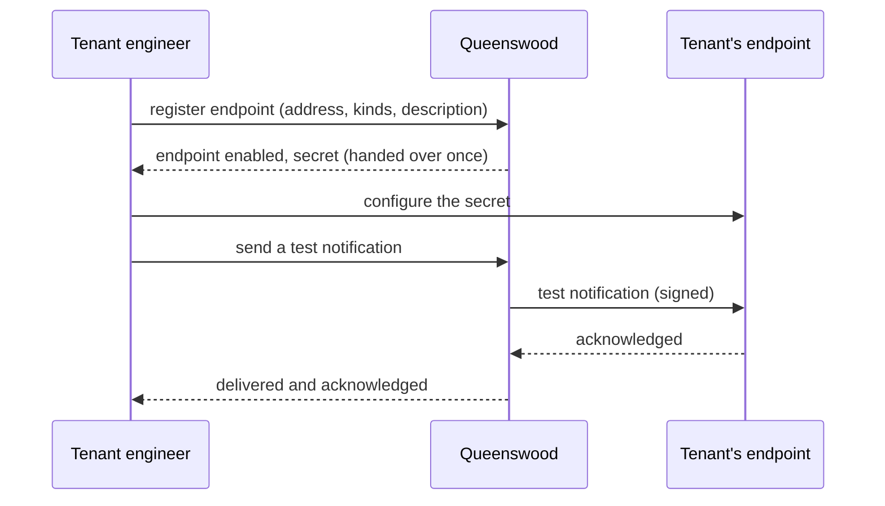
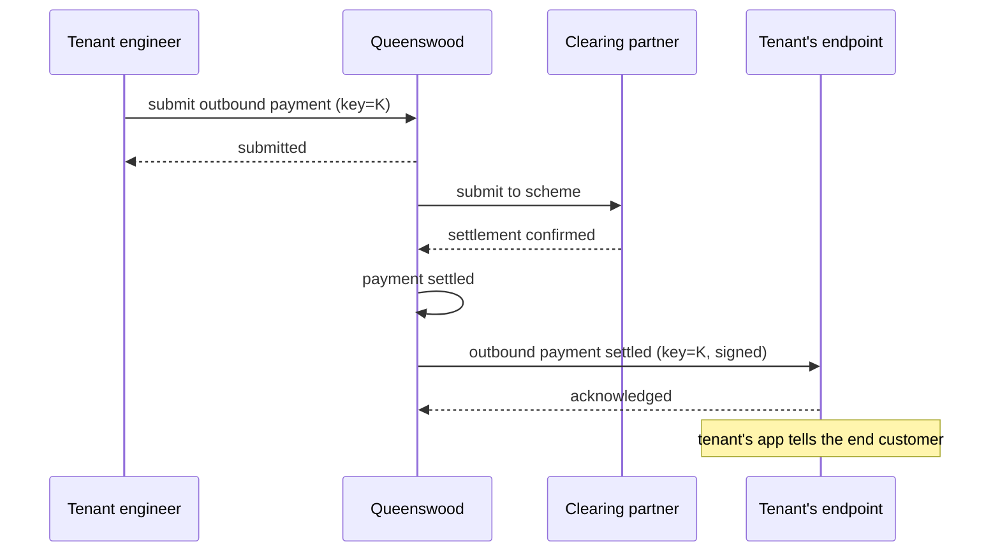
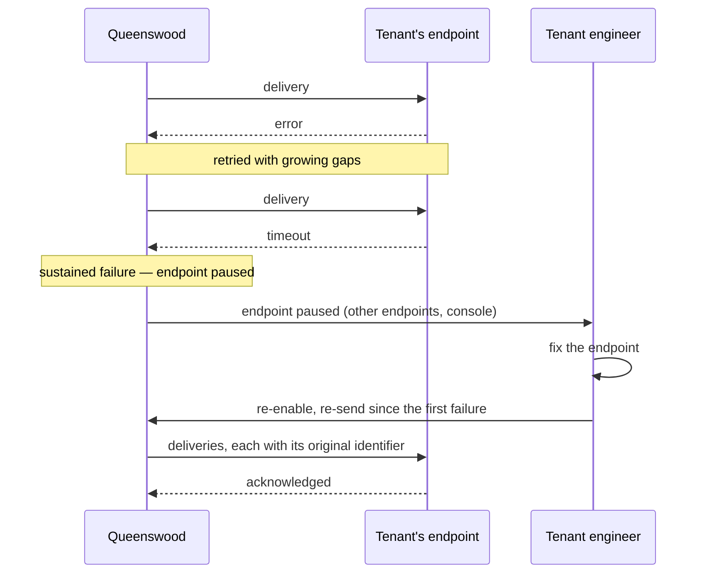
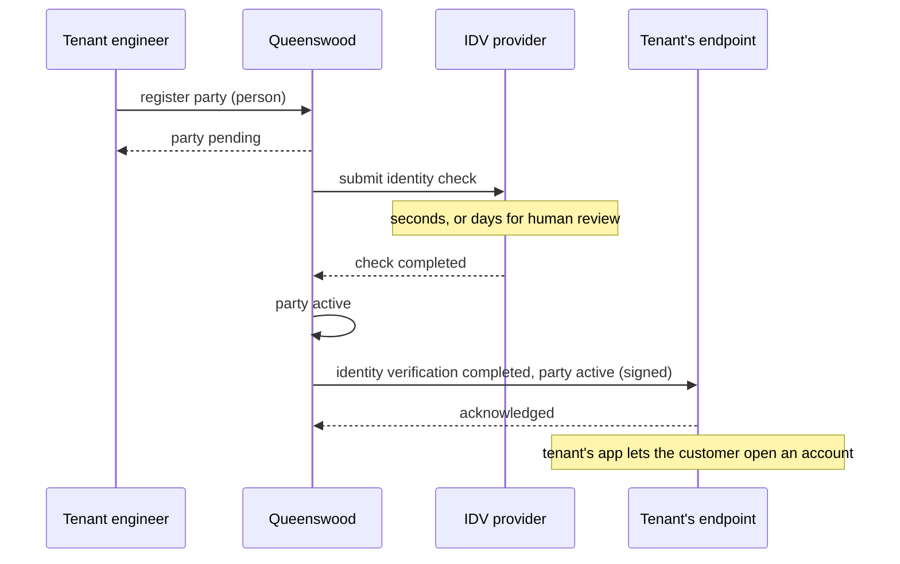

# Webhooks

## Objective

Queenswood answers questions but never volunteers anything. A tenant
learns that a payment settled, that identity verification finished, or
that interest was paid by reading the record again and again until the
answer changes. Webhooks reverse the direction: a tenant registers an
address its own systems listen on, chooses which changes it wants to
hear about, and the platform tells it. Each delivery is signed, retried
until the tenant acknowledges it, and recorded, so a missed delivery
can be found and sent again.

## Users and stakeholders

**Tenant engineer.** The primary user. Registers endpoints, chooses
what each receives, checks signatures, and builds the tenant's own
reactions — updating a customer's balance screen, releasing goods,
reconciling a ledger. Cares about: never missing a change, never
acting on a forged or stale delivery, telling a repeat from a new
change, and recovering cleanly after an outage of their own.

**End customer.** Never sees a webhook, but feels its absence. With
one, the tenant's app can say "your payment has arrived" moments after
it does, rather than whenever the app next happened to look.

**Platform admin / Queenswood operator.** Watches delivery health
across tenants, pauses an endpoint whose failures are consuming
delivery capacity, and answers "did we tell them?" when a tenant
disputes what it was told.

## Goals

- **Told, not asked.** Every change a tenant could otherwise only
  discover by reading a record again can be delivered as a
  notification. The first catalogue is below; the discipline from
  then on is that a record which gains a status gains a notification.
- **Self-service.** A tenant registers, changes, disables and removes
  endpoints through the banking API and the management console. No
  operator is in the loop.
- **Choose what to hear.** A tenant registers several endpoints, and
  each receives the kinds of notification the tenant chose for it —
  all of them, or a subset.
- **Delivered until acknowledged.** A delivery the tenant does not
  acknowledge is retried with growing gaps over a bounded window. One
  that exhausts its window is marked failed and kept, never dropped.
- **Signed.** Every delivery carries a signature and a timestamp, so
  the tenant can check that it came from the platform and is not an
  old delivery presented again. The signing secret is handed over once
  at registration and can be rotated without a gap in delivery.
- **Safe to receive twice.** A notification may be delivered more than
  once. Every delivery of it carries the same identifier, so the
  tenant can recognise a repeat.
- **Nothing is lost silently.** Every attempt is recorded with its
  outcome. The tenant can list what was sent, see why an attempt
  failed, and ask for any notification — or everything in a window —
  to be sent again.
- **The banking API stays the source of truth.** A notification says
  what changed and when. The record, read afterwards, is
  authoritative: a notification can arrive after a later change.
- **Test and live are separate.** An endpoint receives only what its
  tenant's status reaches, the same way its credential does.
- **Multi-tenant isolation.** A tenant is only ever told about its own
  records, and can only register endpoints for itself.
- **Policy-bounded.** Whether a tenant may register endpoints, and how
  many, come from the platform's policies.

## Non-goals

- **Telling the end customer.** No SMS, email, or app push to the
  human. The tenant's product does that, prompted by the webhook.
- **Anything other than an HTTPS address.** No delivery to an email
  address, to a queue the tenant owns, or over a long-lived connection
  the tenant holds open.
- **Choosing by record.** The tenant chooses kinds of notification,
  not individual accounts or parties to watch.
- **Guaranteed order.** Deliveries carry enough for the tenant to put
  them in order. The platform does not promise to deliver them in one.
- **Exactly once.** A delivery may repeat. It never goes missing
  silently, which is the guarantee that matters.
- **Tenant-defined shapes.** No templates, no filters on field values,
  no transformations. Every tenant receives the same shape for a kind.
- **Inbound webhooks.** What the platform receives from its clearing
  partner and its identity-verification provider is a separate,
  existing surface, described in [payments](payments.md) and
  [parties](parties.md). This PRD is about what the platform sends.
- **Alerting the operator.** A partner unreachable, a delivery backlog
  — these are operations concerns, not a tenant-facing surface.

## Functional scope

A tenant uses the banking API to register endpoints and to read what
was delivered to them. The platform delivers notifications to those
endpoints in the background as the tenant's records change.

### Registering an endpoint

The tenant supplies:

- The address — a public HTTPS URL the tenant's systems answer on. The
  platform refuses plain HTTP, and an address that resolves into the
  platform's own network.
- The kinds of notification the endpoint should receive — all, or a
  chosen list.
- A description, for the tenant's own reference.

The call returns the endpoint with its identifier, its status
(enabled), and its signing secret — handed over once, at registration.
The tenant must store it: the platform will not show it again.

At any time the tenant can ask the platform to send a test
notification to an endpoint and see whether it was acknowledged, and
can change the endpoint's address, description, and chosen kinds.

### What can be told

The first catalogue, by capability. Each entry is a change the tenant
would otherwise only discover by reading the record again.

- **Payments** — an outbound payment held for screening, settled, or
  failed. An inbound payment received, held for screening, settled
  after a hold, or returned to the sender. An internal transfer
  settled.
- **Parties** — identity verification completed, with the party now
  active or rejected. A party suspended, resumed, or closed.
- **Cash accounts** — an account opened, closed, frozen, unfrozen,
  moved to another product, or given a new payment address.
- **Interest** — interest paid into an account.
- **Cash account products** — a version published. A bulk move of
  accounts completed.
- **Tenant** — the tenant moved to another tier, or between test and
  live.
- **Webhooks** — an endpoint paused by the platform, delivered to the
  tenant's other enabled endpoints.

Changes the tenant makes itself — freezing an account, closing a party
— are told back as well. The system that asked is not always the
system that needs to know.

### What a notification carries

- An identifier, unique to the notification and unchanged across every
  delivery of it.
- The kind.
- When the change happened.
- The tenant's organisation identifier.
- The kind and identifier of the record that changed, and its status
  after the change.
- The record as it stood at that moment, exactly as the banking API
  returns it when read. A notification carries one of the API's own
  resources, so it has the resource's shape, fields and versioning,
  and is documented in the same OpenAPI document.
- Where the change completes something the tenant asked for, the
  idempotency key the tenant supplied, so the tenant can match the
  notification to its own request without keeping a lookup of the
  platform's identifiers.

### Delivery and acknowledgement

The platform delivers a notification by calling the endpoint's address
with the notification as the body, typically within seconds of the
change. The tenant acknowledges by answering with a success status
promptly, and does any real work after answering. Anything else — an
error status, a timeout, a refused connection — counts as not
acknowledged.

An unacknowledged delivery is retried with growing gaps — seconds, then
minutes, then hours — over a bounded window. A delivery that exhausts
its window is marked failed and kept.

When an endpoint has failed every delivery for a sustained period, the
platform pauses it: attempts stop, notifications for it go on being
recorded, and the pause is itself told to the tenant's other endpoints
and shown in the console. The tenant re-enables the endpoint once it
is fixed, and chooses whether the notifications recorded during the
pause are sent.

### Repeats and order

A notification is delivered until acknowledged, so it may reach the
tenant more than once — a retry after an acknowledgement that was lost
on the way back, or a re-send the tenant asked for. Every delivery of
it carries the same identifier, and the tenant treats a second arrival
of an identifier it has already acted on as done.

Deliveries are not promised in order. Two changes to the same record
may arrive reversed, or a notification may arrive after the tenant has
already read a later state. Each carries when its change happened and
the record's status after it, and the record read afterwards is
authoritative.

### Proving the sender

Every delivery carries a timestamp and a signature computed from the
endpoint's secret over the timestamp and the body. The tenant
recomputes the signature before acting, and rejects a delivery whose
signature does not match or whose timestamp is stale. A delivery that
fails either check is not one the platform just sent. The headers a
delivery carries and the way its signature is computed follow a
published webhook convention, so verification code a tenant already
has works unchanged.

The tenant can rotate an endpoint's secret. The new secret is handed
over once, the same way as the first, and for a rotation window every
delivery is signed with both, so the tenant switches its own systems
over without a delivery being rejected on either side of the change.
After the window the old secret is retired.

### Delivery history and re-sending

For a retention period, the tenant can list an endpoint's deliveries —
each with its notification, every attempt, when each was made, and
what the endpoint answered — and filter by kind, outcome, and time.

The tenant can ask for one notification to be sent again, or for
everything in a time window to be sent again, to one endpoint. A
re-send is a fresh delivery of the same notification, carrying the
same identifier, and is recorded alongside the original attempts.

### Endpoint lifecycle

- **Enabled** — receiving deliveries.
- **Disabled** — by the tenant, for as long as it likes. Nothing is
  attempted, notifications go on being recorded, and re-enabling is
  the tenant's call, with the choice of sending the gap.
- **Paused** — by the platform after sustained failure, or by an
  operator. Behaves as disabled. The tenant re-enables it.
- **Removed** — by the tenant, final. Its history stays readable for
  the retention period.

### Test and live

An endpoint belongs to its tenant and receives what the tenant's
status reaches: a test tenant's endpoints hear about the sandbox's
records, a live tenant's about live ones. Moving a tenant between the
two moves what its endpoints receive, and the endpoints stay
registered.

### Multi-tenant isolation

Every endpoint carries the tenant's organisation identifier. A tenant
is only ever told about its own records, and cannot register, read, or
remove another tenant's endpoints.

### Policy bounds

- **Capability** — whether the tenant may register endpoints at all. A
  tier might withhold it.
- **Count limit** — how many endpoints a tenant may have.

Both come from the platform's policy machinery — see
[policies](policies.md).

### The operator's view

An operator sees delivery health across tenants — attempt volumes,
failure rates, endpoints paused — and can pause an endpoint whose
failures are consuming delivery capacity. An operator can read any
tenant's delivery history, which is what settles a dispute over what
the tenant was told and when.

## User journeys

### 1. Tenant registers an endpoint

The tenant registers an address and stores the secret. A test
notification proves the endpoint is reachable and that the tenant's
signature check works, before anything real depends on it.

### 2. Outbound payment settles

The reply to the tenant said "submitted". Without a webhook, the
tenant reads the payment back until it says "settled". With one, the
platform tells the tenant as soon as the scheme confirms, carrying the
idempotency key the tenant used to submit, so the tenant's own systems
match it to the original request. A rejection travels the same way,
as "failed".

### 3. Endpoint outage and recovery

Nothing was lost while the endpoint was down. Every notification was
recorded, and the tenant asks for the gap to be sent. A delivery that
did get through before the pause arrives again with the same
identifier, and the tenant recognises it as done.

### 4. Identity verification completes

A check that takes days is the case a webhook exists for. The tenant
stops reading the party back on a timer, and its app moves the
customer on the moment the outcome lands.

## Open questions

- **Proving the tenant owns the address.** Registration accepts any
  public HTTPS address. A challenge at registration — the endpoint
  must answer a delivery before it is enabled — would stop a tenant
  pointing the platform at an address that is not theirs. Whether the
  test notification is that challenge, or a separate step, is
  undecided.
- **The retry schedule, the window, and what "sustained" means.**
  Seconds, then minutes, then hours, for up to a day, and a pause
  after a day of unbroken failure are the working assumptions. The
  figures, and whether a tenant may tune them, are open.
- **Retention.** How long delivery history is kept, and how far back a
  re-send may reach.
- **Bursts.** Capitalisation pays interest into every account in one
  run. A tenant with many accounts receives one notification per
  account, all at once. Whether some kinds are told per run rather
  than per record, or delivered as a batch in one call, is open.
- **Being told the endpoint is paused.** Delivering the pause to the
  tenant's other endpoints assumes it has one. A tenant with a single
  endpoint learns of the pause from the console, which it is not
  watching. An out-of-band alert — email to the tenant's owner — is
  the obvious answer and is not designed.
- **Restricting who may call the endpoint.** Some tenants will want to
  accept calls only from the platform's published source addresses,
  or only with a client certificate. Neither is designed. Publishing
  a stable set of source addresses is the smaller of the two.
- **Growing the catalogue.** The first catalogue covers the changes a
  tenant asks about today. A new status on any record should ship
  with its notification. What keeps that true — a checklist, a review
  — is a discipline to establish.

## References

- **Engineering view**: [tdd/webhooks](../tdd/webhooks.md) for where
  each piece lives, the notification's shape, and the events the
  catalogue depends on.
- **Platform context**: [platform](platform.md);
  [onboarding](onboarding.md) — the one-time handover of a credential,
  which the signing secret follows.
- **What gets told** (each has its own PRD): [payments](payments.md),
  [parties](parties.md), [cash-accounts](cash-accounts.md),
  [interest](interest.md),
  [cash-account-products](cash-account-products.md).
- **Bounds**: [policies](policies.md) — the capability and count limit
  on endpoints.
- **Engineering view**:
  [tdd/transaction-processing](../tdd/transaction-processing.md) for
  how a change already travels between the platform's parts, which
  outbound delivery extends past the edge;
  [tdd/payments](../tdd/payments.md) and
  [tdd/parties](../tdd/parties.md) for the webhooks the platform
  receives from its partners, the mirror image of this surface;
  [tdd/idempotency](../tdd/idempotency.md) for the key a notification
  carries back.
