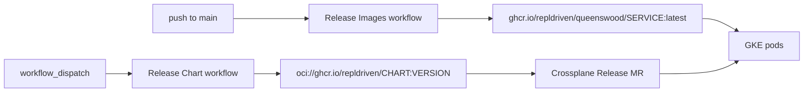

# Cloud deployment

## Status

**Superseded**, and describing the previous generation: one environment
keyed to `QUEENSWOOD_ENV`, secrets in `pass`, `gcp-up` and `gcp-down`
as imperative orchestrators, and a permanent kind control plane on one
laptop. Kept because `justfiles/cloud.just` still runs an instance this
way and nothing has replaced that yet.

The current model is an installation reconciled by its own management
plane — see [crossplane-app-deployment](crossplane-app-deployment.md),
[cloud-naming](cloud-naming.md) and [the
plan](../../plan/cloud-just-migration.md). This document carries no plugin
label, so nothing here becomes a rule; read it for what the old path
does, never for what to do now.

## Problem

You want Queenswood running on Google Cloud from published
artefacts — chart and images pulled from `ghcr.io`, nothing built
locally — and you want the standing footprint between sessions to
be as small as it can be while still coming back up quickly.

## Solution

The cloud path never builds anything. Two GitHub Actions
workflows publish to GHCR, `queenswood-platform/values.yaml` pins
what to pull, and Crossplane's `provider-helm` installs it onto
GKE. Local Docker, `kind load`, and the host-side registry belong
to the dev loop in [deployment.md](deployment.md) and play no
part here.

The footprint splits into three tiers. One is permanent, one is
the cheap floor you keep warm so the system can come back without
re-earning its public identity, and one is the tier that costs
real money and cycles up and down.

### Artefacts come from GHCR, not from your laptop



- **Images** — `release-images.yml` runs on push to `main` (and
  on demand), builds every service natively per architecture, and
  publishes a multi-arch `:latest` manifest per service under
  `ghcr.io/repldriven/queenswood/`. There is one moving tag.
- **Charts** — `release-chart.yml` is manual only. It packages
  `queenswood`, `queenswood-keycloak`, and `keycloak-operator`
  and pushes each as an OCI artifact to `oci://ghcr.io/repldriven`.
  Chart changes don't need an image rebuild, which is why the two
  workflows are decoupled.
- **Consumption** — `infra/helm/queenswood-platform/values.yaml`
  pins the chart `version` per release, plus
  `release.image.registry` and `release.image.tag` (`latest`).
  Those flow into the three `helm.crossplane.io/Release`
  resources the chart renders, each pointing at the
  `queenswood-gke` `providerConfigRef`.

The GHCR packages must be **public**. Pods pull with no
`imagePullSecret`, so a package left private after its first
publish surfaces as `ImagePullBackOff` on every service at once.
Flip visibility per package at
`github.com/users/<owner>/packages/container/<name>/settings`.

### Choose the environment before anything else

`QUEENSWOOD_ENV` (default `queenswood-test`) is the one knob that
decides which environment the `just` recipes talk to. It derives
the public domain (`<env>.repldriven.com`), the Cloud DNS zone
name (`<env>-zone`), the GKE namespace, and the Helm release name
inside the cluster.

It has a partner on the GitOps side:
`infra/helm/bootstrap/values.yaml` selects which values file the
`queenswood-platform` Application renders with
(`values-test.yaml` for `queenswood-test`, `values.yaml` for
`queenswood`). The two flip together — a `just` invocation
pointed at one environment and a bootstrap chart pointed at the
other will look healthy on the Argo side while every `kubectl`
in the recipes queries an empty namespace.

Resource *names* stay environment-agnostic
(`queenswood-ingress-ip`, `queenswood-gke`, `queenswood-cert`);
only namespaces, domains, and release names carry the
environment.

### Tier 0 — permanent, never torn down routinely

These survive every teardown short of
`just gcp-project-delete`:

- The GCP project and its billing link.
- The `crossplane-provider` service account and its IAM
  bindings, from `just gcp-iam-bootstrap`.
- Domain-ownership verification for the parent domain.
- The Cloud DNS `ManagedZone` and the four nameservers you
  pasted into the registrar.
- The backup bucket, `gs://<project-id>-backups`, holding the
  Keycloak exports and FDB's continuous backup.
- The `fdb-backup` service account and its HMAC key, plus the
  AES-256 key FDB encrypts backup files with. Both are in `pass`;
  losing the second one turns the bucket into objects nothing can
  read.

The zone is the expensive-to-rebuild one, and not in money. A new
zone gets a **different** nameserver set, so the registrar
delegation has to be updated and public resolution is broken
until it propagates, ownership verification may need redoing, and
each fresh zone burns one of GCP's per-domain NS-pool
allocations. That's why the platform chart declares the zone
`managementPolicies: [Observe]` — Crossplane reads it and never
writes it — and why `just gcp-down` leaves it alone.
`just gcp-dns-zone-delete` exists, prompts for confirmation, and
is for emergencies.

Objects in it are laid out as
`<service>/<backup-type>/<YYYY>/<MM>/<DD>/<HHMMSSZ>/`, so a
prefix listing selects a day or a month and per-service lifecycle
rules are expressible. FDB is the partial exception: `fdbbackup`
appends its destination to its own `backups/` and `data/` roots,
so its two segments land as `data/fdb/continuous/` and everything
below that is FDB's own. Nothing carries an environment segment,
because the bucket belongs to one project and the project to one
environment — which also assumes one system per project. A second
system sharing a project would take a `<system>` segment in front
of the service, or better, its own bucket: that scopes FDB's HMAC
key, which today holds `objectAdmin` over everything here
including the Keycloak dumps.

The bucket is what makes tier 2 disposable rather than
destructive. CloudSQL's automated backups are enabled, but they
are tied to the instance's lifecycle and `gcp-down` deletes the
instance — so an export is the only thing that survives a
teardown. Object storage costs pennies where a running instance
does not, which is the whole trade. FDB is covered the same way,
by a continuous backup rather than an export at teardown.

### Tier 1 — the external addresses, the floor worth keeping warm

- The static `Address` `queenswood-ingress-ip`.
- The apex and `keycloak.` A records pointing at it.
- The `DnsAuthorization` plus the managed `Certificate`.

All three are composed by the `XQueenswoodApex` and
`XQueenswoodCertificate` composites, cost almost nothing to hold,
and are slow to rebuild: certificate validation gates on DNS
propagation, and a fresh `Address` means a new public IP and new
A records for anything that had the old one cached.

`just gcp-down` deletes them today, because it is written as a
true down-to-zero. To keep the floor warm instead, run the
teardown steps individually and skip the three address-shaped
ones:

```bash
# Warm floor: drop the bill, keep the public identity.
kubectl --context "$(just _gke-ctx)" delete ns "$QUEENSWOOD_ENV" \
  --wait=true --timeout=5m
just kind-xp-down
just gcp-gke-delete
just gcp-cloudsql-delete
just gcp-vpc-delete
# skipped: gcp-ip-delete, gcp-cert-delete, gcp-dns-records-delete
```

The composed MRs take their external name from `metadata.name`,
so on the next `just gcp-up` Crossplane observes the surviving
`Address`, `Certificate`, and `RecordSet`s and adopts them rather
than creating duplicates. Confirm with `just gcp-health-check`
before trusting it — the certificate line should come back
`ACTIVE` in seconds rather than spending minutes in validation.

The VPC delete is in the warm list because the GKE cluster's
subnets belong to it and a leftover VPC blocks nothing on the
DNS side.

### Tier 2 — the bill

This is what actually cycles:

- The GKE cluster `queenswood-gke` and its node pool — autoscaled
  3 to 6 × `e2-standard-2`, 50 GB `pd-standard` each.
- The CloudSQL Postgres instance backing Keycloak.
- The persistent disks behind the FDB and Kafka StatefulSets.
- The load balancer fronting the Gateway.

The kind management plane (`xp-mp`) is local and free, but it is
not optional during teardown — see the drain rule below.

### Bringing it up

First time in a fresh project:

```bash
just gcp-org-create        # only if you have an org and need the policy
just gcp-project-create    # prints the new PROJECT_ID, sets it active
just gcp-up
```

Every time after that, `just gcp-up` alone is the whole cold
start. It logs you in, runs the IAM bootstrap, switches ADC to
impersonate the `crossplane-provider` SA, ensures the DNS zone,
stands up the kind management plane, and blocks on each Argo
Application going Healthy.

Two points in that run want a human:

1. **Nameservers.** When the `queenswood-platform` wave reaches
   the `ManagedZone`, the recipe prints the four nameservers and
   waits. Paste them into the registrar's NS records for the
   domain. Certificate validation gates on that propagating, so
   nothing downstream finishes until you do. Re-print later with
   `just gcp-dns-check`.
2. **CloudSQL wiring.** `just gcp-cloudsql-wire` waits up to 15
   minutes for the `XPlatform` XR to publish
   `status.connectionName`, then rewrites two fields in
   `queenswood-platform/values.yaml` and **commits and pushes**
   them. Argo reconciles from `main`, so an unpushed pin does
   nothing. It skips the commit when the values already match, so
   re-running is safe.

Finish with `just gcp-health-check`, which walks the whole
public-traffic chain — providers, IP, zone, records, XR, cert,
pods, FDB, the SQL proxy, Keycloak, the Gateway, then public DNS
and the two HTTPS probes — one line each.

### Bringing it down

```bash
just gcp-down
```

The order matters and the first step is the non-obvious one.
`gcp-down` drains the workload namespace on GKE **before**
killing kind. The GKE CSI driver only runs `DeleteDisk` while the
cluster is alive, and Crossplane on kind has to still be running
to clear namespaced finalizers. Destroy GKE with PVCs still bound
and the underlying persistent disks leak as orphans — two
up/down cycles of the FDB and Kafka StatefulSets is enough to
exhaust the default regional SSD quota and leave the next cold
start stuck on a pending PVC.

Before any of that, `gcp-down` closes off both backups. Then:
kill kind, delete the GKE cluster, delete CloudSQL, delete the IP,
certificate, VPC, and DNS records, prune the local kubeconfig
context.

Both stores are backed up at the same end of the teardown, before
the namespace drain, because both read from a live cluster — FDB
through the backup agents that run in that namespace, Keycloak
through a Job on its own image running `kc.sh export`. They are
taken together because they are only useful together: FDB
references the Keycloak subject, so a pair captured at different
moments restores a bank whose users no longer resolve.

`just gcp-keycloak-export` takes a final realm export on top of
the hourly scheduled one, confirms it landed whole by reading back
the `LATEST` pointer the export writes last, and records the
prefix. It refuses rather than continues if either step fails.

FDB's half is the same shape. Little is copied at that moment: a
continuous backup has been shipping snapshots and a mutation log
all along, so `just gcp-fdb-export` only stops it cleanly, so the
last mutations land, and records the version it can be restored
to. It refuses rather than continues if the backup is not
restorable — draining past that point is what makes the data
unrecoverable.

There is nothing to run to restore it. `gcp-up` reads that
recorded version out of `pass` and it travels to the chart as
`fdb.restore.version`, where a Job acts on it before anything
writes. That is not a convenience: the migrator saves record
metadata as soon as FDB is reachable, FDB refuses to restore into
a non-empty destination, and no human is fast enough to fit
between the two.

Read the value as a target — "this cluster's data should come
from version N" — rather than an instruction, which is what makes
it safe to leave set. The Job's name embeds the version, so
re-applying the same value resolves to the same completed Job,
and the Job checks the cluster is empty before doing anything.
Changing the version is the deliberate act, and in a GitOps flow
a reviewable one.

It restores the recorded version rather than the latest
restorable point, deliberately: the rebuilt cluster backs up into
the same container, and its versions bear no relation to the old
one's, so "latest" could mean the new empty cluster's own
snapshot.

The migrator blocks on that Job with no timeout escape, so a
failed restore stops the whole deployment rather than booting an
empty bank. Once the migrator writes, the restore is impossible
for good — failing loudly is the lesser outcome.

To skip a restore, remove
`<env>/backup/fdb-restore-version` from `pass` before
`gcp-up`; to restore a different point, put that version there
instead.

### Redeploying without cycling the cluster

- **New images under the same `:latest` tag.** Crossplane sees no
  spec diff, and `imagePullPolicy: Always` only re-pulls when a
  pod is created — so nothing moves on its own. Roll the
  deployments by component name:

  ```bash
  just gcp-k8s-redeploy-svc console api-service
  ```

- **Chart changes.** Bump the chart's own version, run the
  **Release Chart** workflow, then bump the matching
  `version` in `queenswood-platform/values.yaml` and push.
  `provider-helm` reconciles on spec drift only — a values-only
  edit to the chart's contents will not trigger a reinstall, but
  a version bump reliably will, even patch-level.
- **Migrator and bootstrap.** Their Job names embed `image.tag`.
  With a fixed `latest` tag, a reinstall does not re-run them;
  applying new FDB record metadata means deleting those Jobs so
  the next reconcile recreates them.

### Credentials

Three kinds, and which one a secret is decides where it lives.

**Generated, never seen.** The Keycloak admin client's signing
key. The chart mints it, preserves it across upgrades by looking
up the live Secret, and the bootstrap Job registers the public
half on the client. Nothing outside the cluster holds the
matching half, so losing it costs a regenerate-and-re-register
rather than a coordinated rotation — which is why it is in
neither `pass` nor git.

**Stored, pushed by you.** Anything issued elsewhere: the Google
IdP client secret today. `pass` holds it,
`just gcp-keycloak-vault-secret` puts it in Keycloak's vault.
Google minted it and holds the other half, so it has to be
recorded.

**Stored, injected at bootstrap.** Keycloak's CloudSQL password,
and FDB's two backup secrets — the GCS HMAC key and the AES-256
key its backup files are encrypted with. Each reaches every side
that needs it from one substitution in the root Application, which
is what stops those sides drifting.

The rule that sorts them: **store a secret only when something
outside your control holds the matching half.**

FDB's encryption key is the one that bends the rule, and it is
worth seeing why rather than treating it as an exception. Nothing
outside holds the matching half — we generate it, and no third
party ever sees it, which by the rule above would make it a
generate-and-forget secret like the Keycloak signing key. But the
*backup* holds the matching half, and the backup outlives every
cluster that could regenerate it. So the test is not really "does
someone else hold it" but "does anything we cannot recreate depend
on it", and a bucket full of ciphertext qualifies.

### Rotating the CloudSQL password

Crossplane cannot do this on a running instance, and it will not
tell you so. `google_sql_user`'s password is write-only —
Terraform cannot read it back, so upjet observes no drift and has
nothing to reconcile. The `User` MR sets the password at
**create** and never again, and it reports `Synced=True`
throughout, because "no diff detected" is not "the password is
what you think it is".

So a new value reaches both Secrets and neither reaches CloudSQL.
Nothing breaks immediately: an existing Postgres session survives
a password change, so Keycloak keeps working until it restarts —
and then fails to connect, at whatever moment it happens to
restart.

Check before restarting anything, and compare all three:

```bash
kubectl --context kind-xp-mp -n crossplane-system get secret \
  queenswood-keycloak-password -o jsonpath='{.data.password}' | base64 -d | md5
kubectl --context "$(just _gke-ctx)" -n "$QUEENSWOOD_ENV" get secret \
  queenswood-keycloak-conn -o jsonpath='{.data.password}' | base64 -d | md5
pass show "queenswood/gcp/$QUEENSWOOD_ENV/db/keycloak" \
  | head -1 | tr -d '\n' | md5
```

Agreement between those three is necessary but not sufficient —
they are all inputs, and CloudSQL is the one that decides. Prove
it by authenticating, then set it explicitly:

```bash
gcloud sql users set-password keycloak --instance=queenswood-keycloak \
  --project="$(just _gcp-project-id)" --prompt-for-password
```

Then restart Keycloak deliberately rather than waiting to find
out. On a torn-down-and-rebuilt instance none of this applies —
the password is applied at create, which is the path the normal
teardown cycle takes.

### When Crossplane stops reconciling

The `gcp-creds` Secret in `crossplane-system` is a copy of your
local application-default credentials, which impersonate the
provider SA. If the GCP providers start reporting auth failures
against a cluster that was previously healthy, refresh both ends:

```bash
just gcp-crossplane-login
just kind-xp-install-gcp-secret
```

## Rules

**MUST:**

- Publish images and charts to GHCR and let Crossplane pull them.
  The cloud path builds nothing locally.
- Keep `QUEENSWOOD_ENV` and the `valueFiles` entry in
  `infra/helm/bootstrap/values.yaml` pointing at the same
  environment.
- Drain the GKE workload namespace before tearing down the kind
  management plane, so the CSI driver frees persistent disks
  instead of leaking them.
- Commit and push what `just gcp-cloudsql-wire` writes. Argo
  reconciles from `main`, not from your working tree.
- Bump a chart's `version` to make `provider-helm` reinstall it.
  Editing chart contents alone is not a spec change.
- Make each GHCR package public after its first publish. Pods
  pull without an `imagePullSecret`.

**MUST NOT:**

- Delete the Cloud DNS `ManagedZone` as part of routine teardown.
  A replacement zone means new nameservers, a registrar update,
  probably re-verification, and one more NS-pool allocation
  burned.
- Bake an environment name into a cloud resource name.
  Environments are discriminated by namespace, domain, and values
  file. See [deployment.md](deployment.md).
- Put a `RecordSet` on a workload chart. Crossplane MR CRDs exist
  only on the management plane, not on the GKE target — DNS
  belongs in the apex composite. See
  [infrastructure.md](../../tdd/infrastructure.md).

**MAY:**

- Keep tier 1 warm by running the individual teardown recipes and
  skipping `gcp-ip-delete`, `gcp-cert-delete`, and
  `gcp-dns-records-delete`, when the environment will come back
  soon enough that a fresh IP and a fresh certificate validation
  aren't worth the wait.
- Point `helm` or `kubectl` at the GKE context directly for
  inspection or a throwaway experiment. Anything meant to survive
  goes through the values file and Argo, because `provider-helm`
  owns the release.
- Run `just gcp-project-delete` to retire an environment
  completely. It runs `gcp-down` first and leaves a 30-day
  undelete window.

## Discussion

The publish-then-pull split is what makes the cloud path
reproducible. A local build has a laptop's architecture, a
laptop's Maven cache, and a laptop's uncommitted working tree in
it. Pulling a published multi-arch manifest from GHCR means the
thing running on GKE is the thing `main` builds, and the only
per-deploy input that never reaches git — the project ID, which
carries a random suffix per `gcloud projects create` — enters the
system exactly once, through the single `envsubst` at
`just kind-xp-install-root`.

The three tiers exist because the cost curve and the rebuild-time
curve point in opposite directions. The GKE cluster is most of
the bill and takes minutes to rebuild. The DNS zone and the
external addresses are nearly free to hold and are the slowest
things to re-establish, because rebuilding them means waiting on
other people's resolvers. Tearing down what's expensive and
keeping what's slow is the whole trick, and it's why
`just gcp-down`'s down-to-zero default — which does delete the
addresses — is worth decomposing when an environment is coming
back the same week.

The drain-before-kind-down ordering is the one sequencing rule
that can't be recovered from cheaply. Everything else in the
teardown is idempotent `gcloud delete ... --quiet` calls that
tolerate being run twice or out of order. Leaked persistent disks
don't announce themselves; they show up as a pending PVC on a
cold start days later, with quota as the only symptom.

## References

- [deployment.md](deployment.md) — the local build and kind dev
  loop, the shared service Dockerfile, the chart's shape.
- [infrastructure.md](../../tdd/infrastructure.md) — the two-cluster
  split, the bootstrap chain and sync waves, the `XPlatform`
  composition, Keycloak topology, and the operational notes
  behind several rules here.
- [ADR-0016](../../adr/0016-crossplane-over-terraform.md) —
  Crossplane over Terraform.
- [ADR-0019](../../adr/0019-processor-packaging.md) — why the
  services group the way they do.
- `justfiles/cloud.just` — every `gcp-*` and `kind-xp-*` recipe
  referenced above.
- `justfiles/deploy.just` — `helm-*` and `kind-*` recipes.
- `infra/helm/queenswood-platform/values.yaml` — the pinned chart
  versions, image registry and tag, and CloudSQL wiring.
- `.github/workflows/release-images.yml` and
  `.github/workflows/release-chart.yml` — what publishes to GHCR.
