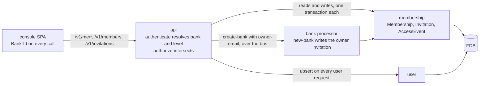

# Access

> **Status: proposal.** The `user` and `membership` bricks, the user
> path of the auth interceptors, the onboarding route and the console's
> sign-in flow exist and are named as such in Background. Everything
> under Proposed Solution is the build list, and "The MVP, in two
> slices" says what comes first.

## Objective

A person signs in with their own identity, an organisation comes to have
its first owner, that owner invites colleagues with a role that decides
what each may do, people change role and leave, one person works across
several organisations, and an operator returns a locked-out organisation
to its owners. This TDD says which records hold that, how a call names
the organisation it is for, how a role reaches the gate every route
already has, where each write lives, and the order the design is proved
in.

In scope: the `Membership` record's evolution and the `Invitation` and
`AccessEvent` records; the `membership` brick's writes and the domain
rules — who may do what to whom, and never ownerless; the request
header that names the organisation; the role levels on the `api` base's
gates and the sweep that puts one on every route; the routes under
`/v1/me`, `/v1/members`, `/v1/invitations` and `/v1/access-events`; the
owner email on the operator's create call; the console's screens; and
the tests.

Out of scope: sending the invitation email, which is the
outbound-communication capability — the API returns the link and the
console shows it; the operator's own screen, which needs the operator
realm in a front-end that has none today (see Known Limitations); a
request to go live raised from the console; token verification, the
principal shapes and the service-account lifecycle, which
[authentication.md](authentication.md) covers; and the organisation's
starting state, which [banks.md](banks.md) covers.

## Background

What exists is the one-owner, one-organisation flow the deleted users
and memberships PRDs described.

- **Two bricks, one write each.** `user` upserts a `User` keyed on the
  OIDC issuer and subject, on every authenticated user request, from
  the auth interceptor. `membership` creates a `Membership` from
  exactly one place: inside `new-bank`'s transaction in the `bank`
  processor, when the onboarding route passes one. Neither store writes
  a changelog. The `Role` enum holds owner, with admin, developer and
  viewer commented out at their reserved numbers. A membership has no
  status and no end, and a unique index on user and bank refuses a
  second membership for the pair.
- **The principal's bank is the first membership's.** `user-auth` lists
  the person's memberships and takes `:bank-id` off the first. The
  console reads the first membership too, and its request wrapper sends
  the bearer and nothing else about which organisation a call is for.
- **Every gate is one of three words.** A route declares `user`, `org`
  or `admin` in its OpenAPI security, and `authorize` intersects that
  with the principal's roles. `org` is granted by holding any
  membership, whatever its role, so a member reads and writes
  everything the organisation can. A principal that carries `org`
  without a bank is refused an `org` route with a detail saying so.
- **One organisation per person.** The onboarding route answers 409
  when the person already holds a membership, and `new-bank` re-checks
  it inside its transaction.
- **The operator's create call names no person.** `CreateBankRequest`
  carries name, status, tier and currencies. The operator app that
  once minted per-organisation tokens was removed, so an operator today
  is a `queenswood-admin` service token or an operator-realm user token
  at the API, with no screen.
- **Refusals already carry their source.** A policy refusal is
  `policy/denied` or `policy/limit-exceeded` in the problem's `type`;
  an edge refusal is `auth/forbidden`. Both are 403 and the `type`
  tells them apart.
- **One door on the console.** The sign-in screen has one button,
  which sends every person through the same Google flow, and the
  console decides what to show from the answer to `/v1/me` alone: no
  membership means the create screen.

The bank's owner membership, the sole-membership check and the 409 are
in [banks.md](banks.md); the user-JWT path and the `:org` grant are in
[authentication.md](authentication.md).

## Proposed Solution

### The organisation a call is for

A `Bank-Id` request header names the organisation a call is for. The
auth interceptor's user path reads it after verification:

- **A member's call** must name a bank the person holds an active
  membership in. The principal's `:bank-id` is that bank and its roles
  are the level held there. A header naming any other bank is refused
  403 `auth/forbidden`, and the detail says the caller is not a member,
  which reveals nothing about whether the bank exists.
- **A member's call with no header** takes the person's one active
  membership when there is exactly one, and none when there are
  several: `authorize` then refuses an org route with a detail saying
  to name the bank. A person with one organisation is never scoped to
  "the first one found", because there is no other.
- **A service principal's call** is scoped by its token: `azp` is the
  bank. A header naming a different bank is refused 403, so a
  misconfigured client cannot cross by accident.
- **An operator's call** — a principal carrying `admin`, whether the
  admin client or an operator-realm user — takes the header as the
  bank it acts on and carries the owner level there. With no header it
  carries no bank, as today.

The header is declared once, as a `components.parameters` entry beside
`Idempotency-Key`, and every route whose gate is an org level carries
it. The console's request wrapper sends it on every call once an
organisation is chosen.

The principal also carries `:membership`, the active membership the
header resolved to, so a handler that records an actor reads the
membership id off the request rather than finding it again.

### Roles on the gate

The gate vocabulary grows from three words to six. `user` and `admin`
stay as they are. `org` becomes four levels, written as OpenAPI scopes:

- `org:viewer` — every read of the organisation's own data.
- `org:developer` — every write the organisation's own systems make:
  parties, accounts, payments, products, webhook endpoints, jobs, the
  simulator's inbound transfer.
- `org:admin` — the people routes: invite, change a role, remove,
  withdraw and resend.
- `org:owner` — no route today. Rules that only an owner satisfies are
  in `domain.clj`, below, because they depend on the target as well as
  the actor.

A principal carries its level and every level below it, so `authorize`
keeps its rule — intersect the route's scopes with the principal's
roles — and gains nothing. A viewer carries `org:viewer`; a developer
that and `org:developer`; an admin those and `org:admin`; an owner all
four. A service principal carries `org:viewer` and `org:developer`, the
organisation's full authority over its own data and no hand in its
people, which the PRD leaves with people who sign in and with the
operator. An operator acting on a named bank carries all four.

The `org:admin` level is an organisation's role and `admin` alone is
the platform's operator, as it is today. The prefix is what keeps the
two apart in a route and in a principal.

A bare `org` is refused when the router is built, with the route's
path in the message, as a scheme naming no roles is refused today. That
is what makes the sweep complete: every `org` gate in the base is
rewritten to its level, or the service fails to start. The rule for the
sweep is the list above, and the two exceptions the authentication TDD
already records keep their shape with a level in place of `org`: the
simulator's inbound transfer is `org:developer` and `admin`, and the
companies routes stay `user`.

`org-without-bank?` generalises: a route satisfied only through org
levels, by a principal with no bank, is refused with its existing
detail.

**Which of the two refused.** A role refuses at the edge with
`auth/forbidden`, or in `domain.clj` with `membership/role-not-granted`
when the rule depends on the target. A policy refuses with
`policy/denied` or `policy/limit-exceeded`. The `type` names the one
that refused, and nothing else changes.

### Records

Three record types under `schemas/memberships/`, one evolved and two
new, registered where every record type is: the record-type union, the
FDB record-type declaration, and the `pb->`, `->pb` and `->java` trio
in the `schema` brick's `interface.clj`.

- **`Membership`** gains a status — active or ended, absent read as
  active — `ended_at`, `ended_by` and `invitation_id`, every one
  `optional`, because a `required` field added to a type with stored
  rows fails to parse every row written before it. The `Role` enum's
  three commented values are uncommented at the numbers they reserve.
  The unique index on user and bank is retired to `former-indexes`,
  since a person removed and invited again holds a new membership and
  the ended one stays; the rule it enforced — one active membership per
  person per bank — moves to `domain.clj`, checked inside the
  transaction that writes. The by-user and by-bank indexes stay and
  filter on status in the brick.
- **`Invitation`** — invitation id (prefix `inv`), bank id, email as
  the inviter typed it and lower-cased for matching, role, status
  (pending, accepted, declined, withdrawn, expired), the SHA-256 of
  the link's token, `expires_at`, the actor who invited, a reason, the
  user id that accepted, and timestamps. Indexed by bank, by the
  lower-cased email, and by token hash under a unique index. One
  pending invitation per address per bank is a domain rule inside the
  transaction, off the bank index.
- **`AccessEvent`** — the history the PRD's "What is recorded" reads:
  event id (prefix `aev`), bank id, kind, the actor, the subject's user
  id, membership id, invitation id and email where each applies, the
  role before and after, a reason, and when. The primary key is
  `[bank_id, access_event_id]` so a bank's history scans contiguously
  and, the id being time-ordered, in the order it happened. Kinds:
  bank created, invitation created, resent, accepted, declined and
  withdrawn, role changed, member removed, member left.
- **`Actor`** — a message the three share: kind (member or operator)
  and the principal id, a user id for a member or an operator-realm
  user, the client id for the admin client. Kind is what the history
  shows; the id is who.

The declaration follows
[schema-evolution](../recipes/code/schema-evolution.md): `version`
bumps once, the two new stores carry it as `since`, their indexes carry
it as `added` and `modified`, and the retired index is a former entry
under `memberships` with its `added` and the new version as `removed`.
`just test-all` runs the migrator's guard against the last `stable-*`
tag.

Why a history record rather than the changelog: the changelog is
written for the relay — an Avro payload keyed for a cursor a runner
tails — and nothing reacts to an access change today. A row per event,
keyed by bank, is what a list route pages. The invitation store writes
no changelog envelope in this design; the outbound-communication work
adds one on create and resend, and a runner for it, which is the hook
the email sender consumes. See Known Limitations.

### Synchronous, in one brick

Every access write stays synchronous — the `api` base calls the
`membership` interface directly, as it calls `webhook` and as the auth
interceptor calls `user` — because none has a property
[ADR-0018](../adr/0018-command-writes-are-earned.md) says earns a
command:

- **Multi-record atomicity under contention.** An accept writes the
  invitation, the membership and the event in one FDB transaction, and
  a role change or removal reads the bank's owners and writes in one.
  A single transaction is what gives that, and the bus adds nothing to
  it. Two owners demoting each other at once conflict on the owner
  reads; one retries, sees the other's write, and is refused.
- **Idempotency stakes.** A double-submitted accept meets
  `:invitation/invalid-status` on the second run, a double-submitted
  invite meets the one-pending rule. Neither mints anything twice.
- **Reaction.** No brick responds to an access change. The email
  sender will, and it consumes a changelog envelope when it exists;
  the write it reacts to stays where it is.
- **Unreliable ingress.** Every write arrives on an authenticated
  `/v1` request whose reply the caller reads.

So there is no `membership-query` split, and the brick keeps its name:
it owns the three records because an accept writes all three. The
`bank` brick keeps requiring it for the owner membership and gains the
owner invitation and the creation event, inside the same transaction.

### Invitations

An invitation is a record and a link. The link is the console's own
URL carrying the invitation id and a token: 32 bytes from
`SecureRandom`, base64url without padding, as the `webhook` brick mints
an endpoint secret. The store keeps the token's SHA-256 and the
plaintext is returned exactly twice, in the response to the create
and to each resend, for the console to show the inviter while the
platform cannot send email. The API never learns the console's origin:
it returns the id and the token, and the console composes the URL.

The token travels in an `Invitation-Token` header, never in a path,
so it does not reach an access log. A route that acts on an invitation
as its recipient accepts two proofs: the header's token hashes to the
record's, or the signed-in person's email matches the invited address
lower-cased. Either is enough, so a colleague who arrives without the
link finds the invitation under `/v1/me/invitations`, and one who
follows the link with an aliased address is not turned away. That is
the PRD's open question answered on the side of recording rather than
refusing: the accepting user id is written on the invitation and the
people list shows both addresses.

Guards in `domain.clj`, each the first binding of its `let-nom>`:

- **Create** refuses an address held by an active member
  (`:invitation/already-member`, 409), an address with a pending
  invitation in this bank (`:invitation/already-exists`, 409), and a
  role the actor may not grant — an admin naming owner
  (`:membership/role-not-granted`, 403 as an unauthorized anomaly).
- **Accept** requires pending and unexpired, refuses an active member
  of the same bank (`:membership/already-exists`, 409), and writes the
  membership with the invitation's role, the invitation as accepted
  with the accepting user, and the event, in one transaction.
- **Decline** and **withdraw** require pending.
- **Resend** requires pending or expired, mints a fresh token and a
  fresh `expires_at`, and returns the plaintext.
- **Expiry** is read, not written: a pending invitation whose
  `expires_at` has passed is expired to every read and every guard. No
  scheduler touches it. Every guard takes `now` as an argument so a
  test can pass a clock.

A refused source state is `:invitation/invalid-status`, carrying
`:message`, `:invitation-id`, `:status` and `:allowed`, and maps to
409. The lifetime is a constant in `domain.clj`, seven days.

### Managing people

Three transitions on a membership, all through the `membership`
interface and each writing the membership and its event together:

- **Change role** — by an owner, to any role; by an admin, from and to
  admin, developer or viewer. Refused `:membership/role-not-granted`
  otherwise.
- **Remove** — by an owner, anyone; by an admin, an admin, developer or
  viewer. The membership is ended with the actor and the time, never
  deleted.
- **Leave** — by the member, on the same terms as a removal, with the
  member as actor.

**Never ownerless.** Before any of the three ends or demotes an owner,
`domain.clj` counts the bank's other active owners in the same
transaction and refuses when there are none:
`:membership/last-owner`, mapped to 409, whose message says to make
someone else an owner first. The rule takes the bank's active
memberships as an argument, so the count is read inside the
transaction that writes and a concurrent demotion of the other owner
conflicts rather than slipping past. An operator calls the same
function through the same routes, which is why the PRD's "never needs
a bypass" holds without a flag.

A removed person is refused from their next action because
`user-auth` lists memberships on every request: the ended membership no
longer resolves a bank, and the header naming it is refused as any
non-member's would be.

### Creating an organisation

**From the console.** The route and the command stay. The
sole-membership check and its 409 go — a person may create another
organisation — and `new-bank` writes the creation event with the person
as actor beside the owner membership.

**By the operator.** `CreateBankRequest` gains an optional
`owner-email`. The command carries it and the actor, and `new-bank`
writes a pending owner invitation in the operator's name in the same
transaction as the bank, or none when the field is absent. The
response carries the invitation with its token beside the credential:
both are handed over once, by the operator, until the platform can
send email. The operator's later grant is the same invitation write —
`POST /v1/invitations` with role owner, a reason and the `Bank-Id`
header — so the handover of a new organisation and the recovery of a
locked-out one are one code path.

The `create-bank` Avro command schema gains the two fields, registered
in both YAMLs as the lifecycle recipe requires.

### The operator

An operator acts on an organisation by naming it in the header, and
carries the owner level there. The people routes need nothing further:
the actor on every write is the principal, so `AccessEvent` records the
operator's kind and id, and the organisation's owners read it in their
history beside their own changes. A reason is accepted on every people
write and required on an operator's invitation.

The operator's overview is the admin bank list: `GET /v1/banks`
carries each bank's active owners, enriched on read as a bank's party
and accounts are, and an organisation with none is one whose list is
empty. The operator's create call and grant are above.

### Routes

Under `/v1/me`, gated `user`, no header:

- `GET /v1/me` — the user, the active memberships with role and bank
  name, and an `operator` flag so the console knows what it may offer.
- `GET /v1/me/invitations` — pending, unexpired invitations to the
  signed-in email: organisation name, role, who invited, expiry.
- `GET /v1/me/invitations/{invitation-id}` — one, as its recipient
  sees it, by token header or email match.
- `POST .../accept`, `POST .../decline` — the same proof.
- `POST /v1/me/memberships/{membership-id}/leave` — the person's own.

Under the bank the header names:

- `GET /v1/members` — `org:viewer`. Active members, each with the
  user's name and email, role, joined, and who invited them, read off
  the invitation; the founding owner shows as having created the
  organisation.
- `POST /v1/members/{membership-id}/change-role`,
  `POST /v1/members/{membership-id}/remove` — `org:admin`.
- `GET /v1/invitations` — `org:viewer`. Pending and expired, with the
  invited and, once accepted, the accepting address.
- `POST /v1/invitations` — `org:admin`. Email, role, optional reason.
  Answers the invitation and the token.
- `POST /v1/invitations/{invitation-id}/withdraw`,
  `POST /v1/invitations/{invitation-id}/resend` — `org:admin`. Resend
  answers a fresh token.
- `GET /v1/access-events` — `org:viewer`, cursor-paged, newest first.

Every write route declares the idempotency interceptor pair or names
its guard in the base's `exempt-writes`, so the router coverage test
[idempotency.md](idempotency.md) requires passes:

- **The pair.** `POST /v1/invitations` and `.../resend`, each of which
  mints a token every time it runs. Past the cache window a retried
  create meets the one-pending rule and answers 409 rather than a
  second invitation.
- **Exempt, on a source-state guard.** Accept, decline, withdraw,
  remove and leave each leave the state they start from, so a repeat
  meets `invalid-status`.
- **Exempt, as an absolute set.** Change-role carries the whole role,
  so a second application converges.

Rejection mapping in the `api` base's override table:
`:membership/last-owner`, `:membership/invalid-status`,
`:invitation/invalid-status` and `:invitation/already-member` to 409.
`:invitation/already-exists` and `:membership/already-exists` fall to
409 by name, `:invitation/not-found` to 404 by name, and
`:membership/role-not-granted` to 403 as an unauthorized anomaly.

Every request and response body is a named component under `$ref`,
with examples, and the exported document is validated by the `api`
base's OpenAPI test as [ADR-0014](../adr/0014-openapi-3x-compliance.md)
requires.

### The console

**Log in and sign up.** The sign-in screen offers both, as two actions that run
the same Google flow and differ in what the console does on return. The intent
is written to session storage before the redirect and read after it, because the
identity provider carries nothing across. Log in lands on whatever is waiting —
invitations first, then the organisations the person belongs to — and, when
nothing is, on an empty state that names both ways in: ask a colleague for an
invitation, or create an organisation. It never drops a person into the create
screen. Sign up lands on the create screen, and when the person turns out to
hold a membership or a pending invitation the console says so and offers those
first, so a colleague who chose sign up by mistake is not steered into an
organisation of their own. The platform records the person on either action, by
the same upsert, and the API does not distinguish them.

The request wrapper sends `Bank-Id` on every call once an organisation
is chosen. The chosen organisation is kept in local storage keyed by
user id, which is what "returns to the one they last used" means: on
another device the person chooses again.

`App.svelte`'s state machine grows two stages before `app`:
`invitations`, when `GET /v1/me/invitations` answers any, and `choose`,
when the person holds more than one membership and local storage names
none. The `onboarding` stage becomes the create screen, reached from
sign up, from the empty state and from the switcher's foot.

Screens, one per section of the PRD, each a Svelte component beside
the existing ones: sign-in with log in and sign up; invitations
waiting;
choose an organisation, and the switcher in the shell's header; create
an organisation, as today with the credential shown once; people, with
members, pending invitations, the history and the actions the person's
own level allows, read off `/v1/me`; invite, a drawer answering the
link to copy; and accept an invitation, the route the link lands on,
with log in in front of it when the person is not signed in. The
link's id and token ride in the fragment, so they never reach the
console's nginx log either.

### The MVP, in two slices

The design is proved at the API before a screen is built on it, so the
scenario suite holds the contract the console then consumes.

Slice 1, the API:

1. The records: the proto changes, the declaration, the `schema` brick
   trio, `just force-prep`, and the guard green under `just test-all`.
2. The `membership` brick: domain rules and their tests, the store's
   new indexes, the transactions for invite, accept, decline, withdraw,
   resend, change-role, remove and leave, and the history read.
3. The `bank` brick: the sole-membership check removed, the owner
   invitation and the creation event inside `new-bank`, and the
   command schema's two fields.
4. The `api` base: the header, the levels, the router check that
   refuses bare `org`, the sweep of every route file, the new routes
   and components, the rejection entries, and `owner-email` on the
   create call.
5. The scenarios under `test-api-scenarios`, below.

A gap analysis runs against this TDD once slice 1 lands. Slice 2 is
the console: log in and sign up, the wrapper, the two stages, the
switcher and the screens. It adds no route.

### Tests

- **The `membership` brick** covers the who-may-do-what rules across
  every actor level, target role and new role; the ownerless guard
  with one owner, two owners and an operator actor; expiry against a
  passed clock; the one-pending and already-member rules; the token
  hash lookup; and that an accept run twice writes one membership.
- **The `api` base** holds that the router refuses a bare `org` gate,
  beside its existing check for a scheme naming no roles, and that
  the exported document validates with the new components.
- **API scenarios** in `test-api-scenarios/scenarios/access/`, using
  the test realm's human users and its operator: invite and accept by
  link, and by email match without the link; a viewer refused a write
  and a developer refused the people routes, each with
  `auth/forbidden`; an admin refused inviting an owner; the last owner
  refused leaving, then leaving once an admin is promoted; a removed
  person refused on their next call; one person owning one
  organisation and viewing another, switched by the header, with the
  header naming a third refused; the operator creating a bank with an
  owner email and the invitee accepting; the operator granting an
  owner with a reason and the history showing the operator's act; and
  the history route paging in order.

## Alternatives Considered

- **A path prefix per organisation** — `/v1/banks/{bank-id}/...` —
  instead of a header. Rejected: it rewrites every route and every
  client, and a service token, which already names its bank, would
  carry it twice.
- **The organisation in the token.** A claim naming the active bank,
  re-minted on switch. Rejected: switching becomes a round trip to
  Keycloak, and a token then says something the membership store may
  have since revoked.
- **Roles as separate scopes rather than a ladder** — a route naming
  every level that may pass. Rejected: every read route would list four
  scopes, and adding a level means editing every route.
- **Refusing an accept whose signed-in email differs from the invited
  one.** Recorded instead, as above. Stricter matching is a one-line
  guard if the PRD's open question closes the other way.
- **The token as the whole identity of the link**, with no id.
  Rejected: a lookup route by token alone has no resource to name, and
  the id lets the console show an invitation by email match with no
  token at all.
- **A dedicated `invitation` brick.** Rejected: an accept writes an
  invitation and a membership in one transaction, and a brick acts only
  on its own records.
- **The history as the changelog.** Above, under Records.
- **The credential carrying `org:owner`.** Rejected for now: the PRD
  keeps people management with people and the operator, and widening
  the credential is one line in `service-auth` if that changes.
- **A separate sign-up flow at the identity provider.** Keycloak's
  registration page is for local accounts, and every person here is
  federated, so log in and sign up are the console's and the provider
  sees one flow.

## Known Limitations

- **No email.** The link is shown to the inviter and handed on by hand.
  The outbound-communication work adds a changelog envelope on create
  and resend, a relay runner, and a consumer that sends.
- **Expiry is lazy.** No row is written expired, so the history never
  shows an expiry event; the invitation itself shows the state.
- **The last-used organisation is per browser.** Local storage, not
  the platform.
- **An operator has no screen.** The console signs in against the
  organisations realm and the operator realm's SPA client has no
  front-end since the operator app was removed. The operator's flows
  are API-only until the console can sign in against both realms or
  the operator app returns.
- **A single-membership call needs no header.** A client written
  against one organisation keeps working, and gains the header when
  its person gains a second organisation. The PRD's "never the first
  found" holds because there is no other to find.
- **An open session outlives a removal by one request.** The token is
  valid until it expires, and the membership check on the next request
  is what refuses.
- **No notification to owners** when a colleague accepts, declines or
  is removed, or when an operator acts, which the PRD lists as open.
- **The owner level gates no route.** Owner-only rules live in
  `domain.clj`, so an owner's authority is visible in the rules rather
  than the OpenAPI document.
- **History has no retention.** Events accumulate per bank.

## References

- [access](../prd/access.md) — Access, the product requirements this
  design serves.
- [onboarding](../prd/onboarding.md) — Onboarding, the owner email on
  the operator's create call.
- [authentication.md](authentication.md) — the interceptors, the
  principal shapes and the gate rule this design extends.
- [banks.md](banks.md) — the create transaction the owner invitation
  joins.
- [onboarding.md](onboarding.md) — the user and membership bricks as
  first built, and the console flow this design grows.
- [idempotency.md](idempotency.md) — the pair, the exemptions and the
  router coverage test.
- [service-apis.md](service-apis.md) — OpenAPI assembly and the
  rejection mapping.
- [ADR-0014](../adr/0014-openapi-3x-compliance.md) — OpenAPI 3.x
  compliance.
- [ADR-0018](../adr/0018-command-writes-are-earned.md) — Command writes
  are earned, why every access write is synchronous.
- [ADR-0021](../adr/0021-changelog-relay.md) — Changelog relay, the
  hook the email sender will consume.
- [schema-evolution](../recipes/code/schema-evolution.md) — the
  declaration steps for the evolved and new stores.
- [lifecycle-transitions](../recipes/code/lifecycle-transitions.md) —
  the guard shape and the checklist each transition follows.
