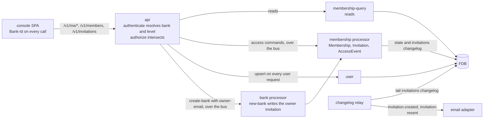

# Access

> **Status: proposal.** The three slices are implemented: the records,
> the `membership` processor and its `membership-query` sibling, the
> changelog an invitation writes, the `Bank-Id` header, the four levels,
> the access routes, and the console's screens with the accept screen an
> emailed link opens. Background describes slice 1 as first built,
> Proposed Solution is the design, and "The MVP, in three slices" gives
> the order.

## Objective

A person signs in with their own identity, an organisation comes to have
its first owner, that owner invites colleagues with a role that decides
what each may do, people change role and leave, one person works across
several organisations, and an operator returns a locked-out organisation
to its owners. This TDD says which records hold that, how a call names
the organisation it is for, how a role reaches the gate every route
already has, where each write lives, and the order the design is proved
in.

In scope: the `Membership` record's evolution and the `Invitation` and
`AccessEvent` records; the `membership` processor's commands, the
`membership-query` reads and the domain rules — who may do what to
whom, and never ownerless; the invitation changelog; the request
header that names the organisation; the role levels on the `api` base's
gates and the sweep that puts one on every route; the routes under
`/v1/me`, `/v1/members`, `/v1/invitations` and `/v1/access-events`; the
owner email on the operator's create call; the console's screens; and
the tests.

Out of scope: sending the invitation email and minting the link's token, which
[outbound-email.md](outbound-email.md) covers from the changelog entry this
design writes; the operator's own screen, which needs the operator realm in a
front-end that has none today (see Known Limitations); a request to go live
raised from the console; token verification, the principal shapes and the
service-account lifecycle, which [authentication.md](authentication.md) covers;
and the organisation's starting state, which [banks.md](banks.md) covers.

## Background

What exists is slice 1, the API, as the sections below describe it,
and the console as first built:

- **The records.** `Membership`, `Invitation`, `AccessEvent` and the
  `Actor` they share, under `schemas/memberships/`, declared at meta-data
  version 52 in
  [fdb-record-types.yml](/components/resources/resources/system/fdb-record-types.yml).
- **The `membership` brick.** The rules in `domain.clj` and one FDB
  transaction per write in `core.clj`. `user` still upserts a `User` on
  every authenticated user request.
- **The `api` base.** `auth.clj` resolves the `Bank-Id` header and the
  levels, the router refuses the gates it cannot enforce, the access
  routes live under `access/`, `access/names.clj` names every person a
  response refers to, and `bank/queries.clj` lists each bank's owners.
- **The realm.** The `email-verified` mapper on the `queenswood-console`
  client in
  [keycloak-realm.json](/components/resources/resources/keycloak-realm.json),
  and the realm-import Job in
  [job-realm-import.yaml](/infra/helm/queenswood/templates/job-realm-import.yaml)
  that adds it to a realm already running.
- **The scenarios.** Under `test-api-scenarios/scenarios/access/`, with
  the bank list's under `scenarios/banks/`.
- **One door on the console.** The sign-in screen has one button,
  which sends every person through the same Google flow, and the
  console decides what to show from the answer to `/v1/me` alone: no
  membership means the create screen.
- **The People page.** `People.svelte` and `PeopleDrawer.svelte` under
  `bases/console/src/lib/`: members, invitations and the history as
  three tabs, and a drawer that changes roles, removes, leaves, invites,
  withdraws and resends, showing an invitation's link once in the `ui`
  brick's `TokenBox`. `api.mjs` sends `Bank-Id` on every call.
- **Every access write is synchronous.** The `api` base calls the
  `membership` interface directly for reads and writes alike, one FDB
  transaction each, and the `bank` processor calls it inside `new-bank`.
  No membership store writes a changelog entry.

Slice 1 replaced the one-owner, one-organisation flow the deleted users
and memberships PRDs described:

- **The principal's bank was the first membership's.** `user-auth`
  listed the person's memberships and took `:bank-id` off the first.
- **Every gate was one of three words.** A route declared `user`, `org`
  or `admin`, and `org` was granted by holding any membership, whatever
  its role, so a member read and wrote everything the organisation
  could.
- **One organisation per person.** The onboarding route answered 409
  when the person already held a membership, and `new-bank` re-checked
  it inside its transaction.
- **One role, and no end.** The `Role` enum held owner, with admin,
  developer and viewer commented out at their reserved numbers. A
  membership had no status, and a unique index on user and bank refused
  a second membership for the pair.
- **The operator's create call named no person.** `CreateBankRequest`
  carried name, status, tier and currencies.

The membership and principal as first built are in
[onboarding.md](onboarding.md).

## Proposed Solution

### The organisation a call is for

A `Bank-Id` request header names the organisation a call is for. The
auth interceptor's user path reads it after verification:

- **A member's call** must name a bank the person holds an active
  membership in. The principal's `:bank-id` is that bank and its roles
  are the level held there. A header naming any other bank is refused
  403 `auth/forbidden`, and the detail says the caller is not a member,
  which reveals nothing about whether the bank exists.
- **A member's call with no header** takes the person's one active
  membership when there is exactly one, and none when there are
  several: `authorize` then refuses an org route with a detail saying
  to name the bank. A person with one organisation is never scoped to
  "the first one found", because there is no other.
- **A service principal's call** is scoped by its token: `azp` is the
  bank. A header naming a different bank is refused 403, so a
  misconfigured client cannot cross by accident.
- **An operator's call** — a principal carrying `admin`, whether the
  admin client or an operator-realm user — takes the header as the
  bank it acts on and carries the owner level there. With no header it
  carries no bank, as today.

The header is declared once, as a `components.parameters` entry beside
`Idempotency-Key`, and every route whose gate is an org level carries
it. The console's request wrapper sends it on every call once an
organisation is chosen.

The principal also carries `:membership`, the active membership the
header resolved to, so a handler that records an actor reads the
membership id off the request rather than finding it again.

### Roles on the gate

The gate vocabulary grows from three words to six. `user` and `admin`
stay as they are. `org` becomes four levels, written as OpenAPI scopes:

- `org:viewer` — every read of the organisation's own data.
- `org:developer` — every write the organisation's own systems make:
  parties, accounts, payments, products, webhook endpoints, jobs, the
  simulator's inbound transfer.
- `org:admin` — the people routes: invite, change a role, remove,
  withdraw and resend.
- `org:owner` — no route today. Rules that only an owner satisfies are
  in `domain.clj`, below, because they depend on the target as well as
  the actor.

A principal carries its level and every level below it, so `authorize`
keeps its rule — intersect the route's scopes with the principal's
roles — and gains nothing. A viewer carries `org:viewer`; a developer
that and `org:developer`; an admin those and `org:admin`; an owner all
four. A service principal carries `org:viewer` and `org:developer`, the
organisation's full authority over its own data and no hand in its
people, which the PRD leaves with people who sign in and with the
operator. An operator acting on a named bank carries all four.

The `org:admin` level is an organisation's role and `admin` alone is
the platform's operator, as it is today. The prefix is what keeps the
two apart in a route and in a principal.

A bare `org` is refused when the router is built, with the route's
path in the message, as a scheme naming no roles is refused today. That
is what makes the sweep complete: every `org` gate in the base is
rewritten to its level, or the service fails to start. The rule for the
sweep is the list above, and the two exceptions the authentication TDD
already records keep their shape with a level in place of `org`: the
simulator's inbound transfer is `org:developer` and `admin`, and the
companies routes stay `user`.

The router also refuses a gate naming two organisation levels. Reitit
concatenates a method's `:security` onto its route's unless the method's
vector is marked `^:replace`, so a level declared on a method of a gated
route stacks on the route's, and the operation would admit the lower of
the two.

`org-without-bank?` generalises: a route satisfied only through org
levels, by a principal with no bank, is refused with its existing
detail.

**Which of the two refused.** The problem's `type` names the one that
refused, in the spelling a client matches on:

- `auth/forbidden`, 403, when a role refuses at the edge.
- `:membership/role-not-granted`, 403, when a role refuses in
  `domain.clj` because the rule depends on the target.
- `:policy/denied`, 403, or `:policy/limit-exceeded`, 429, when a policy
  refuses.

An edge refusal's `type` has no leading colon and one rendered from an
anomaly kind has, as [service-apis.md](service-apis.md) records.

### Records

Three record types under `schemas/memberships/`, one evolved and two
new, registered where every record type is: the record-type union, the
FDB record-type declaration, and the `pb->`, `->pb` and `->java` trio
in the `schema` brick's `interface.clj`.

- **`Membership`** gains a status — active or ended, absent read as
  active — `ended_at`, `ended_by` and `invitation_id`, every one
  `optional`, because a `required` field added to a type with stored
  rows fails to parse every row written before it. The `Role` enum's
  three commented values are uncommented at the numbers they reserve.
  The unique index on user and bank is retired to `former-indexes`,
  since a person removed and invited again holds a new membership and
  the ended one stays; the rule it enforced — one active membership per
  person per bank — moves to `domain.clj`, checked inside the
  transaction that writes. The by-user and by-bank indexes stay and
  filter on status in the brick.
- **`Invitation`** — invitation id (prefix `inv`), bank id, email as
  the inviter typed it and lower-cased for matching, role, status
  (pending, accepted, declined, withdrawn, expired), the SHA-256 of
  the link's token, `expires_at`, the actor who invited, a reason, the
  user id that accepted, and timestamps. Indexed by bank, by the
  lower-cased email, and by token hash under a unique index. One
  pending invitation per address per bank is a domain rule inside the
  transaction, off the bank index. Until an email is sent the token
  hash holds the invitation id: the field is `required`, which the
  evolution validator refuses to relax, the unique index needs a
  distinct value per invitation, and no SHA-256 hex digest equals an
  id.
- **`AccessEvent`** — the history the PRD's "What is recorded" reads:
  event id (prefix `aev`), bank id, kind, the actor, the subject's user
  id, membership id, invitation id and email where each applies, the
  role before and after, a reason, and when. The primary key is
  `[bank_id, access_event_id]` so a bank's history scans contiguously
  and, the id being time-ordered, in the order it happened. Kinds:
  bank created, invitation created, resent, accepted, declined and
  withdrawn, role changed, member removed, member left.
- **`Actor`** — a message the three share: kind (member or operator)
  and the principal id, a user id for a member or an operator-realm
  user, the client id for the admin client. Kind is what the history
  shows; the id is who.

The declaration follows
[schema-evolution](../recipes/code/schema-evolution.md): `version`
bumps once, the two new stores carry it as `since`, their indexes carry
it as `added` and `modified`, and the retired index is a former entry
under `memberships` with its `added` and the new version as `removed`.
`just test-all` runs the migrator's guard against the last `stable-*`
tag.

Why a history record beside the changelog rather than the changelog
alone: the changelog is written for the relay — an Avro payload keyed
for a cursor a runner tails — and carries only what a reacting brick
needs. A row per event, keyed by bank, is what a list route pages.

### A processor and a query brick

Access writes are commands, because an invitation now has a reader:
the email adapter reacts to its creation, which is the reaction
property [ADR-0018](../adr/0018-command-writes-are-earned.md) says
earns a command, and invitation flows are the trigger that ADR names
for membership. On the system diagram the API writes only
`State (Config)`, and a write something reacts to is a processor's
`State + Changelog`. The domain splits as
[ADR-0017](../adr/0017-query-write-brick-split.md) and
[processor-bricks.md](processor-bricks.md) describe:

- **`membership-query`** — `list-by-user`, `list-by-bank`,
  `list-active-by-user`, `list-active-by-bank`, `find-by-id`,
  `find-invitation`, `find-invitation-for-recipient`,
  `list-invitations-by-bank`, `list-pending-invitations-by-email` and
  `list-access-events`, over the three stores by the same names, and
  the pure `new-invitation-token` and `token-hash`, so the email adapter
  and the processor hash alike. The `api` base, `auth.clj` included,
  requires only this brick, which `enforce-idioms.sh`'s query-only check
  then holds.
- **`membership`** — `commands.clj`, `core.clj`, `domain.clj`,
  `store.clj`, `changelog.clj`, `system.clj` and `interface.clj`,
  reading through `membership-query` inside its own transaction.
  `system.clj` registers `membership/processor`, which
  `system/membership.yml` wraps in `command-processor/command-processor`
  on `memberships-command` and `memberships-command-response`, and
  `operational-processors-service` includes. The interface keeps
  `new-membership`, `record-bank-created` and `invite` for `new-bank`'s
  transaction.

The commands are `invite`, `resend-invitation`, `withdraw-invitation`,
`accept-invitation`, `decline-invitation`, `change-role`,
`remove-member`, `leave` and `record-invitation-token`, each an Avro
payload under `schemas/memberships/` registered in
[avro-schemas.yml](/components/resources/resources/system/avro-schemas.yml),
each replying with the record it wrote as the Avro `membership` or
`invitation`. The actor, the bank and the proof are what the base
establishes and the command carries:

- **The actor** is the principal, as the `Actor` the base builds today.
- **A recipient's proof** is the hash of the `Invitation-Token` header,
  hashed in the base, or the verified email off the token, so neither a
  plaintext token nor a claim the processor cannot check crosses the
  bus.
- **The idempotency key** is the request's, on the command envelope,
  beside the base's idempotency pair on invite and resend.

The atomicity is unchanged. An accept writes the invitation, the
membership and the event in one FDB transaction, and a role change or
removal reads the bank's owners and writes in one. Two owners demoting
each other at once conflict on the owner reads, and one retries, sees
the other's write and is refused.

`store.clj`'s `save-invitation` takes the changelog entry to co-commit,
and writes one to the `invitations` changelog for a create or a
resend — `changelog.clj` builds `invitation-created` and
`invitation-resent` from
`schemas/memberships/invitation-changed.avsc.json` — and none for
another transition, which nothing reacts to. `new-bank` calls `invite`
with the live transaction, so an owner invitation's entry commits with
the bank. A `changelog-relay` handler and runner for the `invitations`
store, consumer id `invitations-relay`, publish to `invitations-event`
from `exclusive-dispatchers-service`, and `system/membership-relay.yml`
does the same for the monolith and the test rigs. The topics are
declared in `kafka-topics.yml` and `kafka-all-test.yml`.

### Invitations

An invitation is a record and a link. The link is the console's own
URL carrying the invitation id and a token: 32 bytes from
`SecureRandom`, base64url without padding, as the `webhook` brick mints
an endpoint secret. The link exists only in the email. The email
adapter mints the token when it sends, and the store keeps the token's
SHA-256, written by the `record-invitation-token` command
[outbound-email.md](outbound-email.md) describes. No API response
carries a token and the API never mints one, so a create and a resend
answer the invitation alone and the idempotency cache keeps the whole
response.

Create and resend each write an invitation changelog entry beside the
record, `invitation-created` and `invitation-resent`, carrying the bank
id, the invitation id and `expires_at`. That entry is what the email
adapter reacts to. A resend also resets the token hash, so the link in
an earlier email stops working as soon as the resend commits, before the
new email is sent.

The token travels in an `Invitation-Token` header, never in a path,
so it does not reach an access log. A route that acts on an invitation
as its recipient accepts two proofs: the header's token hashes to the
record's — never true before an email is sent — or the token's
`email_verified` claim is `true` and its email
matches the invited address lower-cased. Either is enough, so a
colleague who arrives without the link finds the invitation under
`/v1/me/invitations`, and one who follows the link with an aliased
address is not turned away. That is the PRD's open question answered
on the side of recording rather than refusing: the accepting user id is
written on the invitation and the people list shows both addresses.

The claim comes from the `email-verified` protocol mapper on the
`queenswood-console` client. `trustEmail` on the Google and GitHub
identity providers marks a federated person's email verified, and the
realm-import Job adds the mapper to a realm that already exists. An
unverified email proves nothing: `/v1/me/invitations` answers an empty
list, and a recipient route without the token answers 404
`:invitation/not-found`.

Guards in `domain.clj`, each the first binding of its `let-nom>`:

- **Create** refuses a role the actor may not grant — an admin naming
  owner (`:membership/role-not-granted`, 403 as an unauthorized
  anomaly), an operator's invitation with no reason
  (`:invitation/reason-required`, 422), an address held by an active
  member (`:invitation/already-member`, 409), and an address with a
  pending invitation in this bank (`:invitation/already-exists`, 409).
- **Accept** requires pending and unexpired, refuses an active member
  of the same bank (`:membership/already-exists`, 409), and writes the
  membership with the invitation's role, the invitation as accepted
  with the accepting user, and the event, in one transaction.
- **Decline** requires pending.
- **Withdraw** requires pending, and **resend** pending or expired. Both
  refuse an actor who may not grant the invitation's role
  (`:membership/role-not-granted`), so an admin cannot withdraw or
  resend an owner invitation. Resend resets the token hash, sets a
  fresh `expires_at` and writes `invitation-resent`.
- **Record a token** requires pending and unexpired, and the
  `expires_at` the changelog entry carried: a resend moves it, so an
  email for the create that lost a race with a resend is refused
  `:invitation/superseded` and never sent. It writes the hash, replacing
  any earlier one, and records no access event, since sending is not an
  access change.
- **Expiry** is read, not written: a pending invitation whose
  `expires_at` has passed is expired to every read and every guard. No
  scheduler touches it. Every guard takes `now` as an argument so a
  test can pass a clock.

A refused source state is `:invitation/invalid-status`, carrying
`:message`, `:invitation-id`, `:status` and `:allowed`, and maps to
409. The lifetime is a constant in `domain.clj`, seven days.

### Managing people

Three transitions on a membership, all through the `membership`
interface and each writing the membership and its event together:

- **Change role** — by an owner, to any role; by an admin, from and to
  admin, developer or viewer. Refused `:membership/role-not-granted`
  otherwise. A change to the role already held runs the same guards,
  answers the member, and saves nothing and records no event.
- **Remove** — by an owner, anyone; by an admin, an admin, developer or
  viewer. The membership is ended with the actor and the time, never
  deleted.
- **Leave** — by the member, on the same terms as a removal, with the
  member as actor.

**Never ownerless.** Before any of the three ends or demotes an owner,
`domain.clj` counts the bank's other active owners in the same
transaction and refuses when there are none:
`:membership/last-owner`, mapped to 409, whose message says to make
someone else an owner first. The rule takes the bank's active
memberships as an argument, so the count is read inside the
transaction that writes and a concurrent demotion of the other owner
conflicts rather than slipping past. An operator calls the same
function through the same routes, which is why the PRD's "never needs
a bypass" holds without a flag.

A removed person is refused from their next action because
`user-auth` lists memberships on every request: the ended membership no
longer resolves a bank, and the header naming it is refused as any
non-member's would be.

### Creating an organisation

**From the console.** The route and the command stay. The
sole-membership check and its 409 go — a person may create another
organisation — and `new-bank` writes the creation event with the person
as actor beside the owner membership.

**By the operator.** `CreateBankRequest` gains an optional
`owner-email`, and the command carries it with the actor. `new-bank`
writes a pending owner invitation in the operator's name in the same
transaction as the bank, through the `membership` write brick, so its
`invitation-created` entry commits with the bank and the owner is
emailed like any invitee. It writes none when the field is absent. The
response carries the invitation beside the credential, and the
credential alone is handed over by the operator. The operator's later
grant is the same invitation write —
`POST /v1/invitations` with role owner, a reason and the `Bank-Id`
header — so the handover of a new organisation and the recovery of a
locked-out one are one code path.

The `create-bank` Avro command schema carries `owner_invitation`, the email, and
`actor`, registered in `avro-schemas.yml`. Its `token_hash` becomes a nullable
field defaulting to null, which the base stops setting and `new-bank` ignores,
so a command already on the bus still decodes. A command sent before `actor`
existed records the creation as an operator's with principal id `unknown`.

### The operator

An operator acts on an organisation by naming it in the header, and
carries the owner level there. The people routes need nothing further:
the actor on every write is the principal, so `AccessEvent` records the
operator's kind and id, and the organisation's owners read it in their
history beside their own changes. A reason is accepted on every people
write.

To a customer, an operator-realm user is named by their user record,
as a member is, and the `queenswood-admin` client as `Queenswood`.

The operator's overview is the admin bank list: `GET /v1/banks`
carries each bank's active owners, enriched on read as a bank's party
and accounts are. Each `Owner` is the membership id and user id, with
the name and email the user record holds, and an organisation with none
lists `owners: []`. The operator's create call and grant are above.

### Routes

Under `/v1/me`, gated `user`, no header:

- `GET /v1/me` — the user, the active memberships with role and bank
  name, and an `operator` flag so the console knows what it may offer.
- `GET /v1/me/invitations` — pending, unexpired invitations to the
  signed-in email: organisation name, role, who invited, expiry.
- `GET /v1/me/invitations/{invitation-id}` — one, as its recipient
  sees it, by token header or email match.
- `POST .../accept`, `POST .../decline` — the same proof.
- `POST /v1/me/memberships/{membership-id}/leave` — the person's own.

Under the bank the header names:

- `GET /v1/members` — `org:viewer`. Active members, each with the
  user's name and email, role, joined, and who invited them, read off
  the invitation; the founding owner shows as having created the
  organisation.
- `POST /v1/members/{membership-id}/change-role`,
  `POST /v1/members/{membership-id}/remove` — `org:admin`.
- `GET /v1/invitations` — `org:viewer`. Pending, expired and accepted,
  with the invited and, once accepted, the accepting address. Declined
  and withdrawn invitations appear only in the history.
- `POST /v1/invitations` — `org:admin`. Email, role, optional reason.
  Answers the invitation.
- `POST /v1/invitations/{invitation-id}/withdraw`,
  `POST /v1/invitations/{invitation-id}/resend` — `org:admin`. Each
  answers the invitation.
- `GET /v1/access-events` — `org:viewer`, cursor-paged, newest first.

Every `Actor` a route answers carries `name`, and every `AccessEvent`
with a subject carries `subject-name`, resolved on read in
`access/names.clj`, each distinct id once per response: the user
record's name, or its email when the name is blank, or `Queenswood` for
a principal id with no user record. To a recipient, an inviter with no
name is named by the organisation, so no actor's email reaches a
`RecipientInvitation`. A subject with no user record has no
`subject-name`.

Every write route declares the idempotency interceptor pair or names
its guard in the base's `exempt-writes`, so the router coverage test
[idempotency.md](idempotency.md) requires passes:

- **The pair.** `POST /v1/invitations` and `.../resend`, each of which
  emails the invitee every time it runs. Past the cache window a
  retried create meets the one-pending rule and answers 409 rather than
  a second invitation, and a retried resend sends a second email.
- **Exempt, on a source-state guard.** Accept, decline, withdraw,
  remove and leave each leave the state they start from, so a repeat
  meets `invalid-status`.
- **Exempt, as an absolute set.** Change-role carries the whole role,
  so a second application converges and records nothing.

Rejection mapping in the `api` base's override table:
`:membership/last-owner`, `:membership/invalid-status`,
`:invitation/invalid-status` and `:invitation/already-member` to 409.
`:invitation/already-exists` and `:membership/already-exists` fall to
409 by name, `:invitation/not-found` to 404 by name, and
`:membership/role-not-granted` to 403 as an unauthorized anomaly.

Every request and response body is a named component under `$ref`,
with examples, and the exported document is validated by the `api`
base's OpenAPI test as [ADR-0014](../adr/0014-openapi-3x-compliance.md)
requires.

### The console

**Log in and sign up.** The sign-in screen offers both, as two actions that run
the same Google flow and differ in what the console does on return. The intent
is written to session storage before the redirect and read after it, because the
identity provider carries nothing across. Log in lands on whatever is waiting —
invitations first, then the organisations the person belongs to — and, when
nothing is, on an empty state that names both ways in: ask a colleague for an
invitation, or create an organisation. It never drops a person into the create
screen. Sign up lands on the create screen, and when the person turns out to
hold a membership or a pending invitation the console says so and offers those
first, so a colleague who chose sign up by mistake is not steered into an
organisation of their own. The platform records the person on either action, by
the same upsert, and the API does not distinguish them.

The request wrapper sends `Bank-Id` on every call once an organisation
is chosen. The chosen organisation is kept in local storage keyed by
user id, which is what "returns to the one they last used" means: on
another device the person chooses again.

`App.svelte`'s state machine grows two stages before `app`:
`invitations`, when `GET /v1/me/invitations` answers any, and `choose`,
when the person holds more than one membership and local storage names
none. The `onboarding` stage becomes the create screen, reached from
sign up, from the empty state and from the switcher's foot.

Screens, one per section of the PRD, each a Svelte component beside
the existing ones: sign-in with log in and sign up; invitations
waiting;
choose an organisation, and the switcher in the shell's header; create
an organisation, as today with the credential shown once; people, with
members, pending invitations, the history and the actions the person's
own level allows, read off `/v1/me`; invite, a drawer that says the
invitation has been emailed, with no link and no `TokenBox`; and accept
an invitation, the route the link lands on,
with log in in front of it when the person is not signed in. The
link's id and token ride in the fragment, so they never reach the
console's nginx log either.

### The MVP, in three slices

The design is proved at the API before a screen is built on it, so the
scenario suite holds the contract the console then consumes.

Slice 1, the API:

1. The records: the proto changes, the declaration, the `schema` brick
   trio, `just force-prep`, and the guard green under `just test-all`.
2. The `membership` brick: domain rules and their tests, the store's
   new indexes, the transactions for invite, accept, decline, withdraw,
   resend, change-role, remove and leave, and the history read.
3. The `bank` brick: the sole-membership check removed, the owner
   invitation and the creation event inside `new-bank`, and the
   command schema's two fields.
4. The `api` base: the header, the levels, the router checks that
   refuse a bare `org` and a stacked level, the sweep of every route
   file, the new routes and components, the names every access response
   carries, the bank list's owners, the rejection entries, and
   `owner-email` on the create call with its token kept out of the
   idempotency cache.
5. The realm: the `email-verified` mapper on the console client, and
   the realm-import Job adding it to a running realm.
6. The scenarios under `test-api-scenarios`, below.

Slice 2 is the console: log in and sign up, the wrapper, the two
stages, the switcher and the screens. It adds no route: every name the
console shows, an inviter's, an actor's, a removed member's and an
owner's, is in a response slice 1 answers.

Slice 3, the split, lands before any email is sent, and ends with every
access scenario green over the bus:

1. `membership-query`: the reads and the token helpers moved out of
   `membership`, and every read caller in the `api` base, `bank-query`
   and the tests pointed at it.
2. `membership` as a processor: the commands, their Avro payloads and
   replies, `system/membership.yml`, and the kinds registered from the
   operational-processors and monolith bases.
3. The invitation changelog: `invitation-changed.avsc.json`,
   `changelog.clj`, `save-invitation`'s entry, the relay handler and
   runner, and the topics.
4. The token out of the API: `invite`, `resend` and `create-bank` mint
   nothing, the base's omitted token paths and `create-bank`'s
   `token_hash` go, a new invitation's token hash is its id, and
   `record-invitation-token` is added with its guard.
5. The `api` base: the `memberships` dispatcher, the access handlers
   sending commands, the recipient proof hashed in the base, and every
   service and test rig's YAML carrying the new channels.
6. The console: the invite drawer and the resend action without the
   `TokenBox`.

The email that follows is [outbound-email.md](outbound-email.md)'s.

### Tests

- **The `membership` brick** covers the who-may-do-what rules across
  every actor level, target role and new role; the ownerless guard
  with one owner, two owners and an operator actor; expiry against a
  passed clock; the one-pending and already-member rules; the token
  hash lookup; that an accept run twice writes one membership; that a
  role change repeated writes one event and leaves `updated-at`; the
  resend of an expired invitation, held here because no scenario verb
  moves the clock; `record-invitation-token` and an accept by the hash
  it wrote, with a superseded `expires_at` refused; the command dispatch
  and its replies; and the `invitations` changelog carrying one entry
  for a create and one for a resend and none for an accept.
- **The `membership-query` brick** covers the reads against records the
  tests write through its own store, and the token hash.
- **The `api` base** holds that the router refuses a bare `org` gate
  and a stacked level, beside its existing check for a scheme naming no
  roles; that names are looked up once per id, fall back to the email
  and name the platform; that every access actor is named; that the
  bank list carries owners; that a recipient's token is hashed before
  it is sent; and that the exported document validates with the
  components.
- **The realm** test in `test-api-scenarios` holds that every realm
  file's `queenswood-console` client carries the `email-verified`
  mapper, and decodes `email_verified` from a token minted by a
  Keycloak booted on the deployed realm file.
- **API scenarios** in `test-api-scenarios/scenarios/access/`, using
  the test realm's human users and its operator: invite and accept by
  email match, the link's token path being
  [outbound-email.md](outbound-email.md)'s; a viewer refused a write
  and a developer refused the people routes, each with
  `auth/forbidden`; an admin refused inviting an owner, and refused
  withdrawing and resending one with `:membership/role-not-granted`;
  the last owner refused leaving, then leaving once an admin is
  promoted; a removed person refused on their next call; one person
  owning one organisation and viewing another, switched by the header,
  with the header naming a third refused; a person creating a second
  organisation through onboarding; a service credential naming another
  bank refused with `auth/forbidden`; the operator creating a bank with
  an owner email and the invitee accepting; the operator, as the admin
  client and as an operator-realm user, granting an owner with a reason
  and the history naming the operator's act; a recipient declining; an
  owner withdrawing, and resending; an invite and a resend answering no
  token; the names a recipient and the history read; a role change
  repeated recording one event; and the history route paging in order.
  Under `scenarios/banks/`, the bank list's owners before and after the
  owner accepts, and a create with an owner email answering no token.

## Alternatives Considered

- **A path prefix per organisation** — `/v1/banks/{bank-id}/...` —
  instead of a header. Rejected: it rewrites every route and every
  client, and a service token, which already names its bank, would
  carry it twice.
- **The organisation in the token.** A claim naming the active bank,
  re-minted on switch. Rejected: switching becomes a round trip to
  Keycloak, and a token then says something the membership store may
  have since revoked.
- **Roles as separate scopes rather than a ladder** — a route naming
  every level that may pass. Rejected: every read route would list four
  scopes, and adding a level means editing every route.
- **Refusing an accept whose signed-in email differs from the invited
  one.** Recorded instead, as above. Stricter matching is a one-line
  guard if the PRD's open question closes the other way.
- **The token as the whole identity of the link**, with no id.
  Rejected: a lookup route by token alone has no resource to name, and
  the id lets the console show an invitation by email match with no
  token at all.
- **A dedicated `invitation` brick.** Rejected: an accept writes an
  invitation and a membership in one transaction, and a brick acts only
  on its own records.
- **The history as the changelog.** Above, under Records.
- **Synchronous writes that also write a changelog.** Rejected: only a
  processor writes state with a changelog, and a synchronous brick
  writing one would be the only config write on the system diagram
  something reacts to.
- **The link in the API's response**, as an identity platform answers
  one for its customer to send. Rejected: the invitation brings a person
  into the console, not into a customer's own product, and a link in
  the response means the API mints the token, which the email adapter
  then cannot recover from the hash.
- **The plaintext token on the changelog entry or the bus**, for the
  email adapter to read. Rejected: a credential would sit in the
  changelog store and the broker's retention for as long as either
  keeps it.
- **The credential carrying `org:owner`.** Rejected for now: the PRD
  keeps people management with people and the operator, and widening
  the credential is one line in `service-auth` if that changes.
- **A separate sign-up flow at the identity provider.** Keycloak's
  registration page is for local accounts, and every person here is
  federated, so log in and sign up are the console's and the provider
  sees one flow.

## Known Limitations

- **No invitation without mail.** An installation with no mail server
  configured records invitations that nobody receives, except an
  invitee who signs in with the invited address verified and finds it
  under `/v1/me/invitations`.
- **Expiry is lazy.** No row is written expired, so the history never
  shows an expiry event; the invitation itself shows the state.
- **The last-used organisation is per browser.** Local storage, not
  the platform.
- **The deployed console serves one organisation.** Until slice 2 ships
  it reads the first membership and sends no `Bank-Id`, so a person
  with two organisations is refused every organisation call with 403.
- **An operator has no screen.** The console signs in against the
  organisations realm and the operator realm's SPA client has no
  front-end since the operator app was removed. The operator's flows
  are API-only until the console can sign in against both realms or
  the operator app returns.
- **A single-membership call needs no header.** A client written
  against one organisation keeps working, and gains the header when
  its person gains a second organisation. The PRD's "never the first
  found" holds because there is no other to find.
- **An open session outlives a removal by one request.** The token is
  valid until it expires, and the membership check on the next request
  is what refuses.
- **No notification to owners** when a colleague accepts, declines or
  is removed, or when an operator acts, which the PRD lists as open.
- **The owner level gates no route.** Owner-only rules live in
  `domain.clj`, so an owner's authority is visible in the rules rather
  than the OpenAPI document.
- **History has no retention.** Events accumulate per bank.

## References

- [access](../prd/access.md) — Access, the product requirements this
  design serves.
- [onboarding](../prd/onboarding.md) — Onboarding, the owner email on
  the operator's create call.
- [authentication.md](authentication.md) — the interceptors, the
  principal shapes and the gate rule this design extends.
- [banks.md](banks.md) — the create transaction the owner invitation
  joins.
- [onboarding.md](onboarding.md) — the user and membership bricks as
  first built, and the console flow this design grows.
- [idempotency.md](idempotency.md) — the pair, the exemptions and the
  router coverage test.
- [service-apis.md](service-apis.md) — OpenAPI assembly and the
  rejection mapping.
- [ADR-0014](../adr/0014-openapi-3x-compliance.md) — OpenAPI 3.x
  compliance.
- [outbound-email.md](outbound-email.md) — the email adapter that
  reacts to the invitation changelog and records the token.
- [processor-bricks.md](processor-bricks.md) — the processor and query
  brick shape the split follows.
- [ADR-0017](../adr/0017-query-write-brick-split.md) — Query and write
  brick split, the `membership-query` sibling.
- [ADR-0018](../adr/0018-command-writes-are-earned.md) — Command writes
  are earned, reaction being the property access writes earn.
- [ADR-0021](../adr/0021-changelog-relay.md) — Changelog relay, which
  carries the invitation entries to the email adapter.
- [schema-evolution](../recipes/code/schema-evolution.md) — the
  declaration steps for the evolved and new stores.
- [lifecycle-transitions](../recipes/code/lifecycle-transitions.md) —
  the guard shape and the checklist each transition follows.
