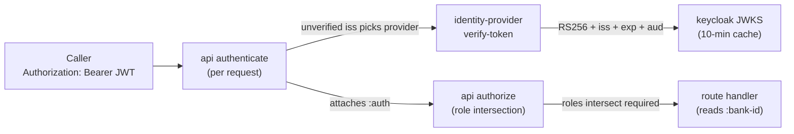

# Authentication

> Static API keys were removed (#82) and replaced by
> Keycloak-issued JWTs; this doc describes the current model. (It
> was previously named `api-keys.md`.)

## Objective

Queenswood is multi-tenant: each **bank** that runs on the
platform holds its own parties, cash accounts, payments, and
products. Every HTTP request must be attributable to a bank (or
to a platform operator), with cryptographic confidence that the
caller is who they claim to be. Authentication is delegated to
**Keycloak**: callers present a signed OAuth2 / OIDC bearer
token, and the API verifies it statelessly against Keycloak's
published signing keys.

This TDD describes how a request is authenticated at the API
edge, how the two principal types (a bank's backend service vs a
human user) are distinguished, what identity is attached to the
request, and how route authorization gates on roles.

In scope: the `api` auth interceptors, the
`identity-provider` brick and its `keycloak` implementation, the
service-account lifecycle, the realm and client layout, and the
`:auth` shape the rest of the system reads.

Out of scope: the bank-creation flow that provisions a bank's
service-account client, covered in [banks.md](banks.md); policy
authorization of domain operations, covered in
[policy-evaluation.md](policy-evaluation.md); the SPA-side OIDC
redirect/PKCE dance, which lives in the front-ends and Keycloak,
not this repo.

## Background

Two properties have to hold on every request:

**Authenticity.** The bearer token must be provably issued by a
trusted Keycloak realm and unaltered. The API never holds a
shared secret for the caller — it verifies the token's RS256
signature against Keycloak's JWKS, checks the issuer and expiry,
and checks that the token's audience is one the API accepts.

**Attribution.** A verified token must resolve to a principal:
either a specific **bank** (the rest of the system reads
`:bank-id` off the request and never asks how it got there), or
a platform **operator** acting bank-agnostically.

The previous model met these with static, hashed API keys minted
per tenant. That was replaced because shared secrets must be
transmitted and stored carefully, revocation is a denylist rather
than cryptographic, and a key says nothing about *which human*
acted. Keycloak-issued JWTs address all three: short-lived signed
tokens, key-rotation via JWKS, and a distinct user-identity path.

## Proposed Solution

### Architecture

Two interceptors run at the edge, in order:

- **`authenticate`** verifies the bearer token and attaches
  `:auth` to the request. It **never short-circuits** — a
  missing or invalid token simply leaves `:auth` absent, so the
  request still reaches `authorize`.
- **`authorize`** reads the roles a route requires (from its
  OpenAPI `bearerAuth` security) and the principal's roles, and
  terminates with 401 or 403, or passes through.



Verification is stateless: every request re-verifies its token
against cached JWKS signing keys. There is no per-request
authn-decision cache — the only caches are the JWKS keys
(10-minute TTL) and Keycloak's admin token.

### Token verification

`server/authenticate-with-provider` does not trust the token to pick
its verifier blindly:

1. **Read `iss` unverified.** `auth/unverified-claims` base64url-decodes
   the JWT payload *without* a signature check, only to read the
   issuer.
2. **Pick the provider** among the request's `identity-providers` whose
   `get-issuer` matches that `iss`. One instance is wired per realm; the
   unverified `iss` only routes *which* verifier runs.
3. **Verify** via `identity-provider/verify-token`, which (in the
   `keycloak` impl) fetches the signing key by `kid` from JWKS
   (force-refreshing once if the `kid` is unknown, to ride key
   rotation), then checks the **RS256 signature**, the **issuer**,
   the **expiry**, and that the token's **audience** intersects
   the API's `expected-audiences`. Any failure yields an
   `:auth/unauthenticated` rejection rather than an exception.

A forged `iss` only re-routes which verifier runs; the chosen
verifier still rejects on signature or issuer mismatch.

### The two principal types

After verification, the principal type is decided purely by the
**`azp`** (authorized party / client) claim:

- **User** — `azp` is one of the configured user-facing SPA
  clients (`queenswood-console`, `queenswood-app`).
- **Service** — anything else; by convention a bank's backend
  client, whose `client_id` *is* its `bank-id`.

**Service principal.** The `:auth` map:

```clojure
{:principal-type :service
 :principal-id   (:azp claims)                 ; == client_id
 :roles          (into levels realm-roles)     ; realm_access.roles
 :bank-id        (:azp claims)
 :token-jti      (:jti claims)}
```

`client_id == bank-id`, so a bank's service token attributes
directly to that bank, and `levels` is a service principal's, given
under "Roles and route authorization". A `Bank-Id` header naming
another bank leaves the principal no `:bank-id` and marks it
`:bank-refused`. The shared `queenswood-admin` operator client carries
the `admin` realm role, so it holds an operator's levels and its
`:bank-id` is the bank the header names, or none.

**User principal.** The user path **upserts a `user` row**
keyed on `(iss, sub)` on every request (idempotent; refreshes
email / name / avatar from the OIDC profile claims), looks up the
user's active memberships, and builds:

```clojure
{:principal-type :user
 :principal-id   (:user-id user)
 :issuer (:iss claims) :sub (:sub claims)
 :user user :claims claims :memberships memberships
 :membership membership                        ; when one resolves
 :roles (cond-> (into #{:user} levels)
                admin? (conj :admin))
 :bank-id (if admin? requested (:bank-id membership))
 :token-jti (:jti claims)}
```

`membership` is the active membership in the bank the `Bank-Id`
header names or, with no header, the person's only active membership.
None resolves when the header names a bank the person holds no active
membership in, which also marks the principal `:bank-refused`, or when
there is no header and the person holds several or none. `levels` is
the levels that membership's role carries, or an operator's when the
realm roles include `admin`. An operator's `:bank-id` is `requested`,
the bank the header names, or none.

A brand-new human with no memberships still authenticates as
`:user` (reaching `/me`, the companies routes and bank creation) and
holds no level
until a membership exists.

**The store write is on every user request, so its failure is a
failure mode of authentication itself.** An anomaly from the upsert or
from the membership lookup is not absence: it is logged at warning
level naming the issuer and the subject, and answered through the
API's own anomaly mapping — **503** for a store that cannot be
reached, 500 for anything else — with no principal placed on the
request. A user whose row cannot be written does not proceed as a user
with no identity.

### Roles and route authorization

The role vocabulary is `:user`, `:admin` and four organisation
levels, lowest first: `org:viewer`, `org:developer`, `org:admin` and
`org:owner`. A membership's role carries its own level and every level
below it: a viewer `org:viewer`, a developer that and `org:developer`,
an admin those and `org:admin`, an owner all four. A service principal
carries `org:viewer` and `org:developer`, and an operator `:admin` and
all four. (`:service` is a *principal-type*, not a role.) `org:admin`
is an organisation's role; `admin` alone is the platform's operator.

The rule: **platform-wide resources under `admin`, identity routes
under `user`, and an organisation's own data under a level: its reads
`org:viewer`, its writes `org:developer`, its people routes
`org:admin`.** Banks, tiers, policy administration and the simulator
are platform-wide, except that a person may create a bank for their
own company; `/me` is about who the caller is. A
route reading or writing one tenant's data takes a level. A bank's own
record, and what describes it under `/v1/banks/{bank-id}` — its
policies, its effective policy and its audit log — takes
`org:viewer` or `admin`, the `own-bank` interceptor refusing a member
any other bank. `org:owner` gates no route; the rules only an owner
satisfies are described in [access.md](access.md).

**Every route names its roles.** A route or a method declares them in
its OpenAPI security, `:security [{"bearerAuth" ["org:viewer"]}]`, and
`server/require-scopes` enforces the operation's own: the method's data
merged over the route's, which is also what the generated OpenAPI
documents, read as OpenAPI reads it, the requirement objects alternatives
and the scopes within one all required. Three gates are refused when the
router is built, against the vocabulary `/v1` declares as `:scopes` and
`:exclusive-scopes`, so the service fails to start rather than serving a
gate it cannot enforce:

- **A scheme with no roles**, `{"bearerAuth" []}`, which demands a
  token and says nothing about what the token must carry.
- **A bare `org` gate.** `org` is no level, and no principal carries
  it.
- **A method level stacked on a route level.** Reitit concatenates a
  method's `:security` onto its route's unless the method's vector is
  marked `^:replace`, so the operation would name two levels and admit
  the lower.

A route whose `:security` is `[]` names no scheme, requires nothing
and is public by design — the OAuth routes are the only ones.

`auth/require-bank` and then `server/require-scopes`:

- neither compiles for an operation that names no scheme;
- the guard returns **403** (`auth/forbidden`) if the gate names a level
  and the principal is `:bank-refused`, or if the gate names only levels
  and a principal with no `:bank-id` holds more than one active
  membership, with a detail saying to name the bank in `Bank-Id`;
- the gate returns **401** (`auth/unauthenticated`) if no token
  verified, and **403** (`auth/forbidden`) if the scopes the principal
  holds miss the operation's.

**An organisation-gated route acts on the principal's bank.** A
principal that satisfies the gate only through organisation levels and
carries no `:bank-id` has nothing for the route to act on, and is
refused **403** (`auth/forbidden`) rather than served against a nil
bank. An operator that sends no `Bank-Id` header is such a principal.
A route an admin may call on *any* bank takes the bank from its path
and declares `admin` as a second requirement object beside a level,
which widens what the guard reads as required past the levels and opts
out of the rule.

The exceptions, each deliberate:

- The **simulator's inbound transfer** is `org:developer` and `admin`,
  so a tenant can fund its own sandbox. Its handler holds the tenant
  boundary itself: the path's bank must be the principal's, unless the
  principal is an admin, and a foreign bank is refused 403 before the
  bank is looked up — so the answer says nothing about another tenant.
  The rest of `/simulate` stays `admin`.
- The **companies** routes are `user`, and so is `POST /v1/banks`
  beside `admin`, because a person creating their first bank uses them
  before any membership exists.

### Service-account lifecycle

The `identity-provider` brick (Keycloak-backed in production, a
local impl for tests) exposes:

- **`create-service-account`** — create a bank's service-account
  client (`client_id == bank-id`), stamping `access.token.lifespan
  = 3600` and an audience client-scope; returns `{:client-id …}`,
  and no credential until `rotate-secret` mints one.
- **`exchange-client-credentials`** — run OAuth2
  `client_credentials`, returning the raw token response. Proxied
  by `POST /oauth/token` so a bank can mint its own JWT.
- **`rotate-secret`** / **`revoke-service-account`** — reissue or
  delete a bank's client.
- **`update-service-account-audience`** — re-point a bank's client
  at a different `aud`.
- **`verify-token`**, **`get-jwks`**, **`get-issuer`** — the
  verification surface used by `authenticate`.

**Creation is a bus round trip, and that shapes the lifecycle.**
`new-bank` runs in the operational processors service, not in the
API. It calls `create-service-account` *before* the FDB write, so an
identity-provider failure aborts the transaction cleanly. That call
mints **no secret**: the reply travels back over the command bus, and
no credential is put on the bus. The API handler,
holding the reply, calls **`rotate-secret`** for that bank and
returns what it mints — once — in the create-bank response. So the
secret a tenant receives is a rotated one, never the created one.

**A status change re-points the audience.** `change-status` calls
`update-service-account-audience` before its FDB write, with the
audience its new status maps to, on the same reasoning: a failure
aborts rather than leaving the bank's status ahead of its client's
audience. Tokens the bank already holds keep the old audience until
they expire; the next token it mints carries the new one.

Both the API service and the operational processors service
authenticate to Keycloak with the admin credential, because both make
these calls.

`revoke-service-account` is implemented but has no caller (see Known
Limitations).

### Realms and clients

Two realms on one Keycloak instance:

- **`queenswood`** (orgs) — hosts the `queenswood-console` SPA
  (Authorization Code + PKCE for a bank's human operators), the
  per-bank service-account clients, and the `queenswood-admin`
  operator client (carries the `admin` realm role).
- **`queenswood-ops`** — hosts the `queenswood-app` SPA for
  Queenswood's own operators; verification-only from the API's
  side.

**Four audiences are accepted**, and who carries each is the whole of
the mapping:

- `queenswood-api-test` — a bank's service tokens while its status is
  `bank-status-test`.
- `queenswood-api-live` — the same once its status is
  `bank-status-live`.
- `queenswood-console` — console user tokens; the SPA's audience
  mapper points the client at itself.
- `queenswood-app` — operator user tokens, the same way.

The status-to-audience mapping is the API's deployment config, and it
is what `change-status` forwards to
`update-service-account-audience`.

**The expected issuer can be overridden per provider.** A provider
otherwise derives its issuer from its base URL, which is wrong
whenever the API reaches Keycloak in-cluster while tokens carry a
public issuer. The override replaces the derived value for *both*
uses — picking which provider verifies a token from its unverified
`iss`, and the `iss` check the verifier itself makes — so the two
cannot disagree. It is unset under the dev and test profiles, where
base URL and issuer are the same host.

### The API's own identity

Provisioning a bank's client is an Admin API call, so the API has an
identity of its own: the `queenswood-admin` client. Under the dev and
test profiles it authenticates with a client secret against an
ephemeral realm. Deployed, it uses **`private_key_jwt`**: the realm
import declares `client-jwt` as the client's authenticator, and the
key arrives as a *file* named by
`KEYCLOAK_ADMIN_CLIENT_PRIVATE_KEY_FILE` rather than inline, because a
multi-line PEM does not survive an environment variable intact.

Its service account holds `manage-clients`, `view-clients`,
`manage-realm`, `view-realm` and `manage-users` on
`realm-management` — enough to create, re-point and delete a bank's
client. It also carries the `admin` realm role, which is why tokens
minted *by* it are admin principals at this API's edge.

## Alternatives Considered

- **Static hashed API keys** (the previous model). Simple lookup
  by hash, no IDP dependency. Replaced — shared secrets must be
  transmitted/stored carefully, revocation is a denylist, and a
  key carries no human identity. The Keycloak model gives
  short-lived signed tokens, JWKS rotation, and a user path.
- **Opaque tokens with introspection.** Verify by calling
  Keycloak's introspection endpoint per request. Rejected — that
  reintroduces a synchronous IDP round-trip on the hot path;
  stateless JWKS verification keeps the edge fast and
  IDP-availability-tolerant within the token's lifetime.
- **A self-managed user store.** Own the password / MFA / profile
  lifecycle in-house. Rejected — Keycloak owns identity; the API
  is a relying party and only *projects* verified claims into a
  `user` row keyed on `(iss, sub)`.
- **mTLS client certificates for service traffic.** Stronger
  machine identity, cryptographic revocation. Heavier
  operationally (cert management, CA infra) and the fintech
  consumer base expects bearer tokens. Worth revisiting for a
  high-security partner integration.
- **Per-request authn-decision cache.** Cache the verified result
  to skip re-verification. Rejected — JWKS verification is cheap
  and cacheing decisions would *delay* revocation; token expiry
  already bounds validity.

## Known Limitations

- **No rotate or revoke endpoint.** `rotate-secret` has exactly one
  caller, the create-bank handler, which uses it to mint the secret
  the response carries; nothing else calls it, so a tenant cannot
  rotate a compromised credential. `revoke-service-account` has no
  caller at all, and bank deletion does not call it. Revoking a
  bank's access today means deleting its Keycloak client by hand.
- **A retried creation can leave an orphan client.**
  `create-service-account` runs inside `new-bank`'s FDB transaction
  but is not part of it. A retried transaction calls it again and
  mints a second client, and nothing removes the first. The
  alternative is the intent-based path the
  [transaction-processing TDD](transaction-processing.md) describes
  for external calls: record the intent, drain it once from a relay.
- **An unknown `kid` forces a JWKS fetch.** Every bearer naming a key
  id the cache does not hold triggers a refetch, so an unauthenticated
  caller can drive one round trip to Keycloak per request simply by
  varying the `kid` on an unsigned token. Throttling the refresh is
  the fix, and it belongs in the `keycloak` brick upstream.
- **A realm imported before the local redirect URIs were removed keeps
  them.** A realm is never overwritten, and the import Job's reconcile
  only adds, so dropping a redirect URI from the imported file does
  not drop it from an environment whose realm already exists.
  Removing it there is an operator's step against the Admin API.
- **JWT validity is bounded by expiry, not revocation.** Tokens
  are stateless, so a revoked or rotated service account keeps any
  already-minted token working until its `exp` (≤ 1 h). Revocation
  prevents *new* tokens; it can't recall outstanding ones. The
  `:token-jti` is captured on `:auth` but nothing consumes it —
  there is no jti denylist.
- **A bank's service identity is shared.** All of a bank's backend
  callers use one service-account client (`client_id == bank-id`),
  so machine-to-machine audit attribution is "this bank's service
  did it," not which caller. Human operators do carry per-user
  identity via the user path.
- **Authorization is role-set only.** Routes gate on a principal's
  roles (`:user`, `:admin` and the four organisation levels)
  intersecting the route's required roles. There is no resource
  scoping ("only these accounts") — finer granularity would extend
  `authorize`.
- **The admin operator identity is shared.** `queenswood-admin` is
  one service account carrying the `admin` realm role; back-office
  automation attributes to "the admin client," not a person. Human
  Queenswood operators sign in through `queenswood-app` and do carry
  per-user identity.

## References

- [ADR-0013](../adr/0013-single-unified-api.md) — Single unified
  API (the auth-bearing edge)
- [policy-evaluation.md](policy-evaluation.md) — Policy evaluation
  (authorization of domain operations, distinct from edge authn)
- [service-apis.md](service-apis.md) — Service APIs (the
  interceptor chain the auth interceptors sit in)
- [banks.md](banks.md) — Banks (bank creation
  provisions the service-account client)
- `api` auth interceptors (`auth.clj`)
- `identity-provider` brick interface (`verify-token`,
  `create-service-account`, `exchange-client-credentials`,
  `rotate-secret`, `revoke-service-account`,
  `update-service-account-audience`, `get-jwks`, `get-issuer`)
- `keycloak` brick (JWKS cache, admin token, per-bank clients)

### Changes that wait on an upstream release

The `identity-provider` and `keycloak` bricks are not in this
workspace. They live upstream in `mono`, which this repository
consumes as a pinned git dependency — see
[ADR-0001](../adr/0001-reuse-mono-as-upstream.md). A fix in either
needs a release there and a pin bump under `deps/`, so the following
are deferred rather than open work here:

- **A refused Keycloak write or grant should be an anomaly.** A
  non-2xx response to the client POST, the audience PUT, the client
  DELETE, the secret POST or the token grant should carry Keycloak's
  status and body, with a fault-injection test per write. Until then
  this API compensates at its own edge, which is why the token proxy
  inspects the body it is handed rather than trusting the status.
- **The JWKS cache-expiry refetch has no test.** It can only be
  exercised where the cache lives.
- **The JWKS refresh throttle**, the fix for the unknown-`kid`
  limitation above.
