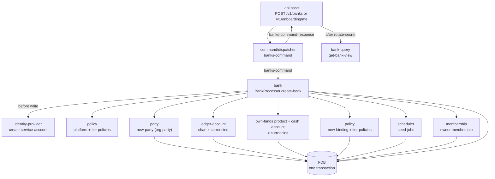

# Banks

## Objective

A **bank** is the multi-tenant boundary in Queenswood. Every
other domain entity — every party, cash account, payment, product
version, policy binding — carries a `:bank-id`, and every store
is indexed on it. The data model partitions along this axis;
cross-tenant queries are impossible at the data layer.

This TDD describes the bank model: the `Bank` record, its status
and its tier, the all-or-nothing creation flow that provisions
every foundational record a new tenant needs, the two transitions
a bank can make after creation, and the enrich-on-read shape.

In scope: the `bank` and `bank-query` bricks; the status and tier
enums; the multi-brick atomic create flow (service-account
client, org party, ledger chart, own-funds house accounts, tier
bindings, scheduled jobs, owner membership); the tier and status
changes; the enrich-on-read pattern.

Out of scope: the service-account/JWT mechanics —
[authentication.md](authentication.md); the command-processor
shape the brick is built to —
[processor-bricks.md](processor-bricks.md); each foundational
brick's own rules — party creation [parties.md](parties.md), the
ledger chart [chart-of-accounts.md](chart-of-accounts.md),
product publish
[cash-account-products.md](cash-account-products.md), account
opening [cash-accounts.md](cash-accounts.md), policy bindings
[policy-evaluation.md](policy-evaluation.md).

## Background

Two needs.

**Tenant isolation.** A multi-tenant bank-of-banks must keep one
tenant's data fully separate from another's. Queenswood carries
`:bank-id` on every record and indexes every store on it.

**Bootstrap completeness.** A bare `Bank` record is useless. To
operate, a new tenant needs:

- A **service-account client** so its backend can authenticate —
  see [authentication.md](authentication.md).
- A **party** representing the bank itself in its own books.
- A **chart of bank-owned ledger accounts** per currency, so
  postings have somewhere to land — see
  [chart-of-accounts.md](chart-of-accounts.md).
- An **own-funds house account** per currency — a real,
  transactable cash account the bank pre-funds to pay its
  customers (interest, rewards).
- **Policy bindings** that pin the tier-appropriate rule set.
- **Scheduled jobs** so the batch work a bank needs — interest
  accrual and the rest — has somewhere to run.
- On the self-service path, an **owner membership** tying the
  signed-in user to the bank they just created.

Without these, a tenant can't authenticate, can't post, can't
accrue interest, can't be constrained by tier policies. The
system answers with a single `create-bank` command that mints
every foundational record in **one FDB transaction** across
several bricks. Atomic. All-or-nothing.

## Proposed Solution

### Architecture

Two bricks split along the write/read line. `bank` is a
command processor — a `BankProcessor` dispatching `create-bank`,
`change-bank-tier` and `change-bank-status` off the
`banks-command` channel, hosted by the operational processors
service, which wires the Keycloak identity-provider the create
flow needs. `bank-query` holds every read, and is the only bank
brick the `api` base requires: the base never sees `bank`'s
interface, and reaches it by sending a command through a
dispatcher and waiting on `banks-command-response`. See
[processor-bricks.md](processor-bricks.md) for the shape and
[ADR-0021](../adr/0021-changelog-relay.md) for why a brick reacts
rather than orchestrates.

The create flow composes other bricks' interfaces inside one FDB
transaction; ADR-0002 makes this atomic across record stores. The
service-account client is created *before* the FDB write so an
identity-provider failure aborts the transaction cleanly.



The diagram understates the choreography — those branches run
sequentially inside one `store/transact`, threaded through
`error/let-nom>`. A failure at any step rolls everything back; a
successful commit means the whole tenant is up. The command reply
carries the flat bank and the membership, and nothing else: the
handler mints the credential and loads the enriched view
afterwards, from `bank-query`.

### The Bank record

```clojure
{:bank-id         "bnk.<ulid>"
 :name            "Acme Bank"
 :status          :bank-status-test    ; or -live, -unknown
 :tier            "micro"              ; absent for a tierless bank
 :sort-code       "000001"             ; 6-digit, fountain-allocated
 :company-binding {...}                ; absent on the admin path
 :created-at      <ms>
 :updated-at      <ms>}
```

Each bank has its **own 6-digit sort code**, allocated from a
monotonic fountain at creation (`000001`, `000002`, …) and unique
across banks (`Bank_by_sort_code`). `00`-prefixed sort codes are
unallocated in the real world, so the range is safe. The sort code
prefixes every BBAN the bank issues, so an inbound payment can be
attributed to its bank by the BBAN's first six digits
(`bank-query/get-bank-by-sort-code`). Future: allocate at sign-up,
or accept a bank-supplied code.

There is **no bank-type** — the internal/customer distinction was
removed. What distinguishes one bank from another is its `status`
(test vs live), its `tier` (which policies bind to it), and, on
the self-service path, the `company-binding` snapshot of the legal
entity it was onboarded against. `:tier` and `:company-binding`
are both optional on the record and absent from the read when
unset, so a response schema declaring them optional coerces
either shape.

Both transitions the record can make are carried on the store's
changelog under the shared `ChangelogEvent` envelope:
`bank-status-changed` and `bank-tier-changed`, each with its own
Avro payload. The dedup key names the field that moved as well as
its new value (`<bank-id>:status:<status>`,
`<bank-id>:tier:<tier>`) — a tier is a free-form label, so one
named after a status would otherwise key the same as the
transition into that status. Nothing relays or consumes the banks
changelog yet.

### The atomic create flow

`new-bank txn bank-name bank-status tier currencies opts` runs
the following inside one FDB transaction. Steps 2 and 14 run only
when `opts` carries `:membership`, and step 6's company-binding
guard only when it carries `:company-binding`.

1. **Require an identity-provider** — `opts` must carry
   `:identity-provider`, or the create is rejected
   `:bank/missing-identity-provider` before anything else. A bank
   with no service-account client has no way to authenticate.
2. **Check sole membership** — when `:membership` is supplied,
   `membership/list-by-user` must come back empty or the create is
   rejected `:membership/already-exists`. Run first, so a
   redelivered onboarding command aborts before any write.
3. **Resolve platform policies** —
   `policy/get-effective-policies txn {}` (empty selectors; the
   bank doesn't exist yet). `opts` may override with `:policies`.
   These govern the create capability check *and* are threaded
   into every foundational write below, so a tier that denies the
   ledger-account or product capability per bank still bootstraps.
4. **Resolve tier policies** — `policy/get-policies-by-tier txn
   tier` returns the policies labelled `{:tier "<name>"}`, or an
   empty vector when `tier` is nil.
5. **Allocate the sort code** — `store/allocate-sort-code` draws
   the next value from the global fountain, formatted `%06d`.
6. **Build the `Bank`** — `domain/new-bank` runs the
   `:bank-action-create` capability check, rejects
   `:bank/unknown-tier` when a named tier matched no policy at
   step 4, rejects `:onboarding/company-not-active` when a
   `:company-binding` is supplied whose `:company-status` is not
   active, then mints the record with a `bnk.*` id and the
   allocated sort code.
7. **Create the service-account client** *(before the FDB write)*
   — `identity-provider/create-service-account` with
   `client_id == bank-id` and a status-derived audience. The secret
   minted here is discarded: the command reply crosses the bus, so no
   credential travels on it. The API handler mints the one in the
   response with `rotate-secret` after the reply — see the
   [authentication TDD's service-account lifecycle](authentication.md).
8. **Persist the bank.**
9. **Create the bank's org party** — `party/new-party` with
   `:type :party-type-organization` and display-name = bank name.
10. **Seed the ledger chart** — one `LedgerAccount` per seed row
   per currency (see below).
11. **Open own-funds house accounts** — per currency, draft +
   publish a `:product-type-sub-ledger-own-funds` product ("Bank
   own funds", `effective-from` today), then open a real
   `CashAccount` on the org party against it — its BBAN carries the
   bank's sort code.
12. **Bind tier policies** — for each policy resolved at step 4,
   `policy/new-binding` with target
   `{:kind {:bank {:bank-id <new-id>}}}`.
13. **Seed scheduled jobs** — `scheduler/seed-jobs` writes the
   bank's default job rows. FDB only, no triggers.
14. **Create the owner membership** — when `:membership` is
   supplied, `membership/new-membership` for that `:user-id` and
   `:role`, last and in the same transaction.

The command returns `{:bank {…} :membership <map-or-nil>}` — the
flat record, no enrichment, no credential.

### The two callers

Both reach the same `create-bank` command over the same
dispatcher.

**Platform admin**, `POST /v1/banks`, gated on the `admin` role.
The caller chooses the name, status, tier and currencies. No
company binding, no membership.

**Self-service onboarding**, `POST /v1/onboarding/me`, gated on
the `user` role. The handler looks the company up in the registry
of record, then sends `create-bank` with everything fixed except
the name: test status, tier `micro`, GBP, a `:company-binding`
snapshotted from the lookup, and a `:membership` for the
signed-in user as `:role-owner`. The route answers 409 when that
user already belongs to a bank and 422 when the company is not
active. See [onboarding.md](onboarding.md).

### The default ledger chart

The chart is loaded from
[general-ledger.edn](/components/resources/resources/ledgers/general-ledger.edn)
and seeded once per currency: bank-owned, flat accounts with no
party and no product. The rows, their types and their classes are
tabulated once, in
[chart-of-accounts.md](chart-of-accounts.md) — the roll-up rules
that make the classes load-bearing live there too, and a second
copy here would drift from it.

Two of the rows matter to this document. 3100 own funds is the
control the house account below rolls up into. 5100 interest
expense is the debit leg of the interest accrual whose credit leg
is 2400 interest payable — see [interest.md](interest.md). Both
are seeded, in every currency the bank was created with.

### Own-funds house account

Distinct from the ledger chart: per currency, `new-bank` drafts
and publishes a `:product-type-sub-ledger-own-funds` product and
opens a real, BBAN-addressable `CashAccount` on the bank's org
party. This is the bank's own money — pre-funded so it can pay
customers (interest, rewards). It rolls up into the 3100 own-funds
control of its own currency.

The product is created from the internal own-funds template,
whose `allowed-currencies` covers every currency the create
request's schema accepts. A currency outside that set is rejected
`:cash-account-product/currency-not-allowed` at this step and
takes the whole bank with it, so the template and the request
schema are one constraint expressed twice and have to agree.

### Enrichment for reads

`bank-query/get-bank` returns the **flat** record. The enriched
read — `bank-query/get-bank-view`, and `get-banks` for the list —
walks the related bricks:

```clojure
{:bank-id ... :name ... :status ... :sort-code ...
 :tier "micro"             ; when set
 :company-binding {...}    ; when set
 :party {...}              ; the bank's org party
 :accounts [{...}]         ; with embedded balances
 :client-id "bnk...."      ; == bank-id
 :client-secret "..."}     ; only on a create response
```

`:client-secret` is not part of the view — the api base's
`bank-with-secret` assocs it onto what `get-bank-view` returns,
from the `rotate-secret` call it makes once the command reply
arrives. There is no API key, and the secret creation minted is
discarded rather than carried back over the command bus, so the
credential exists only on that one response. The enriched shape
walks the org party and the cash accounts with their balances; it
does not list the seeded ledger accounts, which have their own
route.

### Tier and the policy-binding model

`tier` is a string label selecting which policies bind to a bank:

- Policies carry a `{:tier "<name>"}` label.
- `policy/get-policies-by-tier "<name>"` returns the matches.
- `new-bank` writes a `PolicyBinding` per match, targeting
  `{:kind {:bank {:bank-id <id>}}}`.

`get-effective-policies` resolves platform-tier policies plus
those bound to a bank's `:bank-id` — see
[policy-evaluation.md](policy-evaluation.md) — so a tier binding
written here is load-bearing at evaluation time.

A named tier that matches no policy is rejected
`:bank/unknown-tier`, at creation and on a change alike: left
unguarded it would produce a bank stamped with that tier and
bound to nothing, governed by the platform policies alone — more
permissive than any tier the caller could have meant. A **nil**
tier is the one exception, and means exactly that: a tierless
bank, bound to no tier policy, governed by the platform policies.
The admin route requires `tier` on the request body, so the nil
case is reachable only from inside the workspace.

### Changing the tier

`change-tier txn bank-id tier`, exposed as `POST
/v1/banks/{bank-id}/change-tier`, rebinds a bank onto a new
tier's policies in one transaction:

1. Load the bank and resolve the new tier's policies.
2. Reject `:bank/invalid-status` (409) unless the bank is test or
   live, and `:bank/unknown-tier` (422) when the tier resolves to
   no policies.
3. Drop every binding on the bank whose policy carries a `tier`
   label — identified from the policy, not from any tier stored
   on the bank, so a bank with no stored tier still transitions
   cleanly on first use.
4. Bind the new tier's policies.
5. Persist `:tier` and append a `bank-tier-changed` changelog
   entry.

Only the tier-labelled bindings move. A binding added explicitly
on top of a tier survives the change.

### Changing the status

`change-status txn bank-id new-status opts`, exposed as `POST
/v1/banks/{bank-id}/change-status`, flips a bank between
`:bank-status-test` and `:bank-status-live`. It rejects
`:bank/invalid-status` (409) unless the bank is currently test or
live, and again when `new-status` matches the current status — a
no-op transition, not a flip. The service-account client's
audience is swapped via the identity-provider *before* the FDB
write, same rationale as `new-bank`'s IDP call, then the new
status is persisted with a `bank-status-changed` changelog entry.

## Alternatives Considered

- **Separate creation commands.** Have the admin call create-bank,
  then create-party, then seed-ledger, and so on. Rejected —
  partial failure leaves a half-built tenant (a bank with no
  ledger, a product with no accounts). One transaction guarantees
  bootstrap completeness.
- **A bank-type discriminator.** Keep the old internal/customer
  split. Removed — the difference that mattered (own books
  vs customer books) is now expressed by the ledger chart plus the
  own-funds house account, not by a type on the record. One shape,
  differentiated by tier bindings and status.
- **A single settlement product at bootstrap.** The earlier model
  gave each tenant one settlement/internal product. Replaced by
  the explicit ledger chart + own-funds house account, which
  models the bank's books directly rather than overloading a
  product.
- **Lazy account creation.** Open ledger/house accounts on first
  use of a currency. Rejected — postings need their accounts to
  exist before any payment, fee, or interest activity. Upfront
  bootstrap is simpler and predictable.
- **A GBP-only own-funds template.** The customer-facing templates
  allow GBP alone, and the house template followed them. Rejected
  — the house template is not a product a bank sells, it is the
  shape of the bank's own books, and a create naming EUR or USD
  was rejected at the house-account step and rolled the whole
  bank back. What a bank may sell and what its own books may hold
  are separate decisions.
- **No tier mechanism.** Force callers to bind every policy
  explicitly. Rejected for ergonomics — most tenants fall into
  named buckets that map to bundles; the tier label is the
  shorthand. Explicit bindings can still be added on top.
- **Tier as a numeric ordering.** `1, 2, 3` with implicit
  precedence. Rejected — tiers don't form a clean total order (a
  "developer" tier and a "production" tier are different shapes,
  not levels). String labels are flexible.
- **A tier held only in its bindings.** The tier was originally a
  create-time argument and nothing more, recoverable only by
  reading which policies a bank was bound to. Rejected once the
  tier became changeable: a rebind has to report what the bank is
  now on, and a caller asking a bank's tier should not have to
  reconstruct it from a binding set.
- **Recording a tier change as a status change.** The tier change
  reused the status changelog entry, with `status-before` equal to
  `status-after`. Rejected — a consumer reading the banks
  changelog would see a status transition that never happened,
  carrying no tier fields, keyed the same as an earlier
  transition into that status.
- **Random service-account `client_id`.** Rejected in favour of
  `client_id == bank-id`: a deterministic mapping means a service
  token's `azp` *is* the bank-id, so attribution needs no lookup.

## Known Limitations

- **No promotion gate on the status change.** There is no
  test→live onboarding-completeness check (e.g. a per-bank
  ClearBank credential model) and no forced re-auth of
  already-issued tokens — see
  [authentication.md](authentication.md)'s stateless-JWT
  limitation.
- **The identity-provider call sits inside a retried
  transaction.** `create-service-account` runs inside a
  transaction FDB may re-run on conflict, and a retry mints a
  second client that nothing removes. The boundary rule and what
  it would take to hold it are recorded in
  [authentication.md](authentication.md).
- **No closure or off-boarding.** A bank once created is
  permanent. Closing every account, revoking the service-account
  client — `revoke-service-account` is unwired, see
  [authentication.md](authentication.md) — and archiving party
  data are all manual.
- **No bank-level audit trail.** The changelog carries the status
  and tier transitions, but not who made them: `created-at` is
  the only creation history, and which platform admin created the
  bank isn't recorded — only that an admin principal made the
  call.
- **Currencies are committed at create.** `new-bank` fans the
  `currencies` argument across the ledger chart and own-funds
  house accounts. Adding a currency to an existing bank means
  creating the extra ledger and house accounts by hand — there is
  no add-currency convenience.
- **Bank name and party display-name are coupled.** The org party
  is created with display-name = bank name; renaming the bank
  later doesn't propagate, and there's no rename flow.
- **Effective-policies-during-create has no bank context.** Step 3
  calls `get-effective-policies txn {}` with empty selectors,
  since the bank doesn't yet exist — platform-tier policies govern
  the create. Fine in principle, but a subtle point if a
  platform-tier rule ever needed the about-to-be-created bank.
- **The create checks a capability, not a principal.** The admin
  route requires the `admin` role and the onboarding route the
  `user` role — see [authentication.md](authentication.md) — but
  `new-bank` itself runs only a `:bank-action-create` capability
  check. A third caller added inside the workspace would inherit
  whatever gate its own route carries, and none from here.

## References

- [ADR-0002](../adr/0002-foundationdb-record-layer.md) —
  FoundationDB Record Layer (multi-store atomicity for the create
  flow)
- [ADR-0005](../adr/0005-error-handling-with-anomalies.md) — Error
  handling with anomalies (rollback on partial failure)
- [ADR-0021](../adr/0021-changelog-relay.md) — Changelog relay
  (the shared envelope the transitions are written under)
- [authentication.md](authentication.md) — Authentication (the service-account
  client provisioned at bank creation)
- [processor-bricks.md](processor-bricks.md) — Processor bricks
  (the command/core/domain/store shape `bank` is built to)
- [onboarding.md](onboarding.md) — User onboarding (the
  self-service caller)
- [parties.md](parties.md) — Parties (the bank's org party)
- [chart-of-accounts.md](chart-of-accounts.md) — Chart of accounts
  (the seeded ledger chart and own-funds account)
- [cash-account-products.md](cash-account-products.md) — Cash
  account products (the own-funds house product)
- [cash-accounts.md](cash-accounts.md) — Cash accounts (one
  own-funds account per currency, opened at creation)
- [interest.md](interest.md) — Interest (the 5100 / 2400 accrual
  legs the chart seeds)
- [policy-evaluation.md](policy-evaluation.md) — Policy evaluation
  (tier label, binding selectors, effective-policy resolution)
- `bank` brick interface (`new-bank`, `change-tier`,
  `change-status`)
- `bank-query` brick interface (`get-bank`,
  `get-bank-by-sort-code`, `get-bank-view`, `get-banks`)
