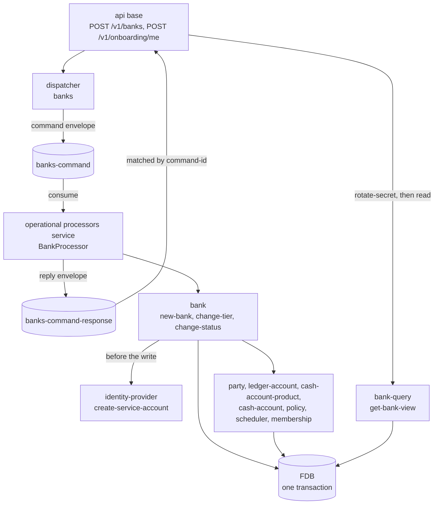

# Banks

## Objective

A **bank** is the multi-tenant boundary in Queenswood. Every
other domain entity — every party, cash account, payment, product
version, policy binding — carries a `:bank-id`, and every store
is indexed on it. The data model partitions along this axis;
cross-tenant queries are impossible at the data layer.

This TDD describes the bank model: the `Bank` record with its
status and tier, the all-or-nothing creation flow that provisions
every foundational record a new tenant needs, the two transitions
a bank can be put through afterwards, and the enrich-on-read
shape.

In scope: the `bank` command processor and the `bank-query` read
brick; the status enum and the tier label; the multi-brick atomic
create flow (service-account client, org party, ledger chart,
own-funds house accounts, tier bindings, scheduled jobs, owner
membership); the tier and status changes; the enrich-on-read
pattern.

Out of scope: the service-account and JWT mechanics — see
[authentication.md](authentication.md); each foundational brick's
own rules — party creation [parties.md](parties.md), the ledger
chart [chart-of-accounts.md](chart-of-accounts.md), product
publish [cash-account-products.md](cash-account-products.md),
account opening [cash-accounts.md](cash-accounts.md), policy
bindings [policy-evaluation.md](policy-evaluation.md).

## Background

Two needs.

**Tenant isolation.** A multi-tenant bank-of-banks must keep one
tenant's data fully separate from another's. Queenswood carries
`:bank-id` on every record and indexes every store on it.

**Bootstrap completeness.** A bare `Bank` record is useless. To
operate, a new tenant needs:

- A **service-account client** so its backend can authenticate —
  see [authentication.md](authentication.md).
- A **party** representing the bank itself in its own books.
- A **chart of bank-owned ledger accounts** per currency, so
  postings have somewhere to land — see
  [chart-of-accounts.md](chart-of-accounts.md).
- An **own-funds house account** per currency — a real,
  transactable cash account the bank pre-funds to pay its
  customers (interest, rewards).
- **Policy bindings** that pin the tier-appropriate rule set.
- **Scheduled jobs** for the recurring work its products need.

Without these, a tenant can't authenticate, can't post, can't
accrue interest, can't be constrained by tier policies. The
system answers with a single `create-bank` command that mints
every foundational record in **one FDB transaction** across
several bricks. Atomic. All-or-nothing.

## Proposed Solution

### Architecture

`bank` is a command processor. Its `BankProcessor` dispatches
`create-bank`, `change-bank-tier` and `change-bank-status` off
the `banks-command` channel and replies on
`banks-command-response`; the api base sends those commands
through its `banks` dispatcher and waits for the reply. The
processor is hosted by the operational processors service, which
wires its own Keycloak identity-provider for the purpose. Reads
live in `bank-query`, the only bank brick the api base requires:
the command brick exposes no reads. The file layout, the
`txn-or-config` convention and the rejection-origin rule are
[processor-bricks.md](processor-bricks.md)'s; the changelog
envelope the store writes is
[ADR-0021](../adr/0021-changelog-relay.md)'s.

The create flow composes other bricks' interfaces inside one FDB
transaction, which ADR-0002 makes atomic across record stores.
The service-account client is created *before* the FDB write so
an identity-provider failure aborts the transaction cleanly.



The diagram understates the choreography — those branches run
sequentially inside one `store/transact`, threaded through
`error/let-nom>`. A failure at any step rolls everything back; a
successful commit means the whole tenant is up.

The identity-provider call is the exception to that rollback: it
runs inside a transaction FDB may re-run on conflict, and a retry
mints a second client that nothing removes. The limitation is
[authentication.md](authentication.md)'s.

### The Bank record

```clojure
{:bank-id         "bnk.<ulid>"
 :name            "Acme Bank"
 :status          :bank-status-test   ; or -live, -unknown
 :sort-code       "000001"            ; 6-digit, fountain-allocated
 :tier            "micro"
 :company-binding {...}               ; the registry snapshot, when bound
 :created-at      <ms>
 :updated-at      <ms>}
```

Each bank has its **own 6-digit sort code**, allocated from a
monotonic fountain at creation (`000001`, `000002`, …) and unique
across banks (`Bank_by_sort_code`). `00`-prefixed sort codes are
unallocated in the real world, so the range is safe. The sort code
prefixes every BBAN the bank issues, so an inbound payment can be
attributed to its bank by the BBAN's first six digits, which is
what `bank-query/get-bank-by-sort-code` does.

There is **no bank-type** — the internal/customer distinction was
removed (#139). What distinguishes one bank from another is its
`status`, test or live; its `tier`, the label selecting which
policies bind to it; and, when it was created through onboarding,
the `:company-binding` snapshot of the legal entity it belongs
to. Status and tier are both stored, and both can be changed
after creation.

The store writes a changelog entry inside the same transaction as
the record it describes: the shared `ChangelogEvent` envelope
carrying one of two Avro payloads, `bank-status-changed` or
`bank-tier-changed`. Nothing relays or consumes the `banks` store
yet.

### The atomic create flow

`new-bank txn bank-name bank-status tier currencies opts` runs
the following inside one FDB transaction. A step marked with an
`opts` key runs only when the caller supplies that key.

1. **Require an identity-provider** — `opts` must carry
   `:identity-provider`, or the command is rejected
   `:bank/missing-identity-provider` before anything else.
2. **Check sole membership** *(`:membership`)* — the user must
   not already belong to a bank, or `:membership/already-exists`.
   It runs before any write, so a redelivered onboarding command
   aborts cleanly.
3. **Resolve platform policies** — `policy/get-effective-policies
   txn {}` with empty selectors, since the bank does not exist
   yet. `opts` may override with `:policies`. These are threaded
   into every foundational write below, so a tier that denies the
   ledger-account or product capability per bank still
   bootstraps.
4. **Allocate the sort code** — `store/allocate-sort-code` draws
   the next value from the global fountain, formatted `%06d`.
5. **Resolve tier policies** — `policy/get-policies-by-tier txn
   tier` returns the policies labelled `{:tier "<name>"}`, and an
   empty list stands in for a nil tier.
6. **Build the `Bank`** — `domain/new-bank` runs the
   `:bank-action-create` capability check, rejects
   `:onboarding/company-not-active` when `opts` carries a
   `:company-binding` whose status is not active, and rejects
   `:bank/unknown-tier` when step 5 resolved no policies. Then it
   mints the record with a `bnk.*` id, the allocated sort code,
   the tier and the binding.
7. **Create the service-account client** *(before the FDB
   write)* — `identity-provider/create-service-account` with
   `client_id == bank-id` and a status-derived audience. The
   secret minted here is discarded: the command reply crosses the
   bus, so no credential travels on it.
8. **Persist the bank.**
9. **Create the bank's org party** — `party/new-party` with
   `:type :party-type-organization` and display-name = bank name.
10. **Seed the ledger chart** — one `LedgerAccount` per seed row
    per currency, described below.
11. **Open own-funds house accounts** — per currency, draft and
    publish a `:product-type-sub-ledger-own-funds` product
    ("Bank own funds", `effective-from` today), then open a real
    `CashAccount` on the org party against it — its BBAN carries
    the bank's sort code.
12. **Bind the tier policies** — `policy/new-binding` per policy
    resolved at step 5, targeting
    `{:kind {:bank {:bank-id <new-id>}}}`.
13. **Seed the scheduled jobs** — `scheduler/seed-jobs`,
    idempotent on `[bank-id job-id]`.
14. **Create the owner membership** *(`:membership`)* — last, in
    the same transaction.

The return value is `{:bank {…} :membership <map-or-nil>}`: the
flat record, not the enriched view. The api handler mints the
credential with `rotate-secret` after the reply and loads the
view from `bank-query`.

Two rules fall out of the flow. A bank always carries a tier that
resolves to at least one policy — an unmatched or nil tier is
rejected at step 6, exactly as a tier change rejects it. And a
bank is created in every currency the API offers: the request
schema's `Currency` enum holds EUR, GBP and USD, and the
own-funds product template allows all three, so a create naming
any subset of them provisions one full ledger chart and one
own-funds account per currency named.

### Both callers

Two routes send `create-bank`.

- `POST /v1/banks`, under the api base's `admin` gate, carries
  the name, status, tier and currencies the operator chose.
- `POST /v1/onboarding/me`, under the `user` gate, is
  first-sign-in self-service. The handler looks the company up in
  the registry, then fixes the rest: status test, tier `micro`,
  currencies `["GBP"]`, a `:company-binding` snapshotted from the
  registry lookup, and an owner membership for the authenticated
  user.

### The default ledger chart

The chart is loaded from `ledgers/general-ledger.edn` on the
`resources` brick's classpath and seeded once per currency: nine
bank-owned, flat accounts, no party and no product. The rows,
their types and their classes are
[chart-of-accounts.md](chart-of-accounts.md)'s, which also covers
how legs map to control accounts at posting time.

### Own-funds house account

Distinct from the ledger chart: per currency, the create flow
drafts and publishes a `:product-type-sub-ledger-own-funds`
product and opens a real, BBAN-addressable `CashAccount` on the
bank's org party. This is the bank's own money — pre-funded so it
can pay customers (interest, rewards).

The chart identifies an account by its role and its currency, not
by its number. A bank holding EUR, GBP and USD therefore holds
three own-funds house accounts, one per currency, each rolling up
into the 3100 own-funds control of its own currency's chart —
three accounts all coded 3100.

### Enrichment for reads

`bank-query/get-bank` returns the flat record.
`bank-query/get-bank-view` walks the related bricks, and is the
shape `get-banks` and the api handlers return:

```clojure
{:bank-id ... :name ... :status ... :sort-code ...
 :tier            "micro"
 :company-binding {...}      ; when the bank was onboarded
 :party           {...}      ; the bank's org party
 :accounts        [{...}]    ; with embedded balances + :gl-code
 :client-id       "bnk...."  ; == bank-id
 :client-secret   "..."}     ; only on a create response
```

`:client-secret` sits **inside** the bank map, and only on the
response to a create — there is no API key. It is not the secret
creation minted; that one is discarded rather than carried back
over the command bus. The handler calls `rotate-secret` once the
reply arrives and returns what that mints, so the credential
exists only on the response. The view walks the org party and the
cash accounts, with balances and resolved `:gl-code`; it does not
list the seeded ledger accounts.

### Tier and the policy-binding model

`tier` is a string label selecting which policies bind to a bank:

- Policies carry a `{:tier "<name>"}` label.
- `policy/get-policies-by-tier "<name>"` returns the matches.
- A `PolicyBinding` is written per match, targeting
  `{:kind {:bank {:bank-id <id>}}}`.

`get-effective-policies` resolves platform-tier policies plus
those bound to a bank's `:bank-id` — see
[policy-evaluation.md](policy-evaluation.md) — so a tier binding
is load-bearing at evaluation time.

### Tier change

`change-tier txn bank-id tier` moves a bank onto another tier's
policies in one transaction: it resolves the new tier's policies,
drops every binding whose policy carries a `tier` label — read
from the policy rather than from any tier stored on the bank, so
a bank with no stored tier still transitions cleanly — binds the
new tier's policies, persists `:tier`, and writes a
`bank-tier-changed` changelog entry carrying the tier before and
after.

It rejects `:bank/invalid-status` (409) unless the bank is test
or live, and `:bank/unknown-tier` (422) when the tier resolves to
no policies, so a typo cannot silently strip every tier binding.
The route is `POST /v1/banks/{bank-id}/change-tier`.

### Status change

`change-status txn bank-id new-status opts` flips `:status`
between test and live in place, swapping the service-account
client's audience through the identity-provider before persisting
— an identity-provider failure then aborts the transaction
cleanly rather than leaving the bank's status ahead of its
client's audience — and writes a `bank-status-changed` changelog
entry.

It rejects `:bank/invalid-status` (409) unless the bank is
currently test or live, and again when the requested status is
the one it already has. The route is
`POST /v1/banks/{bank-id}/change-status`.

## Alternatives Considered

- **Separate creation commands.** Have the admin call create-bank,
  then create-party, then seed-ledger, and so on. Rejected —
  partial failure leaves a half-built tenant (a bank with no
  ledger, a product with no accounts). One transaction guarantees
  bootstrap completeness.
- **A bank-type discriminator.** Keep the old internal/customer
  split. Removed (#139) — the difference that mattered (own books
  vs customer books) is now expressed by the ledger chart plus the
  own-funds house account, not by a type on the record. One shape,
  differentiated by tier bindings and status.
- **A single settlement product at bootstrap.** The earlier model
  gave each tenant one settlement/internal product. Replaced by
  the explicit ledger chart + own-funds house account, which
  models the bank's books directly rather than overloading a
  product.
- **Lazy account creation.** Open ledger/house accounts on first
  use of a currency. Rejected — postings need their accounts to
  exist before any payment, fee, or interest activity. Upfront
  bootstrap is simpler and predictable.
- **A GBP-only own-funds product.** Keep the house product on one
  currency and narrow the request schema to match. Rejected — the
  chart is per currency throughout, so the house account that
  backs it is too.
- **No tier mechanism.** Force callers to bind every policy
  explicitly. Rejected for ergonomics — most tenants fall into
  named buckets that map to bundles; the tier label is the
  shorthand. Explicit bindings can still be added on top.
- **Tier as a numeric ordering.** `1, 2, 3` with implicit
  precedence. Rejected — tiers don't form a clean total order (a
  "developer" tier and a "production" tier are different shapes,
  not levels). String labels are flexible.
- **Random service-account `client_id`.** Rejected in favour of
  `client_id == bank-id`: a deterministic mapping means a service
  token's `azp` *is* the bank-id, so attribution needs no lookup.

## Known Limitations

- **Status change has no promotion gate.** Nothing checks
  onboarding completeness on the way from test to live — a
  per-bank ClearBank credential model, say — and already-issued
  tokens are not forced to re-authenticate; see the stateless-JWT
  limitation in [authentication.md](authentication.md).
- **No closure or off-boarding.** A bank once created is
  permanent. Closing every account, revoking the service-account
  client — `revoke-service-account` is unwired, see
  [authentication.md](authentication.md) — and archiving party
  data are all manual.
- **No bank-level audit trail.** `created-at` is the only history;
  which platform admin created the bank isn't recorded — only that
  an admin principal made the call.
- **Currencies are committed at create.** The flow fans the
  `currencies` argument across the ledger chart and own-funds
  house accounts. Adding a currency to an existing bank means
  creating the extra ledger and house accounts by hand — there is
  no add-currency convenience.
- **Bank name and party display-name are coupled.** The org party
  is created with display-name = bank name; renaming the bank
  later doesn't propagate, and there's no rename flow.
- **Effective-policies-during-create has no bank context.** Step 3
  calls `get-effective-policies txn {}` with empty selectors,
  since the bank doesn't yet exist — platform-tier policies govern
  the create. Fine in principle, but a subtle point if a
  platform-tier rule ever needed the about-to-be-created bank.
- **The processor checks a capability, not a principal.**
  `domain/new-bank` runs a `:bank-action-create` capability check
  and nothing more. Which principals may reach it is the api
  base's: the `admin` gate on `POST /v1/banks`, the `user` gate on
  `POST /v1/onboarding/me`. Code calling the command directly
  bypasses both.

## References

- [ADR-0002](../adr/0002-foundationdb-record-layer.md) —
  FoundationDB Record Layer (multi-store atomicity for the create
  flow)
- [ADR-0005](../adr/0005-error-handling-with-anomalies.md) — Error
  handling with anomalies (rollback on partial failure)
- [ADR-0021](../adr/0021-changelog-relay.md) — Changelog relay
  (the envelope the store writes)
- [processor-bricks.md](processor-bricks.md) — Processor bricks
  (the command brick's file layout and rejection-origin rule)
- [authentication.md](authentication.md) — Authentication (the
  service-account client provisioned at bank creation)
- [onboarding.md](onboarding.md) — User onboarding (the
  self-service caller)
- [parties.md](parties.md) — Parties (the bank's org party)
- [chart-of-accounts.md](chart-of-accounts.md) — Chart of accounts
  (the seeded ledger chart and own-funds account)
- [cash-account-products.md](cash-account-products.md) — Cash
  account products (the own-funds house product)
- [cash-accounts.md](cash-accounts.md) — Cash accounts (one
  own-funds account per currency, opened at creation)
- [policy-evaluation.md](policy-evaluation.md) — Policy evaluation
  (tier label, binding selectors, effective-policy resolution)
- `bank` brick interface (`new-bank`, `change-tier`,
  `change-status`) and `bank-query` brick interface (`get-bank`,
  `get-bank-by-sort-code`, `get-bank-view`, `get-banks`)
