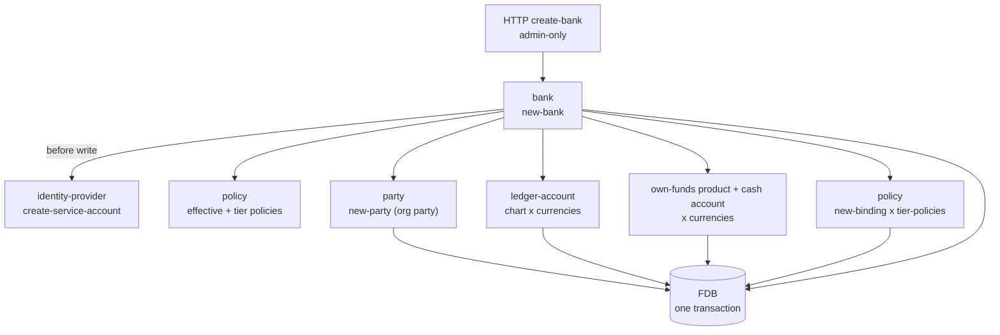

# Banks

> The "organization" concept was renamed to **bank** (brick
> `bank-organization` → `bank`, record `Bank`, ids `bnk.*`,
> `new-organization` → `new-bank`) and bank-type was dropped
> (#139); this doc describes the current model. (It was
> previously named `organizations.md`.)

## Objective

A **bank** is the multi-tenant boundary in Queenswood. Every
other domain entity — every party, cash account, payment, product
version, policy binding — carries a `:bank-id`, and every store
is indexed on it. The data model partitions along this axis;
cross-tenant queries are impossible at the data layer.

This TDD describes the bank model: the `Bank` record and its
status, the all-or-nothing creation flow that provisions every
foundational record a new tenant needs, the tier mechanism that
binds tier-specific policies at create time, and the
enrich-on-read shape.

In scope: the `bank` brick; the status enum; the multi-brick
atomic create flow (service-account client, org party, ledger
chart, own-funds house accounts, tier bindings); the
enrich-on-read pattern.

Out of scope: the service-account/JWT mechanics
([authentication.md](authentication.md)); each foundational brick's own rules
— party creation [parties.md](parties.md), the ledger chart
[chart-of-accounts.md](chart-of-accounts.md), product publish
[cash-account-products.md](cash-account-products.md), account
opening [cash-accounts.md](cash-accounts.md), policy bindings
[policy-evaluation.md](policy-evaluation.md).

## Background

Two needs.

**Tenant isolation.** A multi-tenant bank-of-banks must keep one
tenant's data fully separate from another's. Queenswood carries
`:bank-id` on every record and indexes every store on it.

**Bootstrap completeness.** A bare `Bank` record is useless. To
operate, a new tenant needs:

- A **service-account client** so its backend can authenticate
  (see [authentication.md](authentication.md)).
- A **party** representing the bank itself in its own books.
- A **chart of bank-owned ledger accounts** per currency, so
  postings have somewhere to land (see
  [chart-of-accounts.md](chart-of-accounts.md)).
- An **own-funds house account** per currency — a real,
  transactable cash account the bank pre-funds to pay its
  customers (interest, rewards).
- **Policy bindings** that pin the tier-appropriate rule set.

Without these, a tenant can't authenticate, can't post, can't
accrue interest, can't be constrained by tier policies. The
system answers with a single `new-bank` operation that mints
every foundational record in **one FDB transaction** across
several bricks. Atomic. All-or-nothing.

## Proposed Solution

### Architecture

`bank` is the brick. Synchronous interface — no command
processing, no event consumers. The create flow composes other bricks'
interfaces inside one FDB transaction; ADR-0002 makes this atomic
across record stores. The service-account client is created
*before* the FDB write so an identity-provider failure aborts the
transaction cleanly.



The diagram understates the choreography — those branches run
sequentially inside one `store/transact`, threaded through
`error/let-nom>`. A failure at any step rolls everything back; a
successful commit means the whole tenant is up.

### The Bank record

```clojure
{:bank-id    "bnk.<ulid>"
 :name       "Acme Bank"
 :status     :bank-status-test    ; or -live, -unknown
 :sort-code  "000001"             ; 6-digit, fountain-allocated
 :created-at <ms>
 :updated-at <ms>}
```

Each bank has its **own 6-digit sort code**, allocated from a
monotonic fountain at creation (`000001`, `000002`, …) and unique
across banks (`Bank_by_sort_code`). `00`-prefixed sort codes are
unallocated in the real world, so the range is safe. The sort code
prefixes every BBAN the bank issues, so an inbound payment can be
attributed to its bank by the BBAN's first six digits
(`get-bank-by-sort-code`). Replaces the former single shared
`040004` default. Future: allocate at sign-up, or accept a
bank-supplied code.

That's the whole record. There is **no bank-type** — the
internal/customer distinction was removed (#139). What
distinguishes one bank from another is its `status` (test vs
live, persisted) and its `tier` — and `tier` isn't even stored on
the record: it is used only at create time to select which
policies get bound. A `BankChangelog` record (`bank-id`,
`status-before`, `status-after`) carries status transitions on
the changelog. It is the one store still writing a bespoke
changelog shape rather than the shared `ChangelogEvent`
envelope, and nothing relays or consumes it yet.

### The atomic create flow

`new-bank txn bank-name bank-status tier currencies opts` runs
the following inside one FDB transaction:

1. **Resolve effective policies** —
   `policy/get-effective-policies txn {}` (empty selectors; the
   bank doesn't exist yet), used for the create capability check.
   `opts` may override with `:policies`.
2. **Resolve tier policies** — `policy/get-policies-by-tier txn
   tier` returns the policies labelled `{:tier "<name>"}`.
3. **Allocate the sort code** — `store/allocate-sort-code` draws
   the next value from the global fountain, formatted `%06d`.
4. **Build the `Bank`** — `domain/new-bank` runs the
   `:bank-action-create` capability check, then mints the record
   with a `bnk.*` id and the allocated sort code.
5. **Create the service-account client** *(before the FDB write)*
   — when `opts` carries `:identity-provider`,
   `identity-provider/create-service-account` with
   `client_id == bank-id` and a status-derived audience. The secret
   minted here is discarded: the command reply crosses the bus, so no
   credential travels on it. The API handler mints the one in the
   response with `rotate-secret` after the reply — see the
   [authentication TDD's service-account lifecycle](authentication.md).
6. **Persist the bank.**
7. **Create the bank's org party** — `party/new-party` with
   `:type :party-type-organization` and display-name = bank name.
8. **Seed the ledger chart** — `new-ledger-accounts` opens one
   `LedgerAccount` per default row per currency (see below).
9. **Open own-funds house accounts** — per currency, draft +
   publish a `:product-type-sub-ledger-own-funds` product ("Bank
   own funds", `effective-from` today), then open a real
   `CashAccount` on the org party against it — its BBAN carries the
   bank's sort code.
10. **Bind tier policies** — for each tier policy,
   `policy/new-binding` with target
   `{:kind {:bank {:bank-id <new-id>}}}`.
11. **Enrich and return** (see below).

### The default ledger chart

The chart is loaded from `bank/ledgers/general-ledger.edn` (in
`resources`) and seeded once per currency. Eight bank-owned,
flat accounts (no party, no product):

| GL code | Name | Type | Class |
| ------- | ---- | ---- | ----- |
| 1100 | Cash at correspondent | asset | detail |
| 1200 | Pending outbound payments | asset | detail |
| 2100 | Customer deposits — current | liability | control |
| 2200 | Customer deposits — savings | liability | control |
| 2300 | Customer deposits — term deposits | liability | control |
| 2400 | Interest payable | liability | detail |
| 2500 | Suspense — unreconciled inbound | liability | detail |
| 3100 | Bank own funds | equity | control |

The control accounts (2100/2200/2300, 3100) are roll-up targets
for sub-ledger postings; the rest are detail. See
[chart-of-accounts.md](chart-of-accounts.md) for how legs map to
control accounts at posting time.

### Own-funds house account

Distinct from the ledger chart: per currency, `new-bank` drafts
and publishes a `:product-type-sub-ledger-own-funds` product and
opens a real, BBAN-addressable `CashAccount` on the bank's org
party. This is the bank's own money — pre-funded so it can pay
customers (interest, rewards). It rolls up into the 3100 own-funds
control. (Earlier designs bootstrapped a single "settlement
product"; that was replaced by the ledger chart plus this house
account.)

### Enrichment for reads

The interface `get-bank txn bank-id` returns the **flat** record.
The enriched read — used by `get-banks` and by `new-bank`'s
return — walks the related bricks:

```clojure
{:bank
 {:bank-id ... :name ... :status ...
  :created-at ... :updated-at ...
  :party {...}            ; the bank's org party
  :accounts [{...}]       ; with embedded balances + :gl-code
  :client-id "bnk...."}   ; == bank-id
 :client-secret "..."}     ; only when freshly minted
```

`:client-secret` (the service-account secret, the one-time
credential) appears only when an `:identity-provider` was supplied
at create — there is no API key. It is not the secret creation
minted; that one is discarded rather than carried back over the
command bus. The handler calls `rotate-secret` once the reply
arrives and returns what that mints, so the credential exists only on
the response. The enriched shape walks the org party and the cash
accounts (with balances and resolved `:gl-code`); it does not list
the seeded ledger accounts.

### Tier and the policy-binding model

`tier` is a string label selecting which policies bind to the new
bank:

- Policies carry a `{:tier "<name>"}` label.
- `policy/get-policies-by-tier "<name>"` returns the matches.
- `new-bank` writes a `PolicyBinding` per match, targeting
  `{:kind {:bank {:bank-id <id>}}}`.

`get-effective-policies` resolves platform-tier policies plus
those bound to a bank's `:bank-id` (see
[policy-evaluation.md](policy-evaluation.md)), so a tier binding
written here is load-bearing at evaluation time.

## Alternatives Considered

- **Separate creation commands.** Have the admin call create-bank,
  then create-party, then seed-ledger, and so on. Rejected —
  partial failure leaves a half-built tenant (a bank with no
  ledger, a product with no accounts). One transaction guarantees
  bootstrap completeness.
- **A bank-type discriminator.** Keep the old internal/customer
  split. Removed (#139) — the difference that mattered (own books
  vs customer books) is now expressed by the ledger chart plus the
  own-funds house account, not by a type on the record. One shape,
  differentiated by tier bindings and status.
- **A single settlement product at bootstrap.** The earlier model
  gave each tenant one settlement/internal product. Replaced by
  the explicit ledger chart + own-funds house account, which
  models the bank's books directly rather than overloading a
  product.
- **Lazy account creation.** Open ledger/house accounts on first
  use of a currency. Rejected — postings need their accounts to
  exist before any payment, fee, or interest activity. Upfront
  bootstrap is simpler and predictable.
- **No tier mechanism.** Force callers to bind every policy
  explicitly. Rejected for ergonomics — most tenants fall into
  named buckets that map to bundles; the tier label is the
  shorthand. Explicit bindings can still be added on top.
- **Tier as a numeric ordering.** `1, 2, 3` with implicit
  precedence. Rejected — tiers don't form a clean total order (a
  "developer" tier and a "production" tier are different shapes,
  not levels). String labels are flexible.
- **Random service-account `client_id`.** Rejected in favour of
  `client_id == bank-id`: a deterministic mapping means a service
  token's `azp` *is* the bank-id, so attribution needs no lookup.

## Known Limitations

- **No tier change after creation.** No exposed flow moves a bank
  between tiers; it would need to recompute the binding set (drop
  old tier bindings, add new). Needed when a customer upgrades or
  downgrades; not implemented. `tier` isn't even stored on the
  record — only the resulting bindings are.
- **Status change has no promotion gate.** `change-status txn
  bank-id new-status opts` flips `:status` between test and live in
  place — guarded on the bank currently being test or live, and
  rejecting a flip to the same status — swapping the service-account
  client's audience via the identity-provider before persisting, so
  an IDP failure aborts cleanly. There is no test→live
  onboarding-completeness check (e.g. a per-bank ClearBank
  credential model) and no forced re-auth of already-issued tokens
  (see [authentication.md](authentication.md)'s stateless-JWT
  limitation).
- **No closure or off-boarding.** A bank once created is
  permanent. Closing every account, revoking the service-account
  client (`revoke-service-account` is unwired — see
  [authentication.md](authentication.md)), and archiving party data are all
  manual.
- **No bank-level audit trail.** `created-at` is the only history;
  which platform admin created the bank isn't recorded — only that
  an admin principal made the call.
- **Currencies are committed at create.** `new-bank` fans the
  `currencies` argument across the ledger chart and own-funds
  house accounts. Adding a currency to an existing bank means
  creating the extra ledger and house accounts by hand — there is
  no add-currency convenience.
- **Bank name and party display-name are coupled.** The org party
  is created with display-name = bank name; renaming the bank
  later doesn't propagate, and there's no rename flow.
- **Effective-policies-during-create has no bank context.** Step 1
  calls `get-effective-policies txn {}` with empty selectors,
  since the bank doesn't yet exist — platform-tier policies govern
  the create. Fine in principle, but a subtle point if a
  platform-tier rule ever needed the about-to-be-created bank.
- **The create is admin-only by convention, not by code.** The
  route requires the `admin` role (see
  [authentication.md](authentication.md)), but `new-bank` itself runs only a
  `:bank-action-create` capability check, not a principal check.
  Calling it from non-admin code would bypass the intended gate.

## References

- [ADR-0002](../adr/0002-foundationdb-record-layer.md) —
  FoundationDB Record Layer (multi-store atomicity for the create
  flow)
- [ADR-0005](../adr/0005-error-handling-with-anomalies.md) — Error
  handling with anomalies (rollback on partial failure)
- [authentication.md](authentication.md) — Authentication (the service-account
  client provisioned at bank creation)
- [parties.md](parties.md) — Parties (the bank's org party)
- [chart-of-accounts.md](chart-of-accounts.md) — Chart of accounts
  (the seeded ledger chart and own-funds account)
- [cash-account-products.md](cash-account-products.md) — Cash
  account products (the own-funds house product)
- [cash-accounts.md](cash-accounts.md) — Cash accounts (one
  own-funds account per currency, opened at creation)
- [policy-evaluation.md](policy-evaluation.md) — Policy evaluation
  (tier label, binding selectors, effective-policy resolution)
- `bank` brick interface (`new-bank`, `get-bank`,
  `get-banks`)
