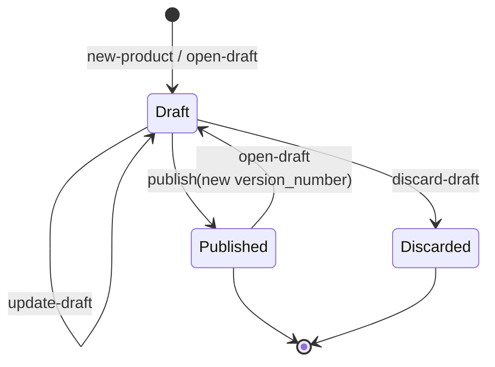

# Cash account products

## Objective

A **cash account product** is the offering under which cash accounts
are opened — it fixes the currency, the balance buckets the account
will carry, the interest rate, the payment-address schemes accepted,
and so on. Products are bank-scoped (each bank defines its own) and
**versioned**: terms change over time, and an account opened under one
version keeps its terms until an approved migration moves it.

A product is created from a **template** — a platform-scoped record
that supplies the instrument fields a bank does not choose, such as
the product type and the balance-bucket layout.

The bank's own chart-of-accounts entries are a separate concern —
`LedgerAccount` records owned by `ledger-account`, not products.

This TDD describes the template, product and version model, the
draft → published lifecycle, the immutability rule that makes
versioning load-bearing, and the connection from account to version
that pins terms forward in time.

In scope: the `cash-account-product` and `cash-account-product-query`
bricks; the template, product and version data model; lifecycle
operations (`new-product` / `open-draft` / `update-draft` /
`discard-draft` / `publish`); policy integration; the link from an
account to its version, and what may move it.

Out of scope: cash account opening — see
[cash-accounts.md](cash-accounts.md), where accounts consume product
versions; interest accrual reading the rate, see
[interest.md](interest.md); moving a cohort of accounts between
versions, see
[cash-account-migration.md](cash-account-migration.md); the policy
machinery itself, see
[policy-evaluation.md](policy-evaluation.md).

## Background

Banking products are not constants. Interest rates move, fee
structures evolve, compliance rules tighten. Existing accounts cannot
be silently repriced — that would breach contractual T&Cs and (for
retail products) the regulatory framing under which the customer
agreed to the terms.

Two patterns answer the "products change over time" need:

1. **Edit in place.** The product record is mutable; updates apply to
   every account immediately. Wrong for retail banking — accounts
   agreed to one set of terms shouldn't see another.
2. **Versioned with cohorts.** The product has many versions; each is
   immutable once published; new accounts pick up the version in
   force; existing accounts stay on the version they were opened
   under. The right shape for retail banking.

Queenswood implements the second. Moving an existing account onto
another version is possible, but it is a separate resource with its
own notice, approval and preview rather than an edit — see
[cash-account-migration.md](cash-account-migration.md).

Three entities matter:

- **Template** — the platform's menu of instrument shapes ("a savings
  account"). Not bank-scoped, and not authored by a bank.
- **Product** — the conceptual thing ("Premier Savings"). A stable
  product-id; everything else lives on versions.
- **Version** — a specific set of terms at a point in time ("Premier
  Savings v3 with 5.5% APR effective today"). Once published,
  immutable forever.

The lifecycle: a draft is mutable until it's published or discarded; a
published version is fixed; opening a new draft on a published product
starts the next version.

## Proposed Solution

### Architecture

Two bricks share the product's FDB stores, split along the line
[ADR-0017](../adr/0017-query-write-brick-split.md) draws: reads in one,
writes in the other.

`cash-account-product` holds the writes:

- `domain.clj` — the record shapes, the template snapshot, the
  lifecycle transitions, and the guards: the immutability and
  single-draft invariants, the currency and template gates, the
  effective window, and the capability and limit checks.
- `core.clj` — orchestrates store, domain, the query brick's reads and
  policy resolution, each operation inside one FDB transaction.
- `store.clj` — the two record stores: `cash-account-products`, keyed
  by `[bank-id, product-id, version-id]`, and
  `cash-account-product-templates`, keyed by template id.
- `system.clj` — the bootstrap component that seeds one template.
- `interface.clj` — `new-product`, `open-draft`, `update-draft`,
  `discard-draft`, `publish` and `new-template`.

`cash-account-product-query` holds the reads:

- `store.clj` — the record loads, prefix scans and index counts.
- `domain.clj` — `active-version`, the pure effective-date resolver.
- `core.clj` — the aggregate shape `get-product` and `get-products`
  return, and the internal-product filter on the listing.
- `interface.clj` — `get-version`, `get-product`, `get-products`,
  `get-template`, `list-templates` and `active-version`, plus four
  read primitives the write sibling calls rather than API surface:
  `get-versions` for the draft and version-number logic,
  `find-version-by-idempotency-key` for the create's read-back, and
  `count-by-org` and `count-by-org-product-type` for the limit checks.

The write brick requires the query brick and calls those reads inside
its own transactions, passing the live `txn`. The `api` base requires
only the query brick for reads, which is what the split buys.

Neither brick has an event consumer or a command — every operation is
a synchronous interface call from a request handler. Under
[ADR-0018](../adr/0018-command-writes-are-earned.md) a write earns a
command by needing multi-record atomicity under contention, by
carrying idempotency stakes, by something having to react to it
asynchronously, or by arriving over an unreliable ingress. A product
write spans one record store, nothing reacts to it, and it arrives on
an HTTP request the caller is holding open. Its idempotency is served
by a unique index and a read-back inside the same call, not by a
command envelope.

### Data model

Three record types. Only two of them belong to a bank.

#### Templates

A **template** is platform-scoped — a `CashAccountProductTemplate` in
the `cash-account-product-templates` store, with no `bank-id`. It
carries the fields a bank does not choose: the product type, the
balance-sheet side, the balance-bucket layout, the allowed
payment-address schemes, the ISO cash-account type, the currencies a
product built from it may use, and whether it is internal.

Four are seeded, under the ids fixed in their YAML files:

- **Current account** — current, GBP.
- **Savings account** — savings, GBP.
- **Term deposit** — term-deposit, GBP.
- **Bank own funds** — own-funds, EUR, GBP and USD, and `:internal`.

They are FDB records, not classpath constants. The write brick's
`system.clj` registers a `cash-account-product-templates/template`
component kind whose start function calls `new-template`; the system
YAML declares one instance per file under
`resources/cash-account-product-templates`, so a template is added by
adding a file and an instance. Each file carries a stable `tpl.` id,
and `new-template` preserves the `:created-at` of a template already
under that id, so re-seeding on every bootstrap is a no-op rather than
a pile of rows.

`new-template` is on the write interface; `get-template` and
`list-templates` are on the query one. `list-templates` drops the
internal templates, so the own-funds shape the bank's house accounts
are built from never appears in the customer-facing menu.

#### Versions

The product has no record of its own; it's implicit from the set of
versions sharing a `:product-id`. A **version** is the unit of
storage.

The caller supplies six fields: `:name`, `:template-id`, `:currency`,
`:effective-from`, and optionally `:interest-rate-bps` and
`:effective-to`. There is no product-type field on the request — the
product type comes from the template.

`product-fields` writes seven of the version's fields off the resolved
template. It snapshots `:product-type`, `:balance-sheet-side`,
`:balance-products`, `:allowed-payment-address-schemes`,
`:iso-cash-account-type` and `:internal`, and stamps `:template-id`
for provenance. Snapshotting rather than referencing is what makes a
published version immutable in fact and not only by rule: a re-seeded
template cannot reach it.

```clojure
{:bank-id
 :product-id          "prd.<ulid>"
 :version-id          "prv.<ulid>"
 :version-number      1             ;; 1, 2, 3, ...
 :status              :cash-account-product-status-draft
                      ;; or -published, -discarded
 :name                "Premier Savings"
 :allowed-currencies  ["GBP"]       ;; one currency per
                                    ;; product, wrapped in a vec
 :template-id         "tpl.<ulid>"  ;; the template snapshotted
 :product-type        :product-type-sub-ledger-savings    ;; template
 :balance-sheet-side  :balance-sheet-side-liability       ;; template
 :balance-products    [...]         ;; balance buckets, template
 :allowed-payment-address-schemes [...]                   ;; template
 :iso-cash-account-type :iso-cash-account-type-svgs       ;; template
 :internal            true          ;; template, present when internal
 :interest-rate-bps   550           ;; 550 bps = 5.5% APR
 :effective-from      20089         ;; epoch-day (required)
 :effective-to        <epoch-day or absent>  ;; open-ended if absent
 :discarded-at        <timestamp>   ;; set by discard-draft only
 :idempotency-key     <string>      ;; stamped by new-product only
 :created-at
 :updated-at}
```

Versions are stored under the `[bank-id, product-id, version-id]`
primary key. `get-product` returns the aggregate (`{:versions [...]}`
sorted newest-first); `active-version` returns the version in effect
on a given day (see **Effective dating** below).

#### The currency gate

A template names the currencies it allows, and a create or update
whose `:currency` is not among them is rejected
`:cash-account-product/currency-not-allowed`, which the API returns as
a 422 with the allowed list in the problem detail.

The three customer templates allow GBP only. The own-funds template
allows EUR, GBP and USD, because a bank is created with a set of
currencies and opens one house account per currency. So a bank created
in EUR or USD has house accounts in those currencies and can offer its
customers no product in them. Widening that is a change to the seeded
templates, not to a bank's own configuration — see **Known
limitations**.

### Lifecycle



- **Draft.** Mutable — `update-draft` rewrites mutable fields. Only
  one draft per product at a time.
- **Published.** Immutable. Any attempt to update returns
  `:cash-account-product/version-immutable`.
- **Discarded.** Terminal — a draft that was abandoned; preserved as
  history rather than deleted, with `:discarded-at` stamped.
  Re-opening a draft after discard creates a new version, not a new
  attempt at the discarded one.

The `Published → Draft` transition (with a fresh `:version-number`) is
`open-draft` on a product that already has a published version.

#### The template is fixed for the product's life

A draft does not inherit the previous version's name, currency, rate
or window — the caller supplies those every time. It does inherit the
instrument fields, because the template is resolved from the product
rather than from the request: `open-draft` reads it off the product's
newest existing version, `update-draft` off the version being updated.

Every version of a product therefore shares one template, and a
product's type is fixed from its creation. Two rules elsewhere depend
on that: the migration brick's same-product-type check, and the
`:product-type` an account snapshots when it opens.

`:template-id` is optional on the open-draft and update-draft
requests, and required on create. When it is present and names a
template other than the product's own, the request is rejected
`:cash-account-product/template-mismatch`, a 422 carrying both ids.
Absent means the caller expressed no opinion, and the resolved
template stands.

An update re-snapshots the template as it stands at that moment. A
template re-seeded with different buckets therefore reaches a draft on
its next update — the proto's "later edits to the template never
change an existing product" holds for published versions, which no
update can reach.

### Operations

- **`new-product`** — creates a product (generating a fresh
  `:product-id`) with version 1 in draft. Capability, total count
  limit and per-product-type count limit checked.
- **`open-draft`** — creates a new draft version (`:version-number` =
  `inc` highest existing number) on an existing product. Capability
  checked. Refuses if a draft already exists for this product.
- **`update-draft`** — replaces the draft's mutable fields with new
  data. Capability checked. Refuses if the version is not in draft
  state (the immutability gate).
- **`discard-draft`** — flips a draft to discarded. Capability
  checked. Terminal; the slot is freed for a new draft.
- **`publish`** — flips a draft to published. Capability checked.
  After this, immutability holds.

Every one of the five runs its reads, its guards and its write inside
one `store/transact`, so a guard is decided against the state the
write commits against. Where two callers race, one commits and the
other conflicts, retries, re-reads and is rejected: two creates
against a bank one below its product-type cap yield one version and
one `:policy/limit-exceeded`, and two `open-draft` calls on one
product yield one draft and one
`:cash-account-product/draft-already-exists`.

The create's read-back sits outside that transaction, and has to.
`or-already-created` turns a unique-index violation on the idempotency
key into the original version, and the violation only surfaces when
the transaction commits.

Only `new-product` stamps `:idempotency-key`. `publish` and
`discard-draft` `assoc` onto the loaded record, and `update-draft`
rebuilds it carrying the existing key forward, so the unique-index
entry a create took survives every later operation on that product —
which is what makes a replayed create return the original product
rather than mint a second. Opening a draft takes no entry, even when
the request carries an `Idempotency-Key` header. See
[idempotency.md](idempotency.md).

Each operation resolves the effective policies its guards are checked
against inside its own transaction, via
`policy/get-effective-policies`. A caller may pass `{:policies ...}`
in `opts` to supply already-resolved policies and skip that lookup.

### Why immutability matters

Cash accounts hold a `:product-id` + `:version-id` reference. Interest
accrual reads the account's version to find the rate; available-balance
derivation uses the product-type from the version per
[transactions-and-balances.md](transactions-and-balances.md);
allowed-currencies is read off the version when validating deposits.

If a published version were mutable, those reads would silently change
behaviour for existing accounts — a customer who signed up for 5.5%
APR could find themselves earning 3.0% overnight. Immutability forbids
this. New rates require new versions, and moving an account onto one
is a migration, with the notice and approval that implies.

### Single-draft invariant

`open-draft` refuses if any draft already exists for the product
(`:cash-account-product/draft-already-exists`). One work-stream of
changes at a time. The control gate is deliberate — parallel drafts
would create the question of "which one wins on publish?" without a
clean answer.

The trade-off is that compliance and product teams can't concurrently
prepare independent changes. The argument for the simpler model: most
product changes are sequenced edits that converge in one place anyway,
and the single draft is the natural workspace for them.

### Policy integration

Every write is policy-gated. Reads are not: `get-version`,
`get-product`, `get-products`, `get-template` and `list-templates`
run no policy check.

**Capability.** `:cash-account-product` with
`{:action ... :product-type <type>}`:
`:cash-account-product-action-draft` on `new-product`, `open-draft`,
`update-draft` and `discard-draft`, and
`:cash-account-product-action-publish` on `publish`. Lets policies
deny the action entirely, or by product-type ("this bank cannot offer
term-deposit products") via the `:product-type` filter on the
capability request.

**Count limits.** Two, both `{:aggregate :count :window
:time-window-instant :value <existing+1>}`, both checked by
`new-product`:

- the **total**, keyed `{:bank-id}` — how many products a bank may
  have at all;
- the **per-product-type** limit, which passes `:product-type` so a
  policy limit whose filter enumerates that type matches. A type with
  no matching filter — own-funds — passes through.

The policy lookup itself is keyed `{:bank-id :cash-product-id}` for
the version-scoped operations and `{:bank-id}` for the create, which
is which policies are in scope rather than a dimension of either
limit.

The seeds set both per tier: micro allows 25 products and one of each
customer product type; platform-restricted allows 1,000 and 100.

The total is counted off the `CashAccountProduct_count_by_bank` index,
which groups `[bank_id, product_id]` with no filter. The bank's
own-funds house product — one per currency, created at bank
provisioning — is a product like any other, so it consumes the total
cap while `get-products` hides it from the listing. A tenant cannot
see everything using its allowance; see **Known limitations**.

Both flow through the same engine as every other domain operation —
see [policy-evaluation.md](policy-evaluation.md).

### Connection to accounts

When `cash-account/open-account` opens an account, it resolves
`active-version` for today off the chosen product and stores both
`:product-id` and `:version-id` on the account record. The account is
pinned there: it keeps reading its own version as later versions are
published around it, and it moves only when an approved migration
moves it.

That pin is what gives the cohort property. Publishing a new version
changes nothing for accounts already open; it changes what an account
opened tomorrow gets.

#### Which readers go to the version

Three readers resolve a version and read its terms:

- **Account opening** — `active-version` for the currency check, the
  allowed payment-address schemes, and the `:balance-products` the
  account's buckets are created from.
- **Address rotation** — `get-version` on the account's own pinned
  version, for the allowed schemes.
- **The interest pass** — `get-version` on the pinned version, for
  `:interest-rate-bps`.

Two readers use a snapshot taken at open instead:

- **The account record's `:product-type`**, and each balance bucket's,
  both stamped from the version when the account is opened.
- **The payment brick**, which reads `:product-type` off the debtor
  and creditor account records, never off a version.

A migration repins `:product-id` and `:version-id` and leaves the
snapshotted `:product-type` alone, which is exactly why the migration
brick refuses a target of a different product type. Were that rule
lifted, an account's snapshot would disagree with its version and
payment routing would follow the stale value.

The interest pass memoises the versions it resolves in an atom for the
life of one run, built from the accounts as they stream. It is scoped
to the run rather than expiring on a clock, so one pass applies one
view of the rates — see [interest.md](interest.md). Nothing else
caches a version.

### Migrating accounts between versions

An account's pin moves only through the `cash-account-migration`
brick, which models a migration as its own resource: a source product
(optionally narrowed to particular versions), a target product and
published version, the date customers were notified, the date it
becomes due, and its own status.

The API exposes it at `/v1/cash-account-migrations` — author, approve,
cancel, and preview — and deliberately exposes no way to commit one.
Committing is the scheduler's `account-migration` task, so the rule
that only a batch pass moves accounts is visible in the shape of the
API rather than being a convention.

Three record types carry it: `CashAccountMigration` for the migration
itself, `CashAccountMigrationRun` for each preview or commit run, and
`CashAccountMigrationAccountRun` for the per-account verdict, written
by previews as well as commits so a preview is inspectable account by
account.

Two rules are checked when a migration is authored, both in the
migration brick's `domain.clj`: `ensure-target-published`, since a
draft is not terms anyone can be moved onto, and
`ensure-same-product-type`, the one compatibility rule — a savings
product migrates to a savings product. Everything else that could stop
a given account moving is an eligibility question decided per account
during the run.

Policy carries limits for it too, per tier: how many accounts one
migration may move — 50 on micro, a million on platform-restricted —
and how many previews a bank may run in a day, 10 and 1,000. Moving
one account is `cash-account/migrate-product`, which repins
`:product-id` and `:version-id` after checking the account is open and
the `:cash-account-action-migrate` capability allows it.

The full design is
[cash-account-migration.md](cash-account-migration.md).

### Effective dating

A version carries an `effective-from` (required) and an optional
`effective-to`, both epoch-day ints. They define the window over which
the version is the **active** one. Publishing alone doesn't make a
version live: the active version on a given day is the published
version whose `[effective-from, effective-to)` window contains that
day, breaking ties by the greatest `effective-from` (then version
number).

Account opening resolves `active-version` for *today*
(`utility/today`) and pins it. A future-dated version is published but
dormant until its `effective-from`; an expired one (past its
`effective-to`) drops out. Overlap needs no mutation of older versions
— the latest-effective-from rule selects the right one.
`ensure-effective-window` enforces the window at draft creation and
update: `effective-from` is required, and `effective-to`, when
present, must fall strictly after it.

`active-version` nonetheless treats a version with no
`effective-from` as effective from the beginning of time. The proto
keeps the field optional and the resolver keeps that case for records
written before it was required; a version written today cannot reach
that branch, because the guard runs first.

The reads behind all of this are capped. `get-product` reads at most
100 versions of one product, and `get-products` at most 1,000 version
rows for a bank; the API paginates the product listing in memory after
that scan, so its page cursor walks a result the store has already
truncated.

## Alternatives Considered

- **Edit in place.** One product record, mutable. Rejected — breaks
  retail T&Cs and is regulatorily fraught. Cohorting by version is the
  standard answer to changing terms over time.
- **Per-account terms.** Every account carries its own rate, fees,
  allowed-currencies, etc. Rejected — no central place to change terms
  for new accounts; no audit trail of when product terms shifted;
  duplicates the same data per account.
- **Single-version product with explicit rate-change events.** One
  product record; rate changes recorded as events that apply to
  specific cohorts. Rejected — the cohort definition becomes a
  separate concept; the versioned-product-with-cohort-by-version model
  collapses cohort-management into the product model itself.
- **Many concurrent drafts per product.** Compliance and product teams
  could prepare independent changes in parallel. Rejected — creates
  the "which draft becomes published?" problem without a clean answer.
  Single-draft is a deliberate gate.
- **Product as opaque blob.** Terms stored as a freeform map; brick
  doesn't interpret. Rejected — interest needs a typed rate, account
  opening needs the currencies and balance-products list,
  available-balance derivation needs the product-type. Structured
  fields are right.
- **Versions stored in `cash-account` (not their own brick).**
  Versions and accounts share a lifecycle. Rejected — products and
  accounts are different concerns: a product author and an account
  holder are different actors; bricks separate accordingly.
- **A "bring existing accounts along" flag on a published version.**
  Rejected — a version has one date and a migration needs three, and a
  flag can only ever mean "earlier versions of my own product". See
  [cash-account-migration.md](cash-account-migration.md).

## Known Limitations

- **Discarded drafts accumulate.** No cleanup. They're kept as
  history, but if a bank rapid-iterates and discards many drafts, the
  version list grows without bound. Past the read caps the effect is
  not just untidy: `get-product` stops at 100 versions of a product
  and `get-products` at 1,000 rows for a bank, so versions — or, once
  one product's versions fill the scan, whole products — drop out of
  reads with no error and nothing to signal the truncation.
- **No version-comparison helper.** "What changed between v2 and v3?"
  is left to callers (or to UIs reading the versions and diffing
  fields).
- **Template buckets are trusted, not validated.** The brick stores
  whatever `:balance-products` the template supplies and the
  cash-account-opening code creates exactly those buckets; it never
  checks they suit the product-type. A bad template would mis-shape
  every account opened under it.
- **One product is one currency.** A version pins a single currency
  (stored as a one-element `:allowed-currencies`) and a single
  `:interest-rate-bps`. Offering the "same" product in another
  currency means a separate product — there is no multi-currency
  product with per-currency rates (see [interest.md](interest.md)
  Known Limitations).
- **Product templates are platform-scoped.** They are FDB records
  rather than classpath constants, but they are still the same for
  every bank and still change only with a redeploy: a bank cannot
  author or customise its own. The customer-facing three allow GBP
  only, so a bank whose currencies are EUR or USD can open its house
  accounts and offer its customers nothing.
- **Internal products consume the tenant's cap.** The own-funds
  product created per currency at bank provisioning counts toward the
  total product limit, because the count index groups by
  `[bank_id, product_id]` with no filter, while `get-products` hides
  internal products from the listing. A bank near its cap cannot see
  what is using the allowance. Excluding them means a filtered count
  index and a reindex behind it.
- **The single-draft invariant has no override.** If two product
  changes genuinely need parallel work, there's no escape hatch. Could
  be lifted later with explicit conflict resolution; today it's a hard
  rule.
- **No explicit retirement status.** A version's `effective-to`
  already time-boxes it — set it to stop new accounts opening after a
  date (once it passes, `active-version` returns nil) — but there is
  no product-level `retired` flag. Retirement is per-version and
  date-driven, not an immediate status toggle.

## References

- [ADR-0002](../adr/0002-foundationdb-record-layer.md) —
  FoundationDB Record Layer (version and template storage, indices)
- [ADR-0005](../adr/0005-error-handling-with-anomalies.md)
  — Error handling with anomalies (version-immutable,
  draft-already-exists, currency-not-allowed rejections)
- [ADR-0017](../adr/0017-query-write-brick-split.md) — the
  query/write brick split (`cash-account-product-query` holds the
  reads)
- [ADR-0018](../adr/0018-command-writes-are-earned.md) — command
  writes are earned (why these writes stay synchronous)
- [cash-account-migration.md](cash-account-migration.md) — Cash
  account migration (moving an account's pin between versions)
- [cash-accounts.md](cash-accounts.md) — Cash accounts (the version
  pinned at open, the product-type snapshot)
- [transactions-and-balances.md](transactions-and-balances.md)
  — Transactions and balances (`:balance-products` defines bucket
  shapes; product-type drives `available-balance`)
- [interest.md](interest.md) — Interest accrual (consumes
  `:interest-rate-bps` from the version; the per-run memo)
- [idempotency.md](idempotency.md) — Idempotency (the create's key
  and its unique index)
- [policy-evaluation.md](policy-evaluation.md) — Policy evaluation
  (draft and publish capabilities, the two count limits)
- `cash-account-product` and `cash-account-product-query` brick
  interfaces
