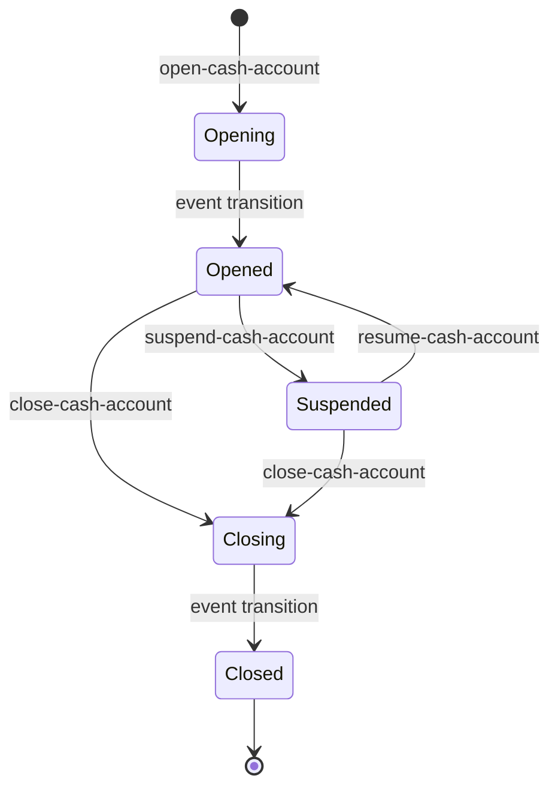

# Cash accounts

## Objective

A **cash account** is what a party holds and transacts
through. It's pinned to a published version of a product
per [cash-account-products.md](cash-account-products.md),
set in a specific currency, owned by an active party per
[parties.md](parties.md), and addressable via one or more
payment-address schemes (today: SCAN — UK Sort Code +
Account Number). Opening and closing are event-driven
lifecycle transitions; suspend, resume, address rotation and
product migration are single-phase. Balances and
transactions live in their own bricks but everything points
back to the account.

This TDD describes the cash account model: the four-way
join (organisation, party, product-version, currency), the
account lifecycle and what each status permits, the SCAN
address generation, the idempotency contract on the writes,
and the distinction between *product-type* (from the
product) and *account-type* (from the party) that policies
can filter on.

In scope: the `cash-account` and `cash-account-query`
bricks; account data model; opening and closing flow;
suspend, resume, rotate-address and migrate; event-driven
status transitions; SCAN address generation; lookups;
balance-bucket creation at open time.

Out of scope: balances themselves, covered in
[transactions-and-balances.md](transactions-and-balances.md);
the legs that affect them, covered in
[payments.md](payments.md) and
[interest.md](interest.md);
the payment-address scheme details (FPS / SCAN / BBAN
specifics belong in the payments TDD).

## Background

A cash account sits at the join of four concerns:

- **The organisation** — the multi-tenant boundary; every
  account belongs to exactly one.
- **The party** — the holder; person parties hold *personal*
  accounts, organisation and internal parties hold
  *business* accounts.
- **The product version** — pinned at open time and read for
  every product-derived behaviour (currency rules, allowed
  schemes, interest rate, balance-bucket layout).
- **The currency** — exactly one per account; multi-currency
  means multiple accounts.

Two type dimensions are easy to confuse:

- **`:product-type`** — from the product
  (current / savings / term-deposit / own-funds / general
  ledger).
- **`:account-type`** — from the party
  (personal / business). Derived: person party → personal,
  non-person → business.

Policies (and downstream behaviour like available-balance
derivation) reason about both: "this organisation can open at
most N personal current accounts in GBP" filters on
product-type, account-type, and currency.

Opening and closing are two-step. Opening writes the
account in `:opening` status; a `cash-account-status-changed`
event relayed off the changelog then transitions it to
`:opened`. Closing writes `:closing`; the same handler
transitions to `:closed`. The pattern is the same reactive
choreography parties use for IDV — see
[parties.md](parties.md) — and exactly the use case
ADR-0021 describes. The other four writes — suspend,
resume, rotate-address and migrate — flip in one step and
have no second leg.

## Proposed Solution

### Architecture

Two bricks, split query from write per
[ADR-0017](../adr/0017-query-write-brick-split.md).

`cash-account` holds the writes:

- `commands.clj` — command-pipeline dispatch; the brick is
  command-processed, see
  [transaction-processing.md](transaction-processing.md).
- `core.clj` — orchestration of the writes: open, close,
  suspend, resume, rotate-address, migrate, and the
  terminal leg of the two-step transitions.
- `domain.clj` — the record shape, the lifecycle guards,
  the capability and count-limit checks, and the
  product / currency / party validation. Every rejection
  this brick raises originates here.
- `store.clj` — the FDB record store and the account-number
  fountain. Primary key `(bank-id, account-id)`, with
  secondary indexes on BBAN, idempotency key and party, and
  three count aggregates.
- `changelog.clj` — the `cash-account-status-changed`
  payload and the changelog envelope co-committed with
  every save.
- `events.clj` — the event handler that flips
  opening → opened and closing → closed.
- `system.clj` — `defcomponents` for the processor and
  event-processor.

`cash-account-query` holds the reads, and is the only
cash-account brick the `api` base may require:

- `interface.clj` — the read surface, described under
  [Lookups](#lookups).
- `core.clj` — enrichment (optional balance and transaction
  embeds) and the not-found rejection.
- `store.clj` — the indexed reads and the merged
  account-plus-balance scan.

The write brick depends on the query brick and calls its
reads inside its own FDB transactions, passing the live
`txn`.

### Data model

```clojure
{:bank-id
 :account-id        "acc.<ulid>"
 :party-id          ;; the holder
 :product-id        ;; the conceptual product
 :version-id        ;; pinned product version (set at open, moved
                    ;; only by an approved migration)
 :currency          "GBP"      ;; ISO 4217 string

 :name              ;; user-friendly label
 :product-type      :product-type-sub-ledger-current
 :account-type      :account-type-personal
                    ;; or -business (derived from party type)
 :account-status    :cash-account-status-opening
                    ;; -opened, -suspended, -closing, -closed

 :payment-addresses
 [{:scheme :payment-address-scheme-scan
   :scan {:sort-code      "000001"
          :account-number "12345678"}}]

 :bban              "00000112345678"   ;; derived from SCAN

 ;; tag 21 — the envelope id of the open command that created this
 ;; account, unique-indexed per bank
 :idempotency-key

 ;; tag 23 — every payment address ever replaced, oldest first,
 ;; each with the instant it was retired
 :retired-payment-addresses
 [{:address {:scheme :payment-address-scheme-scan :scan {...}}
   :retired-at 1789000000000}]

 ;; tag 24 — the idempotency key of the rotation that last replaced
 ;; the addresses above
 :last-rotation-idempotency-key

 :created-at
 :updated-at}
```

`:bban` is denormalised from the SCAN address for the
inbound-payment lookup (see
[payments.md](payments.md) — settlement walks BBAN → account
to find the creditor on inbound webhooks). It's a unique
secondary index on the store, which is what stops a number
being re-issued to a second account.

Tag 22 is reserved. Tag 20 held a direct pointer to a GL
control account; the pointer was never written and the tag
is reserved rather than reused. Nothing about a GL control
account is resolved at open time — the control legs are the
posting side's, see
[chart-of-accounts.md](chart-of-accounts.md).

### Lifecycle



Opening and closing are the changelog-relay pattern. The
processor commits the account and its changelog entry in
one transaction, in the intermediate state (`:opening` or
`:closing`); the relay republishes that entry as a
`cash-account-status-changed` event; the brick's own event
handler reads the account back and applies the terminal
transition. Suspend and resume are direct flips between
`:opened` and `:suspended`, with no intermediate state and
no second leg.

What each status permits. Rows are statuses, columns
operations; Accrue is interest accrual, Rotate is address
rotation, Migrate is a move to another product version.

| | Debit | Credit | Accrue | Close | Suspend | Resume | Rotate | Migrate |
| --- | --- | --- | --- | --- | --- | --- | --- | --- |
| Opening | no | no | no | no | no | no | no | no |
| Opened | yes | yes | yes | yes | yes | no | yes | yes |
| Suspended | no | no | yes | yes | no | yes | no | no |
| Closing | no | no | no | no | no | no | no | no |
| Closed | no | no | no | no | no | no | no | no |

Debit and credit are enforced in the payment brick, which
loads both sides of a movement and refuses anything that is
not `:cash-account-status-opened` with
`:payment/debtor-account-not-operable` or
`:payment/creditor-account-not-operable`, both 409. Close,
suspend, resume, rotate and migrate are the source-state
guards in this brick's `domain.clj`, each rejecting
`:cash-account/invalid-status` (409) with the account id,
the status it found and the set it allows.

Accrue is the interest brick's eligibility filter, not a
guard here: interest accrues on `opened` and `suspended`
alike, and on nothing else, because the balance is still
owed while an account is frozen. See
[interest.md](interest.md).

An inbound payment addressed to an account that is not
opened — closed, suspended, or still opening — is neither
refused nor credited. The BBAN still
resolves — a closed account keeps its `:bban` under the
unique index precisely so the number is never handed to
anyone else — so the payment brick parks the receipt in the
bank's `2500` suspense account, exactly as it parks an
inbound to a BBAN that matches nothing. Nothing is lost and
nothing lands on an account nobody is watching; matching
the receipt to an account, or returning it to the remitter,
is a later operational workflow described in
[payments.md](payments.md).

### Opening flow

`open-account` runs in one FDB transaction, in this order:

1. Resolve effective policies for the bank.
2. Load the **party**. Absent, it is `:party/not-found`
   (404).
3. Load the **product**. `get-product` itself refuses an
   unknown id with
   `:cash-account-product/product-not-found` (404),
   carrying the bank id and the product id. The read
   short-circuits, so the account brick never sees an
   empty aggregate.
4. **Resolve the version** effective today — of the
   published versions whose
   `[effective-from, effective-to)` window contains today,
   the one with the greatest effective-from. See the
   [effective dating](cash-account-products.md#effective-dating)
   section of the products TDD.
5. **Count** the bank's existing accounts on both indexes —
   the bank total, and the
   (bank, product-type, account-type, currency) subtotal —
   when step 4 found a version, and skip the reads when it
   did not.
6. Refuse when step 4 found nothing —
   `:cash-account/product-not-published` (422), carrying
   `:product-id` and `:as-of`, the epoch day the resolution
   ran against. A product that does not exist, one whose
   only version is a draft, and one whose window has passed
   are three distinguishable failures, not one.
7. Refuse when the command carries no `:sort-code` —
   `:cash-account/missing-sort-code`.
8. **Validate currency** against the version's
   `:allowed-currencies`. An empty list is unrestricted, not
   a refusal of everything; a non-empty list that does not
   contain the requested currency is
   `:cash-account/invalid-currency`.
9. **Check the party is active** —
   `:cash-account/party-status` otherwise, carrying the
   party id and the status found.
10. **Capability check** — `:cash-account` with
    `{:action :cash-account-action-open
      :account-type <derived>}`.
11. **Count limits** — both checks, against the aggregates
    read at step 5.
12. **Generate payment addresses** from the version's
    `:allowed-payment-address-schemes`. A version allowing
    none is `:cash-account/no-payment-schemes`; a scheme
    other than SCAN is `:cash-account/unsupported-scheme`.
13. Build the account record in `:cash-account-status-opening`,
    with `:bban` derived from the SCAN.
14. Write **opening balances** — one Balance per
    `:balance-products` entry on the version, in the
    account's currency, falling back to a single
    default / posted bucket when the version declares none.
    These create the bucket structure that legs land into
    (transactions-and-balances TDD).
15. Persist the account, co-committing its changelog entry.
    Commit.

The status is `:opening`. The relay publishes the changelog
entry and the brick's event handler consumes it.

**The count limits that ship.** Both checks use the
`:cash-account` limit kind with `:aggregate :count` and
`:window :time-window-instant` — an instantaneous headcount,
not a rate over a period — and every limit whose filter
agrees with the request is applied to it. The total check
sends the bank's whole count and names no other term, so an
unfiltered limit binds it: the platform-restricted policy
seeds 1,000,000, the micro-restricted policy 50. The
subtotal check sends the product type, account type and
currency as well. An unfiltered limit matches that request
too — it names no term to disagree on — but the subtotal is
never larger than the total, so the total check refuses
first and the unfiltered bound adds nothing there. Only a
limit whose own filter names those terms binds the subtotal,
and the micro tier seeds one: at most ten
`:product-type-sub-ledger-term-deposit` accounts.

Neither count index carries a status term. A closed account
therefore keeps consuming the cap for good, and so do the
bank's own house accounts — a micro bank that holds one
own-funds account per currency starts partway into its
fifty. Excluding either is an index change, not a policy
change.

### Closing flow

`close-account` runs in one FDB transaction:

1. Resolve policies for the bank and the account.
2. Load the account. Absent, `:cash-account/not-found`
   (404).
3. List the account's balance buckets.
4. Apply `domain/close-account`, which asserts in turn:
   - The account is `:cash-account-status-opened` or
     `:cash-account-status-suspended`. Anything else is
     `:cash-account/invalid-status` (409) with `:allowed`
     naming both. A suspended account closes directly; an
     operator does not have to resume it first.
   - **Capability check** — `:cash-account` with
     `{:action :cash-account-action-close
       :account-type <existing>}`.
   - **The balance-must-be-zero invariant.** A bucket
     counts as non-zero when its credit and debit differ,
     across every balance status — a pending hold counts,
     not only the posted net. Any non-zero bucket is
     `:cash-account/non-zero-on-close` (409), whose
     `:balances` lists the offending buckets themselves,
     each with its balance type, balance status, currency,
     credit and debit.
5. Persist in `:cash-account-status-closing`, co-committing
   the changelog entry. Commit.

The changelog entry is relayed; the event handler closes to
`:cash-account-status-closed`.

**The waiver.** `:cash-account-action-close-non-zero` is a
capability like any other, and holding it turns the
invariant off for that account. No tier policy seeds it —
neither the platform-restricted nor the micro-restricted
capability set contains it — so it reaches an account only
through a bespoke policy record bound to that bank or
account. Sweeping the balance first is the ordinary path;
the waiver is for the case where sweeping is not possible.

### Event transitions

Every `save-account` co-commits a changelog entry, on every
write — open, close, suspend, resume, rotate-address and
migrate alike, including the two terminal legs. The entry is
built by `changelog.clj`, which refuses to build one with no
change kind rather than writing a null. The relay tails the
store's changelog and republishes each entry as a
`cash-account-status-changed` event, so a consumer sees one
message per write.

`events.clj` handles that event and acts on `:status-after`,
via `core/complete-status-transition`:

- `:cash-account-status-opening` → flip to `:opened`.
- `:cash-account-status-closing` → flip to `:closed`.

Every other entry is relayed and then dropped by this
handler. The two terminal transitions share the same
pattern. Each is one FDB transaction — read the account,
apply the domain transition, save — and each is gated on the
account still being in the expected source status, so
redelivery is a silent no-op.

**Telling one write from another.** The payload carries
`change_kind`, one of open, close, suspend, resume,
rotate-address or migrate, added to
`account-status-changed.avsc.json` with a null default so an
entry written before the field decodes. It is what
distinguishes a rotation from a migration: both leave the
status alone, so `status_before` and `status_after` are
equal on each, and the kind is the only difference on the
wire.

The changelog envelope's `:dedup-key` is the account id, the
change kind and the saved record's `:updated-at`, so two
rotations of one account carry different keys. Nothing
reads it today: the relay's envelope decoder does not carry
the field onto the published event, and the FDB-level
deduplication a changelog runner can apply is off. A
consumer that needs to tell writes apart reads `change_kind`
in the payload, which the relay does carry.

### SCAN address generation

For the SCAN scheme:

- **Sort code** — one per bank, allocated at bank creation
  by `allocate-sort-code` in the `bank` brick's `store.clj`.
  It draws the next value of a global monotonic fountain and
  formats it as six digits (`000001`, `000002`, …); the
  `00` range is unallocated in the real world, so it is safe
  to mint from. The code is stored on the bank record.
- **Account number** — allocated by this brick's own
  counter. `store/allocate-payment-address` advances a
  monotonic FDB counter keyed by sort code and formats the
  result as eight digits. It is not a fn the caller
  supplies.

The `cash-account` brick cannot depend on `bank`, so the
sort code arrives as command data: the `api` base's open
handler loads the bank, puts its code on the
`open-cash-account` command as `:sort-code`, and a command
without one is `:cash-account/missing-sort-code`. A rotation
takes the sort code from the account's existing SCAN address
instead, so an account keeps its bank's code across a
rotation.

The generated SCAN is bundled into the account's
`:payment-addresses` vector and the BBAN is derived
(`<sort-code><account-number>`). BBAN is the lookup key for
inbound payments arriving via FPS (payments TDD).
`040004` appears in this codebase only as example data in
the API's OpenAPI examples — no sort code is derived from a
constant.

**Number retirement.** Account numbers are never reused. The
counter behind `store/allocate-payment-address` only
advances, so a closed account's number stays retired forever
rather than returning to a pool. Recycling would risk a
payment intended for the old account holder landing on
whoever gets the number next; the closed account's record
also keeps its `:bban` under the unique
`CashAccount_by_bban` index, so an accidental re-issue would
fail at insert regardless. The close leg doesn't need to
inform the counter — there's nothing to release.

**Rotation.** `rotate-address` draws a fresh set of payment
addresses from the same counter against the account's bound
product version, and rewrites `:bban` to the new SCAN. The
old addresses are appended to `:retired-payment-addresses`
rather than discarded, so the record keeps a permanent
history. There's no redirect window: a payment landing on a
retired BBAN is a lookup miss for `get-account-by-bban` and
falls into the existing suspense path, same as any other
unmatched inbound. Single-phase, no handler leg — a
changelog entry is written and relayed like any other write,
but no handler acts on it, and the account stays on
`:cash-account-status-opened` throughout.

### Lookups

Every read lives in `cash-account-query`. Ten of them:

- **`get-account`** by `(bank-id, account-id)` — the
  primary key, optionally enriching with the account's
  balances and transactions, and rejecting
  `:cash-account/not-found` when there is none. Called by
  the API's account and balance routes, the simulation
  handler, the payment brick's internal and outbound
  builders, and the write brick's own close, suspend,
  resume, rotate and migrate transactions.
- **`get-accounts`** — a page of a bank's accounts, cursor
  paged, a hundred a page by default. Used by the API's
  list route and by `bank-query` when it summarises a bank.
- **`get-account-by-bban`** — the unique
  `CashAccount_by_bban` index, deliberately unscoped by
  bank because an inbound payment names an address and not
  a tenant. Used by the payment brick to identify the
  creditor of an inbound settlement or hold, and by the
  ClearBank adapter's Confirmation of Payee webhook
  handler, which answers whether a name matches the party
  behind an address.
- **`find-account`** — the primary key without enrichment
  and without a rejection, nil when absent. Used by the
  write brick's terminal transition leg, where the account
  having gone is a no-op rather than an error.
- **`find-account-by-idempotency-key`** — the unique
  `CashAccount_by_idempotency_key` index. Used by the write
  brick's open read-back, described under
  [Idempotency](#idempotency).
- **`find-accounts-by-party`** — `CashAccount_by_party`,
  every account a party holds regardless of status. Used by
  the party brick to refuse closing a party that still
  holds an account which is not closed.
- **`count-by-org`** — `CashAccount_count_by_bank`. Used by
  the write brick's total count limit.
- **`count-by-version`** — `CashAccount_count_by_bank_version`.
  Used by `cash-account-migration` to size a cohort off an
  index before anything moves, rather than discovering the
  breach part-way through.
- **`count-by-org-product-account-type-currency`** —
  `CashAccount_count_by_bank_product_account_type_currency`.
  Used by the write brick's subtotal count limit.
- **`reduce-accounts-with-balances`** — every account in a
  bank paired with its balances, in account-id order, the
  two stores scanned together and merged on account-id so
  pairing costs no lookup per account. Used by the interest
  accrual scan and by the migration batch. Not a consistent
  snapshot: the two scans refill in separate transactions,
  so an account opened mid-pass can arrive without its
  balances.

The bank's settlement leg is a `LedgerAccount`, not a
cash-account, and is resolved by GL code through
`ledger-account`; see [interest.md](interest.md).

### Idempotency

All five cash-account write routes — open, close, suspend,
resume and rotate-address — require an `Idempotency-Key`
header, and the interceptor described in
[idempotency.md](idempotency.md) replays a cached response
for a repeat within the cache window. What follows is what
this brick does underneath that, for a retry the cache no
longer covers.

**Open stamps the key.** `commands.clj` puts the command
envelope's id — which is the header's value — on the command
data as `:idempotency-key`, and `domain/open-account` writes
it onto the record. The field is unique-indexed per bank as
`CashAccount_by_idempotency_key`, so a second open under the
same key cannot insert.

**Open reads back.** That uniqueness violation is not
returned to the caller. `or-already-opened` catches it and
reads the account the key already opened back through
`find-account-by-idempotency-key`, so the caller gets the
original resource rather than a duplicate account or a bare
rejection. The read-back runs outside `store/transact`,
against the caller's handle rather than the failed
transaction, which is why it works on the command path where
that handle is a config. A caller that passes a live
transaction must not pass a key: there is no handle left to
read back on.

**Rotation stamps its own key.** A rotation writes
`:last-rotation-idempotency-key` onto the account. A
`rotate-cash-account-address` retried under that same key
returns the account unchanged — no address allocated, no
save, no changelog entry — which is a read-derived skip
rather than a rejection.

**Close, suspend and resume stamp nothing.** Their
protection is the source-status guard: the first call has
already moved the account off the status the guard requires,
so a retry after a lost reply meets
`:cash-account/invalid-status` and a 409 where the first
reply was a 200. A caller that has lost a reply should read
the account rather than retry the write.

### Account-type vs product-type — why both

The two dimensions are orthogonal and both are useful in
policy:

- **product-type** comes from the version: a *current*
  account, a *savings* account.
- **account-type** comes from the party: a *personal*
  account, a *business* account.

A personal current account and a business current account
share product-type but differ in account-type. A personal
current account and a personal savings account share
account-type but differ in product-type. Policies that
filter on both can express rules like "personal customers
can have at most three current accounts per currency" or
"business customers cannot open term-deposit accounts of
this product-version."

The brick derives `:account-type` automatically from the
party. It's not a caller input — there's no override for
opening a "personal" account against a non-person party.

### Connection to balances and the rest of the system

At open time the brick writes one Balance record per
`:balance-products` entry on the product version. From then
on, every leg posted (transfers, fees, interest accrual,
inbound/outbound settlement) lands in one of those buckets.

The account itself doesn't carry monetary state — that
lives entirely in `balance` (transactions-and-balances
TDD). The account is the *identity* and *terms reference*
the legs need to find the right buckets.

**The bank's own house accounts.** A bank's own money sits
in ordinary cash accounts, not in a separate kind of record.
At bank creation the `bank` brick creates one own-funds
product per currency the bank is created with, publishes it,
and opens one account against it on the bank's own
organisation party — through this brick's ordinary open
path, with the bank's sort code, so each is BBAN-addressable
and transactable like any customer account. They are written
in `:cash-account-status-opening` and reach `:opened` when
the relay's event arrives, and they consume the tenant count
cap described under [Opening flow](#opening-flow).

## Alternatives Considered

- **Synchronous open (single-phase).** Open account in one
  step; everything happens in the create handler.
  Rejected — couples open-time side effects to the
  request handler, weakens the changelog-as-source-of-
  truth story (ADR-0021), and loses the testable
  separation between persistence and post-creation work.
- **Combine product-type and account-type into a single
  enum.** Replace the two-dimensional split with one flat
  set ("personal-current", "business-savings", and so on).
  Rejected — collapses two genuinely independent
  classifications into a combinatorial enum that grows by
  multiplication; loses the ability for policy to filter
  on either dimension cleanly.
- **Multi-currency on a single account.** One account
  record carrying balances in many currencies. Rejected —
  every operation that deals with currency would have to
  pick one; lookups by currency become fan-outs; the
  per-(account, currency) bucket model in
  transactions-and-balances breaks. Multi-currency is
  expressed as multiple accounts.
- **IBAN as the only payment-address scheme.** International
  standard; cleaner than per-country variants. Rejected —
  UK FPS settlement uses BBAN/SCAN; integrating without it
  isn't possible. IBAN is a future addition (see Known
  Limitations).
- **Caller-supplied account-type.** Let the API accept the
  account-type instead of deriving it. Rejected — the
  derivation is by design (a person party gets a personal
  account; the bank doesn't open business accounts for
  individuals or vice-versa). An override would be a foot-
  gun.
- **Refusing an inbound payment to a non-opened account.**
  Reject the credit with the creditor-not-operable kind, as
  the synchronous payment builders do. Rejected — the
  inbound path is reached only from the payment event
  processor, which logs an anomaly and acks, so a rejection
  there loses the receipt with nothing posted and nothing
  parked. Suspense keeps the money on the books and treats
  a closed address the same as an unknown one.

## Known Limitations

The policy vocabulary, `CashAccountAction`, is open, close,
suspend, resume, close-non-zero, rotate-address and migrate.
What follows is what the model does not reach.

- **SCAN is the only payment-address scheme implemented.**
  IBAN, BIC, and other international schemes are listed as
  enum values in some places but not generated. Cross-
  border payments are out of scope today.
- **No re-open after close.** Closed is terminal. A party
  who closes an account and wants it back must open a
  fresh one with a new account-id and new SCAN.
- **`account-type` derivation is rigid.** Always
  person → personal, non-person → business. No way to
  open a "business" account on behalf of a person party
  (e.g. a sole trader with their own legal entity).
- **No party-active re-validation on long-lived accounts.**
  The party's status is checked at open time only. If the
  party is later suspended (when that lifecycle exists),
  the account doesn't automatically reflect that — caller
  policy would need to re-check.
- **No inactivity / dormant flow.** Real banks have
  regulatory regimes around dormant accounts (no activity
  for N years → flagged → closed → escheated). None of
  that is modelled. Suspension is an operator's decision,
  not an automatic consequence of inactivity.

## References

- [ADR-0002](../adr/0002-foundationdb-record-layer.md) —
  FoundationDB Record Layer (account storage, the BBAN,
  idempotency-key, party and count indexes)
- [ADR-0017](../adr/0017-query-write-brick-split.md) —
  Query/write brick split (the `cash-account` and
  `cash-account-query` pair)
- [ADR-0021](../adr/0021-changelog-relay.md) —
  the changelog relay (the lifecycle transitions)
- [parties.md](parties.md) — Parties (account-type
  derivation; active-only opens)
- [cash-account-products.md](cash-account-products.md) —
  Cash account products (the version pinned at open time,
  and the effective dating that resolves it)
- [cash-account-migration.md](cash-account-migration.md) —
  Cash account migration (what moves an opened account's pin)
- [transactions-and-balances.md](transactions-and-balances.md)
  — Transactions and balances (balance buckets created at
  open time; the legs that affect them)
- [payments.md](payments.md) — Payments (BBAN lookup for
  inbound settlements; the suspense path)
- [idempotency.md](idempotency.md) — Idempotency (the
  header, the cache window, and the replay)
- [interest.md](interest.md) — Interest (accrual on opened
  and suspended accounts)
- [chart-of-accounts.md](chart-of-accounts.md) — Chart of
  accounts (the control legs a posting fans up to)
- [policy-evaluation.md](policy-evaluation.md) — Policy
  evaluation (the seven capabilities and the count limits)
- `cash-account` and `cash-account-query` brick interfaces
