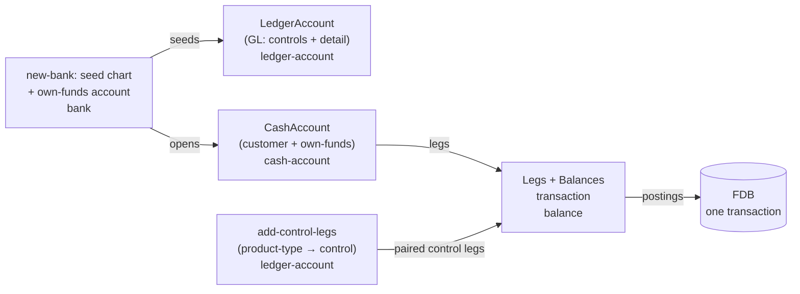

# Chart of accounts

## Objective

A bank keeps its own books. Customer cash-accounts are *what
the bank sells*; they are not *the bank's books*. The bank's
books are a chart of accounts — a structured set of
general-ledger (GL) accounts grouped Asset / Liability /
Equity / Income / Expense — against which every customer
movement, every fee, every interest accrual, every
settlement-clearing event posts as double-entry journals.

Queenswood models the bank's books as a first-class **chart of
accounts** — a per-bank artefact. The `ledger-account`
brick owns the GL account entity (its own FDB record type) and
the canonical seeded template; the **sub-ledger / GL split**
keeps customer cash-accounts as they are while routing their
financial-statement effect to per-product-type control
accounts; and two invariants — double-entry, and sub-ledger ↔
control — are forcing functions that scenario testing proves
on every run. Fees and interest get their symmetric
counter-legs, closing the gap transactions-and-balances calls
out (*"a fee today is one debit leg with no matching credit"*).

In scope: the `ledger-account` brick; the GL account data
model; A/L/E/I/E grouping; per-product-type control accounts
that aggregate the cash-accounts of each product type (customer
deposits and the bank's own funds); the rule that GL leg-sets
must balance per currency; the canonical seeded chart and its
codes; the product-type → control mapping that drives
paired-leg construction; the two scenario-testing invariants
that prove correctness on every run.

Out of scope: tenant-visible reporting surfaces (trial
balance, balance sheet, P&L) — a future PRD/TDD will consume
the GL; financial-period closing (the closing-out journal that
flips accumulated income/expense into retained earnings);
multi-segment / cost-centre GL; export to external accounting
systems; Queenswood-the-platform's own books (SaaS
subscription / usage revenue) — a separate platform-level
concern not exposed in tenant APIs.

## Background

The bank-in-a-box positioning makes the tenant itself a bank.
That tenant needs to see and reconcile **its own** books, not
just its customers' balances. Real core-banking systems are
built around two distinct artefacts:

- A **sub-ledger** — per-customer detail at instrument
  granularity (every customer cash-account, every loan, every
  card). The customer-facing balance lives here.
- A **general ledger** — the bank's own books, organised by
  the chart of accounts (A/L/E/I/E), recording every financial
  effect of every sub-ledger movement and every bank-only
  event (P&L, equity).

The sub-ledger answers *"what does this customer have?"*; the
GL answers *"what does the bank own and owe, and what did it
earn and spend?"*. Both are needed; neither subsumes the
other.

Queenswood realises this split:

- Customer cash-accounts are the **sub-ledger** — per-customer
  detail at instrument granularity. Each carries
  `:balance-sheet-side` and rolls up to a per-product-type
  control account in the GL.
- The **general ledger** is a set of `LedgerAccount` records
  the bank owns, grouped A/L/E/I/E. It records every financial
  effect: the customer-deposit controls, the bank's cash at
  correspondent, interest payable, the bank's own funds, and
  suspense.
- Every customer-side `default` leg generates the paired GL
  control leg that keeps the bank's books balanced — the
  paired-movement discipline `interest`'s capitalisation
  already showed, now applied everywhere through server-side
  paired-leg construction. Fees and interest add their own GL
  counter-legs so the bank's P&L is modelled symmetrically.

## Proposed Solution

### Architecture

GL accounts are their **own record type**, `LedgerAccount`,
owned by the `ledger-account` brick. A `LedgerAccount` is
a flat, bank-owned record — 1:1 with a chart row, created
directly at bank-provisioning time, with no product, no
versioning, and no command/event lifecycle. It is distinct
from a customer `CashAccount`: the GL is the bank's own books,
not something the bank sells.

Cash-accounts are the **sub-ledgers**. Two kinds exist, both
ordinary `CashAccount` records under a `CashAccount(Product)`:

- **Customer cash-accounts** — the instruments the bank sells
  (current / savings / term-deposit), one per customer.
- **The bank's own-funds account** — one per bank per
  currency, held on the bank's own org party. The bank
  pre-funds it and pays customers from inside the bank (see
  "The bank's own funds" below).

Each cash-account rolls up to a GL **control account** via its
`:product-type`. `ledger-account` owns:

- the `new-account` call that creates one `LedgerAccount` plus
  its opening balance (callers loop it over a supplied chart);
- `control-code-for-product-type` — the product-type → control
  `:gl-account-code` role mapping;
- `find-by-code` — resolve a GL account by its role;
- `add-control-legs` — paired-leg construction at posting time,
  following each sub-ledger `default` leg with a
  control-account leg, keyed off the leg's `:product-type`.

The canonical chart **template lives in a `bank`
resource**, and `bank` provisions it: `new-bank` seeds one
`LedgerAccount` per template row per currency and opens the
own-funds cash account.



`transaction` and `balance` treat cash-accounts and
GL accounts uniformly: the account-id space is **shared** — a
`led.` ledger-account-id is just another `account-id`, exactly
like a customer's `acc.` id. The balance-bucket model
`(account-id, balance-type, balance-status, currency)` carries
GL bucket totals exactly as it carries customer bucket totals.
The bricks don't distinguish; this is what keeps a customer leg
and its control-account leg atomic in one posting.

The CoA is **per-bank**. Each tenant defines its own structure
within the fixed A/L/E/I/E top-level grouping. Banks on the
same platform never share a CoA — each one is its own books.

### Five classes and the code convention

Five top-level classes, numbered by convention:

| Range | Class     | Normal side |
|-------|-----------|-------------|
| 1xxx  | Asset     | Debit       |
| 2xxx  | Liability | Credit      |
| 3xxx  | Equity    | Credit      |
| 4xxx  | Income    | Credit      |
| 5xxx  | Expense   | Debit       |

The numbering is **convention, not enforcement** for reporting
and trial-balance ordering. The well-known accounts code
actually relies on, though, carry a typed **role** rather than a
bare number: each is a value of the `GlAccountCode` enum, and the
enum's integer value *is* the chart number
(`GL_ACCOUNT_CODE_SUSPENSE = 2500`). Posting sites resolve an
account by role (`:gl-account-code-suspense`), never by the
literal string — so renumbering the chart can't silently break
posting logic. The number is reconstituted as a string only at
the API/reporting edge (`gl-account-code->gl-code`).

### Data model

A GL account is a `LedgerAccount` record — flat, bank-owned,
one row of the chart:

```protobuf
message LedgerAccount {
  reserved 3;
  reserved "gl_code";                  // replaced by typed gl_account_code
  required string bank_id = 1;
  required string ledger_account_id = 2;   // "led.<uuidv7>"
  required string name = 4;
  required string currency = 5;            // ISO 4217
  required GlAccountType gl_account_type = 6;
                                       // A/L/E/I/E (one of the five classes)
  required GlAccountClass gl_account_class = 7;
                                       // detail, summary, control
  required Required required = 8;          // mandatory, optional
  optional SubLedgerKind sub_ledger_kind = 9;
                                       // only on control accounts
  required int64 created_at = 10;
  required int64 updated_at = 11;
  required GlAccountCode gl_account_code = 12;
                                       // role; enum value = chart number
}
```

Indexed primary key `(bank_id, ledger_account_id)`, with a
`LedgerAccount_by_bank_gl_account_code` index so `find-by-code`
resolves a GL account by its role.

A cash-account (customer or own-funds) is an ordinary
`CashAccount` record; the only field that matters for the GL is
its denormalised `product_type`, which drives the control
fan-out:

```protobuf
message CashAccount {
  required string bank_id = 1;
  required string account_id = 2;          // "acc.<uuidv7>"
  required string party_id = 4;
  required string product_id = 5;
  required string version_id = 6;
  required string currency = 9;
  required string name = 8;
  required CashAccountStatus account_status = 10;
  optional ProductType product_type = 7;   // drives the control mapping
  optional AccountType account_type = 3;    // personal, business
  repeated PaymentAddress payment_addresses = 11;
  optional string bban = 12;
  required int64 created_at = 13;
  required int64 updated_at = 14;
}
```

Notes:

- **GL accounts and cash accounts are separate record types.**
  A `LedgerAccount` carries the GL classification fields
  (`gl_account_code`, `gl_account_type`, `gl_account_class`,
  `required`) directly on the record; there is no product
  behind it. A `CashAccount` carries no GL fields — its
  control is derived from `product_type`.
- **The control link is *not* stored on the cash account.**
  There is no `gl_control_account_id`. A leg carrying a
  sub-ledger `:product-type` is mapped to its control
  `:gl-account-code` (`control-code-for-product-type`) at posting time
  by `add-control-legs`, which resolves the control `LedgerAccount`
  by code. Keying the fan-out off the leg's product-type — not
  a stored pointer — means re-coding the chart needs no
  per-account migration.
- **`product_type`** stays denormalised on cash accounts for
  the existing
  `CashAccount_count_by_bank_product_account_type_currency`
  index, and now distinguishes customer instruments
  (`-current` / `-savings` / `-term-deposit`) from the bank's
  own-funds account (`-own-funds`).
- **`account_type`** (personal / business) is derived from the
  holder party. Customer accounts on a person party are
  personal; the own-funds account on the bank's org party is
  business.
- **`gl_account_class`** distinguishes three roles:
  - `detail` — leaf, accepts legs.
  - `summary` — rolls up children, never receives legs
    directly.
  - `control` — special leaf that aggregates a sub-ledger.
    Detail lives elsewhere (in customer cash-accounts); the
    control account is the GL's single line item for that
    sub-ledger cohort.
- **`sub_ledger_kind`** is an optional discriminator on
  control accounts naming the cohort they aggregate. The
  seeded chart leaves it unset — the sub-ledger → control
  fan-out is driven by `control-code-for-product-type`, which
  maps a leg's `:product-type` to the control `:gl-account-code`
  directly. The field is reserved for finer cohort
  classification (loans, cards) when those instruments land.
- **Normal side** is *derived*, not stored — assets and
  expenses are debit-normal; liabilities, equity, and income
  are credit-normal. Reporting derives at read time.
- **`currency`** lives on the `LedgerAccount` record (one
  currency per account). A multi-currency GL "position"
  (e.g. "all of Interest payable") is computed as the sum
  of per-currency GL accounts under the same gl-account-code role
  or summary parent. There's no shared-currency
  product/account at any layer.

### The seeded standard chart

Every bank starts with a minimal seeded CoA — enough to
support the existing payment and interest flows without manual
setup. The bank can extend it freely; the seeded accounts
cannot be deleted (status flip only).

| Code | Name                              | Type      | Class   |
|------|-----------------------------------|-----------|---------|
| 1100 | Cash at correspondent             | Asset     | Detail  |
| 1200 | Pending outbound payments         | Asset     | Detail  |
| 2100 | Customer deposits — current       | Liability | Control |
| 2200 | Customer deposits — savings       | Liability | Control |
| 2300 | Customer deposits — term deposits | Liability | Control |
| 2400 | Interest payable                  | Liability | Control |
| 2500 | Suspense — unreconciled inbound   | Liability | Detail  |
| 3100 | Bank own funds                    | Equity    | Control |
| 5100 | Interest expense                  | Expense   | Detail  |

Normal side follows from type per the convention table above
(A and E are debit-normal; L, Eq, I are credit-normal).

The five control accounts each aggregate a cohort of
sub-ledger balances: 2100 / 2200 / 2300 hold the customer
current / savings / term-deposit deposits, **2400 aggregates
the customer interest-accrued balances** (interest the bank
owes but has not yet capitalised), and **3100 holds the
bank's own funds** (the own-funds cash account the bank funds
and pays customers from). Cash-accounts of the corresponding
product type roll up to their deposit or own-funds control by
paired leg; 2400 is maintained by the aggregate accrual and
capitalisation postings instead — see "Balance buckets per
account class" below.

Accounts the chart will grow when those flows land — fee
income (4xxx), retained earnings, accrued fees receivable —
are not seeded today; a bank adds them as it needs them.

`1100 — Cash at correspondent` is the bank's own settlement
account at its clearing rail — the ISO 20022
`ExternalCashAccountType1Code` value `SACC` (*"Account used
to post debit and credit entries, as a result of
transactions cleared and settled through a specific clearing
and settlement system"*). For a directly-connected bank, it
is the bank's account at the central-bank RTGS or scheme
operator; for an indirect-access bank, it is the bank's view
of its position with its sponsor — the same position appears
on the sponsor's books as `CPAC` ("clearing participant
account").

A bank participating in more than one scheme adds per-scheme
children — 1101 FPS-SACC, 1102 CHAPS-SACC, and so on — each
typed as a `default/posted` asset detail. The seed creates a
single 1100 by default, sufficient for an FPS-only deployment.

The seeded set is small on purpose. A bank that wants finer
breakdown (per-currency cash-at-correspondent children,
per-business-line expense buckets, multi-tier savings-product
sub-controls) extends the CoA itself.

### Sub-ledger / GL split

Cash-accounts are the **sub-ledger** for the matching control
account. The link is the account's `:product-type`, mapped to
a control `:gl-account-code` by `control-code-for-product-type`:

| Product type           | Control code | Cohort            |
|------------------------|--------------|-------------------|
| current                | 2100         | customer deposits |
| savings                | 2200         | customer deposits |
| term-deposit           | 2300         | customer deposits |
| own-funds              | 3100         | the bank's funds  |

The mapping is a property of the bank's CoA (held by
`ledger-account`'s `control-code-for-product-type`), not
a constant. The fan-out reads the leg's `:product-type` at
posting time and resolves the control account by code — there
is no per-account stored pointer, so re-coding the chart needs
no per-account migration.

### Balance buckets per account class

The bucket model `(balance-type, balance-status, currency)`
applies to every account; what differs by account class is
*which* buckets are maintained.

**Customer cash-accounts** carry a four-bucket layout:

| Balance type        | Statuses                                         |
|---------------------|--------------------------------------------------|
| `default`           | `posted`, `pending-incoming`, `pending-outgoing` |
| `interest-accrued`  | `posted`                                         |

`available-balance` derives the customer-visible spendable
amount by summing buckets per product type — see
[transactions-and-balances.md](transactions-and-balances.md).
The bank's **own-funds cash account** carries a single
`default / posted` bucket — it doesn't earn interest and has no
pending lifecycle; its available balance is just its posted
default.

**The GL control accounts that mirror per leg (2100 / 2200 /
2300 / 3100)** carry the sub-ledger's *default* movements
only:

| Balance type | Statuses                                            |
|--------------|-----------------------------------------------------|
| `default`    | `posted`, `pending-incoming`, `pending-outgoing`    |

Only the `default` balance-type mirrors, and it no longer
mirrors per leg. Customer `interest-accrued` legs do *not*
auto-pair to a control bucket — the bank's side sits on the
2400 interest control and the sub-ledger detail on the
customer side, with no third home on the deposit controls.
This avoids double-counting interest as both
`2100.interest-accrued` and `2400.default`.

Interest's control movements are posted **in aggregate at the
close of a run**, not fanned out per account. Accrual posts DR
5100 / CR 2400 once per currency; capitalisation posts DR 2400
/ CR the deposit control once per currency and product type.
Per-account fan-out made every posting in the bank
read-modify-write the same control rows, which is contention
no account key can spread. See
[interest.md](interest.md).

**Single-bucket GL accounts** (1100, 1200, 2400, 2500) carry
one bucket each:

| Balance type | Statuses |
|--------------|----------|
| `default`    | `posted` |

That list groups accounts by the buckets they maintain, not by
`gl-account-class`: 1100, 1200 and 2500 are detail accounts,
while 2400 is a control account whose postings arrive in
aggregate at the close of a run, so it needs only the one
bucket.

The account's *identity* carries what `balance-type` encodes
on customer and control accounts. Pending semantics are
expressed by separate GL accounts where business value exists
(1200 *Pending outbound payments* is its own asset account,
distinct from 1100 *Cash at correspondent*) rather than by a
pending status on a single account. A bank can add
`pending-incoming` / `pending-outgoing` to a `default`-typed
GL detail account if a real use case appears; the seeded
chart uses posted-only throughout.

The bank's liability to customers for interest is recorded
directly in GL 2400's `default / posted` bucket — there's no
separate `interest-payable` typed bucket on another account.

### The two invariants

Two invariants must hold after every commit. Both are
asserted as `nom-test>` assertions inside
`test-scenarios` and run on every scenario, end-to-end.

**Invariant 1 — Double-entry.** For every transaction whose
leg-set touches a GL account, per currency:

```
Σ debit-amount = Σ credit-amount
```

**Invariant 2 — Sub-ledger ↔ control.** For each deposit or
own-funds control account (2100 / 2200 / 2300 / 3100), per
(balance-status, currency), after every commit:

```
control balance per (default, status, currency)
  =
Σ default balance per (status, currency)
  across every open cash-account whose :product-type
  maps to this control
```

Same-side mirror plus the bucket-per-bucket pairing rule means
this reconciles per status independently — the posted bucket
on 2100 equals the sum of customer posted defaults; the
pending-outgoing bucket on 2100 equals the sum of customer
pending-outgoing defaults; and so on.

A third reconciliation falls out for interest, not enforced as
a hard invariant but asserted in interest-specific scenarios:

```
2400 balance per currency
  =
Σ interest-accrued/posted balance per currency
  across every open customer cash-account
```

Held by the discipline that every accrual posts both
(credit 2400, credit customer interest-accrued) in the same
transaction; broken cleanly by the scenario assertion if the
discipline lapses.

The first invariant is enforced *in the commit path* —
imbalanced GL postings reject before commit. The second is
enforced *by construction* — the leg-recording pipeline
automatically appends the paired control-account leg whenever
a customer cash-account `default` leg is recorded — and
*verified on every scenario* through the `nom-test>`
assertion.

The scenario-testing invariant is the forcing function: any
code change that breaks sub-ledger / control reconciliation
fails every scenario, not just the one that introduced the
bug. See
[scenario-testing.md](scenario-testing.md) for the testing
mechanism the invariant uses.

### Double-entry enforcement

A **GL posting** is a set of legs against accounts (one or
more) such that, for each currency, debits sum to credits.

`transaction-processor`'s `record-transaction` command
is extended with one new check:

- If every leg in the posting targets a customer cash-account
  (no GL legs): existing behaviour — legs aren't checked.
- If any leg targets a GL account (mixed customer+GL or
  GL-only): the full leg-set must balance per currency.
  Imbalanced postings reject with `:gl/imbalanced` before
  commit.

The asymmetry is deliberate. The customer sub-ledger today
works fine without a strict double-entry check; tightening it
would require modelling P&L counter-legs for many flows
that don't have them today, a wide refactor for little gain.
The GL is the bank's own books, where strict balance is the
whole point and the alternative is undetected drift in the
financial statements.

In practice every customer-touching transaction is also a GL
transaction (the paired control leg fires), so every
transaction goes through the strict check. The relaxation
remains as a property of the substrate — neither brick has
hardcoded GL knowledge — rather than as a guarantee the caller
has to think about.

### Paired-leg construction

When a customer cash-account leg is recorded, the pipeline
derives and appends the **paired control-account leg** before
the balance check. The mirror is **same side**, same amount,
same `(balance-type, balance-status, currency)`:

| Customer leg side | Control account leg |
|-------------------|---------------------|
| debit             | debit               |
| credit            | credit              |

A customer cash-account is the sub-ledger *of* the control
account's liability — they represent the same obligation at
different granularities and move in lockstep. The opposite
leg of the GL transaction lives on a *different* account
(typically `1100 Cash at correspondent` for an external
movement, or another control / customer-account for an
internal one); the control and the customer-account never
oppose each other.

Worked example — £100 inbound deposit to a current account:

```
;; sub-ledger leg (not GL-balance-checked)
CREDIT customer-acc default / posted                    100  GBP

;; auto-paired control leg (GL)
CREDIT 2100 Customer deposits — current  default / posted  100  GBP

;; GL-only leg (the opposite side of the journal)
DEBIT  1100 Cash at correspondent         default / posted  100  GBP

;; GL balance check: debit 100 = credit 100 ✓
```

The control account is found by mapping the leg's
`:product-type` to its control `:gl-account-code`
(`control-code-for-product-type`) and resolving that
`LedgerAccount` by code — `ledger-account/add-control-legs`.
Pairing is automatic and server-side; the leg-recording API
accepts the sub-ledger legs (each tagged with its account's
`:product-type`) and the pipeline appends the matching control
legs and validates the combined set balances.

A caller that posts only customer legs (e.g. an internal
transfer between two current-account customers) gets the full
GL posting written transparently — the two paired control
legs net against each other on 2100 and the GL balance check
passes without any GL-only leg. A caller that *also* writes
GL legs writes them in the same call; the pairing combines
naturally — the customer leg's paired control leg is appended,
the GL-only legs join it, and the full set is balance-checked.

Interest is no longer such a caller. Neither of its passes
asks for control legs: accrual writes a balance and no
transaction at all, and capitalisation posts only its two
customer legs. Both post the bank's side as a separate
aggregate entry at the close of the run, against GL accounts
that pair with nothing.

The amount, currency, and balance-status on the control leg
mirror the customer leg one-for-one — but only when the
customer leg's `balance-type` is `default`. Status mirroring
means a pending customer credit shows up as a pending
control-account credit, never a posted one. Legs against
`interest-accrued` on the customer side do *not* auto-pair to
a control bucket — the bank's interest liability sits on GL
2400. See "Balance buckets per account
class" above for the per-class bucket map and the per-bucket
invariant that falls out.

### The bank's own funds

A bank holds its own money, distinct from customer deposits.
That money lives in the bank's **own-funds cash account** — an
ordinary `CashAccount` on the bank's org party, opened at
provisioning under the `own-funds` product, rolling up into the
**3100 Bank own funds** equity control. It is BBAN-addressable
and transactable like any cash account; nothing about it is
special except the control it points at.

The bank is funded from outside, and pays customers from
inside:

- **Money in.** An external inbound lands in `1100 Cash at
  correspondent` (asset up) and credits the own-funds account:

  ```
  DEBIT  1100 Cash at correspondent      default / posted  amount
  CREDIT own-funds cash account          default / posted  amount
  ;; auto-pair: own-funds leg mirrors to its 3100 control
  CREDIT 3100 Bank own funds             default / posted  amount
  ;; GL balance: debit 1100 = credit 3100 ✓
  ```

- **Paying a customer from inside.** A reward, a goodwill
  credit — anything the bank funds itself — is an internal
  transfer from the own-funds account to the customer, no
  external payment however many customers:

  ```
  DEBIT  own-funds cash account          default / posted  amount
  CREDIT customer cash account           default / posted  amount
  ;; auto-pairs: own-funds → 3100, customer → 21x0
  DEBIT  3100 Bank own funds             default / posted  amount
  CREDIT 21x0 Customer deposits — …      default / posted  amount
  ;; GL balance: debit 3100 = credit 21x0 ✓
  ```

Keeping the bank's money in its own GL line (3100 equity)
rather than lumped into a customer-deposit control keeps the
books honest: `1100` (the bank's cash) backs `2100 / 2200 /
2300` (customer deposits) *and* `3100` (the bank's own funds),
and the trial balance reads true.

A customer funding their own account from another bank works
the same way: the external inbound lands in 1100 and credits
the customer's account (fanning to its 2100 / 2200 / 2300
control). Suspense (2500) is reserved for inbounds that can't
be matched to an account.

### Lifecycle

A `LedgerAccount` has no command/event lifecycle. It is
created directly at bank-provisioning time (`seed!` via
`new-account`) and is effectively immutable thereafter — there
is no draft / published distinction, no open / close
transition, and the read-only `/ledger-accounts` API exposes
list / get / balances only. The chart is fixed at the shape
the bank was seeded with.

Account close-out (posting a clearing entry, then retiring a
GL account once its balance is zero) is future work — see
"Known Limitations". When it lands, the natural shape is a
two-state Open → Closed transition with a non-zero-balance
guard on close.

### Currency

A `-detail` or `-control` GL account is single-currency.
Multi-currency positions live as a `-summary` parent with
per-currency children:

```
2400   Interest payable                 (summary, no currency)
├ 2400-GBP  Interest payable — GBP     (control, currency GBP)
└ 2400-USD  Interest payable — USD     (control, currency USD)
```

The paired-leg pipeline routes a posting in currency X to the
matching X-denominated control account child. A bank that
hasn't (yet) added a child for a currency a customer leg
arrives in rejects with `:gl/missing-currency-account`.

### ISO 20022 cash-account-type classification

ISO 20022 defines `ExternalCashAccountType1Code` — a
free-list of four-character codes classifying cash accounts
for inclusion in payment messages (`pacs.008`, `pain.001`,
`camt.053`, and others). The codes describe *what kind of
account this is for payment-rail purposes*, not what it is
on the bank's GL. Customer cash-accounts and the bank's own
1100 are both addressable by this code set, in different
roles.

Customer cash-accounts carry an `:iso-cash-account-type`
field, defaulted from `:product-type` at open time and
override-able for sub-flavours the product-type doesn't
distinguish:

| Product type   | Default ISO code |
|----------------|------------------|
| `current`      | `CACC`           |
| `savings`      | `SVGS`           |
| `term-deposit` | `LLSV`           |

Overrides worth noting: `current` → `TRAN` for a basic
transacting variant (no overdraft, no chequebook);
`savings` → `LLSV` for savings with special interest or
withdrawal terms. The `term-deposit` → `LLSV` default is the
closest standard code — `LLSV` is "savings with special
interest and withdrawal terms", which includes term deposits
but isn't specific to them.

The field is read when emitting outbound ISO 20022 messages
that reference customer accounts. It's not read by the GL —
the chart of accounts is the bank's internal books and
doesn't see ISO codes; the codes are wire-format
classifiers.

The bank's own GL 1100 *Cash at correspondent* is the
`SACC` ("settlement account") in this classification, and
its per-scheme children carry the same `SACC` code (one per
scheme). 1100 is not stored as a customer cash-account so it
doesn't carry the `:iso-cash-account-type` field — it's a GL
account, and its ISO classification follows from its role,
not from a stored attribute.

Out of scope for v1: lending products (`LOAN`, `MGLD`),
overdrafts (`ODFT`), physical cash (`CASH`), tax/charge
sub-accounts (`TAXE`, `CHAR`), virtual accounts (`VACC`).
Each adds its own product-type when Queenswood grows into
that capability; the `:iso-cash-account-type` derivation
table extends naturally.

### Bricks involved

- **`ledger-account`** owns the `LedgerAccount` record
  type and the GL surface: `new-account` (create one GL account
  plus its opening balance), `find-by-code`, `get-account`,
  `list-accounts`, `control-code-for-product-type`, and
  `add-control-legs` (paired-leg fan-out, keyed on a leg's
  `:product-type`).
- **`bank`** holds the canonical chart template in a
  resource; `new-bank` seeds one `LedgerAccount` per row per
  currency and opens the own-funds cash account on the bank's
  org party.
- **`cash-account` / `cash-account-product`** carry
  the customer and own-funds cash-accounts. The own-funds
  product (`:product-type-sub-ledger-own-funds`) maps to
  control 3100; customer products map to 2100 / 2200 / 2300.
- **`payment` / `interest`** resolve GL accounts via
  `ledger-account/find-by-code`, tag their customer legs
  with `:product-type`, and fan out via `add-control-legs`.
- **`transaction` / `balance`** record legs and
  maintain bucket balances uniformly across cash (`acc.`) and
  ledger (`led.`) account-ids; the combined leg-set is
  balance-checked when any GL leg is present.
- **`schema`** defines the `LedgerAccount` message and the
  `GlAccountType` / `GlAccountClass` / `Required` /
  `SubLedgerKind` / `GlAccountCode` enums, the `LedgerAccount`
  entry in `RecordTypeUnion`, and the
  `LedgerAccount_by_bank_gl_account_code` index. `ProductType`
  carries the sub-ledger values `-current` / `-savings` /
  `-term-deposit` / `-own-funds` plus `-general-ledger`.
- **`api`** exposes a read-only `/ledger-accounts` surface
  (list / get / balances); transaction-leg responses accept a
  cash-account *or* a ledger-account id (the shared id space).
- **`test-scenarios`** runs the two invariants —
  double-entry and sub-ledger ↔ control — as `nom-test>`
  assertions on every scenario.

### Policy integration

GL accounts are bank-owned and seeded at provisioning, not
customer-authored, and the `/ledger-accounts` surface is
read-only — so there is no posting or authoring capability gate
on them today.

When CoA authoring lands (adding, re-coding, or closing GL
accounts — see "Known Limitations"), it would arrive as a new
`:gl-account` capability kind with `-create` / `-update` /
`-close` actions, gating who may edit the chart, plus a
per-account posting filter on `:balance` so a policy could
restrict who posts to a given account. Count limits per bank
fall out of the same `:aggregate :count` mechanism the product
brick uses.

### Caller contract

A caller that posts a customer-side transaction:

1. Builds customer legs, each tagged with its account's
   `:product-type`.
2. Calls `transaction/record-transaction` with those
   legs.
3. The pipeline appends the paired control legs server-side
   (mapping each leg's `:product-type` to its control account).
4. The combined leg-set is checked for GL balance and
   committed.

A caller that posts a GL-only transaction (interest expense
recognition, end-of-day fee-income capture, opening journal):

1. Builds GL legs spanning accounts whose
   `Σ debits = Σ credits` per currency.
2. Calls `transaction/record-transaction`.
3. The pipeline does not append paired legs (no customer leg
   to pair); the balance check fires directly.

A caller that posts a mixed transaction (an interest accrual
that touches a customer accrued bucket and two GL accounts):

1. Builds both the customer leg(s) and the GL-only legs.
2. Calls `transaction/record-transaction`.
3. The pipeline appends paired control legs for the customer
   side, combines with the GL-only legs, balances per
   currency, commits.

## Alternatives Considered

- **Unified ledger — customer cash-accounts ARE GL
  accounts.** No sub-ledger / GL split; every customer
  account sits directly in the chart as a leaf liability.
  Rejected — couples the bank's accounting structure to its
  customer-account shape; restructuring the chart (cost
  centres, segments) would force restructuring per-customer;
  the GL would have one leaf per customer (huge fan-out at
  the top of the chart); reporting "all customer deposits"
  becomes a tree walk rather than a single balance read. The
  sub-ledger / GL split is the standard core-banking pattern
  for good reason — it keeps the bank's books at
  financial-statement granularity and pushes per-customer
  detail down to the instrument layer.
- **Single combined customer-deposits control account.** One
  control (`2010 Customer deposits`) for every customer
  cash-account regardless of product type. Considered —
  cleaner reconciliation; the sub-ledger sums once. Rejected
  — the financial statements want to see current accounts,
  savings accounts, and term deposits as separate line items
  (they're different obligations with different liquidity
  characteristics). Per-product-type controls produce that
  view without a downstream split.
- **Bank-wide single CoA.** One chart shared across every
  bank on the platform. Rejected — each bank is its own legal
  entity with its own accountants; forcing a shared structure
  would impose one bank's choices on all tenants. Per-bank
  CoA is the minimum a multi-tenant banking platform can
  offer.
- **Strict double-entry on the customer sub-ledger too.**
  Reject any customer-side transaction whose legs don't
  balance. Considered — but would require modelling P&L
  counter-legs for every fee, every reversal as a refactor
  the sub-ledger doesn't otherwise need. The cleaner answer
  is to introduce the GL, which forces the symmetric
  modelling at the right boundary; once paired-leg
  construction is wired, every customer movement participates
  in a balanced GL posting and the sub-ledger relaxation
  becomes a non-issue in practice.
- **GL as a derived view, not a stored ledger.** Compute the
  bank's books at query time from customer-account aggregates
  plus product `:balance-sheet-side`. Rejected — works for
  the trivial invariants but cannot represent income,
  expense, or equity movements (no customer leg produces
  them); cannot enforce double-entry; cannot model cost
  centres or segments; cannot support the bank reconciling
  its own books against external accounting. The GL must be
  a stored, authoritative ledger of its own.
- **Chart of accounts as configuration (EDN files), not
  records.** Like the existing per-product-type seed EDNs.
  Rejected — the CoA is a per-bank business-configurable
  artefact; the bank's accountant must be able to add a cost
  centre without a code change. EDN seeds the canonical
  template; the live chart lives in the record store.
- **Caller-supplied paired legs.** Make the caller write both
  the customer leg and its control-account counter-leg
  explicitly. Rejected — pure ceremony, and a fertile source
  of subtle drift bugs where one half lands and the other
  doesn't. Server-side construction is the only way to
  guarantee the sub-ledger / control invariant by
  construction.
- **GL accounts as a `oneof kind` on `CashAccountProduct`,
  spawning a `CashAccount` per GL row.** An intermediate design
  (PR #137): a GL account was a product of
  `kind :general-ledger` plus the one `CashAccount` it spawned,
  so cash and GL accounts shared a single record type and a
  single `get-account` lookup path. Superseded — a GL account
  isn't a product the bank sells, and dressing one up as a
  `CashAccount` under a product meant carrying two disjoint
  optional field sets and guard-reading `gl_code` presence at
  every site. GL accounts are now their **own `LedgerAccount`
  record type** in `ledger-account`: the schema is honest,
  the GL surface is small and read-only, and the shared
  *account-id space* keeps the single-lookup benefit at the leg
  layer without forcing GL accounts to masquerade as cash
  accounts. The earliest form — GL discriminator fields
  directly on `CashAccount` (PR #134) — surfaced the same
  pressure and was the first thing to go.
- **Model the bank's own funds inside a customer-deposit
  control (e.g. a "business current" account rolling into
  2100).** Considered — no new GL line, no new product-type.
  Rejected — the bank's own money isn't a customer deposit;
  lumping it into 2100 overstates customer liabilities and the
  trial balance stops reading true. Its own `3100` equity
  control keeps assets (`1100`), customer liabilities
  (`2100/2200/2300`), and the bank's own funds (`3100`) cleanly
  separable — the one new product-type and GL row earn their
  keep.
- **Inherit an industry-standard taxonomy by default**
  (FRS 102, IFRS, regulator-specific reporting schemas).
  Considered. Out of scope for v1 — the seeded chart is
  intentionally minimal. A future taxonomy-mapping brick
  could attach standard codes to a bank's GL accounts for
  regulatory-report production without forcing the bank to
  adopt the taxonomy as its primary structure.

## Known Limitations

- **No reporting surfaces.** Trial balance, balance sheet,
  and P&L are not part of this TDD — they're future PRDs and
  TDDs that consume the GL. The chart and its postings are
  correct; presentation is separate work.
- **No financial-period closing.** Closing the books at
  month-end or year-end — posting accumulated income and
  expense into retained earnings, zeroing those accounts for
  the next period — is not modelled. A future closing brick
  would post the standard closing-out journal.
- **No reversal helper for GL postings.** Same gap as
  transactions-and-balances; reversal is "write a new
  transaction with mirrored legs" by hand. The pattern is
  straightforward but unpackaged.
- **No multi-segment / cost-centre dimension.** The GL has
  one hierarchy. Banks that want to slice their books across
  multiple independent dimensions (product line, geography,
  legal entity) need a multi-dimensional GL — out of scope.
- **No external GL feed.** A bank running a parallel
  accounting system (Sage, Xero, NetSuite) and wanting the
  platform's GL to mirror to it has no built-in export. A
  changelog relay publishing GL postings to an export topic
  would be the shape; out of scope for v1.
- **No regulatory taxonomy mapping.** The five top-level
  classes follow FRS 102's element definitions (asset /
  liability / equity / income / expense), but the chart is
  otherwise entity-specific — neither FRS 102 nor any
  standard prescribes a CoA. Mapping to the statutory
  banking statement format (liquidity-ordered, per the Bank
  Accounts Directive lineage) and to FINREP for prudential
  reporting is left to the bank.
- **Code convention isn't enforced.** A bank can code a
  liability as 5500 or an income as 1000; the system stores
  whatever it's given. Reporting that orders by code will
  produce a confusing view in that case. Worth a soft
  validation (warn if code's leading digit disagrees with
  account-type) before v1 graduates.
- **No CoA authoring or close-out.** The chart is fixed at the
  seeded shape: `LedgerAccount`s are immutable and can't be
  added, re-coded, or closed through the API. Extending the
  chart (cost centres, per-scheme `1100` children), re-coding,
  versioning ("what a code meant" at posting time), and account
  close-out are all future work.
- **Interest-accrued has no per-leg control mirror by
  design.** The bank's interest payable lives on the 2400
  control, posted in aggregate at the close of a run rather
  than paired leg by leg; the sub-ledger ↔ control invariant
  is restricted to the `default` balance-type. The interest
  reconciliation (Σ customer interest-accrued = 2400 balance)
  is a separate scenario-test assertion, not a hard
  commit-path check.
- **Indirect-access (`CPAC`) modelling is single-sided.** A
  bank using sponsor access sees its 1100 position as its
  own `SACC` view of what the sponsor holds for it; the
  sponsor's books carry the matching `CPAC` position. Today
  Queenswood models only the bank-side view (1100); the
  sponsor's reconciliation file would be ingested as a
  reconciliation feed, not as a mirrored GL account. A
  future sponsor-integration design would formalise this.
- **`:iso-cash-account-type` defaults are best-effort.** The
  `term-deposit` → `LLSV` mapping is the closest standard
  code but not exact — `LLSV` is "savings with special
  interest and withdrawal terms", which includes term
  deposits but isn't specific to them. Banks integrating
  with counterparties that require a more precise
  classification can override at open time; future ISO 20022
  releases may add a more specific code.
- **No `:iso-cash-account-type` for GL accounts.** The bank's
  GL 1100 is conceptually `SACC` but doesn't carry the field
  — the ISO classification is derived from its role at
  message-emission time. Mixed-purpose GL accounts (rare in
  the seeded chart) would need explicit classification when
  they appear on the wire.
- **Suspense workflow isn't designed.** Suspense as a GL
  account (2500) is straightforward; the workflow for items
  landing there (review queue, resolution rules, posting
  out) is left to a separate TDD.
- **Capitalisation cadence stays operator-driven.** The GL
  posting shape doesn't constrain the operator's freedom to
  choose cadence — see [interest.md](interest.md). A
  daily-capitalisation bank produces daily GL postings; a
  monthly-capitalisation bank produces monthly.
- **GL account `:code` uniqueness is per bank only.** Two
  banks can both have a `2100` — they mean different things.
  Cross-bank reporting (a platform-wide view) would need a
  bank-prefix on display.
- **The canonical template is opinionated.** Banks wanting
  a different starting structure must extend or close-and-
  recreate seeded accounts. A "blank-chart bank with no
  seed" mode would be a useful escape hatch and isn't
  modelled.
- **Queenswood-the-platform's own books are out of scope.**
  Each tenant bank owns its CoA. The platform's own SaaS
  revenue, infrastructure costs, and internal P&L live in a
  separate concern not exposed via tenant APIs and not
  covered here.

## References

- [ADR-0002](../adr/0002-foundationdb-record-layer.md) —
  FoundationDB Record Layer (GL account storage and indices)
- [ADR-0005](../adr/0005-error-handling-with-anomalies.md) —
  Error handling with anomalies (`:gl/imbalanced`,
  `:gl/non-zero-on-close`, `:gl/missing-currency-account`)
- [ADR-0021](../adr/0021-changelog-relay.md) — the changelog
  relay (the pattern that GL-export feeds would consume,
  if added)
- [transactions-and-balances.md](transactions-and-balances.md)
  — Transactions and balances (the leg substrate this TDD
  extends with the GL balance check; the "double-entry by
  discipline" note this TDD tightens for GL)
- [cash-accounts.md](cash-accounts.md) — Cash accounts (the
  sub-ledger; the `:product-type` that drives each account's
  control fan-out, and the own-funds cash account)
- [cash-account-products.md](cash-account-products.md) —
  Cash account products (the sub-ledger products — customer
  current / savings / term-deposit and the bank's own-funds
  product)
- [interest.md](interest.md) — Interest accrual (the accrual
  and capitalisation postings that book the bank's interest
  liability on the 2400 ledger account)
- [payments.md](payments.md) — Payments (inbound settlement
  landing on 1100, pending-outbound asset position 1200)
- [policy-evaluation.md](policy-evaluation.md) — Policy
  evaluation (future capability checks on CoA authoring and
  per-account posting restrictions)
- [scenario-testing.md](scenario-testing.md) — Scenario
  testing (the framework for the two invariants asserted via
  `nom-test>`)
- [processor-bricks.md](processor-bricks.md) — Processor
  brick conventions (relevant if a future processor variant
  emerges)
- [ISO 20022 external codes](https://www.iso20022.org/external-code-lists) —
  Source for `ExternalCashAccountType1Code`
  (`CACC`, `SVGS`, `LLSV`, `TRAN`, `SACC`, `CPAC`, etc.),
  maintained by the ISO 20022 Registration Authority and
  republished periodically
- `ledger-account` brick interface (the `LedgerAccount`
  record type, `find-by-code`, `add-control-legs`,
  `control-code-for-product-type`)
- `transaction` / `balance` brick interfaces (the
  leg + bucket substrate, shared across cash and ledger ids)
- `bank` brick interface (chart seeding and own-funds
  account at provisioning)
- `cash-account` / `cash-account-product` brick
  interfaces (the sub-ledger; the `own-funds` product)
- `schema` brick (the `LedgerAccount` proto message and
  GL enums)
- `test-scenarios` brick (invariant assertions)
