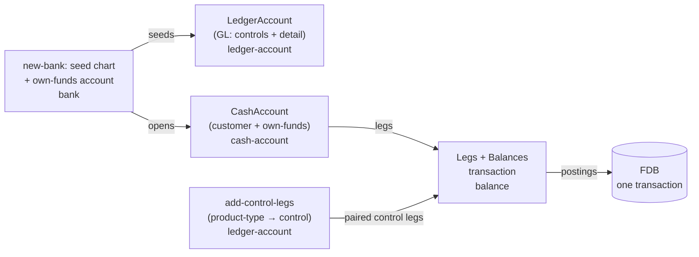

# Chart of accounts

## Objective

A bank keeps its own books. Customer cash-accounts are *what
the bank sells*; they are not *the bank's books*. The bank's
books are a chart of accounts — a structured set of
general-ledger (GL) accounts grouped Asset / Liability /
Equity / Income / Expense — against which every customer
movement, every fee, every interest accrual, every
settlement-clearing event posts as double-entry journals.

Queenswood models the bank's books as a first-class **chart of
accounts** — a per-bank artefact. The `ledger-account`
brick owns the GL account entity (its own FDB record type) and
the canonical seeded template; the **sub-ledger / GL split**
keeps customer cash-accounts as they are while routing their
financial-statement effect to per-product-type control
accounts; and two invariants — the trial balance ties, and
each control holds its sub-ledger's roll-up — are forcing
functions the scenario runners prove after every step. Fees and
interest get their symmetric counter-legs, closing the gap
transactions-and-balances calls out (*"a fee today is one debit
leg with no matching credit"*).

In scope: the `ledger-account` brick; the GL account data
model; A/L/E/I/E grouping; per-product-type control accounts
that aggregate the cash-accounts of each product type (customer
deposits and the bank's own funds); the rule that GL leg-sets
must balance per currency; the canonical seeded chart and its
codes; the product-type → control mapping that drives
paired-leg construction; the per-currency trial balance the
chart's list route returns; the two scenario-testing invariants
that prove correctness on every run.

Out of scope: the balance sheet and the P&L — a future PRD/TDD
will consume the GL; financial-period closing (the closing-out
journal that flips accumulated income/expense into retained
earnings); multi-segment / cost-centre GL; export to external
accounting systems; Queenswood-the-platform's own books (SaaS
subscription / usage revenue) — a separate platform-level
concern not exposed in tenant APIs.

## Background

The bank-in-a-box positioning makes the tenant itself a bank.
That tenant needs to see and reconcile **its own** books, not
just its customers' balances. Real core-banking systems are
built around two distinct artefacts:

- A **sub-ledger** — per-customer detail at instrument
  granularity (every customer cash-account, every loan, every
  card). The customer-facing balance lives here.
- A **general ledger** — the bank's own books, organised by
  the chart of accounts (A/L/E/I/E), recording every financial
  effect of every sub-ledger movement and every bank-only
  event (P&L, equity).

The sub-ledger answers *"what does this customer have?"*; the
GL answers *"what does the bank own and owe, and what did it
earn and spend?"*. Both are needed; neither subsumes the
other.

Queenswood realises this split:

- Customer cash-accounts are the **sub-ledger** — per-customer
  detail at instrument granularity. Each carries
  `:balance-sheet-side` and rolls up to a per-product-type
  control account in the GL.
- The **general ledger** is a set of `LedgerAccount` records
  the bank owns, grouped A/L/E/I/E. It records every financial
  effect: the customer-deposit controls, the bank's cash at
  correspondent, interest payable, the bank's own funds, and
  suspense.
- Every customer-side `default` leg generates the paired GL
  control leg that keeps the bank's books balanced — the
  paired-movement discipline `interest`'s capitalisation
  already showed, now applied everywhere through server-side
  paired-leg construction. Fees and interest add their own GL
  counter-legs so the bank's P&L is modelled symmetrically.

## Proposed Solution

### Architecture

GL accounts are their **own record type**, `LedgerAccount`,
owned by the `ledger-account` brick. A `LedgerAccount` is
a flat, bank-owned record — 1:1 with a chart row, created
directly at bank-provisioning time, with no product, no
versioning, and no command or event lifecycle. It is distinct
from a customer `CashAccount`: the GL is the bank's own books,
not something the bank sells.

Cash-accounts are the **sub-ledgers**. Two kinds exist, both
ordinary `CashAccount` records under a `CashAccount(Product)`:

- **Customer cash-accounts** — the instruments the bank sells
  (current / savings / term-deposit), one per customer.
- **The bank's own-funds account** — one per bank per
  currency, held on the bank's own org party. The bank
  pre-funds it and pays customers from inside the bank (see
  "The bank's own funds" below).

Each cash-account rolls up to a GL **control account** via its
`:product-type`. `ledger-account` owns:

- the `new-account` call that creates one `LedgerAccount` plus
  its opening balance (callers loop it over a supplied chart);
- `product-type->control-code` — the product-type → control
  `:gl-account-code` role mapping;
- `find-by-code` — resolve a GL account by its role and
  currency;
- `add-control-legs` — paired-leg construction at posting time,
  following each posted default sub-ledger leg with a
  control-account leg, keyed off the leg's `:product-type`.

The canonical chart **template lives in a `bank`
resource**, and `bank` provisions it: `new-bank` seeds one
`LedgerAccount` per template row per currency and opens the
own-funds cash account.



`transaction` and `balance` treat cash-accounts and
GL accounts uniformly: the account-id space is **shared** — a
`led.` ledger-account-id is just another `account-id`, exactly
like a customer's `acc.` id. The balance-bucket model
`(account-id, balance-type, balance-status, currency)` carries
GL bucket totals exactly as it carries customer bucket totals.
The bricks don't distinguish; this is what keeps a customer leg
and its control-account leg atomic in one posting.

The CoA is **per-bank**. Each tenant defines its own structure
within the fixed A/L/E/I/E top-level grouping. Banks on the
same platform never share a CoA — each one is its own books.

### Five classes and the code convention

Five top-level classes, numbered by convention:

| Range | Class     | Normal side |
|-------|-----------|-------------|
| 1xxx  | Asset     | Debit       |
| 2xxx  | Liability | Credit      |
| 3xxx  | Equity    | Credit      |
| 4xxx  | Income    | Credit      |
| 5xxx  | Expense   | Debit       |

The numbering is **convention, not enforcement** for reporting
and trial-balance ordering. The well-known accounts code
actually relies on, though, carry a typed **role** rather than a
bare number: each is a value of the `GlAccountCode` enum, and the
enum's integer value *is* the chart number
(`GL_ACCOUNT_CODE_SUSPENSE = 2500`). Posting sites resolve an
account by role (`:gl-account-code-suspense`), never by the
literal string — so renumbering the chart can't silently break
posting logic. The number is reconstituted as a string only at
the API/reporting edge (`gl-account-code->gl-code`).

### Data model

A GL account is a `LedgerAccount` record — flat, bank-owned,
one row of the chart:

```protobuf
message LedgerAccount {
  reserved 3;
  reserved "gl_code";                  // replaced by typed gl_account_code
  required string bank_id = 1;
  required string ledger_account_id = 2;   // "led.<uuidv7>"
  required string name = 4;
  required string currency = 5;            // ISO 4217
  required GlAccountType gl_account_type = 6;
                                       // A/L/E/I/E (one of the five classes)
  required GlAccountClass gl_account_class = 7;
                                       // detail, summary, control
  required Required required = 8;          // mandatory, optional
  optional SubLedgerKind sub_ledger_kind = 9;
                                       // only on control accounts
  required int64 created_at = 10;
  required int64 updated_at = 11;
  required GlAccountCode gl_account_code = 12;
                                       // role; enum value = chart number
  optional LedgerAccountStatus status = 13;
                                       // open or closed; unset reads as open
}
```

Indexed primary key `(bank_id, ledger_account_id)`, with a
`LedgerAccount_by_bank_gl_account_code` index so `find-by-code`
resolves a GL account by its role.

A cash-account (customer or own-funds) is an ordinary
`CashAccount` record; the only field that matters for the GL is
its denormalised `product_type`, which drives the control
fan-out:

```protobuf
message CashAccount {
  required string bank_id = 1;
  required string account_id = 2;          // "acc.<uuidv7>"
  required string party_id = 4;
  required string product_id = 5;
  required string version_id = 6;
  required string currency = 9;
  required string name = 8;
  required CashAccountStatus account_status = 10;
  optional ProductType product_type = 7;   // drives the control mapping
  optional AccountType account_type = 3;    // personal, business
  repeated PaymentAddress payment_addresses = 11;
  optional string bban = 12;
  required int64 created_at = 13;
  required int64 updated_at = 14;
}
```

Notes:

- **GL accounts and cash accounts are separate record types.**
  A `LedgerAccount` carries the GL classification fields
  (`gl_account_code`, `gl_account_type`, `gl_account_class`,
  `required`) directly on the record; there is no product
  behind it. A `CashAccount` carries no GL fields — its
  control is derived from `product_type`.
- **The control link is *not* stored on the cash account.**
  There is no `gl_control_account_id`. A leg carrying a
  sub-ledger `:product-type` is mapped to its control
  `:gl-account-code` by `add-control-legs`, which resolves the
  control `LedgerAccount` by that role and the transaction's
  currency. Keying the fan-out off the leg's product-type — not
  a stored pointer — means re-coding the chart needs no
  per-account migration.
- **`product_type`** stays denormalised on cash accounts for
  the existing
  `CashAccount_count_by_bank_product_account_type_currency`
  index, and now distinguishes customer instruments
  (`-current` / `-savings` / `-term-deposit`) from the bank's
  own-funds account (`-own-funds`).
- **`account_type`** (personal / business) is derived from the
  holder party. Customer accounts on a person party are
  personal; the own-funds account on the bank's org party is
  business.
- **`gl_account_class`** distinguishes three roles:
  - `detail` — leaf, accepts legs.
  - `summary` — rolls up children, never receives legs
    directly.
  - `control` — special leaf that aggregates a sub-ledger.
    Detail lives elsewhere (in customer cash-accounts); the
    control account is the GL's single line item for that
    sub-ledger cohort.
- **`sub_ledger_kind`** is an optional discriminator on
  control accounts naming the cohort they aggregate. The
  seeded chart leaves it unset — the sub-ledger → control
  fan-out is driven by `product-type->control-code`, which
  maps a leg's `:product-type` to the control `:gl-account-code`
  directly. The field is reserved for finer cohort
  classification (loans, cards) when those instruments land.
- **Normal side** is *derived*, not stored — assets and
  expenses are debit-normal; liabilities, equity, and income
  are credit-normal. Reporting derives at read time.
- **`currency`** lives on the `LedgerAccount` record, one
  currency per account — see "Currency" below for the flat
  per-currency chart that follows from it.

### The seeded standard chart

Every bank starts with a minimal seeded CoA — enough to
support the existing payment and interest flows without manual
setup. The bank can extend it freely; the seeded accounts
cannot be deleted (status flip only).

| Code | Name                              | Type      | Class   |
|------|-----------------------------------|-----------|---------|
| 1100 | Cash at correspondent             | Asset     | Detail  |
| 1200 | Pending outbound payments         | Asset     | Detail  |
| 2100 | Customer deposits — current       | Liability | Control |
| 2200 | Customer deposits — savings       | Liability | Control |
| 2300 | Customer deposits — term deposits | Liability | Control |
| 2400 | Interest payable                  | Liability | Control |
| 2500 | Suspense — unreconciled inbound   | Liability | Detail  |
| 3100 | Bank own funds                    | Equity    | Control |
| 5100 | Interest expense                  | Expense   | Detail  |

Normal side follows from type per the convention table above
(A and E are debit-normal; L, Eq, I are credit-normal).

The five control accounts each aggregate a cohort of
sub-ledger balances: 2100 / 2200 / 2300 hold the customer
current / savings / term-deposit deposits, **2400 aggregates
the customer interest-accrued balances** (interest the bank
owes but has not yet capitalised), and **3100 holds the
bank's own funds** (the own-funds cash account the bank funds
and pays customers from). Cash-accounts of the corresponding
product type roll up to their deposit or own-funds control by
paired leg; 2400 is maintained by the aggregate accrual and
capitalisation postings instead — see "Balance buckets per
account class" below.

Accounts the chart will grow when those flows land — fee
income (4xxx), retained earnings, accrued fees receivable —
are not seeded today; a bank adds them as it needs them.

`1100 — Cash at correspondent` is the bank's own settlement
account at its clearing rail. For a directly-connected bank it
is the bank's account at the central-bank RTGS or scheme
operator; for an indirect-access bank it is the bank's view of
its position with its sponsor, the same position the sponsor's
own books carry as a `CPAC` clearing-participant account. The
ISO 20022 classification of an account is a product field rather
than a chart one — see
[cash-account-products.md](cash-account-products.md).

A bank participating in more than one scheme adds per-scheme
children — 1101 FPS, 1102 CHAPS, and so on — each typed as a
`default/posted` asset detail. The seed creates a single 1100 by
default, sufficient for an FPS-only deployment.

The seeded set is small on purpose. A bank that wants finer
breakdown (per-currency cash-at-correspondent children,
per-business-line expense buckets, multi-tier savings-product
sub-controls) extends the CoA itself.

### Sub-ledger / GL split

Cash-accounts are the **sub-ledger** for the matching control
account. The link is the account's `:product-type`, mapped to
a control `:gl-account-code` by `product-type->control-code`:

| Product type           | Control code | Cohort            |
|------------------------|--------------|-------------------|
| current                | 2100         | customer deposits |
| savings                | 2200         | customer deposits |
| term-deposit           | 2300         | customer deposits |
| own-funds              | 3100         | the bank's funds  |

The mapping is a property of the bank's CoA (held by
`ledger-account`'s `product-type->control-code`), not
a constant. The fan-out reads the leg's `:product-type` at
posting time and resolves the control account by code — there
is no per-account stored pointer, so re-coding the chart needs
no per-account migration.

### Balance buckets per account class

The bucket model `(balance-type, balance-status, currency)`
applies to every account; what differs by account class is
*which* buckets are maintained. A bucket is opened by the first
leg that names its `(balance-type, balance-status)` pair — the
`balance` brick's `new-zero-balance` creates it and then applies
the leg — so what an account carries is what its postings have
reached, not a fixed allocation. A leg with no `:product-type`
is a GL leg, and the bucket it opens is tagged
`:product-type-general-ledger`.

**Customer cash-accounts** carry a four-bucket layout:

| Balance type        | Statuses                                         |
|---------------------|--------------------------------------------------|
| `default`           | `posted`, `pending-incoming`, `pending-outgoing` |
| `interest-accrued`  | `posted`                                         |

`available-balance` derives the customer-visible spendable
amount by summing buckets per product type — see
[transactions-and-balances.md](transactions-and-balances.md).
The bank's **own-funds cash account** carries a single
`default / posted` bucket — it doesn't earn interest and has no
pending lifecycle; its available balance is just its posted
default.

**Every GL account but one** carries a single bucket:

| Balance type | Statuses |
|--------------|----------|
| `default`    | `posted` |

The deposit and own-funds controls (2100 / 2200 / 2300 / 3100)
need no more because the mirror is posted-only: a customer leg
in `pending-incoming` or `pending-outgoing` stays in the
sub-ledger, and the control moves when the payment posts.
Customer `interest-accrued` legs do not auto-pair either — the
bank's side sits on 2400, so interest is never counted as both
`2100.interest-accrued` and `2400.default`. 2400 is a control
too, but its postings arrive in aggregate at the close of a run
rather than leg by leg, which spares every posting in the bank a
read-modify-write of the same control rows — contention no
account key can spread. See [interest.md](interest.md). 1100,
2500 and 5100 are detail accounts, posted to directly.

**1200 Pending outbound payments** is the exception, and carries
two on any bank that has sent a payment:

| Balance type | Statuses                     |
|--------------|------------------------------|
| `default`    | `posted`, `pending-outgoing` |

The outbound reservation credits 1200's `pending-outgoing`
bucket when it reserves the customer's funds, and the settlement
debits it when the money leaves for the scheme — a reversal
debits it instead, releasing the reservation. Nothing writes
1200's posted bucket, which the seed opens at zero. See
[payments.md](payments.md).

The account's *identity* carries what `balance-type` encodes
on customer and control accounts. Pending semantics are
expressed by separate GL accounts where business value exists
(1200 *Pending outbound payments* is its own asset account,
distinct from 1100 *Cash at correspondent*) rather than by a
pending status on a single account.

The bank's liability to customers for interest is recorded
directly in GL 2400's `default / posted` bucket — there's no
separate `interest-payable` typed bucket on another account.

### The two invariants

Two invariants hold over the bank's books, and both scenario
runners assert both after every step. They are
`clojure.test/is` assertions inside the runner, not `nom-test>`
assertions — `nom-test>` says a value is not an anomaly, which
is a different claim from the books tying.

**Invariant 1 — the trial balance ties.** Per currency, across
the whole chart:

```
Σ debit = Σ credit
```

**Invariant 2 — sub-ledger ↔ control.** For each deposit or
own-funds control account (2100 / 2200 / 2300 / 3100), per
currency, at `:balance-status-posted` alone:

```
control's default / posted balance
  =
Σ default / posted balance
  across every cash-account whose :product-type
  maps to this control
```

The second is restricted to posted because the mirror is: an
in-flight bucket has no control side to reconcile against.

Neither invariant subsumes the other. A posting that debits one currency's
1100 and credits the same currency's 3100 ties even when it was
meant for another currency's rows; only the reconciliation,
which compares each control against its own sub-ledger, catches
the mis-routing. A posting whose offset never reached the GL at
all breaks the tie while leaving every control reconciled.

`test-scenarios/invariants.clj` reads both sides out of a single
`fdb/transact` snapshot, so a settlement committing mid-read
cannot tear them apart. `test-api-scenarios/invariants.clj`
reads the same two facts off the wire, for every bank the run
holds a token for: the per-currency `:trial-balance` block and
each control's `:posted-balance` from `GET /v1/ledger-accounts`,
the sub-ledger from a cursor-paged walk of
`GET /v1/cash-accounts?embed=balances`. That runner holds no FDB
config, and a bank whose token cannot be minted is logged and
listed under its `:skipped-banks` rather than left silently
unasserted.

A balance read that fails is not treated as zero. An anomaly
from any of these reads fails an assertion naming the bank and
the account, rather than skipping it — an invariant that holds
because nothing was read is the failure this design exists to
rule out.

A third reconciliation holds for interest. It is a
scenario-level assertion rather than a standing one, carried by
the `:assert-interest-reconciliation` verb in the
`interest-accrual` scenario, after the accrual run and again
after capitalisation:

```
2400 balance per currency
  =
Σ interest-accrued / posted balance per currency
  across every customer cash-account
```

Each side of that equality is written by a different posting —
the customer's accrued bucket by one, 2400 by the aggregate
entry — so the reconciliation constrains the routing rather than
restating one number twice.

The first invariant is enforced *in the commit path* —
`validate-legs` rejects an unbalanced posting before commit. The
second is enforced *by construction* — `add-control-legs`
appends the paired control leg whenever a posted default
cash-account leg is recorded — and verified after every step of
every scenario. Any change that breaks reconciliation fails
every scenario, not just the one that introduced it. See
[scenario-testing.md](scenario-testing.md) for the two runners.

### Double-entry enforcement

Every `record-transaction` is checked, whether or not a GL
account is among its legs. `transaction`'s `validate-legs` runs
three rules over the leg-set:

- Every leg's amount must be positive. A zero or negative amount
  rejects `:transaction/invalid-amount`.
- The non-`:control` legs — the posting legs — must balance,
  Σ debit against Σ credit. An imbalance rejects
  `:transaction/legs-unbalanced`.
- Each `:control` leg must duplicate a posting leg by side and
  amount. One that matches none rejects
  `:transaction/control-leg-mismatch`.

The `:control` flag marks a roll-up mirror appended by
`add-control-legs`, not a leg of the journal. A control leg is
left out of the balance sum precisely because it duplicates a
posting leg already in it, and the mismatch rule is what stops
the flag carrying an unbacked amount past the check.

There is no separate rule for a posting that touches the GL, and
no GL-specific rejection kind. `transaction` and `balance` do
not tell a `led.` account-id from an `acc.` one, which is what
lets a cash-account leg and its control leg commit atomically in
one posting.
[transactions-and-balances.md](transactions-and-balances.md)
describes the same three rules from the leg substrate's side.

Worked example — £100 inbound deposit to a current account:

```
;; posting legs — these are what must balance
DEBIT  1100 Cash at correspondent   default / posted  100 GBP
CREDIT customer-acc                 default / posted  100 GBP

;; roll-up mirror, appended by add-control-legs, :control true
CREDIT 2100 Customer deposits — current
                                    default / posted  100 GBP

;; posting legs: debit 100 = credit 100 ✓
;; the control leg duplicates the customer credit ✓
```

### Paired-leg construction

`add-control-legs` walks a posting's legs and appends the
**paired control-account leg** for each one that fans out, before
the balance check. A leg fans out when it is `default / posted`
and carries a sub-ledger `:product-type`; everything else passes
through unchanged. The mirror is per leg — same side, same
amount, on the control's `default / posted` bucket:

| Customer leg side | Control account leg |
|-------------------|---------------------|
| debit             | debit               |
| credit            | credit              |

A cash-account is the sub-ledger *of* the control account's
liability — they represent the same obligation at different
granularities and move in lockstep. The opposite leg of the GL
transaction lives on a *different* account (typically `1100 Cash
at correspondent` for an external movement, or another control
or cash-account for an internal one); the control and the
cash-account never oppose each other.

A control's balance is the live roll-up of its sub-ledger's
posted default buckets, and nothing else.

Two movements deliberately do not reach a control:

- **The outbound reservation.** Submitting an outbound payment
  writes `default / pending-outgoing` on the customer leg and on
  1200, so neither fans out. The deposit control moves at
  settlement, when the customer's posted debit is recorded — see
  [payments.md](payments.md).
- **`interest-accrued` legs.** The bank's side of an accrual is
  posted in aggregate at the close of the run, one DR 5100 / CR
  2400 entry per currency. A per-leg mirror would book 2400
  twice.

Two rejections originate here, and both fail the whole posting
rather than recording the cash-account side unpaired:

- `:gl/missing-currency-account` — the leg fans out, but the
  bank's chart has no row for that control role in that
  currency.
- `:ledger-account/closed` — the control resolves and has been
  closed.

The `interest` brick raises its own
`:interest/missing-gl-account` when a run cannot resolve 5100 or
2400 for its currency. The two differ by who was posting: one is
a fan-out that found no control, the other an interest run that
found no chart to post against.

Pairing is server-side. A caller submits its cash-account legs,
each tagged with its account's `:product-type`, and the pipeline
appends the matching control legs and validates the combined
set. A caller that posts only cash-account legs — an internal
transfer between two current-account customers — gets the full
GL posting written transparently, the two paired control legs
netting against each other on 2100. A caller that also writes GL
legs writes them in the same call, and the two combine.

Interest is not such a caller at all. Accrual writes a balance
and no transaction; capitalisation posts two cash-account legs,
neither tagged with a product type, so neither fans out.

### The bank's own funds

A bank holds its own money, distinct from customer deposits.
That money lives in the bank's **own-funds cash account** — an
ordinary `CashAccount` on the bank's org party, opened at
provisioning under the `own-funds` product, rolling up into the
**3100 Bank own funds** equity control. It is BBAN-addressable
and transactable like any cash account; nothing about it is
special except the control it points at.

The bank is funded from outside, and pays customers from
inside:

- **Money in.** An external inbound lands in `1100 Cash at
  correspondent` (asset up) and credits the own-funds account:

  ```
  DEBIT  1100 Cash at correspondent      default / posted  amount
  CREDIT own-funds cash account          default / posted  amount
  ;; posting legs balance ✓
  ;; auto-pair: the own-funds leg mirrors to its 3100 control
  CREDIT 3100 Bank own funds             default / posted  amount
  ```

- **Paying a customer from inside.** A reward, a goodwill
  credit — anything the bank funds itself — is an internal
  transfer from the own-funds account to the customer, no
  external payment however many customers:

  ```
  DEBIT  own-funds cash account          default / posted  amount
  CREDIT customer cash account           default / posted  amount
  ;; posting legs balance ✓
  ;; auto-pairs: own-funds → 3100, customer → 21x0
  DEBIT  3100 Bank own funds             default / posted  amount
  CREDIT 21x0 Customer deposits — …      default / posted  amount
  ```

Keeping the bank's money in its own GL line (3100 equity)
rather than lumped into a customer-deposit control keeps the
books honest: `1100` (the bank's cash) backs `2100 / 2200 /
2300` (customer deposits) *and* `3100` (the bank's own funds),
and the trial balance reads true.

A customer funding their own account from another bank works
the same way: the external inbound lands in 1100 and credits
the customer's account (fanning to its 2100 / 2200 / 2300
control). Suspense (2500) is reserved for inbounds that can't
be matched to an account.

### The trial balance on the list route

`GET /v1/ledger-accounts` returns the bank's chart with two
figures derived server-side.

Each account carries a `:posted-balance` — the same
`{:value :currency}` figure the per-account balances route
returns, read per account and attached to the list, so a client
gets the headline number without a request each.

The response then carries a per-currency `:trial-balance` block
of `{:currency :debit :credit :accounts}`, one entry per
currency, where `:accounts` counts the chart rows in it. Each
account's posted net is projected into a column by its normal
side: `debit-normal?` puts assets and expenses in the debit
column and liabilities, equity and income in the credit one, so
a currency whose books tie shows equal debit and credit.
Currencies never sum together, so there is no grand total.

`TrialBalanceEntry` is the API component for one entry, carried
on `LedgerAccountList` beside the accounts; the console's ledger
view renders the block.

The cost is a balance read per chart row on every list. That is
tolerable for a chart of nine rows per currency and is the
reason the reporting surfaces named under "Known Limitations"
would not be built this way.

### Lifecycle

A `LedgerAccount` has no command or event lifecycle, no draft /
published distinction, and no versioning. It is created at
bank-provisioning time by `new-account`, which `new-bank` loops
over the chart template, and the `/ledger-accounts` API exposes
list, get and balances only.

`LedgerAccountStatus` has two values, `open` and `closed`. An
unset status reads as open, which is what let the field be added
without backfilling the rows seeded before it. `close-account`
performs the one transition, `open -> closed`, under three
guards:

- `:ledger-account/invalid-status` — the account is not open.
- `:gl/non-zero-on-close` — its `default / posted` bucket does
  not net to zero.
- the `:ledger-account` close capability, which a tier may deny.

A closed account is not quietly skipped by a posting.
`find-by-code` and the control fan-out both reject
`:ledger-account/closed`, so a posting that needed the account
fails rather than recording one side of itself.

Close is in-process only: no route, no command, and no
production caller. `close-account` is on the brick's interface
and reachable from a test or from a REPL against a booted
system. A tenant-facing close is future work — see "Known
Limitations".

### Currency

Every `LedgerAccount` is single-currency, and the chart is flat:
one row per chart row per currency, nine per currency, no
summary parents and no parent/child hierarchy. A bank created in
three currencies has twenty-seven rows.

The loop runs inside `new-bank`'s `store/transact` in the `bank`
brick — every currency crossed with every template row, in the
transaction that creates the bank — so a failed create leaves no
chart behind.

A posting in currency X resolves the X-denominated row for its
role. `find-by-code` takes a currency and queries
`LedgerAccount_by_bank_gl_account_code`, whose fields are
`[bank_id, gl_account_code, currency]`, so the lookup is exact
rather than a scan whose winner depends on the order the chart
was seeded in. A bank with no row for that (role, currency) pair
rejects `:gl/missing-currency-account`.

A multi-currency GL position — "all of Interest payable" — is
the sum of the per-currency rows sharing a `:gl-account-code`
role, computed at read time. Nothing stores it, and no account
at any layer holds more than one currency.

### Bricks involved

- **`ledger-account`** owns the `LedgerAccount` record type and
  the GL surface: `new-account` (create one GL account plus its
  opening balance), `close-account`, `find-by-code`,
  `get-account`, `list-accounts`, `product-type->control-code`,
  `gl-account-code->gl-code`, `debit-normal?`, and
  `add-control-legs` (paired-leg fan-out, keyed on a leg's
  `:product-type`).
- **`bank`** holds the canonical chart template in a
  resource; `new-bank` seeds one `LedgerAccount` per row per
  currency and opens the own-funds cash account on the bank's
  org party.
- **`cash-account` / `cash-account-product`** carry
  the customer and own-funds cash-accounts. The own-funds
  product (`:product-type-sub-ledger-own-funds`) maps to
  control 3100; customer products map to 2100 / 2200 / 2300.
- **`payment`** resolves GL accounts via
  `ledger-account/find-by-code`, tags its customer legs with
  `:product-type`, and fans out via `add-control-legs`.
- **`interest`** resolves 5100 and 2400 through its own
  `domain/chart.clj` and does not fan out: it posts the bank's
  side as an aggregate entry at the close of each run.
- **`transaction` / `balance`** record legs and
  maintain bucket balances uniformly across cash (`acc.`) and
  ledger (`led.`) account-ids; `validate-legs` checks every
  posting, and `new-zero-balance` opens a bucket on first use.
- **`schema`** defines the `LedgerAccount` message and the
  `GlAccountType` / `GlAccountClass` / `Required` /
  `SubLedgerKind` / `GlAccountCode` / `LedgerAccountStatus`
  enums, the `LedgerAccount` entry in `RecordTypeUnion`, and the
  `LedgerAccount_by_bank_gl_account_code` index. `ProductType`
  carries the sub-ledger values `-current` / `-savings` /
  `-term-deposit` / `-own-funds` plus `-general-ledger`.
- **`api`** exposes a read-only `/ledger-accounts` surface
  (list / get / balances), derives the list route's
  `:posted-balance` and `:trial-balance` block, and maps the GL
  and ledger-account rejection kinds to their statuses.
  Transaction-leg responses accept a cash-account *or* a
  ledger-account id (the shared id space).
- **`test-scenarios` / `test-api-scenarios`** each assert both
  standing invariants after every scenario step.

### Policy integration

The `:ledger-account` capability gates two actions.
`ledger-account-action-open` is checked by
`domain/new-ledger-account`, so a tier that denies it cannot
mint a GL account; `ledger-account-action-close` is checked by
`domain/close`. The seeded policies take opposite positions on
both: the platform tier allows them, and the micro tier denies
them.

A micro bank's chart is seeded all the same. `new-bank` resolves
the bootstrap policies once and passes them into `new-account`
as `:policies`, rather than letting the brick resolve the bank's
own effective policies — provisioning is the platform acting,
not the tenant. What the micro deny withholds is a later open or
close made under the bank's own policies.

Beyond those two actions there is no gate, because there is
nothing yet to gate: the `/ledger-accounts` surface is read-only
and no route closes an account. When CoA authoring lands —
adding, re-coding or reclassifying a chart row — a per-account
posting filter on `:balance` would join them, so a policy could
restrict who posts to a given account. Count limits per bank
fall out of the same `:aggregate :count` mechanism the product
brick uses.

### Caller contract

A caller that posts cash-account legs:

1. Builds the legs, each tagged with its account's
   `:product-type`.
2. Calls `ledger-account/add-control-legs` on them, inside the
   transaction it is about to record in.
3. Calls `transaction/record-transaction` with the expanded
   set, which `validate-legs` checks and commits.

A caller that posts GL-only legs (interest's aggregate entries,
an opening journal) skips step 2: nothing carries a
`:product-type`, so nothing fans out, and the posting legs are
the whole leg-set. A caller that posts both writes them in one
call, and the fan-out expands only the cash-account legs that
qualify.

## Alternatives Considered

- **Unified ledger — customer cash-accounts ARE GL
  accounts.** No sub-ledger / GL split; every customer
  account sits directly in the chart as a leaf liability.
  Rejected — couples the bank's accounting structure to its
  customer-account shape; restructuring the chart (cost
  centres, segments) would force restructuring per-customer;
  the GL would have one leaf per customer (huge fan-out at
  the top of the chart); reporting "all customer deposits"
  becomes a tree walk rather than a single balance read. The
  sub-ledger / GL split is the standard core-banking pattern
  for good reason — it keeps the bank's books at
  financial-statement granularity and pushes per-customer
  detail down to the instrument layer.
- **Single combined customer-deposits control account.** One
  control (`2010 Customer deposits`) for every customer
  cash-account regardless of product type. Considered —
  cleaner reconciliation; the sub-ledger sums once. Rejected
  — the financial statements want to see current accounts,
  savings accounts, and term deposits as separate line items
  (they're different obligations with different liquidity
  characteristics). Per-product-type controls produce that
  view without a downstream split.
- **Bank-wide single CoA.** One chart shared across every
  bank on the platform. Rejected — each bank is its own legal
  entity with its own accountants; forcing a shared structure
  would impose one bank's choices on all tenants. Per-bank
  CoA is the minimum a multi-tenant banking platform can
  offer.
- **A sub-ledger relaxation — check the legs only when a GL
  account is among them.** The earlier design left a
  customer-only posting unchecked, on the grounds that
  modelling P&L counter-legs for every fee and every reversal
  was a refactor the sub-ledger did not otherwise need.
  Superseded by paired-leg construction: once every cash-account
  movement carries its control leg, a customer-only posting is a
  GL posting too, and a rule that applied to some postings and
  not others bought nothing. `validate-legs` now checks every
  `record`.
- **GL as a derived view, not a stored ledger.** Compute the
  bank's books at query time from customer-account aggregates
  plus product `:balance-sheet-side`. Rejected — works for
  the trivial invariants but cannot represent income,
  expense, or equity movements (no customer leg produces
  them); cannot enforce double-entry; cannot model cost
  centres or segments; cannot support the bank reconciling
  its own books against external accounting. The GL must be
  a stored, authoritative ledger of its own.
- **Chart of accounts as configuration (EDN files), not
  records.** Like the existing per-product-type seed EDNs.
  Rejected — the CoA is a per-bank business-configurable
  artefact; the bank's accountant must be able to add a cost
  centre without a code change. EDN seeds the canonical
  template; the live chart lives in the record store.
- **Caller-supplied paired legs.** Make the caller write both
  the customer leg and its control-account counter-leg
  explicitly. Rejected — pure ceremony, and a fertile source
  of subtle drift bugs where one half lands and the other
  doesn't. Server-side construction is the only way to
  guarantee the sub-ledger / control invariant by
  construction.
- **GL accounts as a `oneof kind` on `CashAccountProduct`,
  spawning a `CashAccount` per GL row.** An intermediate design
  (PR #137): a GL account was a product of
  `kind :general-ledger` plus the one `CashAccount` it spawned,
  so cash and GL accounts shared a single record type and a
  single `get-account` lookup path. Superseded — a GL account
  isn't a product the bank sells, and dressing one up as a
  `CashAccount` under a product meant carrying two disjoint
  optional field sets and guard-reading `gl_code` presence at
  every site. GL accounts are now their **own `LedgerAccount`
  record type** in `ledger-account`: the schema is honest,
  the GL surface is small and read-only, and the shared
  *account-id space* keeps the single-lookup benefit at the leg
  layer without forcing GL accounts to masquerade as cash
  accounts. The earliest form — GL discriminator fields
  directly on `CashAccount` (PR #134) — surfaced the same
  pressure and was the first thing to go.
- **Model the bank's own funds inside a customer-deposit
  control (e.g. a "business current" account rolling into
  2100).** Considered — no new GL line, no new product-type.
  Rejected — the bank's own money isn't a customer deposit;
  lumping it into 2100 overstates customer liabilities and the
  trial balance stops reading true. Its own `3100` equity
  control keeps assets (`1100`), customer liabilities
  (`2100/2200/2300`), and the bank's own funds (`3100`) cleanly
  separable — the one new product-type and GL row earn their
  keep.
- **Inherit an industry-standard taxonomy by default**
  (FRS 102, IFRS, regulator-specific reporting schemas).
  Considered. Out of scope for v1 — the seeded chart is
  intentionally minimal. A future taxonomy-mapping brick
  could attach standard codes to a bank's GL accounts for
  regulatory-report production without forcing the bank to
  adopt the taxonomy as its primary structure.

## Known Limitations

- **No balance sheet, P&L, period closing or export.** The
  chart's list route returns a per-currency trial balance; the
  statements built on top of one are future PRDs and TDDs that
  consume the GL. Closing the books at month-end or year-end —
  posting accumulated income and expense into retained earnings,
  zeroing those accounts for the next period — is not modelled,
  and neither is a feed to a parallel accounting system. A
  changelog relay publishing GL postings to an export topic is
  the shape that would take.
- **No reversal helper for GL postings.** Same gap as
  transactions-and-balances; reversal is "write a new
  transaction with mirrored legs" by hand. The pattern is
  straightforward but unpackaged.
- **No multi-segment / cost-centre dimension.** The GL has
  one hierarchy. Banks that want to slice their books across
  multiple independent dimensions (product line, geography,
  legal entity) need a multi-dimensional GL — out of scope.
- **No regulatory taxonomy mapping.** The five top-level
  classes follow FRS 102's element definitions (asset /
  liability / equity / income / expense), but the chart is
  otherwise entity-specific — neither FRS 102 nor any
  standard prescribes a CoA. Mapping to the statutory
  banking statement format (liquidity-ordered, per the Bank
  Accounts Directive lineage) and to FINREP for prudential
  reporting is left to the bank.
- **Code convention isn't enforced.** A bank can code a
  liability as 5500 or an income as 1000; the system stores
  whatever it's given. Reporting that orders by code will
  produce a confusing view in that case. Worth a soft
  validation (warn if code's leading digit disagrees with
  account-type) before v1 graduates.
- **No CoA authoring.** The chart is fixed at the seeded shape:
  no API adds, re-codes, reclassifies or closes a
  `LedgerAccount`. Extending the chart (cost centres,
  per-scheme 1100 children), re-coding, versioning ("what a code
  meant" at posting time) and a tenant-facing close are all
  future work.
- **`interest-accrued` has no per-leg control mirror.** This is
  the design rather than a gap: the bank's interest payable
  lives on 2400, posted in aggregate at the close of a run, and
  the sub-ledger ↔ control invariant is restricted to posted
  default buckets. The interest reconciliation is a
  scenario-level assertion rather than a commit-path check,
  because the two sides move in separate transactions.
- **Indirect-access modelling is single-sided.** A bank using
  sponsor access sees its 1100 position as its own view of what
  the sponsor holds for it; the sponsor's books carry the
  matching `CPAC` position. Queenswood models the bank-side view
  alone, and a sponsor's reconciliation file would be ingested
  as a feed rather than as a mirrored GL account. A future
  sponsor-integration design would formalise this.
- **No posting out of suspense.** An inbound that cannot be
  matched to an account, or whose account is not operable, is
  parked in 2500 and recorded as a suspended payment by the
  `payment` brick's `record-inbound-suspense`. What is missing
  is the other half: the review queue, the resolution rules and
  the posting that moves an item out of 2500 into the account it
  belonged to. That is a separate TDD.
- **Capitalisation cadence stays operator-driven.** The GL
  posting shape doesn't constrain the operator's freedom to
  choose cadence — see [interest.md](interest.md). A
  daily-capitalisation bank produces daily GL postings; a
  monthly-capitalisation bank produces monthly.
- **GL account code uniqueness is per bank only.** Two
  banks can both have a 2100 — they mean different things.
  Cross-bank reporting (a platform-wide view) would need a
  bank-prefix on display.
- **The canonical template is opinionated.** Banks wanting
  a different starting structure must extend or close-and-
  recreate seeded accounts. A "blank-chart bank with no
  seed" mode would be a useful escape hatch and isn't
  modelled.
- **Queenswood-the-platform's own books are out of scope.**
  Each tenant bank owns its CoA. The platform's own SaaS
  revenue, infrastructure costs, and internal P&L live in a
  separate concern not exposed via tenant APIs and not
  covered here.

## References

- [ADR-0002](../adr/0002-foundationdb-record-layer.md) —
  FoundationDB Record Layer (GL account storage and indices)
- [ADR-0005](../adr/0005-error-handling-with-anomalies.md) —
  Error handling with anomalies (the rejection kinds this TDD
  names are raised and mapped the way that ADR describes)
- [ADR-0021](../adr/0021-changelog-relay.md) — the changelog
  relay (the pattern that GL-export feeds would consume,
  if added)
- [transactions-and-balances.md](transactions-and-balances.md)
  — Transactions and balances (the leg substrate, and
  `validate-legs` described from its side)
- [cash-accounts.md](cash-accounts.md) — Cash accounts (the
  sub-ledger; the `:product-type` that drives each account's
  control fan-out, and the own-funds cash account)
- [cash-account-products.md](cash-account-products.md) —
  Cash account products (the sub-ledger products — customer
  current / savings / term-deposit and the bank's own-funds
  product — and the payment-rail classification they carry)
- [interest.md](interest.md) — Interest accrual (the accrual
  and capitalisation postings that book the bank's interest
  liability on the 2400 ledger account)
- [payments.md](payments.md) — Payments (inbound settlement
  landing on 1100, pending-outbound asset position 1200)
- [policy-evaluation.md](policy-evaluation.md) — Policy
  evaluation (future capability checks on CoA authoring and
  per-account posting restrictions)
- [scenario-testing.md](scenario-testing.md) — Scenario
  testing (the two runners that assert both standing
  invariants)
- [processor-bricks.md](processor-bricks.md) — Processor
  brick conventions (relevant if a future processor variant
  emerges)
- `ledger-account` brick interface (the `LedgerAccount`
  record type, `find-by-code`, `close-account`,
  `add-control-legs`, `product-type->control-code`)
- `transaction` / `balance` brick interfaces (the
  leg + bucket substrate, shared across cash and ledger ids)
- `bank` brick interface (chart seeding and own-funds
  account at provisioning)
- `cash-account` / `cash-account-product` brick
  interfaces (the sub-ledger; the `own-funds` product)
- `schema` brick (the `LedgerAccount` proto message and
  GL enums)
- `test-scenarios` / `test-api-scenarios` bricks (the standing
  invariant assertions)
