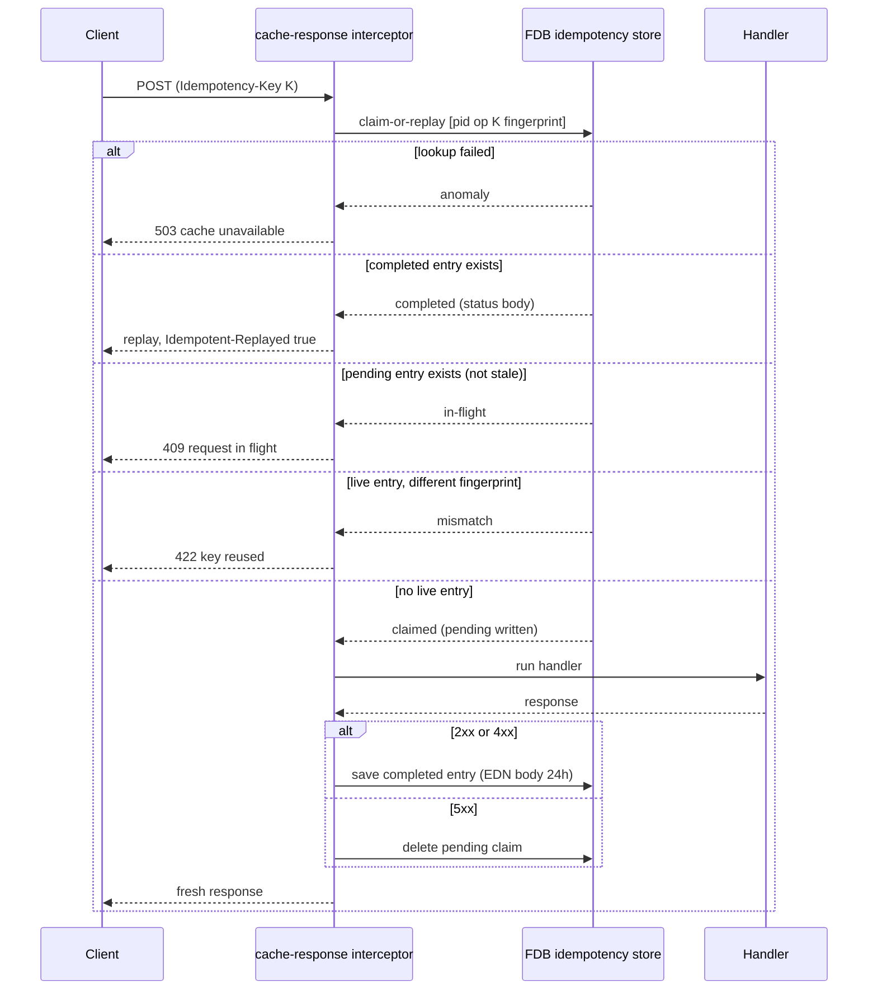

# Idempotency

> **Status: implemented.**

## Objective

A write against Queenswood is idempotent when retrying it with the
same `Idempotency-Key` produces the effect of one transaction and
returns the same response. The guarantee holds for every `/v1` write
route that declares the idempotency pair — `require-idempotency-key`
followed by `cache-response` — durably across restarts and across
instances of the API.

The routes that do not declare the pair are not silent omissions.
Each is named in `exempt-writes` in the `api` base with the guard
that makes a retry safe, and a router test holds both halves of that
sentence. "Which routes rely on which layer" below lists them, and
mirrors that allow-list.

In scope: the `Idempotency-Key` header contract, the FDB-backed
API-layer cache, the per-store key indexes the processors keep
beneath it, concurrent-duplicate handling, and what a retry does on
every write route.

Out of scope: read endpoints, idempotent by nature; the
consume-then-ack and outbox de-duplication that processors and
adapters do on the bus — that boundary model lives in
[transaction-processing.md](transaction-processing.md).

## Background

The API enforces `Idempotency-Key` presence and format on every
protected write route through the `server/require-idempotency-key`
interceptor, which is upstream in `mono`. The header value is 16–255
URL-safe ASCII characters (letters, digits, `_`, `-`). A missing
header is a 400 of type `mono/missing-idempotency-key`, a malformed
one a 400 of type `mono/invalid-idempotency-key`.

The key is also carried in the command envelope's `:id` field, so a
processor can deduplicate at the domain layer. The envelope and the
semantics of `:id` are described in
[transaction-processing.md](transaction-processing.md). Envelope
hygiene stays clean: the key is never folded into the message
payload. A route without the header carries a server-assigned id
instead, so the command and its trace stay addressable.

The inner loop's scope is the bank. Every store-level key index is
headed by `bank_id`, so a key belongs to the bank that chose it and
two banks may submit the same string on the same operation without
meeting each other:

- `CashAccount_by_idempotency_key`, `Party_by_idempotency_key`,
  `InternalPayment_by_idempotency_key`,
  `OutboundPayment_by_idempotency_key`,
  `CashAccountProduct_by_idempotency_key` and
  `CashAccountMigration_by_idempotency_key`, each unique on
  `[bank_id, idempotency_key]`.
- `Transaction_by_idempotency_key`, unique on
  `[bank_id, transaction_type, idempotency_key]`.

Behind the pair, the processors that carry such an index are
cash-account opening, both payments, party creation, product
creation, migration creation and transaction recording. The check is
atomic with the write — same FDB transaction — and a uniqueness
violation is resolved by reading the existing record back and
returning it.

Behind the pair with no index of their own are bank creation and
payee-check creation, among others; the adapter outbox and intent
stores dedup a redelivered webhook or command on their own
`dedup-key`, which is a different mechanism for a different edge.
The API-layer cache described below is layered on top of all of it.

## Solution

An API-layer idempotency cache backed by a single central FDB record
store, operated by the `idempotency` brick as a Sieppari interceptor.

### Cache scope

Each entry is keyed by `[principal_id, operation, idempotency_key]`
and carries a fingerprint of the request it was claimed for:

- **principal_id** — the request's `:principal-id`, whatever the
  `authenticate` interceptor put there: the bank id for a service
  token, `queenswood-admin` for the admin client, and the user id
  for a user.
- **operation** — `METHOD + path-template`, e.g.
  `POST /v1/cash-accounts`. Scopes the key independently per
  endpoint, so the same key can be used across different routes.
- **idempotency_key** — the client-supplied header value.
- **fingerprint** — a SHA-256 of the request `:uri`, the decoded
  body, and the bank the principal resolved to when it resolved one,
  with every map in the body sorted by key first, so two bodies
  differing only in field order hash the same. The `:uri` rather than
  the template, because two resources share one template. The bank,
  because a user or the operator names it in the `Bank-Id` header
  rather than the path, so one key and body sent under two banks is
  two requests.

A request whose principal, operation and key match a live entry
whose fingerprint differs is refused with a 422 of type
`mono/idempotency-key-reused`. It neither runs the handler nor
replays the stored response: the client reused a key for a different
request, and no answer of ours could be the right one. Closing a
second account, merging a second party or accruing for a second bank
under a key already spent is refused rather than silently answered
with the first resource's response.

An entry written before the field existed carries no fingerprint,
and matches anything for the rest of its life.

### Two-state machine

Each cache entry is in one of two states:

- **`pending`** — a handler is currently processing this key. Set on
  first arrival, with the fingerprint, and cleared when the handler
  completes.
- **`completed`** — handler finished; `status` and `body` hold the
  response to replay.

A stale-`pending` entry (older than 60 s) is treated as abandoned —
a server crashed, say. It is reclaimable by the next request, and
the reclaim writes a fresh `pending` marker atomically.

### Two lifetimes

The two layers expire differently, and a reader asking what a
late retry does has to know which one answers.

- **The cache entry lives 24 h.** `expires_at` is stamped 24 h ahead
  on claim and again on completion. After that the entry is not
  live, and a request under the same key is claimed afresh.
- **The store indexes never expire.** A key written into
  `CashAccount_by_idempotency_key` or its siblings stays there for
  the life of the record.

So a key reused after a day does different things by route:

- On account opening, a payment, a party, a product, a migration or
  a recorded transaction, the processor's index still holds it and
  the original resource is returned.
- On a transition — closing an account, suspending a party — there
  is no index, and the retry meets the source-state guard: the
  entity has left the state the transition starts from, and the
  request is refused with a 409, which is the same answer the
  replayed cache entry would have given.
- On a route with neither, a second resource is created. Bank
  creation, payee-check creation, the forced job run and the
  migration preview are the cases; see "Which routes rely on which
  layer".

### Interceptor lifecycle

The `idempotency/cache-response` interceptor is declared at route
level, immediately after `server/require-idempotency-key` so the key
is known valid before the FDB lookup runs. Authentication has
already run by then, which is what makes the principal scope
available.

**`:enter`** — runs a single FDB transaction (`claim-or-replay`):

| Entry state                    | Action                          |
| ------------------------------ | ------------------------------- |
| `completed`, not expired       | terminate, replay the response  |
| `pending`, not stale           | terminate with 409, in flight   |
| live, fingerprint differs      | terminate with 422, key reused  |
| absent, expired or stale       | write `pending`, run handler    |
| lookup failed                  | terminate with 503, logged      |

FDB's optimistic concurrency serialises concurrent arrivals: if two
threads both pass the lookup and attempt to write `pending`, one
transaction aborts and retries. The retry sees the now-`pending`
entry and returns 409.

The lookup runs inside the open transaction, and `fdb/transact` on
an open `Txn` returns an anomaly *value* rather than throwing. The
anomaly is returned as itself before the branch above is taken —
without that it would bind as a truthy entry with no state, fall
through to the last row, and run the handler against a cache it
could not read.

**`:leave`** — finalises the claim:

| Response status  | Action                                       |
| ---------------- | -------------------------------------------- |
| 2xx or 4xx       | overwrite with `completed` (EDN, 24 h)       |
| completion fails | log, release, return the handler's response  |
| 5xx              | delete the `pending` marker — retryable      |

An `:error` stage releases the `pending` claim when the handler
throws through Sieppari's error path, since Sieppari skips `:leave`
on the throwing path. The 60 s stale-pending timeout remains as a
backstop for hard crashes that skip `:error` entirely.

None of the terminating `:enter` paths stamps the request with the
claim it would need, so `:leave` is a no-op on every replay, refusal
and failure.



### Failure modes

The cache can fail on its own account, and each failure has a
defined answer. Every one of them is logged with the principal, the
operation and the key.

- **The claim fails.** An FDB read error, or a stored body that will
  not parse. The request terminates with a 503 of type
  `mono/idempotency-cache-unavailable` and the handler does not run:
  running it against a cache that cannot be read is the one thing
  the interceptor exists to prevent. The failure never reaches the
  router's default exception handler as an opaque 500.
- **The completion write fails.** The handler's effect has already
  committed, so reporting a failure would have the client retry
  something that succeeded. The failure is logged, the claim is
  released, and the handler's own response is returned unchanged. A
  retry re-runs the handler, and on a route with a store-level index
  that retry reads the original resource back.
- **The release fails.** Logged, and nothing more is done: the
  caller is past the point where anything can be done about it, and
  the claim left behind ages out on the stale-pending timeout.
- **The process dies between claim and `:leave`.** Nothing is logged
  and no release runs. The 60 s stale-pending timeout is the
  backstop, after which the next request reclaims the key.

### Ordering against response coercion

The pair is declared at route level, and response coercion sits in
the router's own interceptor chain, outside it. On the way out the
pair's `:leave` therefore runs first, and records the handler's
status rather than the client's.

A response that the handler produced as a 2xx and that then fails
coercion reaches the client as a 500 while the cache holds the
handler's 2xx. The key is pinned for 24 h, and a retry replays a
response the client never received.

This is documented rather than fixed. Moving the pair ahead of
coercion would run it before the `/v1` group's authentication, and
the principal scope needs that to have run.

### The replay header

Every replayed response carries `Idempotent-Replayed: true`. A fresh
response carries no such header, so a client can tell a cached
outcome from a new one without comparing bodies.

### Body serialisation

Cached bodies are stored as EDN, not JSON. EDN preserves keyword
values (e.g. `:cash-account-status-closed`) that a JSON round-trip
would flatten to plain strings, and downstream malli response
coercion on replay requires the original type.

A handler's response may carry the protojure records the `schema`
brick generates, and those print with a tag EDN has no reader for —
a body holding one could be written and never read back, and the
replay it was written for would answer 503. Each record is written
out as a plain map instead, which is all a replay needs.

### Proto and FDB schema

`Idempotency` proto fields:

| Field | Type | Notes |
|-------|------|-------|
| `principal_id` | string | required |
| `operation` | string | required |
| `idempotency_key` | string | required |
| `state` | string | `"pending"` or `"completed"` |
| `status` | int32 | optional (completed only) |
| `body` | string | optional EDN (completed only) |
| `created_at` | int64 | epoch ms |
| `expires_at` | int64 | epoch ms |
| `fingerprint` | string | optional SHA-256 of path, body and bank |

Primary key: `[principal_id, operation, idempotency_key]`. No
secondary indexes.

`fingerprint` is optional on the wire so entries written before it
existed still parse; the record-metadata evolution the `fdb` brick
enforces refuses a new required field.

### Every write route declares the pair or names a guard

A protected route declares both interceptors, in this order:

```clojure
:interceptors [server/require-idempotency-key
               idempotency/cache-response]
```

A write route that declares neither must appear in `exempt-writes`
in the `api` base, keyed by the `[method template]` pair the
compiled router reports and valued by the guard that makes a retry
safe. A router test walks the compiled `/v1` route tree and holds
both directions: a write method in neither place fails, and an
allow-list entry naming a route that does not exist — or one that
declares the pair after all — fails too. A new write route cannot
land without one or the other.

Every protected route advertises the shared refusals through one
helper in the `api` base: the two header 400s beside the generic
one, the 409 raised while an identical request is in flight, the 422
refusing a reused key, and the 503 answering a cache that could not
be read.

### Which routes rely on which layer

**The pair and a store-level key.** A retry after a 5xx release
still returns the resource the first attempt made, because the
processor's index outlives the cache entry.

- `POST /v1/cash-accounts`, `POST /v1/parties`,
  `POST /v1/payments/internal`, `POST /v1/payments/outbound`,
  `POST /v1/cash-account-products`,
  `POST /v1/cash-account-migrations` and
  `POST /v1/simulate/banks/{bank-id}/inbound-transfer`, each read
  back off a unique index headed by `bank_id`.
- `POST /v1/cash-accounts/{account-id}/rotate-address` keeps the key
  of the last rotation on the account rather than in an index. A
  retry under that key returns the address the first rotation
  allocated and allocates none.

**The pair and a domain guard.** No index, but the second attempt
meets a guard that refuses it with the answer a replay would have
given.

- `POST /v1/cash-accounts/{account-id}/close`, `/suspend` and
  `/resume` — the source-state guard rejects
  `:cash-account/invalid-status`, a 409.
- `POST /v1/parties/{party-id}/suspend`, `/resume`, `/close` and
  `/merge` — `:party/invalid-status`, a 409.
- `POST /v1/onboarding/me` — the handler refuses a user who already
  holds a membership with `:membership/already-exists`, a 409, and
  the processor re-checks inside its own transaction so a racing
  double-submit still creates one bank.
- `POST /v1/simulate/banks/{bank-id}/accrue` and `/capitalize` — the
  per-account rows a run commits make a re-run skip what it already
  posted, and the daily-count policy refuses a second run for the
  same day and kind.

**The pair alone.** After a 5xx release the guarantee rests on
nothing, and a retry following a lost reply acts twice.

- `POST /v1/banks` — a second bank, and a second Keycloak client.
  The client is issued before the FDB write so a bank never exists
  without one, which means a retry may leave a client behind even
  where the write is refused.
- `POST /v1/payee-checks` — a second check record.
- `POST /v1/jobs/{job-id}/runs` — a second run.
- `POST /v1/cash-account-migrations/{migration-id}/previews` — a
  second preview.

**The exempt writes.** No pair, and the guard named in
`exempt-writes` carries the retry. Two shapes appear. An absolute
set converges, because the request names the state it wants rather
than a delta. A source-state guard refuses, because the second
attempt finds the entity has left the state the transition starts
from.

- Absolute sets: `POST /v1/banks/{bank-id}/change-tier`,
  `POST /v1/banks/{bank-id}/change-status`,
  `PUT /v1/jobs/{job-id}/schedule`, and
  `PUT /v1/cash-account-products/{product-id}/versions/{version-id}`,
  whose body names the whole draft and which is refused
  `product/version-immutable` once the version has published.
- Source-state guards:
  `POST /v1/cash-account-products/{product-id}/versions` (a second
  open finds the draft the first made and is refused
  `product/draft-already-exists`; opening a draft does not participate
  in idempotency at all, so a key sent with it takes no index entry),
  `DELETE` and `POST .../publish` on a version
  (`product/version-immutable`), and
  `POST /v1/cash-account-migrations/{migration-id}/approve` and
  `/cancel` (`migration/invalid-status`).

**Product and migration creation, and ADR-0018.** Neither write
earns a command — see
[ADR-0018](../adr/0018-command-writes-are-earned.md). Each writes
one record synchronously from the handler, and what makes it safe to
repeat is the read-back off its `[bank_id, idempotency_key]` index.
Both also declare the pair, so their key is now mandatory and
format-validated like every other protected write, rather than an
optional field the handler happened to read. One header contract
covers every protected write; the handlers keep their read of the
header as the store-level key.

## Alternatives Considered

- **Per-domain, processor-layer atomicity.** Each FDB record store
  owns its idempotency records; the processor wraps the
  check-write-store in one FDB transaction. This is the approach
  described in the original proposal. Not adopted as the only
  mechanism: it requires per-domain instrumentation across every
  write store, and the API-layer cache satisfies the durability and
  correctness requirements without it. The store-level indexes are
  kept and extended as the second layer, which is what carries a
  retry after a 5xx release.

- **Centralised store is a hotspot.** The original proposal rejected
  a central store on hotspot grounds. In practice, entries are
  point-read by `[principal_id, operation, key]` — no range scans,
  no sequential write patterns. FDB handles this comfortably. The
  hotspot concern applies to stores with contiguous primary keys
  under write load; this store has neither.

- **Key-only, no response stored.** Duplicate detected → 409 with
  "already exists"; client must refetch by ID. Poor ergonomics: the
  client must branch on this case and perform an extra GET. Rejected
  in favour of full replay.

- **A documented "one key per request" contract instead of a
  fingerprint.** Cheaper, and it leaves a mis-keyed client acting on
  another resource's response. A silent replay of the wrong resource
  is the worse failure, so the fingerprint is stored and a mismatch
  refused.

- **In-memory API-side cache.** Not durable across restarts, not
  shared across API instances. Superseded by the FDB-backed design.

- **Forever TTL.** Storage grows without bound. Not adopted — 24 h
  matches realistic retry windows.

- **Bus-level deduplication only.** Backend-specific, doesn't
  preserve the response on retry, not portable. Rejected; see
  ADR-0003.

## Known Limitations

- **No sweeper for expired `completed` entries.** Entries expire
  after 24 h but remain in FDB until overwritten or actively
  deleted. Volume should be low — one entry per successful
  idempotent request per day per principal — but a sweeper or
  TTL-native delete should be added before sustained high write
  volumes make this significant.

- **Response schema evolution.** A stored EDN body reflects the
  response shape at write time. A deploy that changes the response
  schema may cause a replay to return the old shape during the 24 h
  window. The invariant: stored responses are immutable artefacts of
  the original transaction, and schema changes to
  idempotency-protected responses should be additive.

- **Bounded TTL means key reuse is allowed after 24 h.** A client
  that retains a key longer than 24 h and retries gets whatever the
  layer beneath the cache gives it — the original resource, a 409
  from a source-state guard, or a second resource. "Two lifetimes"
  above says which, per route. This should be stated in the API
  reference.

- **Admin service-account scope is shared.** Service tokens minted
  via `client_credentials` against `queenswood-admin` all share that
  principal, so two callers using that client with the same key on
  the same operation collide. Acceptable given the back-office usage
  pattern; per-operator humans use the user-JWT path with a distinct
  user-id principal and don't share scope.

- **Only the replay marker is replayed, not the response's other
  headers.** The cache stores status and body, and sets
  `Idempotent-Replayed` itself. Four routes that declare the pair
  set `Location` on a fresh 201: product creation, migration
  creation, the migration preview and the forced job run. A replay of
  any of the four omits it. Each declares the header in its route
  data, but that declaration does not reach the generated document,
  which names `Location` nowhere, so no generated client expects it
  either; moving the declaration where reitit reads it is an `api`
  fix of its own. Product draft opening also sets `Location`, but it
  is exempt, so it never replays. Widening the entry to store headers
  is deferred.

## References

- [ADR-0001](../adr/0001-reuse-mono-as-upstream.md) — Reuse mono as
  upstream
- [ADR-0002](../adr/0002-foundationdb-record-layer.md) —
  FoundationDB Record Layer (multi-record transactions)
- [ADR-0003](../adr/0003-message-bus-abstraction.md) — Message-bus
  abstraction
- [ADR-0005](../adr/0005-error-handling-with-anomalies.md) — Error
  handling with anomalies
- [ADR-0014](../adr/0014-openapi-3x-compliance.md) — OpenAPI 3.x
  compliance
- [ADR-0018](../adr/0018-command-writes-are-earned.md) — Command
  writes are earned, not default
- [ADR-0021](../adr/0021-changelog-relay.md) — Changelog relay
- [service-apis.md](service-apis.md) — Service APIs
  (`Idempotency-Key` header, `require-idempotency-key` interceptor)
- [transaction-processing.md](transaction-processing.md) —
  Transaction processing (envelope shape, `:id` semantics)
- `idempotency` brick — interceptor, core, store
- `server` brick — `require-idempotency-key` interceptor. Upstream
  in `mono`; see [ADR-0001](../adr/0001-reuse-mono-as-upstream.md)
- `command` brick — `req->command-request` (`:id` propagation).
  Upstream in `mono`; see
  [ADR-0001](../adr/0001-reuse-mono-as-upstream.md)
- [Stripe — Idempotent
  requests](https://stripe.com/docs/api/idempotent_requests)
- [RFC 7231 §4.2.2 — Idempotent
  methods](https://datatracker.ietf.org/doc/html/rfc7231#section-4.2.2)
