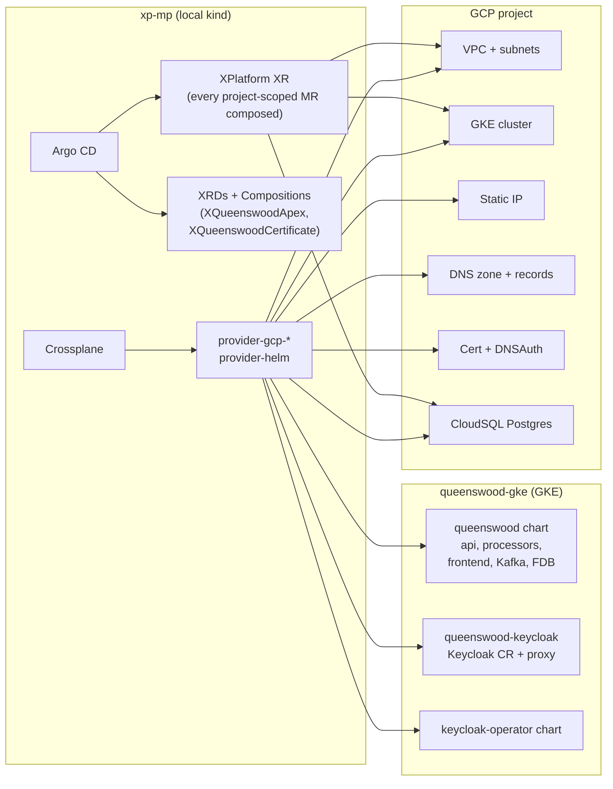

# Infrastructure

## Objective

Spin Queenswood up from a fresh GCP project to a fully working
GKE deployment with one command (`just gcp-up`), and tear
it back down with another (`just gcp-down`). Drive every
cloud resource through Crossplane on a small management-plane
cluster, with Argo CD as the GitOps front-end — see
[ADR-0016](../adr/0016-crossplane-over-terraform.md) for the
decision rationale.

In scope: how the management plane and the workload plane are
organised, the bootstrap chain (what creates what, in what
order), the Composites we own, the patterns we keep
re-applying.

Out of scope: building service images and iterating on a local
kind cluster — see
[recipes/infra/deployment.md](../recipes/infra/deployment.md).
The Polylith brick layout for the application itself — see the
per-capability TDDs.

## Two clusters

The deployment splits across two Kubernetes clusters:

- **`xp-mp` (management plane)** is a local kind cluster. It
  carries Argo CD, Crossplane, the GCP provider family
  (`provider-gcp-{compute,container,sql,dns,certificatemanager,
  cloudplatform}`), and `provider-helm`. Nothing application
  -level runs here.
- **`queenswood-gke` (workload plane)** is the actual GKE
  cluster. Every workload — banking services, frontend, Keycloak,
  the cloud-sql-proxy — lives here. Crossplane on `xp-mp`
  reaches into it via a `provider-helm` ProviderConfig
  (`queenswood-gke`) authenticated by a Workload-Identity-bound
  service account.

The split keeps GCP-state reconciliation isolated from the
workloads. We can destroy the workload cluster without losing
the orchestrator that knows how to rebuild it.

## Bootstrap chain

`just gcp-up` does the cold-start sequence. After
`gcp-iam-bootstrap` lays the foundation roles and
`gcp-dns-zone-create` registers the domain, `kind-xp-up` runs
four steps in order:

1. **`kind-xp-bootstrap`** — create the kind cluster, install
   Crossplane core, install Argo CD, apply the argocd-cm health
   customisation for upbound Crossplane MRs — see
   [Operational notes](#operational-notes).
2. **`kind-xp-install-gcp-secret`** — apply the `gcp-creds`
   Secret in `crossplane-system` from the operator's GCP ADC.
3. **`kind-xp-install-root`** — envsubst-apply
   `infra/bootstrap/root-app.yml.tmpl` with the live
   `${PROJECT_ID}`. This is the *one* imperative substitution in
   the whole flow.
4. **`kind-xp-wait-ready`** — block on each child Application
   reaching Healthy, surface the ManagedZone's nameservers when
   the zone wave reaches that, fetch GKE credentials when the
   cluster wave finishes.

The root Application is Helm-typed and points at
`infra/helm/bootstrap`. The chart's only mandatory value is
`gcpProjectId`, which flows from `root-app.spec.source.helm.parameters`
into each rendered child Application's helm parameters in turn,
and from there into every Crossplane MR that needs it. The
per-deploy project ID never lives in git; it enters the system
once, at `kind-xp-install-root`.

`infra/helm/bootstrap/templates/` renders five child Argo
Applications:

| Wave | App                  | What it lands                            |
| ---: | -------------------- | ---------------------------------------- |
|    0 | crossplane-providers | Provider Packages (gcp-* + helm)         |
|    1 | crossplane-configs   | Non-GCP ProviderConfigs (provider-helm)  |
|    1 | crossplane-xrds      | [Composites](#composites)                |
|    1 | queenswood-gcp       | All project-scoped GCP infra             |
|    4 | queenswood-platform  | Platform Helm chart on the GKE target    |

Wave gating depends on each Application's reported health, which
in turn aggregates the health of the resources it owns. That
makes queenswood-platform's wave-4 sync wait for queenswood-gcp
to be Healthy — i.e. the GKE Cluster MR is `Ready=True`, which
is the moment Crossplane writes the connection Secret that
provider-helm needs to reach the workload cluster.

Within `queenswood-platform` itself, per-resource sync-waves take
over:

| Wave | Resource (in `queenswood-platform`)                         |
| ---: | ----------------------------------------------------------- |
|    3 | Namespace + `keycloak-operator` Release                     |
|    4 | DNS zone                                                    |
|    5 | Cert (XQueenswoodCertificate)                               |
|    6 | Apex (XQueenswoodApex), `queenswood-keycloak` Release       |
|    7 | `queenswood` Release (api, processors, etc.)                |

The waves let Crossplane start expensive long-running work
(CloudSQL provisioning takes 5–10 min, cert validation can take
minutes) as early as possible, in parallel with everything else
spinning up.

## queenswood-gcp chart + XPlatform Composition

`infra/helm/queenswood-gcp/` renders three resources per install:

- `xplatform.yaml` — one `XPlatform` Composite Resource carrying
  `spec.projectId` + env-shaped defaults
  (`envNamespace`, `region`, `zone`, SA names).
- `cluster-provider-config.yaml` — the v2
  `ClusterProviderConfig.default` referencing the `gcp-creds`
  Secret; every composed MR uses it via `providerConfigRef`.
- `database-password.yaml` — the static `Secret` the composed
  CloudSQL `User` MR's `passwordSecretRef` consumes
  (Secrets aren't MRs so they can't be composed).

The XR itself does no work; the lifting happens in the
`XPlatform` Composition at
`infra/platform/crossplane-xrds/xplatform-composition.yml`,
which composes every project-scoped MR via the
`function-patch-and-transform` pipeline:

| Composed MRs                       | Purpose                                |
| ---------------------------------- | -------------------------------------- |
| 5× `ProjectService`                | Enable GCP APIs Crossplane drives      |
| 6× `ProjectIAMMember`              | crossplane SA workload roles           |
| `ServiceAccount` + 2 IAM bindings  | cloud-sql-proxy SA + cloudsql + WI     |
| `ServiceAccount` + 1 IAM binding   | gke-nodes SA + defaultNode role        |
| `Network` + 2× `Subnetwork`        | VPC + primary + proxy-only subnet      |
| `Cluster` + `NodePool`             | GKE cluster + node pool                |
| `DatabaseInstance`/`Database`/`User` | CloudSQL Postgres for Keycloak       |

Patches drive everything from the XR's spec:
`spec.projectId` flows into every `forProvider.project`, into
each IAM member string (via the function's string-format
transform), into `Cluster.workloadIdentityConfig.workloadPool`
(suffixed with `.svc.id.goog`), into the GKE-nodes SA email
`NodePool.nodeConfig.serviceAccount` takes. The Workload-Identity
binding's member string uses a `CombineFromComposite` patch over
three fields (`projectId`, `envNamespace`, `sqlProxyK8sSa`) for
the `serviceAccount:<proj>.svc.id.goog[<ns>/<sa>]` shape.

Two status fields pivot up from composed MRs to the XR via
`ToCompositeFieldPath`:

- `DatabaseInstance.status.atProvider.connectionName` →
  `XR.status.connectionName` — what `gcp-cloudsql-wire` reads to
  pin the CloudSQL Auth Proxy's `connectionName` +
  Workload-Identity-bound GCP SA email into
  `queenswood-platform/values.yaml` and commit + push so the
  next Argo reconcile picks up the values.
- `Cluster.status.atProvider.endpoint` →
  `XR.status.clusterEndpoint`.

The composed MRs use the v2 (`*.gcp.m.upbound.io`)
namespace-scoped API group, all in `crossplane-system`, all
referencing the chart-rendered `ClusterProviderConfig`. v2
Cluster + NodePool + DatabaseInstance ship `v1beta1` only (the
v1 group's `v1beta2` doesn't exist in v2 yet); other v2 kinds
are `v1beta1`.

### Activation policy

`infra/platform/crossplane-providers/mrap.yml` is a
`ManagedResourceActivationPolicy` listing only the ~16 MR kinds
the Composition + the `XQueenswoodApex` / `XQueenswoodCertificate`
compositions actually compose. provider-family-gcp ships
hundreds of MRDs by default; pinning activation here means the
application-controller only runs reconcile loops + holds CRD
memory for kinds we use. When a new MR kind gets composed, add
it to the activate list.

## Composites

`infra/platform/crossplane-xrds/` owns two composites. Each is
a thin patch-and-transform pipeline — no KCL, no Go — that lets
us model an end-to-end concept as one CR.

### `XQueenswoodCertificate`

Bundles the `DnsAuthorization` + `Certificate` resources Google
needs for a managed TLS certificate. One XR per environment.

### `XQueenswoodApex`

Wraps the static `Address` + the DNS `RecordSet`(s) that point
the apex hostname (`<env>.repldriven.com`) and Keycloak
subdomain (`keycloak.<env>.repldriven.com`) at it. Both records
share the same managed IP — they're patched from the
`Address.status.atProvider.address` field that the composite
lifts onto `XR.status.ip`.

We *don't* put the Keycloak subdomain on the
`queenswood-keycloak` workload chart, because `RecordSet` is a
Crossplane Managed Resource — its CRD only exists on the
management plane, not on the GKE target. Keeping all DNS in the
apex composite avoids the cross-cluster-CRD trap.

## Workload deployment via Crossplane Releases

`queenswood-platform/templates/` renders three
`helm.crossplane.io/Release` resources, each targeting the
`queenswood-gke` ProviderConfig:

- **`keycloak-operator`** (sync-wave 3) — the vendored upstream
  operator wrapped in a thin chart (`infra/helm/keycloak-operator/`).
  CRDs in `crds/` so Helm installs them ahead of templates and
  skips template rendering. The `JOSDK_ALL_NAMESPACES` env var
  is the operator-sdk sentinel for cluster-wide watch (not
  `JOSDK_WATCH_ALL_NAMESPACES`, which some upstream docs cite
  and which Quarkus silently treats as a literal namespace
  name).
- **`queenswood-keycloak`** (sync-wave 6) — emits the `Keycloak`
  CR + `KeycloakRealmImport` + `HTTPRoute` + the cloud-sql-proxy
  Deployment. Renders its own DB-credentials Secret on GKE
  (chart-rendered, not Crossplane-synced cross-cluster — see
  [DB credentials](#db-credentials) below).
- **`queenswood`** (sync-wave 7) — the application itself.

The Releases all pull OCI artifacts from
`ghcr.io/repldriven/<chart>`. The `Release Chart` GitHub Actions
workflow packages and pushes each on `workflow_dispatch`.

## Keycloak topology

Two URLs come into play:

- **Public URL** — `https://keycloak.<env-domain>` — what the
  Keycloak CR's `hostname.hostname` is set to. Embedded as the
  `iss` claim in every JWT Keycloak mints. Routed via the
  shared `queenswood-gateway` HTTPRoute and the apex composite's
  DNS record.
- **In-cluster Service URL** —
  `http://queenswood-keycloak-keycloak-service:8080` — what
  api uses as `base-url` for the admin REST API and token
  exchange. No LB round-trip; no `hostname-strict` constraint
  to worry about.

The mismatch (tokens have `iss=public`, api calls
`base-url=internal`) is bridged by the keycloak component's
`:expected-issuer` config, which overrides the default
base-url-derived iss the verifier expects. See
`components/keycloak/src/com/repldriven/mono/keycloak/identity_provider.clj`.

This is the natural deployed shape: public for what users see,
internal for what services see each other through. Envoy egress
or a kube-dns rewrite to fold both into one URL is a possible
future evolution; the `expected-issuer` split keeps the doors
open without forcing it.

### DB credentials

The CloudSQL instance has a single `keycloak` user. The
credentials need to land on GKE (where Keycloak runs), but the
User MR lives on the management plane.

We don't sync the Secret across clusters. Instead, the
`queenswood-keycloak` chart renders its own
`queenswood-keycloak-conn` Secret on GKE, populated from literal
values in the `queenswood-platform` Release template. The same
literal lives in the queenswood-gcp chart's
`database-password.yaml` Secret, which the composed CloudSQL
`User` MR's `passwordSecretRef` consumes.
Both sides share a single source-of-truth at deploy time; live
rotations need both files updated. Cross-cluster Secret sync
would require installing `provider-kubernetes` pointed at GKE
just for this credential — not worth the complexity.

### Cloud SQL Auth Proxy

A `cloud-sql-proxy` Deployment in the workload namespace fronts
CloudSQL. It authenticates to GCP via Workload Identity: a K8s
ServiceAccount annotated with
`iam.gke.io/gcp-service-account: keycloak-sql-proxy@<project>.iam`,
bound to a GCP SA that has `roles/cloudsql.client`.

The SA name is shortened to `keycloak-sql-proxy` (18 chars) to
fit GCP IAM's 30-char `account-id` limit;
`queenswood-keycloak-cloudsql-proxy` (33 chars) was rejected at
SA-create time.

The proxy's `connectionName` and the GCP SA email get pinned
into `queenswood-platform/values.yaml` by
`just gcp-cloudsql-wire` once Crossplane has
published `XR.status.connectionName`. The pin is committed +
pushed so the next reconcile of `queenswood-platform` picks up
the values.

## Down-to-zero

`just gcp-down` is the reverse path. The non-obvious step is
the first one:

1. **Drain workload namespaces on GKE.** `kubectl delete ns
   queenswood-test --wait=true --timeout=5m` *before* killing
   kind. The GKE CSI driver only runs `DeleteDisk` while the
   cluster (and Crossplane managing it from kind) is alive; if
   we destroy GKE with PVCs still bound, the underlying PDs
   leak as orphan disks in `europe-west2`. Two
   `gcp-up/gcp-down` cycles of the FDB + Kafka
   StatefulSets is enough to exhaust the default 250 GiB
   regional SSD_TOTAL_GB quota and block the next cold start
   on a pending PVC.
2. Kill kind. Crossplane stops reconciling.
3. Delete the GKE cluster.
4. Delete the static IP, certificate, DNS records, VPC.
5. Prune the local kubeconfig context.

The DNS zone itself is kept (the `dnsName` claim is sticky for
30 days after a delete); `just gcp-project-delete` is the
nuclear option that also drops the zone and the project.

## Operational notes

Patterns that recur in this codebase, kept here so they're
discoverable from the topic router rather than scattered across
commit messages.

- **`gcpProjectId` is the one parameter that bridges the
  per-deploy world to GitOps.** Project IDs have a random suffix
  per `gcloud projects create`, so they can't live in git. The
  single envsubst at `kind-xp-install-root` substitutes
  `${PROJECT_ID}` into `root-app.yml.tmpl`'s
  `helm.parameters.gcpProjectId`. That value flows through the
  bootstrap chart's values, the queenswood-gcp child
  Application's helm parameters, the queenswood-gcp chart's
  values, into `XPlatform.spec.projectId`, and from there the
  Composition's patches drive it into every composed MR field
  that embeds the project ID. Adding a new MR field that needs
  the project ID means adding a patch in
  `xplatform-composition.yml` — nothing in the chart.
- **argocd-cm grades the composites.** Argo ships no health check
  for `platform.repldriven.com` or `queenswood.repldriven.com`, and
  a resource whose group has none is reported Healthy whatever it is
  doing — so an Application applying a manifest that fails to compose
  reads the same as one that worked. The management-plane chart
  patches two keys into `argocd-cm`, one per group, sharing a script
  that reads `Synced` and `Ready`: `Synced` False is Degraded,
  `Ready` True is Healthy, anything else is Progressing. Two passes
  rather than one, so a composite that went out of sync after it was
  once ready reports the failure rather than the stale success.
  Managed resources are not covered and do not need to be: Crossplane
  creates them, so they are tree descendants rather than an
  Application's own resources and never reach its health. Argo's
  compiled-in `_.upbound.io` script is what grades those in the UI,
  and it carries an `or`/`and` precedence bug — a resource whose
  status has not been written yet reports Healthy — which is worth
  knowing when reading the tree and is not worth vendoring a copy of
  the script to fix.
- **argocd-cm also grades child Applications.** Argo ships no health
  check for `argoproj.io/Application`, so a parent reads Healthy
  whatever its children are doing — and because gitops-engine treats a
  nil health as an immediate success, a parent holding Applications in
  waves never orders them either. The same ConfigMap registers one, so
  an app-of-apps reports and gates as it appears to. It follows the
  split that gave each instance's Applications a parent of their own:
  with a check in place, a parent waits on its children, so the
  installation's own manifests must not share one with an environment
  that may be off.
- **Dedicated GKE node SA, not the Compute Engine default.**
  `queenswood-gke-nodes` is bound to the narrow
  `roles/container.defaultNodeServiceAccount` bundle (logging,
  monitoring, metric writing, Artifact Registry pull) and set as
  `NodePool.nodeConfig.serviceAccount`. The default Compute
  Engine SA carries the broad `roles/editor`, which GKE flags as
  a health recommendation.
- **`accountId` goes in `initProvider`, not `forProvider`, on
  upbound ServiceAccount MRs.** The provider strips `accountId`
  from `spec.forProvider` after create, so any value in
  `forProvider` shows as permanent drift. `initProvider` is the
  upstream pattern for "set at create, ignore on update".
- **v2 (`*.gcp.m.upbound.io`) is the default for new MRs.** The
  XPlatform Composition is fully on v2, namespace-scoped to
  `crossplane-system`, referencing the v2
  `ClusterProviderConfig.default`. Two gotchas: `ServiceAccount`
  and `ServiceAccountIAMMember` live under `cloudplatform.gcp`
  in both v1 and v2 (not `iam.gcp.upbound.io`); v2
  `ProjectIAMMember` has the same project-late-init behaviour
  as v1, so the Composition patches `forProvider.project`
  explicitly rather than relying on `ClusterProviderConfig`
  propagation.
- **Squash-merges + a long-running feature branch don't mix
  cleanly.** When PRs from the branch are squashed onto main,
  the original commits on the branch retain their old SHAs and
  later rebases conflict on the squashed range. The fix is to
  `git reset --hard origin/main` and cherry-pick the *new*
  commits — the squash captures the merged content correctly,
  the cherry-pick replays only what isn't on main yet.
- **GKE NEG-readiness gate.** Pods behind a Gateway-routed
  Service get a `cloud.google.com/load-balancer-neg-ready`
  readiness gate. Until the LB's backend health check passes,
  the pod's `Ready` condition stays False and kube-proxy won't
  route to it. If the LB's default `/`-expects-200 health check
  doesn't match the pod (Keycloak returns 302 from `/`), the
  gate stays unfulfilled for ~10 min until GKE times out and
  forces it True. A `HealthCheckPolicy` pointing at a real
  health endpoint (Keycloak's `/health/ready` on port 9000)
  fixes it cleanly, but only when the Service is referenced by
  a Gateway-attached HTTPRoute that the policy can attach to.
- **Chart version bumps trigger reinstall, value-only changes
  don't.** Crossplane provider-helm reconciles Releases on
  spec drift only — a values-only change to a chart doesn't
  trigger a re-install. Bumping the chart version (even
  patch-level) is the reliable trigger.

## Out of scope

- The local-kind dev loop —
  [recipes/infra/deployment.md](../recipes/infra/deployment.md).
- Per-service image build pipeline — `infra/docker/service/`
  shared Dockerfile, `release-images.yml` workflow.
- Realm content (clients, scopes, audience mappers) —
  `components/resources/resources/bank/keycloak-realm.json`
  and its testcontainer-fixture sibling under
  `components/test-resources/`.
