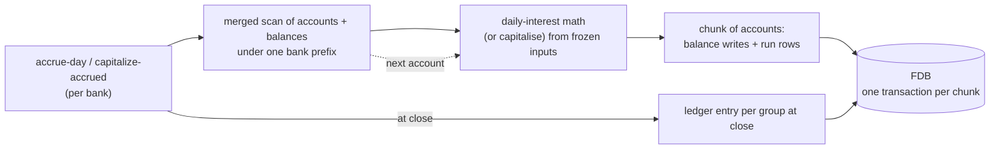
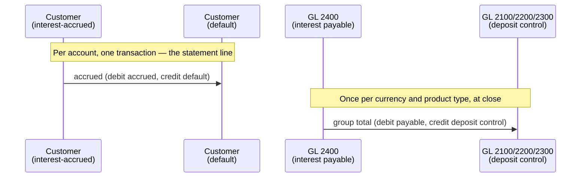

# Interest accrual and capitalisation

## Objective

Customer accounts earn interest. The bank computes it daily,
records it against the customer's balance, and capitalises it
monthly so the customer can spend it. Across millions of
accounts and 365 days, fractions of a penny per day add up to
real money. The math has to conserve every micro-unit.

This TDD describes the daily-accrual + capitalisation
machinery: the integer-only arithmetic with sub-minor-unit
carry; a pass that streams a bank's accounts with their
balances and writes them in chunks; the split between what is
posted per account and what is aggregated for the bank at
close; and the per-account rows that make a re-run safe.

In scope: the `interest` brick, the daily-interest
formula and carry mechanism, accrual and capitalisation
postings, the run pattern that processes a bank's customer
accounts.

Out of scope: rate setting and product configuration —
see [cash-account-products.md](cash-account-products.md);
the substrate that records and applies legs, covered in
[transactions-and-balances.md](transactions-and-balances.md);
the policy filters that scope limit checks to specific
transaction types — see
[policy-evaluation.md](policy-evaluation.md).

## Background

Three things make interest math subtle in a way naive
arithmetic gets wrong.

**Sub-minor-unit precision.** Daily interest on £1.00 at 5%
APR is well under a penny. Integer arithmetic that rounds at
the minor unit (pence) every day produces zero — £1 earns no
interest forever. The fix is to track sub-minor-unit residue
between days and only post when the residue accumulates past
one minor unit.

**Penny conservation.** Across millions of accounts and 365
days, the difference between "rounded each day" and
"correctly accumulated" can be measurable money. A bank that
loses pennies systematically is a bank with an audit
problem. The arithmetic must be deterministic and lossless
across run boundaries.

**Two sides moving at different granularities.** When accrued
interest becomes spendable, the customer's accrued bucket
drains and their default bucket grows — a per-account event,
and the one the customer sees on a statement. The bank's side
of the same entry is a general-ledger movement that is
identical for every account in the group, so posting it per
account made every capitalisation in the bank contend on the
same two rows. The two sides therefore move at different
granularities: per account for the customer, once per group
at close for the bank.

The design answers all three with a single mechanism:
**integer micro-unit arithmetic with carry between days**,
backed by FDB record-store transactions for atomicity. No
floating point. Carry lives on the customer's balance record
in `:credit-carry` and is updated alongside the daily
posting.

## Proposed Solution

### Architecture

`interest` is the brick. Two top-level operations:

- **`accrue-day`** — iterates a bank's customer accounts and
  accrues per-account interest from the account's available
  balance and the product's rate.
- **`capitalize-accrued`** — iterates the same accounts and
  sweeps any accrued interest into the spendable balance.

Both run the same pass. It streams the bank's accounts paired
with their balances through one merged scan
(`cash-accounts/reduce-accounts-with-balances`, over the
`cash-accounts` and `balances` stores, which share a leading
`bank_id`), and posts them a chunk of accounts per FDB
transaction — the bounded-batch discipline from
[transactions-and-balances.md](transactions-and-balances.md).

Pairing the scans is what lets a posting read nothing. Every
figure an accrual needs is frozen as the account streams past,
so the transaction that writes it performs no read of its
own.



A run for one bank commits a transaction per chunk rather than
per account. A failure loses the chunk in flight, whose
accounts are marked FAILED so the pass can continue; work
already committed stays committed.

### Balance-type vocabulary

Interest uses two balance-type buckets on the customer:

- **`:balance-type-default`** — the customer's spendable
  balance. Together with its pending-outgoing reservation it
  forms the available balance interest is earned on. Receives
  capitalised interest as a credit. The pass reads it and
  never writes it.
- **`:balance-type-interest-accrued`** — interest earned by
  the customer, recorded daily, not yet spendable. Drained at
  capitalisation. The only bucket accrual writes.

Its `:credit-carry` field holds the sub-minor-unit remainder
between days. It sits on the accrued bucket, with the rest of
the accrual state, rather than on the default bucket that
payments contend on — which is what lets accrual write one row
and never touch a row another writer might be moving.

The bank's side is not a balance type. It lives in the chart
of accounts: 5100 interest expense, 2400 interest payable, and
the deposit controls the product types roll into. See
[chart-of-accounts.md](chart-of-accounts.md).

### Daily-interest math

Implementation is integer-only at micro-scale (one minor unit
= one million micro-minor-units). The algorithm:

```clojure
;; conceptual; see interest/domain.clj for the actual code
(let [net          (- credit debit)               ; minor units
      bps-factor   100                            ; 1 bps in micro per minor
      annual-micro (* net interest-rate-bps bps-factor)
      ;; carry was sub-minor-unit; treat it as annual-equivalent
      ;; so dividing by 365 returns its daily share exactly
      total-micro  (+ annual-micro (* credit-carry 365))
      daily-micro  (quot total-micro 365)
      whole-units  (quot daily-micro 1000000)
      new-carry    (rem daily-micro 1000000)]
  {:whole-units whole-units :carry new-carry})
```

The clever bit is `(* credit-carry 365)`. The carry is in
micro-minor-units of *daily* residue. By multiplying by 365
before summing with the annual interest, then dividing the
total by 365, the carry's daily share is preserved exactly —
no precision loss in the round-trip.

Rate is annual (in basis points; 500 bps = 5% APR). Day-count
is a simple actual/365. The math is **simple daily interest**
on the account's available balance, and the result lands in
`:balance-type-interest-accrued`. Compounding emerges from the
*cadence of capitalisation*, not from the daily math itself:
once accrued has been swept into default, the next day's
accrual sees the larger balance.

**Available, not posted.** The principal spans buckets — the
posted balance less what a pending outgoing payment has
reserved against it, and not counting money still pending
inbound. Money already committed to a payment stops earning
when the reservation is taken rather than when it settles, and
money that has not arrived has not started earning. It is
computed with `balance-domain/available-balance`, the same
definition the limit checks use, so there is one meaning of
available in the system. Spanning several buckets would have
cost a second read on a design that paged accounts; on the
merged scan every bucket the sum needs is already in hand, so
it is arithmetic.

This means the compounding cadence is an **operator decision,
not a math constraint** — see "Capitalisation cadence" below.

### Daily accrual posting

Accrual is silent, and costs one write. It advances the
customer's interest-accrued bucket — credit raised by the
day's whole units, `:credit-carry` replaced with the new
remainder — and records nothing else. No transaction, no
ledger leg, no second row for the carry:

```
customer-account  interest-accrued / posted
    credit      += whole units earned
    credit-carry = the new sub-minor remainder
```

The row is written from the copy the scan froze, without being
read back. That is sound because only this pass and
capitalisation ever write an interest-accrued bucket, so
nothing can have moved it in between. It would not be sound
for the default bucket, which every payment writes — and the
pass never writes that one.

At a zero rate there is nothing to earn and nothing is
written. At a non-zero rate the row is written even when the
whole units come to zero, because the carry still moved.

There is no per-account transaction because accrual is not a
statement line: what a customer sees is capitalisation. The
per-account double entry cost far more than it bought, since
every accrual in the bank read and wrote the same two ledger
rows — 5100 and the 2400 control — and so contended with every
other accrual regardless of account.

### The run's ledger entry

The bank's side is posted once, at the end of the run, per
currency:

```
DEBIT  5100 interest expense           run total
CREDIT 2400 interest payable control   run total
```

The total comes off the `InterestAccountRun` SUM index rather
than a tally the pass kept in memory, because a resumed run
only processes the accounts still pending while the index
covers every row whichever attempt wrote it. The entry is
keyed on the run's identity, so reaching close twice posts
once.

One entry per currency, and necessarily so — a single entry
for a bank holding pounds and euros could not balance. The
index groups on currency for the same reason.

Between the per-account credits and this entry the books do
not balance. That window is one run, and it closes before the
run record is written.

### Monthly capitalisation posting

When the customer's `:balance-type-interest-accrued` is
non-zero at capitalisation time, a **two-leg transaction**
moves the accrued amount into the spendable default balance:

```
DEBIT  customer-account    interest-accrued / posted    accrued
CREDIT customer-account    default          / posted    accrued
```

Capitalisation keeps its per-account transaction where accrual
has none, because this transaction *is* the customer's
statement line — the one part of interest they ever see. What
it does not keep is a control leg per account. Fanning out per
account made every capitalisation in the bank read and write
the 2400 payable and the deposit control, which is the
contention accrual was taken off.

Unlike accrual this cannot be an unread write. It credits the
default bucket, which payments move, so it goes through
`apply-legs`, and the read-modify-write inside the posting
transaction is what stops a concurrent payment being lost.

The bank's side is posted at close, one entry per currency and
product type:

```
DEBIT  2400 interest payable        group total
CREDIT 2100 / 2200 / 2300           group total
       (the deposit control the product type rolls into)
```

Grouped by product type as well as currency, because the
credit side is a different control for each — a single
per-currency entry could not name them all and still balance.
Accrual needs no such split: both of its aggregate legs are
fixed accounts, so a total per currency says everything.



Net: the customer's spendable balance grows by `accrued`, the
bank's payable clears by what the group accrued, and the
deposit control rises to match the customer balances that grew
underneath it.

### Capitalisation cadence

`capitalize-accrued` is **not constrained to any cadence**. It
sweeps accrued interest into default whenever it is called. The
operator (or whoever schedules the run) chooses the cadence,
and the choice has real customer-facing consequences.

The compounding behaviour falls out of the cadence:

- **Daily.** Accrued is swept into default every day, so the
  next day's interest is computed on the larger available
  balance — effectively daily compounding, which some digital
  banks offer to compete on rate visibility. The accrued
  bucket then holds only the sub-minor carry between runs.
- **Weekly / monthly.** Accrued sits in its bucket and only
  rolls into default at the chosen cadence. Customers see
  the credit less frequently, and compounding happens at
  that cadence too.
- **Annually.** Accrued sits all year. Compounding only on
  the anniversary.

The trade-off is real money. Less frequent capitalisation is
*money on the table for the bank*: a year of accrued sitting
in `:balance-type-interest-accrued` does not itself earn
interest, because the principal is the available balance and
the accrued bucket is not part of it. So the customer earns
less than under a daily-capitalisation product. Different
operators take different positions; the system supports any
choice.

Daily capitalisation is the expensive end of that choice, and
the cost is not in the interest math. It writes a transaction
per account per day, because a capitalisation *is* a statement
line — roughly 365 million transactions a year across a
million accounts. Monthly does not. That is a product decision
with a volume attached, not a tuning knob.

### Run pattern

`accrue-day` and `capitalize-accrued` accept `:bank-id` and
`:as-of-date`. They:

1. Resolve the general-ledger accounts the close will post to,
   before touching any account.
2. Check the platform daily-count limit for this run kind, so
   a second pass for the same bank and day is a rejection
   rather than a double posting.
3. Stream the bank's accounts paired with their balances
   through one merged scan, filtering to *opened* customer
   product types — general-ledger accounts carry no product
   type and fall out here.
4. Accumulate a chunk and post it in one transaction, marking
   a failing chunk's accounts FAILED and continuing.
5. Post the bank's side per group, then write the run record
   closed.

Re-running a date is safe, by different means on each side.

Accrual has no transaction to key, so its guard is the
`InterestAccountRun` row: a second pass finds the row already
DONE and skips the posting. The row is written in the same FDB
transaction as the balance update, so the work and the record
of the work commit together and a crash cannot separate them.

Capitalisation still writes a transaction per account — that
one is the customer's statement line — and keys it
`capitalize-<account-id>-<as-of-date>`, so a repeat returns
the prior outcome; see [idempotency.md](idempotency.md).

### Chunk atomicity, run-level resumability

A chunk of accounts is one FDB transaction. Every balance
write and every run row in it commits together or not at all,
so an account can never be left with interest credited but no
record that it was processed.

Across chunks the run is **resumable but not atomic**. A crash
mid-run leaves earlier chunks committed and later ones
untouched. Re-running the date streams every account again and
skips the ones whose row is already done, which is what makes
a re-run safe. No row is written ahead of the work: an account
is either done, and a re-run skips it, or it is not, and a
re-run redoes it — a row recording that the pass intended to
reach it would distinguish neither.

A failing chunk marks all of its accounts FAILED and the pass
continues. It does not try to isolate the one account that
raised, because accrual reads nothing and writes a row only it
writes — so a failure is a database that is unwell, or a
product whose accounts all fail alike, rather than one unlucky
account in an otherwise good chunk.

This is the bounded-batch discipline applied to a long-
running process: many bounded transactions, predictable
failure modes, forward progress preserved.

### Chart-of-accounts dependency

The bank's side of both entries lands on general-ledger
accounts, so a run resolves the ones it will need — 5100 and
2400 for accrual, 2400 and the three deposit controls for
capitalisation — **before it touches a single account**. A
bank whose chart cannot take the posting fails before the
books go out rather than after, which matters because both
passes move customer money as they go.

This is one of the few places where the bank's own
bookkeeping is visible from a customer-facing brick. Most
components treat customer accounts as the universe; interest
has to name the bank side too, because the money comes from
somewhere.

## Alternatives Considered

- **Floating-point arithmetic.** Compute interest in doubles
  or BigDecimals. Rejected — introduces rounding errors
  unless every operation is carefully framed; produces
  results that depend on operation order; non-deterministic
  across JVM upgrades. Integer micro-unit arithmetic gives
  exact reproducibility.
- **No carry — round to minor unit each day.** Simpler but
  £1 earns no interest forever. Rejected; it's a real bug,
  not a minor inaccuracy.
- **One big transaction for the whole bank's daily accrual.**
  Tempting (one commit, one timestamp, atomic across all
  customers). Rejected — exceeds FDB's 10MB and five-second
  transaction limits, and one corrupt account rolls back the
  whole bank's run. Chunking trades atomicity for
  resumability and bounded resource use.
- **A keyed command per account, fanned out over the bus.**
  Rejected on costing: the fan-out would have serialised on
  the same two ledger rows whatever the account key said, and
  paid retries on top. The work itself is one multiply per
  balance. See
  [interest-batch-pass.md](../plan/interest-batch-pass.md).
- **Daily compounding *as a separate code path*.** Make
  daily-compounding a distinct mode, with the math
  implementing the compounding directly inside the daily
  step. Rejected — the cleaner answer is to capitalise
  daily under the same mechanism. A daily-capitalisation
  cadence gives daily compounding without a parallel code
  path; the math stays simple, and the operator chooses by
  scheduling. See "Capitalisation cadence".
- **Capitalisation as a six-leg transaction** — what this
  design used to do, and no longer does. It passed the amount
  through an `interest-paid` transit bucket and discharged the
  bank's liability per account, for the audit trail the
  transit bucket left. Removed, bucket and all: the trail was
  answering a question the transactions answer better, since a
  cumulative bucket cannot say what was paid *between two
  dates* without something else recording its value at both
  ends — and every account's posting contended on the same two
  ledger rows to produce it. See
  [statementing.md](../plan/statementing.md).
- **Storing the interest rate per account.** Would denormalise
  rate from product to account. Rejected — rate is a
  product-version property; storing it per account loses
  the connection to product changes. The pass memoises
  versions for the run instead, collected from the accounts as
  they stream — an account pins a version that may be one the
  bank no longer offers, so enumerating current versions would
  miss accounts.
- **Interest accrual via the changelog relay pattern
  (ADR-0021).** Relayed events react to writes; accrual is
  time-driven, not write-driven. Rejected — wrong tool.
  Accrual is a scheduled batch the `scheduler` brick runs,
  calling the brick's interface; see [scheduler](scheduler.md).

## Known Limitations

- **Single day-count convention (actual/365).** Other
  conventions (actual/360, 30/360) aren't supported. Most
  retail UK products use actual/365, so this is fine for
  the current product set, but new products may need
  configurable day-count.
- **Single-currency at the rate level.** The product carries
  one `:interest-rate-bps`. Multi-currency products that
  earn different rates per currency would need rate-per-
  currency on the product version.
- **No mid-period rate changes.** A rate change between
  product-version applies to all accruals against that
  version, not to a "rate effective from date X" within a
  version. Rate changes happen at version boundary; the
  account's `:version-id` records which version was active.
- **Interest is simple, not compounding within a period.**
  The accrued bucket does not itself earn interest — the
  principal is the available balance, which the accrued
  bucket is not part of. Compounding therefore follows the
  capitalisation cadence rather than the accrual one, which
  is the trade-off described above.
- **Capitalisation timing is a date, not a financial-period
  boundary.** Calling `capitalize-accrued` with an as-of date
  capitalises whatever is in interest-accrued at that moment;
  it does not validate that the date is a period end or that
  all of the period's accruals have posted. The caller
  sequences.
- **No reversal helper.** A wrongly-accrued day or a
  wrongly-capitalised period requires a manual reversing
  transaction. The patterns are simple but not packaged.
- **A `RUNNING` interest run is never persisted.** The
  `InterestRun` record is written only once the pass has
  finished, and written closed — which is what lets a crashed
  run retry without tripping the daily-count limit, but means
  an in-flight run has no record and `run-progress` reports a
  nil run state throughout. The state exists in the enum and
  nothing writes it.
- **A missing accrued bucket is logged, not enforced.** Every
  product type the pass admits declares the bucket, and
  `balance-products` is copied from a seeded template rather
  than supplied by a caller, so an account cannot normally
  open without one. Nothing validates the *template*, though,
  so a template seeded short of the bucket would produce a
  whole product line whose accounts accrue nothing and say so
  only in the log.
- **Interest is recognised in whole minor units only.** The
  carry is real money the books do not show — around half a
  minor unit per account, so roughly £5,000 across a million
  accounts. The books still balance, because customer accrued
  buckets and the 2400 control both carry whole units; the
  carry is an unrecognised obligation rather than a break.
  Recognising it would mean a true-up on the change in
  aggregate carry, netted against the accrual in the same
  run. Deliberately not done.
- **The pass is single-writer per bank.** Two concurrent
  passes for one bank would both read the same balances;
  `check-daily-count` makes that a rejection rather than a
  race, but it is a limit rather than a guarantee.

## References

- [ADR-0002](../adr/0002-foundationdb-record-layer.md) —
  FoundationDB Record Layer (per-account atomicity)
- [ADR-0005](../adr/0005-error-handling-with-anomalies.md) —
  Error handling with anomalies
- [transactions-and-balances.md](transactions-and-balances.md)
  — Transactions and balances (the substrate; carry field;
  bounded-batch discipline)
- [chart-of-accounts.md](chart-of-accounts.md) — the general
  ledger both runs post their bank side to
- [interest-batch-pass.md](../plan/interest-batch-pass.md) —
  why the pass is shaped this way, step by step
- [statementing.md](../plan/statementing.md) — what interest
  an account was paid between two dates, answered from the
  transactions
- [policy-evaluation.md](policy-evaluation.md) — Policy
  evaluation (transaction-type filtering, e.g.
  excluding interest from available-balance limits)
- [scheduler.md](scheduler.md) — the job that runs the pass
  each day, and what it does about a missed or crashed one
- [idempotency.md](idempotency.md) — Idempotency (the
  proposed universal design that interest's per-(account,
  date) key fits into)
- `interest` brick interface
- `cash-account-product` brick (rate via product
  version)
