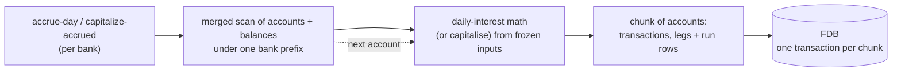
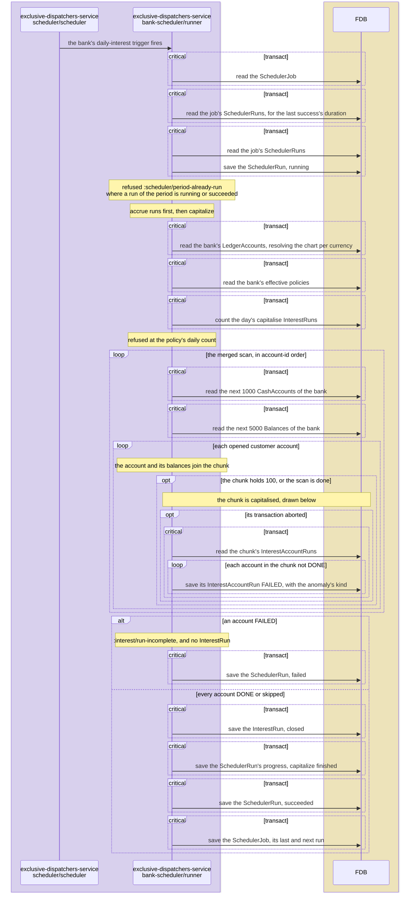
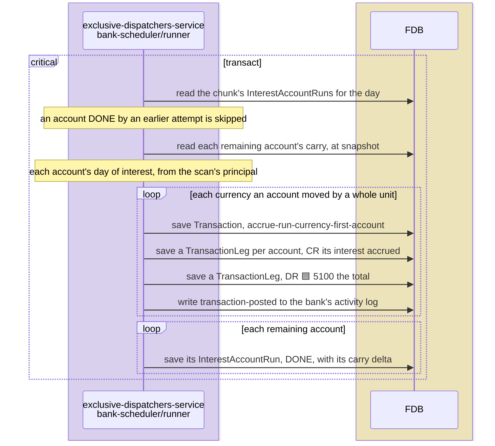
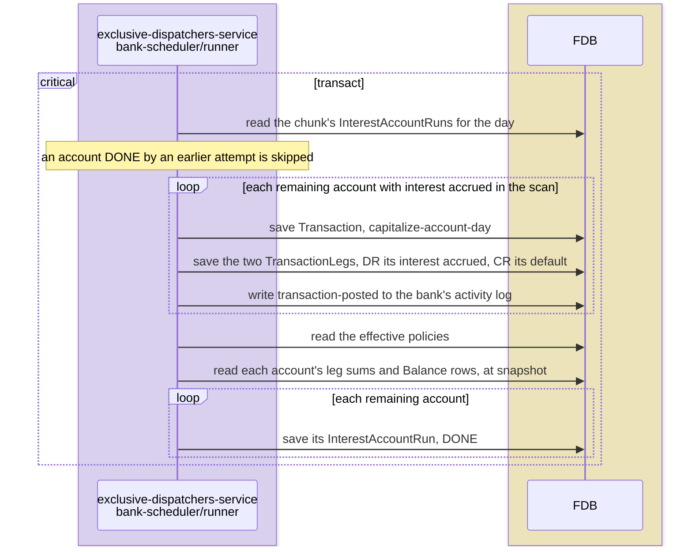

# Interest accrual and capitalisation

## Objective

Customer accounts earn interest. The bank computes it daily,
records it against the customer's balance, and capitalises it
at the cadence the bank's job sets, daily by default, so the
customer can spend it. Across millions of
accounts and 365 days, fractions of a penny per day add up to
real money. The math has to conserve every micro-unit.

This TDD describes the daily-accrual + capitalisation
machinery: the integer-only arithmetic with sub-minor-unit
carry; a pass that streams a bank's accounts with their
balances and appends their postings in chunks; and the
per-account rows that make a re-run safe and hold the carry.

In scope: the `interest` brick, the daily-interest
formula and carry mechanism, accrual and capitalisation
postings, the run pattern that processes a bank's customer
accounts.

Out of scope: rate setting and product configuration —
see [cash-account-products.md](cash-account-products.md);
the substrate that records and applies legs, covered in
[transactions-and-balances.md](transactions-and-balances.md);
the policy filters that scope limit checks to specific
transaction types — see
[policy-evaluation.md](policy-evaluation.md).

## Background

Three things make interest math subtle in a way naive
arithmetic gets wrong.

**Sub-minor-unit precision.** Daily interest on £1.00 at 5%
APR is well under a penny. Integer arithmetic that rounds at
the minor unit (pence) every day produces zero — £1 earns no
interest forever. The fix is to track sub-minor-unit residue
between days and only post when the residue accumulates past
one minor unit.

**Penny conservation.** Across millions of accounts and 365
days, the difference between "rounded each day" and
"correctly accumulated" can be measurable money. A bank that
loses pennies systematically is a bank with an audit
problem. The arithmetic must be deterministic and lossless
across run boundaries.

**A run beside payments.** A run posts to every account in the
bank while payments post to the same accounts. A posting that
read and rewrote a balance row, the customer's or the bank's,
conflicted with every payment and every other posting to that
row, and a run of a thousand accounts beside payments failed a
fifth of them.

The design answers all three with **integer micro-unit
arithmetic with carry between days**, and postings that append.
No floating point. Every balance a run moves is a sum of legs, as
[ADR-0042](../adr/0042-a-cash-accounts-balance-is-the-sum-of-its-legs.md)
decides, so a chunk records its legs and its rows and reads
nothing a payment writes. The carry is the run's own state, kept
on the account's `InterestAccountRun` rows.

## Proposed Solution

### Reading the diagrams

The sequence diagrams follow
[payments-internal's conventions](payments-internal.md#reading-the-diagrams).
The scheduler's runner is purple, as a processor is: the interest pass
runs inside it and writes the books.

### Architecture

`interest` is the brick. Two top-level operations:

- **`accrue-day`** — iterates a bank's customer accounts and
  accrues per-account interest from the account's available
  balance and the product's rate.
- **`capitalize-accrued`** — iterates the same accounts and
  sweeps any accrued interest into the spendable balance.

Both run the same pass. It streams the bank's accounts paired
with their balances through one merged scan
(`cash-accounts/reduce-accounts-with-balances`, over the
`cash-accounts` and `balances` stores, which share a leading
`bank_id`), and posts them a chunk of accounts per FDB
transaction — the bounded-batch discipline from
[transactions-and-balances.md](transactions-and-balances.md).

Pairing the scans is what lets a posting read nothing a payment
writes. The principal is frozen as the account streams past, and
the chunk's transaction reads only the accounts' run rows and
their carries, which only the run writes.


```mermaid
graph LR
    CMD["accrue-day / capitalize-accrued<br/>(per bank)"]
    SCAN["merged scan of accounts + balances<br/>under one bank prefix"]
    CALC["daily-interest math<br/>(or capitalise) from frozen inputs"]
    CHUNK["chunk of accounts:<br/>transactions, legs + run rows"]
    FDB[("FDB<br/>one transaction per chunk")]

    CMD --> SCAN
    SCAN --> CALC
    CALC --> CHUNK
    CHUNK --> FDB
    SCAN -.->|"next account"| CALC
```

A run for one bank commits a transaction per chunk rather than
per account. A failure loses the chunk in flight, whose
accounts are marked FAILED so the pass can continue; work
already committed stays committed, and the run does not close
until a later pass posts the failed accounts.

### Balance-type vocabulary

Interest uses two balance-type buckets on the customer:

- **`:balance-type-default`** — the customer's spendable
  balance. Together with its pending-outgoing reservation it
  forms the available balance interest is earned on. Receives
  capitalised interest as a credit. The pass reads it and
  never writes it.
- **`:balance-type-interest-accrued`** — interest earned by
  the customer, recorded daily, not yet spendable. Drained at
  capitalisation. The only bucket accrual moves.

Both are sums of the account's legs. The sub-minor-unit
remainder between days is not a balance: it is the sum of the
`carry_delta` on the account's accrual `InterestAccountRun`
rows, read from
`InterestAccountRun_sum_carry_delta_by_bank_kind_account`.

The bank's side lives in the chart of accounts: 5100 interest
expense, the sum of its own legs as 1100 is, 2400 interest
payable, the sum of every customer's interest-accrued bucket,
and the deposit controls the product types roll into. See
[chart-of-accounts.md](chart-of-accounts.md).

### Daily-interest math

Implementation is integer-only at micro-scale (one minor unit
= one million micro-minor-units). The algorithm:

```clojure
;; conceptual; see interest/domain.clj for the actual code
(let [net          (- credit debit)               ; minor units
      bps-factor   100                            ; 1 bps in micro per minor
      annual-micro (* net interest-rate-bps bps-factor)
      ;; carry was sub-minor-unit; treat it as annual-equivalent
      ;; so dividing by 365 returns its daily share exactly
      total-micro  (+ annual-micro (* credit-carry 365))
      daily-micro  (quot total-micro 365)
      whole-units  (quot daily-micro 1000000)
      new-carry    (rem daily-micro 1000000)]
  {:whole-units whole-units :carry new-carry})
```

The clever bit is `(* credit-carry 365)`. The carry is in
micro-minor-units of *daily* residue. By multiplying by 365
before summing with the annual interest, then dividing the
total by 365, the carry's daily share is preserved exactly —
no precision loss in the round-trip.

Rate is annual (in basis points; 500 bps = 5% APR). Day-count
is a simple actual/365. The math is **simple daily interest**
on the account's available balance, and the result lands in
`:balance-type-interest-accrued`. Compounding emerges from the
*cadence of capitalisation*, not from the daily math itself:
once accrued has been swept into default, the next day's
accrual sees the larger balance.

**Available, not posted.** The principal spans buckets — the
posted balance less what a pending outgoing payment has
reserved against it, and not counting money still pending
inbound. Money already committed to a payment stops earning
when the reservation is taken rather than when it settles, and
money that has not arrived has not started earning. It is
computed with `balance-query/available-balance`, the same
definition the limit checks use, so there is one meaning of
available in the system. Spanning several buckets would have
cost a second read on a design that paged accounts; on the
merged scan every bucket the sum needs is already in hand, so
it is arithmetic.

This means the compounding cadence is an **operator decision,
not a math constraint** — see "Capitalisation cadence" below.

### Daily accrual posting

A chunk's accrual is one transaction per currency. It credits
each account's interest-accrued bucket the day's whole units and
debits 5100 interest expense their total:

```
CREDIT customer-account  interest-accrued / posted   whole units earned
CREDIT customer-account  interest-accrued / posted   ...
DEBIT  5100 interest expense  default / posted       the chunk's total
```

An overdrawn principal accrues a charge, so its leg is a debit
and 5100's the opposite of the net. An account whose day came to
no whole unit has no leg, and its row still records the carry's
change. The transaction is keyed on the run, the currency and
the chunk's first account, so a chunk retried after its commit
was lost records once.

Nothing is read back or rewritten. 2400 is the sum of the
interest-accrued buckets and 5100 the sum of its own legs, so the
legs move both, and the bank's books balance after every chunk.
The carry an account opens with is read from the SUM index on its
accrual rows, at snapshot, since only the account's own accrual
writes them.

The transaction carries every account in the chunk, so a customer
sees their accrual as a line on the interest-accrued bucket, and
no customer can read another's: an account's transactions are
listed from its own legs.

### Capitalisation posting

When the customer's `:balance-type-interest-accrued` is
non-zero at capitalisation time, a **two-leg transaction**
moves the accrued amount from the account's interest-accrued
bucket to its spendable default balance:

```
DEBIT  customer-account   interest-accrued / posted    accrued
CREDIT customer-account   default          / posted    accrued
```

Capitalisation is a transaction per account because it *is* the
customer's statement line on their spendable balance. Each bucket
rolls into its control, 2400 and the deposit control of the
account's product type, so the one entry moves both sides of the
bank's books.

The chunk records every account's transaction and then applies
all their legs with one `apply-legs`, which reads the accounts'
sums in one round trip: at snapshot, since a credit reads nothing
a payment writes, unless a limit in force caps the account's
balance, as
[ADR-0042](../adr/0042-a-cash-accounts-balance-is-the-sum-of-its-legs.md)
decides.

#### The scheduler runs the pass


```mermaid
sequenceDiagram
    box rgba(208, 191, 255, 0.45)
    participant Q as exclusive-dispatchers-service<br/>scheduler/scheduler
    participant R as exclusive-dispatchers-service<br/>bank-scheduler/runner
    end
    box rgba(255, 236, 153, 0.5)
    participant DB as FDB
    end
    Q->>R: the bank's daily-interest trigger fires
    critical transact
    R->>DB: read the SchedulerJob
    end
    critical transact
    R->>DB: read the job's SchedulerRuns, for the last success's duration
    end
    critical transact
    R->>DB: read the job's SchedulerRuns
    R->>DB: save the SchedulerRun, running
    end
    Note over R: refused :scheduler/period-already-run<br/>where a run of the period is running or succeeded
    Note over R: accrue runs first, then capitalize
    critical transact
    R->>DB: read the bank's LedgerAccounts, resolving the chart per currency
    end
    critical transact
    R->>DB: read the bank's effective policies
    end
    critical transact
    R->>DB: count the day's capitalise InterestRuns
    end
    Note over R: refused at the policy's daily count
    loop the merged scan, in account-id order
    critical transact
    R->>DB: read the next 1000 CashAccounts of the bank
    end
    critical transact
    R->>DB: read the next 5000 Balances of the bank
    end
    loop each opened customer account
    Note over R: the account and its balances join the chunk
    opt the chunk holds 100, or the scan is done
    Note over R,DB: the chunk is capitalised, drawn below
    opt its transaction aborted
    critical transact
    R->>DB: read the chunk's InterestAccountRuns
    loop each account in the chunk not DONE
    R->>DB: save its InterestAccountRun FAILED, with the anomaly's kind
    end
    end
    end
    end
    end
    end
    alt an account FAILED
    Note over R: :interest/run-incomplete, and no InterestRun
    critical transact
    R->>DB: save the SchedulerRun, failed
    end
    else every account DONE or skipped
    critical transact
    R->>DB: save the InterestRun, closed
    end
    critical transact
    R->>DB: save the SchedulerRun's progress, capitalize finished
    end
    critical transact
    R->>DB: save the SchedulerRun, succeeded
    end
    critical transact
    R->>DB: save the SchedulerJob, its last and next run
    end
    end
```

The scheduler fires every bank's jobs from one replica of
`exclusive-dispatchers-service`, and the seeded `daily-interest` job
runs accrual and then capitalisation in one run, saving the
`SchedulerRun`'s progress after each. Neither posts anything at close,
since each chunk posts both sides of the books. A pass that
ends incomplete writes no `InterestRun`, so the daily count does not
stop the pass that finishes it: a forced run, or the next day's.

#### A chunk is accrued


```mermaid
sequenceDiagram
    box rgba(208, 191, 255, 0.45)
    participant R as exclusive-dispatchers-service<br/>bank-scheduler/runner
    end
    box rgba(255, 236, 153, 0.5)
    participant DB as FDB
    end
    critical transact
    R->>DB: read the chunk's InterestAccountRuns for the day
    Note over R: an account DONE by an earlier attempt is skipped
    R->>DB: read each remaining account's carry, at snapshot
    Note over R: each account's day of interest, from the scan's principal
    loop each currency an account moved by a whole unit
    R->>DB: save Transaction, accrue-run-currency-first-account
    R->>DB: save a TransactionLeg per account, CR its interest accrued
    R->>DB: save a TransactionLeg, DR 🟦 5100 the total
    R->>DB: write transaction-posted to the bank's activity log
    end
    loop each remaining account
    R->>DB: save its InterestAccountRun, DONE, with its carry delta
    end
    end
```

#### A chunk is capitalised


```mermaid
sequenceDiagram
    box rgba(208, 191, 255, 0.45)
    participant R as exclusive-dispatchers-service<br/>bank-scheduler/runner
    end
    box rgba(255, 236, 153, 0.5)
    participant DB as FDB
    end
    critical transact
    R->>DB: read the chunk's InterestAccountRuns for the day
    Note over R: an account DONE by an earlier attempt is skipped
    loop each remaining account with interest accrued in the scan
    R->>DB: save Transaction, capitalize-account-day
    R->>DB: save the two TransactionLegs, DR its interest accrued, CR its default
    R->>DB: write transaction-posted to the bank's activity log
    end
    R->>DB: read the effective policies
    R->>DB: read each account's leg sums and Balance rows, at snapshot
    loop each remaining account
    R->>DB: save its InterestAccountRun, DONE
    end
    end
```

A chunk is up to a hundred accounts in one transaction, so an
account's posting and the row recording it commit together, and an
anomaly from any account aborts the chunk, whose rows the pass then
saves FAILED. The accrued amount is the one the scan streamed. The
transaction's idempotency key, `capitalize-<account-id>-<as-of-date>`,
is unique per bank and type, beside the DONE row that skips an account
a second pass reaches. Its `transaction-posted` entry reaches the
activity processor as any posted transaction's does.

Net: the customer's spendable balance grows by `accrued`, and 2400,
summed from the interest-accrued buckets, falls by the amount the
deposit control, summed from the default ones, rises.

### Capitalisation cadence

`capitalize-accrued` is **not constrained to any cadence**. It
sweeps accrued interest into default whenever it is called. The
operator (or whoever schedules the run) chooses the cadence,
and the choice has real customer-facing consequences. Once a
version's interest terms land, the version chooses it for each
account; see "A version's interest terms".

The compounding behaviour falls out of the cadence:

- **Daily.** Accrued is swept into default every day, so the
  next day's interest is computed on the larger available
  balance — effectively daily compounding, which some digital
  banks offer to compete on rate visibility. The accrued
  bucket then holds only the sub-minor carry between runs.
- **Weekly / monthly.** Accrued sits in its bucket and only
  rolls into default at the chosen cadence. Customers see
  the credit less frequently, and compounding happens at
  that cadence too.
- **Annually.** Accrued sits all year. Compounding only on
  the anniversary.

The trade-off is real money. Less frequent capitalisation is
*money on the table for the bank*: a year of accrued sitting
in `:balance-type-interest-accrued` does not itself earn
interest, because the principal is the available balance and
the accrued bucket is not part of it. So the customer earns
less than under a daily-capitalisation product. Different
operators take different positions; the system supports any
choice.

Daily capitalisation is the expensive end of that choice, and
the cost is not in the interest math. It writes a transaction
per account per day, because a capitalisation *is* a statement
line — roughly 365 million transactions a year across a
million accounts. Monthly does not. That is a product decision
with a volume attached, not a tuning knob.

### Run pattern

`accrue-day` and `capitalize-accrued` accept `:bank-id` and
`:as-of-date`. They:

1. Resolve the general-ledger accounts the run will post to,
   before touching any account.
2. Check the platform daily-count limit for this run kind, so
   a second pass for the same bank and day is a rejection
   rather than a double posting.
3. Stream the bank's accounts paired with their balances
   through one merged scan, filtering to *opened* customer
   product types — general-ledger accounts carry no product
   type and fall out here.
4. Accumulate a chunk and post it in one transaction, up to
   the runner's `interest-chunks-in-flight` chunks at once,
   marking a failing chunk's accounts FAILED and continuing.
5. Return `:interest/run-incomplete`, with the processed and
   failed counts, where any account failed.
6. Write the run record closed.

Re-running a date is safe because of the `InterestAccountRun`
row: a second pass finds an account's row already DONE and skips
the posting. The row is written in the same FDB transaction as
the posting, so the work and the record of the work commit
together and a crash cannot separate them. Each transaction is
also keyed — accrual's on the run, the currency and the chunk's
first account, capitalisation's
`capitalize-<account-id>-<as-of-date>` — so a chunk retried
after its commit was lost records once; see
[idempotency.md](idempotency.md).

### Chunk atomicity, run-level resumability

A chunk of accounts is one FDB transaction. Every leg and
every run row in it commits together or not at all,
so an account can never be left with interest credited but no
record that it was processed.

Chunks post side by side, eight at once in
[scheduler.yml](/components/resources/resources/system/scheduler.yml)
and one where the setting is absent. They name disjoint accounts,
and append legs and rows nothing else reads, so they do not
conflict with each other.

Across chunks the run is **resumable but not atomic**. A crash
mid-run leaves earlier chunks committed and later ones
untouched. Re-running the date streams every account again and
skips the ones whose row is already done, posting the ones left
pending or FAILED, which is what makes a re-run safe. No row is
written ahead of the work: an account is either done, and a
re-run skips it, or it is not, and a re-run redoes it — a row
recording that the pass intended to reach it would distinguish
neither.

A failing chunk marks the accounts in it not already DONE as
FAILED and the pass continues, then ends incomplete: no run
record is written, so the daily-count limit does not block the
pass that finishes it. It does not try to isolate the one
account that raised, because a chunk appends legs and rows
nothing else writes — so a failure is a database that is
unwell, or a product whose accounts all fail alike, rather than
one unlucky account in an otherwise good chunk.

This is the bounded-batch discipline applied to a long-
running process: many bounded transactions, predictable
failure modes, forward progress preserved.

### Chart-of-accounts dependency

The bank's side of both entries lands on general-ledger
accounts, so a run resolves the ones its legs move — 5100 and
2400 for accrual, 2400 and the three deposit controls for
capitalisation — **before it touches a single account**. A
bank whose chart cannot take the posting fails before the
books go out rather than after, which matters because both
passes move customer money as they go.

This is one of the few places where the bank's own
bookkeeping is visible from a customer-facing brick. Most
components treat customer accounts as the universe; interest
has to name the bank side too, because the money comes from
somewhere.

### Reading balances at the cut-off

Not built yet. Each chunk takes its principals from the merged scan,
read when the scan reached its accounts, so a run reads its accounts at
as many moments as it has chunks. Money paid during a run from an
account a chunk has read to one a later chunk has not earns a day's
interest twice, on 5100, and money paid the other way earns none. The
books still tie, so no invariant sees it. This section is what
[ADR-0042](../adr/0042-a-cash-accounts-balance-is-the-sum-of-its-legs.md)
means by a run's read at its cut-off, and the order to build it in.

**The cut-off is a commit version, not a time.** At each UTC day
boundary the scheduler's runner saves a `BusinessDayCutoff` for the
day just ended, and the record's commit version, which FDB stamps,
marks the end of that day. A clock time would not do: legs carry the
`created_at` of whichever JVM wrote them, and a leg can commit after
one stamped later, so a cut-off by time is off by clock skew and
commit latency.

**A leg is found by the version it committed at.** `transaction-legs`
stores record versions, and a VERSION index over
`[account_id, version]` at the next meta-data version finds an
account's legs committed after a cut-off. Legs saved before carry no
version, and count as before every cut-off.

**A chunk reads its own principals.** In its transaction, at snapshot,
a chunk reads each account's leg sums and its legs committed after the
day's cut-off, one scan each, issued together, and accrues on the
difference: the account's balance as it stood when the day ended,
whenever the run executes. The scan of later legs is usually empty, as
it holds only what moved since midnight. The merged scan still decides
which accounts a run reaches; it no longer supplies their balances.

**A day is accrued once it has ended.** The run on day D accrues D−1,
and a run for a day with no cut-off yet is refused. A late or repeated
run for a day reads the same cut-off, so it computes the same
principals, and a second run still finds each account DONE and skips
it. Capitalisation needs no cut-off: it sweeps the interest-accrued
bucket, which only runs move.

First, the version index and the cut-off record with its midnight
write; then the chunk's read, with a domain scenario that pays between
two accounts in different chunks while a run is between them; then the
run's date. The scheduler's two limitations on a late day and on a
run before the day ends go when it lands.

### A version's interest terms

Not built yet. A version states its rate as a schedule of steps, each
a set of balance bands, and says when interest is paid, as
[cash-account-products](cash-account-products.md#interest-terms) lays
out. This section is how the passes read the terms, and the order to
build it in.

**A day's rate is a step's bands.** The pass takes the step in force on
the business day and splits the principal across its bands, summing
each part times its rate, where a whole-balance step has one part, the
whole principal at its band's rate:

```clojure
(let [days         (year-days day-count business-day) ; 365, or 366
      annual-micro (reduce + (map (fn [{:keys [portion rate-bps]}]
                                    (* portion rate-bps bps-factor))
                                  (band-portions banding principal bands)))
      total-micro  (+ annual-micro (* credit-carry days))
      daily-micro  (quot total-micro days)]
  ...)
```

The carry is a day's residue whatever the year's length, so dividing by
366 on a leap-year day keeps it exact. The remainder is unchanged, and
a flat rate at actual/365, one step of one band, computes what it does
today.

**A principal at or below zero accrues nothing.** The bands start at
zero, so no band covers an overdrawn balance, and the account is left
out of the chunk as one at a zero rate is. The charge an overdrawn
principal accrues today goes with it.

**The account carries the day it came onto its version.** `version_from_on`,
an epoch day on `CashAccount`, is written with `version_id`: when the
account opens and when a migration moves it. A relative step counts
from it, and so does a payment on the account's own day, so a migration
starts a relative schedule afresh. Interest accrued before a migration
stays in the bucket and is paid on the new version's schedule.

**Capitalisation reads only the accounts due.** An `InterestAccount`
record per account, in a store of the `interest` brick's own, holds the
account's version, its `version_from_on` and its `next_payment_on`, indexed by
`[bank_id, next_payment_on, account_id]`. The brick writes it from the
cash-accounts changelog, in an event processor of its own, when an
account opens and when a migration moves it, as
[ADR-0021](../adr/0021-changelog-relay.md) has a brick react to another's
records rather than read them. Capitalisation scans that index for
`next_payment_on` on or before the business day instead of streaming
every account, sweeps each, and advances `next_payment_on` in the
chunk's transaction. A day the job missed is paid by the next run, so
capitalisation no longer needs a run every day. An account paid daily
is due every day, and one paid at close, or on a version with no terms,
has no `next_payment_on` and is never read. The sweep's reference names
the frequency rather than saying monthly whatever the cadence.

**Closing pays what has accrued first.** Closing refuses an account
with any balance, `:cash-account/non-zero-on-close`, and under any
payment but daily the interest-accrued bucket holds what is not yet
paid, under one paid at close all of it. `interest/pay-accrued` sweeps
one account's bucket at once, as capitalisation does, keyed
`pay-accrued-<account-id>-<as-of-date>`, and the API takes it as
`POST /v1/cash-accounts/{account-id}/interest-payments`. A tenant pays
the accrued interest, moves the balance out and closes the account; a
second call that day finds the bucket empty and pays nothing, and the
carry, under a minor unit, is forfeited at close.

**A fixed-term account matures.** A version with a `term_months`, as
[cash-account-products](cash-account-products.md#term) lays out, is
opened with a `payout_account_id` on `CashAccount`: an opened account
of the same party, bank and currency whose own version has no term,
which `cash-account` checks at opening, refusing
`:cash-account/payout-account-required` where the version has a term
and none is named, and `:cash-account/invalid-payout-account` where the
one named does not qualify. `InterestAccount` carries `matures_on`,
`version_from_on` plus the term's months, a day the month lacks moving to its
last, indexed by `[bank_id, matures_on, account_id]`. The account
accrues nothing on or after it.

**Maturity never waits on the payout account.** The `daily-interest`
job runs a third pass, after capitalisation, reading the `matures_on`
index for days on or before the business day, and takes each account
through two steps, each in one transaction:

- **Matured.** It pays the accrued interest, as `pay-accrued` does, and
  calls `cash-account/mature-account`, which takes the account from
  opened to a new `matured` status: it accrues nothing, refuses
  credits and allows debits. A suspended account is left until it is
  resumed, and accrues nothing meanwhile.
- **Paid out.** Where the account has no pending amount and its payout
  account is still opened, it records a transaction of type `maturity`
  moving the whole default balance to the payout account's, writing
  `transaction-posted` to the bank's activity log as every posting
  does, so a provider holding balances per account moves the money
  too, and takes the account from matured to closing; the close then
  finishes as any other does.

Where the second step cannot run, because a payment is in flight or
the payout account has closed or been suspended since the account
opened, the account stays matured, its `InterestAccount` recording why
as its `last_error`, and the pass reads it again the next day. The money
is never sent anywhere the customer did not name: the tenant names
another payout account with
`PUT /v1/cash-accounts/{account-id}/payout-account`, and the next run
pays out, or the customer moves the balance out and the tenant closes
the account from matured, as from opened. `matured` is a lifecycle
state, so it takes the ten points of
[lifecycle-transitions](../recipes/code/lifecycle-transitions.md).

First, the terms on the version, with their validation and API, every
existing caller passing a flat rate paid daily; then `version_from_on`, in
the cash-accounts pass of the clean-slate schema reset; then steps and
bands in accrual, with the model's accrual beside it; then the
`InterestAccount` record, its event processor and capitalisation from
its index, with the model's payment days; then `pay-accrued` and its
route; then the term, the payout account and the maturity pass; and
last the console's product drawer and the migration preview, which
compares two schedules rather than two rates.

## Alternatives Considered

- **Floating-point arithmetic.** Compute interest in doubles
  or BigDecimals. Rejected — introduces rounding errors
  unless every operation is carefully framed; produces
  results that depend on operation order; non-deterministic
  across JVM upgrades. Integer micro-unit arithmetic gives
  exact reproducibility.
- **No carry — round to minor unit each day.** Simpler but
  £1 earns no interest forever. Rejected; it's a real bug,
  not a minor inaccuracy.
- **One big transaction for the whole bank's daily accrual.**
  Tempting (one commit, one timestamp, atomic across all
  customers). Rejected — exceeds FDB's 10MB and five-second
  transaction limits, and one corrupt account rolls back the
  whole bank's run. Chunking trades atomicity for
  resumability and bounded resource use.
- **A keyed command per account, fanned out over the bus.**
  Rejected on costing: the fan-out would have serialised on
  the same two ledger rows whatever the account key said, and
  paid retries on top. The work itself is one multiply per
  balance. See
  [interest-batch-pass.md](../plan/interest-batch-pass.md).
- **Daily compounding *as a separate code path*.** Make
  daily-compounding a distinct mode, with the math
  implementing the compounding directly inside the daily
  step. Rejected — the cleaner answer is to capitalise
  daily under the same mechanism. A daily-capitalisation
  cadence gives daily compounding without a parallel code
  path; the math stays simple, and the operator chooses by
  scheduling. See "Capitalisation cadence".
- **Capitalisation as a six-leg transaction** — what this
  design used to do, and no longer does. It passed the amount
  through an `interest-paid` transit bucket and discharged the
  bank's liability per account, for the audit trail the
  transit bucket left. Removed, bucket and all: the trail was
  answering a question the transactions answer better, since a
  cumulative bucket cannot say what was paid *between two
  dates* without something else recording its value at both
  ends — and every account's posting contended on the same two
  ledger rows to produce it. See
  [statementing.md](../plan/statementing.md).
- **Accrual as a row write, its bank side once at close.** What this
  design used to do: accrual raised each account's interest-accrued
  row and its carry without a leg, and posted DR 5100, CR 2400 per
  currency when the run closed. Rejected: the row was a second copy
  of a balance no leg explained, the books were out of balance until
  close, and capitalisation then read and rewrote 2400 and every
  customer's default row, so a run beside payments conflicted with
  them. See
  [ADR-0042](../adr/0042-a-cash-accounts-balance-is-the-sum-of-its-legs.md).
- **The carry on the interest-accrued row, or the latest run row.**
  Rejected: the first is a row the run rewrites, kept only to hold
  state a balance does not need, and the second needs a scan back
  per account to find the last accrual. A sum of changes is one
  index read, whatever days were missed.
- **Storing the interest rate per account.** Would denormalise
  rate from product to account. Rejected — rate is a
  product-version property; storing it per account loses
  the connection to product changes. The pass memoises
  versions for the run instead, collected from the accounts as
  they stream — an account pins a version that may be one the
  bank no longer offers, so enumerating current versions would
  miss accounts.
- **Interest accrual via the changelog relay pattern
  (ADR-0021).** Relayed events react to writes; accrual is
  time-driven, not write-driven. Rejected — wrong tool.
  Accrual is a scheduled batch the `scheduler` brick runs,
  calling the brick's interface; see [scheduler](scheduler.md).

## Known Limitations

- **Each chunk reads its balances at its own moment.** A payment
  between accounts in different chunks during a run is earned on twice
  or not at all; see "Reading balances at the cut-off".
- **Single day-count convention (actual/365).** Other
  conventions (actual/360, 30/360) aren't supported. A
  version's interest terms add actual/actual, dividing by
  366 in a leap year, which some UK providers state; nothing
  is planned for the others.
- **One flat rate per version.** A version carries one
  `:interest-rate-bps`, so a tiered rate, a bonus period or a
  change on a date is a new version and a migration. See "A
  version's interest terms".
- **Interest is simple, not compounding within a period.**
  The accrued bucket does not itself earn interest — the
  principal is the available balance, which the accrued
  bucket is not part of. Compounding therefore follows the
  capitalisation cadence rather than the accrual one, which
  is the trade-off described above.
- **Capitalisation timing is a date, not a financial-period
  boundary.** Calling `capitalize-accrued` with an as-of date
  capitalises whatever is in interest-accrued at that moment;
  it does not validate that the date is a period end or that
  all of the period's accruals have posted. The caller
  sequences.
- **Accrual and capitalisation share one cadence.** They are
  separate tasks, run one after the other by the seeded
  `daily-interest` job, which allows a daily cadence only,
  until a version's payment terms decide which accounts a
  day's capitalisation pays.
- **Interest is paid into the account itself.** A version's
  terms cannot send it to a nominated account, which fixed-rate
  bonds and monthly-income savings commonly do and some require.
- **Payment days are calendar days.** Nothing holds a
  calendar of UK bank holidays, so a payment on the first or
  last working day, or moved to the next working day, cannot be
  stated; the scheduler's days are UTC days.
- **A rate cannot follow a reference rate.** A rate tracking
  Bank Rate, or a bonus as a margin over a variable rate, is a
  new version each time the reference moves, and a migration to
  move the accounts on it.
- **A rate cannot depend on what the customer does.** A rate
  that drops in a month with more than so many withdrawals, or
  holds only while so much is paid in each month, needs a
  condition the terms do not carry, the same question the
  rewards brief asks of a reward; see
  [product-terms](../plan/product-terms.md).
- **A relative schedule counts from the pin, not the first
  deposit.** Notice accounts that pay on the anniversary of the
  first deposit cannot say so.
- **A matured balance stays at the bank.** The payout account is
  the same customer's account at the same bank; a nominated account
  elsewhere, and a choice to renew into a new term, are not
  offered.
- **No reversal helper.** A wrongly-accrued day or a
  wrongly-capitalised period requires a manual reversing
  transaction. The patterns are simple but not packaged.
- **A `RUNNING` interest run is never persisted.** The
  `InterestRun` record is written only once the pass has
  finished, and written closed — which is what lets a crashed
  run retry without tripping the daily-count limit, but means
  an in-flight run has no record and `run-progress` reports a
  nil run status throughout. `RUNNING` exists in
  `InterestRunStatus` and nothing writes it.
- **A missing accrued bucket is logged, not enforced.** Every
  product type the pass admits declares the bucket, and
  `balance-products` is copied from a seeded template rather
  than supplied by a caller, so an account cannot normally
  open without one. Nothing validates the *template*, though,
  so a template seeded short of the bucket would produce a
  whole product line whose accounts accrue nothing and say so
  only in the log.
- **Interest is recognised in whole minor units only.** The
  carry is real money the books do not show — around half a
  minor unit per account, so roughly £5,000 across a million
  accounts. The books still balance, because 2400 is the sum of
  the customers' accrued buckets, both in whole units; the
  carry is an unrecognised obligation rather than a break.
  Recognising it would mean a true-up on the change in
  aggregate carry, netted against the accrual in the same
  run. Deliberately not done.
- **The pass is single-writer per bank.** Two concurrent
  passes for one bank would both read the same carries;
  `check-daily-count` makes that a rejection rather than a
  race, but it is a limit rather than a guarantee.
- **The posting's reference says monthly.** Each capitalisation
  transaction is referenced "Monthly interest capitalization",
  whatever cadence the bank's job runs at, daily by default.

## References

- [ADR-0002](../adr/0002-foundationdb-record-layer.md) —
  FoundationDB Record Layer (per-account atomicity)
- [ADR-0005](../adr/0005-error-handling-with-anomalies.md) —
  Error handling with anomalies
- [ADR-0042](../adr/0042-a-cash-accounts-balance-is-the-sum-of-its-legs.md)
  — A cash account's balance is the sum of its legs (why a run
  appends, and where the carry lives)
- [transactions-and-balances.md](transactions-and-balances.md)
  — Transactions and balances (the substrate; bounded-batch
  discipline)
- [chart-of-accounts.md](chart-of-accounts.md) — the general
  ledger both runs post their bank side to
- [interest-batch-pass.md](../plan/interest-batch-pass.md) —
  why the pass is shaped this way, step by step
- [statementing.md](../plan/statementing.md) — what interest
  an account was paid between two dates, answered from the
  transactions
- [policy-evaluation.md](policy-evaluation.md) — Policy
  evaluation (transaction-type filtering, e.g.
  excluding interest from available-balance limits)
- [scheduler.md](scheduler.md) — the job that runs the pass
  each day, and what it does about a missed or crashed one
- [idempotency.md](idempotency.md) — Idempotency (the
  proposed universal design that interest's per-(account,
  date) key fits into)
- `interest` brick interface
- `cash-account-product` brick (rate via product
  version)
