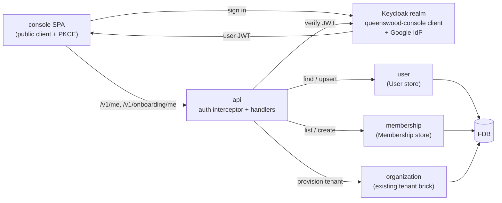

# User onboarding

## Objective

A first-time human signs in to the Queenswood console and ends
up at a working dashboard with an organisation provisioned and
their hand on the wheel. The act of first sign-in atomically
creates three records: a **User** (platform-identity), an
**Organisation** (existing tenant entity), and a **Membership**
binding the two as owner.

This TDD covers the technical pieces: the Keycloak realm
shape that lets the console SPA mint user JWTs, the
`user` and `membership` bricks that own the new
records, the api auth interceptor's user-JWT path, and the
two endpoints the console talks to (`POST /v1/onboarding/me`
and `GET /v1/me`).

The user-onboarding flow is **distinct** from the existing
operator-driven tenant onboarding documented in
[prd/onboarding](../prd/onboarding.md): operators create
tenants with API keys, humans create their own tenant by
signing in. Both paths converge at the `create-bank` command.

In scope: the realm changes (Google IdP + `queenswood-console`
client), the new bricks, the auth interceptor extension, the
two HTTP endpoints, the SPA's auth-state state machine.

Out of scope: the Keycloak chart's external provisioning,
the Google OAuth client (operator job at the Google Cloud
console), invitations, multi-organisation membership UX,
non-owner roles.

## Background

Before this work the platform had two principal shapes:

- **Admin.** A long-lived env-var bearer token used by
  operators and the bootstrap job. The token is checked with
  a constant-time compare against an env var; the principal
  is "the platform" with full authority.
- **Service.** A JWT minted by Keycloak via
  `client_credentials` against a per-organisation service-
  account client. The token's `azp` claim equals the
  organisation identifier; the principal is "this
  organisation, acting through its service account".

Neither principal models "this human, who manages
organisation X". For a management console that needs human
auditability and a self-service onboarding flow, that gap
matters.

The fix is to add a third principal shape — **user** — and
to grow the data model alongside it. The user authenticates
through a third Keycloak client, the new `queenswood-console`
public SPA client, using Authorization Code with PKCE. On
first sign-in the user record doesn't yet exist; onboarding
creates it together with the user's first organisation.

## Proposed solution

### Architecture

Two new bricks own the platform-identity records; the api
base grows a user-JWT branch on the existing auth interceptor
and adds two endpoints; the management console is a new
Polylith base (`console`).



The SPA never talks to FDB or to other bricks directly — it
goes through api on the same origin (the console's nginx
proxies `/v1/*` to api). The bricks accept a transaction
or a `{:record-db :record-store}` config, in line with the
project's processor / store conventions.

### Data model

#### `User`

Lives in `components/schema/resources/schemas/users/`.
Keyed by `user-id` (ULID, prefix `usr`). The federated
subject is the OIDC `(issuer, sub)` pair — `sub` is only
unique within an `issuer`, so both are required for a safe
lookup, and the FDB index is composite over both. Email is a
non-unique secondary index for the future invitation flow.

```protobuf
message User {
  string user_id = 1;
  string issuer = 2;
  string sub = 3;
  string email = 4;
  string name = 5;
  string avatar_url = 6;
  IdentityProvider identity_provider = 7;
  UserStatus status = 8;
  int64 created_at = 9;
  int64 updated_at = 10;
}
```

`IdentityProvider` and `UserStatus` are forward-compatible
enums: `IDENTITY_PROVIDER_GOOGLE`, plus reserved
`GITHUB` / `PASSWORD` slots; `USER_STATUS_ACTIVE` plus a
reserved `SUSPENDED` slot.

FDB record-type registrations:

- `User_by_issuer_and_sub` — unique. Sign-in lookup.
- `User_by_email` — non-unique. Future invitation matching.

#### `Membership`

Lives in `components/schema/resources/schemas/
memberships/`. Keyed by `membership-id` (ULID, prefix `mem`).
The (user, organisation) pair is a unique secondary index
guarding against duplicate memberships of the same human in
the same tenant.

```protobuf
message Membership {
  string membership_id = 1;
  string user_id = 2;
  string organization_id = 3;
  Role role = 4;
  int64 created_at = 5;
  int64 updated_at = 6;
}
```

`Role` reserves `ROLE_OWNER` plus future `ADMIN`,
`DEVELOPER`, `VIEWER` values.

FDB record-type registrations:

- `Membership_by_user` — non-unique.
- `Membership_by_organization` — non-unique.
- `Membership_by_user_and_org` — unique.

### Bricks

#### `user`

Polylith component at `components/user/` with the
canonical `interface / core / domain / store` split.
`upsert-by-sub` is idempotent: first call creates a new
record, subsequent calls apply fresh OIDC claims (email,
name, avatar may have rotated) without disturbing `user-id`,
`issuer`, `sub`, `status`, or `created-at`. `find-by-sub`
takes both issuer and sub explicitly and returns the record
or `nil` (not an anomaly) so callers can drive first-sign-in
onboarding off the nil.

#### `membership`

Polylith component at `components/membership/` with the
same shape. `new-membership` defaults the role to
`role-owner`. The two list operations
(`list-by-user` / `list-by-organization`) traverse the FDB
secondary indexes.

### Keycloak realm

Two additions to the realm-import JSON
(`infra/helm/queenswood/files/keycloak-realm.json` and its
chart-resources sibling):

- **Google identity provider.** `alias: google`, `providerId:
  google`. The `clientId` / `clientSecret` come from a Google
  Cloud OAuth client provisioned out-of-band; placeholders in
  the realm JSON keep the import valid even when real
  credentials aren't wired yet.
- **`queenswood-console` public client.** `publicClient:
  true`, `standardFlowEnabled: true`, PKCE forced to S256
  via the `pkce.code.challenge.method` attribute.
  `redirectUris` cover the Vite dev origin
  (`http://localhost:5173/*`), the in-cluster port-forward
  origin for console (`http://localhost:8082/*`), and
  the public GKE-hosted console host
  (`https://console.*.repldriven.com/*`).

### api auth

The existing authenticate interceptor at
`bases/api/.../auth.clj` grows a user-JWT branch.

Discrimination is on the verified JWT's `azp` claim:

- `azp == admin-bearer-equivalent` (env-var fast path,
  unchanged) → admin principal.
- `azp == "queenswood-console"` (the new client's id, read
  from `console-client-id` in the interceptor config) →
  user-JWT path.
- anything else → existing service-JWT path.

The user-JWT path looks up `user/find-by-sub` (passing
both `iss` and `sub`) and `membership/list-by-user`
against the FDB record-store the same way handlers do. The
resolved principal carries:

```clojure
{:principal-type :user
 :principal-id user-id
 :issuer      iss
 :sub         sub
 :user        user-record-or-nil
 :memberships memberships-or-empty-vector
 :organization-id org-id-or-nil
 :claims      claims
 :roles       #{:user} or #{:user :org}}
```

A user with no memberships carries only `:user`; a user with
at least one membership additionally carries `:org` (the
existing tenant role). That means every existing org-scoped
endpoint continues to work without per-route changes — the
authorize interceptor already intersects the principal's
roles with the route's required-roles set.

`expected-audiences` in the api system config grows the
`queenswood-console` entry: the console client doesn't carry
a custom audience mapper, so its JWTs `aud`-stamp the client
itself.

### Endpoints

Two new route groups, both under `/v1`, both gated by the new
`user` role.

#### `POST /v1/onboarding/me`

Accepts a verified user JWT even when no user record exists
yet (the `:user` role doesn't require a user record). Request:

```json
{ "company-number": "12345678", "bank-name": "Acme Bank" }
```

Handler:

1. Upserts the user from JWT claims.
2. Lists memberships for the user; if non-empty, returns 409
   with the existing organisation identifier — the MVP is one
   user, one organisation.
3. Looks the company number up against the registry of
   record; a failed lookup comes back to the caller as it
   stands.
4. Sends the `create-bank` command with the defaults this
   path fixes: status `bank-status-test`, tier `micro`,
   currencies `["GBP"]`, a company binding snapshotted from
   the lookup, and an owner membership carrying `role-owner`
   for the signed-in user. The command itself rejects
   `:onboarding/company-not-active` when the snapshot is not
   active. It is the same command the operator-driven
   onboarding sends, with the user-facing defaults filled
   in.
5. Returns 201 with the user, the rich organisation (party,
   accounts, client-id, one-time client-secret), and the
   membership.

The organisation, its party, its accounts and the owner
membership are written in one FDB transaction, which re-runs
the sole-membership check inside itself: a duplicate-tab race
rejects `:membership/already-exists` on the second command
and leaves nothing half-created. Step 1's user upsert is the
one write outside that transaction, and repeating it is
harmless.

#### `GET /v1/me`

Accepts a verified user JWT. Returns 200 with the user and
memberships when a user record exists, 404 when it doesn't
(the SPA uses the 404 to redirect to onboarding). The handler
reads from the resolved auth context — the user and
memberships are already attached by the authenticate
interceptor, so the handler is just a shape-and-status
decision.

### console SPA

`bases/console/` is a new Polylith base. Svelte + Vite,
the same pattern the operator SPA used. Three states, one
screen each:

- **Sign-in.** A single "Sign in with Google" button calls
  `kc.login({ idpHint: "google" })`. The browser navigates to
  Keycloak and never returns from that call.
- **Onboarding.** A single-field form for the organisation
  name, posts to `/v1/onboarding/me`, transitions on 201.
- **Dashboard.** The welcome screen — name, avatar,
  organisation identifier.

`keycloak-js` is the only runtime dependency. The SPA reads
its Keycloak URL from `/env.js`, a runtime-rendered nginx
endpoint that returns
`window.__env = { keycloakUrl, keycloakRealm, keycloakClientId }`.
That lets the same image work in kind dev (port-forwarded
Keycloak) and GKE (public Keycloak) without rebuilds. Vite
dev falls back to `VITE_KEYCLOAK_*` env vars when `/env.js`
isn't served.

The SPA's nginx also proxies `/v1/*`, `/oauth/*`, and
`/.well-known/*` to api, so the console stays same-origin and
avoids CORS entirely.

### Chart wiring

`infra/helm/queenswood/`:

- `console` block in `values.yaml`: enabled, replicas, port,
  image-pull policy, plus a `keycloakPublicUrl` value the
  chart wires into the pod env.
- `keycloak.consoleClientId` so the api auth interceptor
  knows which `azp` discriminates user JWTs.
- `templates/console.yaml` — Deployment + Service.
- `templates/httproute.yaml` — second HTTPRoute on
  `gateway.consoleHost` so the SPA serves on its own
  hostname; the Keycloak `redirectUris` and `webOrigins` stay
  scoped to that host.

`infra/docker/bake.hcl` gets a `console` target in the
`default` group; `justfiles/deploy.just`'s `kind-up` loop is
extended to include `console` in the local-registry
push.

## Verification

The end-to-end flow:

1. **Realm imports.** `kubectl logs deploy/queenswood-keycloak-
   dev` shows the realm imported with both
   `queenswood-admin` and `queenswood-console` clients plus the
   Google IdP entry.
2. **Sign-in screen renders.** The console reaches
   `console` (port-forward or Gateway) and shows the
   "Sign in with Google" button.
3. **Authorization Code round-trip succeeds.** With a real
   Google OAuth client wired into the realm, clicking the
   button bounces through Keycloak → Google → Keycloak →
   console with a valid token in browser storage.
4. **Onboarding 201.** Submitting the org-name form returns
   201 with the new user, organisation, and membership; the
   console transitions to the dashboard.
5. **/v1/me after refresh.** A page refresh hits
   `/v1/me`, gets 200 with the same user and the single
   membership, and renders the dashboard directly.
6. **FDB state.** A quick exec into api against the
   record store confirms one `User` row and one `Membership`
   row keyed by the same user identifier.
7. **Idempotency.** Sign out, sign back in. `/v1/me` still
   returns the same `user-id` and the same single membership;
   no second organisation gets created.
8. **Service JWT path unchanged.** A `client_credentials`
   exchange against an organisation's service account still
   issues a JWT that authenticates against existing
   `/v1/cash-accounts` etc. — the user branch is purely
   additive.
9. **Admin path unchanged.** The bootstrap-time admin bearer
   continues to authorise the seed flow.

## Risks called out

- **Google OAuth client.** The Google IdP entry imports with
  placeholder credentials so the realm comes up; real
  credentials need provisioning at the Google Cloud console
  and either committing into a `.gitignore`'d values file or
  supplying via Helm `--set` at install time. Until then the
  sign-in button is dead.
- **Audience handling.** The console client mints tokens
  whose `aud` is the client itself. The api verifier's
  `expected-audiences` list now includes `queenswood-console`
  alongside the per-status banking audiences; missing this
  entry would 401 every user JWT.
- **Realm JSON drift.** Two copies of the realm JSON exist
  (chart sibling under `infra/helm/queenswood/files/` and
  resources sibling under `components/resources/
  resources/bank/`). Both have to move together or imports
  in different deployment paths diverge.
- **User upsert outside the create transaction.** The
  `create-bank` command writes the organisation, its party,
  its accounts and the owner membership together, but the
  user upsert in step 1 of the handler runs before it and on
  its own. A user who abandons onboarding is left with a user
  record and no membership; nothing cleans that record up,
  and the next sign-in reuses it.
- **Token lifetime vs SPA UX.** Keycloak's default access
  token lifetime is 5 minutes. The SPA's API wrapper calls
  `kc.updateToken(30)` before every call, so the token
  refreshes transparently — but a tab left open longer than
  the refresh-token lifetime needs a fresh sign-in.
- **Single user per organisation.** The MVP's one-user-one-
  org constraint is enforced at the onboarding handler, not
  in the data model. Adding invitations means relaxing the
  409 check and adding the invitation record + acceptance
  flow.
- **Operator SPA.** The operator SPA was removed and will be
  rebuilt later as a focused `bank-operator`. Its
  `queenswood-ops` Keycloak realm stays in place for that
  future SPA; the new `console` serves org users, and the two
  will live side by side once the operator SPA returns.
