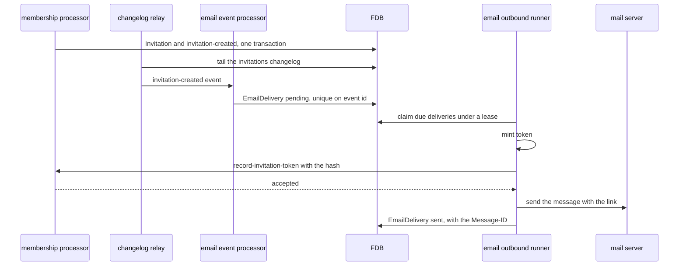

# Outbound email

> **Status: proposal.** Nothing that sends email exists. What the design
> reuses — mono's `smtp` brick and its Mailpit catcher, the changelog
> relay, the webhook brick's claimed-intent runner, the command
> dispatcher — exists and is named as such in Background. Everything
> under Proposed Solution is the build list, and "The first slice" says
> what comes first.

## Objective

The platform emails an invitee the link that accepts their invitation,
the moment the invitation is created or sent again, through the mail
server its installation names. This TDD says which brick reacts to an
invitation, how the intent to send is recorded before the send, where
the link's token is minted and how its hash reaches the invitation
without the plaintext crossing the bus, what the message carries, which
service hosts the adapter, and how a mail server is provided locally,
in the kind cluster and at an installation.

In scope: the `email` component — its event processor, its
`EmailDelivery` record and its outbound runner; the
`record-invitation-token` command it sends; the message and the link;
the adapter's hosting and configuration; Mailpit in the monolith's dev
profile and the chart; the SMTP values and credential at an
installation; and the tests.

Out of scope: the `Invitation` record, the invitation changelog and the
`record-invitation-token` guard, which [access.md](access.md) covers;
the `smtp` brick, which mono's SMTP TDD covers; the accept screen the
link lands on, which [access.md](access.md) covers under The console;
emails other than invitations, which the access PRD lists as open;
Keycloak's own mail, which it never sends, since every person signs in
through a federated identity and [authentication.md](authentication.md)
has no local account to verify; and bounce handling.

## Background

- **The `smtp` brick.** mono's `com.repldriven.mono.smtp.interface`,
  on the classpath since the v0.0.29 pin: `send` over SMTP submission,
  `render` as RFC 5322 text, and the `smtp/client` component holding
  the host, port, `:security`, credential and default from. Nothing in
  Queenswood uses it.
- **The Mailpit catcher.** mono's `mailpit/container` kinds in the
  `testcontainers` brick and
  `testcontainers/mailpit-test.yml` in `test-resources`, wiring a
  container, its SMTP and API ports, and an `smtp/client` pointed at it.
- **The changelog relay.** `changelog-relay/envelope-handler` and
  `changelog-relay/runners` in `exclusive-dispatchers-service`, one
  handler and one cursor per store, as
  [ADR-0021](../adr/0021-changelog-relay.md) describes.
- **The claimed-intent runner.** `webhook/outbound-runner`: claims due
  deliveries under a lease in one transaction, sends each outside any
  transaction, records the outcome in another, retries on a geometric
  schedule. `claim-due-deliveries` in the webhook brick's `store.clj`.
  It and `webhook/event-processor` run in `external-adapters-service`
  from `system/webhook.yml`.
- **The command dispatcher.** mono's `command` brick sends a command
  and awaits its reply. The `api` base's `commands/send` is the one
  caller today.
- **The invitation.** `Invitation` under `schemas/memberships/`, and
  the link's token minted and hashed by
  `membership/new-invitation-token`, whose plaintext the API returns.

## Proposed Solution

### The flow

On the system diagram this is an event reaching an external adapter,
which writes an intent and polls it: `Write [Intent]`, `Poll [Intent]`.
The adapter starts from an event rather than a command because nothing
waits for an email's outcome, as the webhook adapter does.

### The `email` component

`components/email/` with `domain.clj`, `store.clj`, `events.clj`,
`outbound.clj`, `message.clj`, `system.clj` and `interface.clj`. It is
named for the protocol rather than a provider:
[ADR-0020](../adr/0020-providers-are-deployment-facts.md) keeps the
provider in the `smtp/client` configuration. It acts on its own
`EmailDelivery` records, and reads across domains the way the webhook
component does, through `membership-query`, `bank-query` and `user`.

Two component kinds, registered from `system.clj`:

- **`email/event-processor`**, wrapped in mono's
  `event-processor/event-processor` and subscribed to
  `invitations-event`. For `invitation-created` and
  `invitation-resent` it writes one pending `EmailDelivery` and
  acknowledges after the commit. Any other event name is acknowledged
  and ignored.
- **`email/outbound-runner`**, which claims due deliveries and sends
  each, below.

### Records

`EmailDelivery` under `schemas/emails/`, in its own store:

- Delivery id (prefix `eml`), bank id, kind (invitation), invitation
  id, and the `expires_at` the event carried.
- The changelog event id, under a unique index, so a relay redrive
  writes nothing twice.
- Status: pending, in flight, sent, superseded, failed.
- `claim_lease_expires_at`, `claimed_by`, `attempts`,
  `next_attempt_at`, `last_error`, and the `message_id` the mail server
  was handed, each `optional`.
- `created_at` and `updated_at`.

Indexed by the event id and by status with `next_attempt_at`, which is
what a claim scans. The declaration follows
[schema-evolution](../recipes/code/schema-evolution.md): `version`
bumps once and the store carries it as `since`. The recipient's address
is not stored: it is read from the invitation at send, so a withdrawn
invitation's address is not kept twice.

### Sending one delivery

For each claimed delivery the runner:

1. Reads the invitation, its bank's name and the inviter's name. An
   invitation that is no longer pending, or whose `expires_at` differs
   from the delivery's, is marked superseded and nothing is sent.
2. Mints a token with `membership-query/new-invitation-token`, the one
   place the token's length and hash are decided.
3. Sends `record-invitation-token` with the bank id, invitation id,
   `expires_at` and the hash, and awaits the reply. A rejection —
   `:invitation/superseded` or `:invitation/invalid-status` — marks the
   delivery superseded. A failure or no reply is a failed attempt.
4. Sends the message through `smtp/send`. An anomaly is a failed
   attempt.
5. Marks the delivery sent with the Message-ID `send` answered.

A failed attempt increments `attempts` and sets `next_attempt_at` from
the webhook runner's geometric schedule, and past the last attempt
marks the delivery failed. The next attempt mints a fresh token, so an
email that went out but was never recorded as sent is followed by one
whose link works and whose predecessor's does not. The plaintext token
exists in the runner's memory and the message, and nowhere else.

### The command

`record-invitation-token` is a `membership` processor command on the
`memberships-command` topic, its Avro payload
`schemas/memberships/record-invitation-token.avsc.json` registered in
`avro-schemas.yml`. The guard is in [access.md](access.md). The runner holds a
dispatcher for the topic and its reply topic, as the `api` base does.

### The message

`message.clj` builds the `smtp/send` map from the invitation:

- **To** the invited address as typed.
- **Subject** `<inviter> invited you to <organisation> on Queenswood`.
- **Text and HTML** naming the organisation, the role, who invited,
  when the link expires, and the link.

The link is `<console-url>/#/invitations/<invitation-id>?token=<token>`,
the id and token in the fragment so neither reaches a server log.
`console-url` is the runner's configuration, and the from address is
the `smtp/client`'s.

### Hosting and configuration

`system/email.yml` under `components/resources/resources/system/`,
included by `external-adapters-service` and `monolith-service`:

- `event-processor-impl` and `event-consumer` on `invitations-event`,
  consumer group `email-service-invitations-event`.
- `outbound-runner`, with its id minted per replica, so the group
  needs no single-replica pin under
  [ADR-0019](../adr/0019-processor-packaging.md).
- `dispatcher` for `memberships-command` and its reply topic.
- `smtp`, an `smtp/client` from `!env SMTP_HOST`, `SMTP_PORT`,
  `SMTP_SECURITY`, `SMTP_USERNAME`, `SMTP_PASSWORD` and `SMTP_FROM`.
- `console-url` from `!env CONSOLE_URL`.

The `external-adapters` base bare-requires the `email` interface, and
the project's `deps.edn` lists the brick.

### A mail server locally

- **The monolith's dev profile** includes mono's Mailpit group under
  `smtp` in place of the environment-driven client, and logs the
  container's API URL at start, which is also its web inbox.
- **The kind cluster.** A `mailpit.yaml` template, rendered when
  `mail.catcher.enabled`, runs `axllent/mailpit` with a Service on 1025
  and 8025 and an HTTPRoute for the inbox. `values-dev.yaml` and
  `values-monolith.yaml` enable it and point `SMTP_HOST` at the
  Service with `SMTP_SECURITY` `none`.

### A mail server at an installation

Google Cloud refuses outbound port 25 and allows submission on 587 and
465, so an installation names a submission provider:

- **Values.** `mail.smtp.host`, `port`, `security`, `username` and
  `from` in the installation's values, rendered into
  `external-adapters-service`'s environment.
- **The credential.** The provider's password in Secret Manager, read
  by an `ExternalSecret` on the destination cluster into the Secret
  that fills `SMTP_PASSWORD`, as
  [external-secrets](../recipes/infra/external-secrets.md) describes.
- **The sending domain.** The provider's SPF, DKIM and DMARC records in
  the installation's zone. A provider with no API for its DKIM keys
  makes this a recipe rather than a kind, as
  [ADR-0025](../adr/0025-building-blocks-and-what-cannot-be-one.md)
  says.

### The first slice

1. The `membership` processor and `membership-query` split, the
   invitation changelog and its relay runner, and the token leaving the
   API, under [access.md](access.md)'s slice 3.
2. The records: `EmailDelivery` under a version bump, and the guard
   green under `just test-all`.
3. The `email` brick: the event processor, the runner, the message, and
   `record-invitation-token` in the `membership` processor.
4. The wiring: `system/email.yml`, the external-adapters base and
   project, and Mailpit in the monolith's dev profile.
5. The accept screen, under [access.md](access.md).
6. The chart: Mailpit for kind, then the values, credential and DNS
   records for an installation, with a recipe for the provider.

### Tests

- **The `email` brick** covers the retry schedule and give-up; the
  superseded rules against a withdrawn, accepted and resent invitation;
  the link and message against `smtp/render`; the event processor
  writing one delivery for a repeated event id; and the claim under a
  live and a passed lease, against FDB under `with-test-system`.
- **The `membership` brick** covers `record-invitation-token` refusing
  a superseded `expires_at`, an expired and a non-pending invitation,
  and replacing an earlier hash.
- **API scenarios** in `test-api-scenarios/scenarios/access/`, with
  Mailpit in the scenario system and a verb that reads the latest
  message to an address: invite and accept with the emailed token;
  resend, with the first email's token refused and the second's
  accepted; withdraw before the send, with no email; and the operator's
  create with an owner email reaching the owner.

## Alternatives Considered

- **Sending from the event processor**, with no intent. Rejected: a
  send that succeeds and an acknowledgement that fails send the email
  again on redelivery, and a mail server that is down holds the
  subscription rather than a row.
- **The membership processor sending the email.** Rejected: the send is
  a call outside the platform, which the adapter makes after recording
  the intent, and membership would learn what an invitation is
  delivered by.
- **The token minted by the API or the membership processor** and
  carried to the adapter. Rejected: the plaintext would sit on the bus
  or in a store, since only the hash is kept.
- **A second hash on the invitation**, one shown to the inviter and one
  emailed. Rejected with the shown link, which [access.md](access.md)
  removes.
- **A provider's HTTP API** rather than SMTP. Rejected: SMTP names no
  provider, and mono's `smtp` brick exists.
- **Keycloak's SMTP for invitations.** Rejected: Keycloak knows no
  invitation, and its mail templates are its own flows' only.

## Known Limitations

- **The inviter is not told of a failed send.** A delivery marked
  failed is a row nobody reads, and the invitation looks pending.
- **No bounce handling.** A message the server accepted and could not
  deliver bounces to the from mailbox.
- **Provider limits are not enforced.** The runner sends as fast as it
  claims.
- **Plain templates.** The message is built in Clojure, with no
  per-organisation branding.
- **The link's console URL is one per installation.** An installation
  serving two consoles cannot say which the link opens.

## References

- [access](../prd/access.md) — Access, the product requirements that
  say what an invitation email carries.
- [access.md](access.md) — the invitation, its changelog and the guard
  on the token.
- [webhooks.md](webhooks.md) — the claimed-intent runner this adapter
  copies.
- [processor-bricks.md](processor-bricks.md) — the command the
  `membership` processor adds.
- [transaction-processing.md](transaction-processing.md) — intent
  before the external call.
- [ADR-0019](../adr/0019-processor-packaging.md) — Processor packaging,
  why the adapter runs in external-adapters.
- [ADR-0020](../adr/0020-providers-are-deployment-facts.md) — Providers
  are deployment facts, why the brick names no provider.
- [ADR-0021](../adr/0021-changelog-relay.md) — Changelog relay, which
  carries the invitation to the adapter.
- [external-secrets](../recipes/infra/external-secrets.md) — the SMTP
  credential at an installation.
- [RFC 6409](https://www.rfc-editor.org/rfc/rfc6409) — Message
  Submission for Mail, the port and protocol the adapter uses.
