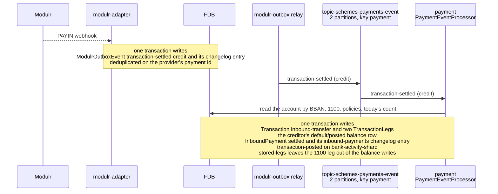
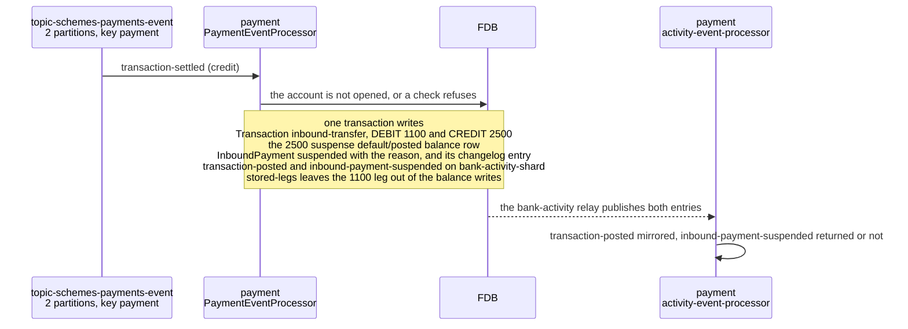
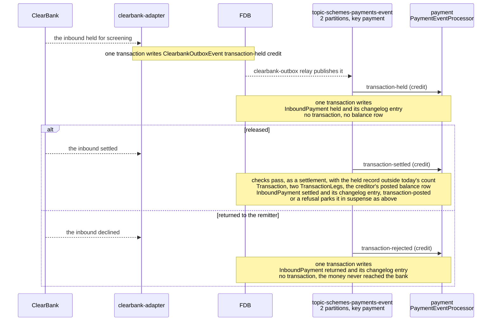
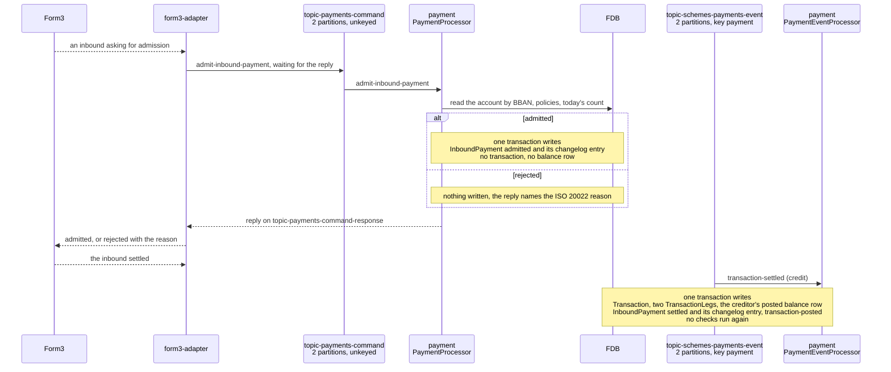
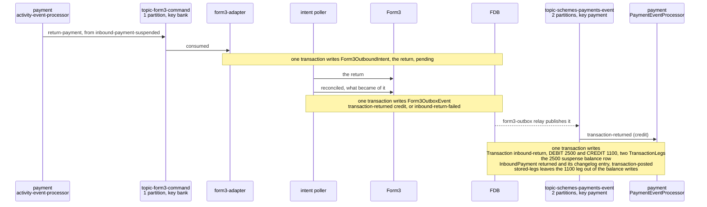

# Inbound payments

> **Status: implemented.**

## Objective

Show how an inbound payment, arriving at a Queenswood account through UK
Faster Payments, moves through the platform: the provider's report that
it settled, the checks that decide whether the account takes it, where
the money goes when it cannot, and how a provider that holds, admits or
returns payments changes the path, with the records each FDB
transaction writes.

In scope: an inbound settled, parked in 2500 suspense, held then
released or returned, admitted before it settles, and returned from
suspense to its sender.

Out of scope: the provider declaration and the adapter contract, see
[payments.md](payments.md); internal and outbound payments, see
[payments-internal.md](payments-internal.md) and
[payments-outbound.md](payments-outbound.md); how a policy is evaluated,
see [policy-evaluation.md](policy-evaluation.md); how a balance is
kept, see [chart-of-accounts.md](chart-of-accounts.md).

## Background

- **The report.** The bank's provider tells its adapter of an inbound
  by webhook, and the adapter writes the scheme event to its outbox,
  which a `changelog-relay` runner in `exclusive-dispatchers-service`
  publishes on `topic-schemes-payments-event`, two partitions, keyed
  by the payment.
- **The processor.** `payment`'s `PaymentEventProcessor`, in
  `financial-processors-service`, handles `transaction-settled`,
  `transaction-held`, `transaction-rejected` and `transaction-returned`
  carrying `debit-credit-code` credit in `events/inbound.clj`, and
  `admit-inbound-payment` on `topic-payments-command`.
- **What the provider declares.** `inbound: notified` where the
  provider settles and then tells the platform, `admitted` where it asks
  first; `returns: [inbound]` where the platform may send a payment
  back; `screening: provider` where the provider holds payments while it
  screens them. Modulr and ClearBank are notified and screen, holding
  an inbound they are screening; Form3 is admitted and returning, and
  screens nothing.
- **Statuses.** An inbound payment is `admitted`, `settled`, `held`,
  `suspended` or `returned`.

## Solution

- A settlement is deduplicated on `scheme-transaction-id`, and a hold
  matched on end-to-end id, creditor and amount.
- A BBAN matching no account fails the handler and is dead-lettered,
  since every address was issued through the adapter.
- An admission rejected records nothing, since the payment never
  arrived.

### Settled

The settlement resolves the creditor by BBAN, checks the account is
opened and that the inbound capability and daily count allow it, and
posts DEBIT 1100 / CREDIT creditor. 1100 holds no row, its balance
being the sum of its legs, per
[ADR-0039](../adr/0039-cash-at-correspondents-balance-is-the-sum-of-its-legs.md),
so the only balance row written is the creditor's, and the current
account control it rolls into is summed from it. The transaction names
the creditor as the account the scheme moved the money through, so its
`transaction-posted` entry nets to nothing at a provider holding a
balance per account, which credited it itself. The `payments-event`
relay turns the changelog entry into `payment.inbound-settled`.

### Parked in suspense

An inbound the receiving account cannot take, because it is not opened
or a policy refuses it, is kept in the bank's 2500 suspense rather than
lost, recording the ISO 20022 reason as `suspense-reason-code`. 2500
keeps a stored row, which only these rare postings write. Under
`balances: per-account` the `transaction-posted` entry moves the money
from the receiving account's provider account to the bank's own funds,
as [payments-internal.md](payments-internal.md) describes. Under
`returns: [inbound]` the `inbound-payment-suspended` entry sends it
back, as below; otherwise it stays suspended for the bank to resolve.

### Held, then released or returned

A provider that screens holds an inbound before it settles, ClearBank
here and Modulr through its compliance notification. The platform
records the hold with no money moving, and the settlement or rejection
that follows finds it by end-to-end id, creditor and amount. A hold for
an account that is not opened is ignored, so its settlement parks in
suspense.

### Admitted before it settles

Under `inbound: admitted` the provider asks before an inbound settles,
and the adapter waits for `payment`'s answer until the provider's
deadline, rejecting with `NARR` where none came. `payment` admits where
the BBAN names an opened account and the checks a settlement runs pass,
and rejects otherwise: `AC01` for a BBAN matching no account, `AC04` for
one closed, `AC06` for one not opened, `AG01` for a payment a policy
refuses. The business-day counts include admitted payments, so two
admitted at once cannot pass one limit between them. An admission
redelivered for a payment already recorded answers admitted and records
nothing. A settlement for an admitted payment whose account has since
stopped being opened parks it in suspense.

### Returned from suspense

Under `returns: [inbound]` the activity event processor sends a
suspended inbound back with its reason. The adapter learns the return
was delivered when it next reconciles, and reports
`transaction-returned` (credit), deduplicated on the provider's id for
the inbound, which empties suspense of the payment. A return the
provider refuses or does not deliver is reported as
`inbound-return-failed`, and the payment stays suspended carrying it as
`return-failure-reason`. A second report is a no-op, and one for a
payment not suspended fails the handler.

### Tests

- **`payment`** — settlement and its checks, parking in suspense,
  holds, admission and each reason it rejects with, and the return
  transitions and their refusals.
- **`<provider>-adapter`** — each provider event mapped to its scheme
  event, every amount converted, an unauthenticated delivery refused,
  and, for Form3, admission answered from `payment`'s reply.
- **`<provider>-simulator`** — `/simulate/inbound-payment` firing a
  settlement, or a hold that settles or returns, and on a simulator
  that asks for admission, sending the request first.
- **`test-api-scenarios`** — the inbound journeys, settled, held then
  released or returned, on every provider that carries each, with an
  admission admitted and one refused, and an inbound returned.

## Alternatives Considered

- **Returning money a policy refuses, whatever the provider.**
  Rejected: a provider that only notifies has no return instruction,
  so parking stays the path wherever `returns` lacks `inbound`.
- **The adapter deciding an admission from the query bricks.**
  Rejected: the limit checks and business-day counts are `payment`'s,
  and a second copy in the adapter would drift from the one a
  settlement applies.
- **Admitting every inbound and parking what cannot be applied.**
  Rejected under `inbound: admitted`: where the scheme asks, refusing
  at the door keeps money the bank cannot apply out of suspense.

## Known Limitations

- **A suspended inbound is never resolved** except by a return under
  `returns: [inbound]`.
- **A return the provider refuses stays in suspense.** The adapter logs
  it and the payment stays `suspended` for the bank to resolve by hand.
- **A return is reported by asking.** The provider's notification of a
  delivered return names no payment, so the adapter learns of it when
  it next reconciles, after `reconcile-after-ms`.
- **An admission not answered in time is rejected.** The payment is
  refused with `NARR` and the sender's bank tells its customer.
- **An admission answered after the deadline is lost.** Form3 fails the
  admission, and a payment the platform admitted by then stays
  `admitted`.
- **An admitted inbound the scheme never settles stays `admitted`.**
- **Identical holds are one hold.**
- **Settlement order is the provider's.** A settlement delivered before
  its hold settles as a new inbound and leaves the hold `held`.
- **Money arriving as an account closes refuses the close.** An inbound
  the provider takes between a close being accepted and carried out
  leaves a per-account provider refusing the close for its balance: the
  account returns to where it closed from, the inbound is parked, and a
  second close succeeds once the parked money has moved to own funds.
- **Nothing is screened under `screening: bank`.** No payment is held
  until a screening design exists, so an installation on rails screens
  outside the platform.

## References

- [payments](../prd/payments.md) — the product requirements this design
  serves.
- [payments.md](payments.md) — the provider declaration and the adapter
  contract.
- [payments-internal.md](payments-internal.md) — internal payments, and
  the mirroring a parked inbound takes.
- [payments-outbound.md](payments-outbound.md) — outbound payments.
- [policy-evaluation](policy-evaluation.md) — the checks an inbound
  runs.
- [chart-of-accounts](chart-of-accounts.md) — 1100 and 2500.
- [ADR-0039](../adr/0039-cash-at-correspondents-balance-is-the-sum-of-its-legs.md)
  — 1100 summed from its legs.
- [ISO 20022 external code sets](https://www.iso20022.org/catalogue-messages/additional-content-messages/external-code-sets)
  — the reason codes an admission rejects with.
