# Inbound payments

> **Status: implemented.**

## Objective

Show how an inbound payment, arriving at a Queenswood account through UK
Faster Payments, moves through the platform: the provider's report that
it settled, the checks that decide whether the account takes it, where
the money goes when it cannot, and how a provider that holds, admits or
returns payments changes the path, with the records each FDB
transaction writes.

In scope: an inbound settled, parked in 2500 suspense, held then
released or returned, admitted before it settles, and returned from
suspense to its sender.

Out of scope: the provider declaration and the adapter contract, see
[payments.md](payments.md); internal and outbound payments, see
[payments-internal.md](payments-internal.md) and
[payments-outbound.md](payments-outbound.md); how a policy is evaluated,
see [policy-evaluation.md](policy-evaluation.md); how a balance is
kept, see [chart-of-accounts.md](chart-of-accounts.md).

## Background

- **The report.** The bank's provider tells its adapter of an inbound
  by webhook, and the adapter base's webhook handlers write the scheme
  event to its outbox, which `changelog-relay/runners` in
  `exclusive-dispatchers-service` publishes on
  `topic-schemes-payments-event`, partitioned by the end-to-end id,
  else the transfer.
- **The processors.** `payment/event-processor`, in
  `financial-processors-service`, handles `transaction-settled`,
  `transaction-held`, `transaction-rejected` and `transaction-returned`
  carrying `debit-credit-code` credit in `events/inbound.clj`, and
  `payment/processor` handles `admit-inbound-payment`, which the Form3
  adapter sends unkeyed on `topic-payments-command`.
- **What the provider declares.** `inbound: notified` where the
  provider settles and then tells the platform, `admitted` where it asks
  first; `returns: [inbound]` where the platform may send a payment
  back; `screening: provider` where the provider holds payments while it
  screens them. Modulr and ClearBank are notified and screen, holding
  an inbound they are screening; Form3 is admitted and returning, and
  screens nothing.
- **Statuses.** An inbound payment is `admitted`, `settled`, `held`,
  `suspended` or `returned`.

## Solution

### Reading the diagrams

A participant is the service that runs it and the component kind or base
inside it, as the system configuration names them, and a topic shows the key
it is partitioned by. Lanes are coloured as in the [system diagram](../diagrams/System%20Diagram.excalidraw): blue for
the message bus and the relays, purple for the processors, orange for the
external adapters, yellow for FDB and grey for the world outside. A ledger
account's code is marked with its type, in the console's colours: 🟧 asset,
🟦 liability, 🟩 equity and 🟥 expense. Each arrow into FDB is one call — a read,
a save, or a changelog or log entry written — and each `critical [transact]`
box is one FDB transaction, holding every call made in it, a read made on its
own included. A box commits where it ends: anything drawn inside it, such as a
publish, happens before the commit, and anything after it once the transaction
has committed. A dashed `ack` back to a topic is the consumer committing its
offset, and a `200` back to the provider the webhook answering, each only once
the consumer has finished: a send drawn before it is covered, since a failure
anywhere earlier leaves the message to be delivered again, and whatever
receives the send takes a second copy as the one it already has. A reply to a
request waiting on it has no `ack`: delivered again it finds no request
waiting, and lost it leaves the request unanswered, which the provider asks
again.

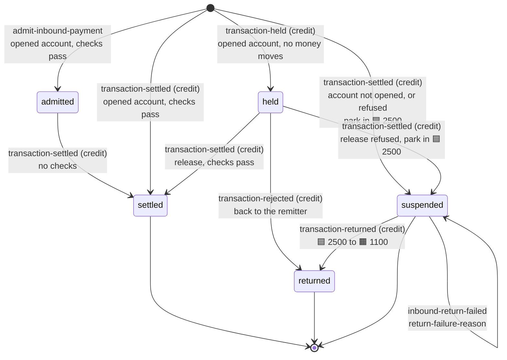

- A settlement is deduplicated on `scheme-transaction-id`, and a hold
  matched on end-to-end id, creditor and amount.
- A BBAN matching no account fails the handler and is dead-lettered,
  since every address was issued through the adapter.
- An admission rejected records nothing, since the payment never
  arrived.

### Settled

An inbound settled at a provider that notifies reaches the platform in
three hops: the adapter records the provider's report, the settlement
reaches the payment event processor, which posts it, and the change is
published.

#### Modulr reports it

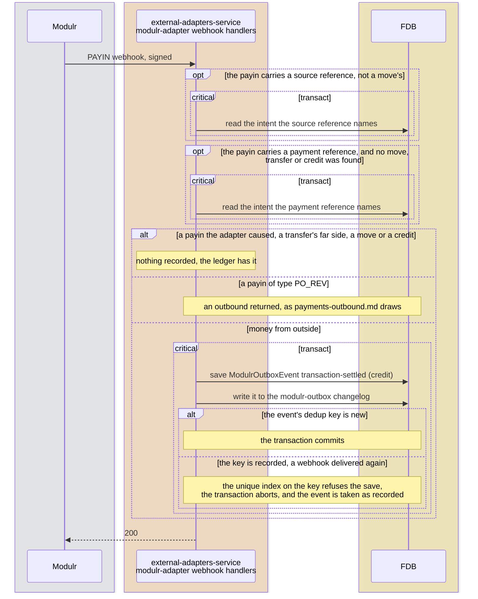

The event's dedup key is Modulr's payment id with `:settled` after it,
and its end-to-end id the payment id, which the outbox entry carries as
its ordering key.

#### The settlement reaches the payment

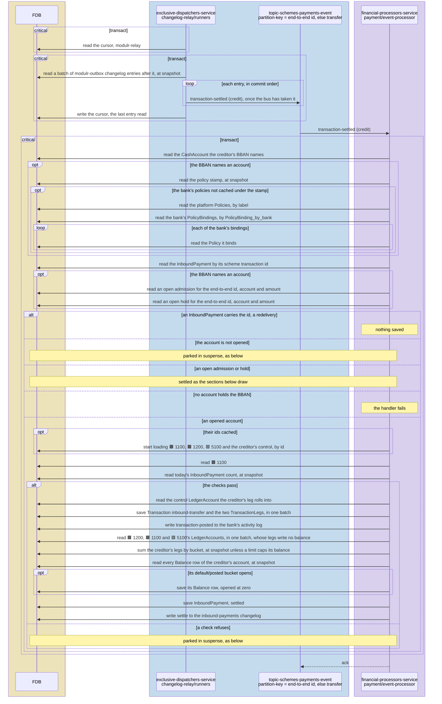

The settlement resolves the creditor by BBAN, checks the account is
opened and that the inbound capability and daily count allow it, and
posts DEBIT 1100 / CREDIT creditor. The bank's policies are read again
only when the policy stamp has moved since they were cached, and a
ledger account whose id is cached is read by its id. Neither leg
rewrites a balance row: 1100's balance is the sum of its legs, per
[ADR-0039](../adr/0039-cash-at-correspondents-balance-is-the-sum-of-its-legs.md),
and the creditor's default bucket the sum of its own, per
[ADR-0042](../adr/0042-a-cash-accounts-balance-is-the-sum-of-its-legs.md),
whose row is saved only when the bucket opens. The current account
control is summed from the creditor's legs too. The transaction names
the creditor as the account the scheme moved the money through, so its
`transaction-posted` entry nets to nothing at a provider holding a
balance per account, which credited it itself. A settlement delivered
again finds the payment its scheme transaction id names and saves
nothing. A handler that fails is delivered again, and dead-lettered once
its retries run out.

#### The change is published

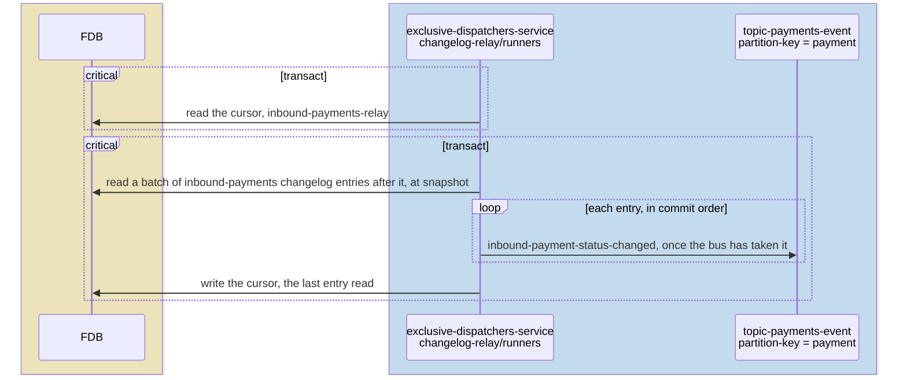

Every change an inbound payment makes in this document is published
the same way, a pass at a time as
[payments-internal.md](payments-internal.md) describes, and reaches the
webhook catalogue by its change kind: `payment.inbound-settled`,
`payment.inbound-held`, `payment.inbound-released`,
`payment.inbound-suspended` or `payment.inbound-returned`.

### Parked in suspense

#### The settlement parks it

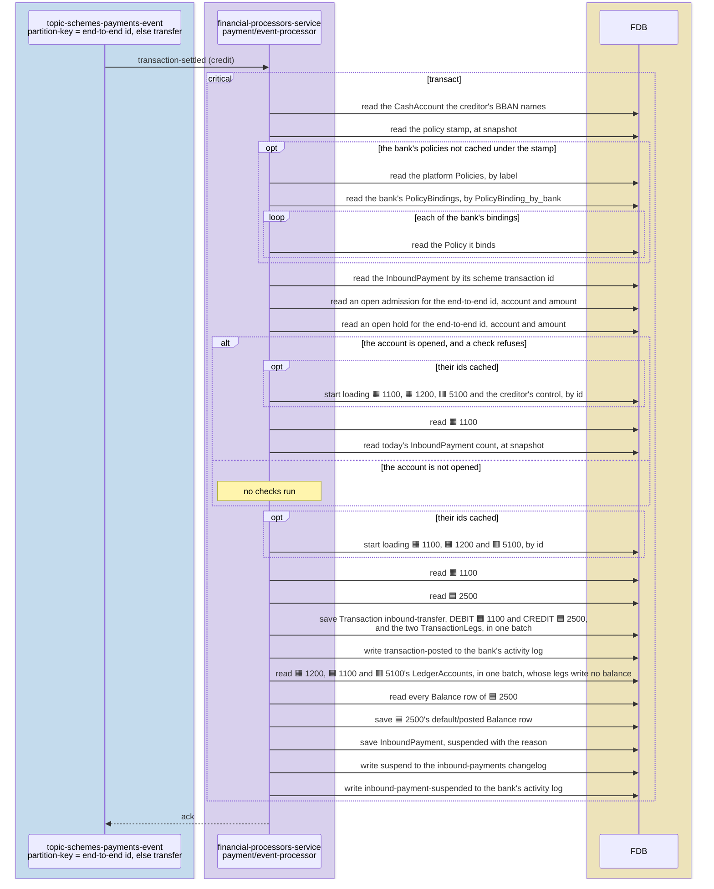

An inbound the receiving account cannot take, because it is not opened
or a policy refuses it, is kept in the bank's 2500 suspense rather than
lost, recording the ISO 20022 reason as `suspense-reason-code`. 2500
keeps a stored row, which only these rare postings write. Both activity
entries reach `payment/activity-event-processor` as
[payments-internal.md](payments-internal.md) draws. Under
`balances: per-account` the `transaction-posted` entry moves the money
from the receiving account's provider account to the bank's own funds,
as that document describes. Under `returns: [inbound]` the
`inbound-payment-suspended` entry sends it back, as below; otherwise it
stays suspended for the bank to resolve.

### Held, then released or returned

A provider that screens holds an inbound before it settles, ClearBank
here and Modulr through its compliance notification. The platform
records the hold with no money moving, and the settlement or rejection
that follows finds it by end-to-end id, creditor and amount.

#### ClearBank reports it

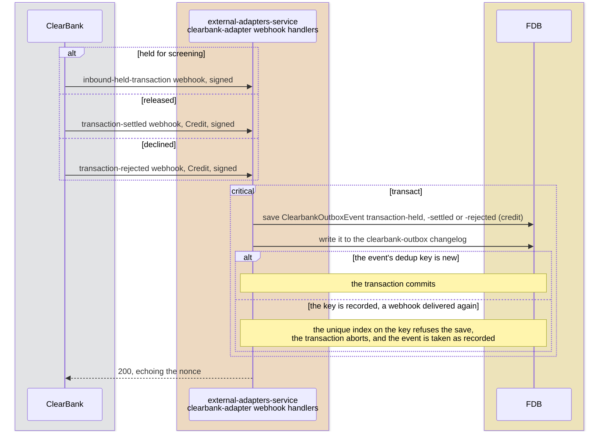

#### The hold reaches the payment

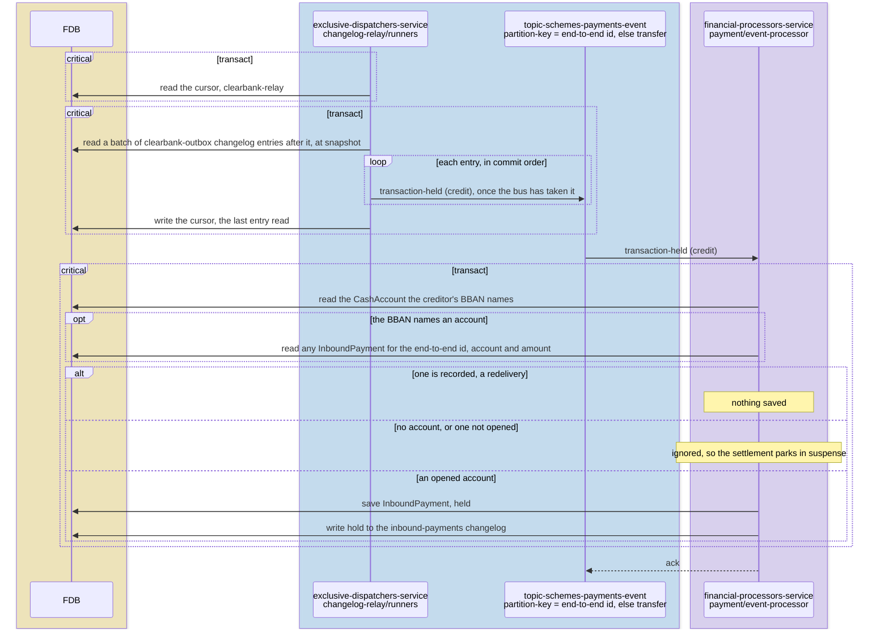

#### The release or the return reaches the payment

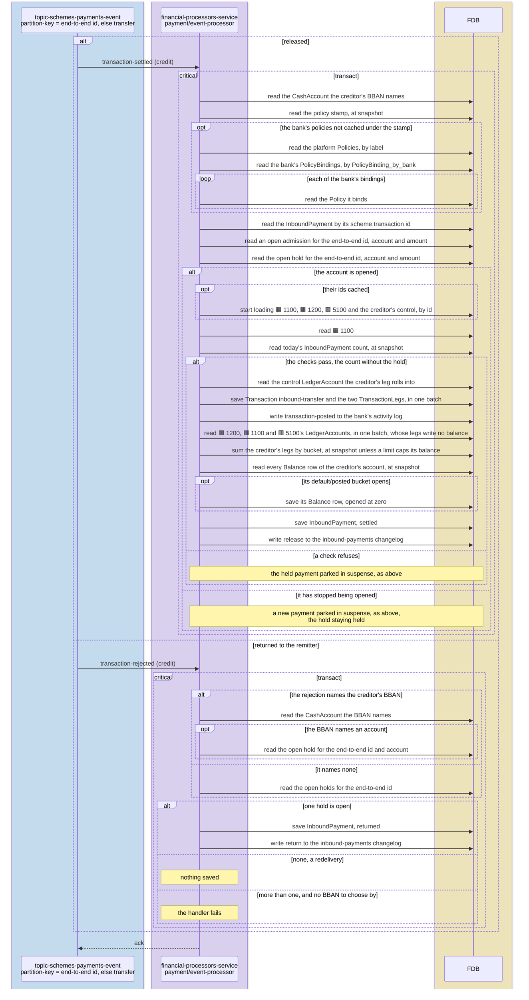

The release and the return are relayed from the `clearbank-outbox`
changelog as the hold is. A release runs the checks a settlement runs,
counting today's payments without the hold itself, and writes no balance
row where the creditor's bucket is open. A return moves no money: it
never reached the bank.

### Admitted before it settles

Under `inbound: admitted` the provider asks before an inbound settles,
in four hops: Form3 asks the adapter, the payment processor decides,
Form3 settles it, and the settlement reaches the payment.

#### Form3 asks for admission

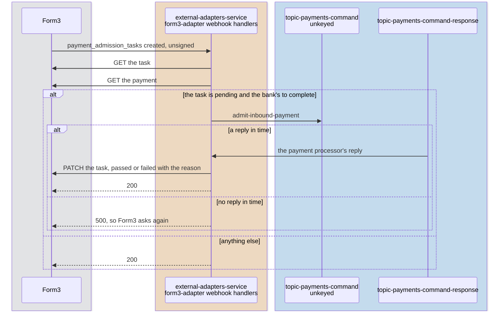

#### The payment processor decides

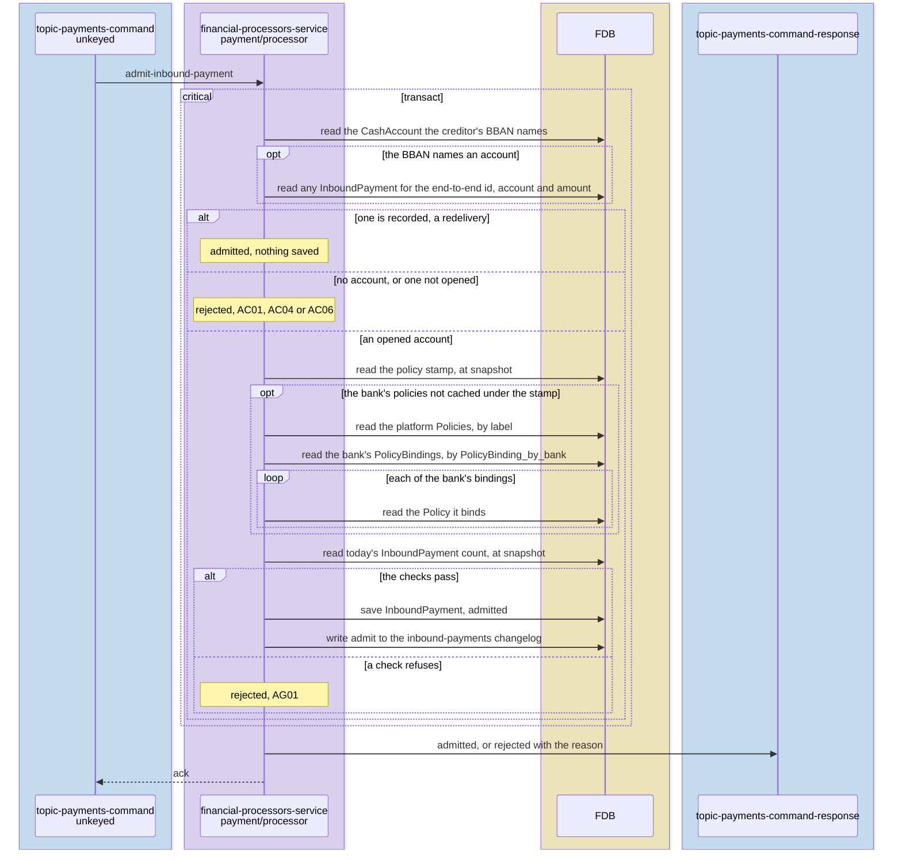

#### Form3 settles it

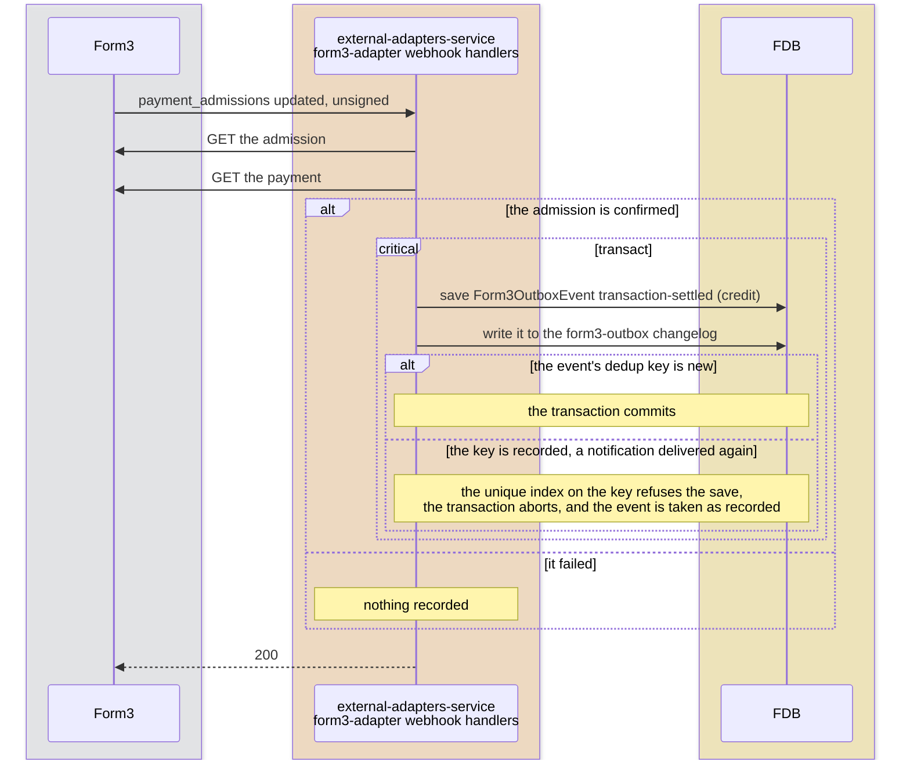

#### The admitted settlement reaches the payment

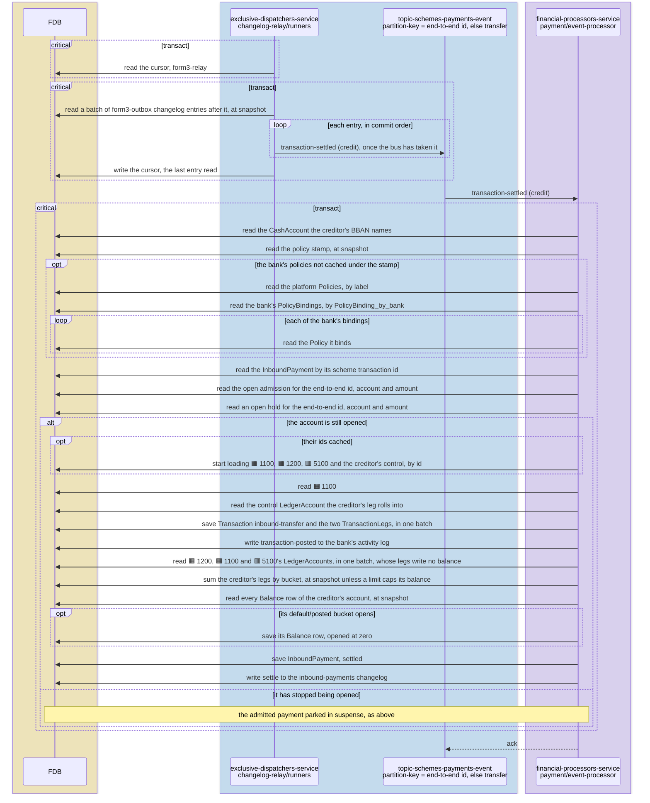

Form3's notifications carry no signature, so the adapter reads each
resource they name back from Form3 with a signed call before acting on
it. It sends the admission unkeyed and waits for `payment`'s answer,
and where none comes in time answers Form3 500, so Form3 asks again
until its own deadline fails the admission. `payment` admits where the
BBAN names an opened account and the checks a settlement runs pass, and
rejects otherwise: `AC01` for a BBAN matching no account, `AC04` for
one closed, `AC06` for one not opened, `AG01` for a payment a policy
refuses. The business-day counts include admitted payments, so two
admitted at once cannot pass one limit between them. An admission
redelivered for a payment already recorded answers admitted and records
nothing. The settlement runs no checks again.

### Returned from suspense

Under `returns: [inbound]` a suspended inbound goes back to its sender
in three hops: the activity processor sends the return, the adapter
sends it to Form3 and learns what became of it, and the outcome reaches
the payment. The `inbound-payment-suspended` entry reaches the activity
processor as [payments-internal.md](payments-internal.md) draws for
`transaction-posted`.

#### The activity processor sends the return

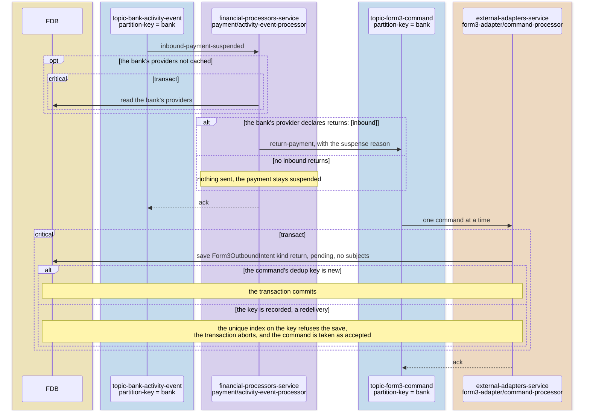

The command's dedup key is `return:` and the payment's id, so a
redelivered entry is the intent the adapter already holds. A return
names no account as a subject, so it waits behind no other call.

#### The adapter sends the return and asks what became of it

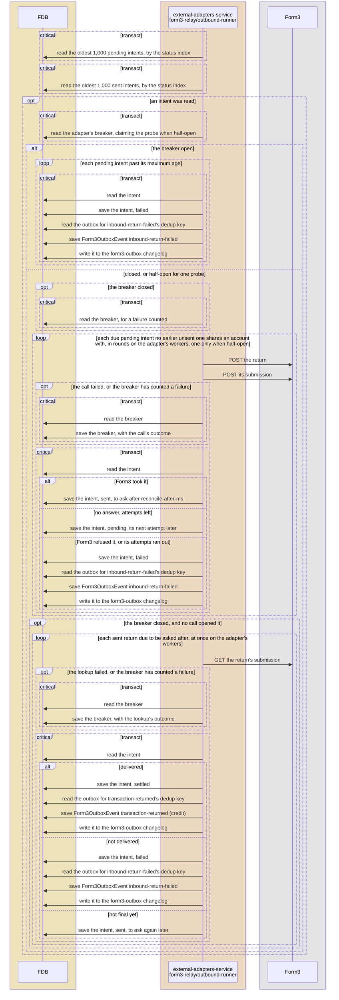

A pass reads at most `pass-limit`, 1,000 by default, of each status,
oldest first. Each save of the intent is made only where the intent
still has the status the pass read it in, and an outbox event only where
its dedup key is not already recorded.

#### The outcome reaches the payment

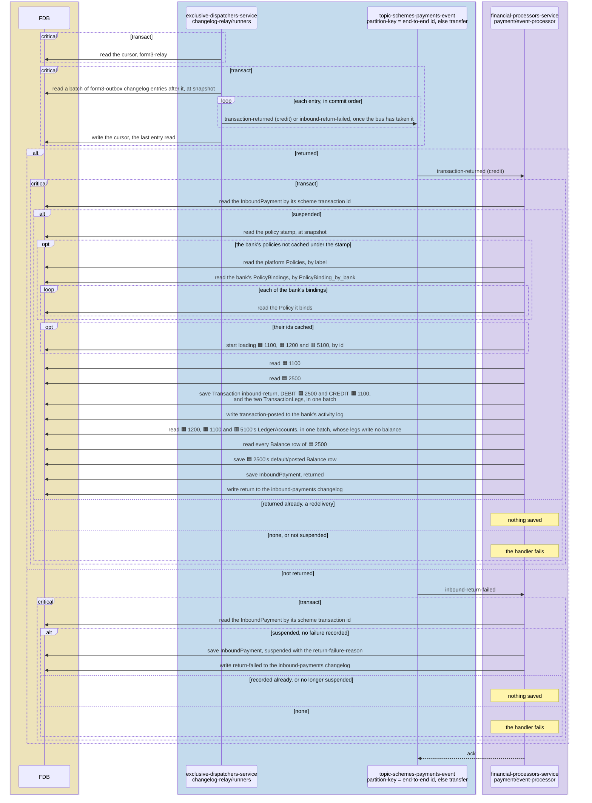

`transaction-returned` (credit) is deduplicated on Form3's id for the
inbound, and empties suspense of the payment. A return the provider
refuses or does not deliver is reported as `inbound-return-failed`, and
the payment stays suspended carrying it as `return-failure-reason`.

### Tests

- **`payment`** — settlement and its checks, parking in suspense,
  holds, admission and each reason it rejects with, and the return
  transitions and their refusals.
- **`<provider>-adapter`** — each provider event mapped to its scheme
  event, every amount converted, an unauthenticated delivery refused,
  and, for Form3, admission answered from `payment`'s reply.
- **`<provider>-simulator`** — `/simulate/inbound-payment` firing a
  settlement, or a hold that settles or returns, and on a simulator
  that asks for admission, sending the request first.
- **`test-api-scenarios`** — the inbound journeys, settled, held then
  released or returned, on every provider that carries each, with an
  admission admitted and one refused, and an inbound returned.

## Alternatives Considered

- **Returning money a policy refuses, whatever the provider.**
  Rejected: a provider that only notifies has no return instruction,
  so parking stays the path wherever `returns` lacks `inbound`.
- **The adapter deciding an admission from the query bricks.**
  Rejected: the limit checks and business-day counts are `payment`'s,
  and a second copy in the adapter would drift from the one a
  settlement applies.
- **Admitting every inbound and parking what cannot be applied.**
  Rejected under `inbound: admitted`: where the scheme asks, refusing
  at the door keeps money the bank cannot apply out of suspense.

## Known Limitations

- **A suspended inbound is never resolved** except by a return under
  `returns: [inbound]`.
- **A return the provider refuses stays in suspense.** The adapter logs
  it and the payment stays `suspended` for the bank to resolve by hand.
- **A return is reported by asking.** The provider's notification of a
  delivered return names no payment, so the adapter learns of it when
  it next reconciles, after `reconcile-after-ms`.
- **A return waits on every bank's activity.** `topic-bank-activity-event`
  has one partition, so an `inbound-payment-suspended` entry reaches the
  activity processor behind every bank's entries, as
  [payments-internal.md](payments-internal.md) records.
- **An admission not answered in time is refused.** The adapter answers
  Form3 500 until Form3's own deadline fails the admission, and the
  sender's bank tells its customer.
- **An admission answered after the deadline is lost.** Form3 fails the
  admission, and a payment the platform admitted by then stays
  `admitted`.
- **An admitted inbound the scheme never settles stays `admitted`.**
- **Identical holds are one hold.**
- **Settlement order is the provider's.** A settlement delivered before
  its hold settles as a new inbound and leaves the hold `held`.
- **Money arriving as an account closes refuses the close.** An inbound
  the provider takes between a close being accepted and carried out
  leaves a per-account provider refusing the close for its balance: the
  account returns to where it closed from, the inbound is parked, and a
  second close succeeds once the parked money has moved to own funds.
- **Nothing is screened under `screening: bank`.** No payment is held
  until a screening design exists, so an installation on rails screens
  outside the platform.

## References

- [payments](../prd/payments.md) — the product requirements this design
  serves.
- [payments.md](payments.md) — the provider declaration and the adapter
  contract.
- [payments-internal.md](payments-internal.md) — internal payments, and
  the mirroring a parked inbound takes.
- [payments-outbound.md](payments-outbound.md) — outbound payments.
- [policy-evaluation](policy-evaluation.md) — the checks an inbound
  runs.
- [chart-of-accounts](chart-of-accounts.md) — 1100 and 2500.
- [ADR-0034](../adr/0034-outbound-calls-go-through-a-breaker-on-their-destination.md)
  — the breaker every call to Form3 goes through.
- [ADR-0039](../adr/0039-cash-at-correspondents-balance-is-the-sum-of-its-legs.md)
  — 1100 summed from its legs.
- [ISO 20022 external code sets](https://www.iso20022.org/catalogue-messages/additional-content-messages/external-code-sets)
  — the reason codes an admission rejects with.
