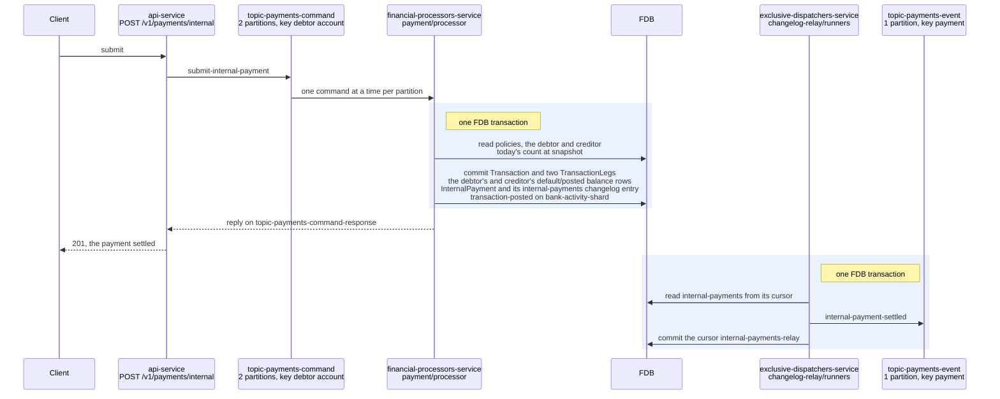
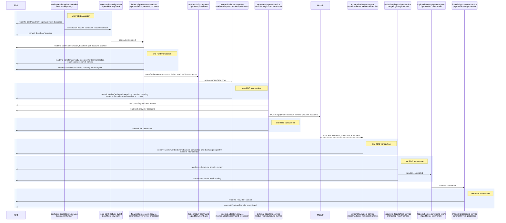

# Internal payments

> **Status: implemented.**

## Objective

Show how an internal payment, from one Queenswood account to another in
the same bank, moves through the platform: the request, the one FDB
transaction that records and posts it, and, where the bank's provider
holds a balance for each account, the transfer that makes the provider
hold what the ledger does.

In scope: `submit-internal-payment` from the API to its reply, the
records each transaction writes, the bank's activity entry it leaves,
and the provider transfer that follows it on a provider declaring
`balances: per-account`.

Out of scope: the provider declaration and the adapter contract, see
[payments.md](payments.md); outbound and inbound payments, see
[payments-outbound.md](payments-outbound.md) and
[payments-inbound.md](payments-inbound.md); how a balance is kept, see
[chart-of-accounts.md](chart-of-accounts.md); how a policy is evaluated,
see [policy-evaluation.md](policy-evaluation.md).

## Background

- **The request.** `POST /v1/payments/internal` in `bases/api`'s
  `payment` routes sends `submit-internal-payment` on
  `topic-payments-command`, two partitions keyed by the debtor account,
  and answers 201 from the reply on `topic-payments-command-response`.
- **The processor.** `payment/processor`, in
  `financial-processors-service`, handles the command in `core.clj`
  `submit-internal`.
- **The bank's activity.** `transaction/record-transaction` records a
  `transaction-posted` entry on the bank's activity log,
  `bank-activity-<shard>`, in the transaction that posts.
  `bank-activity/relay`, a runner per shard in
  `exclusive-dispatchers-service`, publishes it on
  `topic-bank-activity-event`, one partition keyed by bank, where
  `payment/activity-event-processor` reads it.
- **Mirroring.** `payment`'s `events/provider_transfer.clj` turns a
  posted transaction into `ProviderTransfer` records and
  `transfer-between-accounts` commands under `balances: per-account`,
  as [payments.md](payments.md) describes.

## Solution

### Reading the diagrams

A participant is the service that runs it and the component kind or
base inside it, as the system configuration names them, and a topic
shows its partitions and the key it is published under. An arrow into
FDB labelled `read` reads, one labelled `commit` lists what a
transaction writes, and a shaded box holds the reads and the commit of
one FDB transaction; a read outside a box is a transaction of its own.

### Submitting and settling

The command's one FDB transaction checks both accounts are operable and
in the payment's currency, the capability and the daily count,
`ensure-controls` resolving the control each leg's product type rolls
into, and then records and posts. Its two legs debit the debtor's and
credit the creditor's `default / posted` buckets, which are the only
balance rows it writes: the deposit controls 2100, 2200, 2300 and 3100
are summed from those rows, per
[ADR-0037](../adr/0037-a-control-accounts-balance-is-the-sum-of-the-balances-that-roll-into-it.md),
and carry no leg. The reply is sent once the transaction commits, so
201 means the payment settled. The changelog entry reaches the webhook
catalogue as `payment.internal-settled`.

### Mirroring at a provider holding a balance per account

The activity event processor nets the transaction's posted default legs
per party: the debtor's cash account owes, the creditor's is owed, and
the pair becomes one `ProviderTransfer`, unique on transaction and pair.
The adapter resolves each cash account to the provider account its own
opening recorded and calls Modulr with the provider's account ids. An
intent holds both accounts as its subjects, so a later call touching
either waits until this one is sent, as
[ADR-0033](../adr/0033-operations-reach-a-provider-in-the-order-they-were-accepted.md)
decides. A `transfer-failed` leaves the ledger as it is and logs the
transaction id at ERROR for the bank to reconcile.

Under `balances: pooled`, as Form3 and ClearBank declare, the activity
event processor reads the same entry and sends nothing: the addresses
route into one balance the ledger already divides.

### Tests

- **`payment`** — the checks an internal payment runs, the transaction
  and legs it records, netting a transaction's legs into provider
  transfers, and an entry a pooled provider does not act on sending
  nothing.
- **`intent-queue`** — a transfer holding both its accounts.
- **`modulr-relay`** — a transfer naming the provider accounts its
  opens recorded.
- **`test-scenarios`** — internal payments compared with the model, and
  every simulated provider balance checked against the ledger after
  each mirrored flow.

## Alternatives Considered

- **Internal payments two-phase, settling when the provider moves the
  money.** Rejected: an internal payment settles at once for the
  customer, and a mirror failing is the bank's reconciliation, not the
  customer's payment.
- **Mirroring from each brick that posts.** Rejected: `interest`,
  `reward` and `payment` would each learn the provider's balance model,
  where one consumer of the bank's activity sees every posting.

## Known Limitations

- **A failed mirror leaves the balances apart.** Nothing retries a
  failed `ProviderTransfer` or compares the provider's balances with the
  ledger.
- **A bank's activity is serial.** One shard's log is read by one relay
  runner and one bank's entries by one consumer, so one bank's mirrors
  are sent in order and at the rate that consumer reaches.

## References

- [payments](../prd/payments.md) — the product requirements this design
  serves.
- [payments.md](payments.md) — the provider declaration, the adapter
  contract and balances at the provider.
- [payments-outbound.md](payments-outbound.md) — outbound payments.
- [payments-inbound.md](payments-inbound.md) — inbound payments.
- [chart-of-accounts](chart-of-accounts.md) — the controls an internal
  payment's legs roll into.
- [outbound-delivery](outbound-delivery.md) — the intent poller and its
  breaker.
- [ADR-0033](../adr/0033-operations-reach-a-provider-in-the-order-they-were-accepted.md)
  — the bank's activity log and the order calls reach a provider in.
- [ADR-0037](../adr/0037-a-control-accounts-balance-is-the-sum-of-the-balances-that-roll-into-it.md)
  — controls summed from the customer rows.
