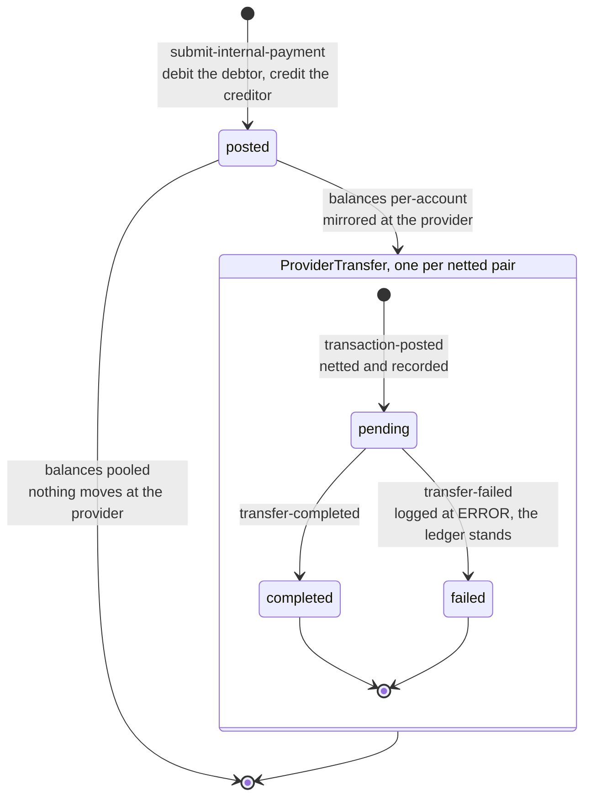
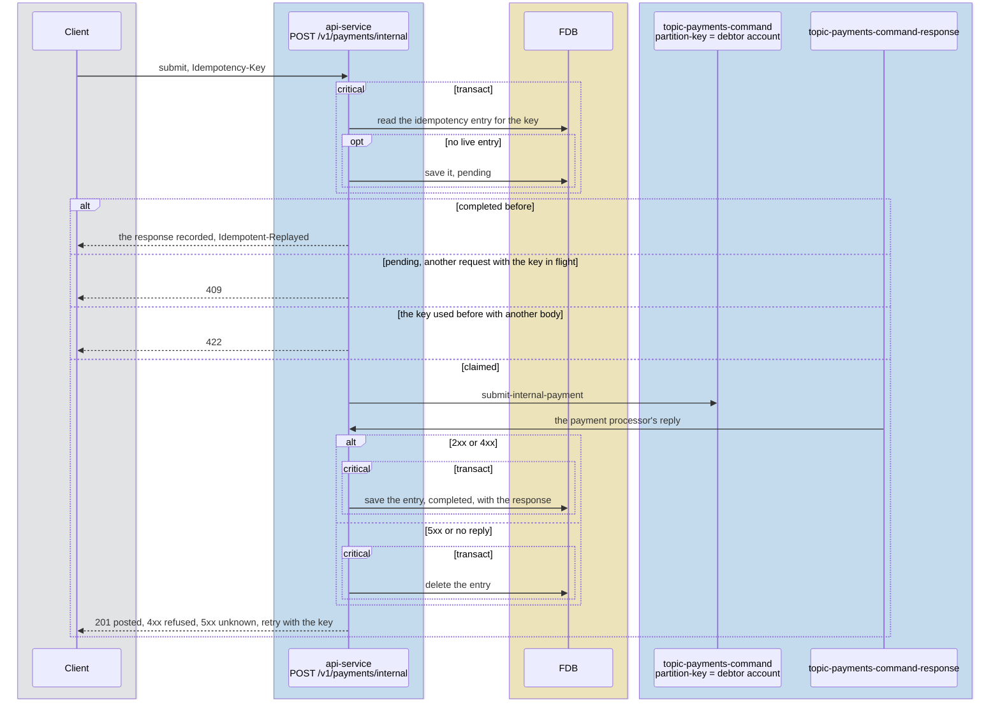
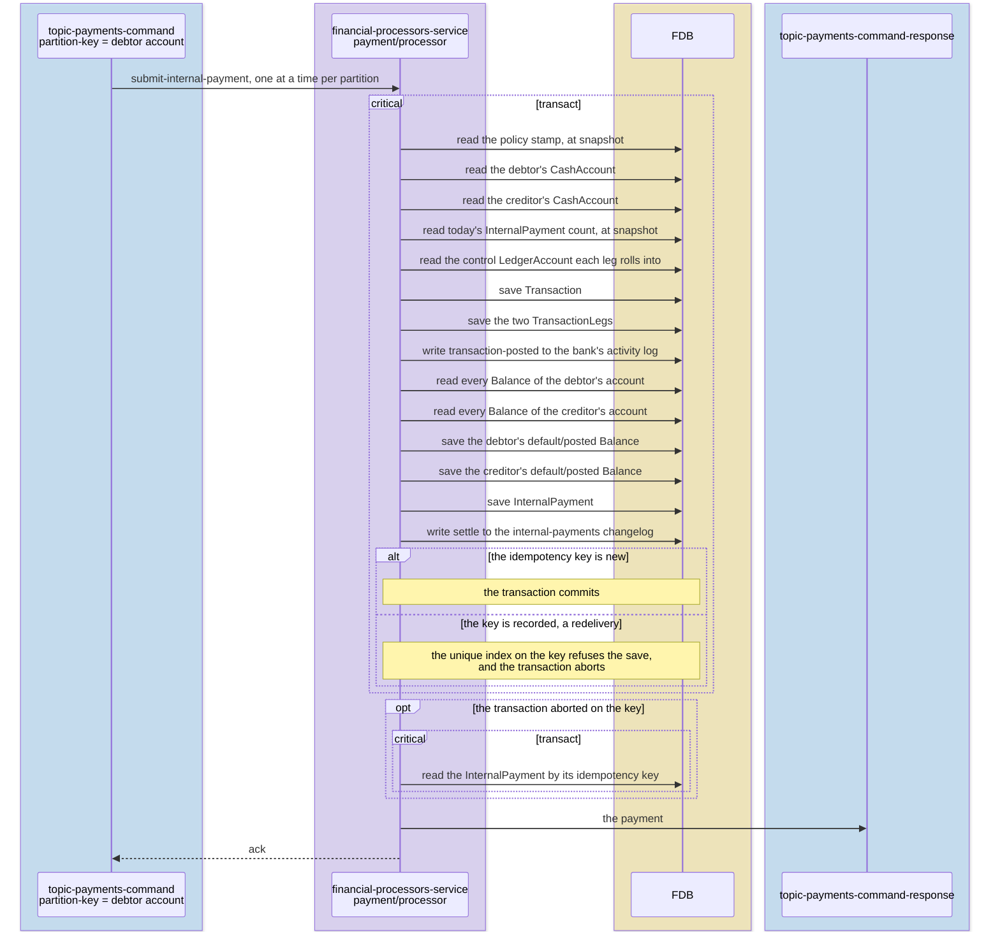
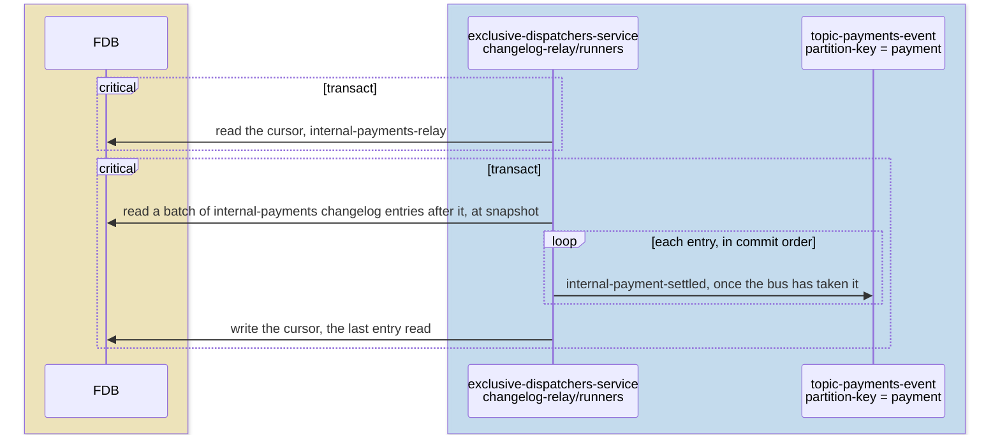
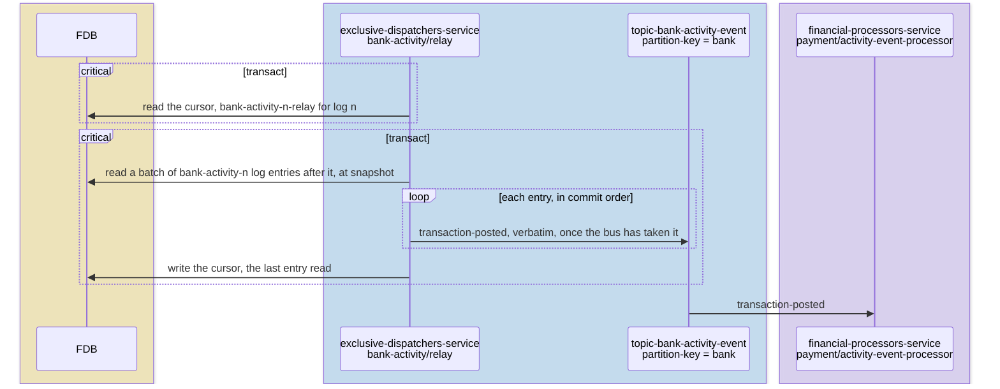
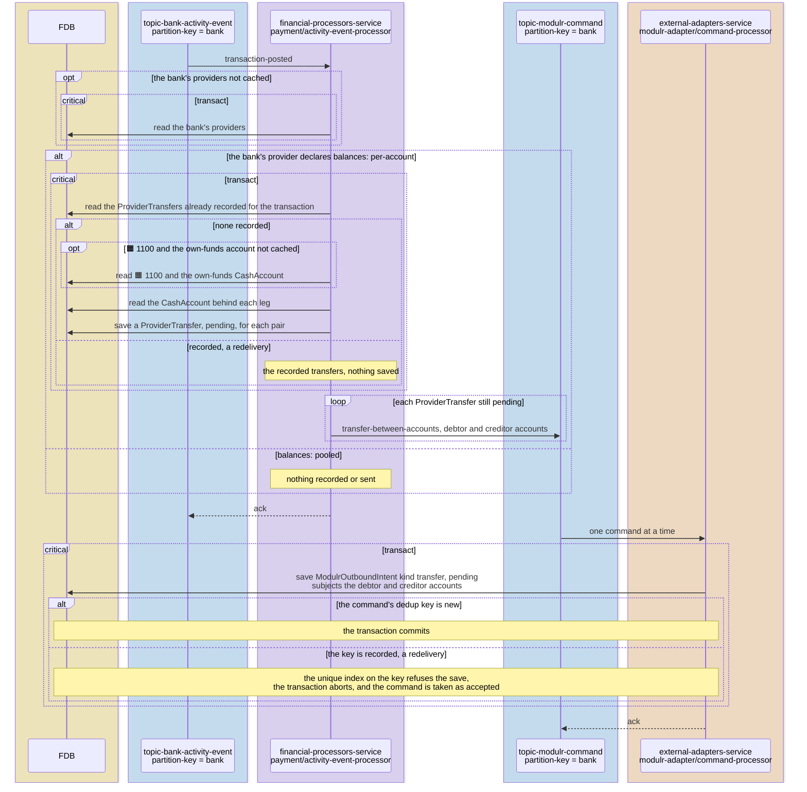
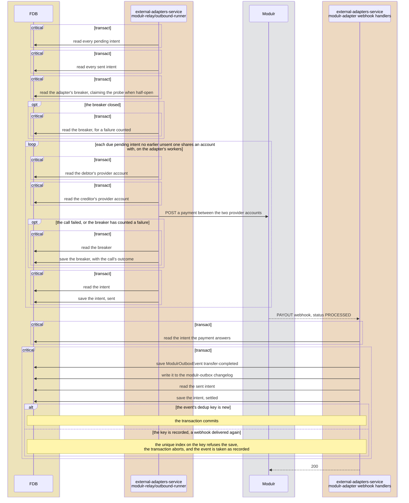
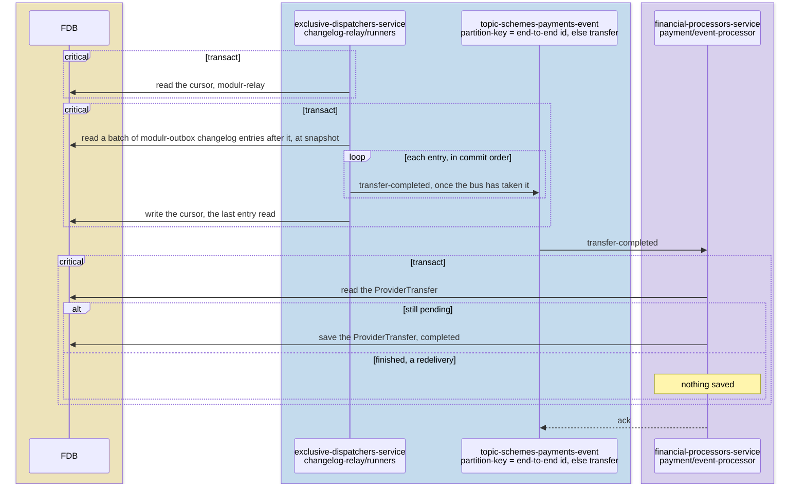

# Internal payments

> **Status: implemented.**

## Objective

Show how an internal payment, from one Queenswood account to another in
the same bank, moves through the platform: the request, the one FDB
transaction that records and posts it, and, where the bank's provider
holds a balance for each account, the transfer that makes the provider
hold what the ledger does.

In scope: `submit-internal-payment` from the API to its reply, the
records each transaction writes, the bank's activity entry it leaves,
and the provider transfer that follows it on a provider declaring
`balances: per-account`.

Out of scope: the provider declaration and the adapter contract, see
[payments.md](payments.md); outbound and inbound payments, see
[payments-outbound.md](payments-outbound.md) and
[payments-inbound.md](payments-inbound.md); how a balance is kept, see
[chart-of-accounts.md](chart-of-accounts.md); how a policy is evaluated,
see [policy-evaluation.md](policy-evaluation.md).

## Background

- **The request.** `POST /v1/payments/internal` in `bases/api`'s
  `payment` routes sends `submit-internal-payment` on
  `topic-payments-command`, partitioned by the debtor account,
  and answers 201 from the reply on `topic-payments-command-response`.
- **The processor.** `payment/processor`, in
  `financial-processors-service`, handles the command in `core.clj`
  `submit-internal`.
- **The bank's activity.** `transaction/record-transaction` records a
  `transaction-posted` entry on the bank's activity log, in the
  transaction that posts. There are four activity logs,
  `bank-activity-0` to `bank-activity-3`, and a bank's id picks the one
  all its entries go to. `bank-activity/relay`, a runner per log in
  `exclusive-dispatchers-service`, publishes it on
  `topic-bank-activity-event`, partitioned by bank, where
  `payment/activity-event-processor` reads it.
- **Mirroring.** `payment`'s `events/provider_transfer.clj` turns a
  posted transaction into `ProviderTransfer` records and
  `transfer-between-accounts` commands under `balances: per-account`,
  as [payments.md](payments.md) describes.

## Solution

### Reading the diagrams

A participant is the service that runs it and the component kind or base
inside it, as the system configuration names them, and a topic shows the key
it is partitioned by. Lanes are coloured as in the [system diagram](../diagrams/System%20Diagram.excalidraw): blue for
the API, the message bus and the relays, purple for the processors, orange for
the external adapters, yellow for FDB and grey for the world outside. A ledger
account's code is marked with its type, in the console's colours: 🟧 asset,
🟦 liability, 🟩 equity and 🟥 expense. Each arrow into FDB is one call — a read,
a save, or a changelog or log entry written — and each `critical [transact]`
box is one FDB transaction, holding every call made in it, a read made on its
own included. A box commits where it ends: anything drawn inside it, such as a
publish, happens before the commit, and anything after it once the transaction
has committed. A dashed `ack` back to a topic is the consumer committing its
offset, and a `200` back to the provider the webhook answering, each only once
the consumer has finished: a send drawn before it is covered, since a failure
anywhere earlier leaves the message to be delivered again, and whatever
receives the send takes a second copy as the one it already has. A reply to a
request waiting on it has no `ack`: delivered again it finds no request
waiting, and lost it leaves the request a 5xx, which the client retries with
its key.

- An internal payment has no status of its own: it is posted in the
  transaction that submits it, and its mirror is what moves.
- An outcome for a transfer no longer `pending` is a no-op, and one for
  a transfer that does not exist fails the handler and is dead-lettered.

### Submitting and settling

An internal payment is submitted and settled in three hops: the API
takes the request, the payment processor settles it in one transaction,
and the settlement is published.

#### The API takes the request

The key is claimed before the command is sent, so two requests with one
key send one command between them. A request the platform failed to
answer releases its claim, and the client may send it again.

#### The payment processor settles it

The command's one FDB transaction checks both accounts are operable and
in the payment's currency, the capability and the daily count,
`ensure-controls` resolving the control each leg's product type rolls
into, and then records and posts. The bank's policies are read again
only when the policy stamp has moved since they were cached. Its two
legs debit the debtor's and credit the creditor's `default / posted`
buckets, which are the only balance rows it writes: the deposit
controls 2100, 2200, 2300 and 3100 are summed from those rows, per
[ADR-0037](../adr/0037-a-control-accounts-balance-is-the-sum-of-the-balances-that-roll-into-it.md),
and carry no leg. A command delivered again finds its idempotency key
recorded: the transaction aborts, nothing is written twice, and the
reply is the payment the first delivery recorded.

#### The settlement is published

A pass publishes a batch, at most the 500 entries `fdb/process-changelog`
reads by default, which the relay does not configure, and moves the
cursor once, after the last: a publish waits for the bus to take it, one
that fails aborts the pass, and the next pass publishes the batch again,
the entries already published included. The cursor is read in a
transaction of its own and written without a conflict check, so one
runner owns it. The changelog entry reaches the webhook catalogue as
`payment.internal-settled`.

### Mirroring at the provider

On a provider that declares `balances: per-account`, as Modulr does, a
posted transaction is mirrored at the provider in four hops, each drawn
below between the service that hands it on, the topic or call that
carries it, and the service that takes it up. On one that declares
`balances: pooled`, as Form3 and ClearBank do, the activity processor
sends nothing: the provider holds one balance for all the bank's
accounts, and only the ledger says how much of it is each account's, so
a payment between two of them moves nothing at the provider.

#### The activity log reaches the activity processor

The relay publishes before its cursor commits, so a pass that fails
after publishing publishes the same entries again, and the processor
takes each entry as many times as it arrives.

#### The activity processor sends the transfer

The activity event processor nets the transaction's posted default legs
per party: the debtor's cash account owes, the creditor's is owed, and
the pair becomes one `ProviderTransfer`, unique on transaction and pair.

A `transaction-posted` delivered again, because a send failed or the
process stopped before the ack, finds its transfers recorded, saves
nothing, and sends again those still pending. Where the first send got
through, the adapter receives the command twice and takes the second as
the intent it already holds, unique on the command's dedup key, so
Modulr is called once.

#### The adapter calls Modulr and hears back

A pass of the poller reads every intent the adapter holds, across every
bank, and runs at once each pending one that is due and that no earlier
intent still unsent shares an account with. The transfer's intent holds
both accounts as its subjects, so a later call touching either waits
until this one is sent, as
[ADR-0033](../adr/0033-operations-reach-a-provider-in-the-order-they-were-accepted.md)
decides. The call resolves the transfer's cash accounts to their
provider accounts, the Modulr accounts the adapter recorded when it
opened them. While the adapter's breaker is open a pass calls nothing,
as
[ADR-0034](../adr/0034-outbound-calls-go-through-a-breaker-on-their-destination.md)
decides. The webhook answers 200 only once its outbox entry commits, so
Modulr sends it again until it has.

#### The outcome reaches the payment

A `transfer-failed` leaves the ledger as it is and logs the transaction
id at ERROR for the bank to reconcile.

### Tests

- **`payment`** — the checks an internal payment runs, the transaction
  and legs it records, netting a transaction's legs into provider
  transfers, and an entry a pooled provider does not act on sending
  nothing.
- **`intent-queue`** — a transfer holding both its accounts.
- **`modulr-relay`** — a transfer naming the provider accounts its
  opens recorded.
- **`test-scenarios`** — internal payments compared with the model, and
  every simulated provider balance checked against the ledger after
  each mirrored flow.

## Alternatives Considered

- **Internal payments two-phase, settling when the provider moves the
  money.** Rejected: an internal payment settles at once for the
  customer, and a mirror failing is the bank's reconciliation, not the
  customer's payment.
- **Mirroring from each brick that posts.** Rejected: `interest`,
  `reward` and `payment` would each learn the provider's balance model,
  where one consumer of the bank's activity sees every posting.

## Known Limitations

- **A failed mirror leaves the balances apart.** Nothing retries a
  failed `ProviderTransfer` or compares the provider's balances with the
  ledger. A `transaction-posted` whose handler keeps failing, as when the
  command cannot be sent, is dead-lettered once its retries run out and
  its offset committed past it, leaving its `ProviderTransfer` pending.
- **A bank's activity is serial.** A bank's activity log is read by one
  relay runner and its entries by one consumer, so one bank's mirrors
  are sent in order and at the rate that consumer reaches.
- **Every bank's activity shares one partition.** The four activity logs
  are relayed in parallel, but `topic-bank-activity-event` has one
  partition, so every bank's entries reach
  `payment/activity-event-processor` one at a time. More partitions,
  keyed by bank as the topic already is, would carry the logs'
  parallelism through to the processor.

## References

- [payments](../prd/payments.md) — the product requirements this design
  serves.
- [payments.md](payments.md) — the provider declaration, the adapter
  contract and balances at the provider.
- [payments-outbound.md](payments-outbound.md) — outbound payments.
- [payments-inbound.md](payments-inbound.md) — inbound payments.
- [chart-of-accounts](chart-of-accounts.md) — the controls an internal
  payment's legs roll into.
- [outbound-delivery](outbound-delivery.md) — the intent poller and its
  breaker.
- [ADR-0033](../adr/0033-operations-reach-a-provider-in-the-order-they-were-accepted.md)
  — the bank's activity log and the order calls reach a provider in.
- [ADR-0034](../adr/0034-outbound-calls-go-through-a-breaker-on-their-destination.md)
  — the breaker every call to Modulr goes through.
- [ADR-0037](../adr/0037-a-control-accounts-balance-is-the-sum-of-the-balances-that-roll-into-it.md)
  — controls summed from the customer rows.
