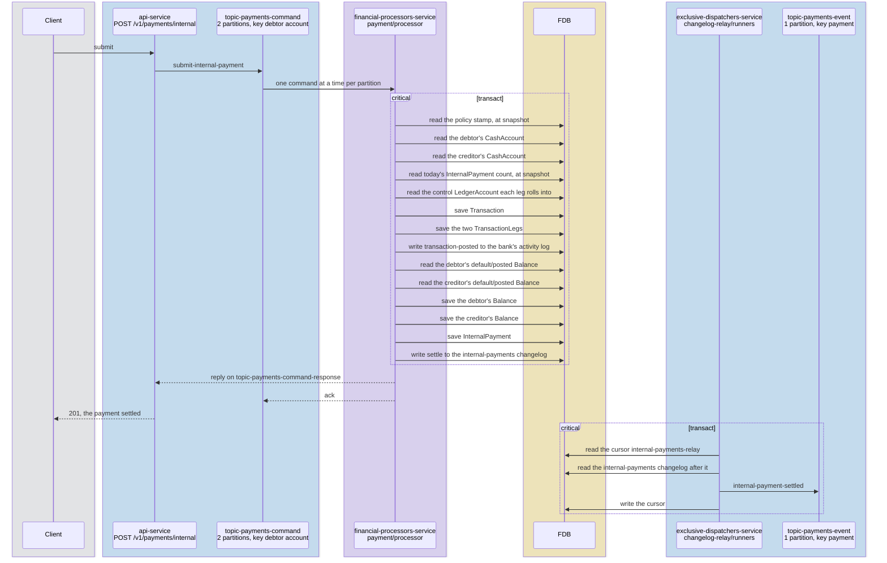
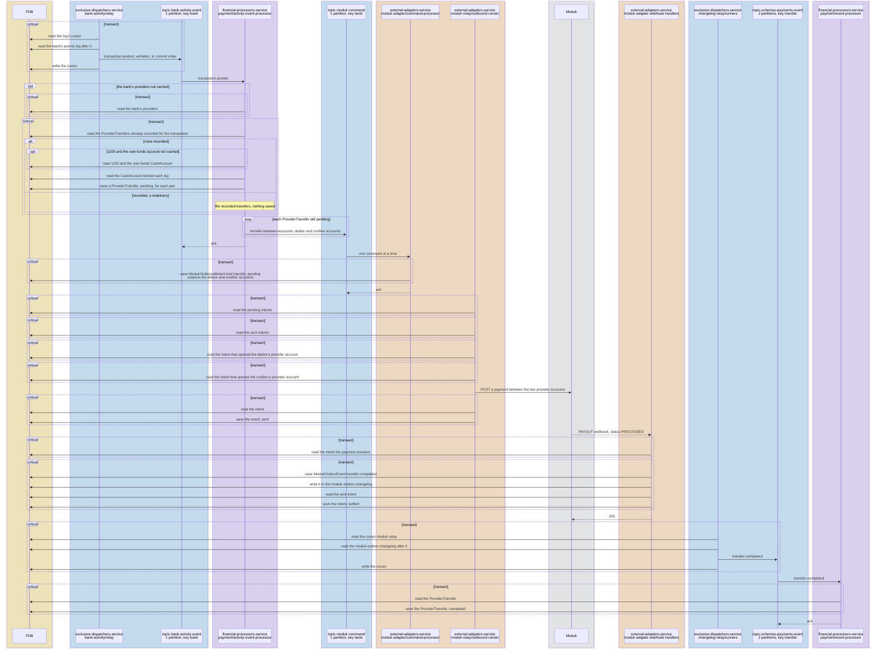

# Internal payments

> **Status: implemented.**

## Objective

Show how an internal payment, from one Queenswood account to another in
the same bank, moves through the platform: the request, the one FDB
transaction that records and posts it, and, where the bank's provider
holds a balance for each account, the transfer that makes the provider
hold what the ledger does.

In scope: `submit-internal-payment` from the API to its reply, the
records each transaction writes, the bank's activity entry it leaves,
and the provider transfer that follows it on a provider declaring
`balances: per-account`.

Out of scope: the provider declaration and the adapter contract, see
[payments.md](payments.md); outbound and inbound payments, see
[payments-outbound.md](payments-outbound.md) and
[payments-inbound.md](payments-inbound.md); how a balance is kept, see
[chart-of-accounts.md](chart-of-accounts.md); how a policy is evaluated,
see [policy-evaluation.md](policy-evaluation.md).

## Background

- **The request.** `POST /v1/payments/internal` in `bases/api`'s
  `payment` routes sends `submit-internal-payment` on
  `topic-payments-command`, two partitions keyed by the debtor account,
  and answers 201 from the reply on `topic-payments-command-response`.
- **The processor.** `payment/processor`, in
  `financial-processors-service`, handles the command in `core.clj`
  `submit-internal`.
- **The bank's activity.** `transaction/record-transaction` records a
  `transaction-posted` entry on the bank's activity log, in the
  transaction that posts. There are four activity logs,
  `bank-activity-0` to `bank-activity-3`, and a bank's id picks the one
  all its entries go to. `bank-activity/relay`, a runner per log in
  `exclusive-dispatchers-service`, publishes it on
  `topic-bank-activity-event`, one partition keyed by bank, where
  `payment/activity-event-processor` reads it.
- **Mirroring.** `payment`'s `events/provider_transfer.clj` turns a
  posted transaction into `ProviderTransfer` records and
  `transfer-between-accounts` commands under `balances: per-account`,
  as [payments.md](payments.md) describes.

## Solution

### Reading the diagrams

A participant is the service that runs it and the component kind or
base inside it, as the system configuration names them, and a topic
shows its partitions and the key it is published under. Lanes are
coloured as in the
[system diagram](../diagrams/System%20Diagram.excalidraw): blue for the
API, the message bus and the relays, purple for the processors, orange
for the external adapters, yellow for FDB and grey for the world
outside. Each arrow into
FDB is one call — a read, a save, or a changelog or log entry written —
and each `critical [transact]` box is one FDB transaction, holding every
call made in it, a read made on its own included. A box commits where it
ends: anything drawn inside it, such as a publish, happens before the
commit, and anything after it once the transaction has committed. A
dashed `ack` back to a topic is the consumer committing its offset, and a
`200` back to the provider the webhook answering, each only once the
consumer has finished: a send drawn before it is covered, since a failure
anywhere earlier leaves the message to be delivered again, and whatever
receives the send takes a second copy as the one it already has.

### Submitting and settling

The command's one FDB transaction checks both accounts are operable and
in the payment's currency, the capability and the daily count,
`ensure-controls` resolving the control each leg's product type rolls
into, and then records and posts. The bank's policies are read again
only when the policy stamp has moved since they were cached. Its two
legs debit the debtor's and credit the creditor's `default / posted`
buckets, which are the only balance rows it writes: the deposit
controls 2100, 2200, 2300 and 3100 are summed from those rows, per
[ADR-0037](../adr/0037-a-control-accounts-balance-is-the-sum-of-the-balances-that-roll-into-it.md),
and carry no leg. The reply is sent once the transaction commits, so
201 means the payment settled. The changelog entry reaches the webhook
catalogue as `payment.internal-settled`.

### Mirroring at a provider holding a balance per account

A `transaction-posted` delivered again, because a send failed or the
process stopped before the ack, finds its transfers recorded, saves
nothing, and sends again those still pending. Where the first send got
through, the adapter receives the command twice and takes the second as
the intent it already holds, unique on the command's dedup key, so
Modulr is called once.

The activity event processor nets the transaction's posted default legs
per party: the debtor's cash account owes, the creditor's is owed, and
the pair becomes one `ProviderTransfer`, unique on transaction and pair.
The adapter resolves each cash account to the provider account its own
opening recorded and calls Modulr with the provider's account ids. An
intent holds both accounts as its subjects, so a later call touching
either waits until this one is sent, as
[ADR-0033](../adr/0033-operations-reach-a-provider-in-the-order-they-were-accepted.md)
decides. A `transfer-failed` leaves the ledger as it is and logs the
transaction id at ERROR for the bank to reconcile.

Under `balances: pooled`, as Form3 and ClearBank declare, the activity
event processor reads the same entry and sends nothing: the addresses
route into one balance the ledger already divides.

### Tests

- **`payment`** — the checks an internal payment runs, the transaction
  and legs it records, netting a transaction's legs into provider
  transfers, and an entry a pooled provider does not act on sending
  nothing.
- **`intent-queue`** — a transfer holding both its accounts.
- **`modulr-relay`** — a transfer naming the provider accounts its
  opens recorded.
- **`test-scenarios`** — internal payments compared with the model, and
  every simulated provider balance checked against the ledger after
  each mirrored flow.

## Alternatives Considered

- **Internal payments two-phase, settling when the provider moves the
  money.** Rejected: an internal payment settles at once for the
  customer, and a mirror failing is the bank's reconciliation, not the
  customer's payment.
- **Mirroring from each brick that posts.** Rejected: `interest`,
  `reward` and `payment` would each learn the provider's balance model,
  where one consumer of the bank's activity sees every posting.

## Known Limitations

- **A failed mirror leaves the balances apart.** Nothing retries a
  failed `ProviderTransfer` or compares the provider's balances with the
  ledger. A `transaction-posted` whose handler keeps failing, as when the
  command cannot be sent, is dead-lettered once its retries run out and
  its offset committed past it, leaving its `ProviderTransfer` pending.
- **A bank's activity is serial.** A bank's activity log is read by one
  relay runner and its entries by one consumer, so one bank's mirrors
  are sent in order and at the rate that consumer reaches.

## References

- [payments](../prd/payments.md) — the product requirements this design
  serves.
- [payments.md](payments.md) — the provider declaration, the adapter
  contract and balances at the provider.
- [payments-outbound.md](payments-outbound.md) — outbound payments.
- [payments-inbound.md](payments-inbound.md) — inbound payments.
- [chart-of-accounts](chart-of-accounts.md) — the controls an internal
  payment's legs roll into.
- [outbound-delivery](outbound-delivery.md) — the intent poller and its
  breaker.
- [ADR-0033](../adr/0033-operations-reach-a-provider-in-the-order-they-were-accepted.md)
  — the bank's activity log and the order calls reach a provider in.
- [ADR-0037](../adr/0037-a-control-accounts-balance-is-the-sum-of-the-balances-that-roll-into-it.md)
  — controls summed from the customer rows.
