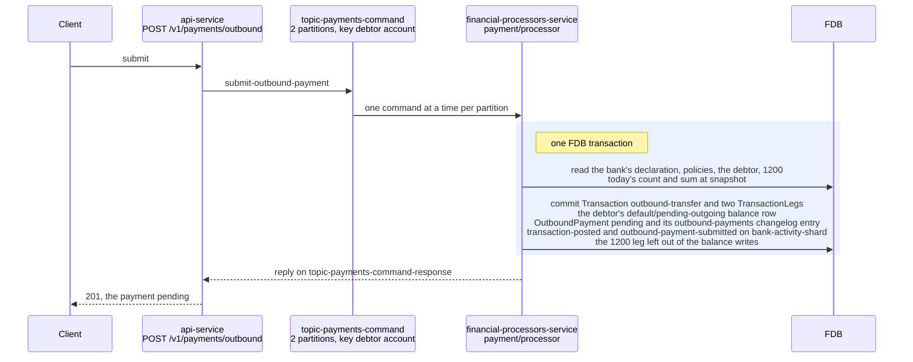
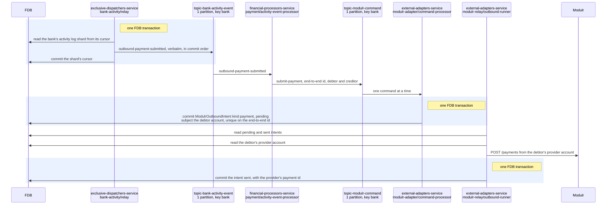
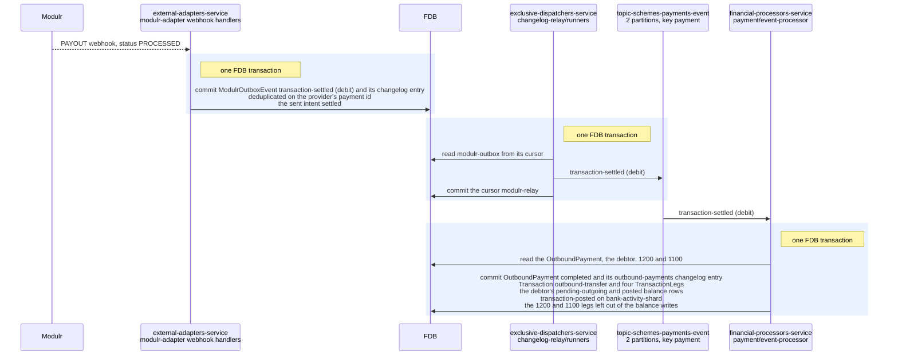
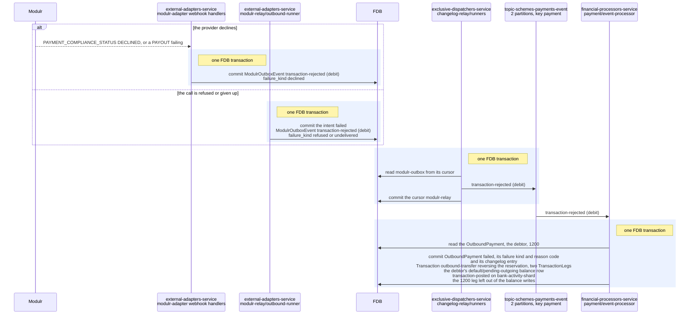
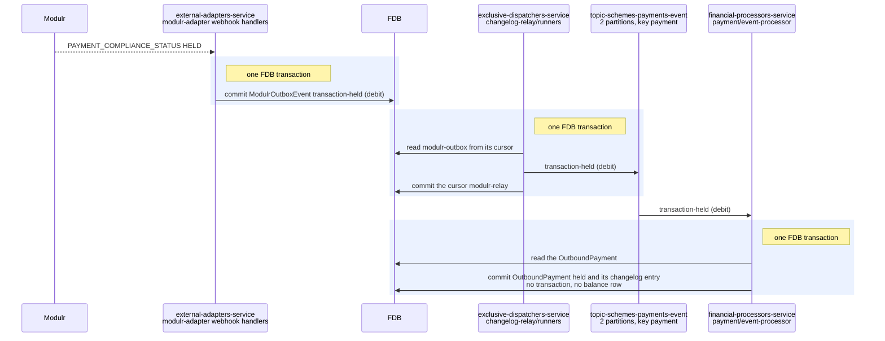
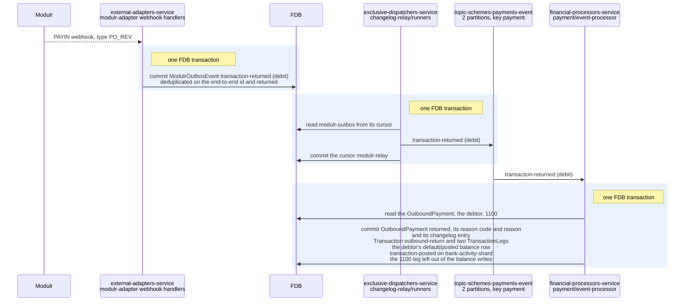

# Outbound payments

> **Status: implemented.**

## Objective

Show how an outbound payment, leaving a Queenswood account through UK
Faster Payments, moves through the platform: the submission that
reserves its amount, the provider call it becomes, and each outcome the
provider reports, with the records each FDB transaction writes.

In scope: `submit-outbound-payment` from the API to its reply, the
bank's activity entry that carries it to the provider's adapter, the
intent and the call, and the settlement, rejection, hold and return the
adapter reports back.

Out of scope: the provider declaration and the adapter contract, see
[payments.md](payments.md); internal and inbound payments, see
[payments-internal.md](payments-internal.md) and
[payments-inbound.md](payments-inbound.md); the intent poller's
breaker, retries and reconciliation timing, see
[outbound-delivery.md](outbound-delivery.md); how a balance is kept, see
[chart-of-accounts.md](chart-of-accounts.md).

## Background

- **The request.** `POST /v1/payments/outbound` in `bases/api`'s
  `payment` routes sends `submit-outbound-payment` on
  `topic-payments-command`, two partitions keyed by the debtor account,
  and answers 201 from the reply with the payment `pending`.
- **The processors.** `payment/processor` submits, in `core.clj`
  `submit-outbound`; `payment/activity-event-processor` sends the
  provider command, in `events/activity.clj`; and
  `payment/event-processor` handles the scheme events, in
  `events/outbound.clj`. All three run in
  `financial-processors-service`.
- **The adapter.** `<provider>-adapter/command-processor`, in
  `external-adapters-service`, consumes the command into an intent in
  its `<provider>-relay` store, and the intent poller,
  `<provider>-relay/outbound-runner`, makes the call, as
  [outbound-delivery.md](outbound-delivery.md) describes. The adapter
  base's webhook handlers write what the provider reports to its
  outbox, which `changelog-relay/runners` in
  `exclusive-dispatchers-service` publishes on
  `topic-schemes-payments-event`, two partitions, keyed by the payment.
- **Statuses.** An outbound payment is `pending`, `held`, `completed`,
  `failed` or `returned`.

## Solution

### Reading the diagrams

A participant is the service that runs it and the component kind or
base inside it, as the system configuration names them, and a topic
shows its partitions and the key it is published under. An arrow into
FDB labelled `read` reads, one labelled `commit` lists what a
transaction writes, and a shaded box holds the reads and the commit of
one FDB transaction; a read outside a box is a transaction of its own.

- A held, settled or rejected event for a payment already past it is an
  idempotent no-op, and a settlement for a `failed` payment is skipped
  and logged at ERROR.
- A rejection for a `completed` or `returned` payment, a return for one
  that is not `completed`, and any event for a payment that does not
  exist fail the handler and are dead-lettered.

### Submitting and reserving

The submission refuses a scheme the bank's provider does not declare,
then checks the debtor, the capability, the daily count and the instant
and daily amount limits. It reserves the amount: a debit on the
debtor's `default / pending-outgoing` bucket, which drops the available
balance and leaves the posted one, against a credit on 1200
pending-outbound. 1200 holds no row of its own, its balance mirroring
every customer's pending-outgoing bucket, per
[ADR-0038](../adr/0038-an-outbound-submit-writes-no-row-every-payment-shares.md),
so the submission writes the debtor's row and nothing every payment in
the bank shares. The day's count and sum are read at snapshot, so the
limit can be passed by the submissions in flight at once. The
`transaction-posted` entry moves no posted bucket, so nothing is
mirrored for it.

### Reaching the provider

The activity event processor decides from the entry alone and sends on
the bank's provider's command channel, `topic-form3-command` or
`topic-clearbank-command` for a bank on those providers. The adapter
acks once the intent commits. The poller makes calls for different
subjects at once and an account's in the order they were accepted, per
[ADR-0033](../adr/0033-operations-reach-a-provider-in-the-order-they-were-accepted.md).
A call the provider refuses, or one the poller gives up on, moves the
intent to `failed` and writes `transaction-rejected` with
`failure_kind` `refused` or `undelivered` to the outbox, which the
rejection path below handles.

### Settled

Settlement converts the reservation into the outflow: it credits the
debtor's pending-outgoing bucket and debits its posted one, and debits
1200 against a credit to 1100 cash-at-correspondent. Neither 1200 nor
1100 holds a row, 1100's balance being the sum of its legs, per
[ADR-0039](../adr/0039-cash-at-correspondents-balance-is-the-sum-of-its-legs.md),
so the only balance rows written are the debtor's. The transaction
names the debtor as the account the scheme moved the money through, so
its `transaction-posted` entry nets to nothing at a provider holding a
balance per account, which moved the money itself. The `payments-event`
relay turns the changelog entry into `payment.outbound-completed`.

A sent intent no webhook settles within the relay's
`reconcile-after-ms` is looked up at the provider, and what it reports
is written to the outbox under the dedup key its webhook would carry, so
the payment settles on the lookup and a late webhook finds it there.

### Rejected

A rejection reverses only a payment still in flight, `pending` or
`held`: it debits 1200 and credits the debtor's pending-outgoing bucket,
releasing the reservation, and records the platform's failure kind and
ISO 20022 reason code, which the API answers as `failure`.

### Held

A provider screening the payment holds it with the money still reserved,
and the settlement or rejection that follows moves it on. A payment
pending or held for 24 hours is reported by `payment/outbound-sweep` in
`exclusive-dispatchers-service`.

### Returned after settling

The scheme can return a payment after it completed, when the
beneficiary's bank cannot apply it. The return debits 1100 and credits
the debtor's posted bucket by the amount returned, names the debtor as
the account the scheme moved the money through, so it nets to nothing at
a per-account provider, and is notified as `payment.outbound-returned`.
A return the adapter cannot match to a payment is reported as a
`transaction-settled` (credit) to the account it arrived at, so the
money is never lost. A rejection naming a completed or returned payment
fails the handler: a rejection is not a return.

### Tests

- **`payment`** — the unsupported scheme, the reservation, the failure
  fields, settlement, reversal, the return transitions and their
  refusals, and each activity entry sent to the bank's provider keyed by
  the bank.
- **`intent-queue`** — an account's calls made in the order they were
  accepted.
- **`<provider>-adapter`** — each provider event mapped to its scheme
  event with the platform's reason code, every amount converted, and an
  unauthenticated delivery refused.
- **`<provider>-relay`** — backoff, refusal, a retry recognised as the
  same request, and reconciliation writing what a late webhook would.
- **`test-api-scenarios`** — the outbound journeys, settled, rejected by
  the scheme and returned after settling, on every provider that carries
  each.

## Alternatives Considered

- **A synchronous call to the provider from the HTTP handler.**
  Rejected: it ties the request to the provider's latency, and a
  failure mid-call leaves the bank's records unknown.

## Known Limitations

- **The payment-side publish is best-effort.** A lost `submit-payment`
  waits for the sweep.
- **Outbound held then released is not exercised.** The shared test
  values decline every held outbound.
- **ClearBank returns no outbound.** Its adapter and simulator carry no
  returned outbound payment, and its simulator credits a payment to an
  account it has closed.
- **A return reaches a closed account.** A payment returned after its
  debtor account closed credits that account, and the money waits there
  for the bank to move by hand.
- **Two settlement consumers.** `topic-schemes-payments-event` has two
  partitions, one per `financial-processors-service` replica, each read
  one event at a time, so settlements queue behind those on their own
  partition, as [performance-testing.md](performance-testing.md)
  measures.

## References

- [payments](../prd/payments.md) — the product requirements this design
  serves.
- [payments.md](payments.md) — the provider declaration and the adapter
  contract.
- [payments-internal.md](payments-internal.md) — internal payments.
- [payments-inbound.md](payments-inbound.md) — inbound payments.
- [outbound-delivery](outbound-delivery.md) — the intent poller, its
  breaker and reconciliation.
- [chart-of-accounts](chart-of-accounts.md) — 1100 and 1200.
- [performance-testing](performance-testing.md) — the outbound load
  scenario and its ceilings.
- [ADR-0033](../adr/0033-operations-reach-a-provider-in-the-order-they-were-accepted.md)
  — the bank's activity log and the order calls reach a provider in.
- [ADR-0038](../adr/0038-an-outbound-submit-writes-no-row-every-payment-shares.md)
  — 1200 mirrored from the customers' pending-outgoing balances.
- [ADR-0039](../adr/0039-cash-at-correspondents-balance-is-the-sum-of-its-legs.md)
  — 1100 summed from its legs.
