# Outbound payments

> **Status: implemented.**

## Objective

Show how an outbound payment, leaving a Queenswood account through UK
Faster Payments, moves through the platform: the submission that
reserves its amount, the provider call it becomes, and each outcome the
provider reports, with the records each FDB transaction writes.

In scope: `submit-outbound-payment` from the API to its reply, the
bank's activity entry that carries it to the provider's adapter, the
intent and the call, and the settlement, rejection, hold and return the
adapter reports back.

Out of scope: the provider declaration and the adapter contract, see
[payments.md](payments.md); internal and inbound payments, see
[payments-internal.md](payments-internal.md) and
[payments-inbound.md](payments-inbound.md); the intent poller's
breaker, retries and reconciliation timing, see
[outbound-delivery.md](outbound-delivery.md); how a balance is kept, see
[chart-of-accounts.md](chart-of-accounts.md).

## Background

- **The request.** `POST /v1/payments/outbound` in `bases/api`'s
  `payment` routes sends `submit-outbound-payment` on
  `topic-payments-command`, partitioned by the debtor account, and
  answers 201 from the reply with the payment `pending`.
- **The processors.** `payment/processor` submits, in `core.clj`
  `submit-outbound`; `payment/activity-event-processor` sends the
  provider command, in `events/activity.clj`; and
  `payment/event-processor` handles the scheme events, in
  `events/outbound.clj`. All three run in
  `financial-processors-service`.
- **The adapter.** `<provider>-adapter/command-processor`, in
  `external-adapters-service`, consumes the command into an intent in
  its `<provider>-relay` store, and the intent poller,
  `<provider>-relay/outbound-runner`, makes the call, as
  [outbound-delivery.md](outbound-delivery.md) describes. The adapter
  base's webhook handlers write what the provider reports to its
  outbox, which `changelog-relay/runners` in
  `exclusive-dispatchers-service` publishes on
  `topic-schemes-payments-event`, partitioned by the end-to-end id,
  else the transfer.
- **Statuses.** An outbound payment is `pending`, `held`, `completed`,
  `failed` or `returned`.

## Solution

### Reading the diagrams

A participant is the service that runs it and the component kind or base
inside it, as the system configuration names them, and a topic shows the key
it is partitioned by. Lanes are coloured as in the [system diagram](../diagrams/System%20Diagram.excalidraw): blue for
the API, the message bus and the relays, purple for the processors, orange for
the external adapters, yellow for FDB and grey for the world outside. A ledger
account's code is marked with its type, in the console's colours: 🟧 asset,
🟦 liability, 🟩 equity and 🟥 expense. Each arrow into FDB is one call — a read,
a save, or a changelog or log entry written — and each `critical [transact]`
box is one FDB transaction, holding every call made in it, a read made on its
own included. A box commits where it ends: anything drawn inside it, such as a
publish, happens before the commit, and anything after it once the transaction
has committed. A dashed `ack` back to a topic is the consumer committing its
offset, and a `200` back to the provider the webhook answering, each only once
the consumer has finished: a send drawn before it is covered, since a failure
anywhere earlier leaves the message to be delivered again, and whatever
receives the send takes a second copy as the one it already has. A reply to a
request waiting on it has no `ack`: delivered again it finds no request
waiting, and lost it leaves the request a 5xx, which the client retries with
its key. The sequence diagrams follow a bank on Modulr.

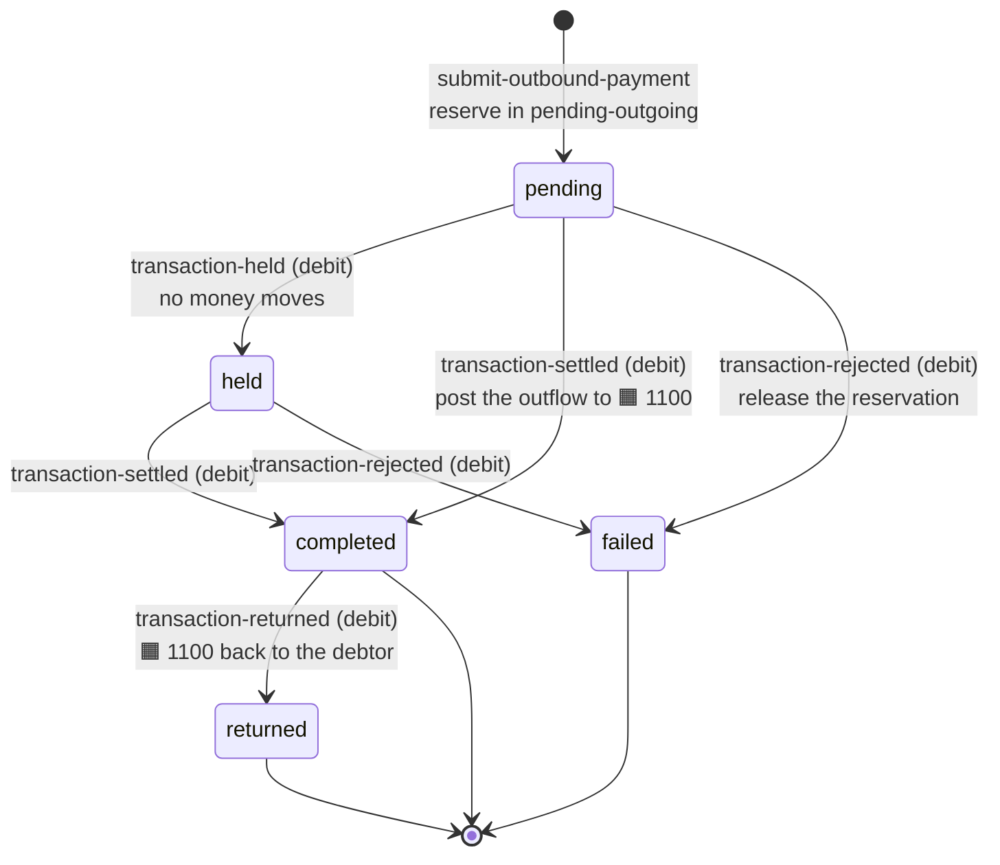

- A held, settled or rejected event for a payment already past it is an
  idempotent no-op, and a settlement for a `failed` payment is skipped
  and logged at ERROR.
- A rejection for a `completed` or `returned` payment, a return for one
  that is not `completed`, and any event for a payment that does not
  exist fail the handler and are dead-lettered.

### Submitting and reserving

An outbound payment is submitted in two hops: the API takes the request,
and the payment processor reserves its amount in one transaction.

#### The API takes the request

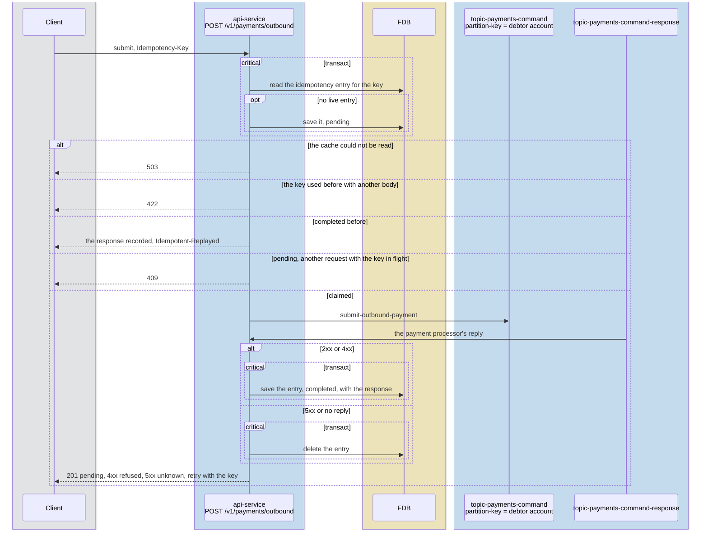

The 201 says the amount is reserved and the payment is on its way to
the provider, not that it has left the bank: its outcome arrives later,
as the sections below show.

#### The payment processor reserves it

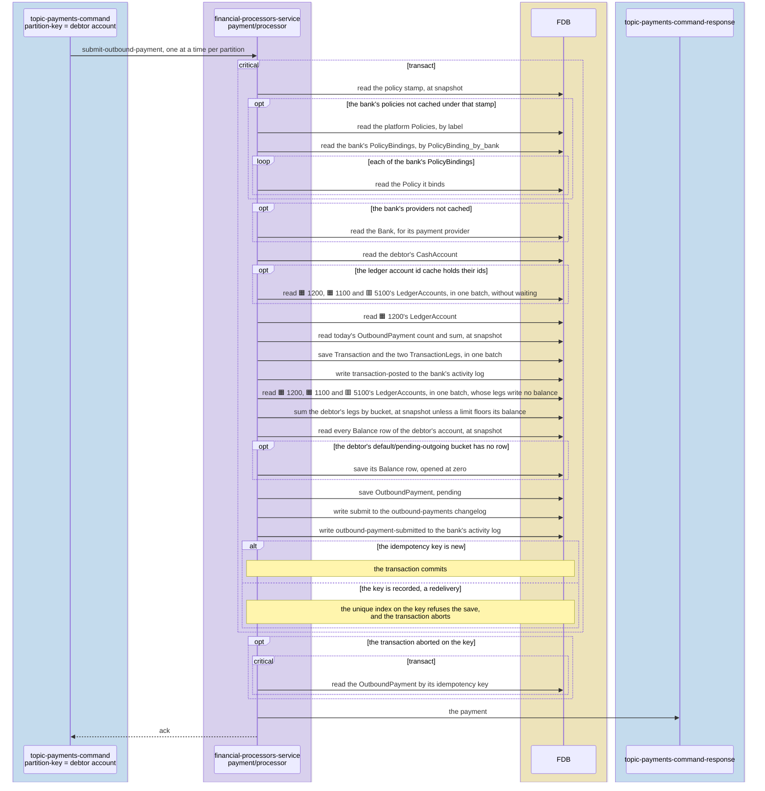

The submission refuses a scheme the bank's provider does not declare,
then checks the debtor, the capability, the daily count and the instant
and daily amount limits. The bank's policies are read again only when
the policy stamp has moved since they were cached. Where the ledger
account id cache holds their ids, one read fetches 1200, 1100, 5100 and
the debtor's control at once, and each later read of one takes it. It
reserves the amount: a debit on the debtor's `default /
pending-outgoing` bucket, which drops the available balance and leaves
the posted one, against a credit on 1200 pending-outbound. 1200 holds
no row of its own, its balance mirroring every customer's
pending-outgoing bucket, per
[ADR-0038](../adr/0038-an-outbound-submit-writes-no-row-every-payment-shares.md),
and the debtor's bucket is the sum of its legs, per
[ADR-0042](../adr/0042-a-cash-accounts-balance-is-the-sum-of-its-legs.md),
so the submission writes a balance row only when the debtor's bucket
opens, and nothing every payment in the bank shares. The funds check
reads the debtor's sums serializably where a floor bounds the debit, so
two debits on one account conflict. The day's count and sum are read at
snapshot, so the limit can be passed by the submissions in flight at
once. A command
delivered again finds its idempotency key recorded: the transaction
aborts, nothing is written twice, and the reply is the payment the first
delivery recorded.

### Each status change is published

Every transition below writes an `outbound-payments` changelog entry in
the transaction that makes it, and one relay publishes them all.

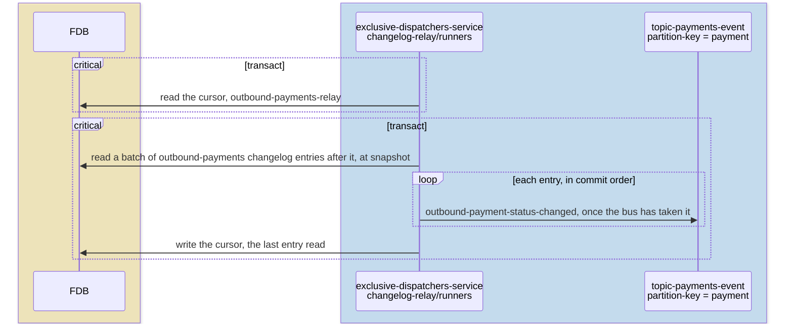

A pass publishes a batch and moves the cursor once, after the last, as
[payments-internal.md](payments-internal.md) describes. The entries
reach the webhook catalogue as `payment.outbound-held`,
`payment.outbound-completed`, `payment.outbound-failed` and
`payment.outbound-returned`.

### Reaching the provider

The submission reaches Modulr in three hops: the bank's activity log
reaches the activity processor, the activity processor sends the
command, and the adapter calls Modulr.

#### The activity log reaches the activity processor

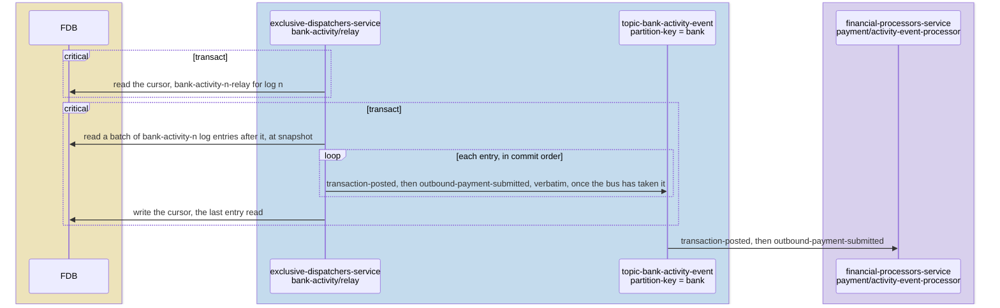

The submission's `transaction-posted` moves no posted bucket, so under
`balances: per-account` it nets to no provider transfer, as
[payments-internal.md](payments-internal.md) draws its handling.

#### The activity processor sends the payment

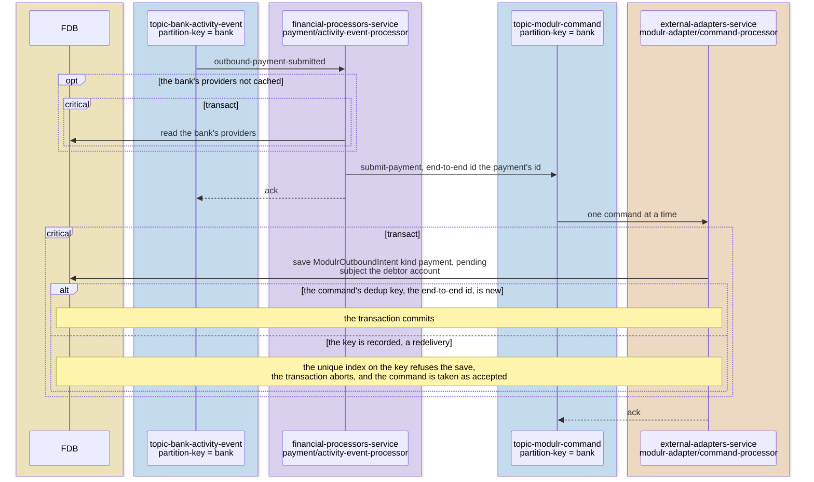

The activity event processor decides from the entry alone and sends on
the bank's provider's command channel, `topic-form3-command` or
`topic-clearbank-command` for a bank on those providers. It records
nothing of its own: an entry delivered again sends the command again,
and the adapter takes the second as the intent it already holds.

#### The adapter calls Modulr

```mermaid
sequenceDiagram
    box rgba(255, 236, 153, 0.5)
    participant DB as FDB
    end
    box rgba(255, 216, 168, 0.5)
    participant IP as external-adapters-service<br/>modulr-relay/outbound-runner
    end
    box rgba(233, 236, 239, 0.5)
    participant PR as Modulr
    end
    critical transact
    IP->>DB: read the oldest 1,000 pending intents, by the status index
    end
    critical transact
    IP->>DB: read the oldest 1,000 sent intents, by the status index
    end
    critical transact
    IP->>DB: read the adapter's breaker
    opt its cool-down over, and no live probe claimed
    IP->>DB: save the breaker, half-open, the probe claimed by this pass
    end
    end
    opt the breaker closed
    critical transact
    IP->>DB: read the breaker, for a failure counted
    end
    end
    alt the breaker open
    loop each pending intent past its maximum age
    critical transact
    IP->>DB: read the intent
    opt still pending
    IP->>DB: save the intent, failed
    IP->>DB: read the outbox for the event's dedup key
    opt not recorded
    IP->>DB: save ModulrOutboxEvent transaction-rejected (debit)
    IP->>DB: write it to the modulr-outbox changelog
    end
    end
    end
    end
    else closed, or this pass holds the probe
    loop each round, while a pending intent may run
    loop each due pending intent no earlier unsent one shares an account with,<br/>at once on the adapter's workers, one only on a probe
    critical transact
    IP->>DB: read the debtor's provider account
    end
    IP->>PR: POST /payments from the debtor's provider account
    opt the call failed, or the breaker has counted a failure
    critical transact
    IP->>DB: read the breaker
    opt the outcome changes it
    IP->>DB: save the breaker
    end
    end
    end
    alt Modulr took the payment
    critical transact
    IP->>DB: read the intent
    opt still pending
    IP->>DB: save the intent, sent, with the provider's payment id
    end
    end
    else Modulr refused it, or its attempts ran out
    critical transact
    IP->>DB: read the intent
    opt still pending
    IP->>DB: save the intent, failed
    IP->>DB: read the outbox for the event's dedup key
    opt not recorded
    IP->>DB: save ModulrOutboxEvent transaction-rejected (debit)
    IP->>DB: write it to the modulr-outbox changelog
    end
    end
    end
    else to be tried again
    critical transact
    IP->>DB: read the intent
    opt still pending
    IP->>DB: save the intent, with its next attempt
    end
    end
    end
    end
    end
    end
    opt the breaker closed, and no call this pass opened it
    loop each sent intent due for reconciliation, at once on the adapter's workers
    IP->>PR: GET /payments, by the provider's payment id
    opt the lookup failed, or the breaker has counted a failure
    critical transact
    IP->>DB: read the breaker
    opt the outcome changes it
    IP->>DB: save the breaker
    end
    end
    end
    critical transact
    IP->>DB: read the intent
    alt Modulr reports it final
    opt still sent
    IP->>DB: save the intent, settled
    IP->>DB: read the outbox for the event's dedup key
    opt not recorded
    IP->>DB: save ModulrOutboxEvent transaction-settled or transaction-rejected
    IP->>DB: write it to the modulr-outbox changelog
    end
    end
    else not final yet
    opt still sent
    IP->>DB: save the intent, with its next reconciliation
    end
    end
    end
    end
    end
```

A pass of the poller reads the oldest 1,000 pending and the oldest 1,000
sent intents the adapter holds, across every bank, by the status index,
and runs them in rounds on the adapter's workers. Each round runs at
once every pending intent that is due and that no earlier intent still
unsent shares an account with, so an account's calls reach
Modulr in the order they were accepted, per
[ADR-0033](../adr/0033-operations-reach-a-provider-in-the-order-they-were-accepted.md),
and the next round takes an account's next call once its earlier one is
sent. Where the sent read stops at its limit, a close or reissue newer
than the last sent intent read waits for a later pass, since an unread
sent intent may share its account. The call pays from the provider
account the adapter recorded when it opened the debtor's account, which
a reissue replaces. While the adapter's breaker is open a pass calls
nothing, as
[ADR-0034](../adr/0034-outbound-calls-go-through-a-breaker-on-their-destination.md)
decides, and fails each pending intent past its maximum age as
undelivered. A refusal, or a call given up, writes
`transaction-rejected` with `failure_kind` `refused` or `undelivered`,
which the rejection path below handles. A sent intent no webhook
settles within the relay's `reconcile-after-ms` is looked up at Modulr,
on the adapter's workers, and a final status is written to the outbox
under the dedup key its webhook would carry, so the payment settles on
the lookup and a late webhook finds it there.

### Settled

#### Modulr reports the settlement

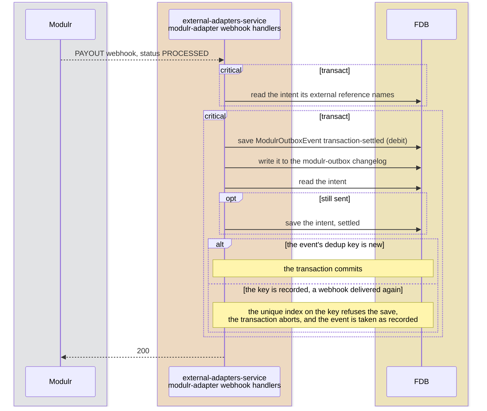

The event's dedup key is Modulr's payment id and the outcome, the key a
reconciliation writes under, so whichever arrives second is taken as
recorded.

#### The settlement reaches the payment

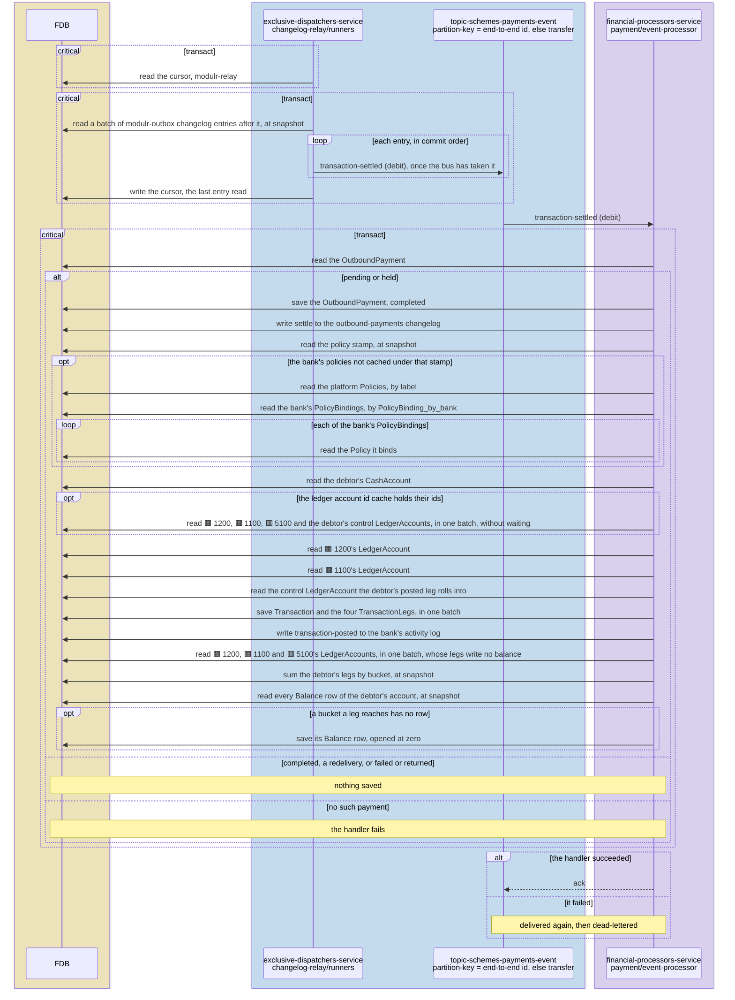

Settlement converts the reservation into the outflow: it credits the
debtor's pending-outgoing bucket and debits its posted one, and debits
1200 against a credit to 1100 cash-at-correspondent. Neither 1200 nor
1100 holds a row, 1100's balance being the sum of its legs, per
[ADR-0039](../adr/0039-cash-at-correspondents-balance-is-the-sum-of-its-legs.md),
and the debtor's two buckets are the sums of theirs, per
[ADR-0042](../adr/0042-a-cash-accounts-balance-is-the-sum-of-its-legs.md),
so settlement writes no balance row unless one of the debtor's buckets
opens. It leaves the available balance as it was, so no limit bounds it
and the debtor's sums are read at snapshot. The transaction
names the debtor as the account the scheme moved the money through, so
its `transaction-posted` entry nets to nothing at a provider holding a
balance per account, which moved the money itself, and the activity
event processor reads and records nothing for it, nor for the
submission's reservation. A settlement for a
`failed` payment is logged at ERROR.

### Rejected

#### Modulr reports the rejection

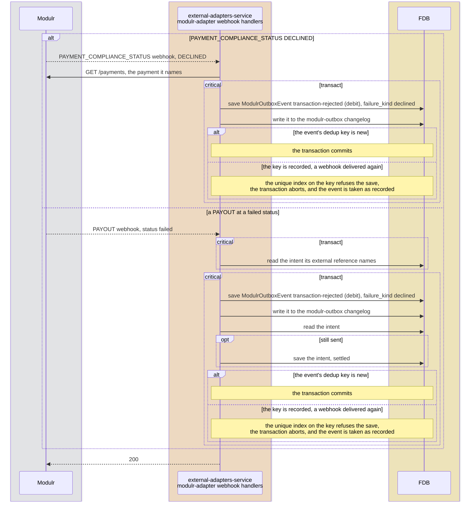

A call Modulr refused, or one the poller gave up on, writes its
`transaction-rejected` from the poller instead, as
[The adapter calls Modulr](#the-adapter-calls-modulr) draws. A
compliance notification carries no payment detail, so the handler reads
the payment from Modulr before it writes.

#### The rejection reaches the payment

A rejection reverses only a payment still in flight, `pending` or
`held`: it debits 1200 and credits the debtor's pending-outgoing bucket,
releasing the reservation, and records the platform's failure kind and
ISO 20022 reason code, which the API answers as `failure`. Neither leg
is a posted one, so no control is read, and the debtor's bucket, the
sum of its legs, writes no row once open. A rejection is not a return,
so one naming a completed payment fails.

### Held

#### Modulr reports the hold

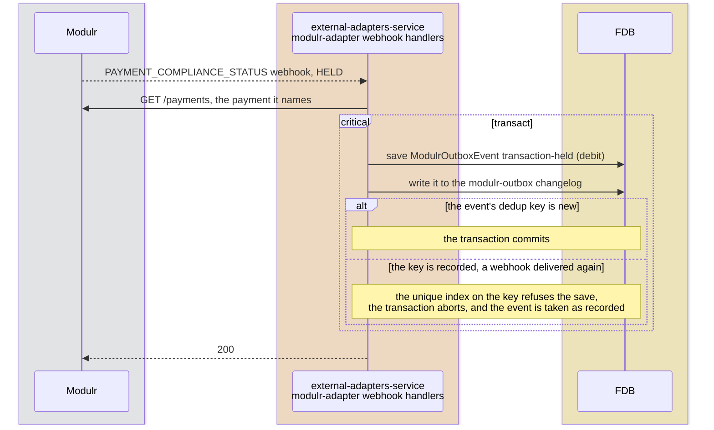

A release records nothing: the PAYOUT that follows it settles or
rejects the payment.

#### The hold reaches the payment

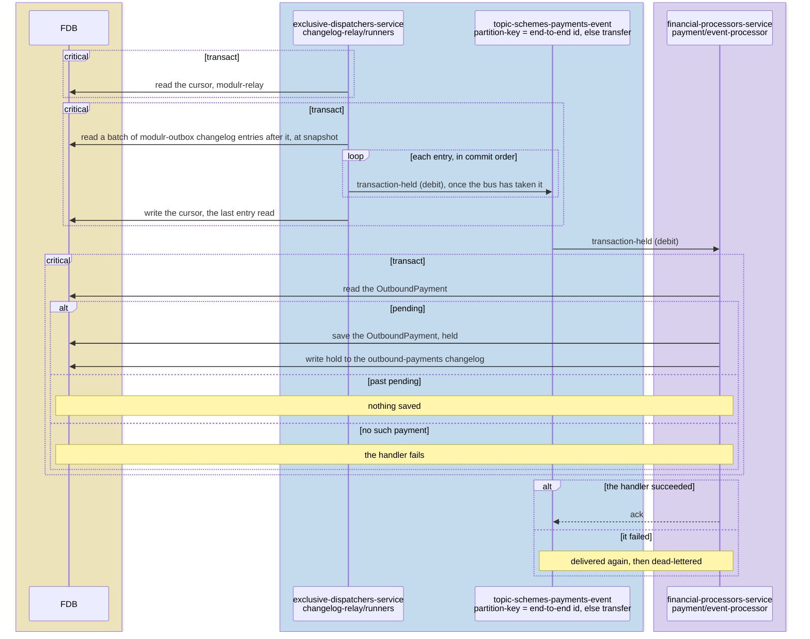

A provider screening the payment holds it with the money still reserved,
and the settlement or rejection that follows moves it on. A payment
pending or held for 24 hours is reported by `payment/outbound-sweep` in
`exclusive-dispatchers-service`: every five minutes it reads, in a
transaction for each status, at most 1,000 pending and 1,000 held
payments created before now less `report-after-ms`, from the
`OutboundPayment_by_status_created_at` index, and logs each at ERROR.

### Returned after settling

#### Modulr reports the return

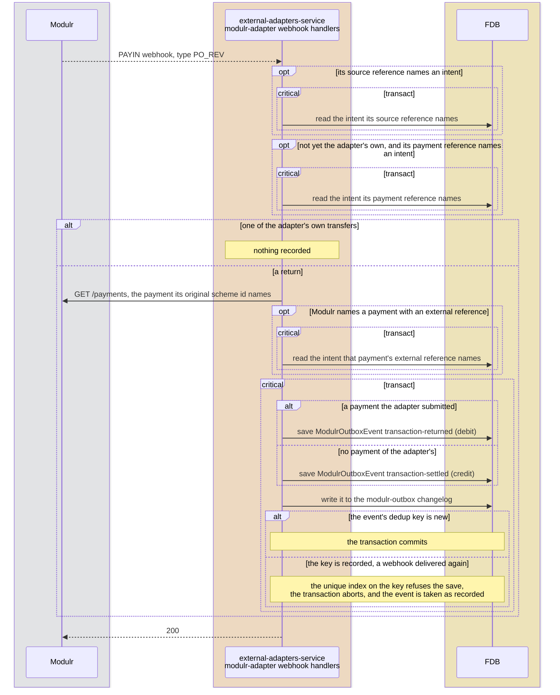

A return the adapter cannot match to a payment it submitted is reported
as money arriving at the account it landed in, so it is never lost, and
takes the inbound path in [payments-inbound.md](payments-inbound.md).

#### The return reaches the payment

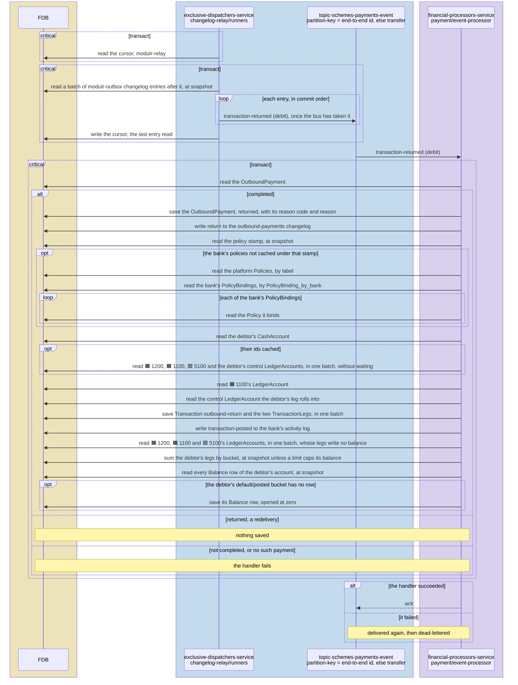

The scheme can return a payment after it completed, when the
beneficiary's bank cannot apply it. The return debits 1100 and credits
the debtor's posted bucket by the amount returned, and names the debtor
as the account the scheme moved the money through, so it nets to nothing
at a per-account provider. Like settlement, it writes no balance row
unless the debtor's bucket opens.

### Tests

- **`payment`** — the unsupported scheme, the reservation, the failure
  fields, settlement, reversal, the return transitions and their
  refusals, and each activity entry sent to the bank's provider keyed by
  the bank.
- **`intent-queue`** — an account's calls made in the order they were
  accepted.
- **`<provider>-adapter`** — each provider event mapped to its scheme
  event with the platform's reason code, every amount converted, and an
  unauthenticated delivery refused.
- **`<provider>-relay`** — backoff, refusal, a retry recognised as the
  same request, and reconciliation writing what a late webhook would.
- **`test-api-scenarios`** — the outbound journeys, settled, rejected by
  the scheme and returned after settling, on every provider that carries
  each.

## Alternatives Considered

- **A synchronous call to the provider from the HTTP handler.**
  Rejected: it ties the request to the provider's latency, and a
  failure mid-call leaves the bank's records unknown.

## Known Limitations

- **A submit-payment that cannot be sent waits for the sweep.** The
  activity processor records nothing of its own, so an
  `outbound-payment-submitted` whose send keeps failing is dead-lettered
  once its retries run out and its offset committed past it, leaving the
  payment `pending` until `payment/outbound-sweep` reports it.
- **Every bank's activity shares one partition.** The four activity logs
  are relayed in parallel, but `topic-bank-activity-event` has one
  partition, so every bank's submissions reach
  `payment/activity-event-processor` one at a time.
- **The webhook's lookups skip the breaker.** A compliance notification
  and a returned PAYIN each read the payment from Modulr inside the
  webhook handler, outside the adapter's breaker, so an unreachable
  Modulr fails the notification, which Modulr delivers again.
- **Outbound held then released is not exercised.** The shared test
  values decline every held outbound.
- **ClearBank returns no outbound.** Its adapter and simulator carry no
  returned outbound payment, and its simulator credits a payment to an
  account it has closed.
- **A return reaches a closed account.** A payment returned after its
  debtor account closed credits that account, and the money waits there
  for the bank to move by hand.
- **Settlements queue per partition.** `topic-schemes-payments-event`
  has a partition per `financial-processors-service` replica, each read
  one event at a time, so settlements queue behind those on their own
  partition, as [performance-testing.md](performance-testing.md)
  measures.

## References

- [payments](../prd/payments.md) — the product requirements this design
  serves.
- [payments.md](payments.md) — the provider declaration and the adapter
  contract.
- [payments-internal.md](payments-internal.md) — internal payments, and
  how a relay's pass publishes a batch.
- [payments-inbound.md](payments-inbound.md) — inbound payments.
- [outbound-delivery](outbound-delivery.md) — the intent poller, its
  breaker and reconciliation.
- [chart-of-accounts](chart-of-accounts.md) — 1100 and 1200.
- [performance-testing](performance-testing.md) — the outbound load
  scenario and its ceilings.
- [ADR-0033](../adr/0033-operations-reach-a-provider-in-the-order-they-were-accepted.md)
  — the bank's activity log and the order calls reach a provider in.
- [ADR-0034](../adr/0034-outbound-calls-go-through-a-breaker-on-their-destination.md)
  — the breaker every call to Modulr goes through.
- [ADR-0038](../adr/0038-an-outbound-submit-writes-no-row-every-payment-shares.md)
  — 1200 mirrored from the customers' pending-outgoing balances.
- [ADR-0039](../adr/0039-cash-at-correspondents-balance-is-the-sum-of-its-legs.md)
  — 1100 summed from its legs.
