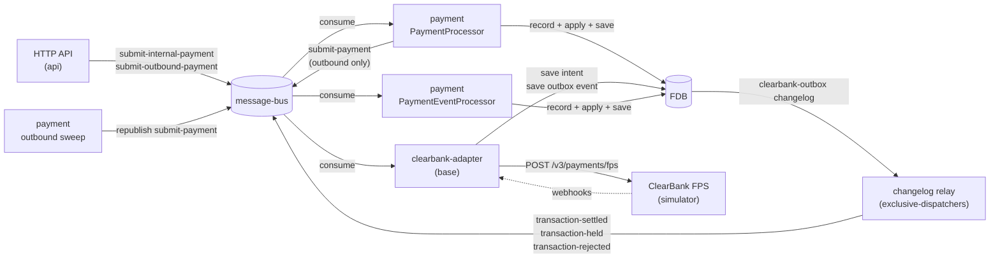
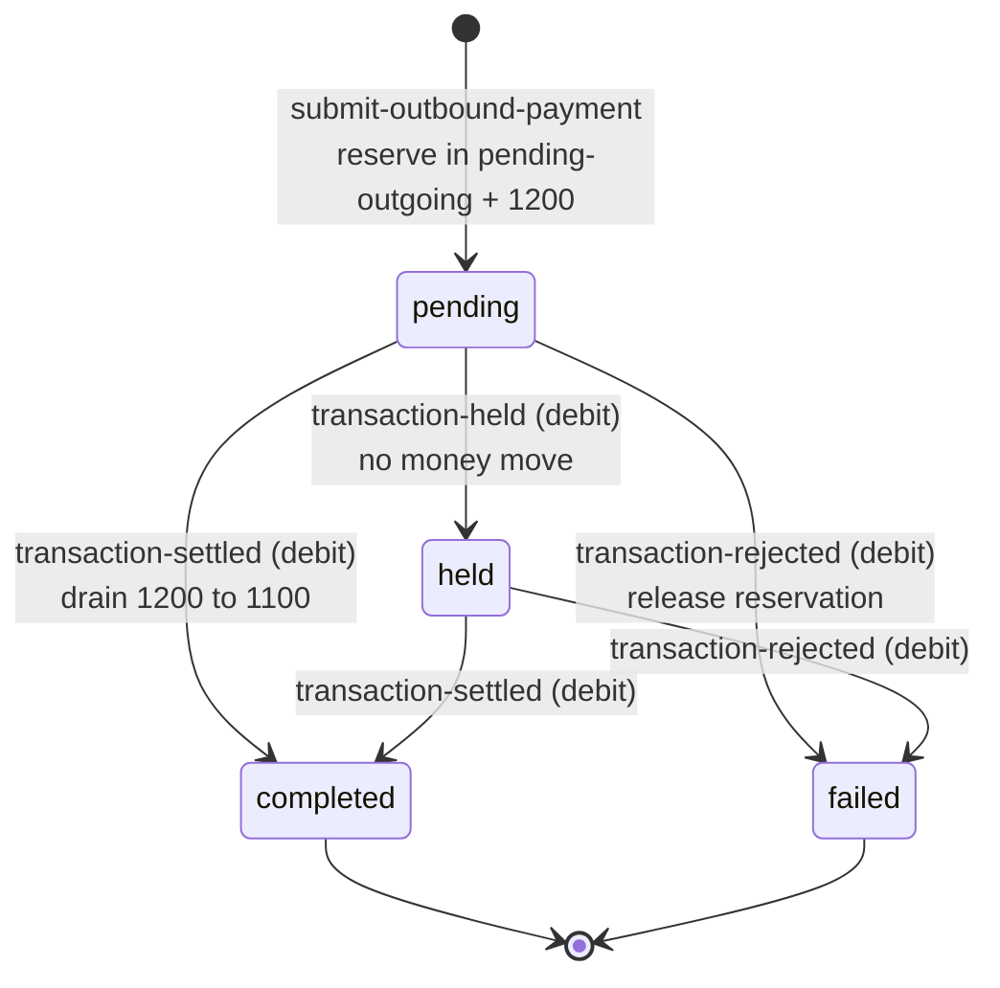
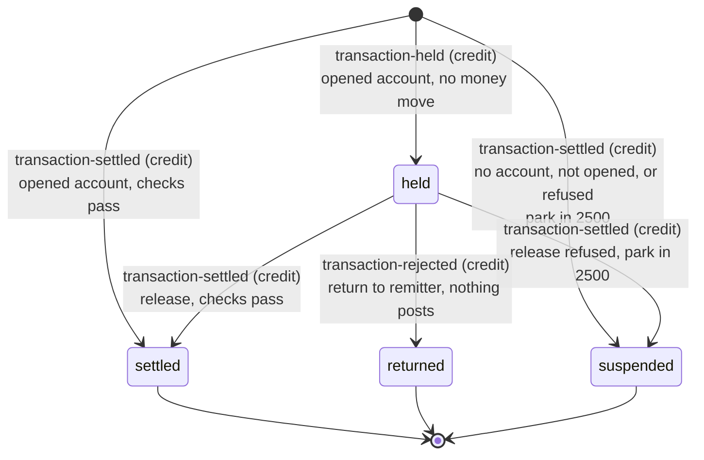
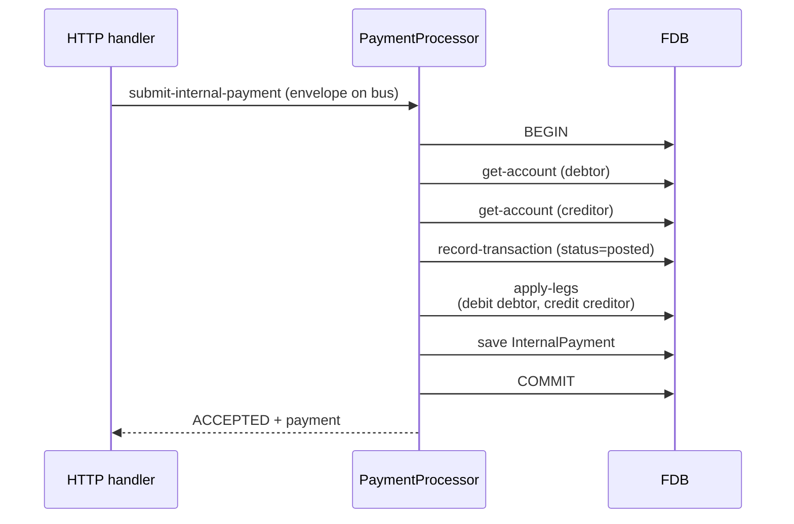
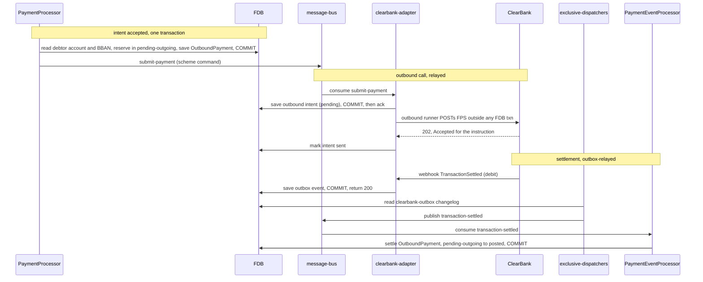
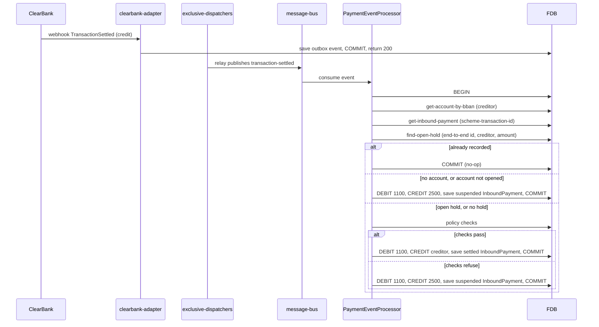

# Payments and ClearBank choreography

> **Status: implemented.**

## Objective

Queenswood handles three kinds of payment: **internal** (one Queenswood
account to another), **outbound** (money leaving Queenswood via UK Faster
Payments Service through ClearBank), and **inbound** (money arriving at a
Queenswood account via the same scheme). This TDD describes how each is
structured, how the bank's payment records relate to the underlying
double-entry transactions, and how Queenswood choreographs with ClearBank
for the FPS-bound flows.

In scope: the `payment` and `payment-query` bricks, the `clearbank-relay`,
`clearbank-webhook` and `payee-check` components, the `clearbank-adapter`
and `clearbank-simulator` bases, the three payment flows, settlement via
webhook → outbox → event processor, and Confirmation of Payee.

Out of scope: the underlying double-entry mechanics, see
[transactions-and-balances.md](transactions-and-balances.md); the API-layer
idempotency cache, see [idempotency.md](idempotency.md); how a policy is
evaluated, see [policy-evaluation.md](policy-evaluation.md); what a bank
and its customers need from payments, see
[prd/payments.md](../prd/payments.md); the specific FPS scheme rules and
messages, which ClearBank documents.

## Background

Three payment kinds; two settlement patterns.

**Internal payment.** Both accounts are inside Queenswood. No external
scheme is involved. The payment settles immediately — the bank moves money
between two of its own ledgers, atomically.

**Outbound payment.** Money leaves Queenswood through the FPS scheme. The
bank doesn't itself talk to FPS — it talks to ClearBank, the clearing bank
that fronts the scheme. At submission the payment is *intent*: until
ClearBank confirms the scheme has accepted it, the money mustn't be
considered gone. It is held in a `pending-outgoing` bucket. When ClearBank
reports settlement by webhook, it moves from pending-outgoing to posted.

**Inbound payment.** Money arrives at one of our SCAN addresses (sort code
and account number). ClearBank receives the scheme message and fires a
settlement webhook with the creditor BBAN and amount. We look up the
account, record a transaction, and credit the receiving balance.

The two settlement patterns:

- **Atomic-now** (internal): record + apply in one FDB transaction. No
  pending state.
- **Two-phase** (outbound, inbound): record the intent or receipt, and
  settle when the scheme confirms. The pending bucket is the "intent
  registered, value not yet spendable" state.

The choreography sits on the message-bus per
[ADR-0003](../adr/0003-message-bus-abstraction.md) and Avro payloads per
[ADR-0004](../adr/0004-avro-for-message-payloads.md). ClearBank is reached
through a dedicated adapter base, and a simulator stands in for it (see
"Reaching ClearBank").

## Solution

### Architecture

- **`payment`** (component) — owns InternalPayment, OutboundPayment and
  InboundPayment records and every write to them. Provides a
  `PaymentProcessor` (consumes commands), a `PaymentEventProcessor`
  (consumes scheme events) and the outbound sweep. The processors run in
  `financial-processors-service`, the sweep in
  `exclusive-dispatchers-service`.
- **`payment-query`** (component) — the reads: bank-scoped reads by id,
  unscoped reads for the event processors, the open-hold match, the reads
  by status, and the business-day counts and sums the limit checks use.
  `api` reads payments through it and never requires `payment`.
- **`clearbank-adapter`** (base) — the only code that speaks ClearBank's
  HTTP shape. Consumes scheme-level `submit-payment` commands and persists
  each as an intent, receives webhooks and persists each as outbox events,
  and serves Confirmation of Payee. Runs in `external-adapters-service`.
- **`clearbank-relay`** (component) — the adapter's outbox and intent
  stores, and the outbound runner that POSTs pending intents to ClearBank.
- **`clearbank-webhook`** (component) — the Malli schemas and examples of
  the webhook payloads the adapter's routes validate.
- **`clearbank-simulator`** (base) — ClearBank's FPS and Confirmation of
  Payee HTTP API, and the webhooks it fires back.
- **`payee-check`** (component) — Confirmation of Payee checks, persisted
  per bank.

Two distinct paths through the message bus:

- **Command path** for submission (HTTP → PaymentProcessor).
- **Event path** for settlement (adapter outbox → changelog relay →
  PaymentEventProcessor).

### Payment records

Three record types in `payment`:

- **InternalPayment** — debtor account, creditor account, amount,
  reference, transaction-id. No status field: an internal transfer is
  settled atomically at submission.
- **OutboundPayment** — debtor account, creditor BBAN and name, amount,
  reference, transaction-id, status (`pending` / `held` / `completed` /
  `failed`), plus cancellation code and reason on failure.
- **InboundPayment** — creditor account, debtor name and BBAN, amount,
  reference, transaction-id, scheme-transaction-id (ClearBank's
  identifier), end-to-end-id, status (`settled` / `held` / `returned` /
  `suspended`). A payment parked in suspense at settlement has no creditor
  account. A hold that becomes `suspended` keeps the creditor it was held
  for.

Each payment links to a Transaction via `:transaction-id`. The Payment
record carries the user-facing intent and the external-scheme metadata; the
Transaction record carries the double-entry posting. They live in different
bricks and join via the id.

### Payment state machines

A payment's lifecycle is driven by two processors, both wired in `payment`
and dispatched in `commands.clj`:

- **`PaymentProcessor`** (`dispatch`) consumes commands off the bus —
  `submit-internal-payment` and `submit-outbound-payment` — and creates the
  payment record. Submission handlers live in `core.clj`.
- **`PaymentEventProcessor`** (`dispatch-event`) consumes the scheme events
  the ClearBank adapter writes — `transaction-settled`, `transaction-held`,
  `transaction-rejected` — and drives every post-submission transition.
  Event handlers live in `events.clj`.

The same three scheme events serve both inbound and outbound; the
`debit-credit-code` on the event discriminates. A **debit** is the outbound
side (our customer paying out), a **credit** the inbound side (money
arriving). `dispatch-event` routes on the `(event, debit-credit-code)`
pair:

| Event | debit → outbound | credit → inbound |
|-------|------------------|-------------------|
| `transaction-settled` | `settle-outbound` | `settle-inbound` |
| `transaction-held` | `hold-outbound` | `hold-inbound` |
| `transaction-rejected` | `reject-outbound` | `return-inbound` |

A `transaction-rejected` with an absent or unknown code defaults to the
outbound path.

#### Internal payment

No status field and no state machine: an internal transfer is recorded and
posted in one FDB transaction at `submit-internal-payment`, so it is
settled the moment it exists. There is no scheme leg and no later event.

#### Outbound payment

States are `OutboundPaymentStatus`: `pending`, `held`, `completed`,
`failed`. (`processing` is defined in the enum but unused, and `unknown` is
the proto zero-value guard.)

| From | Driving event | To | Funds |
|------|---------------|----|-------|
| (new) | `submit-outbound-payment` command | `pending` | reserve: debtor pending-outgoing debited, 1200 credited |
| `pending` | `transaction-held` (debit) | `held` | none — stays in 1200 while the scheme screens |
| `held` / `completed` / `failed` | `transaction-held` (debit) | unchanged | none — ignored |
| `pending` / `held` | `transaction-settled` (debit) | `completed` | post the outflow: 1200 → 1100, debtor posted debited |
| `pending` / `held` | `transaction-rejected` (debit) | `failed` | reverse reservation: 1200 → debtor, available restored |
| `completed` | `transaction-settled` (debit) | `completed` | idempotent no-op |
| `failed` | `transaction-settled` (debit) | `failed` | none — skipped, logged at ERROR with the payment's status and cancellation code |
| `failed` | `transaction-rejected` (debit) | `failed` | idempotent no-op |
| `completed` | `transaction-rejected` (debit) | (handler fails) | none — a settled outbound cannot be reversed, and the event is dead-lettered |
| (no payment) | any debit event | (handler fails) | none — dead-lettered |

A `transaction-rejected` (debit) comes from a scheme decline, an assessment
failure, or the outbound runner failing the intent (see "The outbound
runner").

#### Inbound payment

States are `InboundPaymentStatus`: `settled`, `held`, `returned`,
`suspended`. Inbound has no submission command — every transition is
event-driven, and the entry state depends on whether the creditor BBAN
matches an opened account and whether the bank's policies accept the
money.

| From | Driving event | Guard | To | Funds |
|------|---------------|-------|----|-------|
| (new) | `transaction-settled` (credit) | BBAN matches an opened account, checks pass | `settled` | credit the creditor (1100 → creditor) |
| (new) | `transaction-settled` (credit) | BBAN matches an opened account, checks refuse | `suspended` | park in that bank's 2500 (1100 → 2500) |
| (new) | `transaction-settled` (credit) | BBAN matches an account that is not opened | `suspended` | park in 2500 (1100 → 2500), and a hold for that account stays `held` |
| (new) | `transaction-settled` (credit) | no account matches, a bank owns the sort code | `suspended` | park in that bank's 2500 (1100 → 2500) |
| (new) | `transaction-settled` (credit) | no bank owns the sort code | (handler fails) | none — dead-lettered |
| (new) | `transaction-held` (credit) | BBAN matches an opened account | `held` | none — funds held at ClearBank |
| (new) | `transaction-held` (credit) | BBAN matches an account that is not opened | (ignored) | none — not recorded |
| (new) | `transaction-held` (credit) | no matching BBAN | (ignored) | none — not recorded |
| `held` | `transaction-held` (credit) | an open hold with the same end-to-end id, creditor and amount | `held` | idempotent no-op |
| `held` | `transaction-settled` (credit) | open hold matched by end-to-end id, creditor and amount, checks pass | `settled` | release: credit the creditor |
| `held` | `transaction-settled` (credit) | open hold matched, checks refuse | `suspended` | park in 2500 (1100 → 2500) |
| `held` | `transaction-rejected` (credit) | BBAN on the event, open hold for that creditor and end-to-end id | `returned` | none — funds returned to remitter |
| `held` | `transaction-rejected` (credit) | no BBAN, one open hold for the end-to-end id | `returned` | none — funds returned to remitter |
| `held` | `transaction-rejected` (credit) | no BBAN, several open holds for the end-to-end id | (handler fails) | none — dead-lettered |
| (none) | `transaction-rejected` (credit) | no open hold matches | (ignored) | none |
| `settled` / `suspended` | `transaction-settled` (credit) | duplicate scheme-transaction-id | unchanged | idempotent no-op |

`suspended` and `returned` are terminal.

### Internal payment flow

One processor, one FDB transaction, atomic. No external scheme and no
pending state. The reply returns immediately.

### Outbound payment flow

The HTTP response returns *intent accepted*, not *money sent*. The amount
is held in `pending-outgoing` (visible to the customer via the
available-balance derivation) until ClearBank confirms.

**Submission.** `submit-outbound` reads the debtor account inside its
transaction. After the commit it publishes `submit-payment`, built from the
OutboundPayment and the debtor's BBAN, with the payment id as end-to-end
id. A publish failure is logged at ERROR, and the submission is still
answered ACCEPTED. From there the adapter makes the submission durable: it
persists the command as an intent and acks, and settlement comes back
through its outbox. See
[transaction-processing.md](transaction-processing.md) for the general
outbox-and-intent model.

**Redelivered submission.** A submit whose idempotency key the bank has
already used meets `OutboundPayment_by_idempotency_key`. The processor
reads the existing payment back and answers it as ACCEPTED. While that
payment is `pending`, it reads the debtor account again and publishes the
command again. The adapter's intent store is unique on the end-to-end id,
so a command published twice makes one intent.

**The sweep.** `payment/outbound-sweep` runs in
`exclusive-dispatchers-service`, which has one replica, and in the
monolith. Every five minutes it reads every `pending` and `held`
OutboundPayment, across banks, from `OutboundPayment_by_status_created_at`:

- a `pending` payment older than 15 minutes has its command republished,
  as a redelivered submission does;
- a `pending` or `held` payment older than 24 hours is logged at ERROR with
  its payment id, bank id, status and age.

The sweep writes nothing and changes no payment's status. The three
durations are the component's `interval-ms`, `republish-after-ms` and
`report-after-ms`.

### Inbound payment flow

Inbound payments are *triggered by* the scheme — there's no prior HTTP
request. The webhook arrives, the adapter records an event, the event
processor settles.

**Unmatched inbound → suspense.** When the creditor BBAN matches no
account, the receipt is *not* dropped: the owning bank is resolved from the
BBAN's sort code (`bank/get-bank-by-sort-code`, per-bank sort codes), and
the funds are parked in that bank's `2500` suspense GL account (DEBIT
`1100` / CREDIT `2500`) with a `suspended` InboundPayment recorded for
later reconciliation. A BBAN that resolves to an account that is not
`:cash-account-status-opened` parks the same way, in the account's bank,
because the credit cannot land on it. A sort code that matches no bank is
foreign, and the handler fails (we only receive inbounds for sort codes we
own).

**Money that has arrived.** An inbound settlement is money ClearBank has
already received for Queenswood, so a policy never refuses it back to the
sender. A settlement to an opened account runs the checks an inbound
payment runs: the currency matches the account's, the bank's policies
permit `receive` on `inbound-payment`, and the business day's count of
inbound payments stays within the daily limit, as
[policy-evaluation.md](policy-evaluation.md) describes. When a check refuses, the
receipt is parked in that bank's 2500 suspense exactly as an unmatched one
is — DEBIT 1100 / CREDIT 2500, a `suspended` InboundPayment carrying the
scheme transaction id, and an INFO log naming the refusal kind — and the
handler returns the parked payment rather than the refusal. A release of a
held inbound runs the same checks, its count leaving out the hold being
released when the hold was recorded on the same business day. A refused
release posts DEBIT 1100 / CREDIT 2500, and the hold becomes `suspended`,
stamped with the scheme transaction id and transaction id. A hold runs no
checks and moves no money. An inbound parked because no account matched,
or because the account is not opened, runs no checks.

**Held inbound → release / return.** ClearBank can hold an inbound for
screening (`InboundHeldTransaction` → `transaction-held` credit). It's
recorded `held` — the creditor resolved by BBAN — but **no money moves**,
because the funds are held *at* ClearBank, not ours yet. An inbound's
end-to-end id is whatever the sending bank supplied, often `NOTPROVIDED`,
so a hold is matched on its end-to-end id, creditor account and amount.
The hold then resolves:

- **Release** — a `TransactionSettled` (credit) whose end-to-end id,
  creditor and amount match an open hold settles it, subject to the checks
  above (DEBIT `1100` / CREDIT creditor), and the held record flips
  `held → settled`, stamped with the now-known scheme transaction id.
- **Return** — a `TransactionRejected` (credit) flips the matching hold
  `held → returned`, and nothing posts (the funds went back to the
  remitter). When the event carries the creditor's BBAN, the match is the
  oldest open hold for that creditor and end-to-end id. Without one, it is
  the only open hold for the end-to-end id, and several open holds fail
  the handler rather than return the wrong one.

`transaction-rejected` carries a `debit-credit-code`, so the event
processor routes the debit side to the outbound reversal and the credit
side to the inbound return.

### ClearBank adapter

`clearbank-adapter` is its own base, with its stores in `clearbank-relay`.
Its egress is an outbox on the webhook edge and an intent on the ClearBank
edge. The Onfido adapter uses the same pattern via `onfido-relay`; see
[transaction-processing.md](transaction-processing.md) for the general
model.

#### Webhooks

The webhook receiver is HTTP endpoints under the adapter's own server,
separate from `api`. It maps each scheme-specific payload to one or more
internal events and writes them to the `clearbank-outbox` store in one
transaction, answering 200 only on commit, so a failed write is answered
500 and redelivered by ClearBank rather than lost. It authenticates nobody
(see "Reaching ClearBank").

**Amounts.** ClearBank sends an amount as a decimal number of pounds. The
adapter converts it to minor units exactly, through `BigDecimal`, so `0.29`
is 29 pence. An amount that is missing, negative or carries more than two
decimal places is refused: the webhook is answered 400 with an RFC 9457
problem body whose `type` is `:payment/invalid-scheme-amount`, the refusal
is logged at ERROR, and nothing is written. The FPS request renders the
amount back as an exact two-place decimal.

**Dedup keys.** Every outbox event carries a `dedup-key`, unique in the
store, so a redelivered webhook is answered 200 without a second event:

- an inbound settlement is `<TransactionId>:settled`, and an inbound
  rejection `<TransactionId>:rejected`;
- an outbound settlement is `<EndToEndTransactionId>:settled`, and an
  outbound rejection `<EndToEndTransactionId>:rejected`;
- an assessment failure is `<EndToEndId>:rejected` per instruction;
- an inbound hold is
  `<EndToEndTransactionId>:<BBAN>:<minor units>:<TimestampCreated>:held`,
  since the held webhook carries no `TransactionId`;
- an outbound hold is `<EndToEndTransactionId>:held`.

An outbound's end-to-end id is the payment id Queenswood issued, so it is
unique. An inbound's is the sending bank's, so two receipts can share it.

**Assessment failures.** When ClearBank rejects a payment at
pre-settlement assessment, it fires `PaymentMessageAssessmentFailed`, a
batch webhook listing `{EndToEndId, Reasons}` instructions. ClearBank's
payload spells the list `AssesmentFailure`; the adapter reads that key or
`AssessmentFailure`, and the route's `PaymentMessageAssessmentFailedWebhook`
schema admits either. Each instruction becomes a `transaction-rejected`
(debit) event with the code `CB_AssessmentFailed` and the joined reasons,
so the payment, still `pending`, is reversed and failed as a scheme decline
is. A payload listing no instructions under either key is answered 400 with
`:payment/invalid-assessment-payload`.

#### Scheme command consumer

A message-bus consumer for `submit-payment` commands. Each is persisted as
a `pending` outbound intent, unique on its end-to-end id, and acked. The
consumer makes no HTTP call.

#### The outbound runner

A daemon in `clearbank-relay` polls pending intents every 200 ms and POSTs
each one that is due to ClearBank's `/v3/payments/fps`, outside any FDB
transaction. ClearBank de-duplicates on the end-to-end id, so a retried
POST is safe. The response decides what happens:

- **Sent** — a 2xx whose per-instruction `response` for the intent's
  end-to-end id is `Accepted`. The intent is marked `sent`.
- **Retried** — a transport failure, a 5xx, a 408, a 429, or any status
  outside 2xx and 4xx. The intent records the attempt and a
  `next_attempt_at`, the delay starting at one second and doubling to at
  most 60 seconds: 1, 2, 4, 8, 16 and 32 seconds before attempts 2 to 7,
  then 60 seconds before each attempt to the twentieth.
- **Refused** — any other 4xx, or a 2xx whose `response` for the intent is
  not `Accepted` or is missing.

A refused intent, and one still retried at its twentieth attempt, about
fourteen minutes after the first, is failed. In one FDB transaction, and
only while the intent is still `pending`, the runner marks it `failed` and
writes a `transaction-rejected` (debit) outbox event keyed
`<end-to-end id>:submission-rejected`, carrying the cancellation code
`CB_SubmissionRefused` or `CB_SubmissionFailed` and a reason naming the
last status or response. The payment event processor then reverses the
reservation and fails the payment, as it does for a scheme decline. The
attempt limit and both backoff bounds are set on the `outbound-runner` in
`clearbank-adapter.yml`.

#### The changelog relay

The adapter's webhook events and the runner's failures land in the
`clearbank-outbox` store. The changelog relay that reads that store's
changelog and publishes each event to `topic-schemes-payments-event` runs
in `exclusive-dispatchers-service`, beside every other store's runner,
since a changelog cursor admits one dispatcher, per
[ADR-0019](../adr/0019-processor-packaging.md). "Webhook received" and
"downstream told" cannot diverge.

#### Confirmation of Payee

The `payee-check` processor, in `financial-processors-service`, handles a
bank's `POST /v1/payee-checks` by calling the adapter's `/cop/outbound`,
which calls ClearBank's Confirmation of Payee API, and persists the check
— request and match result — for 24 hours. `GET /v1/payee-checks` and
`GET /v1/payee-checks/{check-id}` read them back. The adapter also answers
ClearBank's inbound CoP request webhook from the cash-account and party
reads.

### Reaching ClearBank

Only the simulator is reachable. The `dev` and `test` profiles point the
outbound runner, the adapter's CoP handler and the webhook registrar at the
simulator server started in the same system. Every other profile points
them at `CLEARBANK_SIMULATOR_URL`, which the Helm values set to the
simulator running beside the adapter in `external-adapters-service`. The
FPS POST carries only a content type.

A live integration needs:

- ClearBank's API URL and credentials, under a setting named for
  ClearBank.
- Request signing on every call to ClearBank.
- Verification of ClearBank's signature on every webhook. The receiver's
  routes carry no security metadata, the chain ahead of them only injects
  components, and no adapter config holds a signing secret, so anything
  that reaches the port can post an event.
- Webhook registration done outside the adapter, whose registrar registers
  its webhooks by POSTing to the simulator.

### ClearBank simulator

`clearbank-simulator` is its own base. It exposes the subset of ClearBank's
HTTP API that Queenswood uses:

- **`/v3/payments/fps`** — accepts payment submissions, answers 202 with
  `Accepted` per instruction, and after a configurable delay fires the
  webhooks back to the adapter. A creditor BBAN with sort code `000000`
  fires `PaymentMessageAssessmentFailed`. A creditor BBAN with sort code
  `999998` is answered 202 with the instruction `Rejected`, and nothing is
  fired. The sandbox sentinel creditor name `6a41a29eafcf455493` fires
  `OutboundHeldTransaction`, then a `TransactionRejected` with
  `CancellationCode HOPRJ`, since ClearBank exposes no sandbox control for
  release. Anything else settles, debit then credit.
- **`/simulate/inbound-payment`** — fires an inbound `TransactionSettled`
  (credit). The sentinel debtor name `6a41a29eafcf455493` instead fires an
  `InboundHeldTransaction`, then resolves per the request `outcome`
  (`return` → a `TransactionRejected`, carrying the creditor's BBAN when
  the request names one, anything else → settled).
- **CoP endpoints** — the same idea for Confirmation of Payee.

The simulator is approximate (happy paths plus the named rejection
scenarios above), but covers the choreography end to end, so tests exercise
the full settlement loop without external calls.

### Failures and the dead-letter topic

The `schemes-payments-event` consumer in `financial-processors-service`
leaves an event unacknowledged when its handler throws or returns an
anomaly, so the event is redelivered. Past `max-redeliveries` (5), the
consumer sends the raw message to `topic-schemes-payments-event-dlq`. An
event lands there when:

- an unmatched inbound's sort code belongs to no bank
  (`:payment/no-bank-for-sort-code`);
- a `transaction-rejected` (debit) names an outbound payment that is
  `completed`;
- a debit event names an outbound payment that does not exist;
- a return without a BBAN matches several open holds
  (`:payment/ambiguous-hold`);
- any handler fails on every delivery, whatever the cause.

Nothing reads or replays the dead-letter topic. The monolith's local bus
has no dead-letter path.

### Atomicity, ordering, idempotency

**Atomicity.** Each settlement is one FDB transaction — record + apply +
save commits together. Cross-process the choreography is asynchronous, but
each leg of it (the processor's commit, the adapter's webhook handling, the
runner's failure of an intent, the event processor's settlement) is locally
atomic.

**Ordering.** Every payment topic has one partition, and
`financial-processors-service` runs one replica, so the payment event
processor handles scheme events one at a time, in the order the changelog
relay read them from the outbox. Outbox events carry no ordering key, so a
second partition could deliver a hold's settlement before the hold.
Webhooks arrive in the order ClearBank emits them.

**Idempotency.**

- **Submissions** are covered by the API-layer FDB-backed idempotency cache
  (`idempotency/cache-response`), scoped by
  `[principal_id, operation, idempotency_key]`. Duplicate requests within
  the 24 h window receive the original response. See
  [idempotency.md](idempotency.md).
- **At the store layer**, `InternalPayment_by_idempotency_key` and
  `OutboundPayment_by_idempotency_key` are unique on
  `[bank_id, idempotency_key]`. A redelivered command, or a retry the cache
  no longer covers, meets the index, and the processor answers the
  original payment as ACCEPTED. A retry under a different key is a new
  request to both layers, and creates a second payment.
- **Webhooks** dedup on the outbox `dedup-key`, and **scheme commands** on
  the intent's end-to-end id (see "ClearBank adapter").
- **Inbound settlement** dedups on `scheme-transaction-id`, whatever the
  recorded payment's status. The check is FDB-indexed and atomic with the
  settlement transaction.
- **Inbound holds** dedup on an open hold with the same end-to-end id,
  creditor and amount.
- **Outbound settlement and rejection** dedup on the outbound payment's
  status.

### Reading payments

Every payment read `api` serves is scoped to the caller's bank and gated
`org:viewer`:

- `GET /v1/payments/internal/{payment-id}`,
  `GET /v1/payments/outbound/{payment-id}` and
  `GET /v1/payments/inbound/{payment-id}` answer the payment, and 404
  `payment/not-found` when it belongs to another bank, as when it does not
  exist.
- `GET /v1/payments/inbound?status=<status>` lists the bank's inbound
  payments in one status — `settled`, `suspended`, `held` or `returned`,
  required — newest first, from `InboundPayment_by_bank_status_created_at`,
  paged with the shared page parameters and cursor links.

The event processors receive no bank, and read outbound payments by id and
inbound payments by scheme transaction id unscoped.

### Three roles for the message bus in this flow

- **HTTP-facing command channel** — submit-internal-payment /
  submit-outbound-payment commands from the API.
- **Scheme command channel** — submit-payment commands from `payment` to
  the ClearBank adapter (separate channel to keep scheme traffic distinct).
- **Event channel** — `transaction-settled`, `transaction-held` and
  `transaction-rejected` events from the adapter's outbox to the payment
  event processor, with its dead-letter topic.

All three sit on the same message-bus abstraction; the channel separation
is configuration, not infrastructure.

### Tests

- **Brick tests.** `clearbank-adapter`'s `publisher_test.clj` (every amount
  from 0.00 to 999.99, the dedup keys, both assessment spellings, the FPS
  body) and `interface_test.clj` (settlements sharing an end-to-end id, the
  400s, a redelivered `submit-payment`); `clearbank-relay`'s
  `interface_test.clj` (backoff, refusal, failing an intent once);
  `payment`'s `domain_test.clj`, `store_test.clj` (scoped reads, the hold
  match, the reads by status) and `sweep_test.clj`; `schema`'s
  `transaction-rejected` old-reader test; and `fdb`'s multi-record compound
  query.
- **Domain scenarios**, in `test-scenarios`:
  - Internal: `intra-bank-internal-transfer.edn`,
    `cross-bank-internal-transfer-rejected.edn`,
    `self-transfer-rejected.edn`,
    `zero-amount-internal-transfer-rejected.edn`,
    `unknown-currency-internal-rejected.edn`,
    `daily-limit-breach-internal.edn`.
  - Outbound: `simple-outbound.edn`, `outbound-payment.edn`,
    `capability-denied-outbound.edn`,
    `negative-amount-outbound-rejected.edn`,
    `daily-limit-breach-outbound.edn`, `outbound-reject-completed.edn`,
    `outbound-reject-then-settle.edn`, `outbound-submit-redelivered.edn`.
  - Inbound: `simple-inbound.edn`, `daily-limit-breach-inbound.edn`,
    `curative-inbound-when-in-breach.edn`, `inbound-held-released.edn`,
    `inbound-held-returned.edn`, `inbound-held-to-closed-ignored.edn`,
    `inbound-hold-then-settle-one-credit.edn`,
    `inbound-held-release-refused.edn`, `inbound-two-holds-one-e2e.edn`.
  - Redelivery and failure: `payment-event-idempotency.edn`,
    `settlement-event-dead-lettered.edn`.
  - Every flow: `full-happy-path.edn`.
- **API scenarios**, in `test-api-scenarios` under `payments/`:
  - Internal: `internal-replay.edn`, `internal-race.edn`,
    `internal-lost-reply.edn`, `two-banks-one-key.edn`.
  - Outbound: `outbound-assessment-failed.edn`,
    `outbound-held-then-declined.edn`, `outbound-submission-refused.edn`,
    `outbound-two-keys-two-payments.edn`.
  - Inbound: `inbound-pence-amount.edn`, `inbound-unmatched-suspense.edn`,
    `inbound-to-closed-bban-suspense.edn`, `inbound-suspended-list.edn`,
    `inbound-held-released.edn`, `inbound-held-returned.edn`.
  - Reads: `cross-bank-payment-read.edn`.
  - Every flow: `e2e/full-happy-path.edn`, and Confirmation of Payee under
    `payee-checks/`.

## Alternatives Considered

- **Synchronous call to ClearBank from the HTTP handler.** Submit the
  payment over the wire to ClearBank in-band with the HTTP request, and
  respond with the scheme outcome directly. Rejected — it ties HTTP
  thread-pool capacity to ClearBank's latency, a failure during the call
  leaves the bank's records in an unknown state, and replay is awkward.
  The fire-and-forget-with-events pattern decouples the bank from
  ClearBank's response time and gives durable intent records to retry
  against.
- **Single Payment record, no separate Transaction record.** Combine the
  user-facing payment intent and the financial posting into one record.
  Rejected — Payment carries scheme metadata (BBAN, scheme-transaction-id)
  that the bookkeeping layer doesn't care about, and Transaction carries
  posting metadata (legs, balance buckets) that the user doesn't see.
- **Direct ClearBank dependency in the payment processor.** Have `payment`
  call ClearBank's HTTP API directly. Rejected — it couples the payment
  brick to an external vendor's API. The adapter base is the only place
  that knows ClearBank's wire shape; the rest of the system sees bus
  messages.
- **Eventual-consistency-only (no settlement step).** Apply outbound to the
  posted bucket immediately and reconcile later if the scheme rejects.
  Rejected — it shows the customer money as "spent" when ClearBank may
  still reject it, and reconciliation is operationally painful.
- **One message-bus topic for everything.** Submit, scheme command and
  settlement events all on one channel. Rejected — it confuses tracing and
  mixes traffic with very different reliability needs (settlement events
  are audit-relevant; scheme commands can be retried freely).
- **Polling ClearBank instead of webhooks.** Periodically ask ClearBank for
  payment status. Rejected — webhooks are the standard FPS pattern, and
  polling adds latency and load when ClearBank already pushes.
- **Returning money a policy refuses.** Send a refused inbound back to the
  remitter instead of parking it. Rejected — it needs an outbound return
  instruction that neither ClearBank's API nor this code has, while
  parking keeps the receipt and leaves the decision to the bank.

## Known Limitations

- **A missing webhook leaves a payment open.** If ClearBank settles or
  declines an outbound payment but the webhook never arrives, the payment
  stays `pending` or `held`, with its funds reserved. The sweep republishes
  a `pending` payment's command and reports a payment stuck for 24 hours,
  but it never fails or completes a payment, and nothing asks ClearBank
  for the payment's status.
- **The payment-side publish is best-effort.** The publish of
  `submit-payment` after the submission commits has no outbox: when the
  broker is unavailable the command is lost, and the payment stays
  `pending` until a redelivered submission or the sweep republishes it,
  15 minutes or more later. The sweep reports it after 24 hours, and never
  fails it. The producer-edge outbox is deferred with the others in
  [transaction-processing.md](transaction-processing.md).
- **Outbound held then released is not exercised.** The simulator declines
  every held outbound, so no scenario drives `held → completed`, and the
  model-equality property test generates no hold, rejection or suspense.
- **Kafka redeliveries have no delay.** A handler failing on a transient
  fault uses its five redeliveries in quick succession, and the event is
  dead-lettered.
- **A suspended inbound is never resolved.** Nothing matches it to an
  account or returns it, and a payment parked by a policy refusal does not
  record the refusal's kind or the account it was for.
- **The inbound list reads a whole status.** It reads every record of the
  bank's status in one FDB transaction before paging, so a bank whose
  `settled` history outgrows one transaction's read limits gets a 500.
- **The status indexes on a populated store.**
  `OutboundPayment_by_status_created_at` and
  `InboundPayment_by_bank_status_created_at` are built inline only while a
  store is small. Past a few hundred records they stay disabled until an
  `OnlineIndexer` runs, and until then the sweep logs a read failure every
  interval and the inbound list answers 500.
- **Meta-data version 54 is one-way.** Once the migrator saves it, an image
  built at 53 cannot open the stores, so a bad deploy is rolled forward.
- **Identical holds are one hold.** Two holds with the same end-to-end id,
  creditor and amount are indistinguishable to the payment brick: a
  settlement or return resolves the older first.
- **Settlement order is ClearBank's.** If ClearBank delivered webhooks out
  of scheme order, a settlement could arrive before its hold, settle as a
  new inbound, and leave the later hold `held`.
- **The simulator is approximate.** Real-world edge cases (partial scheme
  acceptance, retry storms, malformed webhooks) aren't simulated.
- **No FX.** Inbound and outbound payments are single-currency end to end.
  Cross-currency would need explicit FX legs (transactions-and-balances
  TDD) plus scheme-side currency translation that ClearBank handles at its
  boundary.

## References

- [ADR-0002](../adr/0002-foundationdb-record-layer.md) — FoundationDB
  Record Layer (atomic record + apply)
- [ADR-0003](../adr/0003-message-bus-abstraction.md) — Message-bus
  abstraction
- [ADR-0004](../adr/0004-avro-for-message-payloads.md) — Avro for message
  payloads
- [ADR-0019](../adr/0019-processor-packaging.md) — Processor packaging
- [ADR-0020](../adr/0020-providers-are-deployment-facts.md) — External
  providers are deployment facts
- [prd/payments.md](../prd/payments.md) — Payments requirements
- [policy-evaluation.md](policy-evaluation.md) — Policy evaluation engine
- [transaction-processing.md](transaction-processing.md) — Transaction
  processing (the command/event substrate)
- [transactions-and-balances.md](transactions-and-balances.md) —
  Transactions and balances (the bookkeeping substrate)
- [service-apis.md](service-apis.md) — Service APIs (HTTP surface;
  ClearBank simulator and adapter HTTP shapes)
- [idempotency.md](idempotency.md) — Idempotency
- `payment` and `payment-query` brick interfaces
- `clearbank-adapter` and `clearbank-simulator` bases
