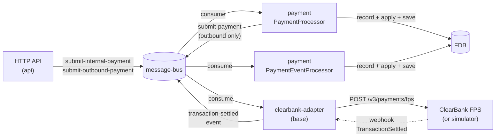
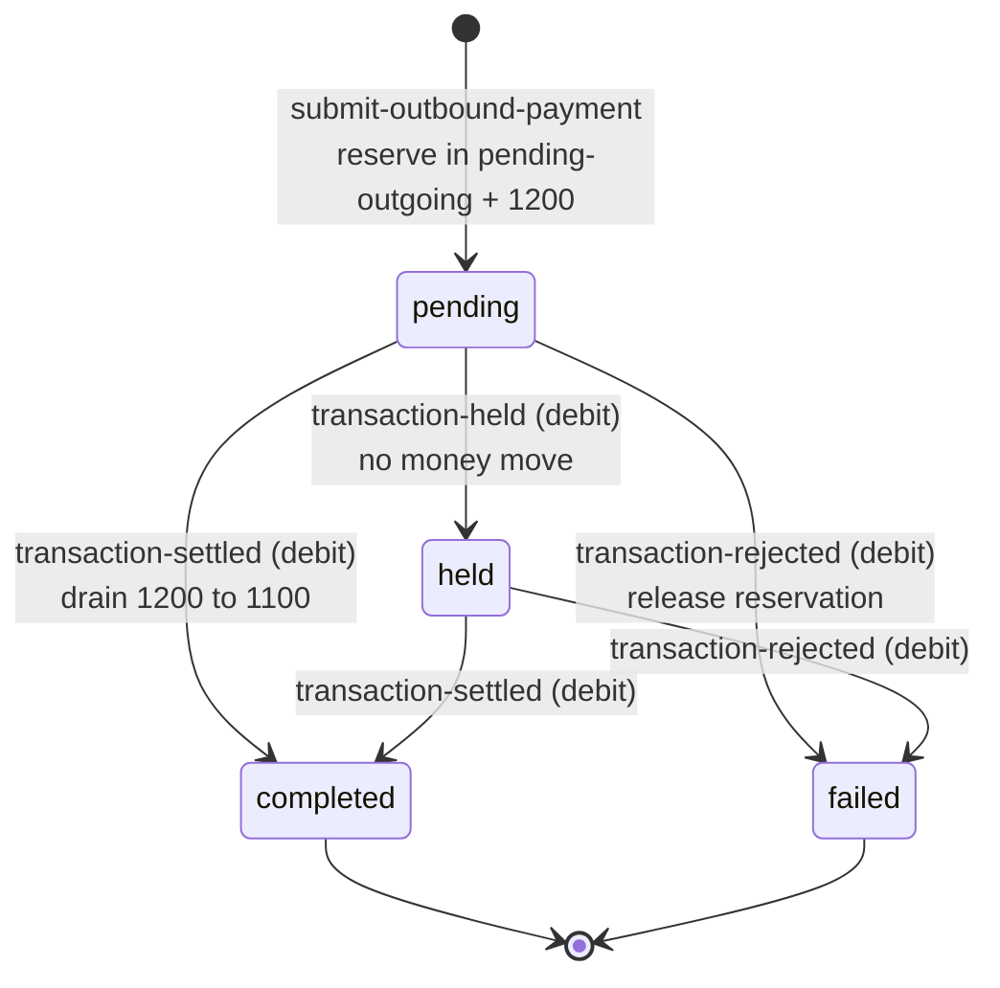
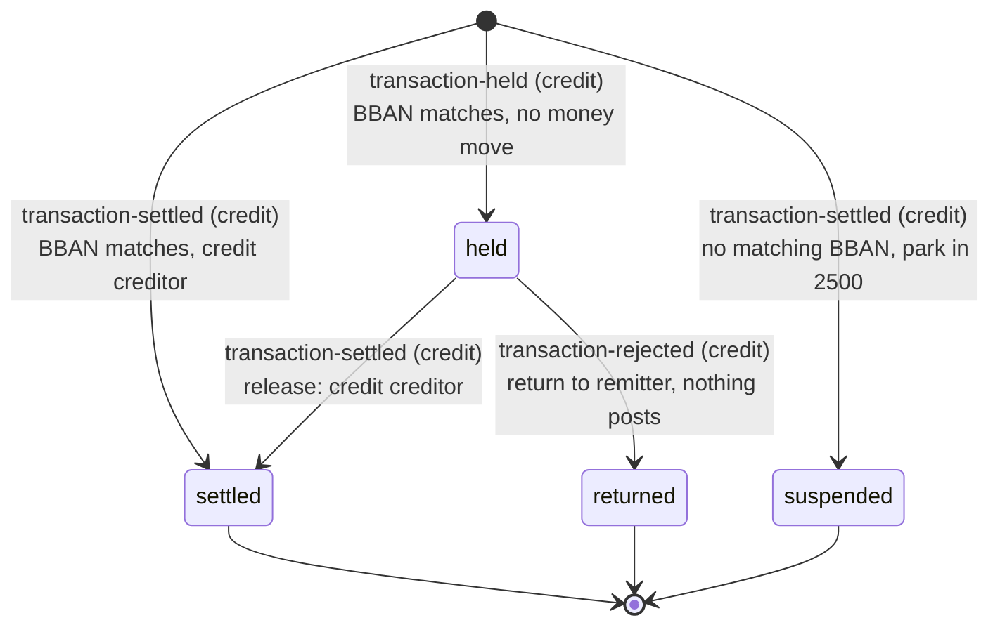
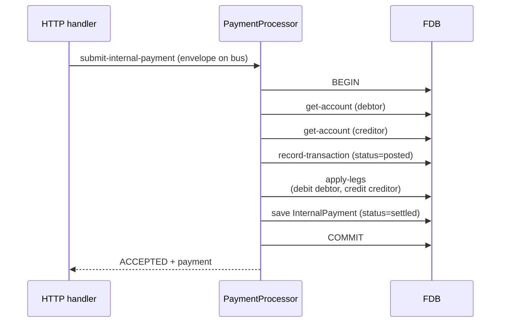
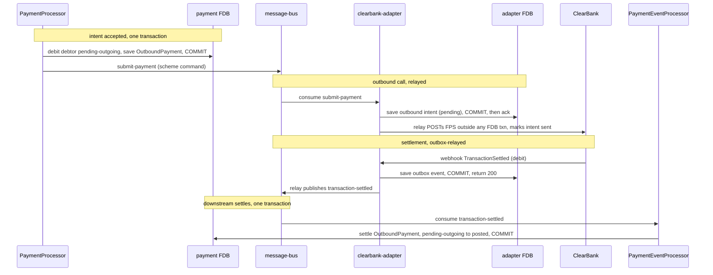
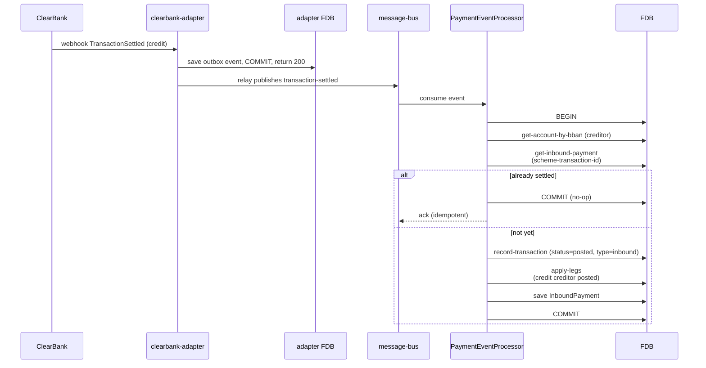

# Payments and ClearBank choreography

## Objective

Queenswood handles three kinds of payment: **internal** (one
Queenswood account to another), **outbound** (money leaving
Queenswood via UK Faster Payments Service through ClearBank),
and **inbound** (money arriving at a Queenswood account via
the same scheme). This TDD describes how each is structured,
how the bank's payment records relate to the underlying
double-entry transactions, and how Queenswood choreographs
with ClearBank for the FPS-bound flows.

In scope: the `payment` brick, the
`clearbank-adapter` and `clearbank-simulator` bases,
the three payment flows, settlement via webhook → event →
event processor.

Out of scope: the underlying double-entry mechanics, see
[transactions-and-balances.md](transactions-and-balances.md);
idempotency mechanics, see
[idempotency.md](idempotency.md); fee semantics; the
specific FPS scheme rules and messages (ClearBank documents
these).

## Background

Three payment kinds; two settlement patterns.

**Internal payment.** Both accounts are inside Queenswood. No
external scheme is involved. The payment can settle
immediately — the bank moves money between two of its own
ledgers, atomically.

**Outbound payment.** Money leaves Queenswood through the FPS
scheme. The bank doesn't itself talk to FPS — it talks to
ClearBank, which is the clearing bank that fronts the scheme.
At submission time the payment is *intent*: we know we want
to send money, but until ClearBank confirms the scheme has
accepted it, the money mustn't be considered gone. We hold it
in a `pending-outgoing` bucket. Later, when ClearBank tells
us via a settlement webhook that the scheme has confirmed,
we move it from pending-outgoing to posted.

**Inbound payment.** Money arrives at one of our SCAN
addresses (sort code + account number). ClearBank receives
the scheme message, fires us a settlement webhook with the
creditor BBAN and amount. We look up the account, record a
transaction, and credit the receiving balance.

The two settlement patterns:

- **Atomic-now** (internal): record + apply in one FDB
  transaction. No pending state.
- **Two-phase** (outbound, inbound): record the intent /
  receipt; settle later when the scheme confirms. The
  pending bucket is the "intent registered, value not yet
  spendable" state.

The choreography sits on the message-bus per
[ADR-0003](../adr/0003-message-bus-abstraction.md) and Avro
payloads per
[ADR-0004](../adr/0004-avro-for-message-payloads.md).
ClearBank itself is interfaced through a dedicated adapter
base, with a simulator for development and tests.

## Proposed Solution

### Architecture

Three bases collaborate around the `payment` brick:

- **`payment`** (brick) — owns InternalPayment,
  OutboundPayment, and InboundPayment records. Provides a
  `PaymentProcessor` (consumes commands) and a
  `PaymentEventProcessor` (consumes settlement events).
- **`clearbank-adapter`** (base) — talks to ClearBank.
  Consumes scheme-level submit-payment commands from the
  bus, calls the real ClearBank FPS API, receives webhooks,
  and republishes them as `transaction-settled` events on
  the bus.
- **`clearbank-simulator`** (base) — mocks the ClearBank
  FPS HTTP API for development and tests. Fires
  TransactionSettled webhooks back asynchronously. Not
  deployed in production.

Two distinct paths through the message bus:

- **Command path** for submission (HTTP → PaymentProcessor).
- **Event path** for settlement (Adapter →
  PaymentEventProcessor).

### Payment records

Three record types in `payment`:

- **InternalPayment** — debtor account, creditor account,
  amount, reference, transaction-id. No status field: an
  internal transfer is settled atomically at submission.
- **OutboundPayment** — debtor account, creditor BBAN +
  name, amount, reference, transaction-id, status
  (`pending` / `held` / `completed` / `failed`), plus
  cancellation code + reason on failure.
- **InboundPayment** — creditor account (absent when
  suspended), debtor name + BBAN, amount, reference,
  transaction-id, scheme-transaction-id (ClearBank's
  identifier), end-to-end-id, status (`settled` / `held` /
  `returned` / `suspended`).

Each payment links to a Transaction via `:transaction-id`.
The Payment record carries the user-facing intent and the
external-scheme metadata; the Transaction record carries the
double-entry posting. They live in different bricks; they
join via the id.

### Payment state machines

A payment's lifecycle is driven by two processors, both wired in
`payment` and dispatched in `commands.clj`:

- **`PaymentProcessor`** (`dispatch`) consumes tenant commands off
  the bus — `submit-internal-payment` and `submit-outbound-payment`
  — and creates the payment record. Submission handlers live in
  `core.clj`.
- **`PaymentEventProcessor`** (`dispatch-event`) consumes scheme
  events republished by the ClearBank adapter —
  `transaction-settled`, `transaction-held`, `transaction-rejected`
  — and drives every post-submission transition. Event handlers
  live in `events.clj`.

The same three scheme events serve both inbound and outbound; the
`debit-credit-code` on the event discriminates. A **debit** is the
outbound side (our customer paying out), a **credit** the inbound
side (money arriving). `dispatch-event` routes on the
`(event, debit-credit-code)` pair:

| Event | debit → outbound | credit → inbound |
|-------|------------------|-------------------|
| `transaction-settled` | `settle-outbound` | `settle-inbound` |
| `transaction-held` | `hold-outbound` | `hold-inbound` |
| `transaction-rejected` | `reject-outbound` | `return-inbound` |

A `transaction-rejected` with an absent or unknown code defaults to
the outbound path.

#### Internal payment

No status field and no state machine: an internal transfer is
recorded and posted in one FDB transaction at
`submit-internal-payment`, so it is settled the moment it exists.
There is no scheme leg and no later event.

#### Outbound payment

States are `OutboundPaymentStatus`: `pending`, `held`, `completed`,
`failed`. (`processing` is defined in the enum but unused, and
`unknown` is the proto zero-value guard.)

| From | Driving event | To | Funds |
|------|---------------|----|-------|
| (new) | `submit-outbound-payment` command | `pending` | reserve: debtor pending-outgoing debited, 1200 credited |
| `pending` | `transaction-held` (debit) | `held` | none — stays in 1200 while the scheme screens |
| `pending` / `held` | `transaction-settled` (debit) | `completed` | post the outflow: 1200 → 1100, debtor posted debited |
| `pending` / `held` | `transaction-rejected` (debit) | `failed` | reverse reservation: 1200 → debtor, available restored |
| `completed` | `transaction-settled` (debit) | `completed` | idempotent no-op |
| `failed` | `transaction-rejected` (debit) | `failed` | idempotent no-op |
| `completed` | `transaction-rejected` (debit) | (rejected) | anomaly — a settled outbound cannot be reversed here |

#### Inbound payment

States are `InboundPaymentStatus`: `settled`, `held`, `returned`,
`suspended`. Inbound has no submission command — every transition is
event-driven, and the entry state depends on whether the creditor
BBAN matches an account.

| From | Driving event | Guard | To | Funds |
|------|---------------|-------|----|-------|
| (new) | `transaction-settled` (credit) | BBAN matches an account | `settled` | credit the creditor (1100 → creditor) |
| (new) | `transaction-settled` (credit) | no matching BBAN | `suspended` | park in 2500 suspense (1100 → 2500) |
| (new) | `transaction-held` (credit) | BBAN matches an account | `held` | none — funds held at ClearBank |
| (new) | `transaction-held` (credit) | no matching BBAN | (ignored) | none — not recorded |
| `held` | `transaction-settled` (credit) | matched by end-to-end-id | `settled` | release: credit the creditor |
| `held` | `transaction-rejected` (credit) | matched by end-to-end-id | `returned` | none — funds returned to remitter |
| `settled` | `transaction-settled` (credit) | duplicate scheme-transaction-id | `settled` | idempotent no-op |

`suspended` and `returned` are terminal in the platform today;
resolving a suspended inbound — matching it to an account or
returning it — is a later operational workflow.

### Internal payment flow

One processor, one FDB transaction, atomic. No external
scheme; no pending state. The reply returns immediately.

### Outbound payment flow

The HTTP response returns *intent accepted*, not *money sent*.
The amount is held in `pending-outgoing` (visible to the
customer via the available-balance derivation) until ClearBank
confirms.

`submit-payment` is fire-and-forget from `payment`'s
perspective — it publishes and returns. The adapter makes it
durable from there: it persists the outbound call as an intent
in its own FDB store and acks, an out-of-transaction relay POSTs
to ClearBank with retry (ClearBank de-duplicates on the
end-to-end id), and the settlement webhook is persisted to an
outbox and relayed back as a `transaction-settled` event. So a
failed POST or a crash mid-flight retries rather than dropping
the submission. See
[transaction-processing.md](transaction-processing.md) for the
general outbox-and-intent model.

### Inbound payment flow

Inbound payments are *triggered by* the scheme — there's no
prior HTTP request. The webhook arrives, the adapter
publishes an event, the event processor settles. The whole
flow is reactive.

**Unmatched inbound → suspense.** When the creditor BBAN
matches no account, the receipt is *not* dropped: the owning
bank is resolved from the BBAN's sort code
(`bank/get-bank-by-sort-code`, per-bank sort codes), and the
funds are parked in that bank's `2500` suspense GL account
(DEBIT `1100` / CREDIT `2500`) with a `suspended` InboundPayment
(no creditor) recorded for later reconciliation. A BBAN that
does resolve, to an account that is not
`:cash-account-status-opened`, parks the same way, because
the credit cannot land on it and the receipt must not be
lost. A sort code
that matches no bank is genuinely foreign and fails (we only
receive inbounds for sort codes we own). Resolving a suspended
inbound — matching it to an account, or returning it — is a
later operational workflow.

**Held inbound → release / return.** ClearBank can hold an
inbound for screening (`InboundHeldTransaction` →
`transaction-held` credit). It's recorded `held` — the creditor
resolved by BBAN, but **no money moves**, because the funds are
held *at* ClearBank, not ours yet. The hold then resolves:

- **Release** — a `TransactionSettled` (credit) arrives. If it
  matches an open `held` (by `end_to_end_id`), it settles
  normally (DEBIT `1100` / CREDIT creditor) and the held record
  flips `held → settled`, stamped with the now-known scheme
  transaction id.
- **Return** — a `TransactionRejected` (credit) arrives; the
  held record flips `held → returned` and nothing posts (the
  funds went back to the remitter).

`transaction-rejected` carries a `debit-credit-code` so the
event processor routes the debit side to the outbound reversal
and the credit side to the inbound return. The held → release /
return match is on `end_to_end_id` — the held webhook carries no
scheme transaction id, and ClearBank doesn't guarantee inbound
end-to-end ids are unique, so we match the open `held` record and
accept the residual ambiguity (a fuller dedup would need a scheme
id ClearBank doesn't send on the held webhook).

Idempotency on inbound: the lookup by `scheme-transaction-id`
is the dedup. If ClearBank retries a webhook (network blip,
adapter crash before ack), the second pass finds the existing
InboundPayment and returns it without re-posting.

### ClearBank adapter

`clearbank-adapter` is its own base with its own FDB store.
Its egress is a transactional outbox on both edges — it owns:

- **Webhook receiver** — HTTP endpoints under its own server
  (separate from `api`), receiving signed webhooks from
  ClearBank. Verifies signatures, normalises the scheme-specific
  payload into an internal event, and writes it to an outbox in
  one transaction, returning 200 only on commit — a failed write
  is retried by ClearBank rather than silently lost.
- **Scheme command consumer** — message-bus consumer for
  `submit-payment` commands. Each is persisted as a pending
  outbound intent and acked; the consumer makes no HTTP call.
- **Outbound relay** — a daemon that drains pending intents and
  POSTs to ClearBank's `/v3/payments/fps` outside any FDB
  transaction, with retry. ClearBank de-duplicates on the
  end-to-end id, so a retried POST is safe.
- **Changelog relay** — a runner that reads the outbox changelog
  and publishes each recorded webhook event to the bus, so
  "webhook received" and "downstream told" cannot diverge.
- **Confirmation of Payee (CoP)** — separate code path under
  `cop/` handling CoP lookups; not part of the
  payment-settlement path but co-located in the adapter.

The adapter is the only Queenswood code that talks HTTP to
ClearBank. Its outbox, intent store, and relays live in the
`clearbank-relay` component; the Onfido adapter uses the
same pattern via `onfido-relay`. See
[transaction-processing.md](transaction-processing.md) for the
general model.

### ClearBank simulator

`clearbank-simulator` is its own base, deployed only in
development and test. It exposes the subset of ClearBank's
HTTP API that Queenswood uses:

- **`/v3/payments/fps`** — accepts payment submissions,
  returns the same shape ClearBank does.
- **TransactionSettled webhook firing** — after a configurable
  delay, fires the same shape of webhook back to the
  adapter, completing the round-trip.
- **`/simulate/inbound-payment`** — fires an inbound
  `TransactionSettled` (credit). The sandbox sentinel debtor
  name `6a41a29eafcf455493` instead fires an
  `InboundHeldTransaction`, then auto-resolves per the request
  `outcome` (`release` → settled, `return` → declined) — the
  trigger side of the held-inbound lifecycle.
- **CoP endpoints** — same idea for Confirmation of Payee.

The simulator is approximate (happy paths plus a small set of
rejection scenarios) but covers the choreography end-to-end so
tests can exercise the full settlement loop without external
calls.

### Atomicity, ordering, idempotency

**Atomicity.** Each settlement is one FDB transaction —
record + apply + save commits together. Cross-process the
choreography is asynchronous, but each leg of it (the
processor's commit, the adapter's webhook handling, the event
processor's settlement) is locally atomic.

**Ordering.** Events on the bus arrive in commit order from
their publishing component. Webhooks from ClearBank arrive in
the order ClearBank emits them; we trust ClearBank's
sequencing for FPS settlements. Within Queenswood, the event
processor handles events serially (one consumer; per-account
ordering follows).

**Idempotency.**

- **Internal and outbound payments** at submission are covered
  by the API-layer FDB-backed idempotency cache
  (`idempotency/cache-response`), scoped by
  `[principal_id, operation, idempotency_key]`. Duplicate
  requests within the 24 h window receive the original
  response. See [idempotency.md](idempotency.md).
- **Inbound payments** dedup via `scheme-transaction-id` (the
  ClearBank identifier). The check is FDB-indexed and atomic
  with the settlement transaction.
- **Outbound settlement** (event-driven side) dedups by the
  outbound payment's known status.
- **Belt-and-braces at the store layer.** If a duplicate slips
  past the API cache (different `idempotency-key` header on the
  retry, internal caller bypassing the cache, etc.), both
  `InternalPayment_by_idempotency_key` and
  `OutboundPayment_by_idempotency_key` are unique indexes that
  reject the second write. In practice the transaction layer's
  `Transaction_by_idempotency_key` index fires first, so callers
  parsing rejection kinds will most often see
  `:transaction/already-recorded` rather than
  `:payment/already-submitted` — both are correct, neither
  produces a duplicate balance move.

### Three roles for the message bus in this flow

- **HTTP-facing command channel** — submit-internal-payment
  / submit-outbound-payment commands from the API.
- **Scheme command channel** — submit-payment commands from
  `payment` to the ClearBank adapter (separate channel
  to keep scheme traffic distinct).
- **Event channel** — `transaction-settled` events from the
  adapter to subscribers.

All three sit on the same message-bus abstraction; the
channel separation is configuration, not infrastructure.

## Alternatives Considered

- **Synchronous call to ClearBank from the HTTP handler.**
  Submit the payment over the wire to ClearBank in-band with
  the HTTP request; respond with the scheme outcome
  directly. Rejected — ties HTTP thread-pool capacity to
  ClearBank's latency; failures during the call leave the
  bank's records in an unknown state; replay is awkward. The
  fire-and-forget-with-events pattern decouples the bank
  from ClearBank's response time and gives durable
  intent records to retry against.
- **Single Payment record, no separate Transaction record.**
  Combine the user-facing payment intent and the financial
  posting into one record. Rejected — Payment carries
  scheme metadata (BBAN, scheme-transaction-id) that the
  bookkeeping layer doesn't care about; Transaction carries
  posting metadata (legs, balance buckets) that the user
  doesn't see. Two records, one id link, separate concerns.
- **Direct ClearBank dependency in the payment processor.**
  Have `payment` call ClearBank's HTTP API directly.
  Rejected — couples the payment brick to an external
  vendor's API. The adapter base is the only place that
  knows about ClearBank's wire shape; the rest of the system
  sees bus messages.
- **Eventual-consistency-only (no settlement step).** Apply
  outbound to the posted bucket immediately; reconcile later
  if the scheme rejects. Rejected — risks showing the
  customer money as "spent" when ClearBank later rejects;
  reconciliation is operationally painful. The
  pending-outgoing bucket is the right answer.
- **One message-bus topic for everything.** Submit, scheme
  command, and settlement events all on one channel.
  Rejected — confuses tracing, mixes traffic with very
  different reliability needs (settlement events are
  audit-relevant; scheme commands can be retried freely).
  Channel separation is cheap and clarifying.
- **Polling ClearBank instead of webhooks.** Periodically
  ask ClearBank for payment status. Rejected — webhooks are
  the standard FPS pattern; polling adds latency and load
  for no benefit when ClearBank already pushes.

## Known Limitations

- **Webhook absence isn't handled.** If ClearBank confirms a
  payment but the webhook never arrives (network failure,
  endpoint downtime), the OutboundPayment stays in
  `pending` indefinitely. There's no sweeper that polls
  ClearBank to reconcile. Worth a future
  reconciliation-sweep design.
- **Outbound held → declined/returned is implemented; other
  failure modes are not.** Modelled on ClearBank's documented
  behaviour: an outbound payment whose creditor name is the
  sandbox sentinel `6a41a29eafcf455493` is held for screening
  (`OutboundHeldTransaction`) and then declined — funds returned,
  `TransactionRejected` with `CancellationCode HOPRJ`. The adapter
  publishes a `transaction-held` event (discriminated by
  `debit-credit-code`, like settlement) and a `transaction-rejected`
  event; the payment event-processor flips the payment to `held`,
  then on rejection reverses the in-flight legs (DEBIT 1200
  pending-outbound / CREDIT debtor) and flips it to `failed` with
  the cancellation code/reason. The simulator auto-resolves the
  held sentinel to a decline, since ClearBank exposes no sandbox
  control for release-vs-decline; the held → released → settled
  outcome is therefore not yet exercised. A full failure taxonomy
  (transient vs permanent, retry vs not) and acting on inbound holds
  beyond logging are future work.
- **Outbound message-assessment failure is implemented.** When
  ClearBank rejects a payment at pre-settlement assessment it fires
  `PaymentMessageAssessmentFailed` (a batch webhook carrying an
  `AssessmentFailure` list of `{EndToEndId, Reasons}`). The adapter
  publishes one `transaction-rejected` event per `EndToEndId` with a
  synthesized `CB_AssessmentFailed` code and the joined reasons, so
  the existing reversal path flips each payment to `failed` and
  returns the in-flight funds — assessment fails before settlement,
  so the payment is still `pending`. The simulator triggers this on a
  creditor BBAN whose sort code is `000000` (ClearBank documents no
  sandbox trigger). Note ClearBank's real payload misspells the type
  and key as `PaymentMessageAssesmentFailed` / `AssesmentFailure`
  (one `s`); we use the corrected spelling, so the adapter must
  tolerate the typo before going live.
- **Settlement reordering is trusted to ClearBank.** Events
  on the bus arrive in commit order, and Queenswood handles
  them serially. If ClearBank ever delivered settlement
  webhooks out of scheme-order, downstream invariants might
  break. We trust ClearBank's discipline here.
- **The simulator is approximate.** It covers the happy path
  and a small set of named rejection scenarios. Real-world
  edge cases (partial scheme acceptance, retry storms,
  malformed webhooks) aren't simulated.
- **The payment-side publish is still best-effort.** Once the
  adapter consumes `submit-payment`, the flow is durable — the
  submission becomes a persisted intent, and settlement flows
  back through the outbox. But the publish from `payment`
  to the adapter channel is still fire-and-forget after its FDB
  commit: if the broker is unavailable at that moment the command
  is lost, so the OutboundPayment exists while the adapter never
  sees it. Closing this needs the same outbox on the payment
  side — a producer-edge follow-up, deferred with the other
  producer edges in
  [transaction-processing.md](transaction-processing.md). Today
  it leans on the broker.
- **No FX.** Inbound and outbound payments are
  single-currency end-to-end. Cross-currency would need
  explicit FX legs (transactions-and-balances TDD) plus
  scheme-side currency translation that ClearBank handles
  at its boundary. Out of scope here.
- **Confirmation of Payee is in the adapter, not the
  payment brick.** Worth flagging because CoP is part of
  the customer-facing payment journey; the adapter
  owning it works but creates a small layering question
  if CoP-result handling ever needs to live alongside
  payment domain logic.
- **Idempotency on write submissions is handled by the
  API-layer cache** (`idempotency`). See
  [idempotency.md](idempotency.md).

## References

- [ADR-0002](../adr/0002-foundationdb-record-layer.md) —
  FoundationDB Record Layer (atomic record + apply)
- [ADR-0003](../adr/0003-message-bus-abstraction.md) —
  Message-bus abstraction
- [ADR-0004](../adr/0004-avro-for-message-payloads.md) —
  Avro for message payloads
- [transaction-processing.md](transaction-processing.md) —
  Transaction processing (the command/event substrate)
- [transactions-and-balances.md](transactions-and-balances.md)
  — Transactions and balances (the bookkeeping substrate)
- [service-apis.md](service-apis.md) — Service APIs (HTTP
  surface; ClearBank simulator and adapter HTTP shapes)
- [idempotency.md](idempotency.md) — Idempotency (proposed)
- `payment` brick interface
- `clearbank-adapter` base
- `clearbank-simulator` base
