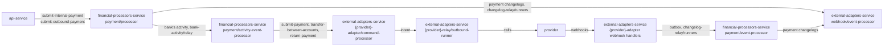

# Payments and the payment provider

> **Status: implemented.**

## Objective

Queenswood handles three kinds of payment: **internal**, from one
Queenswood account to another; **outbound**, leaving through UK Faster
Payments; and **inbound**, arriving through the same scheme. The bank
never speaks to the scheme itself: a payment provider does, reached
through a payment adapter. This TDD decides the contract every payment
adapter meets whichever provider it speaks to, so a bank runs on the
provider it chooses and the payment bricks do not change: what the
provider declares it can carry, how an account gets its payment address
from the provider, how the provider's reports become scheme events,
how the balances a provider holds for each account stay equal to the
ledger, and how one contract serves a provider that holds the bank's
money and one that only carries the scheme's messages for a bank
holding its own. Each flow, with the records it writes, has a TDD of its
own: [payments-internal.md](payments-internal.md),
[payments-outbound.md](payments-outbound.md) and
[payments-inbound.md](payments-inbound.md).

In scope: the `payment`, `payment-query` and `payee-check` bricks; the
provider leg of `cash-account`'s opening and closing; the provider
declaration and where it is checked; the payment adapter contract,
covering accounts, submissions, reports, reconciliation and the
simulator every adapter ships; the kinds of provider the contract
serves; balances at the provider.

Out of scope: each flow's path and records, in the three flow TDDs; the
double-entry mechanics, see
[transactions-and-balances.md](transactions-and-balances.md); the
API-layer idempotency cache, see [idempotency.md](idempotency.md); how
a policy is evaluated, see [policy-evaluation.md](policy-evaluation.md);
what a bank and its customers need from payments, see
[prd/payments.md](../prd/payments.md); how a particular provider's API
maps onto the contract, which lives with its adapter; schemes other
than Faster Payments, which the PRD leaves out; which provider a bank
runs on, which [bank-providers.md](bank-providers.md) decides; screening
payments for sanctions and fraud where the provider does not, which a
screening design of its own will decide; funding a settlement account
at the scheme and reconciling the scheme's settlement reports, which are
the bank's operations.

## Background

- **Payment records.** `payment` owns `InternalPayment`,
  `OutboundPayment` and `InboundPayment` and every write to them;
  `payment-query` holds the reads, the open-hold match and the
  business-day counts the limit checks use. Each payment links to its
  double-entry `Transaction` by `transaction-id`.
- **Settlement.** An internal payment records and posts in one FDB
  transaction. An outbound payment reserves its amount in the debtor's
  `pending-outgoing` bucket and settles, holds or fails on a scheme
  event. An inbound payment settles to the account its BBAN names, is
  held while the scheme screens it, is returned, or is parked in the
  bank's GL 2500 suspense when no opened account can take it or a
  policy refuses it. Each flow TDD draws its path.
- **Channels.** Every provider command leaves from `payment`'s
  `activity-event-processor`, answering the bank's activity in the
  order it committed (ADR-0033): a submitted outbound payment, a parked
  inbound and each posted transaction record an entry on the bank's
  activity log, relayed onto `bank-activity-event` keyed by bank, and
  the processor sends `submit-payment`, `return-payment` and
  `transfer-between-accounts` on the provider's one command channel,
  `modulr-command` for Modulr, keyed by bank. The adapter's outbox is
  relayed onto `schemes-payments-event`, whose consumer dead-letters an
  event after five redeliveries. Each payment save co-commits a
  status-changed entry relayed onto `payments-event`, which the webhook
  catalogue turns into `payment.*` notifications.
- **The sweep.** `payment/outbound-sweep`, in
  `exclusive-dispatchers-service`, reports a payment pending or held
  for 24 hours.
- **Payment addresses.** The provider issues every account's sort code
  and account number. `cash-account` writes an account `opening` and
  records its opening as the bank's activity, from which `payment`
  sends `open-payment-account` on the provider's command channel, and
  the adapter's answer on
  `schemes-account-event` opens it with the addresses and the provider
  account id, or refuses it; closing and rotation go the same way. A
  bank holds no sort code. An inbound resolves its creditor by BBAN,
  and one matching no account fails the handler.
- **Confirmation of Payee.** `payee-check`'s processor handles
  `POST /v1/payee-checks` by calling the adapter's `/cop/outbound`
  over HTTP, with the bank and the account the payment will leave, and
  persists each check for 24 hours.
- **The adapters.** Three exist, each four bricks: a base,
  `<provider>-adapter`; a `<provider>-relay` component holding its
  outbox and outbound-intents stores and the runner that calls the
  provider outside any transaction; a `<provider>-webhook` component
  holding the provider's wire schemas and signature; and a
  `<provider>-simulator` base. Every adapter is composed into
  `external-adapters` and `monolith`, and every simulator into
  `external-simulators`, as
  [ADR-0036](../adr/0036-simulators-run-in-a-service-of-their-own.md)
  decides; `exclusive-dispatchers-service` relays every outbox. Each
  adapter signs what it sends and verifies what it receives with the
  scheme its provider uses, the simulator doing the reverse.
- **A bank's provider.** Every provider an installation offers runs side
  by side, and each bank records the one it chose at creation, per
  [ADR-0030](../adr/0030-a-bank-chooses-its-providers-when-it-is-created.md).
  A file under `system/payment-providers/` declares what each provider
  carries, as a `payment-provider/declaration` component. The
  `payment-provider` component registers that kind and the
  `payment-provider/providers` kind naming the default provider and
  each one's channels, reads a declaration with its defaults and holds
  the start-up check each adapter makes against what it carries, as
  [bank-providers.md](bank-providers.md) describes.

## Solution

### The provider declaration

`system/payment-providers/<key>.yml` declares what a provider's
adapter can carry, `modulr.yml` for Modulr:

```yaml
!system/component
system/component-kind: payment-provider/declaration
schemes: [fps]
addresses: [scan]
balances: per-account
payee-check: [outbound]
inbound: notified
returns: []
screening: provider
```

- **`schemes`** — the `PaymentScheme` values an outbound payment may
  go by.
- **`addresses`** — the `PaymentAddressScheme` values the provider
  issues to an account.
- **`balances`** — `per-account` where the provider holds a balance
  for each account it issues, `pooled` where one balance holds every
  account's money and the addresses only route to it.
- **`payee-check`** — `outbound` where the provider checks a payee's
  name, and `inbound` where it asks the platform to answer a check
  against one of its accounts rather than answering from the holder
  name it was given.
- **`inbound`** — `notified` where the provider settles an inbound
  payment and then tells the platform, `admitted` where it asks the
  platform to admit or reject each one before it settles.
- **`returns`** — `inbound` where the platform may send an inbound
  payment it cannot apply back to its sender; without it, the payment
  is parked in suspense.
- **`screening`** — `provider` where the provider screens payments and
  reports those it holds, `bank` where it screens nothing.

A system's `payment-provider` group includes each provider's file under
its key, and its `payment-provider/providers` component names the
default. An adapter refers to its own declaration,
`payment-provider.<key>`, and every other component that reads one
reads the bank's provider's through `payment-provider.providers`, so a
bank on another provider changes nothing in the bricks:

- **At start-up.** The adapter refuses to start when its configuration
  does not cover what the file declares, a left-out key read as its
  default, so an adapter that only admits refuses a file silent on
  `inbound`.
- **At publish.** `cash-account-product` refuses a version whose
  `allowed-payment-address-schemes` names a scheme `addresses` lacks,
  with `:cash-account-product/unsupported-address-scheme` (422).
- **At submission.** `payment` refuses an outbound payment whose scheme
  `schemes` lacks, with `:payment/unsupported-scheme` (422).
- **Wherever behaviour follows it.** `payment` mirrors movements at the
  provider only under `per-account`, as
  [Balances at the provider](#balances-at-the-provider) describes, the
  adapter serves inbound check requests only under `payee-check:
  [inbound]`, admission requests only under `inbound: admitted`, and
  `payment` returns rather than parks only under `returns: [inbound]`.
  A missing key reads as the value a provider holding the money has:
  `notified`, no returns, and `provider` screening.

### Three kinds of provider

The contract is designed against three kinds of provider, each a bank's
choice at creation as
[ADR-0030](../adr/0030-a-bank-chooses-its-providers-when-it-is-created.md)
decides, and each an adapter of its own:

- **A provider holding a balance for each account.** It issues each
  account with its address, holds its money, screens payments and
  tells the platform of an inbound once it has settled. Modulr is the
  worked example: `balances: per-account`, `payee-check: [outbound]`,
  `inbound: notified`, `screening: provider`.
- **A clearing bank holding one balance.** It issues addresses that
  route to one balance holding every account's money, screens, and
  tells the platform of an inbound once it has settled. ClearBank is
  the worked example: `balances: pooled`, `payee-check: [outbound,
  inbound]`, `inbound: notified`, `screening: provider`.
- **Rails.** It carries the scheme's messages for a bank that holds
  the money in its own settlement account, asks the bank to admit each
  inbound before it settles, lets the bank return one, and screens
  nothing. Form3 is the worked example: `balances: pooled`,
  `payee-check: [outbound]`, `inbound: admitted`, `returns: [inbound]`,
  `screening: bank`.

Everything that differs between them is a declared key, so `payment`,
`cash-account` and `payee-check` read the declaration and never the
provider. What differs inside an adapter stays there:

- **Where an address comes from.** An adapter whose provider issues
  accounts opens one there. One whose provider does not issues the
  account number itself, under the sort code its configuration names,
  and registers it with the provider so inbound payments route to it.
  Either way it answers `open-payment-account` on
  `schemes-account-event`.
- **What 1100 is.** GL 1100 cash-at-correspondent is the money held at
  the provider, whether that is each account's balance, the pooled
  balance, or the bank's settlement account at the scheme.

### Neutral scheme events

Every value that crosses from the adapter is the platform's:

- **Scheme.** `submit-payment` and the three scheme events carry
  `scheme` as the `PaymentScheme` value, `fps`, which
  `OutboundPayment.scheme` stores.
- **Failure.** `transaction-rejected` carries `failure_kind`, an enum of
  `declined` (the scheme or the provider's assessment declined it),
  `refused` (the provider refused the submission) and `undelivered`
  (the runner gave up), and `reason_code`, an ISO 20022
  `ExternalStatusReason1Code` the adapter maps from the provider's
  own, `NARR` where it has none, beside the free-text reason.
  `OutboundPayment` stores the same two fields, and the API answers
  `failure: {kind, reason-code, reason}` on a failed payment.
- **Deprecation.** `cancellation_code` is an optional Avro field with
  a null default, and the proto field keeps its tag and is dropped in
  the record conversion, per
  [schema-evolution](../recipes/code/schema-evolution.md).
- **Correlation.** Events carry the end-to-end id Queenswood issued,
  the provider's payment id as `scheme-transaction-id`, and the
  provider account id of the account concerned (see below), each
  opaque.

### Addresses the provider issues

The provider issues every payment address, so an account's sort code
and account number are the provider's, and each account records the
provider account behind it:

- **Opening.** `open-account` writes the account `opening` and records
  its opening as the bank's activity, from which `payment`'s activity
  event processor sends `open-payment-account` on the provider's
  command channel — bank id, account id, holder name, currency and the
  address schemes wanted — rather than opening it.
  A bank's own-funds account sends it whatever its product allows
  under `per-account`, since it backs the bank's ledger money. An
  account with no address scheme opens at once.
- **Opened.** The adapter reports `payment-account-opened`, carrying
  the provider account id and the issued addresses, on
  `schemes-account-event`. `cash-account`'s event processor stores
  them, the provider account id as `CashAccount.provider_account_id`,
  and flips `opening → opened`, gated on `opening`.
- **Refused.** A provider refusing the account reports
  `payment-account-refused` with a reason, and the account moves
  `opening → refused`, a terminal status taken through the
  checklist in
  [lifecycle-transitions](../recipes/code/lifecycle-transitions.md).
- **Closing.** The `closing` handler sends `close-payment-account` for
  an account with a provider account, and `payment-account-closed`
  flips `closing → closed`. A close the provider refuses, or the
  adapter gives up on, reports `payment-account-close-refused` with a
  reason, and the account returns to the status it closed from,
  `opened` or `suspended`, with the reason as its `refusal-reason`.
- **Rotating.** `rotate-cash-account-address` sends
  `reissue-payment-address`, and the account keeps its address until
  the adapter reports `payment-address-reissued` with the new one and,
  where it changed, the new provider account id. A provider that
  issues an address only with an account blocks the old provider
  account, opens a new one, moves the balance across and closes the
  old one. A reissue the provider refuses, or the adapter gives up on,
  reports `payment-address-reissue-failed`: the account keeps its
  addresses, with the reason as its `refusal-reason`. An adapter that
  blocked the old provider account unblocks it first; one whose
  balance has moved and whose only failure is the old account's close
  reports the reissue, leaving the old account blocked and logged.
- **Closed and frozen accounts.** A closed account's provider account
  is closed, so the provider returns money sent to it rather than the
  platform parking it. A frozen account's provider account stays open,
  and an inbound for it parks in 2500.
- **No address of the platform's.** Neither a bank nor an account
  counts out addresses, and `Bank.sort_code` is deprecated. An inbound
  whose BBAN matches no account fails the handler and is dead-lettered,
  since every address was issued through the adapter. An inbound to an
  account that is not opened parks in that account's bank.
- **Submission.** `submit-payment` carries `debtor_provider_account_id`,
  read with the debtor's BBAN inside the submission's transaction.

The holder name reaches the provider at opening, so a provider that
answers inbound checks itself answers from it.

### Balances at the provider

Under `balances: per-account` the money is in the provider's
accounts, one per cash account, so the ledger and the provider must
move it together. Each provider account's balance equals the posted
balance of the cash account it backs, except the bank's own-funds
account, whose provider account also holds the money the ledger keeps
in the bank's GL accounts — 2500 suspense, and what 5100 interest
expense has paid out.

- **What moves itself.** The scheme's own settlements — an inbound
  landing in the creditor's provider account, an outbound leaving the
  debtor's — are made by the provider, and are never mirrored.
- **What is mirrored.** Every other posting that changes a cash
  account's posted balance: an internal payment, interest capitalised,
  a reward, a fee. Between two cash accounts the movement is mirrored
  between their provider accounts; between a cash account and a GL
  account, against the bank's own-funds provider account. An inbound
  parked in 2500 after a policy refusal is mirrored from the
  receiving account's provider account to own-funds. Money that
  reaches a cash account from 1100 without the scheme — the sandbox's
  simulated inbound — is credited to its provider account from
  outside, which only a sandbox provider can do.
- **The trigger.** `transaction` records a `transaction-posted` entry
  on the bank's activity — bank id, transaction id, type, currency,
  legs and, where the scheme itself settled the posting,
  `scheme-account-id`, the cash account it moved the money through —
  with each recorded transaction. `payment`'s
  `activity-event-processor` nets each transaction's posted default
  legs per party: a cash account; 1100, as the
  scheme's account where the entry names one and as outside where it
  does not; and the bank's own funds for any other GL account and
  whatever the legs leave unbalanced. It pairs the nets into
  transfers, so a scheme's own settlement nets to nothing.
- **The record.** Each transfer is a `ProviderTransfer` in the
  `provider-transfers` store — transaction id, debtor and creditor cash
  account ids, the debtor absent for money from outside, amount, status
  `pending`, `completed` or `failed` — unique on transaction id and
  pair. It is sent as `transfer-between-accounts` on the provider's
  command channel naming the cash accounts, and the adapter resolves
  each to the provider account its own opening, or the reissue that
  last replaced it, recorded, holding the transfer behind an account's
  opening. The adapter reports
  `transfer-completed` or `transfer-failed` on
  `schemes-payments-event`.
- **A failed transfer.** The ledger is not reversed: the customer's
  payment stands, and the failure is logged at ERROR with the
  transaction id for the bank to reconcile.

Under `pooled` the addresses route into one balance the ledger already
divides, and nothing is mirrored.

### Submitting to the provider

- **Intent.** The adapter consumes `submit-payment` and
  `transfer-between-accounts` into intents unique on the end-to-end id
  and the transfer id, and acks.
- **Retrying as the same request.** The intent stores whatever the
  provider needs to recognise a retry as the request it already has,
  so a retry after a restart is not a second payment.
- **Outcome.** Sent, retried with backoff, or failed, a failure
  writing `transaction-rejected` with `failure_kind` `refused` or
  `undelivered`.
- **Payee check.** `submit-payment` carries the payee check made for
  this payment where the tenant names one, and an adapter whose
  provider links a check to a payment passes it on.

### Reconciling with the provider

An intent sent with no settlement or rejection reported within the
relay's `reconcile-after-ms` is looked up at the provider, and what the
provider reports is written to the outbox with the dedup key its
webhook would carry, so a late webhook finds it already there. A
payment whose webhook never arrives settles or fails on the lookup
rather than staying open. The sweep's 24-hour report stays for a
payment the provider does not know.

### Confirmation of Payee

- **Configuration.** `payee-check`'s `adapter-urls` gives each payment
  provider's adapter URL by key, Modulr's set from `MODULR_ADAPTER_URL`,
  and a check calls the bank's provider's.
- **The payer.** `POST /v1/payee-checks` takes an optional
  `account-id`, the account the payment will leave; the adapter checks
  from that account's provider account, and from the bank's own-funds
  account without one.
- **Inbound.** Under `payee-check: [inbound]` the adapter answers the
  provider's requests from `cash-account-query` and `party-query`;
  otherwise the provider answers from the holder name.

### The payment adapter contract

Every payment adapter, `<provider>-adapter` with its relay, webhook and
simulator bricks, meets the same contract, so which one a deployment
runs changes nothing outside it:

- **Declares.** It ships its provider's declaration,
  `system/payment-providers/<key>.yml`, and refuses to start when its
  configuration does not cover it.
- **Admits.** Under `inbound: admitted`, it answers the provider's
  admission requests from `payment`'s reply, as
  [payments-inbound.md](payments-inbound.md) describes.
- **Returns.** Under `returns: [inbound]`, it consumes
  `return-payment` and reports the return.
- **Issues accounts.** It consumes `open-payment-account`,
  `reissue-payment-address` and `close-payment-account` into intents,
  and its runner opens, reissues and closes at the provider, reporting
  on `schemes-account-event`.
- **Submits.** It consumes `submit-payment` and
  `transfer-between-accounts` as above, signing each call as the
  provider requires.
- **Reports.** It authenticates each delivery as the provider signs it
  before anything else, converts each amount exactly to minor units,
  maps each provider event to the scheme events, and writes one outbox
  entry per event, deduplicated on the provider's payment id and the
  outcome.
- **Reconciles.** It asks the provider about a payment it has not heard
  of, as above.
- **Stays neutral.** Its anomalies are the `:payment/*` kinds, its
  reason codes ISO 20022, its correlation opaque ids, and no provider
  name leaves its bricks.
- **Ships a simulator.** `<provider>-simulator` serves the provider's
  API as the adapter calls it, checks the adapter's signatures, signs
  its deliveries as the provider does, and holds a balance per account
  where the provider does, so a payment beyond it is held or declined
  as the provider would; one holding balances also serves
  `/simulate/fund`, crediting an account without notifying anyone for a
  rig that posts the ledger itself, and `/simulate/balances`. Every
  simulator serves the same control routes and test values, so a
  scenario runs on either:
  - a creditor sort code `000000` is declined, `999998` refused, and
    the creditor name `6a41a29eafcf455493` held then declined;
  - `/simulate/inbound-payment` fires an inbound settlement, or a hold
    that settles or returns;
  - `/simulate/outbound-return` returns a completed payment with the
    ISO 20022 reason code given, `AC04` without one, and a payment to
    an account the simulator has closed is returned coded `AC04`;
  - `/simulate/open-refused`, `/simulate/close-refused` and
    `/simulate/reissue-refused` make the next account opening, close
    or address reissue refused, and on a simulator that returns
    inbounds `/simulate/return-refused` the next return;
  - a payment to an account another simulator holds reaches it through
    `scheme-simulator`, which each simulator joins under its sort code,
    as an inbound to that simulator's `/simulate/inbound-payment`, and
    is returned or failed where that simulator refuses it.

  A simulator for a provider that asks for admission sends the request
  before each inbound from `/simulate/inbound-payment` settles, and
  settles only one admitted, answering the control route once the
  admission is decided, with its status and reason. A payment to an
  account it has closed fails admission, so the sender's payment is
  rejected rather than returned, and under `screening: bank` the held
  name is declined with no hold. An inbound sent with `settle: held`
  stays pending once the bank admits it, until
  `/simulate/inbound-settlement` settles it, so an account can close in
  between.

Every build composes every adapter, side by side, each deployed one
against its simulator until it is pointed at the provider. Each
adapter consumes its own command channel, `<key>-command`, and makes
an account's calls in the order they were accepted.
`exclusive-dispatchers-service` runs the relay runners for the
adapter's outbox and the banks' activity logs.

### The payment flows


```mermaid
flowchart LR
    API["api-service"] -->|submit-internal-payment<br/>submit-outbound-payment| P["financial-processors-service<br/>payment/processor"]
    P -->|bank's activity, bank-activity/relay| AP["financial-processors-service<br/>payment/activity-event-processor"]
    AP -->|submit-payment, transfer-between-accounts,<br/>return-payment| AD["external-adapters-service<br/>{provider}-adapter/command-processor"]
    AD -->|intent| IP["external-adapters-service<br/>{provider}-relay/outbound-runner"]
    IP -->|calls| PR["provider"]
    PR -->|webhooks| WHH["external-adapters-service<br/>{provider}-adapter webhook handlers"]
    WHH -->|outbox, changelog-relay/runners| PE["financial-processors-service<br/>payment/event-processor"]
    P -->|payment changelogs, changelog-relay/runners| WH["external-adapters-service<br/>webhook/event-processor"]
    PE -->|payment changelogs| WH
```

- **Internal.** Records and posts in the command's one transaction, and
  under `balances: per-account` is mirrored at the provider as a
  transfer between the two provider accounts. See
  [payments-internal.md](payments-internal.md).
- **Outbound.** Reserves its amount at submission, reaches the provider
  through the bank's activity, its adapter's intent and the intent
  poller, and settles, holds, fails or is returned on what the provider
  reports. See [payments-outbound.md](payments-outbound.md).
- **Inbound.** Settles on the provider's report, is held while the
  provider screens it, is admitted first where the provider asks, and is
  parked in suspense, and returned where the provider allows, when the
  account cannot take it. See [payments-inbound.md](payments-inbound.md).

### Tests

- **`payment`** — the unsupported scheme, and each activity entry sent
  to the bank's provider as its command, keyed by the bank, one a
  payment provider does not act on sending nothing.
- **`cash-account`** — opening waiting on the provider, refused,
  rotating and closing through it.
- **`cash-account-product`** — a version refused for an address scheme
  the declaration lacks.
- **`payee-check`** — the payer account passed through.
- **`payment-provider`** — a left-out key read as its default, and the
  start-up check naming each value asked and not carried.
- **`transaction`** — `transaction-posted` recorded on the bank's
  activity with each posting.
- **`<provider>-adapter`** — the refusal to start on a declaration its
  configuration does not cover.
- **`<provider>-webhook`** — the signature against the provider's own
  worked example, and each way a delivery is refused.
- **`<provider>-simulator`** — each control route, signatures checked
  and made as the provider's are, a payment beyond the balance waiting
  for funds, and a payment to a closed account returned.
- **`test-api-scenarios`** — the payment and payee-check scenarios run
  on every provider, skipping those a provider's declaration rules out.
- **`test-scenarios`** — a scenario checking every simulated provider
  balance against the ledger after each mirrored flow.

Each flow TDD lists the tests of its own paths.

## Alternatives Considered

- **Queenswood mints addresses, the provider routes them.** Rejected:
  a provider holding a balance per account issues the address with the
  account, and lets only selected partners choose one.
- **One pooled provider account per bank.** Rejected: a provider
  holding a balance per account offers no address that routes to a
  shared one.
- **Keeping the provider's codes on the payment.** Rejected: they are
  the API's public contract, and ISO 20022 already names every reason
  a payment scheme gives.
- **A contract for each kind of provider.** Rejected: the kinds differ
  in a few declared facts, and a second contract would double what
  `payment` knows about providers.

## Known Limitations

- **Own funds at the provider is not the own-funds account.** Its
  provider balance also carries suspense and paid interest, which the
  bank reconciles by hand.
- **A rename does not reach the provider.** The holder name is given
  at opening, so a provider answering inbound checks answers from the
  name the party had then.
- **A rotation is not instant.** The old address takes payments until
  the provider reports the new one, and where the provider moves the
  account, a payment arriving while the old one is blocked is returned
  to the sender.
- **One customer at the provider.** Every bank's accounts sit under the
  customer the deployment names, until the provider's sandbox says
  whether it wants one per bank.
- **Settlement at the scheme is reconciled by hand.** On rails, GL
  1100 is the bank's settlement account, whose funding and the
  scheme's settlement reports are the bank's operations.
- **The clearing-bank adapter returns nothing.** Its simulator serves no
  `/simulate/outbound-return`, and it maps no return from its provider.
- **The default simulator forgets on restart.** It holds accounts and
  balances in memory, so after a restart it serves an account it no
  longer knows as holding whatever is asked of it, and it issues
  account numbers at random, so one could repeat.
- **A name check needs the bank's own funds opened.** A check made from
  no named account is made from the own-funds account's provider
  account, and is unavailable until the provider has opened it.
- **No provider's sandbox has been run.** Every flow is proved against
  the simulators alone.
- **Kafka redeliveries have no delay.**
- **No FX.**

## References

- [payments](../prd/payments.md) — the product requirements this design
  serves.
- [payments-internal](payments-internal.md),
  [payments-outbound](payments-outbound.md) and
  [payments-inbound](payments-inbound.md) — each flow, with the records
  it writes.
- [bank-providers](bank-providers.md) — which provider a bank runs on.
- [cash-accounts](cash-accounts.md) — opening and closing, which gain
  the provider leg.
- [transactions-and-balances](transactions-and-balances.md) — the
  postings mirroring follows.
- [chart-of-accounts](chart-of-accounts.md) — GL 1100, 1200, 2500 and
  5100 and the own-funds account.
- [parties](parties.md) — the IDV adapter contract this one follows.
- [transaction-processing](transaction-processing.md) — the intent and
  outbox pattern every adapter follows.
- [idempotency](idempotency.md) — the submission cache.
- [webhooks](webhooks.md) — the `payment.*` catalogue.
- [ADR-0030](../adr/0030-a-bank-chooses-its-providers-when-it-is-created.md)
  — a bank's providers, chosen at creation.
- [ADR-0036](../adr/0036-simulators-run-in-a-service-of-their-own.md) —
  where the adapters, their simulators and their runners run.
- [ADR-0020](../adr/0020-providers-are-deployment-facts.md) — the
  provider contract, which ADR-0030 keeps.
- [ADR-0021](../adr/0021-changelog-relay.md) — the changelog relay the
  mirroring and account legs run on.
- [lifecycle-transitions](../recipes/code/lifecycle-transitions.md) —
  the checklist for `refused`.
- [schema-evolution](../recipes/code/schema-evolution.md) — the
  deprecated fields, and the stores and fields added.
- [ISO 20022 external code sets](https://www.iso20022.org/catalogue-messages/additional-content-messages/external-code-sets)
  — the status and return reason codes.
