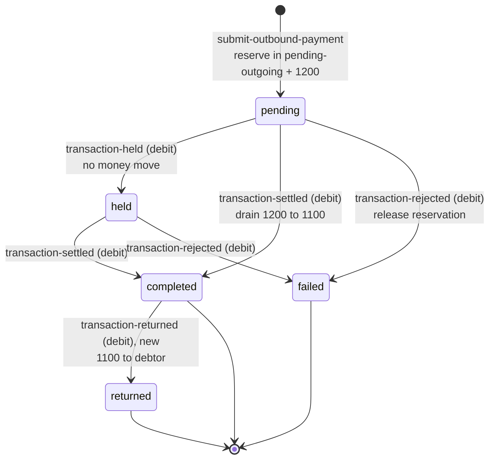
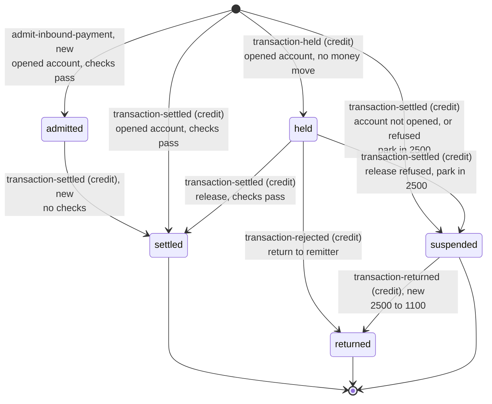

# Payments and the payment provider

> **Status: proposal.** Internal, outbound and inbound payments, the
> provider declaration, the payment adapter contract and two adapters
> meeting it exist, and Background names them. Everything under
> Proposed Solution is the build list; all but
> [Three kinds of provider](#three-kinds-of-provider) and the sections
> it introduces is built, and [First slices](#first-slices) says what
> comes next.

## Objective

Queenswood handles three kinds of payment: **internal**, from one
Queenswood account to another; **outbound**, leaving through UK Faster
Payments; and **inbound**, arriving through the same scheme. The bank
never speaks to the scheme itself: a payment provider does, reached
through a payment adapter. This TDD decides the contract every payment
adapter meets whichever provider it speaks to, so an installation runs
the provider it chooses and the payment bricks do not change: what the
provider declares it can carry, how an account gets its payment address
from the provider, how the provider's reports become scheme events,
how the balances a provider holds for each account stay equal to the
ledger, how an outbound payment the scheme returns after it completed
is recorded, and how one contract serves a provider that holds the
bank's money and one that only carries the scheme's messages for a bank
holding its own.

In scope: the `payment`, `payment-query` and `payee-check` bricks; the
provider leg of `cash-account`'s opening and closing; the provider
declaration and where it is checked; the payment adapter contract,
covering accounts, submissions, reports, reconciliation and the
simulator every adapter ships; the kinds of provider the contract
serves; balances at the provider; admitting an inbound payment;
returned outbound payments and returning an inbound one; the three
payment flows and their state machines.

Out of scope: the double-entry mechanics, see
[transactions-and-balances.md](transactions-and-balances.md); the
API-layer idempotency cache, see [idempotency.md](idempotency.md); how
a policy is evaluated, see [policy-evaluation.md](policy-evaluation.md);
what a bank and its customers need from payments, see
[prd/payments.md](../prd/payments.md); how a particular provider's API
maps onto the contract, which lives with its adapter; schemes other
than Faster Payments, which the PRD leaves out; running two providers
in one installation, which
[ADR-0020](../adr/0020-providers-are-deployment-facts.md) leaves to a
later decision; screening payments for sanctions and fraud where the
provider does not, which a screening design of its own will decide;
funding a settlement account at the scheme and reconciling the scheme's
settlement reports, which are the bank's operations.

## Background

- **Payment records.** `payment` owns `InternalPayment`,
  `OutboundPayment` and `InboundPayment` and every write to them;
  `payment-query` holds the reads, the open-hold match and the
  business-day counts the limit checks use. Each payment links to its
  double-entry `Transaction` by `transaction-id`.
- **Settlement.** An internal payment records and posts in one FDB
  transaction. An outbound payment reserves its amount in the debtor's
  `pending-outgoing` bucket against GL 1200 and settles, holds or
  fails on a scheme event. An inbound payment settles to the account
  its BBAN names, is held while the scheme screens it, is returned, or
  is parked in the bank's GL 2500 suspense when no opened account can
  take it or a policy refuses it.
- **State machines.** `PaymentProcessor` handles
  `submit-internal-payment` and `submit-outbound-payment`;
  `PaymentEventProcessor` handles `transaction-settled`,
  `transaction-held` and `transaction-rejected`, routed on the event's
  `debit-credit-code`, in `payment`'s `commands.clj`, `core.clj` and
  `events.clj`. An outbound payment is `pending`, `held`, `completed`
  or `failed`; an inbound one `settled`, `held`, `returned` or
  `suspended`. A rejection naming a completed outbound payment fails
  the handler and is dead-lettered.
- **Channels.** `payment` publishes `submit-payment` and
  `transfer-between-accounts` on `schemes-payment-command`. The
  adapter's outbox is relayed onto `schemes-payments-event`, whose
  consumer dead-letters an event after five redeliveries. Each payment
  save co-commits a status-changed entry relayed onto `payments-event`,
  which the webhook catalogue turns into `payment.*` notifications, and
  each posted transaction a `transaction-posted` entry relayed onto
  `transactions-event`.
- **The sweeps.** `payment/outbound-sweep`, in
  `exclusive-dispatchers-service`, republishes a `pending` payment's
  command after 15 minutes and reports one open for 24 hours;
  `payment/transfer-sweep` beside it sends again a provider transfer
  still pending after 30 seconds.
- **Payment addresses.** The provider issues every account's sort code
  and account number. `cash-account` writes an account `opening`, its
  opening event sends `open-payment-account` on
  `schemes-account-command`, and the adapter's answer on
  `schemes-account-event` opens it with the addresses and the provider
  account id, or refuses it; closing and rotation go the same way. A
  bank holds no sort code. An inbound resolves its creditor by BBAN,
  and one matching no account fails the handler.
- **Confirmation of Payee.** `payee-check`'s processor handles
  `POST /v1/payee-checks` by calling the adapter's `/cop/outbound`
  over HTTP, with the bank and the account the payment will leave, and
  persists each check for 24 hours.
- **The adapters.** Two exist, each four bricks: a base,
  `<provider>-adapter`; a `<provider>-relay` component holding its
  outbox and outbound-intents stores and the runner that calls the
  provider outside any transaction; a `<provider>-webhook` component
  holding the provider's wire schemas and signature; and a
  `<provider>-simulator` base. The default adapter is composed into
  `external-adapters` and `monolith`, and
  `exclusive-dispatchers-service` relays its outbox; the other stays in
  the development project with its tests. Only the simulators are
  reachable. Each adapter signs what it sends and verifies what it
  receives with the scheme its provider uses, the simulator doing the
  reverse.
- **The provider as a deployment fact.** Which adapter runs is decided
  by the service's `application.yml`, per
  [ADR-0020](../adr/0020-providers-are-deployment-facts.md), and
  `system/payment-provider.yml` declares what it carries.

## Proposed Solution

### The provider declaration

`system/payment-provider.yml` declares what the deployment's adapter
can carry, in the same shape as the IDV provider's:

```yaml
schemes: [fps]
addresses: [scan]
balances: per-account
payee-check: [outbound]
inbound: notified
returns: []
screening: provider
```

- **`schemes`** — the `PaymentScheme` values an outbound payment may
  go by.
- **`addresses`** — the `PaymentAddressScheme` values the provider
  issues to an account.
- **`balances`** — `per-account` where the provider holds a balance
  for each account it issues, `pooled` where one balance holds every
  account's money and the addresses only route to it.
- **`payee-check`** — `outbound` where the provider checks a payee's
  name, and `inbound` where it asks the platform to answer a check
  against one of its accounts rather than answering from the holder
  name it was given.
- **`inbound`** — `notified` where the provider settles an inbound
  payment and then tells the platform, `admitted` where it asks the
  platform to admit or reject each one before it settles.
- **`returns`** — `inbound` where the platform may send an inbound
  payment it cannot apply back to its sender; without it, the payment
  is parked in suspense.
- **`screening`** — `provider` where the provider screens payments and
  reports those it holds, `bank` where it screens nothing.

The file is included as plain config wherever it is read:

- **At start-up.** The adapter refuses to start when its configuration
  does not cover what the file declares.
- **At publish.** `cash-account-product` refuses a version whose
  `allowed-payment-address-schemes` names a scheme `addresses` lacks,
  with `:cash-account-product/unsupported-address-scheme` (422).
- **At submission.** `payment` refuses an outbound payment whose scheme
  `schemes` lacks, with `:payment/unsupported-scheme` (422).
- **Wherever behaviour follows it.** `payment` mirrors movements at the
  provider only under `per-account`, as
  [Balances at the provider](#balances-at-the-provider) describes, the
  adapter serves inbound check requests only under `payee-check:
  [inbound]`, admission requests only under `inbound: admitted`, and
  `payment` returns rather than parks only under `returns: [inbound]`.
  A missing key reads as the value a provider holding the money has:
  `notified`, no returns, and `provider` screening.

### Three kinds of provider

The contract is designed against three kinds of provider, each an
installation's choice as
[ADR-0020](../adr/0020-providers-are-deployment-facts.md) decides, and
each an adapter of its own:

- **A provider holding a balance for each account.** It issues each
  account with its address, holds its money, screens payments and
  tells the platform of an inbound once it has settled. Modulr is the
  worked example: `balances: per-account`, `payee-check: [outbound]`,
  `inbound: notified`, `screening: provider`.
- **A clearing bank holding one balance.** It issues addresses that
  route to one balance holding every account's money, screens, and
  tells the platform of an inbound once it has settled. ClearBank is
  the worked example: `balances: pooled`, `payee-check: [outbound,
  inbound]`, `inbound: notified`, `screening: provider`.
- **Rails.** It carries the scheme's messages for a bank that holds
  the money in its own settlement account, asks the bank to admit each
  inbound before it settles, lets the bank return one, and screens
  nothing. Form3 is the worked example: `balances: pooled`,
  `payee-check: [outbound]`, `inbound: admitted`, `returns: [inbound]`,
  `screening: bank`.

Everything that differs between them is a declared key, so `payment`,
`cash-account` and `payee-check` read the declaration and never the
provider. What differs inside an adapter stays there:

- **Where an address comes from.** An adapter whose provider issues
  accounts opens one there. One whose provider does not issues the
  account number itself, under the sort code its configuration names,
  and registers it with the provider so inbound payments route to it.
  Either way it answers `open-payment-account` on
  `schemes-account-event`.
- **What 1100 is.** GL 1100 cash-at-correspondent is the money held at
  the provider, whether that is each account's balance, the pooled
  balance, or the bank's settlement account at the scheme.

### Admitting an inbound payment

Under `inbound: admitted` the provider asks before an inbound settles:

- **The request.** The adapter sends `admit-inbound-payment` on
  `payments-command` with the end-to-end id, creditor BBAN, amount,
  currency, debtor name and reference, and waits for the reply on
  `payments-command-response` until the provider's deadline.
- **The decision.** `payment` admits where the BBAN names an opened
  account and `check-inbound-acceptance` passes, as a settlement
  checks now, recording the `InboundPayment` as `admitted` with no
  posting; the business-day counts a limit reads include admitted
  payments, so two admitted at once cannot pass one limit between them.
  It rejects otherwise, recording nothing, with an ISO 20022 reason:
  `AC01` for a BBAN matching no account, `AC04` for one closed, `AC06`
  for one not opened, `AG01` for a payment a policy refuses. An
  admission redelivered for an end-to-end id already admitted answers
  admitted.
- **The answer.** The adapter tells the provider admitted or rejected
  with the reason, and rejects with `NARR` where no reply came before
  the deadline.
- **Settlement.** The `transaction-settled` (credit) that follows
  settles the admitted payment and posts it as now, without checking
  again; a settlement for no admitted payment settles as under
  `notified`.

### Returning an inbound payment

Under `returns: [inbound]` the platform sends back what it cannot
apply rather than keeping it:

- **The trigger.** An inbound parked in 2500 suspense, because its
  account is not opened or a policy refused it, is returned: `payment`
  parks it as now, then publishes `return-payment` on
  `schemes-payment-command` with the original end-to-end id, amount and
  an ISO 20022 reason.
- **The adapter.** It consumes `return-payment` into an intent and its
  runner sends the return to the provider, reporting
  `transaction-returned` (credit), deduplicated on
  `<end-to-end id>:returned`, when it is done.
- **The transition.** `suspended → returned`, posting DEBIT 2500 /
  CREDIT 1100, which empties suspense of the payment. A second report
  is a no-op.

Under `inbound: admitted` most of what would be returned is rejected
at admission instead; a return remains for an account closed between
admission and settlement.

### Neutral scheme events

Every value that crosses from the adapter is the platform's:

- **Scheme.** `submit-payment` and the three scheme events carry
  `scheme` as the `PaymentScheme` value, `fps`, which
  `OutboundPayment.scheme` stores.
- **Failure.** `transaction-rejected` gains `failure_kind`, an enum of
  `declined` (the scheme or the provider's assessment declined it),
  `refused` (the provider refused the submission) and `undelivered`
  (the runner gave up), and `reason_code`, an ISO 20022
  `ExternalStatusReason1Code` the adapter maps from the provider's
  own, `NARR` where it has none, beside the free-text reason.
  `OutboundPayment` gains the same two fields, and the API answers
  `failure: {kind, reason-code, reason}` on a failed payment.
- **Deprecation.** `cancellation_code` becomes an optional Avro field
  with a null default, and the proto field keeps its tag and is dropped
  in the record conversion, per
  [schema-evolution](../recipes/code/schema-evolution.md).
- **Correlation.** Events carry the end-to-end id Queenswood issued,
  the provider's payment id as `scheme-transaction-id`, and the
  provider account id of the account concerned (see below), each
  opaque.

### Addresses the provider issues

The provider issues every payment address, so an account's sort code
and account number are the provider's, and each account records the
provider account behind it:

- **Opening.** `open-account` still writes the account `opening`. The
  `cash-account-status-changed` handler, for an account whose product
  allows an address scheme, sends `open-payment-account` on
  `schemes-account-command` — bank id, account id, holder name,
  currency and the address schemes wanted — in place of flipping it.
  A bank's own-funds account sends it whatever its product allows
  under `per-account`, since it backs the bank's ledger money. An
  account with no address scheme flips as it does now.
- **Opened.** The adapter reports `payment-account-opened`, carrying
  the provider account id and the issued addresses, on
  `schemes-account-event`. `cash-account`'s event processor stores
  them — `CashAccount` gains `provider_account_id` — and flips
  `opening → opened`, gated on `opening`.
- **Refused.** A provider refusing the account reports
  `payment-account-refused` with a reason, and the account moves
  `opening → refused`, a new terminal status taken through the
  checklist in
  [lifecycle-transitions](../recipes/code/lifecycle-transitions.md).
- **Closing.** The `closing` handler sends `close-payment-account` for
  an account with a provider account, and `payment-account-closed`
  flips `closing → closed`. A provider refusing to close leaves the
  account `closing` and is logged at ERROR.
- **Rotating.** `rotate-cash-account-address` sends
  `reissue-payment-address`, and the account keeps its address until
  the adapter reports `payment-address-reissued` with the new one and,
  where it changed, the new provider account id. A provider that
  issues an address only with an account blocks the old provider
  account, opens a new one, moves the balance across and closes the
  old one.
- **Closed and frozen accounts.** A closed account's provider account
  is closed, so the provider returns money sent to it rather than the
  platform parking it. A frozen account's provider account stays open,
  and an inbound for it parks in 2500 as now.
- **Retired.** `bank`'s sort-code counter, `cash-account`'s address
  counter and `get-bank-by-sort-code`; `Bank.sort_code` is deprecated.
  An inbound whose BBAN matches no account now fails the handler and is
  dead-lettered, since every address was issued through the adapter.
  An inbound to an account that is not opened still parks in that
  account's bank.
- **Submission.** `submit-payment` gains `debtor_provider_account_id`,
  read with the debtor's BBAN inside the submission's transaction.

The holder name reaches the provider at opening, so a provider that
answers inbound checks itself answers from it.

### Balances at the provider

Under `balances: per-account` the money is in the provider's
accounts, one per cash account, so the ledger and the provider must
move it together. Each provider account's balance equals the posted
balance of the cash account it backs, except the bank's own-funds
account, whose provider account also holds the money the ledger keeps
in the bank's GL accounts — 2500 suspense, and what 5100 interest
expense has paid out.

- **What moves itself.** The scheme's own settlements — an inbound
  landing in the creditor's provider account, an outbound leaving the
  debtor's — are made by the provider, and are never mirrored.
- **What is mirrored.** Every other posting that changes a cash
  account's posted balance: an internal payment, interest capitalised,
  a reward, a fee. Between two cash accounts the movement is mirrored
  between their provider accounts; between a cash account and a GL
  account, against the bank's own-funds provider account. An inbound
  parked in 2500 after a policy refusal is mirrored from the
  receiving account's provider account to own-funds. Money that
  reaches a cash account from 1100 without the scheme — the sandbox's
  simulated inbound — is credited to its provider account from
  outside, which only a sandbox provider can do.
- **The trigger.** `transaction` co-commits a `transaction-posted`
  changelog entry — bank id, transaction id, type, currency, legs and,
  where the scheme itself settled the posting, `scheme-account-id`,
  the cash account it moved the money through — with each recorded
  transaction, relayed onto `transactions-event`. `payment`'s
  `transaction-event-processor` nets each transaction's posted default
  legs, control legs aside, per party: a cash account; 1100, as the
  scheme's account where the entry names one and as outside where it
  does not; and the bank's own funds for any other GL account and
  whatever the legs leave unbalanced. It pairs the nets into
  transfers, so a scheme's own settlement nets to nothing.
- **The record.** Each transfer is a `ProviderTransfer` in a new
  `provider-transfers` store — transaction id, debtor and creditor cash
  account ids, the debtor absent for money from outside, amount, status
  `pending`, `completed` or `failed` — unique on transaction id and
  pair. It is sent as `transfer-between-accounts` on
  `schemes-payment-command`, naming the provider accounts the cash
  accounts have when it is sent, and one the provider has not yet
  opened waits for `payment/transfer-sweep`. The adapter reports
  `transfer-completed` or `transfer-failed` on
  `schemes-payments-event`.
- **A failed transfer.** The ledger is not reversed: the customer's
  payment stands, and the failure is logged at ERROR with the
  transaction id for the bank to reconcile.

Under `pooled` the addresses route into one balance the ledger already
divides, and nothing is mirrored.

### Submitting to the provider

- **Intent.** The adapter consumes `submit-payment` and
  `transfer-between-accounts` into intents unique on the end-to-end id
  and the transfer id, and acks.
- **Retrying as the same request.** The intent stores whatever the
  provider needs to recognise a retry as the request it already has,
  so a retry after a restart is not a second payment.
- **Outcome.** Sent, retried with backoff, or failed as now, a failure
  writing `transaction-rejected` with `failure_kind` `refused` or
  `undelivered`.
- **Payee check.** `submit-payment` carries the payee check made for
  this payment where the tenant names one, and an adapter whose
  provider links a check to a payment passes it on.

### Reconciling with the provider

An intent sent with no settlement or rejection reported within the
relay's `reconcile-after-ms` is looked up at the provider, and what the
provider reports is written to the outbox with the dedup key its
webhook would carry, so a late webhook finds it already there. A
payment whose webhook never arrives settles or fails on the lookup
rather than staying open. The sweep's 24-hour report stays for a
payment the provider does not know.

### Returned outbound payments

The scheme can return a payment after it completed, when the
beneficiary's bank cannot apply it:

- **The event.** The adapter maps the provider's return to
  `transaction-returned` (debit), carrying the original end-to-end id,
  amount, `reason_code` and reason, deduplicated on
  `<end-to-end id>:returned`. A return it cannot match to a payment is
  reported as a `transaction-settled` (credit) to the account it
  arrived at, so the money is never lost.
- **The transition.** `completed → returned`, posting GL 1100 to the
  debtor by the amount returned, as a transaction of the new type
  `outbound-return`. It names the debtor as the account the scheme moved
  the money through, so it nets to nothing at a provider holding a
  balance for each account, which credited that account itself.
  `returned` is terminal, and the payment carries the return's reason
  code and reason as `return`; a second delivery of the return is a
  no-op, and a return for a payment that is not `completed` fails the
  handler.
- **Notification.** The change kind `return` becomes
  `payment.outbound-returned`.

A `transaction-rejected` naming a completed payment still fails the
handler: a rejection is not a return.

### Confirmation of Payee

- **Configuration.** `payee-check`'s key becomes `payment-adapter-url`,
  set from `PAYMENT_ADAPTER_URL`.
- **The payer.** `POST /v1/payee-checks` takes an optional
  `account-id`, the account the payment will leave; the adapter checks
  from that account's provider account, and from the bank's own-funds
  account without one.
- **Inbound.** Under `payee-check: [inbound]` the adapter answers the
  provider's requests from `cash-account-query` and `party-query` as
  now; otherwise the provider answers from the holder name.

### The payment adapter contract

Every payment adapter, `<provider>-adapter` with its relay, webhook and
simulator bricks, meets the same contract, so which one a deployment
runs changes nothing outside it:

- **Declares.** It ships the `payment-provider.yml` its provider
  supports, and refuses to start when its configuration does not cover
  it.
- **Admits.** Under `inbound: admitted`, it answers the provider's
  admission requests from `payment`'s reply, as
  [Admitting an inbound payment](#admitting-an-inbound-payment)
  describes.
- **Returns.** Under `returns: [inbound]`, it consumes
  `return-payment` and reports the return.
- **Issues accounts.** It consumes `open-payment-account`,
  `reissue-payment-address` and `close-payment-account` into intents,
  and its runner opens, reissues and closes at the provider, reporting
  on `schemes-account-event`.
- **Submits.** It consumes `submit-payment` and
  `transfer-between-accounts` as above, signing each call as the
  provider requires.
- **Reports.** It authenticates each delivery as the provider signs it
  before anything else, converts each amount exactly to minor units,
  maps each provider event to the scheme events, and writes one outbox
  entry per event, deduplicated on the provider's payment id and the
  outcome.
- **Reconciles.** It asks the provider about a payment it has not heard
  of, as above.
- **Stays neutral.** Its anomalies are the `:payment/*` kinds, its
  reason codes ISO 20022, its correlation opaque ids, and no provider
  name leaves its bricks.
- **Ships a simulator.** `<provider>-simulator` serves the provider's
  API as the adapter calls it, checks the adapter's signatures, signs
  its deliveries as the provider does, and holds a balance per account
  where the provider does, so a payment beyond it is held or declined
  as the provider would; one holding balances also serves
  `/simulate/fund`, crediting an account without notifying anyone for a
  rig that posts the ledger itself, and `/simulate/balances`. Every
  simulator serves the same control routes and test values, so a
  scenario runs on either:
  - a creditor sort code `000000` is declined, `999998` refused, and
    the creditor name `6a41a29eafcf455493` held then declined;
  - `/simulate/inbound-payment` fires an inbound settlement, or a hold
    that settles or returns;
  - `/simulate/outbound-return` returns a completed payment with the
    ISO 20022 reason code given, `AC04` without one, and a payment to
    an account the simulator has closed is returned coded `AC04`;
  - `/simulate/open-refused` makes the next account opening refused.

  A simulator for a provider that asks for admission sends the request
  before each inbound from `/simulate/inbound-payment` settles, and
  settles only one admitted, answering the control route with the
  rejection's reason otherwise.

The deployed builds compose the default adapter into
`external-adapters` and `monolith`; the other stays in the development
project with its tests. Only one adapter consumes
`schemes-payment-command` and `schemes-account-command` in a JVM.
`exclusive-dispatchers-service` runs the relay runners for the
adapter's outbox and the transactions store's changelog.

### The payment flows

The internal, outbound and inbound flows keep their shape. The state
machines below are the whole of each, the new transitions marked.

#### Outbound payment


```mermaid
stateDiagram-v2
    [*] --> pending: submit-outbound-payment<br/>reserve in pending-outgoing + 1200
    pending --> held: transaction-held (debit)<br/>no money move
    pending --> completed: transaction-settled (debit)<br/>drain 1200 to 1100
    pending --> failed: transaction-rejected (debit)<br/>release reservation
    held --> completed: transaction-settled (debit)
    held --> failed: transaction-rejected (debit)
    completed --> returned: transaction-returned (debit), new<br/>1100 to debtor
    completed --> [*]
    failed --> [*]
    returned --> [*]
```

- A held, settled or rejected event for a payment already past it is
  an idempotent no-op; a settlement for a `failed` payment is skipped
  and logged at ERROR.
- A rejection for a `completed` payment, a return for one that is not
  `completed`, and any event for a payment that does not exist fail the
  handler and are dead-lettered.

#### Inbound payment


```mermaid
stateDiagram-v2
    [*] --> admitted: admit-inbound-payment, new<br/>opened account, checks pass
    admitted --> settled: transaction-settled (credit), new<br/>no checks
    [*] --> settled: transaction-settled (credit)<br/>opened account, checks pass
    [*] --> suspended: transaction-settled (credit)<br/>account not opened, or refused<br/>park in 2500
    [*] --> held: transaction-held (credit)<br/>opened account, no money move
    held --> settled: transaction-settled (credit)<br/>release, checks pass
    held --> suspended: transaction-settled (credit)<br/>release refused, park in 2500
    held --> returned: transaction-rejected (credit)<br/>return to remitter
    suspended --> returned: transaction-returned (credit), new<br/>2500 to 1100
    settled --> [*]
    returned --> [*]
    suspended --> [*]
```

- A hold is matched on end-to-end id, creditor and amount, and a
  settlement deduplicated on `scheme-transaction-id`, as now.
- A BBAN matching no account fails the handler and is dead-lettered,
  replacing the sort-code suspense path.
- A policy-refused park is mirrored to own-funds under `per-account`.
- An admission rejected records nothing, since the payment never
  arrived.

### First slices

1. **Neutral contract.** The declaration and its three checks, neutral
   `scheme`, `failure_kind` and `reason_code`, the payee-check key,
   signed calls and authenticated webhooks on the existing adapter and
   its simulator, and the shared control routes. Proved by the payment
   scenarios passing with neutral values, and an unsigned webhook
   refused. Built.
2. **Addresses from the provider.** The account legs,
   `provider_account_id`, `refused`, and the counters retired. Proved
   by an account opened with its address from the simulator, an
   opening refused, a rotation and a closing. Built.
3. **The default adapter.** A second adapter meeting the contract, with
   per-account balances in its simulator and reconciliation. The
   deployed builds and scenario rigs move to it, and the existing
   adapter stays in the development project. Proved by the payment and
   payee-check scenarios passing on its simulator. Built.
4. **Balances at the provider.** `transaction-posted`,
   `ProviderTransfer` and mirroring. Proved by an internal payment,
   interest capitalised and a refused inbound each leaving every
   simulated provider balance equal to the ledger, and a reward, which
   pays from the house account as an internal payment does, by the
   netting it shares with one. Built with slice 3, so no deployed build
   holds balances that drift.
5. **Returned outbound payments.** Proved by a completed payment
   returned, and a return for a failed one dead-lettered. Built.
6. **The rails simulator.** A third simulator serving the rails
   provider's API as its reference documents it: account routing,
   outbound submission, admission requests, returns, Confirmation of
   Payee and its signatures, with the shared control routes. Proved by
   its own tests, before any adapter calls it.
7. **The declaration's new keys.** `inbound`, `returns` and
   `screening`, each existing adapter declaring its values, and the
   start-up check covering them. Proved by the payment scenarios
   passing unchanged.
8. **The rails adapter and admission.** The third adapter, issuing
   account numbers under its configured sort code, and
   `admit-inbound-payment` in `payment`. Proved by the payment and
   payee-check scenarios on its simulator, and an inbound rejected at
   admission for each reason.
9. **Returning an inbound payment.** `return-payment`, the
   `suspended → returned` transition and its posting. Proved by an
   inbound to a closed account and one a policy refuses each returned
   under the rails adapter, and parked under the others.

Running the default adapter against the provider's sandbox follows,
once the simulator covers every flow above.

### Tests

- **`payment`** — the unsupported scheme, the failure fields, the
  return transitions and their refusals, admission and each reason it
  rejects with, netting a transaction's legs
  into transfers, and the scheme's own settlements netting to nothing.
- **`cash-account`** — opening waiting on the provider, refused,
  rotating and closing through it.
- **`cash-account-product`** — a version refused for an address scheme
  the declaration lacks.
- **`payee-check`** — the payer account passed through.
- **`transaction`** — `transaction-posted` co-committed with each
  posting.
- **`<provider>-adapter`** — each provider event mapped to its scheme
  event with the platform's reason code, every amount converted, an
  unauthenticated delivery refused, and the refusal to start on a
  declaration its configuration does not cover.
- **`<provider>-relay`** — backoff, refusal, a retry recognised as the
  same request, and reconciliation writing what a late webhook would.
- **`<provider>-webhook`** — the signature against the provider's own
  worked example, and each way a delivery is refused.
- **`<provider>-simulator`** — each control route, signatures checked
  and made as the provider's are, a payment beyond the balance waiting
  for funds, and a payment to a closed account returned.
- **`test-api-scenarios`** — the payment and payee-check scenarios run
  on the default adapter's simulator, plus a scenario per new
  transition and refusal.
- **`test-scenarios`** — every flow on the default adapter's simulator,
  and a scenario checking every simulated provider balance against the
  ledger after each mirrored flow.

## Alternatives Considered

- **Queenswood mints addresses, the provider routes them.** Rejected:
  a provider holding a balance per account issues the address with the
  account, and lets only selected partners choose one.
- **Internal payments two-phase, settling when the provider moves the
  money.** Rejected: an internal transfer settles immediately for the
  customer, and a mirror failing is the bank's reconciliation, not the
  customer's payment.
- **Mirroring from each brick that posts.** Rejected: `interest`,
  `reward` and `payment` would each learn the provider's balance
  model, where one consumer of the transactions changelog sees every
  posting.
- **One pooled provider account per bank.** Rejected: a provider
  holding a balance per account offers no address that routes to a
  shared one.
- **Keeping the provider's codes on the payment.** Rejected: they are
  the API's public contract, and ISO 20022 already names every reason
  a payment scheme gives.
- **Per-bank routing to two providers.** Rejected for now: ADR-0020
  makes the provider a deployment fact, and routing on a bank's value
  is dispatch it keeps out of the bricks.
- **Synchronous call to the provider from the HTTP handler.**
  Rejected: it ties the request to the provider's latency, and a
  failure mid-call leaves the bank's records unknown.
- **Returning money a policy refuses, whatever the provider.**
  Rejected: a provider that only notifies has no return instruction,
  so parking stays the path wherever `returns` lacks `inbound`.
- **A contract for each kind of provider.** Rejected: the kinds differ
  in a few declared facts, and a second contract would double what
  `payment` knows about providers.
- **The adapter deciding an admission from the query bricks.**
  Rejected: the limit checks and business-day counts are `payment`'s,
  and a second copy in the adapter would drift from the one a
  settlement applies.
- **Admitting every inbound and parking what cannot be applied.**
  Rejected under `inbound: admitted`: where the scheme asks, refusing
  at the door keeps money the bank cannot apply out of suspense.

## Known Limitations

- **A failed mirror leaves the balances apart.** Nothing retries a
  failed `ProviderTransfer` or compares the provider's balances with
  the ledger.
- **A payment can overtake its funding.** An outbound submitted just
  after an internal payment into the same account can reach the
  provider before the mirror. The default provider holds it pending
  for funds until the mirror lands; one no money reaches before the
  provider gives up expires, and reconciliation declines it.
- **Own funds at the provider is not the own-funds account.** Its
  provider balance also carries suspense and paid interest, which the
  bank reconciles by hand.
- **A rename does not reach the provider.** The holder name is given
  at opening, so a provider answering inbound checks answers from the
  name the party had then.
- **A provider refusing to close leaves the account `closing`.**
- **A rotation is not instant.** The old address takes payments until
  the provider reports the new one, and where the provider moves the
  account, a payment arriving while the old one is blocked is returned
  to the sender.
- **The payment-side publish is best-effort.** A lost `submit-payment`
  waits for the sweep, as now.
- **Outbound held then released is not exercised.** The shared test
  values decline every held outbound.
- **One customer at the provider.** Every bank's accounts sit under the
  customer the deployment names, until the provider's sandbox says
  whether it wants one per bank.
- **A return reaches a closed account.** A payment returned after its
  debtor account closed credits that account, and the money waits there
  for the bank to move by hand.
- **Nothing is screened under `screening: bank`.** No payment is held
  until a screening design exists, so an installation on rails
  screens outside the platform.
- **An admission not answered in time is rejected.** The payment is
  refused with `NARR` and the sender's bank tells its customer.
- **Settlement at the scheme is reconciled by hand.** On rails, GL
  1100 is the bank's settlement account, whose funding and the
  scheme's settlement reports are the bank's operations.
- **The other adapter returns nothing.** Its simulator serves no
  `/simulate/outbound-return`, and it maps no return from its provider.
- **The default simulator forgets on restart.** It holds accounts and
  balances in memory, so after a restart it serves an account it no
  longer knows as holding whatever is asked of it, and it issues
  account numbers at random, so one could repeat.
- **A name check needs the bank's own funds opened.** A check made from
  no named account is made from the own-funds account's provider
  account, and is unavailable until the provider has opened it.
- **Kafka redeliveries have no delay.**
- **A suspended inbound is never resolved** except by a return under
  `returns: [inbound]`.
- **An admitted inbound the scheme never settles stays `admitted`.**
- **Identical holds are one hold.**
- **Settlement order is the provider's.** A settlement delivered before
  its hold settles as a new inbound and leaves the hold `held`.
- **No FX.**

## References

- [payments](../prd/payments.md) — the product requirements this design
  serves.
- [cash-accounts](cash-accounts.md) — opening and closing, which gain
  the provider leg.
- [transactions-and-balances](transactions-and-balances.md) — the
  postings mirroring follows.
- [chart-of-accounts](chart-of-accounts.md) — GL 1100, 1200, 2500 and
  5100 and the own-funds account.
- [parties](parties.md) — the IDV adapter contract this one follows.
- [transaction-processing](transaction-processing.md) — the intent and
  outbox pattern every adapter follows.
- [policy-evaluation](policy-evaluation.md) — the checks an inbound
  runs.
- [idempotency](idempotency.md) — the submission cache.
- [webhooks](webhooks.md) — the `payment.*` catalogue.
- [ADR-0019](../adr/0019-processor-packaging.md) — where the adapter
  and its runners run.
- [ADR-0020](../adr/0020-providers-are-deployment-facts.md) — the
  provider as a deployment fact.
- [ADR-0021](../adr/0021-changelog-relay.md) — the changelog relay the
  mirroring and account legs run on.
- [lifecycle-transitions](../recipes/code/lifecycle-transitions.md) —
  the checklist for `refused` and `returned`.
- [schema-evolution](../recipes/code/schema-evolution.md) — the
  deprecated fields and the new stores.
- [ISO 20022 external code sets](https://www.iso20022.org/catalogue-messages/additional-content-messages/external-code-sets)
  — the status and return reason codes.
