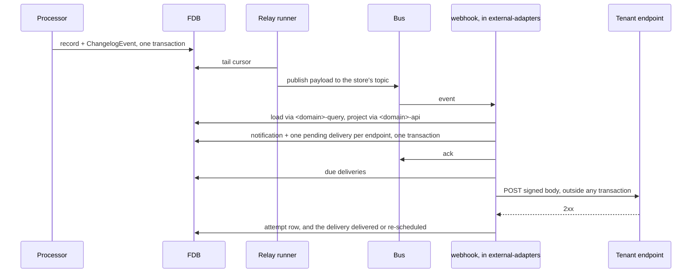

# Webhooks

> **Status: proposal.** Nothing tenant-facing exists. What the design
> reuses — the changelog relay and its envelope, the intent poller in
> the ClearBank relay, the API's resource components — exists and is
> named as such in Background. Everything under Proposed Solution is
> the build list, and "Validate on one domain first" says which part
> of it comes first.

## Objective

A tenant registers HTTPS endpoints, and the platform delivers signed
notifications to them as the tenant's records change: retried until
acknowledged, recorded so a missed delivery can be found and sent
again, and carrying the record in exactly the shape the banking API
returns it. This TDD says where each piece lives, which existing
mechanism each one reuses, what has to change in bricks that never
learn a webhook exists, and the order in which the design is proved.

In scope: the `webhook` component; the move of each domain's public
resource shape out of the `api` base into a component the webhook
brick can share; the `api` base's endpoint and delivery routes; where
the consumer and the delivery runner are hosted; the domain events the
catalogue needs; and the tests.

Out of scope: the webhooks the platform receives from its partners,
see [payments.md](payments.md) and [parties.md](parties.md); the relay
itself, see [ADR-0021](../adr/0021-changelog-relay.md); the OpenAPI
discipline the notification schema follows, see
[ADR-0014](../adr/0014-openapi-3x-compliance.md); retention and purge
of delivery history; per-tenant tuning of retry and pause behaviour.

## Background

Internally the platform is event-driven and none of it crosses the
edge. Every store's write co-commits a `ChangelogEvent` envelope, a
relay runner per store republishes the Avro payload to a bus topic,
and the reacting brick consumes it. A tenant sees none of this: it
reads a record until the answer changes.

Four things the design reuses exist today:

- **The relay and its envelope.** Runners in
  `exclusive-dispatchers-service` tail the cash-accounts, parties and
  idvs stores and the two adapter outboxes, publishing to one Kafka
  topic per store. The changelog envelope carries an event id, a dedup
  key, the event name, the payload, correlation and causation ids, a
  trace parent, a creation timestamp and an ordering key. The tenant's
  identity is not on it: `bank_id` is a field inside the payload, and
  six of the nine registered event payloads carry one. The three
  scheme-level payment events — settled, held and rejected — do not.
- **An intent poller.** The ClearBank relay's outbound runner drains a
  store of pending intents: read the pending rows, make the HTTP call
  outside any FDB transaction, then in a separate transaction mark the
  row `sent`, mark it `failed` once the attempt cap is reached, or
  bump the attempt count and leave it `pending`. Those three are the
  statuses; there is no attempted one. It polls at a fixed interval
  with no backoff. A retried POST is safe for ClearBank, which dedupes
  on the end-to-end identification the request body carries; the
  Onfido runner's two calls carry no such key.
- **Resource rendering.** The cash-account read routes project a
  loaded record onto the keys its Malli component declares: `->body`
  selects `cash-account-keys`, derived from the `CashAccount`
  component, and a test holds it. No other domain does. The
  ledger-account and jobs queries hand-rename fields as they render,
  and the party, payment, bank, balance, product, migration, policy,
  tier and transaction queries return the brick's record verbatim.
  Response coercion neither strips nor rejects an undeclared key: the
  base sets `:strip-extra-keys false`, so closed request maps still
  reject unknown fields, and every response body is an open `[:ref]`
  schema. The chart-of-accounts gap report found ledger-account
  `status` reaching every list and get body that way. The helpers the
  `api-schema` extraction takes live at the base root rather than
  under `shared/` — the registry and id-schema helpers and the
  error-response component in `schema.clj`, the enum-coercion helper
  in `coercion.clj`, the rejection-to-status mapping in `errors.clj` —
  and of those only `id-schema` is shared: every entity id format is
  defined in its own domain. A component cannot require a base, so
  nothing outside the base can render a resource today.
- **A component that owns an OpenAPI surface.** `clearbank-webhook`
  holds the Malli components and worked examples for the payloads the
  ClearBank adapter receives, exposing a component registry and an
  example registry for the adapter's OpenAPI document. The same shape,
  applied to the bank's own resources, is what the inversion below
  produces.

Two things the catalogue needs do not exist. The payment, interest and
transaction bricks write no changelog at all, so an outbound payment
settling or interest being capitalised produces no event anyone could
hear. The bank brick writes one that no runner relays. The events on
the bus today are account, party and IDV status changes, the IDV
completion, and the scheme-level settled, held and rejected events,
which are the payment processor's input rather than its outcome.

Neither inbound receiver verifies a signature. One naming drift
reached this design: the lifecycle-transitions recipe, the
processor-bricks TDD, ADR-0021 and the `design` rule told a consumer
to use a `changelog-relay/event-consumer` kind that nothing registers.
They now name the per-brick `event-processor` kind every consumer is
built on, which redelivers on a thrown or returned anomaly. The
webhook consumer is one of those.

## Proposed Solution

### Public shapes move out of the base

A notification carries a resource as the API returns it, and the
thing that renders a resource must therefore be reachable from
outside the `api` base. The move is per domain and mechanical:

- **What moves.** A domain's `components.clj` and `examples.clj`, its
  `coercion.clj` and `links.clj` where it has them, and the projection
  its read routes apply, become a component named `<domain>-api` —
  `cash-account-api` first. Its `interface.clj` exposes the component
  registry, the example registry, the coercion schemas and a `->body`
  projection. The file set is not uniform, so the move is not four
  files everywhere: five domain folders carry `links.clj`
  (`cash_account`, `cash_account_product`, `party`, `payee_check`,
  `payment`), five carry no `coercion.clj` (`companies`, `oauth`,
  `onboarding`, `simulate`, `tier`), and `transaction` has
  `components.clj` and `coercion.clj` alone. Cash accounts are the
  only domain with a projection to move; every other one is written
  during its own extraction.
- **What the shapes share.** The registry and id-schema helpers and
  the error-response component in `schema.clj`, the enum-coercion
  helper in `coercion.clj`, the rejection-to-status mapping in
  `errors.clj`, and the cross-cutting components in
  `api/shared/components.clj` — timestamps, currency, amounts, the
  page and embed queries — become one `api-schema` component that the
  base and every `<domain>-api` require. Only `id-schema` is shared;
  each entity's id format is declared in its own domain and moves
  with it.
- **What stays.** Routes, handlers, queries and command dispatch stay
  in the base. They require `<domain>-api` where they required the
  sibling namespace, and the base merges the component's registries
  into the OpenAPI document exactly as it merges its own today.
- **What it costs.** Each domain is a file move and a require change,
  including the cross-domain references that already exist — the
  payment routes refer to account components, the bank examples to
  account examples — which become component-to-component requires.
  `poly` allows those; it only forbids a component reaching into a
  base, which is the constraint the move removes.

Extraction happens one domain at a time, as that domain's kinds enter
the catalogue. A domain whose shape is still in the base cannot be in
the catalogue, and nothing forces the moves to happen together.

### Three places know, and no processor is one of them

- **The `webhook` component** owns the endpoint, notification,
  delivery and delivery-attempt records; the domain rules for
  registration, endpoint lifecycle and pausing; the signing; the
  consumer that turns a bus event into a notification; the
  notification's own OpenAPI component; and the outbound runner. It
  requires each catalogued domain's `<domain>-query` brick to load a
  record and its `<domain>-api` brick to project it. That makes it the
  second bank-shaped edge after the `api` base, and that dependency is
  the design's honest cost.
- **The `api` base**, under `api/webhook/`, owns the routes for
  endpoints and deliveries, merges the webhook component's registry
  into the OpenAPI document, and lists each kind under the document's
  `webhooks` object.
- **Hosting.** `external-adapters-service` hosts both the consumer and
  the runner, which is what ADR-0019 puts there: an intent store and
  calls to the outside. `exclusive-dispatchers-service` gains a relay
  runner per newly relayed store, which is generic configuration.
  `api-service` gains routes and nothing else.

A processor commits a transition and its envelope, as ADR-0021 already
requires. Whether anything listens is invisible to it.

### The notification body

A notification is an envelope around one of the API's own resources.

The envelope carries: `notification-id` (a uuidv7, unchanged across
every delivery), `kind` (the public name of the change, such as
`cash-account.frozen`), `change-kind` where the source event carries
one, `occurred-at`, `bank-id`, `resource-type`, `resource-id`,
`status-before` and `status-after` where the event carries them, the
`idempotency-key` where the record carries one, and the
`correlation-id`. `change-kind` travels so a tenant subscribed to
everything can dispatch on one field rather than on the kind string.

`data` is the resource exactly as its read route returns it: a `oneOf`
over the existing components — `CashAccount` first, then `Party`,
`OutboundPayment`, `InternalPayment` and `WebhookEndpoint` as their
domains join — with `resource-type` as the discriminator, the
projection ADR-0014 already prescribes for polymorphic payloads. A
member with no tenant read route has no body to be equal to, which is
why three otherwise obvious ones are absent: `InboundPayment` has no
component and no route, `Transaction` is served only as an element of
the list embedded under an account and has no single read and no
projection of its own, and `Bank` is served under admin-only routes —
a tenant reads its own bank through `/v1/me`, which returns a `Me`
shape. Each is a prerequisite step of the slice whose entry needs it:
an `InboundPayment` component and read route, a single-transaction
read with its own projection, and a tenant-facing bank shape.

There is no second schema to maintain. When a resource gains a field,
its notification gains it; the notification's version is the API's
version. The webhook component assembles the `oneOf` from the
`<domain>-api` registries it requires, and the document Reitit
assembles is OpenAPI 3.1, whose top-level `webhooks` object lists each
kind against the notification component.

The consumer renders `data` at consume time, by loading the record
through `<domain>-query` and applying the `->body` projection from
`<domain>-api`, and stores the rendered bytes on the notification row.
A re-send sends the same bytes. "As it stood" means as it stood when
the notification was produced, moments after the commit.

The catalogue, as public kind, source event, resource and loader.
`cash-account-status-changed` is one event carrying six change kinds,
and each kind gets its own public name: one event whose payload has to
be inspected to tell a freeze from an address rotation would make the
per-endpoint kind filter useless, and rotation and migration leave the
status alone, so a tenant cannot tell those two apart by the statuses
either.

- `cash-account.opened` — `cash-account-status-changed` with
  `change_kind` open, `CashAccount`, by bank and account id. Told on
  `opening` to `opened`; the leg landing on `opening` is skipped.
- `cash-account.closed` — the same event with `change_kind` close.
  Told on `closing` to `closed`; the leg landing on `closing` is
  skipped.
- `cash-account.frozen` and `cash-account.unfrozen` — `change_kind`
  suspend and resume, told on `opened` to `suspended` and `suspended`
  to `opened`.
- `cash-account.address-rotated` and `cash-account.product-changed` —
  `change_kind` rotate-address and migrate. Both carry equal before
  and after statuses, because neither write moves the status.
- `party.status-changed`, `party.identity-verified` and
  `party.identity-status-changed` — `party-status-changed`,
  `idv-completed` and `idv-status-changed`, all resolving to `Party`,
  by bank and party id.
- `payment.outbound-status-changed` and `payment.internal-settled` —
  the payment brick's outbound and internal transitions, which do not
  exist yet, resolving to `OutboundPayment` and `InternalPayment` by
  payment id.
- `payment.inbound-status-changed` — the payment brick's inbound
  transition, behind the `InboundPayment` component and read route its
  slice creates first.
- `interest.capitalised` — the interest brick's per-account
  capitalisation, resolving to the `Transaction` the run posted,
  behind the single-transaction read its slice creates first.
- `bank.status-changed` and `bank.tier-changed` —
  `bank-status-changed` and `bank-tier-changed`, behind the
  tenant-facing bank shape their slice creates first.
- `webhook-endpoint.status-changed` — `WebhookEndpoint`, so an
  endpoint paused by the platform is told to the bank's other
  endpoints through the same path as everything else.

### Hearing a change

The consumer is an `event-processor` kind registered from the
`webhook` component's system namespace and subscribed, by
configuration, to every relayed event topic. For each event it decodes
the payload with the Avro schema registered under the event name, as
every processor does, reads the bank id and the record id, loads and
projects the record, and then in one FDB transaction writes the
notification and one pending delivery per enabled endpoint of that
bank whose chosen kinds include it. It acknowledges after the commit:
consume-then-ack, as
[transaction-processing.md](transaction-processing.md) describes. An
event name with no catalogue entry is logged and acknowledged; there
is nothing to tell.

**The unique index is the changelog event id.** The relay carries the
`ChangelogEvent`'s `event_id` onto the bus envelope as its `:id`,
overriding the uuidv7 mono's publisher mints per publish, and the
notification is unique-indexed on that value. The key is therefore
stable for relayed events only: an envelope published straight onto
the bus keeps the freshly minted id, so a second publish of the same
change would be a second notification. Every catalogue entry is a
relayed changelog event, which is what makes the index sufficient.

**What the key defends against is a relay redrive.** A bus
redelivery repeats one publish and so repeats one id. A redrive is a
different case: a publish the broker accepted that the client saw fail
and threw, and a crash between the publish and the cursor checkpoint.
Both replay the entry, and before the relay carried the entry's id
both republished under a new one. The existing consumers survive
either without a key at all, because each one's second leg gates on
the loaded record's current status and a repeat is a silent skip. A
notification writer has no such gate — there is no status to read back
that says the tenant has already been told — so the index is the whole
of its protection.

**`occurred-at` is the changelog `created_at`.** The `ChangelogEvent`
carries it; mono's `EventEnvelope` has a field for neither it nor
`dedup_key`, so the relay has nowhere to put either. Adding both is a
mono change under [ADR-0001](../adr/0001-reuse-mono-as-upstream.md)
and is the first step of slice 2. Until it lands the consumer can only
stamp the time it wrote the notification, which is the relay's lag
later than the commit.

**One notification per transition, not per changelog entry.** Every
`save-account` co-commits an entry, so a two-phase transition writes
two: an opening writes `status_after` `opening` and then `opening` to
`opened`, and a closing writes `closing` and then `closing` to
`closed`. The terminal leg is the one notified. The consumer tells
them apart by `status_after`: an entry landing on an in-flight status
— `opening`, `closing` — is acknowledged and not told, because what
the tenant asked for has not happened yet. A single-leg transition
lands on a settled status and is told on the one entry it writes.

**Which idempotency key travels.** A record's key is the key of the
request that created it, and the envelope carries it only where the
record holds one. So an opening carries the `open-cash-account` key
and a party's creation carries its own, while close, suspend and
resume stamp nothing and carry that same opening key; a rotation
carries `last_rotation_idempotency_key`, the one field a later request
writes; and the Idv record has no key at all. A transition carries
none of its own unless its command's key is written into the
changelog payload, which no writer does today — the cash-account
payload carries the bank and account ids, the two statuses and the
change kind, and nothing more. The consumer therefore reads the key
off the record it loaded, before projection: `->body` drops both key
fields, so a projected account has none left to give.

### Delivering

The outbound runner is the ClearBank relay's runner generalised: it
reads the deliveries that are due, signs and POSTs each one outside any
FDB transaction, and records the outcome in its own transaction. A 2xx
marks the delivery delivered. Anything else, a timeout included,
increments the attempt count and sets the next attempt from a
geometric schedule. The defaults are a first retry within a minute,
growing to a few hours apart, and giving up after roughly a day. Past
the last attempt the delivery is marked failed and kept.

On every failure the runner also asks whether the endpoint should be
paused: no successful delivery for longer than the pause window, a day
by default, across at least a handful of attempts. Pausing is a status
transition on the endpoint record, guarded in `domain.clj` like any
other, and the endpoint store co-commits a changelog envelope for it.
The relay republishes that, the consumer turns it into a notification,
and the bank's other enabled endpoints are told. The runner never
writes a notification itself.

The runner is hosted at one replica. A second replica would sometimes
pick the same due delivery and send it twice before either records the
outcome. That is tolerable for the same reason the ClearBank runner
tolerates it: the receiver has a dedup key, here the notification id.

### Signing

Every delivery carries the headers and signature the Standard Webhooks
specification defines: a message id, a timestamp, and an HMAC-SHA256
over the id, the timestamp and the body, keyed by the endpoint's
secret. Choosing a published convention means a tenant's existing
verification library works unchanged. During a rotation window every
delivery carries a signature under both secrets, so the tenant can
switch without a rejected delivery on either side.

The secret is minted at registration, stored on the endpoint record,
and returned once, in the registration response and again in the
rotation response. No read route returns it.

### Registration and reads

Registering an endpoint has none of the four properties ADR-0018 says
earn a command. Endpoints are synchronous writes: the `api` base calls
the `webhook` interface directly, as it does for products, and there
is no `webhook-query` split until reads and writes need one.

The routes live under `/v1/webhook-endpoints`, org-scoped: create,
list, get, update the address, description and kinds, enable, disable
and remove an endpoint; rotate its secret; send it a test
notification; list its deliveries with filters on kind, outcome and
time; re-send one delivery; re-send every notification in a window.

Address validation is a domain rule: HTTPS only, and an address whose
host resolves to a loopback, link-local, private or metadata range, or
to the platform's own hosts, is refused. The check runs at
registration and at update.

Policy bounds follow the products precedent: a `:webhook-endpoint`
capability with register and manage actions, and a count limit per
bank, both evaluated before the write.

Rejections: `:webhook-endpoint/not-found` and
`:webhook-delivery/not-found` fall to 404 by name;
`:webhook-endpoint/invalid-address` falls to 422 by default;
`:webhook-endpoint/invalid-status` needs a 409 entry in the `api`
base's override table.

### Records

Four record types, as protos under `schemas/webhooks/`, registered in
three places the way the ClearBank outbox was: the record-type union,
the FDB record-type YAML, and the `pb->`, `->pb` and `->java` trio per
type in the `schema` brick's `interface.clj`.

- `WebhookEndpoint` — bank id, endpoint id, address, description, the
  chosen kinds, status (enabled, disabled, paused, removed), the
  current secret, the previous secret and when it expires, when the
  endpoint last succeeded, the idempotency key of the registration
  that created it, and timestamps. Indexed by bank, with an FDB
  `count` index over `[bank_id, endpoint_id]` for the limit check and
  a unique index on `[bank_id, idempotency_key]`. That unique index is
  what makes registration retry-safe: a retried request reads back the
  endpoint it already created instead of minting a second endpoint, a
  second secret and a second count against the limit. The store writes
  the changelog envelope on a status change, and a relay runner for it
  is configuration.
- `WebhookNotification` — notification id, bank id, kind, resource
  type and id, the envelope fields above, the rendered body, and the
  changelog event id under a unique index.
- `WebhookDelivery` — delivery id, notification id, endpoint id,
  status (pending, delivered, failed), attempts, when the next attempt
  is due, the last response status or error, and timestamps. Indexed
  by status and due time for the runner, and by endpoint and time for
  the delivery history. Kind and outcome are denormalised onto the
  delivery, so the history's filters answer off one index rather than
  a join back to the notification.
- `WebhookDeliveryAttempt` — attempt id, delivery id, when it was
  attempted, the response status or the error, and how long the call
  took. Indexed by delivery. A re-send is a new delivery of the same
  notification, so "recorded alongside the original attempts" is
  satisfied by rows that survive rather than by a history a counter
  discards. The operator's dispute case reads straight down the four:
  which notification, which endpoint, every attempt, and what each
  one answered.

A repeated field on the delivery would have kept the attempts in one
row. It was rejected: the row grows against the retry schedule's
ceiling with no way to page it, and the history filters — kind,
outcome and time — want an index rather than a scan of embedded
values.

The count index follows the products precedent, which backs its
per-bank product cap the same way and checks the count plus one
against a `:time-window-instant` limit in `domain.clj`. A new event
needs its Avro schema in `avro-schemas.yml`, and the lifecycle recipe
requires the event channel, its topic and the consumer that subscribes
it to be declared in every system that needs the reaction, the
monolith and the test rigs included.

`:webhook-endpoint/invalid-status` carries what the recipe mandates:
`:message`, `:endpoint-id`, `:status` — the offending one — and
`:allowed`, the set of source statuses the transition accepts.

### What the processors must publish

The catalogue's payment and interest entries need events that do not
exist: the payment brick's outbound, inbound and internal transitions,
and the interest brick's capitalisation per account. The bank brick's
events exist and need a relay runner and a topic. Each is the
lifecycle recipe's Avro schema in `avro-schemas.yml`, the store's
changelog envelope on the transition, and a runner and topic in
`exclusive-dispatchers-service`. None of it names a consumer. Each
writer sets the ordering key to the record id, so per-record order
survives when topics gain partitions. Every one of these payloads
carries `bank_id`: the tenant's identity is not on the envelope, and
the consumer has nowhere else to read it from.

The capitalisation envelope is emitted in `capitalize-account`, where
the posting transaction is recorded and its id is bound. Emitting it
anywhere later would have to find that id again, and
`InterestAccountRun` does not hold it — so the entry resolves to a
`Transaction` a tenant can read only if it is written where the id
already is.

The two cash-account-product changes the PRD names — a version
published, and a bulk move of accounts completed — are not in the
catalogue. Neither product brick writes a changelog or has an events
namespace, and publishing a version is a synchronous status flip
today, so both would need a changelog write, an event and a relay
runner before they could be heard at all. They are listed under Out of
scope with that reason.

### Validate on one domain first

The design is proved on cash accounts before anything else is built
on it. The first slice is:

1. Extract `api-schema` and `cash-account-api` from the base, taking
   the `->body` projection with them, and hold it against
   `CashAccount`'s declared keys in the component's own test. Confirm
   the exported OpenAPI document is unchanged.
2. Build the `webhook` component with one catalogue entry,
   `cash-account.opened`, its records, its consumer and its
   runner, hosted in `external-adapters-service`.
3. Add the endpoint and delivery routes, signing, and the policy
   bounds.
4. Land the end-to-end scenario: an endpoint at a receiver the test
   rig hosts, an account opened, a signed notification received whose
   `data` equals the read route's response — and exactly one
   notification for that opening, which is what holds the terminal-leg
   rule against the two entries an opening writes.

Cash accounts go first because their events already exist and are
relayed, their opening transition is two-phase so "told rather than
asked" is a real case, and the resource is the richest one, with
embedded balances, so the projection is tested where it is hardest.
A gap analysis runs against this TDD once the slice lands, before the
next slice starts.

The slices after it, each adding an extraction and catalogue entries
and discarding nothing: parties and identity verification, whose
events exist; payments and interest, which wait on their events; the
bank and the endpoint-paused notification. Every one of them writes
that domain's `->body` projection and the test that holds it against
the component's declared keys, because cash accounts are the only
domain with a projection to move.

Until a domain's projection is written, its slice's equality assertion
passes vacuously. The notification and the read route load the same
un-projected record, so both leak the same undeclared keys and agree
with each other while agreeing with the component's declared shape
neither.

### Tests

- **The `webhook` brick** covers its domain rules (address validation,
  lifecycle guards, the pause rule, the retry schedule), its store (the
  indexes, the dedup key), its signing against the specification's
  test vectors, its runner against a receiver started in the test, and
  that its `oneOf` names every resource the catalogue maps to.
- **The `api` base** keeps a test that the exported document resolves
  every `$ref` after each extraction, and that each kind is listed in
  the document's `webhooks` object.
- **API scenarios** in `test-api-scenarios` cover the endpoint
  lifecycle, secret rotation and the count limit, plus the end-to-end
  scenario above. Its equality assertion is the design's contract.

## Alternatives Considered

- **Leave the shapes in the base and host the consumer there.** Works
  without moving a file, and was the first shape considered. Rejected:
  it leaves every public shape where no second consumer can reach it,
  and puts a bank-wide dependency and a bus consumer into the API
  service for the sake of one projection.
- **A dispatcher in `external-adapters-service` with its own
  projection per resource.** Rejected: two projections drift, which is
  the maintenance problem the `oneOf` design exists to avoid.
- **A thin body: identifiers and statuses only.** No coupling to
  resources, and one read per notification for every consumer, with
  the tenant maintaining the join. The PRD chose the resource.
- **A bespoke schema per kind.** The maintenance problem itself.
- **Delivering from inside a processor's event handler.** An HTTP call
  with no intent record loses the delivery on a crash between the call
  and the ack, and puts a tenant's outage in a processor's consumer
  loop.
- **A house signing scheme.** Nothing to gain over a published one
  that has verification libraries.

## Known Limitations

- **Only an extracted domain can be in the catalogue.** Each domain's
  kinds wait on its `<domain>-api` move.
- **No retention or purge.** Notifications and deliveries accumulate.
- **One runner replica.** A second replica double-sends before it
  double-records. Tolerable, not designed away.
- **Order is by topology.** Topics are single-partition today, so
  order holds; the ordering key is declared for when they are not.
- **Capitalisation bursts.** One notification per account per run,
  with no batching.
- **Secrets at rest are unencrypted**, as the parties TDD notes for
  personal data.
- **A pause reaches the console and the bank's other endpoints only.**
  A single-endpoint tenant has no out-of-band alert.
- **No ownership challenge at registration.** The test notification is
  a manual check.
- **Rendered at consume time.** Two changes to one record inside the
  relay's lag render the later state in both notifications; the
  envelope's before and after statuses still tell them apart.
- **Address validation is at registration.** A host that later
  resolves elsewhere is not re-checked before delivery.
- **The payment and interest entries wait on their events.** Until
  those bricks publish transitions, the catalogue delivers account,
  party, identity-verification and bank changes only.

## References

- [webhooks](../prd/webhooks.md) — Webhooks, the product requirements
  this design serves.
- [ADR-0001](../adr/0001-reuse-mono-as-upstream.md) — Consume `mono` as
  a pinned dependency, why the envelope fields the consumer wants are
  an upstream change.
- [ADR-0014](../adr/0014-openapi-3x-compliance.md) — OpenAPI 3.x
  compliance, the `oneOf` and discriminator rule the body follows.
- [ADR-0018](../adr/0018-command-writes-are-earned.md) — Command writes
  are earned, why registration is synchronous.
- [ADR-0019](../adr/0019-processor-packaging.md) — Processor
  packaging, where the consumer and the runner are hosted.
- [ADR-0021](../adr/0021-changelog-relay.md) — Changelog relay, the
  path a change takes to the consumer.
- [transaction-processing.md](transaction-processing.md) — the outbox,
  intent and consume-then-ack rules the consumer and runner follow.
- [payments.md](payments.md) and [parties.md](parties.md) — the
  inbound webhooks and the ClearBank intent runner.
- [service-apis.md](service-apis.md) — OpenAPI assembly and the
  rejection mapping.
- [lifecycle-transitions](../recipes/code/lifecycle-transitions.md) —
  the checklist each new event follows.
- [Standard Webhooks](https://www.standardwebhooks.com/) — the signing
  and header convention.
