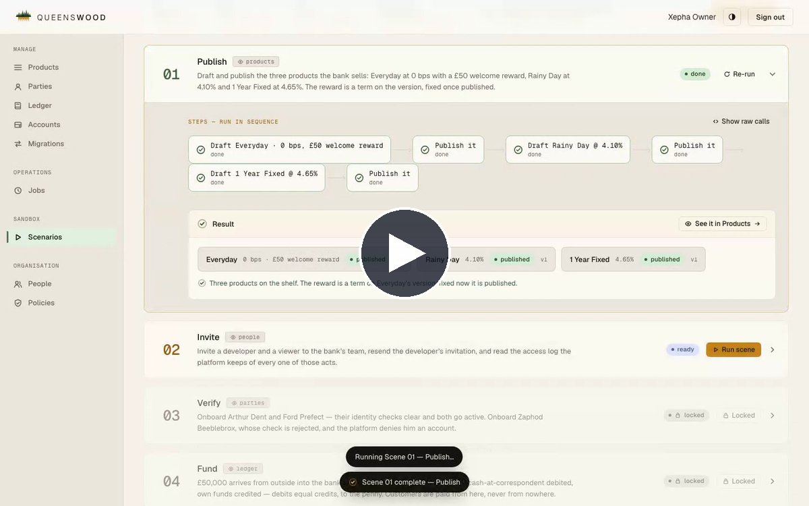
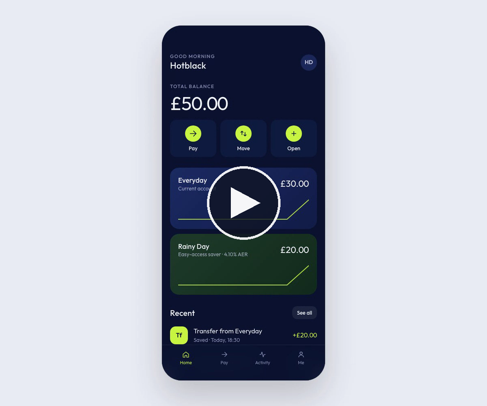

<!-- markdownlint-configure-file { "MD033": false, "MD041": false } -->

<p align="center">
  
</p>

# Queenswood

**Open-source core banking.** Whether you're building a bank or embedding
banking into your product, Queenswood runs the banking behind it. It provides
customer onboarding with identity checks, products and accounts, payments,
interest and rewards, a general ledger, policies, end-of-day processing,
webhooks and an operator console, all of it configured and driven through one
API. You bring the banking licence, the clearing partner and the identity
provider.

## Demo

[](https://github.com/user-attachments/assets/2289f4ea-3441-4bb0-8923-14996b80805a)

A tour of what your bank can do, in the operator console: **Publish** products,
**Invite** operators, **Verify** customers, **Fund** the bank, **Open**
accounts, **Reward** customers, **Move** money, **Refuse** an overdraft, **Pay**
someone, **Migrate** accounts and **Accrue** interest.

[](https://github.com/user-attachments/assets/673ac5b1-c751-4d85-a29b-4b02859c3c75)

The same bank from your customer's side, in the
[demo digital bank](docs/prd/demo-digital-bank.md)'s app: sign up and open two
accounts.

## How it's used

- **Your product team designs what you offer.** They publish each product
  version in the console, and plan the migrations that move holders onto a new
  one.
- **Your engineers integrate it into your systems.** They call
  [its API](https://repldriven.github.io/queenswood/), and act on its webhooks
  as your customers bank with you. They can run the whole platform, console
  and simulators included, [on a laptop](#run-on-a-laptop).
- **Your operators run the bank day to day in the console.** They watch
  end-of-day processing, look into a customer's account when something doesn't
  add up, and manage who on the team can do what.
- **Your customers use your app.** They see you, never Queenswood.
- **Your finance team keeps the books in the console.** They read the general
  ledger, check the trial balance ties, and see what waits in suspense.
- **Compliance reads the records.** The access log, the policies in force and
  the ledger say who did what, and under which rules.

## What you bring

- **A banking licence**, or a partner who holds one.
- **A clearing partner** for Faster Payments.
- **An identity verification provider.**
- **Somewhere to run it.** Run it on your own infrastructure, follow the
  [Google Cloud guide](docs/recipes/infra/up-and-running.md), or wait for our
  managed offering.

## For decision-makers

- **Open source.** The code is yours to read, run and change under the MIT
  licence, on infrastructure you choose. There's no licence fee, and no vendor
  deciding your roadmap or moving the product from under you.
- **Configurable products.** Change a rate, add a welcome reward or launch a
  new product line, and move existing customers to the new terms only when you
  plan and approve it, with no code changes.
- **Configurable policies.** Policies are records checked on every request,
  and your bank's tier sets the capabilities and limits it works within, so
  changing either ships no code.
- **Sandbox.** Your bank starts in test, where you try everything with
  simulated money on the same software your customers will use, and moves to
  live when you're ready.
- **Pluggable providers.** Clearing and identity verification each connect
  through an adapter, and a simulator stands in for each provider, so you can
  build and test before a contract is signed.
- **Customer onboarding.** Every new customer is identity-checked as they sign
  up, and can't open an account until the check clears.
- **Payments and books that balance.** Customers pay and are paid by UK
  Faster Payments in seconds, with Confirmation of Payee first. Every
  movement is recorded as matching debits and credits, so the books always
  balance.
- **Real-time notifications.** Your systems are told as things happen, such
  as an account opening, money arriving or a payment settling.
- **Audit trail.** Everyone on your team signs in as themselves with a
  role, and a log records who did what.
- **Documentation.** Every capability has a
  [requirements document](docs/prd/) saying what it's for and who uses it, in
  product language. All technical documentation says what's done and what's not.
- **Test suite.** Generated tests check its answers against a model of how
  a bank should behave, and scenarios drive the live API end to end.

## For application engineers

- **One API, with an OpenAPI 3.x document.** One base URL and one document,
  not a service per domain, and the document is generated from the routes
  themselves so it can't drift from what the API does. See
  [ADR-0013](docs/adr/0013-single-unified-api.md) and
  [ADR-0014](docs/adr/0014-openapi-3x-compliance.md).
- **Idempotent writes.** Every write takes an idempotency key, so a retried
  request replays the first answer rather than paying twice.
  See [idempotency](docs/tdd/idempotency.md).
- **Signed webhooks.** Deliveries are signed under the
  [Standard Webhooks](https://www.standardwebhooks.com/) convention, retried,
  and re-sendable.
  See [webhooks](docs/tdd/webhooks.md).
- **A worked example.** The
  [demo digital bank](docs/prd/demo-digital-bank.md) is a retail banking app
  built entirely on the API, with its own backend and store, and the reference
  for building yours.

### Run on a laptop

With no cluster, from a checkout with the
[development environment](#nix) active:

```bash
# The platform, as one process with its containers.
just monolith-start

# The console, on http://localhost:5173.
just console-start

# The demo digital bank: seed it on the platform, then start its backend and
# its app, on http://localhost:5174.
just demo-digital-bank-seed
just demo-digital-bank-start
just demo-digital-bank-app-start
```

## For system architects

### Architecture

The Message Bus (Kafka or Pulsar) carries commands and events
between Queenswood's processors and external providers; a distributed
database (FoundationDB) manages the data.

<picture>
  <source media="(prefers-color-scheme: dark)"  srcset="docs/diagrams/system-diagram-dark.svg">
  <source media="(prefers-color-scheme: light)" srcset="docs/diagrams/system-diagram-light.svg">
  
</picture>

**Writes as commands, processed in parallel and in order.** The API can put a
write on the bus as a command instead of doing the work itself. Processors
consume those commands and scale independently of the web tier, so the work
spreads across as many instances as it takes while a request costs the API
only an open connection. Commands sharing an ordering key are consumed one at
a time and in order, however many processors are running. Delivery is
at-least-once and a redelivered command is recognised, so repeating a request
replays the first outcome rather than doing the work twice. Today the API
waits for the reply and answers on the same connection; the same split would
let it acknowledge immediately and return the outcome out of band. Other
writes are direct calls. Processors deploy individually, or bundled along
lines of responsibility such as financial and operational.

**Reads are queries.** The API read-side loads records directly through a
separate query surface — no command, no bus, no round-trip. Query bricks read
and nothing else. Once a domain's writes go through commands, its write brick
becomes private to the processor, and the API reaches only the query side. The
build enforces it. A read therefore never travels the write path, and a busy
or unavailable bus doesn't make the bank unreadable.

**Processors react, they never call one another.** When another part of the
system has to react to a change, it's recorded in a changelog in the same
transaction as the write itself, so a change and the news of it can't diverge.
One system-wide relay tails those changelogs in order and publishes each entry
to the message bus as an event, and the processors that care subscribe. An
event says what happened; a command asks for something to be done. The records
stay the source of truth, and an event carries a change across a boundary.

**External calls are recorded before they're made.** A database write and an
outbound HTTP call can't be made atomic: no transaction spans the two, and
there's no two-phase commit across another company's API. Committing first
risks a call that never happens; calling first risks a call that happened but
was never recorded. So the adapter commits the _intent_ to call, and a
separate poller makes the call afterwards, retrying each pending intent until
it succeeds or exhausts its attempts. Webhook events received from an external
service are normalized by the adapter and written to a deduplicating outbox,
atomically with its changelog record, and relayed to the message bus in order
through the system-wide changelog relay, so processors react to a provider's
events as they do to the platform's own.

### Design decisions

The main engineering decisions, each with its document:

- **System-level and model-equality property testing.** Two state machines fed
  the same commands: the real system, and a model that imports nothing from
  it, no database, no protobuf, no shared code. A divergence shrinks to the
  shortest sequence that causes it. See
  [scenario-testing](docs/tdd/scenario-testing.md).
- **Anomalies, not exceptions, at every component interface.** An interface
  returns a value or an anomaly and never raises. Three kinds separate a fault
  from a refusal from a forbidden call, which is how the API picks a status
  family without inspecting a payload. See
  [ADR-0005](https://github.com/repldriven/mono/blob/main/docs/adr/0005-error-handling-with-anomalies.md).
- **System-as-data.** Test and production share one bootstrap path, and what a
  given process runs is decided by its configuration rather than its code: the
  same bricks start as a modular monolith in one JVM or as separate services.
  See
  [ADR-0007](https://github.com/repldriven/mono/blob/main/docs/adr/0007-system-as-data.md)
  and the
  [slides](https://github.com/repldriven/mono/blob/main/docs/slides/systems-as-data/slides.md).
- **FoundationDB Record Layer.** Multi-record ACID across stores in one
  transaction, so creating a bank writes its party, ledger chart, house
  accounts and policy bindings, or none of them. Changelog entries are keyed
  by versionstamp, so the log is ordered by commit and a relay resumes exactly
  where it stopped. Counts and sums are kept current as records commit, so
  reading one costs the same whether a bank has ten accounts or ten million.
  See [ADR-0002](docs/adr/0002-foundationdb-record-layer.md).
- **Built on `mono`.** The generic half lives upstream: messaging, identity,
  observability, HTTP, error handling, and the system assembly the bullet
  above describes. It arrives tested on its own terms and pinned to a tag and
  a sha, so the tests here cover banking, not infrastructure, and an upgrade
  happens only when someone bumps the pin. See
  [ADR-0001](docs/adr/0001-reuse-mono-as-upstream.md).

### Technical documentation

Queenswood's documents live under `docs/`:

- **[docs/tdd/](docs/tdd/)** — how it's built, one document per capability and
  subsystem, from storage up to the API.
- **[docs/adr/](docs/adr/)** — the decisions, each with the context that
  forced it and the consequences accepted. Kept as a record, so one that has
  been superseded says so rather than being rewritten.
- **[docs/recipes/](docs/recipes/)** — task-oriented guides in a fixed shape
  (Problem, Solution, Failures, Rules, Discussion) for the things you do
  repeatedly in this codebase.

Nearly every ADR and recipe carries a label binding it to a rule plugin, and
the rules an agent loads on every task in this repo are regenerated from those
documents rather than written alongside them, so an agent's rules always match
the decision they came from.

## For infrastructure engineers

The released Helm chart deploys the entire platform (API,
processors, adapters/simulators, web console,
Kafka or Pulsar, FoundationDB) onto any Kubernetes cluster.

### Run on a local cluster

**Start a cluster** on macOS, with Colima and kind:

```bash
brew install colima kind kubectl helm
colima start --vm-type vz --vz-rosetta --cpu 6 --memory 24
kind create cluster --name queenswood \
  --config <(curl -fsSL https://raw.githubusercontent.com/repldriven/queenswood/main/infra/kind/queenswood-config.yaml)
```

**Install** the platform onto it:

```bash
helm install queenswood \
  oci://ghcr.io/repldriven/queenswood \
  -n queenswood --create-namespace \
  -f https://raw.githubusercontent.com/repldriven/queenswood/main/infra/helm/queenswood/values-local.yaml \
  --wait --timeout 10m
```

**Reach the API, console and tracing web apps**:

```bash
kubectl -n queenswood port-forward svc/queenswood-api-service 8080:8080
kubectl -n queenswood port-forward svc/queenswood-console     8081:8080
kubectl -n queenswood port-forward svc/queenswood-jaeger      16686:16686
```

Open the console at [localhost:8081](http://localhost:8081) and sign in as
`dev` / `dev`. Keep the console's forward on 8081: Keycloak issues tokens for
that address, and the API refuses a token issued for any other.

In the console, **Sandbox › Scenarios** runs the platform for real
against your cluster — open Jaeger alongside it at
[localhost:16686](http://localhost:16686) to watch the spans each
scenario produces.

The full quickstart — including tear-down — ships with
each
[release](https://github.com/repldriven/queenswood/releases/latest).

### Run on Google Cloud

A blueprint for running Queenswood on Google Cloud, guided by Google's
[enterprise foundations blueprint](https://cloud.google.com/architecture/security-foundations):
each installation is a folder of its own, people hold read-only access and
make changes only through controlled break-glass groups, the foundations are
protected by liens rather than convention, and organisation security policies
are enforced from the first project.

No command deploys an installation. An installation is a manifest in a private
repository, and a management plane running Crossplane and Argo CD reconciles
the folder, the projects, the clusters and the workloads toward what that
manifest says — so changing what exists means editing the manifest and merging
it.

[Up and running](docs/recipes/infra/up-and-running.md) is where to start:
every recipe from an empty Google account to a bank serving traffic, in order,
and what each leaves for the next. There are two paths through it — from
nothing, or from an established organisation, where someone else has already
done the first steps.

<a href="docs/diagrams/infrastructure-diagram-light.svg">
  <picture>
    <source media="(prefers-color-scheme: dark)"  srcset="docs/diagrams/infrastructure-diagram-dark.svg">
    <source media="(prefers-color-scheme: light)" srcset="docs/diagrams/infrastructure-diagram-light.svg">
    
  </picture>
</a>

The tier across the top is durable and never torn down: the management project
reconciles the installation, the recovery project holds the backups and the
key they're encrypted under, and the DNS zone stays when an instance goes. The
instance project below it is rebuilt whenever an instance is.

## For contributors

### Nix

Nix is used to manage the many tools and binaries required to develop
Queenswood. Nix can be installed several ways, and this README doesn't
prescribe one.

Nix flakes with `direnv` ensure everything required is on the path
automatically whenever you `cd` to it.

```bash
❯ cd queenswood
direnv: loading ~/Documents/github.nosync/repldriven/queenswood/.envrc
direnv: using flake .
FDB libs: /nix/store/i3abz3pz7p6mw9dzg9kr2praag0s6zqz-foundationdb-7.3.75/lib
fdbcli: /nix/store/i3abz3pz7p6mw9dzg9kr2praag0s6zqz-foundationdb-7.3.75/bin/fdbcli
protoc-gen-clojure: protoc-gen-clojure version: v2.1.2
Clojure monorepo environment loaded
Preparing repo...
merge drivers configured
Prepping libraries...
direnv: export +AR +AS +CC +CLASSPATH ...
```

### REPL

REPL-driven development follows the standard Polylith pattern.

```clojure
(ns dev.monolith
  "Start the system as a modular monolith and testcontainers
   for FoundationDB, Kafka or Pulsar, Keycloak, etc:
   * start docker (just docker-start),
   * start repl (just repl),
   * load this namespace, and evaluates lines from the comment block

   After the system has started:
   * start web console (just console-start), login and explore

   NOTE: on a fresh install, it may take several minutes to download
         required images for FoundationDB, Kafka, Keycloak, etc"
  (:require
    [com.repldriven.queenswood.testcontainers.interface]
    [com.repldriven.queenswood.monolith.main :as main]))

(comment
  (def sys (main/start "classpath:monolith/application-test.yml" :dev))
  (tap> sys)
  (main/stop sys)
  :-)
```

### Built on mono

[mono](https://github.com/repldriven/mono) is an opinionated Clojure framework
for building systems on [Polylith](https://polylith.gitbook.io/polylith):
bricks you test on their own, wired together by configuration and started as
one. Its components are documented in the
[mono README](https://github.com/repldriven/mono#components).
