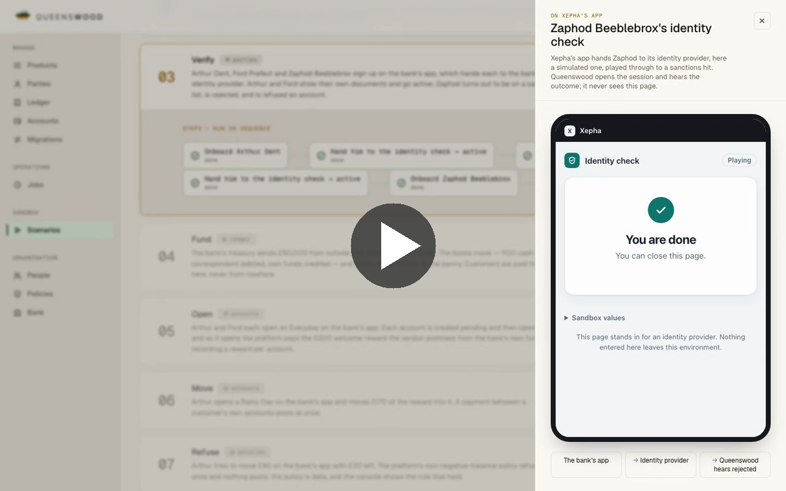
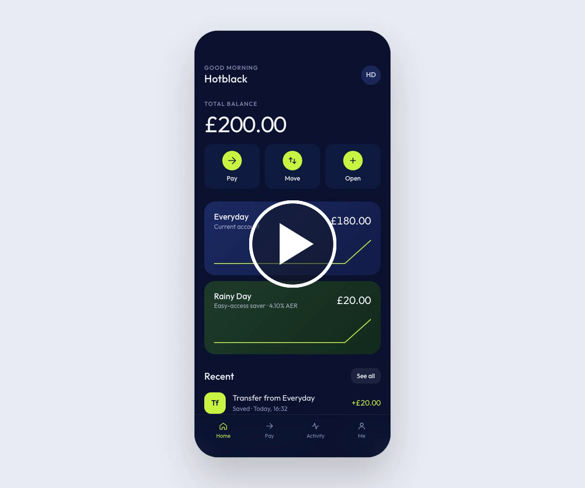
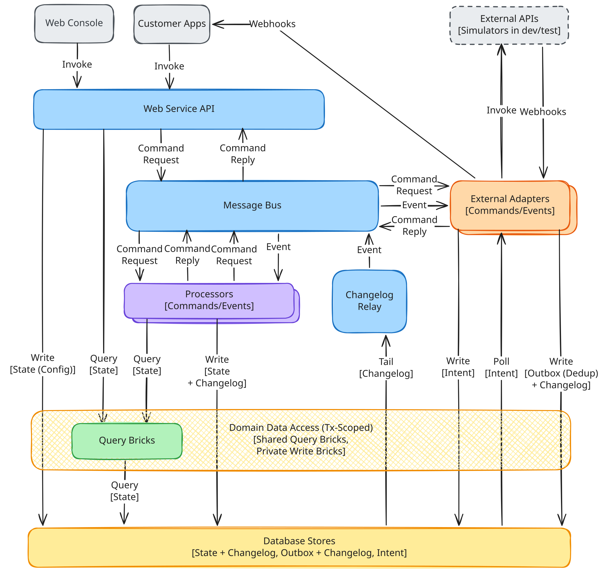
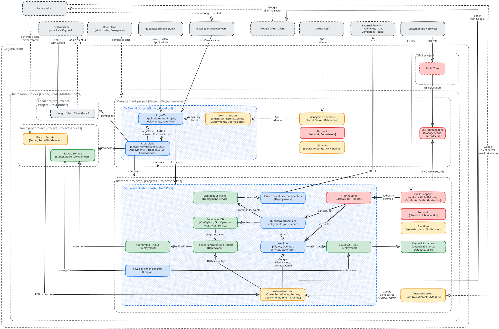
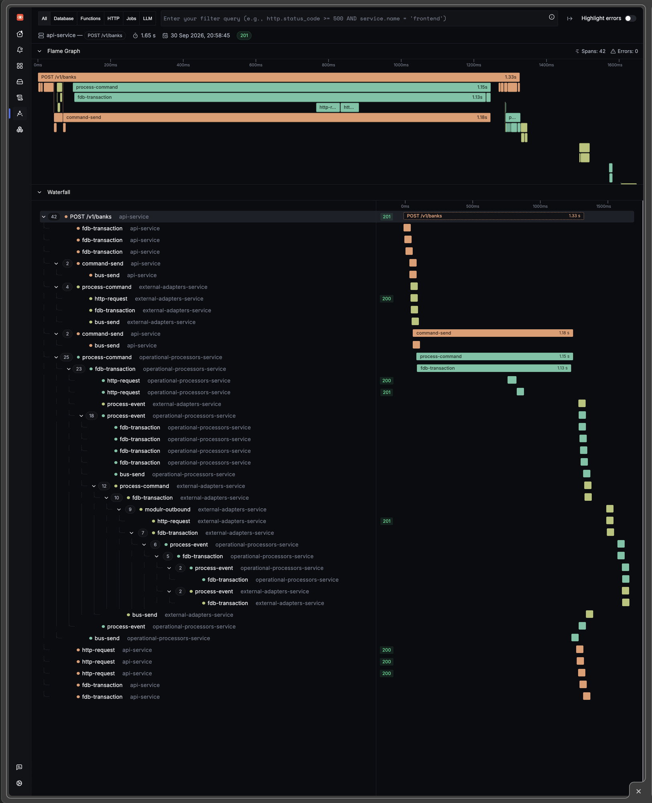

<!-- markdownlint-configure-file { "MD033": false, "MD041": false } -->

<p align="center">
  
</p>

# Queenswood

**Open-source core banking.** Whether you're building a bank or embedding
banking into your product, Queenswood runs the banking behind it. It provides
customer onboarding with identity checks, products and accounts, payments,
interest and rewards, a general ledger, policies, end-of-day processing,
webhooks and an operator console, all of it configured and driven through one
API. You bring the banking licence, the clearing partner and the identity
provider.

## Demo

[](https://github.com/user-attachments/assets/6c2ffce4-6c2d-4c38-ae47-bf299f23ac12)

A tour of what your bank can do, in the operator console: **Publish** products,
**Invite** operators, **Verify** customers, **Fund** the bank, **Open**
accounts, **Reward** customers, **Move** money, **Refuse** an overdraft, **Pay**
someone, **Migrate** accounts and **Accrue** interest.

[](https://github.com/user-attachments/assets/9dada1c8-a531-4b03-937f-c36bbbd2c844)

The same bank from your customer's side, in the
[demo digital bank](docs/prd/demo-digital-bank.md)'s app: **Sign up**,
**Verify** with the identity provider and **Open** accounts.

## How it's used

- **Your product team designs what you offer.** They publish each product
  version in the console, and plan the migrations that move holders onto a new
  one.
- **Your engineers integrate it into your systems.** They call
  [its API](https://repldriven.github.io/queenswood/), and act on its webhooks
  as your customers bank with you. They can run the whole platform, console
  and simulators included, [on a laptop](#run-on-a-laptop).
- **Your operators run the bank day to day in the console.** They watch
  end-of-day processing, look into a customer's account when something doesn't
  add up, and manage who on the team can do what.
- **Your customers use your app.** They see you, never Queenswood.
- **Your finance team keeps the books in the console.** They read the general
  ledger, check the trial balance ties, and see what waits in suspense.
- **Compliance reads the records.** The access log, the policies in force and
  the ledger say who did what, and under which rules.

## What you bring

- **A banking licence**, or a partner who holds one.
- **A clearing partner** for Faster Payments.
- **An identity verification provider.**
- **Somewhere to run it.** Run it on your own infrastructure, follow the
  [Google Cloud guide](docs/recipes/infra/up-and-running.md), or wait for our
  managed offering.

## For decision-makers

- **Open source.** The code is yours to read, run and change under the MIT
  licence, on infrastructure you choose. There's no licence fee, and no vendor
  deciding your roadmap or moving the product from under you.
- **Configurable policies.** Policies are records checked on every request,
  and your bank's tier sets the capabilities and limits it works within, so
  changing either ships no code.
- **Sandbox.** Your bank starts in test, where you try everything with
  simulated money on the same software your customers will use, and moves to
  live when you're ready.
- **Pluggable providers.** Clearing and identity verification each connect
  through an adapter, and a simulator stands in for each provider, so you can
  build and test before a contract is signed.
- **Books that balance.** Every movement is recorded as matching debits and
  credits, so the books always balance, down to fractions of a penny of
  interest.
- **Audit trail.** Everyone on your team signs in as themselves with a
  role, and an audit log records every change to who may act for your
  bank — invitations, role changes, removals and the operator's own acts
  — with who made it and why.
- **Documentation.** Every decision, design and procedure is written down, and
  all of it says what's done and what's not.
- **Test suite.** Generated tests check its answers against a model of how
  a bank should behave, and scenarios drive the live API end to end.

## For product managers

- **Configurable products.** Change a rate, add a welcome reward or launch a
  new product line, and move existing customers to the new terms only when you
  plan and approve it, with no need to ship code.
- **Interest.** Accounts earn interest daily on their settled balance, paid
  in on a schedule you set.
- **Customer onboarding.** Every new customer is identity-checked as they sign
  up, and can't open an account until the check clears.
- **Payments.** Customers pay and are paid by UK Faster Payments in seconds,
  with Confirmation of Payee first.
- **Real-time notifications.** Your systems are told as things happen, such
  as an account opening, money arriving or a payment settling.
- **Product requirements.** Every capability has a
  [requirements document](docs/prd/) saying what it's for and who uses it, in
  product language.

## For application engineers

- **One API, with an OpenAPI 3.x document.** One base URL and one document,
  not a service per domain, and the document is generated from the routes
  themselves so it can't drift from what the API does. See
  [ADR-0013](docs/adr/0013-single-unified-api.md) and
  [ADR-0014](docs/adr/0014-openapi-3x-compliance.md).
- **Idempotent writes.** Every write takes an idempotency key, so a retried
  request replays the first answer rather than paying twice.
  See [idempotency](docs/tdd/idempotency.md).
- **Webhooks.** Deliveries are retried until acknowledged, up to a limit, and
  each is recorded, so a missed one can be found and sent again. See
  [webhooks](docs/tdd/webhooks.md).
- **A worked example.** The
  [demo digital bank](docs/prd/demo-digital-bank.md) is a retail banking app
  built entirely on the API, with its own backend and store, and the reference
  for building yours.

### Run on a laptop

With no cluster, from a checkout with the
[development environment](#nix) active:

```bash
# Traces, in SigNoz on http://localhost:3301 as dev@example.com /
# Queenswood-dev-1. Optional, and first, so the platform's spans land.
just telemetry-start

# The platform, as one process with its containers.
just monolith-start

# The console, on http://localhost:5173.
just console-start

# The demo digital bank: seed it on the platform, then start its backend and
# its app, on http://localhost:5174.
just demo-digital-bank-seed
just demo-digital-bank-start
just demo-digital-bank-app-start
```

## For system architects

### Architecture

The API reads from a distributed database, and makes a write either directly
or by putting it on a message bus as a command. Processors take those
commands, write to the database, and publish what changed as events on the
same bus. Adapters stand between the platform and the outside world: they call
the clearing, identity verification and company registry providers, and turn
the providers' webhooks into events.

<picture>
  <source media="(prefers-color-scheme: dark)"  srcset="docs/diagrams/system-diagram-dark.svg">
  <source media="(prefers-color-scheme: light)" srcset="docs/diagrams/system-diagram-light.svg">
  
</picture>

**Writes as commands, processed in parallel and in order.** Processors scale
independently of the web tier, so the work spreads across as many instances
as it takes while a request costs the API only an open connection. Commands
sharing an ordering key are consumed one at a time and in order, however many
processors are running. Delivery is at-least-once and a redelivered command
is recognised.

**Reads are queries.** The API read-side loads records directly through a
separate query surface — no command, no bus, no round-trip. Query bricks read
and nothing else. Once a domain's writes go through commands, its write brick
becomes private to the processor, and the API reaches only the query side. The
build enforces it. A read therefore never travels the write path, and a busy
or unavailable bus doesn't make the bank unreadable.

**Processors react, they never call one another.** When another part of the
system has to react to a change, it's recorded in a changelog in the same
transaction as the write itself, so a change and the news of it can't diverge.
One system-wide relay tails those changelogs in order and publishes each entry
to the message bus as an event, and the processors that care subscribe. An
event says what happened; a command asks for something to be done.

**External calls are recorded before they're made.** A database write and an
outbound HTTP call can't be made atomic: no transaction spans the two, and
there's no two-phase commit across another company's API. Committing first
risks a call that never happens; calling first risks a call that happened but
was never recorded. So the adapter commits the _intent_ to call, and a
separate poller makes the call afterwards, retrying each pending intent until
it succeeds or exhausts its attempts. A provider's webhooks are written to a
deduplicating outbox and relayed like the platform's own changes.

### Building blocks

What Queenswood is built from, each with its document:

- **System-as-data.** Test and production share one bootstrap path, and what a
  given process runs is decided by its configuration rather than its code. The
  same bricks run as separate services, as groups of related ones such as the
  financial and the operational processors, or all together in one JVM as a
  modular monolith, grouped however suits you. See
  [ADR-0007](https://github.com/repldriven/mono/blob/main/docs/adr/0007-system-as-data.md).
- **Message bus.** Processors send and subscribe through an abstraction that
  configuration binds to Kafka, Pulsar or in-process channels, so the same
  processors run on a broker in production and on channels in a test or the
  monolith. Commands and events travel as Avro, each producer and consumer
  bound to its schema at startup. See
  [ADR-0003](https://github.com/repldriven/mono/blob/main/docs/adr/0003-message-bus-abstraction.md)
  and
  [ADR-0004](https://github.com/repldriven/mono/blob/main/docs/adr/0004-avro-for-message-payloads.md).
- **FoundationDB Record Layer.** Multi-record ACID across stores in one
  transaction, so creating a bank writes its party, ledger chart, house
  accounts and policy bindings, or none of them. Changelog entries are keyed
  by versionstamp, so the log is ordered by commit and a relay resumes exactly
  where it stopped. Counts and sums are kept current as records commit, so
  reading one costs the same whether a bank has ten accounts or ten million.
  See [ADR-0002](docs/adr/0002-foundationdb-record-layer.md).
- **Built on `mono`.** The generic half lives upstream: messaging, identity,
  observability, HTTP, error handling and the system assembly. It arrives
  tested on its own terms and pinned to a tag and a sha, so the tests here
  cover banking, not infrastructure, and an upgrade happens only when someone
  bumps the pin. See [ADR-0001](docs/adr/0001-reuse-mono-as-upstream.md).

### Technical documentation

Queenswood's documents live under `docs/`:

- **[docs/tdd/](docs/tdd/)** — how it's built, one document per capability and
  subsystem, from storage up to the API.
- **[docs/adr/](docs/adr/)** — the decisions, each with the context that
  forced it and the consequences accepted. Kept as a record, so one that has
  been superseded says so rather than being rewritten.
- **[docs/recipes/](docs/recipes/)** — task-oriented guides in a fixed shape
  (Problem, Solution, Failures, Rules, Discussion) for the things you do
  repeatedly in this codebase.

## For infrastructure engineers

The released Helm chart deploys the entire platform (API,
processors, adapters/simulators, web console,
Kafka or Pulsar, FoundationDB) onto any Kubernetes cluster.

### Run on a local cluster

**Start a cluster** on macOS, with Colima and kind:

```bash
brew install colima kind kubectl helm
colima start --vm-type vz --cpu 6 --memory 24
kind create cluster --name queenswood \
  --config <(curl -fsSL https://raw.githubusercontent.com/repldriven/queenswood/main/infra/kind/queenswood-config.yaml)
```

**Install** the platform onto it:

```bash
helm install queenswood \
  oci://ghcr.io/repldriven/queenswood \
  -n queenswood --create-namespace \
  -f https://raw.githubusercontent.com/repldriven/queenswood/main/infra/helm/queenswood/values-local.yaml \
  --wait --timeout 10m
```

**Reach the API, console and tracing web apps**:

```bash
kubectl -n queenswood port-forward svc/queenswood-api-service 8080:8080
kubectl -n queenswood port-forward svc/queenswood-console     8081:8080
kubectl -n queenswood port-forward svc/queenswood-signoz      3301:8080
```

Open the console at [localhost:8081](http://localhost:8081) and sign in as
`dev` / `dev`. Keep the console's forward on 8081: Keycloak issues tokens for
that address, and the API refuses a token issued for any other.

In the console, **Sandbox › Scenarios** runs the platform for real
against your cluster — open SigNoz alongside it at
[localhost:3301](http://localhost:3301), signed in as `dev@example.com` /
`Queenswood-dev-1`, to watch the spans each scenario produces.

The full quickstart — including tear-down — ships with
each
[release](https://github.com/repldriven/queenswood/releases/latest).

### Run on Google Cloud

A blueprint for running Queenswood on Google Cloud, one installation to a
folder. The controls it applies are listed
[for security engineers](#for-security-engineers).

No command deploys an installation. An installation is a manifest in a private
repository, and a management plane running Crossplane and Argo CD reconciles
the folder, the projects, the clusters and the workloads toward what that
manifest says — so changing what exists means editing the manifest and merging
it.

[Up and running](docs/recipes/infra/up-and-running.md) is where to start:
every recipe from an empty Google account to a bank serving traffic, in order,
and what each leaves for the next. There are two paths through it — from
nothing, or from an established organisation, where someone else has already
done the first steps.

<a href="docs/diagrams/infrastructure-diagram-light.svg">
  <picture>
    <source media="(prefers-color-scheme: dark)"  srcset="docs/diagrams/infrastructure-diagram-dark.svg">
    <source media="(prefers-color-scheme: light)" srcset="docs/diagrams/infrastructure-diagram-light.svg">
    
  </picture>
</a>

The tier across the top is durable and never torn down: the management project
reconciles the installation, the recovery project holds the backups and the
key they're encrypted under, and the DNS zone stays when an instance goes. The
instance project below it is rebuilt whenever an instance is.

Rebuilding an [instance's cluster](docs/recipes/infra/instance-rebuild-cluster.md),
replacing the
[management plane's cluster](docs/recipes/infra/plane-rebuild-cluster.md) and
[debugging an installation](docs/recipes/infra/crossplane-debug.md) each have a
recipe of their own.

An installation also supports local development. Its local project runs
nothing and holds the Google OAuth client a developer's machine uses, so
developers can sign in to the platform [run on a laptop](#run-on-a-laptop)
with Google as the identity provider, as they would to a deployed instance. It
needs an installation to exist first, and
[Google sign-in for local development](docs/recipes/infra/local-install.md)
sets it up.

## For security engineers

- **Identity and access management.** People sign in through Keycloak over
  OpenID Connect, each as themselves, with a role in their bank: owner, admin,
  developer or viewer, and a bank's own systems act as a principal of their
  own. The API verifies every token against Keycloak's signing keys and its
  issuer, and refuses an operation whose declared scopes the caller lacks.
- **Machine-to-machine authentication.** A fintech's systems use OAuth 2.0
  client credentials: each bank is issued a client id and secret, which can be
  rotated or revoked, and exchanges them at the API's token endpoint for a
  short-lived bearer token bound to the bank and to whether it is in test or
  live.
- **GitOps.** On Google Cloud, every change to an installation, a release
  included, is a reviewed pull request, and merging it is what applies it. A
  pull request never holds a cloud identity.
- **Privileged access management.** On Google Cloud, nobody holds standing
  privileges. People hold read-only access, since GitOps makes every routine
  change, and an intervention means joining an empty break-glass group for its
  duration and leaving again. The groups are Google Workspace or Cloud
  Identity groups, which an installation names rather than creates, so a
  privileged access management tool is added by having it put people in a
  group and take them out again, and nothing in the installation changes. The
  identity that bootstraps an installation holds its organisation rights for
  the bootstrap alone and is closed afterwards. No service-account key exists
  for any identity. See
  [ADR-0023](docs/adr/0023-installation-naming-and-access.md).
- **Cloud security.** On Google Cloud, each installation is a folder of its
  own, following Google's
  [enterprise foundations blueprint](https://cloud.google.com/architecture/security-foundations),
  with organisation policy constraints enforced from the first project.
  Automation owns everything inside the folder, restrained by what its own
  manifests declare — deletion policies, deletion protection and liens — so
  every restraint is reviewable in a pull request.
- **Secrets and key management.** On Google Cloud, credentials live in Secret
  Manager and reach the cluster through the External Secrets operator under
  Workload Identity, so neither git nor Argo CD ever holds one. The
  platform's admin credential is a signing key generated inside the cluster,
  and its private half never leaves the pods that sign with it.
- **Encryption.** On Google Cloud, TLS terminates at the gateway on
  Google-managed certificates, and FoundationDB backups are encrypted under a
  key held in Secret Manager. Traffic between the cluster's nodes, the
  platform's own services calling each other included, is encrypted by
  [GKE Dataplane V2](https://cloud.google.com/kubernetes-engine/docs/concepts/dataplane-v2)'s
  inter-node transparent encryption, which is WireGuard, so no service mesh
  or per-service TLS is needed for it. Two pods on one node talk without
  leaving it, so that traffic is not encrypted. Network policies restricting
  which services may call which are to follow.
- **Vulnerability management.** Dependencies are scanned for known CVEs
  against the National Vulnerability Database, and Renovate opens and merges
  their updates weekly. On Google Cloud, the organisation is scanned against
  the CIS benchmark, and each accepted finding is muted by resource with its
  reasoning recorded.
  See [security scanning](docs/recipes/infra/security-scanning.md).
- **Webhook security.** Deliveries are signed with HMAC-SHA256 under the
  [Standard Webhooks](https://www.standardwebhooks.com/) specification, and
  carry both signatures while a secret rotates. Endpoints must be HTTPS, and
  one whose address resolves to a loopback, link-local, private or metadata
  range is refused at registration and again at every send.
- **Compliance.** A [register of obligations](docs/compliance/readme.md) maps
  what DORA, the CIS Controls, GDPR, NIS2 and ISO 22301 require to the recipe
  that meets each, gaps included.

## For site reliability engineers

- **Tracing.** Every request is traced with OpenTelemetry, and one trace
  follows it through every command, event and processor it causes, the call
  to a payment or identity provider, and the email or webhook that results.
  A provider's report back and a scheduled run start traces of their own. On
  Kafka, each hop records its topic, partition, offset and consumer group.
  Traces are exported over OTLP to any collector, and to SigNoz in the same
  cluster by default. Logs are structured JSON.
- **Dashboards.** SigNoz holds four dashboards the chart declares — the API,
  commands, events and the bus, and storage with outbound calls — and an API
  requests view listing each request's method, route, status and duration.
  Its operator puts back any edit made in the UI, so a change is a file in
  the chart.

<p align="center">
  
</p>

- **Health checks.** Every service answers liveness and readiness under
  `/actuator/health`, and its probes use them. A service starts only once
  the migrations and bootstrap it depends on have completed, and the services
  it calls are up.
- **Scheduled jobs.** End-of-day processing and every other job run on a
  schedule you read and change through the API and the console, and each run
  is recorded.
- **Scaling.** Services run as many replicas as you give them, except the
  dispatcher that owns every changelog cursor and scheduled trigger, which
  runs as exactly one.
- **Environment lifecycle.** An instance is up, draining or down. Down stops
  its compute, node pools at zero and its database stopped, with its data
  untouched, and draining takes an export before it gets there.
- **Disaster recovery.** FoundationDB is backed up continuously, and
  [recovering it](docs/recipes/infra/fdb-recovery.md) is a runbook of its own:
  which loss calls for a restore, the recovery point each achieves, and
  restoring onto systems kept apart from the damaged ones. A restore is proven
  by counting what it restored, never by a job's exit status.

## For contributors

### Nix

Nix is used to manage the many tools and binaries required to develop
Queenswood. Nix can be installed several ways, and this README doesn't
prescribe one.

Nix flakes with `direnv` put everything required on the path whenever you
`cd` into the checkout.

### REPL

REPL-driven development follows the standard Polylith pattern.

```clojure
(ns dev.monolith
  "Start the system as a modular monolith and testcontainers
   for FoundationDB, Kafka or Pulsar, Keycloak, etc:
   * start docker (just docker-start),
   * start repl (just repl),
   * load this namespace, and evaluates lines from the comment block

   After the system has started:
   * start web console (just console-start), login and explore

   NOTE: on a fresh install, it may take several minutes to download
         required images for FoundationDB, Kafka, Keycloak, etc"
  (:require
    [com.repldriven.queenswood.testcontainers.interface]
    [com.repldriven.queenswood.monolith.main :as main]))

(comment
  (def sys (main/start "classpath:monolith/application-test.yml" :dev))
  (tap> sys)
  (main/stop sys)
  :-)
```

### Testing

Beside each brick's own tests, two state machines are fed the same commands:
the real system, and a model that imports nothing from it, no database, no
protobuf, no shared code. A divergence shrinks to the shortest sequence that
causes it. See
[ADR-0009](docs/adr/0009-model-equality-property-testing.md) and
[scenario testing](docs/tdd/scenario-testing.md).

### Agent rules

Nearly every ADR and recipe carries a label binding it to a rule plugin, and
the rules an agent loads on every task in this repo are regenerated from those
documents rather than written alongside them, so an agent's rules always match
the decision they came from.

### Built on mono

<picture>
  <source media="(prefers-color-scheme: dark)" srcset="https://raw.githubusercontent.com/repldriven/mono/main/docs/assets/logo-dark.svg" />
  
</picture>

[mono](https://github.com/repldriven/mono) is an opinionated Clojure framework
for building systems on [Polylith](https://polylith.gitbook.io/polylith):
bricks you test on their own, wired together by configuration and started as
one.
